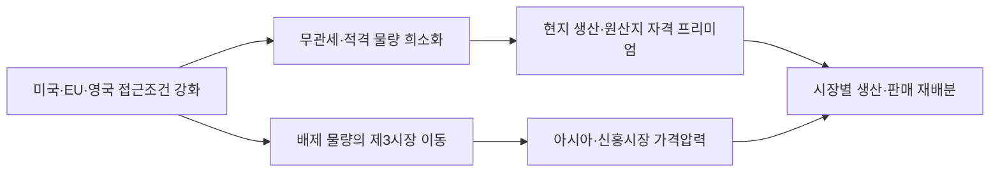

## 수입관세가 아니라 생산자격을 사는 경쟁으로 바뀌었다

**판단 질문:** 미국·EU·영국의 장벽 강화에 수출가격과 쿼터 배분만으로 대응할 것인가, 현지 생산·가공·원산지 자격을 시장별로 확보할 것인가?

**잠정 결론:** 2027년 판매계획은 수출 가능한 총물량보다 보호시장 안에서 인정되는 생산자격과 고객별 관세 전가력을 기준으로 다시 배분해야 합니다. 현지 생산 투자는 모든 시장에 일괄 적용하지 말고, 장기 고객물량이 관세·쿼터 비용과 투자비를 함께 회수하는 시장에 한정해야 합니다.

**확인된 변화:** 2026년 미국은 일부 자본재 철강에 최소 85% 미국 내 용해·주조 기준을 제시했고 관련 관세체계를 2027년 말까지 적용합니다. EU는 기존 세이프가드를 대체할 제안에서 무관세 물량을 18.3백만 톤으로 줄이고 초과관세 50%와 원산지 추적 강화를 결합했습니다. 영국도 2026년 7월부터 무관세 쿼터를 종전 대비 51% 줄이고 초과분에 50% 관세를 적용했습니다. 인도는 열연제품 세이프가드에 이어 2026년 반덤핑 조사까지 열었습니다. 방향은 지역마다 다르지만 결과는 같습니다. 시장 접근권이 톤당 가격에서 생산지·용해지·고객용도·쿼터 순번의 결합자격으로 이동하고 있습니다.

## 세계 과잉설비가 보호시장 밖 마진을 더 누른다

**사업 영향 경로:** OECD는 2025년 세계 철강 초과설비를 약 6억4천만 톤, 2028년을 7억4천5백만 톤으로 봤고 수요 증가율은 연 0.9% 수준으로 전망했습니다. 중국의 2025년 철강 수출은 1억3천1백만 톤으로 사상 최고였습니다. 보호시장 쿼터가 줄면 배제된 물량이 다른 지역으로 이동해 가격을 누를 수 있습니다. 따라서 미국·EU·영국 판매 감소만 계산하면 부족합니다. 직접 장벽과 제3시장 가격하락을 분리해 봐야 합니다.

## 10만 톤 노출만으로도 의사결정 단위가 달라진다

공개된 POSCO의 시장별 실제 노출은 확인되지 않았으므로 민감도 모델은 회사 실적 예측이 아닙니다. 예시로 관세 대상 10만 톤, 가격 800달러/톤, 관세 50%이면 총 관세노출은 4천만 달러입니다. 고객 전가율이 30%면 회사 측 순노출은 2천8백만 달러, 70%면 1천2백만 달러입니다. 이 범위가 현지 가공·지분투자의 연간 자본비와 운영비보다 큰 고객군에서만 현지화가 경제적입니다.

| 시나리오 | 조건 | 연간 순관세 노출 예시 | 우선 대응 |
| --- | --- | ---: | --- |
| 방어 | 5만 톤·600달러·관세 10%·전가 70% | 0.9백만 달러 | 쿼터·가격조정으로 대응 |
| 기준 | 10만 톤·800달러·관세 50%·전가 50% | 20백만 달러 | 고객별 장기계약과 현지 가공 비교 |
| 압박 | 25만 톤·1,000달러·관세 50%·전가 30% | 87.5백만 달러 | 현지 생산·JV·제품철수까지 재검토 |

총관세와 순영향을 구분해야 합니다. 고객이 부담한 관세는 포스코 손실이 아니며, 판매량 감소와 제3시장 가격하락도 같은 충격으로 중복 합산하면 안 됩니다. 내부 모델에는 시장·제품별 노출톤, 실제 계약가격, 관세 귀속, 쿼터 소진순서, 현지화 투자비를 넣어야 합니다.

## 2027년 판매계획 전에 고객별 접근권 원장을 만든다

**관찰 지표:** 고객 주문과 제품 단위로 다음을 봅니다.

- 용해·주조국, 최종가공국, 품목코드와 쿼터 소진률
- 관세부담 주체, 실제 가격전가율과 계약갱신일
- 저탄소 조달자격과 현지 생산·가공의 증분비용
- 보호시장 배제 물량과 동남아·중동 제품별 가격

**다음 산출물:**

1. 고객·주문별 용해·주조국, 쿼터, 관세 귀속을 묶은 접근권 원장
2. 3년 최소구매를 전제로 한 수출 유지·현지 가공·현지 생산·철수의 NPV 비교표
3. 보호시장 배제 물량의 제품별 제3시장 가격 전이 모니터

**확인 담당:** 포스코 통상·마케팅·생산전략·해외투자 담당입니다.

**감지 트리거:** EU 최종 법문과 쿼터 배분, 미국 적용품목별 85% 인증절차, 영국 쿼터 소진속도, 인도 반덤핑 예비판정입니다.

**반증 조건:** 최종 제도에서 원산지·저탄소 생산자격이 약화되고 주요 고객이 관세를 대부분 부담하며, 제3시장 가격도 방어되면 현지화의 긴급도를 낮춥니다.

**필요한 내부 데이터:** 시장·제품·고객별 2027~2029 계약물량, 용해·주조와 가공 경로, 관세 귀속, 가격전가율, 쿼터 사용량, 현지 투자비와 가동률입니다.

!!! warning "판단의 한계"

    EU 조치는 입법 절차와 세부 배분이 남아 있고 미국 85% 기준은 적용 대상별 확인이 필요합니다. 공개자료만으로 POSCO의 실제 노출톤과 계약상 관세부담을 알 수 없어, 정량치는 의사결정 민감도이지 실적 전망이 아닙니다.
