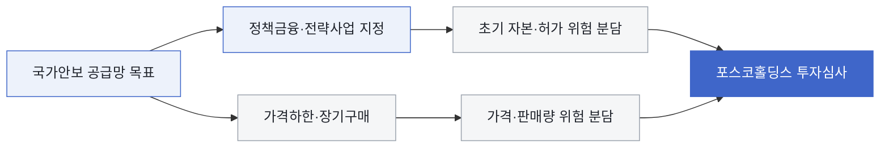

### 판단 질문과 잠정 결론

포스코홀딩스의 전략광물 신규 진입은 광산 또는 설비를 먼저 찾기보다 정부·고객과 가격·물량·금융 조건을 먼저 설계해야 합니까? **예. 미국의 확정 계약과 EU의 전략사업 선정은 국가안보형 공급망에서 사업성의 일부가 시장가격 밖의 장기 약정으로 만들어지고 있음을 보여줍니다.** 후보광물 심사표에 정책 적격성과 앵커 수요계약을 독립 기준으로 넣어야 합니다.

### 정책 관심과 실제 현금흐름 사이의 간극

일반적인 해석은 정부가 핵심광물을 지정하면 보조금이 따라오고 사업성이 좋아진다는 것입니다. 확인된 계약은 더 구체적입니다. 미국 국방부와 MP Materials의 계약은 우선주·대출뿐 아니라 10년 가격하한과 자석 구매계약을 묶었습니다. EU는 희토류와 텅스텐을 포함한 전략사업을 역내외에서 선정해 채굴·가공·재활용·대체 역량을 지원합니다. 즉 정부지원은 단순 보조금이 아니라 판매가격, 최소수요, 허용국가, 지배구조와 사업단계에 조건을 붙일 수 있습니다. 포스코홀딩스도 “어떤 광물을 살 것인가”에 앞서 “어떤 국가안보 수요와 계약을 묶을 것인가”를 정해야 합니다.

### 기회·위험·미실행 기회비용

- **포착할 기회:** 한국·미국·EU가 공통으로 우선하는 희토류·텅스텐 후보에서 국내외 앵커 고객, 정책금융, 원료 파트너를 묶으면 현물가격 의존도를 낮춘 합작 구조를 만들 수 있습니다.
- **방어할 위험:** 해외 정부지원에는 판매 제한, 원산지, 지배구조, 특정 구매자 배제 같은 조건이 붙을 수 있습니다. 지원 규모만 보고 들어가면 포스코홀딩스의 글로벌 판매·파트너 선택이 제한될 수 있습니다.
- **미실행 기회비용:** 경쟁사가 10년 구매권과 전략사업 지위를 선점한 뒤 접근하면 우량 원료, 정책자금, 고객 공동개발의 선택권이 줄고 독자 부담 자본이 커질 수 있습니다.
- **결정 전환 조건:** 후보사업이 최소구매·가격보호·정책금융 중 두 가지 이상을 확보하고 지배구조 제한을 수용할 수 있으면 우선 협상으로 전환합니다. 하나도 없으면 광물가격 전망만으로 투자하지 않습니다.

### 확인된 변화와 시점

MP Materials는 2025년 7월 미국 국방부와 4억 달러 우선주 투자, 사마륨 분리능력 확대용 1억5천만 달러 대출, NdPr kg당 110달러의 10년 가격보호, 신규 자석공장의 10년 구매계약을 체결했다고 SEC에 공시했습니다. 미국 국방부는 2025년 8월 1억5천만 달러 대출 실행을 별도로 확인했습니다. EU 집행위원회는 2025년 3월 역내, 6월 역외 핵심원자재 전략사업을 승인했고 대상 원자재에 희토류와 텅스텐을 포함했습니다. 사업 선정과 지원은 실행 기회를 높이지만 각 설비의 상업가동과 수익성을 보증하지는 않습니다.

### 포스코홀딩스에 전달되는 사업 영향

국가안보형 전략광물은 자산 자체보다 계약 묶음이 투자위험을 어떻게 나누는지가 핵심입니다.

### 사업 시나리오

| 시나리오 | 관찰 조건 | 예상되는 사업 의미 | 우선 대응 |
| --- | --- | --- | --- |
| 계약선행형 | 가격보호·최소구매·정책금융 중 두 가지 이상 확보 | 현물가격 하방과 초기자본 위험 완화 | 합작법인·분리정제·재활용 투자 우선 실사 |
| 지원선정형 | 전략사업 지위와 융자만 있고 구매계약 없음 | CAPEX는 낮아져도 판로 위험 잔존 | 고객 조건부 계약을 투자승인 선행조건으로 설정 |
| 시장단독형 | 정책·앵커계약 없이 광물가격 상승만 존재 | 가격하락 시 손실이 회사에 집중 | 구매권·소수지분 등 옵션형 접근으로 제한 |

이 표는 지원을 받으면 무조건 투자한다는 기준이 아니라 정부·고객·투자자가 부담할 위험을 분해하는 기준입니다.

### 지금 확인할 지표

- 후보광물별 한국·미국·EU 정책 적격성과 허용국가·지배구조 조건 — 가능한 파트너와 입지를 가릅니다.
- 국내외 고객의 최소구매량·가격공식·품질·원산지 요구 — 매출 하방을 계산하게 합니다.
- 정부 지원이 지분, 대출, 보조금, 가격보호 중 어느 형태인지 — 자본비용과 통제권을 바꿉니다.
- 채굴·분리정제·재활용·자석 단계별 원료수율과 상업가동 시점 — 지원기간과 현금흐름 시차를 확인합니다.

### 결론을 확정·폐기할 조건

- **이 분석이 틀렸다면:** 포스코홀딩스가 검토하는 후보에서 정책지원과 장기구매가 실제 계약으로 연결되지 않거나 조건부 제약이 사업가치보다 클 때입니다.
- **한 가지 확인:** 정부 또는 앵커 고객이 제시할 수 있는 최소구매·가격보호 조건서입니다.
- **감지 조건:** 한국 지원사업 공고, 미국 추가 국방물자생산법 계약, EU 2차 전략사업 선정, 후보 고객의 장기구매 입찰이 나오면 갱신합니다.

### 의사결정에 필요한 다음 산출물

1. 후보광물별 정책 적격성·앵커 고객·가격보호·최소구매·지배구조 제한 비교표
2. 시장단독, 정책금융, 계약선행 세 구조의 자본비용·통제권·하방위험 비교
3. 광산·분리정제·재자원화 단계별 정책지원 가능국가와 파트너 후보 지도
4. 정부·고객과 공동으로 작성할 비중국 공급망 사업개념서

!!! warning "판단의 한계"

    MP Materials 계약은 미국의 특정 회사·시설에 적용된 사례이고 EU 전략사업은 사업성 보증이 아닙니다. 포스코홀딩스의 후보광물, 투자한도, 원료권리, 고객계약이 확정되지 않아 현재 단계에서는 회사 손익액을 계산할 수 없습니다.
