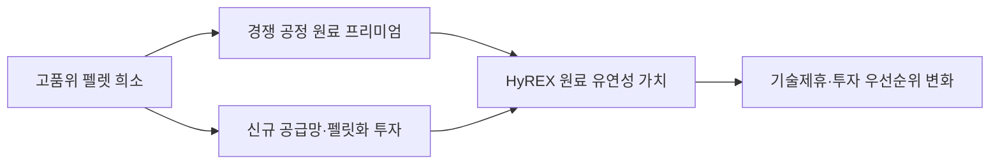

<!-- AUTO-GENERATED BY market-sensing-intelligence. DO NOT EDIT. -->

# 수소환원제철의 고품위 펠렛 병목

!!! abstract "한 문장 시그널"

    **포스코는 HyREX의 중·저품위 분광 활용이 상업 규모에서 입증되는지를 수소가격과 별도의 경쟁우위로 평가해 실증·제휴 투자기준에 반영해야 합니다.**

| 사업축 | 사업영향도 | 긴급도 | 평가일 |
| --- | ---: | ---: | --- |
| 철강 | **5/5** | **3/5** | 2026-08-19 |

**핵심 해석**

OECD는 다수의 수소 직접환원 공정이 요구하는 고품위 펠렛이 현재 해상 철광석 물량의 3~4%에 불과하다고 진단했습니다. HyREX가 중·저품위 분광을 직접 쓰는 성능을 상업 규모에서 검증하면 원료 유연성이 수소비용과 별개의 경쟁자산이 될 수 있습니다.

??? note "점수 근거"

    - **사업 영향:** 희소한 직접환원용 펠렛 의존도는 경쟁 공정의 원료비·공급안정성을 바꾸고 HyREX의 기술·제휴 가치를 재평가하게 합니다.
    - **긴급성:** 상업화 전 실증 지표와 원료 조달전략을 연결해야 하지만 즉시 시장접근을 잃는 규제 시한은 아직 없습니다.
    - **대응 시한:** 2027-03-31

!!! warning "기존 전제를 무엇이 깨는가"

    **기존 전제:** 수소환원제철 경쟁력은 주로 청정수소 가격과 환원·용융 설비효율로 결정된다는 전제입니다.

    **전제를 깨는 관측:** 다수 공정이 요구하는 철 67% 초과 저불순물 펠렛이 해상 철광석의 3~4%뿐이라는 원료 병목이 확인됐습니다.

    **바꿀 결정:** HyREX 실증의 광종별 총원가와 품질을 경쟁 샤프트로의 펠렛 프리미엄까지 포함해 기술제휴·투자기준으로 사용해야 합니다.

    **반증 확인:** 고품위 펠렛 공급이 충분히 확대되거나 HyREX의 추가 전력·슬래그 비용이 원료 절감보다 큰지 확인합니다.
**기회·위험·기회비용**

이 평가는 위협 회피뿐 아니라 유리한 조건을 먼저 잡지 못할 때 생기는 기회비용까지 함께 봅니다. 아래 내용은 연결 근거를 바탕으로 한 AI 분석입니다.

!!! success "포착할 기회"

    **조건:** 관찰 기준은 ‘분광 사용과 생산성·품질 동시 달성’입니다.

    **사업 효과:** 예상 사업 효과는 ‘기술제휴 자산 확대’입니다.

    **선제 행동:** 우선 행동은 ‘라이선스·원료 패키지 설계’입니다.

!!! danger "방어할 위험"

    **조건:** 관찰 기준은 ‘고품위 펠렛 공급이 빠르게 증가’입니다.

    **사업 효과:** 예상 사업 효과는 ‘HyREX 차별성 축소’입니다.

    **방어 행동:** 우선 행동은 ‘수소·효율 중심 비교 유지’입니다.

!!! warning "미실행 기회비용"

    ‘라이선스·원료 패키지 설계’ 대응을 늦추면 ‘기술제휴 자산 확대’ 기회를 놓치고, ‘HyREX 차별성 축소’ 상황이 현실화된 뒤에야 대응할 수 있습니다.

**결정 전환 조건:** ‘분광 사용과 생산성·품질 동시 달성’ 조건이 확인되면 기회 대응을 시작하고, ‘고품위 펠렛 공급이 빠르게 증가’ 조건이 확인되면 방어 결정으로 전환합니다.

## 고품위 펠렛 부족이 바꾸는 기술 경쟁 기준

**판단 질문:** 수소환원제철 경쟁력을 수소가격과 설비효율만으로 비교해도 되는가?

**잠정 결론:** 부족합니다. 다수의 샤프트로 방식은 고품위 직접환원용 펠렛에 의존하고, OECD는 현재 해상운송 철광석 중 해당 품질이 3~4%에 불과하다고 봅니다. HyREX가 중·저품위 분광 사용을 상업 규모에서 입증하면 원료 유연성이 별도의 경쟁우위가 될 수 있습니다.

**확인된 변화:** OECD Steel Outlook 2025는 수소 직접환원-전기로 전환의 병목으로 직접환원용 철광석 품질을 명시했습니다. 철 함량 67% 초과, 불순물이 낮은 직접환원용 펠렛은 현재 해상 물량의 3~4%뿐입니다. 이는 기술경쟁 평가가 수소비용 중심에서 원료 확보와 전처리비용까지 넓어져야 함을 뜻합니다. HyREX의 원료 유연성 주장은 새 발표가 아니라 기존 기술특성이지만, 외부 원료 병목이 커지면서 전략가치가 달라진 것입니다.

통념은 저탄소 제철의 승부가 저가 청정수소와 전력 확보에 달려 있다는 것입니다. 그 관점은 원료가 충분히 공급된다고 가정합니다. 원료 프리미엄과 조달능력이 수소가격과 함께 지배변수가 될 수 있습니다.

POSCO는 HyREX가 유동로와 전기용융로를 결합해 고품위 펠렛 대신 중·저품위 소결용 분광을 직접 사용할 수 있다고 설명합니다. 다만 현재는 실증플랜트 설계·건설 단계이므로 품질, 생산성, 슬래그량, 전력소비와 내화물 수명을 상업 규모로 확인해야 합니다.

## 원료 유연성이 만드는 별도 경쟁자산

**사업 영향:**



HyREX가 분광을 직접 쓰면서 동일 품질의 용선을 안정적으로 생산한다면 원료비뿐 아니라 펠릿화 설비와 장기 오프테이크 부담을 줄일 수 있습니다. 이는 자체 제철소 적용뿐 아니라 광산사·철강사와의 기술제휴 협상력에도 영향을 줍니다. 반대로 실증 생산성이 낮거나 슬래그·전력비가 늘면 원료 절감이 상쇄될 수 있습니다.

## 총현금원가로 갈리는 조건부 우위

**조건부 시나리오:**

| 시나리오 | 관찰 조건 | 예상되는 사업 의미 | 우선 대응 |
| --- | --- | --- | --- |
| 원료 병목 완화 | 고품위 펠렛 공급이 빠르게 증가 | HyREX 차별성 축소 | 수소·효율 중심 비교 유지 |
| 병목 지속 | 3~4% 수준과 프리미엄 지속 | 원료 유연성 가치 상승 | 광종별 실증 공개 |
| 상업 검증 | 분광 사용과 생산성·품질 동시 달성 | 기술제휴 자산 확대 | 라이선스·원료 패키지 설계 |

**이번 주 확인할 지표:**

- 직접환원용 펠렛 해상 물량, 프리미엄과 신규 펠릿화 CAPEX
- HyREX 실증의 광종별 환원율, 생산성, 슬래그, 전력소비
- 경쟁 샤프트로 프로젝트의 원료 장기계약과 지연 사유

## 상업 규모 검증을 위한 판단 기준

**결론 확정·폐기 조건:** HyREX 실증에서 중·저품위 분광 사용과 생산성·품질·원가가 동시에 검증되면 기회 판단을 강화합니다. 고품위 펠렛 공급이 충분히 확대되거나 HyREX의 추가 전력·슬래그 비용이 원료 절감을 넘으면 약화합니다. 한 가지 핵심 확인은 동일 용선 품질 기준의 광종별 총현금원가입니다.

**다음 산출물:**

1. 샤프트로와 HyREX의 수소·전력·원료·전처리 총원가 비교표
2. 고품위 펠렛 프리미엄별 기술가치 민감도
3. 실증 공개지표와 기술제휴 조건을 연결한 단계별 판단 기준

!!! warning "판단의 한계"

    OECD의 3~4%는 현재 해상운송 물량 기준이며 미래 공급 확대를 확정하지 않습니다. HyREX의 원료 유연성은 POSCO 설명으로 확인되지만 상업 규모의 생산성·원가·품질 데이터가 공개되지 않았습니다.

## 정량 영향 시뮬레이션

공개정보와 명시적 가정으로 계산한 예비 추정입니다. 숫자를 먼저 확인한 뒤 슬라이더로 가정을 바꾸면 결과가 즉시 갱신됩니다.

```impact-simulator
{"schema_version":1,"title":"DRI 원료 프리미엄의 제조원가 민감도","description":"고품위 펠렛 조달 프리미엄과 대체원료 사용률에 따른 연간 제조원가 노출입니다.","as_of":"2026-08-19","confidence":"low","notice":"공개자료와 넓은 AI 가정을 결합한 방향·민감도용 예비 계산입니다. POSCO의 실제 물량·가격·원가·계약조건 또는 공식 전망이 아니며 관련 Signal과 동일한 충격은 중복 합산하지 않습니다.","formula_display":"DRI 생산량 × 원료투입계수 × 펠렛 프리미엄 × 미대체율","variables":[{"id":"dri_output","label":"DRI 생산량","unit":"Mt/년","min":0.2,"max":8,"step":0.2,"default":2,"kind":"assumption","basis":"상업 규모 전환 시나리오 가정","source_ids":[]},{"id":"ore_intensity","label":"원료투입계수","unit":"t/t DRI","min":1.2,"max":1.8,"step":0.05,"default":1.4,"kind":"assumption","basis":"수율·환원조건을 포함한 예비 원료계수","source_ids":[]},{"id":"pellet_premium","label":"고품위 펠렛 프리미엄","unit":"USD/t","min":0,"max":100,"step":5,"default":30,"kind":"assumption","basis":"일반 철광석 대비 조달 프리미엄 가정","source_ids":[]},{"id":"unsubstituted","label":"펠렛 미대체율","unit":"fraction","min":0,"max":1,"step":0.05,"default":0.7,"kind":"assumption","basis":"HyREX 원료 유연성으로 대체하지 못하는 비율","source_ids":[]}],"outputs":[{"id":"net_impact","label":"연간 원료비 증가","unit":"USD m","decimals":1,"primary":true,"expression":{"op":"multiply","args":[{"var":"dri_output"},{"var":"ore_intensity"},{"var":"pellet_premium"},{"var":"unsubstituted"}]}}],"presets":[{"id":"defense","label":"방어","values":{"dri_output":0.8300000000000001,"ore_intensity":1.27,"pellet_premium":10.5,"unsubstituted":0.24499999999999997}},{"id":"base","label":"기준","values":{"dri_output":2,"ore_intensity":1.4,"pellet_premium":30,"unsubstituted":0.7}},{"id":"pressure","label":"압박","values":{"dri_output":5.9,"ore_intensity":1.6600000000000001,"pellet_premium":75.5,"unsubstituted":0.895}}]}
```

??? note "연결된 판단 근거"

    - **dri pellet fe requirement:** Fe 67% 초과, 저불순물 · [[sources/SRC-20260819-CE5F863E|원문 근거]]
    - **dri grade seaborne share:** 현재 해상 철광석 물량의 3~4% · [[sources/SRC-20260819-CE5F863E|원문 근거]]
    - **hyrex ore route:** 고품위 펠렛 대신 중·저품위 소결용 분광 직접 사용 · [[sources/SRC-20260819-E8EA9DEC|원문 근거]]
    - **hyrex current stage:** 실증플랜트 설계·건설 · [[sources/SRC-20260819-E8EA9DEC|원문 근거]]
    - **business axis:** 철강 · [[sources/SRC-20260819-CE5F863E|원문 근거]] · [[sources/SRC-20260819-E8EA9DEC|원문 근거]]
    - **business impact score 1 to 5:** 5 · [[sources/SRC-20260819-CE5F863E|원문 근거]] · [[sources/SRC-20260819-E8EA9DEC|원문 근거]]
    - **business impact rationale:** 희소한 직접환원용 펠렛 의존도는 경쟁 공정의 원료비·공급안정성을 바꾸고 HyREX의 기술·제휴 가치를 재평가하게 합니다. · [[sources/SRC-20260819-CE5F863E|원문 근거]] · [[sources/SRC-20260819-E8EA9DEC|원문 근거]]
    - **urgency score 1 to 5:** 3 · [[sources/SRC-20260819-CE5F863E|원문 근거]] · [[sources/SRC-20260819-E8EA9DEC|원문 근거]]
    - **urgency rationale:** 상업화 전 실증 지표와 원료 조달전략을 연결해야 하지만 즉시 시장접근을 잃는 규제 시한은 아직 없습니다. · [[sources/SRC-20260819-CE5F863E|원문 근거]] · [[sources/SRC-20260819-E8EA9DEC|원문 근거]]
    - **assessment confidence:** medium · [[sources/SRC-20260819-CE5F863E|원문 근거]] · [[sources/SRC-20260819-E8EA9DEC|원문 근거]]
    - **assessed at:** 2026-08-19 · [[sources/SRC-20260819-CE5F863E|원문 근거]] · [[sources/SRC-20260819-E8EA9DEC|원문 근거]]
    - **impact path:** 고품위 펠렛 희소 → 경쟁 공정 원료 프리미엄·전처리 투자 → HyREX 원료 유연성 가치 변화 → 실증·제휴 투자 우선순위 변화 · [[sources/SRC-20260819-CE5F863E|원문 근거]] · [[sources/SRC-20260819-E8EA9DEC|원문 근거]]
    - **recommended follow up:** 샤프트로와 HyREX의 수소·전력·원료·전처리 총원가를 동일 용선 품질 기준으로 비교하는 광종별 검증표 작성 · [[sources/SRC-20260819-CE5F863E|원문 근거]] · [[sources/SRC-20260819-E8EA9DEC|원문 근거]]

## 원문

- **OECD Steel Outlook 2025: hydrogen DRI raw-material bottleneck** · OECD · 2025-05-20 · [원문 링크](https://www.oecd.org/content/dam/oecd/en/publications/reports/2025/05/oecd-steel-outlook-2025_bf2b6109/28b61a5e-en.pdf) · [[sources/SRC-20260819-CE5F863E|보관 원문]]
- **POSCO HyREX raw-material route** · POSCO · 게시일 미상 · [원문 링크](https://hyrex.posco.com/T54/T54A01/t54a01300e.do) · [[sources/SRC-20260819-E8EA9DEC|보관 원문]]
