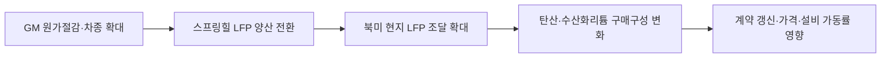

<!-- AUTO-GENERATED BY market-sensing-intelligence. DO NOT EDIT. -->

# GM이 북미 LFP 양산 시점을 2027년으로 제시했다

!!! abstract "한 문장 시그널"

    **북미 고니켈 수요가 규제만으로 방어된다는 전제보다 고객별 LFP 전환과 계약 갱신 시점을 먼저 확인해야 합니다.**

| 사업축 | 사업영향도 | 긴급도 | 평가일 |
| --- | ---: | ---: | --- |
| 리튬 | **4/5** | **4/5** | 2026-08-19 |

**핵심 해석**

GM은 기존 NCMA 셀을 생산하는 스프링힐 공장에 LFP 라인을 추가하고 2027년 말 상업생산을 목표로 제시했습니다. 이는 미국 LFP 비중이 아직 낮아도 현지 공급망을 갖춘 완성차가 다화학계 전략으로 움직인다는 행동 근거입니다. 포스코홀딩스는 북미 고객계약에서 수산화리튬 노출물량과 갱신시점을 분리해 봐야 합니다.

??? note "점수 근거"

    - **사업 영향:** 완성차의 현지 LFP 양산은 고객별 리튬염 구매구성과 수산화리튬 장기계약 갱신에 직접 영향을 줄 수 있습니다.
    - **긴급성:** 2027년 말 양산 목표보다 앞서 샘플승인과 계약변경이 진행될 수 있어 다음 계약주기 전에 확인이 필요합니다.
    - **대응 시한:** 2026-10-31
**기회·위험·기회비용**

이 평가는 위협 회피뿐 아니라 유리한 조건을 먼저 잡지 못할 때 생기는 기회비용까지 함께 봅니다. 아래 내용은 연결 근거를 바탕으로 한 AI 분석입니다.

!!! success "포착할 기회"

    **조건:** 관찰 기준은 ‘GM LFP가 일부 저가 차종에 한정되고 NCMA 물량이 계획대로 증가’입니다.

    **사업 효과:** 예상 사업 효과는 ‘수산화리튬 물량의 단기 방어 가능’입니다.

    **선제 행동:** 우선 행동은 ‘차종별 배터리 계획과 고객계약 대조’입니다.

!!! danger "방어할 위험"

    **조건:** 관찰 기준은 ‘LFP 양산이 앞당겨지고 픽업·대중차로 확대되며 고니켈 물량이 지연’입니다.

    **사업 효과:** 예상 사업 효과는 ‘수산화리튬 판매성장과 설비 가동률 하방’입니다.

    **방어 행동:** 우선 행동은 ‘증설 순서와 탄산 전환투자 재검토’입니다.

!!! warning "미실행 기회비용"

    ‘차종별 배터리 계획과 고객계약 대조’ 대응을 늦추면 ‘수산화리튬 물량의 단기 방어 가능’ 기회를 놓치고, ‘수산화리튬 판매성장과 설비 가동률 하방’ 상황이 현실화된 뒤에야 대응할 수 있습니다.

**결정 전환 조건:** ‘GM LFP가 일부 저가 차종에 한정되고 NCMA 물량이 계획대로 증가’ 조건이 확인되면 기회 대응을 시작하고, ‘LFP 양산이 앞당겨지고 픽업·대중차로 확대되며 고니켈 물량이 지연’ 조건이 확인되면 방어 결정으로 전환합니다.

## 북미 LFP 제한 전제를 흔드는 GM의 2027년 양산 목표

**판단 질문:** 북미 고객은 규제와 공급망 제약 때문에 LFP 채택이 제한될 것이라는 전제를 유지해도 되는가?

**잠정 결론:** 미국의 실제 LFP 사용 비중은 아직 낮지만, 현지 공급망을 갖춘 대형 완성차가 양산전환을 시작한 만큼 2027년 이후의 고객별 제품구성은 별도 시나리오로 반영해야 합니다. GM의 행동은 세계 점유율 자료가 북미 계약시장에도 전달될 가능성을 높이는 선행지표입니다.

GM의 북미 LFP 양산 전환은 전망이 아니라 고객 행동입니다. 고니켈 계열을 유지하면서도 기존 합작공장에 LFP 라인을 추가하고 2027년 상업생산 시점을 제시했기 때문에, 포스코홀딩스는 비중국 시장에서 수산화리튬 수요가 자동으로 방어된다는 가정을 다시 확인해야 합니다.

**확인된 변화:** GM은 2025년 7월 테네시 스프링힐의 Ultium Cells 공장에 LFP 생산을 추가한다고 발표했습니다. 기존 NCMA 파우치셀과 병행하며, LFP 라인 공사를 시작해 2027년 말 상업생산을 목표로 제시했습니다. LFP는 저가형 전기차뿐 아니라 대형 전기 픽업에도 활용할 수 있는 선택지로 설명되었습니다. 이는 고니켈 화학계의 전면 교체가 아니라 제품군별 다화학계 운영으로의 변화입니다.

## 다화학계 전환과 수산화리튬 계약 갱신의 연결

**사업 영향:** 전달 경로는 `완성차 원가절감 목표 → 북미 LFP 현지생산 → 고객별 양극재·리튬염 구매구성 변화 → 수산화리튬 계약 갱신·가격 협상 변화`입니다. GM 한 회사의 발표만으로 시장 전체를 단정할 수는 없지만, 2027년 생산 목표는 장기계약과 증설계획을 지금 검토해야 할 시한을 만듭니다. 특히 포스코의 고객 포트폴리오가 북미 고니켈 계열에 집중되어 있다면 실제 영향은 세계 평균보다 늦게 오더라도 계약 갱신 시점에 한꺼번에 나타날 수 있습니다.



## 양산 진척과 고객계약을 겹친 전환 시계

**조건부 시나리오:**

| 시나리오 | 확인 조건 | 사업 의미 | 우선 대응 |
| --- | --- | --- | --- |
| 방어 | GM LFP가 일부 저가 차종에 한정되고 NCMA 물량이 계획대로 증가 | 수산화리튬 물량의 단기 방어 가능 | 차종별 배터리 계획과 고객계약 대조 |
| 기준 | LFP와 NCMA가 차종별로 병행되고 다른 완성차도 현지 LFP를 추가 | 북미 수요가 총량보다 제품 믹스 중심으로 분화 | 계약 갱신에 제품 전환 조항 반영 |
| 압박 | LFP 양산이 앞당겨지고 픽업·대중차로 확대되며 고니켈 물량이 지연 | 수산화리튬 판매성장과 설비 가동률 하방 | 증설 순서와 탄산 전환투자 재검토 |

**이번 주 확인할 지표:**

- 스프링힐 LFP 라인의 공사·샘플승인·양산 일정: 발표가 실제 물량으로 전환되는 시점을 확인합니다.
- GM 차종별 LFP·NCMA 탑재계획과 배터리 용량: 제품별 리튬염 수요를 계산합니다.
- 북미 완성차의 추가 LFP 현지화 발표: GM 사례가 단독인지 구조적 변화인지 판별합니다.
- 포스코 고객별 계약 갱신일과 제품 규격: 시장 전환이 가격·물량에 반영되는 시점을 확인합니다.

**다음 산출물:**

1. 북미 완성차별 2027~2030년 화학계·차종·배터리용량 매트릭스
2. 포스코 고객계약 갱신일과 수산화리튬 노출물량을 겹친 전환 일정표
3. GM 양산 지연·기준·조기전환에 따른 제품별 가동률 및 현금흐름 시나리오

## 조건부 경고를 확정하거나 낮출 양산 증거

GM이 LFP 상업생산을 취소·대폭 연기하거나 LFP 적용차종이 제한되고 북미 고니켈 계약이 기존 계획 이상으로 확정되면 이 신호의 긴급도를 낮춥니다. 반대로 2027년 전에 샘플승인과 양산설비 전환이 확인되고 다른 북미 완성차 두 곳 이상이 같은 방향으로 움직이면 수산화리튬 제품계획 경고를 강화합니다.

**판단의 한계:** GM 발표는 생산능력 규모와 실제 조달계약을 공개하지 않았습니다. 또한 미국 LFP 비중은 2025년에 감소했고 고니켈은 장거리·한랭지에서 성능상 우위가 있습니다. 따라서 이 신호는 북미 수산화리튬 수요의 소멸이 아니라 고객전환 가능성을 계약 시계열에 반영하라는 선행경고입니다.

!!! warning "판단 경계"

    발표된 목표일을 확정 물량으로 보지 않습니다. 공사·승인·차종 배정과 내부 계약자료가 확인될 때까지 조건부 신호로 유지합니다.

## 정량 영향 시뮬레이션

공개정보와 명시적 가정으로 계산한 예비 추정입니다. 숫자를 먼저 확인한 뒤 슬라이더로 가정을 바꾸면 결과가 즉시 갱신됩니다.

```impact-simulator
{"schema_version":1,"title":"GM LFP 전환의 수산화리튬 매출 노출","description":"북미 LFP 양산이 고니켈 양극재용 수산화리튬 수요를 대체할 때의 연간 매출 민감도입니다.","as_of":"2026-08-19","confidence":"low","notice":"공개자료와 넓은 AI 가정을 결합한 방향·민감도용 예비 계산입니다. POSCO의 실제 물량·가격·원가·계약조건 또는 공식 전망이 아니며 관련 Signal과 동일한 충격은 중복 합산하지 않습니다.","formula_display":"노출물량 × 제품가격 × 실제 LFP 전환율 × 미완화율 ÷ 1,000","variables":[{"id":"volume","label":"GM 연계 수산화리튬 노출물량","unit":"kt/년","min":1,"max":50,"step":1,"default":10,"kind":"assumption","basis":"GM·공급망 계약의 내부 물량으로 교체할 가정","source_ids":[]},{"id":"price","label":"수산화리튬 가격","unit":"USD/t","min":8000,"max":30000,"step":1000,"default":12000,"kind":"assumption","basis":"북미 계약가격 대용 범위","source_ids":[]},{"id":"conversion","label":"LFP 실제 전환율","unit":"fraction","min":0,"max":1,"step":0.05,"default":0.7,"kind":"assumption","basis":"2027년 양산계획이 실제 판매로 전환되는 비율","source_ids":[]},{"id":"unmitigated","label":"제품전환 미완화율","unit":"fraction","min":0,"max":1,"step":0.05,"default":0.6,"kind":"assumption","basis":"탄산리튬·다른 고객으로 상쇄하지 못하는 비율","source_ids":[]}],"outputs":[{"id":"net_impact","label":"연간 수산화리튬 매출 노출","unit":"USD m","decimals":1,"primary":true,"expression":{"op":"divide","args":[{"op":"multiply","args":[{"var":"volume"},{"var":"price"},{"var":"conversion"},{"var":"unmitigated"}]},1000]}}],"presets":[{"id":"defense","label":"방어","values":{"volume":4.15,"price":9400.0,"conversion":0.24499999999999997,"unmitigated":0.21}},{"id":"base","label":"기준","values":{"volume":10,"price":12000,"conversion":0.7,"unmitigated":0.6}},{"id":"pressure","label":"압박","values":{"volume":36.0,"price":23700.0,"conversion":0.895,"unmitigated":0.86}}]}
```

??? note "연결된 판단 근거"

    - **spring hill lfp commercial production target:** 2027년 말 · [[sources/SRC-20260819-55D3797D|원문 근거]]
    - **spring hill battery chemistry strategy:** 기존 NCMA와 LFP를 병행하는 다화학계 생산 · [[sources/SRC-20260819-55D3797D|원문 근거]]
    - **global lfp ev battery share 2025:** 55% 초과 · [[sources/SRC-20260819-3F479FFE|원문 근거]]
    - **us battery capacity reallocated to lfp 2025:** 50 GWh 초과 · [[sources/SRC-20260819-3F479FFE|원문 근거]]
    - **preferred lithium compound for lfp:** 탄산리튬 선호 · [[sources/SRC-20260819-3EDE7B8B|원문 근거]]
    - **preferred lithium compound for nmc:** 수산화리튬 선호 · [[sources/SRC-20260819-3EDE7B8B|원문 근거]]
    - **business axis:** 리튬 · [[sources/SRC-20260819-55D3797D|원문 근거]]
    - **business impact score 1 to 5:** 4 · [[sources/SRC-20260819-55D3797D|원문 근거]] · [[sources/SRC-20260819-3EDE7B8B|원문 근거]]
    - **business impact rationale:** 완성차의 현지 LFP 양산은 고객별 리튬염 구매구성과 수산화리튬 장기계약 갱신에 직접 영향을 줄 수 있습니다. · [[sources/SRC-20260819-55D3797D|원문 근거]] · [[sources/SRC-20260819-3EDE7B8B|원문 근거]]
    - **urgency score 1 to 5:** 4 · [[sources/SRC-20260819-55D3797D|원문 근거]]
    - **urgency rationale:** 2027년 말 양산 목표보다 앞서 샘플승인과 계약변경이 진행될 수 있어 다음 계약주기 전에 확인이 필요합니다. · [[sources/SRC-20260819-55D3797D|원문 근거]]
    - **assessment confidence:** high · [[sources/SRC-20260819-55D3797D|원문 근거]] · [[sources/SRC-20260819-3F479FFE|원문 근거]]
    - **assessed at:** 2026-08-19 · [[sources/SRC-20260819-55D3797D|원문 근거]]
    - **impact path:** GM 현지 LFP 양산 → 북미 고객의 화학계 구성 변화 → 리튬염 구매·계약갱신 → 수산화리튬 물량·가격 영향 · [[sources/SRC-20260819-55D3797D|원문 근거]] · [[sources/SRC-20260819-3EDE7B8B|원문 근거]]
    - **recommended follow up:** GM 공사·샘플승인·차종배정과 포스코 고객계약 갱신일을 2026-10-31까지 대조 · [[sources/SRC-20260819-55D3797D|원문 근거]]

## 원문

- **From Tennessee to Michigan, GM is building a battery-powered future** · General Motors · 2025-07-14 · [원문 링크](https://news.gm.com/home.detail.html/Pages/topic/us/en/2025/jul/0714-Tennessee-Michigan-battery-powered-future.html) · [[sources/SRC-20260819-55D3797D|보관 원문]]
- **Global EV Outlook 2026 - Electric vehicle batteries** · International Energy Agency · 2026-05-20 · [원문 링크](https://www.iea.org/reports/global-ev-outlook-2026/electric-vehicle-batteries) · [[sources/SRC-20260819-3F479FFE|보관 원문]]
- **Supply Chain Readiness Level Preliminary Analysis: Batteries Summary** · U.S. Department of Energy · 2024-11-01 · [원문 링크](https://www.energy.gov/sites/default/files/2024-12/Supply_Chain_Readiness_Level_%28SCRL%29_Analysis_Nov2024--2024.12.04.pdf) · [[sources/SRC-20260819-3EDE7B8B|보관 원문]]
