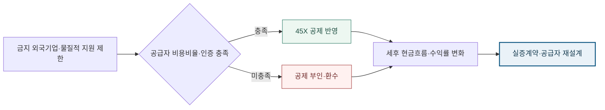

<!-- AUTO-GENERATED BY market-sensing-intelligence. DO NOT EDIT. -->

**POSCO Holdings**{ .signal-pill .signal-pill-company .signal-company-name aria-label="회사 POSCO Holdings" } **리튬**{ .signal-pill .signal-pill-axis aria-label="사업축 리튬" } **정책·규제**{ .signal-pill .signal-pill-type aria-label="변화 유형 정책·규제" }
{ .signal-detail-context .strategic-issue-context aria-label="회사, 사업축과 변화 유형" }

# 미국 리튬 세액공제의 새 관문은 공장 밖 공급망 검증

**이 이슈의 위치** · **경영 Function:** 전략·투자 · 구매·공급망 · 재무 · **지역·시장:** 미국 배터리 공급망 · 북미 리튬 시장 · **시간:** 실증·상업투자 전 적격성 확정 시점

**왜 우리 회사 이슈인가 · 핵심 관심** · 미국 리튬 실증비, 원료·공정 공급자, 생산세액공제 적격 비용과 향후 상업투자 현금흐름이 직접 노출됩니다. **바꿀 결정:** 공급망 적격성이 확인될 때까지 미국 생산세액공제를 0%로 두고 투자안을 평가할지 결정해야 합니다.

??? info "회사 연결 근거"

    **공식 사업 근거:** 포스코홀딩스는 미국 직접리튬추출 실증과 북미 비중국 리튬 공급망 옵션을 추진해 생산세액공제 적격성과 공급자 구조가 투자안에 직접 연결됩니다.

    **전달 경로:** 금지 외국기업 규칙이 공급자 인증과 적격비용을 바꾸면 세액공제·현금흐름·투자수익률이 연쇄적으로 달라집니다.

    **회사 공식 원문:** [[sources/SRC-20260819-8048735E|회사 공식 근거 1]]

!!! warning "대응 검토 · 활성 · 기회·위험 혼재"

    **판단 질문:** 미국 리튬 실증을 계속하되 생산세액공제를 전액 가정할 것인가, 공급망 적격성이 확인될 때까지 공제 0%를 기준으로 둘 것인가?

    **잠정 결론:** 공제액을 사업성에 넣기 전에 공급자별 비적격 비용비중과 계약상 통제권을 계산해야 합니다.

    **다음 사업 분기점:** 미국 리튬 실증의 공급자 명세·비용비율·인증 패키지 확정

**세 숫자로 읽는 시장 전환**

| **2025-07-04 이후 date** | **2026년 2월 12일** | **2025년 7월 4일 이후 시작 과세연도** |
| ---: | ---: | ---: |
| 금지 외국기업 제한 적용 과세연도 시작 기준 | 변화 시점 | 변화 시점 |
| 법인·재료·공정 비용과 인증을 투자 전에 추적해야 합니다. | 물질적 지원 비용비율과 임시 안전기준 안내 | 금지 외국기업 관련 제한 적용 |
| [[sources/SRC-20260819-53232380|근거 1]] · [[sources/SRC-20260819-F58609F2|근거 2]] | [[sources/SRC-20260819-F58609F2|근거 1]] | [[sources/SRC-20260819-53232380|근거 1]] |

**비적격 비용비중이 45X 순가치를 얼마나 지우는가**

**읽는 법:** 적격 생산비가 같아도 비적격 비용과 준수비가 늘면 공제 순가치가 빠르게 줄어 공급자 장부가 기술실증의 선행조건이 됩니다.
{ .strategic-quant-lead }

| 시나리오 | 연간 세액공제 순가치 | 비적격 비용비중 | 연간 준수·대체조달 비용 |
| --- | --- | --- | --- |
| 방어 | 8 USD m/년 | 10% | 1 USD m/년 |
| 기준 | 3 USD m/년 | 50% | 2 USD m/년 |
| 압박 | -5 USD m/년 | 100% | 5 USD m/년 |

_단위 표 안에 표시 · 기준일 2026-08-19 · 회사 실제값이 아닌 민감도 · [[sources/SRC-20260819-53232380|근거 1]] · [[sources/SRC-20260819-F58609F2|근거 2]] · [[sources/SRC-20260819-3C4323B0|근거 3]]_

_계산·범위: 생산비 × 공제율 × (1 - 비적격 비용비중) - 연간 준수비용 공개 제도와 AI 가정을 결합한 예비 계산이며 POSCO 실제 생산비·세액공제·세무의견이 아닙니다._

## 생산지에서 공급자 비용장부로 이동한 공제 기준

법은 지분 25%, 합산 지분 40%, 특정 채무 15% 같은 정량 문턱과 계약상 실질통제를 함께 봅니다. 지분율만 통과해도 공급처 지정·운영 지시·장기 로열티 같은 권리가 남으면 적격성은 다시 흔들릴 수 있습니다.

45X는 미국 안에서 적격 부품·광물을 생산하고 판매할 때 주는 생산세액공제입니다. 그러나 2025년 7월 4일 이후 시작하는 과세연도에는 금지 외국기업의 소유·영향과 해당 기업에서 받은 물질적 지원이 공제 적격성을 제한할 수 있습니다. 2026년 IRS 지침은 비용비율과 임시 안전기준을 제시했지만 향후 표와 세부 해석이 바뀔 여지도 남겼습니다. 이제 판단 단위는 미국 공장의 연간 생산량만이 아니라 공급자별 재료·장비·공정·기술사용료 비용과 인증 가능성입니다.

**기술 실증 성공과 세액공제 성공을 분리할 필요.**

미국에서 리튬 전환공정의 수율과 품질을 입증하면 공제까지 따라온다는 전제는 안전하지 않습니다. 실증이 성공해도 금지 외국기업의 소유관계, 핵심 시약·장비·기술사용료, 공급자 인증이 기준을 넘거나 끊기면 예상 공제액이 줄 수 있습니다. 반대로 공제 0%에서도 경제성이 있는 사업이라면 규정 변동 위험을 감당할 수 있습니다. 따라서 기술·상업·세무 검증을 순차적으로 하지 말고, 공급망 적격성과 공제 제외 현금흐름을 실증계약 체결 전에 병렬로 확인해야 합니다.

**변화와 분기점**

| 시점 | 구분 | 확인된 변화·판단 |
| --- | --- | --- |
| **2024년 12월 16일** | 공개 | 45X 최종규정 계산맥락 공개 |
| **2025년 7월 4일 이후 시작 과세연도** | 시행 | 금지 외국기업 관련 제한 적용 |
| **2026년 2월 12일** | 공개 | 물질적 지원 비용비율과 임시 안전기준 안내 |

## 공제액보다 환수와 계약교체 비용이 더 늦게 드러나는 구조

상단 정량표는 적격 생산비가 같아도 비적격 비용과 준수비가 늘면 공제 순가치가 빠르게 줄어 공급자 장부가 기술실증의 선행조건이 됩니다. 단위와 기준일을 확인하고, 회사 실제 실적 전망이 아닌 민감도 결과로 읽어야 합니다.

직접 영향은 세후 현금흐름입니다. 예상 공제를 투자안에 넣었다가 사후 부인되면 공제 감소뿐 아니라 이자·세무비용·자금조달 약정과 투자수익률이 함께 흔들릴 수 있습니다. 공급자를 뒤늦게 바꾸면 재인증, 품질실증, 납기지연과 가격재협상이 발생합니다. 반대로 적격 공급자와 비용·원산지 자료 제공을 계약화하면 공제를 보수적으로 반영하고 고객에게 비중국 공급망 가치를 설명할 수 있습니다. 회사 실제 비용명세가 공개되지 않았으므로 현재 모델 범위는 방향·민감도이며 세무의견을 대체하지 않습니다.

**공급망 증빙이 45X 현금흐름을 가르는 적격성 경로**

_구조 선택 근거: 생산량이 같아도 소유·재료·공정 비용과 인증 상태에 따라 공제가 갈리므로 공급자 증빙에서 현금흐름이 분기되는 구조를 사용했습니다._

**기회·위험·미실행 비용의 분기**

| 판단 축 | 성립 조건 | 사업 효과와 행동 |
| --- | --- | --- |
| **기회** | 공급자 인증과 금지 외국기업 비용비율이 안전기준 안에서 확인될 때 | **효과:** 미국 생산세액공제를 현금흐름에 반영해 현지 생산의 세후 경제성을 개선 **행동:** 적격 공급자와 장기계약하고 비용·원산지 증빙을 상시 보존 |
| **위험** | 소유·기술·재료 관여가 기준을 넘거나 인증이 끊길 때 | **효과:** 예상 공제 환수·부인으로 투자수익률과 자금조달 조건 악화 **행동:** 공제 0% 기준으로 투자심사를 낮추고 공급자·법인구조를 재설계 |
| **미실행 비용** | 판단을 미룰 때 | 실증 후에 적격성을 확인하면 이미 고정된 장비·기술·원료 계약을 바꾸는 시간과 협상력을 잃을 수 있습니다. |

**결정 전환 조건:** 공급자별 비용비율과 인증이 확인되면 공제를 반영하고, 하나라도 미확인이면 0% 또는 부분공제 방어안으로 전환합니다.

**판단 범위:** 미국 리튬 실증·상업투자 전 45X 적격성 설계 · 분석 신뢰도 높음

## 실증계약 전에 완성할 공급자별 적격성 장부

법인 지분과 영향관계를 먼저 도식화하고 장비, 시약, 원재료, 외주공정, 기술사용료를 공급자별 비용비율로 분해해야 합니다. 각 공급자에게 소유·원산지·공정·비용자료의 정기 갱신, 감사권, 허위 인증 시 손해배상과 대체공급 의무를 계약으로 요구합니다. 투자안은 공제 0%, 부분공제, 대부분 공제의 세 가지 세후 현금흐름으로 비교하고 공제가 없어도 유지할 최소 수익률을 명시합니다. 기술실증의 성공기준에도 적격 공급자로 바꾼 뒤의 수율과 품질을 포함해야 합니다.

**결정을 미루지 않기 위해 먼저 완성할 세 가지 산출물**

| 순서·책임 | 이번에 만들 것 | 완료 후 판단 |
| --- | --- | --- |
| 1 · 포스코홀딩스 미국 리튬 사업개발·세무·법무·구매 담당 | 법인·장비·시약·원재료·기술사용료의 공급자별 비용명세를 만듭니다. | 두 번째 검증으로 이동 |
| 2 · 포스코홀딩스 미국 리튬 사업개발·세무·법무·구매 담당 | 공제 0%·부분·대부분의 세후 현금흐름을 같은 투자안에서 비교합니다. | 대안의 경제성과 실행 가능성 비교 |
| 3 · 포스코홀딩스 미국 리튬 사업개발·세무·법무·구매 담당 | 공급자 인증과 계약상 정보제공·손해배상 조항을 실증계약 전에 확정합니다. | 투자·계약·보류 중 하나를 선택 |

_문단에 흩어진 행동을 실행 순서와 완료 후 판단으로 재구성했습니다._

**권고 시한:** 2025-07-04

**안전기준 표와 공급자 인증 거부가 즉시 재판단 신호.**

외부에서는 IRS가 발표할 후속 안전기준 표, 금지 외국기업 정의와 계산예시, Form 7207 개정과 집행사례를 확인합니다. 내부에서는 공급자별 비용비율, 인증 미제출 건수, 대체공급자 전환기간, 공제 0%와 기준안의 NPV 차이를 관리합니다. 핵심 공급자가 자료 제공을 거부하거나 비용비율이 기준을 넘으면 공제 0% 방어안으로 즉시 전환합니다. 독립 세무검토와 인증이 모두 완결되면 그때만 공제를 기준 현금흐름에 단계적으로 반영합니다.

**세 확인선이 현재 결론을 강화하거나 낮춘다**

| 관찰 지표·책임 | 강화 신호 | 완화 신호 |
| --- | --- | --- |
| 1 · 포스코홀딩스 미국 리튬 사업개발·세무·법무·구매 담당 | 금지 외국기업 관련 비용비율이 임시 안전기준을 넘습니다. | 독립 세무검토에서 적격성이 확인되고 공급자 인증이 완결됩니다. |
| 2 · 포스코홀딩스 미국 리튬 사업개발·세무·법무·구매 담당 | 핵심 공급자가 인증이나 비용자료 제공을 거부합니다. | 공제 제외 시나리오에서도 투자수익률이 기준을 넘습니다. |
| 3 · 포스코홀딩스 미국 리튬 사업개발·세무·법무·구매 담당 | 미국 리튬 실증의 공급자 명세·비용비율·인증 패키지 확정 | 반증 조건이 확인되면 이슈 강도를 낮춥니다. |

_공식 발표와 내부 확인값이 바뀌면 같은 표에서 이슈 강도를 다시 판단합니다._

**결론을 바꾸는 조건**

| 이슈 강화 | 이슈 완화 |
| --- | --- |
| 금지 외국기업 관련 비용비율이 임시 안전기준을 넘습니다. | 독립 세무검토에서 적격성이 확인되고 공급자 인증이 완결됩니다. |
| 핵심 공급자가 인증이나 비용자료 제공을 거부합니다. | 공제 제외 시나리오에서도 투자수익률이 기준을 넘습니다. |

## IRS 규정·Form 7207·2026 지침의 역할 구분

45X 최종규정은 계산의 기본 구조를, Form 7207 지침은 적용 과세연도와 보고 항목을, 2026년 IRS 안내는 금지 외국기업 물질적 지원 비용비율과 임시 안전기준을 확인하는 근거입니다. 이 자료는 포스코 관련 법인의 실제 공제액을 확정하지 않으므로 공개 규칙과 회사 비용명세 사이의 빈칸을 명시적으로 남겼습니다.

**판단 메모:** 45X의 지배변수는 명목 공제율보다 적격비용 분모와 금지 외국기업 관련 비용의 추적 가능성입니다. 같은 생산량이라도 공급자 인증이 끊기거나 기술사용료·장비·시약의 실질 관여가 기준을 넘으면 현금흐름이 달라질 수 있습니다. 따라서 기술팀의 공정표와 구매팀의 공급자 명세, 법무의 소유·통제 분석, 세무의 비용비율 계산을 하나의 버전으로 관리해야 합니다. 투자위원회에는 공제 대부분, 부분, 0%의 세후 NPV뿐 아니라 공급자 교체에 필요한 재실증 기간과 고객승인 지연도 함께 제시해야 합니다. 공제 상방이 사라져도 사업이 유지되는지와, 적격성 확보를 위해 더 비싼 공급자로 바꿀 때 순가치가 좋아지는지를 동시에 비교해야 세액공제 극대화가 사업가치 훼손으로 바뀌는 것을 막을 수 있습니다.

**의사결정 연결:** 45X 제한의 적용 기준일은 이미 지났고 공급자 인증·비용추적이 사후 세무작업이 아니라 실증과 계약의 선행조건이 됐습니다. 이를 실행으로 옮길 첫 산출물은 ‘법인·장비·시약·원재료·기술사용료의 공급자별 비용명세를 만듭니다.’이며, 반증 조건이 확인되면 보고서 강도를 낮추고 이력에 근거를 남깁니다.

**연결된 마켓 시그널**

- [[signals/SIG-616AB52ADDF4|미국 리튬 세액공제의 공급망 요건 강화]] · 영향 5/5 · 긴급 5/5

??? note "세법 적격성을 공개자료만으로 확정하지 않는 경계"

    공개 IRS 자료는 일반 규칙이며 포스코홀딩스의 법인구조, 계약, 공급자별 비용과 실질 지배관계를 보여주지 않습니다. 임시 안전기준은 후속 표가 나오면 달라질 수 있고 실제 세무처리는 과세연도·거래구조·선택한 공제 방식에 따라 달라집니다. 따라서 이 보고서는 법률·세무 의견이 아니라 실증 전에 무엇을 증빙해야 하는지 정하는 의사결정 도구입니다. 공제 대부분을 받을 수 있다는 상방과 공제 0% 방어안을 함께 두되 확정 공제액으로 표현하지 않습니다.
??? info "문서 관리 정보"

    등록 2026-08-20 · 최근 확인 2026-08-20 · 다음 모니터링 2026-09-30

    **지속 관찰 원칙:** 반증 조건이 충족되거나 사람이 근거를 기록해 종료하기 전까지 유지하고 다음 검토일에 지표를 갱신합니다.

    | 날짜 | 조치 | 단계 변화 | 판단 근거 |
    | --- | --- | --- | --- |
    | 2026-08-21 | title_pattern_rewrite | - | 활성 이슈 목록의 반복적인 ~할 때·~먼저다 문형을 해소하고 이슈별 변화·간극·판단에 맞는 제목 구조로 재작성 |
    | 2026-08-20 | executive_title_rewrite | - | 법령 코드·영문 약어·단위·업계 은어를 제목에서 제거하고 임원이 사전 설명 없이 이해할 수 있는 시장 변화와 판단으로 재작성 |
    | 2026-08-20 | sparse_visual_rewrite | - | 2~3개 값과 시나리오를 강제 차트에서 가정·결과가 함께 보이는 정량표로 교체 |
    | 2026-08-20 | quantitative_rewrite | - | 공개 수치와 회사 민감도를 분리하고 첫 화면 정량 차트 중심으로 전면 편집 |
    | 2026-08-20 | 최초 등록 | 대응 검토 | 45X 제한의 적용 기준일은 이미 지났고 공급자 인증·비용추적이 사후 세무작업이 아니라 실증과 계약의 선행조건이 됐습니다. |

**확인한 원문과 보관본**

- **Section 45X final regulations calculation context** · Internal Revenue Service · 2024-12-16 · [원문 링크](https://www.irs.gov/irb/2024-51_IRB) · [[sources/SRC-20260819-3C4323B0|보관 원문]]
- **Instructions for Form 7207 December 2025** · Internal Revenue Service · 2026-01-07 · [원문 링크](https://www.irs.gov/instructions/i7207) · [[sources/SRC-20260819-53232380|보관 원문]]
- **Treasury and IRS guidance on prohibited foreign entity material assistance** · Internal Revenue Service · 2026-02-12 · [원문 링크](https://www.irs.gov/newsroom/treasury-irs-provide-guidance-for-certain-energy-tax-credits-regarding-material-assistance-provided-by-prohibited-foreign-entities-under-the-one-big-beautiful-bill) · [[sources/SRC-20260819-F58609F2|보관 원문]]
