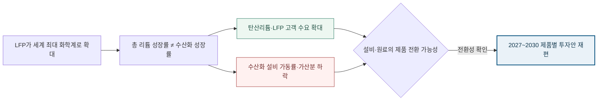

<!-- AUTO-GENERATED BY market-sensing-intelligence. DO NOT EDIT. -->

**POSCO Holdings**{ .signal-pill .signal-pill-company .signal-company-name aria-label="회사 POSCO Holdings" } **리튬**{ .signal-pill .signal-pill-axis aria-label="사업축 리튬" } **복합 이슈**{ .signal-pill .signal-pill-type aria-label="변화 유형 복합 이슈" }
{ .signal-detail-context .strategic-issue-context aria-label="회사, 사업축과 변화 유형" }

# 세계 절반을 넘은 인산철 배터리가 수산화리튬 성장 공식을 흔든다

**이 이슈의 위치** · **경영 Function:** 전략·투자 · 영업·고객 · 생산·운영 · **지역·시장:** 글로벌 전기차 배터리 시장 · 북미 LFP 시장 · **시간:** 2027~2030년 제품별 사업계획

**왜 우리 회사 이슈인가 · 핵심 관심** · 수산화리튬 증설물량, 고객별 고니켈 계약, 탄산·수산화 전환능력과 제품별 가동률이 직접 노출됩니다. **바꿀 결정:** 리튬 사업계획을 총톤 중심에서 화학계·제품별 수요와 전환성 중심으로 바꿀지 결정해야 합니다.

??? info "회사 연결 근거"

    **공식 사업 근거:** 포스코홀딩스는 호주·아르헨티나 리튬 자원과 정제설비에 투자하고 있어 탄산·수산화 제품 믹스가 가동률과 투자회수에 직접 연결됩니다.

    **전달 경로:** LFP 비중 확대가 탄산리튬 선호를 높이면 수산화리튬 계약과 판매 성장률이 시장 평균에서 이탈하고 설비 회수기간이 길어집니다.

    **회사 공식 원문:** [[sources/SRC-20260818-A26B22EF|회사 공식 근거 1]] · [[sources/SRC-20260819-47D73CC5|회사 공식 근거 2]]

!!! warning "대응 검토 · 활성 · 기회·위험 혼재"

    **판단 질문:** 2027~2030년 리튬 사업계획을 총톤 중심에서 화학계·제품별 수요와 전환성 중심으로 바꿀 것인가?

    **잠정 결론:** 총 리튬 성장률이 아니라 고객별 배터리 화학계와 탄산·수산화 전환능력을 증설 기준으로 써야 합니다.

    **다음 사업 분기점:** 2026년 10월 제품별 사업계획 재산정, 2027년 말 GM 북미 LFP 양산

**세 숫자로 읽는 시장 전환**

| **55% 초과 %** | **40% 초과 저렴 %** | **50 GWh 초과 GWh** |
| ---: | ---: | ---: |
| 세계 전기차 배터리 LFP 비중 | LFP 팩의 NMC 대비 평균 가격 격차 | 미국 내 LFP 전환 생산능력 |
| LFP가 보조 화학계를 넘어 세계 주류가 되었음을 보여줍니다. | 완성차가 대중차·저가차에서 LFP를 채택할 경제적 압력이 커졌습니다. | 낮은 미국 사용비중과 별개로 현지 공급망 전환이 시작됐습니다. |
| [[sources/SRC-20260819-3F479FFE|근거 1]] · [[sources/SRC-20260819-C39C1B19|근거 2]] | [[sources/SRC-20260819-3F479FFE|근거 1]] · [[sources/SRC-20260819-C39C1B19|근거 2]] | [[sources/SRC-20260819-3F479FFE|근거 1]] |

**LFP는 3년 만에 세계 전기차 배터리의 과반을 넘었다**

**읽는 법:** LFP 비중이 2023년 40%에서 2025년 55% 초과로 상승해 총 리튬 수요와 수산화리튬 수요의 분리가 구조적일 가능성을 높였습니다.
{ .strategic-quant-lead }

| 시점·항목 | 확인값 | 첫 값 대비 |
| --- | --- | --- |
| 2023 | 40 % | 기준 |
| 2024 | 49 % | +23% |
| 2025 | 55 % | +38% |

_단위 표 안에 표시 · 기준일 2026-05-20 · 공식 확인값 · [[sources/SRC-20260819-3F479FFE|근거 1]] · [[sources/SRC-20260819-C39C1B19|근거 2]]_

_계산·범위: IEA의 2023년 40%, 2024년 거의 50%, 2025년 55% 초과를 보수적으로 40·49·55로 표시했습니다._

## LFP의 주류화, 저가형 보조재에서 세계 최대 화학계로

연속된 시장 비중은 방향을 분명히 보여줍니다. LFP는 2023년 40%에서 2025년 55%를 넘어섰고, 가격 격차도 2024년 약 30%에서 2025년 40% 초과로 벌어져 제품 믹스 전환을 동시에 밀고 있습니다.

IEA가 확인한 2025년 세계 전기차 배터리 구성에서 LFP는 55%를 넘어 이미 절반 이상의 시장을 차지했습니다. 이는 LFP가 중국의 보급형 차량에만 쓰이는 보조 선택지라는 설명으로는 더 이상 충분하지 않다는 뜻입니다. 평균 팩 가격도 NMC보다 40% 이상 낮아져 완성차가 대중차 원가를 낮출 때 가장 직접적인 선택지가 됐습니다.

변화의 두 번째 축은 지역입니다. 미국은 관세와 조달요건 때문에 LFP 사용비중이 낮지만, GM은 테네시 공장을 전환해 2027년 말부터 북미산 LFP를 양산하겠다고 밝혔습니다. 현재 점유율보다 고객의 설비 전환과 양산 일정이 더 중요한 선행 신호입니다. 중국 중심이던 제품 구성이 북미 생산으로 번지면 비중국 시장의 전환 속도도 기존 전망보다 빨라질 수 있습니다.

**총 리튬 성장률과 수산화리튬 성장률의 분리.**

기존 사업계획의 취약점은 전기차와 배터리 수요의 증가율을 리튬 제품별 증가율로 거의 그대로 옮기는 데 있습니다. 고니켈 NMC는 수산화리튬을 선호하지만 LFP는 일반적으로 탄산리튬을 사용합니다. 따라서 전체 배터리 수요가 성장해도 LFP 비중이 더 높아지면 수산화리튬의 성장률은 시장 평균보다 낮아질 수 있습니다.

이 변화는 ‘리튬 수요가 늘 것인가’라는 질문을 부정하지 않습니다. 대신 어떤 제품이 어느 지역과 차종에서 늘고, 그 수요를 어떤 설비가 공급할 수 있는지를 묻습니다. 포스코홀딩스의 광산·염호 투자 자체보다 수산화 전환설비의 목표 가동률, 고객별 고니켈 계약량, 탄산·수산화 간 전환비용이 사업가치를 더 크게 좌우할 가능성이 커졌습니다.

**변화와 분기점**

| 시점 | 구분 | 확인된 변화·판단 |
| --- | --- | --- |
| **2024년 11월** | 공개 | 미국 에너지부가 LFP 공급망 전환과 현지 생산능력을 점검 |
| **2025년 7월 14일** | 시장 사건 | GM이 2027년 말 북미 LFP 상업생산 계획을 공개 |
| **2026년 5월 20일** | 공개 | IEA가 세계 전기차 배터리의 LFP 비중 55% 초과를 확인 |
| **2026년 10월 31일** | 판단 시한 | 2027~2030년 제품별 수요·가동률·현금흐름 재산정 권고 시한 |
| **2027년 말** | 사업 분기점 | GM 스프링힐 LFP 상업생산 목표 |

## 수산화 설비의 가동률과 증설 회수기간이 먼저 흔들리는 구조

상단 정량표는 LFP 비중이 2023년 40%에서 2025년 55% 초과로 상승해 총 리튬 수요와 수산화리튬 수요의 분리가 구조적일 가능성을 높였습니다. 단위와 기준일을 확인하고, 공식 확인값과 공개자료 역산값으로 읽어야 합니다.

직접 영향은 판매량보다 가동률에서 먼저 나타납니다. 증설물량을 흡수할 고니켈 계약이 계획에 못 미치면 수산화리튬 가격이 유지되더라도 고정비 부담이 톤당 원가를 높입니다. 이후 할인 판매나 재고 증가가 겹치면 EBITDA와 운전자본, 투자 회수기간이 동시에 악화될 수 있습니다. 반대로 탄산리튬 판매망이나 제품 전환능력이 충분하면 같은 시장 변화가 포트폴리오 유연성의 기회가 됩니다.

평가 단위도 총 생산능력에서 ‘고객·지역·차종·화학계·제품’으로 세분해야 합니다. 기존 호주·아르헨티나 자원 투자와 정제설비를 하나의 총톤으로 볼 경우 광산의 장기 자원가치와 제품설비의 단기 가동률 위험이 섞입니다. 자원 확보는 유지하되 제품별 계약 커버리지와 전환가능량을 별도 손익으로 계산해야 투자 우선순위를 제대로 비교할 수 있습니다.

**총 리튬 성장과 수산화리튬 수요가 갈라지는 사업계획 분기**

_구조 선택 근거: 시장 전체는 성장해도 제품별 결과가 반대가 되는 이슈이므로 LFP 주류화에서 탄산 기회와 수산화 위험을 병렬로 분리하고 전환능력 판단으로 연결했습니다._

**기회·위험·미실행 비용의 분기**

| 판단 축 | 성립 조건 | 사업 효과와 행동 |
| --- | --- | --- |
| **기회** | LFP 확대와 함께 탄산리튬 수요가 늘고 기존 설비·원료의 제품 전환 가능성이 확인 | **효과:** 총 리튬 수요 성장을 탄산·수산화 제품별 판매와 전환 서비스로 나눠 새로운 고객 수요를 확보 **행동:** 고객·지역·화학계별 장기수요를 다시 계산하고 전환투자와 계약 조건을 제품별로 설계 |
| **위험** | 북미까지 LFP 양산이 확대되지만 수산화리튬 중심 증설·판매계획이 그대로 유지 | **효과:** 수산화리튬 가동률과 가격 가산분이 낮아져 단일제품 증설의 회수기간이 길어짐 **행동:** 수산화리튬 증설의 단계 집행 기준과 탄산 전환 선택지를 경영안건으로 재심의 |
| **미실행 비용** | 판단을 미룰 때 | 제품 믹스 변화를 수요 하방으로만 보면 탄산리튬·LFP 고객 확대와 설비 전환능력을 새 수익원으로 만드는 기회를 놓칠 수 있습니다. |

**결정 전환 조건:** 고객별 LFP 양산 일정과 제품별 계약물량이 확인되면 전환투자를 시작하고, 수산화리튬 장기물량이 유지되면 기존 증설안을 보존합니다.

**판단 범위:** 2027~2030년 고객계약·증설·제품전환 계획 · 분석 신뢰도 높음

## 2027~2030 사업계획을 제품별 계약과 전환능력 중심으로 재편

제품 믹스 판단의 출발점은 총 리튬 수요가 아니라 고객·지역·차종별 배터리 화학계입니다. 확정계약, 고객 양산일정과 현지 조달요건을 가중해 탄산리튬과 수산화리튬 수요를 방어·기준·상방으로 나누고, 각 경우의 설비 가동률과 가격 프리미엄을 함께 봐야 합니다. 설비별 전환 가능량·기간·변동비·품질인증·장기계약 제약을 확인한 뒤 신규 증설의 게이트를 수산화리튬 확정 수요와 최소 가동률로 바꾸는 것이 핵심입니다. 기존 계획과 새 제품 믹스 계획의 EBITDA·현금흐름 차이가 확인돼야 증설·전환·유지 중 하나를 선택할 수 있습니다.

**결정을 미루지 않기 위해 먼저 완성할 세 가지 산출물**

| 순서·책임 | 이번에 만들 것 | 완료 후 판단 |
| --- | --- | --- |
| 1 · 포스코홀딩스 리튬사업·전략·마케팅 공동 검토 | 고객·지역·차종·화학계별 2027~2030 수요를 탄산리튬과 수산화리튬으로 분해합니다. | 두 번째 검증으로 이동 |
| 2 · 포스코홀딩스 리튬사업·전략·마케팅 공동 검토 | 설비별 제품 전환 가능량·기간·변동비와 장기계약 제약을 확인합니다. | 대안의 경제성과 실행 가능성 비교 |
| 3 · 포스코홀딩스 리튬사업·전략·마케팅 공동 검토 | 기존 증설안의 가동률·EBITDA·현금흐름을 방어·기준·압박 시나리오로 다시 계산합니다. | 투자·계약·보류 중 하나를 선택 |

_문단에 흩어진 행동을 실행 순서와 완료 후 판단으로 재구성했습니다._

**권고 시한:** 2026-10-31

**LFP 60%와 북미 후속 양산이 이슈 강도를 가르는 관찰선.**

가장 중요한 외부 지표는 세계 LFP 비중, LFP와 NMC의 팩 가격 격차, GM 외 비중국 완성차의 양산 확정 건수입니다. LFP 비중이 60%를 넘고 다음 연도에도 상승하거나 2028년 이전 양산을 확정한 비중국 완성차가 두 곳 이상 추가되면 제품 믹스 전환을 기준 시나리오로 올려야 합니다.

내부적으로는 수산화리튬 계약 갱신률, 고객별 확정 고니켈 물량, 목표 대비 가동률, 탄산·수산화 전환기간을 분기마다 확인해야 합니다. 반대로 세계 LFP 비중이 2개 연도 연속 하락하고 확정 고니켈 계약이 목표 가동률을 채우며 전환비용도 허용범위 안이면 이슈 강도를 낮출 수 있습니다.

**세 확인선이 현재 결론을 강화하거나 낮춘다**

| 관찰 지표·책임 | 강화 신호 | 완화 신호 |
| --- | --- | --- |
| 1 · 포스코홀딩스 리튬사업·전략·마케팅 공동 검토 | 세계 LFP 비중이 60%를 넘고 다음 연도에도 상승합니다. | 세계 LFP 비중이 2개 연도 연속 하락합니다. |
| 2 · 포스코홀딩스 리튬사업·전략·마케팅 공동 검토 | GM 외 비중국 완성차 두 곳 이상이 2028년 이전 LFP 양산을 추가 확정합니다. | 확정 고니켈 계약물량이 수산화리튬 증설물량의 목표 가동률을 충족합니다. |
| 3 · 포스코홀딩스 리튬사업·전략·마케팅 공동 검토 | 수산화리튬 계약 갱신률·목표 가동률이 내부 계획보다 10%p 이상 낮아집니다. | 탄산·수산화 전환비용과 기간이 사업계획 허용범위 안으로 확인됩니다. |

_공식 발표와 내부 확인값이 바뀌면 같은 표에서 이슈 강도를 다시 판단합니다._

**결론을 바꾸는 조건**

| 이슈 강화 | 이슈 완화 |
| --- | --- |
| 세계 LFP 비중이 60%를 넘고 다음 연도에도 상승합니다. | 세계 LFP 비중이 2개 연도 연속 하락합니다. |
| GM 외 비중국 완성차 두 곳 이상이 2028년 이전 LFP 양산을 추가 확정합니다. | 확정 고니켈 계약물량이 수산화리튬 증설물량의 목표 가동률을 충족합니다. |
| 수산화리튬 계약 갱신률·목표 가동률이 내부 계획보다 10%p 이상 낮아집니다. | 탄산·수산화 전환비용과 기간이 사업계획 허용범위 안으로 확인됩니다. |

## 점유율·가격·고객 설비전환이 같은 방향을 가리키는 근거

이번 판단은 전망 문장 하나가 아니라 세 종류의 행동 근거를 연결한 결과입니다. IEA의 세계 점유율과 가격 격차, 미국 에너지부의 공급망 점검, GM의 공장 전환과 양산 목표가 각각 시장 구성, 경제성, 실제 고객행동을 보여줍니다. 포스코홀딩스의 기존 투자 정보는 외부 변화를 만드는 근거가 아니라 변화에 노출된 자산 규모를 확인하는 보조 맥락으로만 사용했습니다.

**연결된 마켓 시그널**

- [[signals/SIG-F062894EEB9A|LFP가 세계 전기차 배터리의 절반을 넘어섰다]] · 영향 5/5 · 긴급 4/5
- [[signals/SIG-8BDE11D3224E|GM이 북미 LFP 양산 시점을 2027년으로 제시했다]] · 영향 4/5 · 긴급 4/5
- [[signals/SIG-BD81BF99EDC7|호주·아르헨티나 리튬 자원에 약 1.1조원 투자]] · 영향 5/5 · 긴급 5/5 · 회사 노출 확인

??? note "총수요 성장과 지역별 공급망 제약을 함께 남겨둔 분석 경계"

    이 분석은 수산화리튬 수요가 절대 감소한다고 단정하지 않습니다. IEA는 전체 전기차 배터리 수요가 2030년 3TWh를 넘을 것으로 보고 있으며 NMC는 장거리·한랭지·고성능 차종에서 에너지밀도 우위가 남습니다. 미국의 관세와 조달요건, 중국에 집중된 LFP 공급망도 비중국 시장의 전환 속도를 늦출 수 있습니다.

    공개정보로는 포스코홀딩스의 고객별 계약, 설비별 손익분기 가동률, 제품 전환비용을 확인할 수 없습니다. 따라서 결론은 제품별 사업계획을 재산정해야 한다는 방향에 관한 것이며 구체적 투자 축소폭에 관한 결정은 아닙니다. 내부 계약과 설비자료를 넣었을 때 가동률과 현금흐름 차이가 유의미하지 않다면 권고 강도를 낮춰야 합니다.
??? info "문서 관리 정보"

    등록 2026-08-19 · 최근 확인 2026-08-19 · 다음 모니터링 2026-09-30

    **지속 관찰 원칙:** 반증 조건이 충족되거나 사람이 근거를 기록해 종료하기 전까지 활성 경고로 유지하며, 새 기사가 없는 기간에도 다음 검토일마다 지표와 내부 계약자료를 재검토합니다.

    | 날짜 | 조치 | 단계 변화 | 판단 근거 |
    | --- | --- | --- | --- |
    | 2026-08-21 | title_pattern_rewrite | - | 활성 이슈 목록의 반복적인 ~할 때·~먼저다 문형을 해소하고 이슈별 변화·간극·판단에 맞는 제목 구조로 재작성 |
    | 2026-08-20 | executive_title_rewrite | - | 법령 코드·영문 약어·단위·업계 은어를 제목에서 제거하고 임원이 사전 설명 없이 이해할 수 있는 시장 변화와 판단으로 재작성 |
    | 2026-08-20 | sparse_visual_rewrite | - | 2~3개 값과 시나리오를 강제 차트에서 가정·결과가 함께 보이는 정량표로 교체 |
    | 2026-08-20 | quantitative_rewrite | - | 공개 수치와 회사 민감도를 분리하고 첫 화면 정량 차트 중심으로 전면 편집 |
    | 2026-08-19 | 최초 등록 | 대응 검토 | 점유율·가격, 제품별 원료 선호, 완성차 양산행동의 독립 근거가 누적되어 단발 시그널보다 높은 지속 경고로 승격했습니다. |

**확인한 원문과 보관본**

- **Global EV Outlook 2026 - Electric vehicle batteries** · International Energy Agency · 2026-05-20 · [원문 링크](https://www.iea.org/reports/global-ev-outlook-2026/electric-vehicle-batteries) · [[sources/SRC-20260819-3F479FFE|보관 원문]]
- **Supply Chain Readiness Level Preliminary Analysis: Batteries Summary** · U.S. Department of Energy · 2024-11-01 · [원문 링크](https://www.energy.gov/sites/default/files/2024-12/Supply_Chain_Readiness_Level_%28SCRL%29_Analysis_Nov2024--2024.12.04.pdf) · [[sources/SRC-20260819-3EDE7B8B|보관 원문]]
- **From Tennessee to Michigan, GM is building a battery-powered future** · General Motors · 2025-07-14 · [원문 링크](https://news.gm.com/home.detail.html/Pages/topic/us/en/2025/jul/0714-Tennessee-Michigan-battery-powered-future.html) · [[sources/SRC-20260819-55D3797D|보관 원문]]
- **Global EV Outlook 2025 - Electric vehicle batteries** · International Energy Agency · 2025-05-14 · [원문 링크](https://www.iea.org/reports/global-ev-outlook-2025/electric-vehicle-batteries) · [[sources/SRC-20260819-C39C1B19|보관 원문]]
