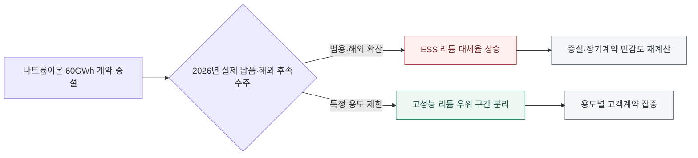

<!-- AUTO-GENERATED BY market-sensing-intelligence. DO NOT EDIT. -->

**POSCO Holdings**{ .signal-pill .signal-pill-company .signal-company-name aria-label="회사 POSCO Holdings" } **리튬**{ .signal-pill .signal-pill-axis aria-label="사업축 리튬" } **고객·계약**{ .signal-pill .signal-pill-type aria-label="변화 유형 고객·계약" }
{ .signal-detail-context .strategic-issue-context aria-label="회사, 사업축과 변화 유형" }

# 60기가와트시 나트륨 배터리 주문, 저장장치용 리튬 수요의 새 변수

**이 이슈의 위치** · **경영 Function:** 전략·투자 · 영업·고객 · **지역·시장:** 글로벌 ESS 시장 · 중국 배터리 시장 · **시간:** 2026~2030년 리튬 수요계획

**왜 우리 회사 이슈인가 · 핵심 관심** · 장기 리튬 수요전망의 ESS 기여분, 아직 계약되지 않은 증설물량과 자산별 목표 가동률이 직접 노출됩니다. **바꿀 결정:** 2030년 리튬 수요계획에서 ESS 나트륨 전환율을 독립 변수로 반영할지 결정해야 합니다.

??? info "회사 연결 근거"

    **공식 사업 근거:** 포스코홀딩스는 리튬 자원·정제 투자 회수계획을 장기 배터리 수요에 연결하고 있어 ESS 화학계 전환이 수요전제에 직접 영향을 줍니다.

    **전달 경로:** 나트륨이온 ESS 계약과 양산이 늘면 ESS용 리튬이온 점유율이 낮아져 리튬 수요·가격과 신규 증설 회수기간이 달라집니다.

    **회사 공식 원문:** [[sources/SRC-20260818-A26B22EF|회사 공식 근거 1]]

!!! warning "대응 검토 · 활성 · 위험"

    **판단 질문:** 2030년 리튬 수요계획에서 ESS의 나트륨 전환율을 독립 변수로 반영할 것인가?

    **잠정 결론:** ESS 리튬 수요는 실제 나트륨 출하량과 후속 계약을 독립 변수로 두고 다시 계산해야 합니다.

    **다음 사업 분기점:** 2026년 9월 중국 납품 시작과 2026년 말 누적 1GWh 인도 확인

**세 숫자로 읽는 시장 전환**

| **60 GWh** | **2027년 6월** | **2026년 9월** |
| ---: | ---: | ---: |
| 나트륨 ESS 상용계약 | 변화 시점 | 변화 시점 |
| 기술 전망이 실제 고객 주문으로 전환됐습니다. | 해외시장 납품 시작 계획 | 중국 고객 대상 첫 상용 납품 계획 |
| [[sources/SRC-20260819-17C5D778|근거 1]] | [[sources/SRC-20260819-DBADDD49|근거 1]] | [[sources/SRC-20260819-DBADDD49|근거 1]] |

**ESS 나트륨 전환율이 리튬 매출 노출을 얼마나 바꾸는가**

**읽는 법:** 60GWh 계약을 시장점유율로 곧바로 환산하지 않고 전환율을 방어·기준·압박으로 나눠 리튬 매출 민감도를 봅니다.
{ .strategic-quant-lead }

| 시나리오 | 리튬 매출 노출 | 리튬이온 대체율 | 리튬 가격 |
| --- | --- | --- | --- |
| 방어 | 35.9 USD m | 28% | 9,400 USD/t LCE |
| 기준 | 302 USD m | 60% | 12,000 USD/t LCE |
| 압박 | 1,455 USD m | 86% | 23,700 USD/t LCE |

_단위 표 안에 표시 · 기준일 2026-08-19 · 회사 실제값이 아닌 민감도 · [[sources/SRC-20260819-17C5D778|근거 1]] · [[sources/SRC-20260819-DBADDD49|근거 2]] · [[sources/SRC-20260819-3F479FFE|근거 3]]_

_계산·범위: 계약용량 × GWh당 LCE × 대체율 × 리튬가격 ÷ 1,000,000 공개자료와 넓은 AI 가정을 결합한 방향·민감도용 예비 계산입니다. POSCO의 실제 물량·가격·원가·계약조건 또는 공식 전망이 아니며 관련 Signal과 동일한 충격은 중복 합산하지 않습니다._

## 나트륨이온 ESS, 발표 경쟁에서 대형 주문과 납품 경쟁으로

상용화 증거는 크기가 아니라 단계로 읽어야 합니다. 60GWh 계약과 160GWh 계획은 크지만, 2026년 실제 출하 목표는 1GWh이므로 주문→생산능력→인도의 전환율이 결론을 가릅니다.

나트륨이온 배터리는 오랫동안 낮은 에너지밀도 때문에 리튬이온을 대체하기 어려운 후보로 취급됐습니다. 그러나 2026년에는 논점이 달라졌습니다. CATL과 HyperStrong이 60GWh 규모의 ESS 공급계약을 공개했고, CATL은 TENER Sodium의 중국 납품을 2026년 9월, 해외 납품을 2027년 6월로 제시했습니다. 기술 가능성이 아니라 고객 주문과 인도 일정이 확인된 것입니다.

전환은 모든 배터리 시장에서 동시에 일어나지 않습니다. 무게와 부피의 제약이 상대적으로 작은 고정형 ESS가 먼저 움직일 가능성이 큽니다. 따라서 전기차에서 나트륨이온 점유율이 낮다는 사실만으로 ESS 대체위험을 낮게 보면 안 됩니다. 응용처별 경제성과 실제 납품을 분리해 보는 것이 이번 변화의 핵심입니다.

**ESS 성장량이 곧 리튬 수요라는 전제의 균열.**

기존 장기 수요모델은 전기차와 ESS의 저장용량 증가를 리튬 사용량으로 환산하고 화학계별 비중을 조정하는 방식이 일반적입니다. 이 구조에서는 ESS 시장이 빠르게 성장할수록 리튬 수요의 상방도 커집니다. 하지만 나트륨이온이 고정형 ESS에서 상용 공급망을 만들면 ESS 성장분 일부는 리튬을 전혀 사용하지 않는 수요로 이동합니다.

중요한 점은 나트륨이온이 리튬이온 전체를 이겨야만 영향이 생기는 것이 아니라는 사실입니다. 신규 ESS 발주 중 일부만 대체해도 기존 리튬 수요 전망의 상방이 낮아지고, 증설 프로젝트가 가정한 가격과 가동률이 달라질 수 있습니다. 총 배터리 수요와 리튬 함유 배터리 수요를 분리해야 하는 이유입니다.

**변화와 분기점**

| 시점 | 구분 | 확인된 변화·판단 |
| --- | --- | --- |
| **2026년 5월 6일** | 시장 사건 | CATL과 HyperStrong의 나트륨이온 ESS 60GWh 계약 공개 |
| **2026년 6월 22일** | 시장 사건 | CATL이 TENER Sodium 제품과 중국·해외 납품 일정을 제시 |
| **2026년 9월** | 사업 분기점 | 중국 고객 대상 첫 상용 납품 계획 |
| **2026년 말** | 확인 시점 | 누적 1GWh 인도 목표와 실제 고객 수용성 확인 |
| **2027년 6월** | 사업 분기점 | 해외시장 납품 시작 계획 |

## 리튬 가격 상방과 증설 회수기간에 선택적으로 전달되는 충격

상단 정량표는 60GWh 계약을 시장점유율로 곧바로 환산하지 않고 전환율을 방어·기준·압박으로 나눠 리튬 매출 민감도를 봅니다. 단위와 기준일을 확인하고, 회사 실제 실적 전망이 아닌 민감도 결과로 읽어야 합니다.

포스코홀딩스에 미치는 영향은 당장 기존 전기차용 판매가 사라지는 형태보다 장기 수요 전망의 ESS 기여분이 줄어드는 형태로 나타날 가능성이 큽니다. 나트륨 전환율이 높아지면 기준 시나리오의 리튬 수요와 가격 가정이 낮아지고, 아직 확정계약이 적은 신규 증설의 목표 가동률과 투자 회수기간이 악화될 수 있습니다.

반면 전기차 고성능 시장과 이미 계약된 고객 물량은 상대적으로 영향이 작을 수 있습니다. 자산별로 광산의 장기 공급가치, 정제설비의 제품 믹스, ESS 고객 노출을 구분해야 합니다. 동일한 대체율을 모든 리튬 자산에 적용하면 위험을 과대평가하거나 실제 취약 설비를 가릴 수 있으므로 응용처별 매출 노출을 먼저 계산해야 합니다.

**나트륨이온의 실제 납품 범위가 리튬 수요모델을 바꾸는 두 갈래**

_구조 선택 근거: 발표나 계약 규모가 아니라 실제 납품의 용도와 지역이 대체율을 결정하므로 상용화 확인점에서 수요 하방과 리튬 방어구간이 서로 다른 행동으로 이어지게 했습니다._

**기회·위험·미실행 비용의 분기**

| 판단 축 | 성립 조건 | 사업 효과와 행동 |
| --- | --- | --- |
| **기회** | 나트륨이온 납품이 고정형 ESS의 특정 용도·지역에 집중되고 리튬계 고성능 구간이 분리 | **효과:** ESS를 단일 수요로 보지 않고 리튬이 우위를 유지하는 고객·성능 구간에 판매와 제품개발을 집중 **행동:** 응용처별 대체율과 성능 요구를 고객계약에 연결해 방어 가능한 리튬 수요를 선별 |
| **위험** | 60GWh 계약과 40GWh 증설이 일정대로 집행되고 해외 납품까지 확대 | **효과:** ESS용 리튬 수요와 가격 상방이 줄어 증설·장기판매계약의 회수 가정이 약화 **행동:** ESS 나트륨 전환율을 독립 변수로 반영해 증설과 장기계약 민감도를 재계산 |
| **미실행 비용** | 판단을 미룰 때 | 대체를 전체 리튬 수요 감소로만 읽으면 리튬이온이 우위를 유지하는 고성능 ESS 구간과 고객을 먼저 재정의할 기회를 잃을 수 있습니다. |

**결정 전환 조건:** 2026년 실제 납품량과 해외 고객 확대가 확인되면 ESS 대체율을 높이고, 특정 용도에 제한되면 리튬 우위 구간의 계약을 확대합니다.

**판단 범위:** 2027~2030년 응용처별 리튬 수요·증설계획 · 분석 신뢰도 높음

## 2030 수요모델에 ESS 나트륨 전환율을 독립 변수로 편입

2030년 리튬 수요모델을 전기차, 고정형 ESS, 소비자기기와 기타 산업용으로 분리하고 ESS에만 나트륨 전환율을 적용해야 합니다. 방어·기준·압박 시나리오에는 실제 납품량, LFP 대비 총소유비용, 해외 수주와 생산능력을 연결해야 합니다. 계약 발표량 60GWh를 곧바로 연간 판매량으로 간주하지 않고 인도 속도와 반복 주문으로 조정하는 것이 중요합니다.

2026년 말까지 누적 인도량과 고객 프로젝트의 운전 실적을 확인한 뒤 2027~2030 가격·가동률 계획을 다시 계산하는 것이 권고됩니다. 내부적으로는 ESS에 연결된 리튬 판매계약과 아직 계약되지 않은 증설물량을 구분하고, 대체율 변화가 EBITDA와 현금흐름에 미치는 민감도를 경영회의에 제시해야 합니다.

**결정을 미루지 않기 위해 먼저 완성할 세 가지 산출물**

| 순서·책임 | 이번에 만들 것 | 완료 후 판단 |
| --- | --- | --- |
| 1 · 포스코홀딩스 리튬사업·전략·마케팅 | 응용처별 리튬 수요모델을 분리합니다. | 두 번째 검증으로 이동 |
| 2 · 포스코홀딩스 리튬사업·전략·마케팅 | 나트륨 점유율별 증설·판매계약 민감도를 계산합니다. | 대안의 경제성과 실행 가능성 비교 |
| 3 · 포스코홀딩스 리튬사업·전략·마케팅 | 2026년 9월 중국 납품 시작과 2026년 말 누적 1GWh 인도 확인 | 투자·계약·보류 중 하나를 선택 |

_문단에 흩어진 행동을 실행 순서와 완료 후 판단으로 재구성했습니다._

**권고 시한:** 2026-12-31

**1GWh 실제 인도와 해외 후속수주가 가르는 상용성.**

2026년 말 누적 인도 1GWh 달성 여부가 첫 번째 확인선입니다. 계약 규모가 크더라도 초기 납품이 지연되거나 고객 운전에서 성능·안전 문제가 나타나면 수요모델 반영률을 낮춰야 합니다. 2027년 6월 해외 납품이 계획대로 시작되고 복수 고객의 반복 주문이 확인되면 대체율을 기준 시나리오로 올릴 수 있습니다.

비용 측면에서는 LFP 대비 시스템 총소유비용, 사이클 수명, 저온 성능, 소방·보험비용을 함께 봐야 합니다. 내부적으로는 ESS용 리튬 노출량과 미계약 증설물량을 확인합니다. 실제 인도가 목표에 크게 미달하거나 총소유비용 우위가 사라지면 이슈 강도를 낮추고, 해외 수주와 양산능력이 동반 확대되면 즉시 높입니다.

**세 확인선이 현재 결론을 강화하거나 낮춘다**

| 관찰 지표·책임 | 강화 신호 | 완화 신호 |
| --- | --- | --- |
| 1 · 포스코홀딩스 리튬사업·전략·마케팅 | 2026년 누적 인도가 1GWh 이상입니다. | 60GWh 계약이 취소 또는 장기 지연됩니다. |
| 2 · 포스코홀딩스 리튬사업·전략·마케팅 | 2027년 해외 납품이 계획대로 시작됩니다. | 나트륨 ESS의 총소유비용이 LFP보다 높게 유지됩니다. |
| 3 · 포스코홀딩스 리튬사업·전략·마케팅 | 2026년 9월 중국 납품 시작과 2026년 말 누적 1GWh 인도 확인 | 반증 조건이 확인되면 이슈 강도를 낮춥니다. |

_공식 발표와 내부 확인값이 바뀌면 같은 표에서 이슈 강도를 다시 판단합니다._

**결론을 바꾸는 조건**

| 이슈 강화 | 이슈 완화 |
| --- | --- |
| 2026년 누적 인도가 1GWh 이상입니다. | 60GWh 계약이 취소 또는 장기 지연됩니다. |
| 2027년 해외 납품이 계획대로 시작됩니다. | 나트륨 ESS의 총소유비용이 LFP보다 높게 유지됩니다. |

## 계약 규모·제품 출시·납품 일정이 이어진 상용화 근거

핵심 근거는 CATL과 고객사가 공개한 60GWh 계약, TENER Sodium 제품, 중국과 해외의 구체적인 인도 일정입니다. IEA의 시장자료는 현재 나트륨이온 생산능력이 아직 리튬이온에 비해 작다는 반대 근거와 응용처별 대체 가능성을 함께 확인하는 데 사용했습니다. 계약 발표와 실제 출하를 구분해 후속 지표를 계속 연결합니다.

**연결된 마켓 시그널**

- [[signals/SIG-C09FE799E568|나트륨이온 ESS 60GWh 공급계약 체결]] · 영향 5/5 · 긴급 5/5

??? note "대형 계약을 곧바로 시장점유율로 환산하지 않는 보수적 경계"

    60GWh는 계약 규모이지 해당 연도 실인도량이나 최종 설치량이 아닙니다. 현재 나트륨이온 생산능력은 리튬이온의 1%를 조금 넘는 수준이며, 낮은 에너지밀도 때문에 장거리 전기차까지 같은 속도로 대체하기 어렵습니다. 계약 취소, 단계적 발주, 고객 프로젝트 지연 가능성도 남아 있습니다.

    공개자료만으로는 제품 가격, 보증조건, 실제 수율과 고객 운전비를 비교할 수 없습니다. 따라서 이 분석은 ESS 수요모델에 별도 대체변수를 넣어야 한다는 판단이지 리튬 수요가 곧 감소한다는 예측이 아닙니다. 실제 인도와 총소유비용이 확인될 때까지 넓은 범위로 계산하고 전기차용 수요에는 동일한 대체율을 적용하지 않아야 합니다.
??? info "문서 관리 정보"

    등록 2026-08-19 · 최근 확인 2026-08-19 · 다음 모니터링 2026-12-31

    **지속 관찰 원칙:** 반증 조건이 충족되거나 사람이 근거를 기록해 종료하기 전까지 유지하고 다음 검토일에 지표를 갱신합니다.

    | 날짜 | 조치 | 단계 변화 | 판단 근거 |
    | --- | --- | --- | --- |
    | 2026-08-21 | title_pattern_rewrite | - | 활성 이슈 목록의 반복적인 ~할 때·~먼저다 문형을 해소하고 이슈별 변화·간극·판단에 맞는 제목 구조로 재작성 |
    | 2026-08-20 | executive_title_rewrite | - | 법령 코드·영문 약어·단위·업계 은어를 제목에서 제거하고 임원이 사전 설명 없이 이해할 수 있는 시장 변화와 판단으로 재작성 |
    | 2026-08-20 | sparse_visual_rewrite | - | 2~3개 값과 시나리오를 강제 차트에서 가정·결과가 함께 보이는 정량표로 교체 |
    | 2026-08-20 | quantitative_rewrite | - | 공개 수치와 회사 민감도를 분리하고 첫 화면 정량 차트 중심으로 전면 편집 |
    | 2026-08-19 | 최초 등록 | 대응 검토 | 60GWh 계약, 40GWh 증설과 2026년 납품일이 확인돼 ESS 수요모델을 즉시 분리할 필요가 있습니다. |

**확인한 원문과 보관본**

- **CATL and HyperStrong sign 60 GWh sodium-ion storage agreement** · CATL · 2026-05-06 · [원문 링크](https://www.catl.com/en/news/6812.html) · [[sources/SRC-20260819-17C5D778|보관 원문]]
- **CATL launches TENER Sodium energy storage system** · CATL · 2026-06-22 · [원문 링크](https://www.catl.com/en/news/6861.html) · [[sources/SRC-20260819-DBADDD49|보관 원문]]
- **Global EV Outlook 2026 - Electric vehicle batteries** · International Energy Agency · 2026-05-20 · [원문 링크](https://www.iea.org/reports/global-ev-outlook-2026/electric-vehicle-batteries) · [[sources/SRC-20260819-3F479FFE|보관 원문]]
