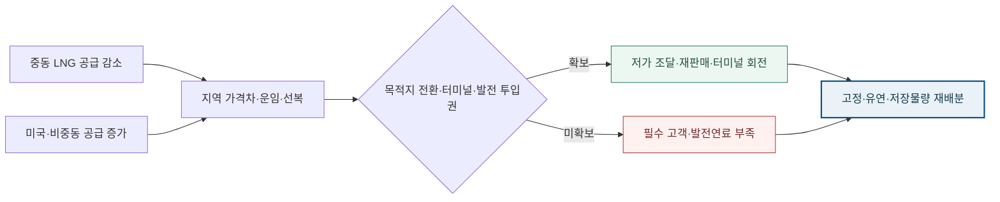

<!-- AUTO-GENERATED BY market-sensing-intelligence. DO NOT EDIT. -->

**POSCO International**{ .signal-pill .signal-pill-company .signal-company-name aria-label="회사 POSCO International" } **에너지**{ .signal-pill .signal-pill-axis aria-label="사업축 에너지" } **복합 이슈**{ .signal-pill .signal-pill-type aria-label="변화 유형 복합 이슈" }
{ .signal-detail-context .strategic-issue-context aria-label="회사, 사업축과 변화 유형" }

# 액화천연가스 공급지가 중동에서 미국·비중동으로 이동, 화물 전환권 재평가

**이 이슈의 위치** · **경영 Function:** 구매·공급망 · 영업·고객 · 생산·운영 · 재무 · **지역·시장:** 중동 LNG 생산지 · 미국·비중동 생산지 · 아시아·유럽 도착시장 · 광양터미널·국내 발전 · **시간:** 2026년 공급충격과 2027년 계약·선복·터미널 배분

**왜 우리 회사 이슈인가 · 핵심 관심** · 장기계약·현물·자체생산 물량의 도착원가, 목적지 전환권, 선복, 터미널 슬롯·회전율, 발전연료 배분이 직접 노출됩니다. **바꿀 결정:** 화물별 아시아 판매·유럽 전환·광양 저장·국내 발전 순마진으로 고정·유연·저장물량을 재배분할지 결정해야 합니다.

??? info "회사 연결 근거"

    **공식 사업 근거:** 포스코인터내셔널은 가스전 생산부터 LNG 트레이딩·운송·광양터미널 저장·복합발전까지 연결된 가치사슬을 운영합니다.

    **전달 경로:** 지역별 공급 변화가 가격·운임·선복으로 전달되고 화물별 목적지·저장·발전 배분을 거쳐 조달비와 각 사업 순마진을 바꿉니다.

    **회사 공식 원문:** [[sources/SRC-20260820-0281FEC0|회사 공식 근거 1]] · [[sources/SRC-20260819-D7164DFA|회사 공식 근거 2]]

!!! warning "대응 검토 · 활성 · 기회·위험 혼재"

    **판단 질문:** 장기계약·현물·자체생산 LNG를 목적지 전환·광양 저장·발전 투입의 화물별 순마진으로 재배분할 것인가?

    **잠정 결론:** 세계 총량보다 공급지 이동이 크므로 평균가격이 아니라 화물별 도착권과 세 사용처의 순마진으로 재배분해야 합니다.

    **다음 사업 분기점:** 중동 통항 회복과 미국·비중동 신규설비의 실제 선적·아시아 도착량 확인

**세 숫자로 읽는 시장 전환**

| **-54 bcm** | **+50 bcm** | **+13%** |
| ---: | ---: | ---: |
| 카타르·아랍에미리트 공급 감소 | 북미·아프리카·호주 신규 공급 | 플라크민스 수출 허용량 확대 |
| 중동 항로와 시설 회복에 묶인 공백입니다. | 중동 공백을 대체할 신규 생산지 규모입니다. | 미국 물량의 공급시계가 앞당겨질 수 있습니다. |
| [[sources/SRC-20260820-47B392B3|근거 1]] | [[sources/SRC-20260820-47B392B3|근거 1]] | [[sources/SRC-20260820-DB8E75B6|근거 1]] |

**중동 감소를 어떤 비중동 공급이 메우는가**

**읽는 법:** 세계 총량은 비슷해도 -54, +50, 10 이상이라는 지역별 이동이 조달·항로·도착권의 가치를 갈라놓습니다.
{ .strategic-quant-lead }

| 공급요인 | 2026년 변화 | 판단 |
| --- | --- | --- |
| 카타르·아랍에미리트 | -54 bcm | 중동 회복·항로 위험 |
| 북미·아프리카·호주 신규설비 | +50 bcm | 대체 생산지 확대 |
| 비중동 기존설비 | >10 bcm | 단기 완충 공급 |

_단위 bcm · 기준일 2026-08-20 · 공식 확인값 · [[sources/SRC-20260820-47B392B3|근거 1]]_

_계산·범위: IEA 2026년 전망의 동일 단위 공급요인을 비교했으며 회사 물량·가격 전망이 아닙니다._

## 세계 총량은 비슷해도 공급지와 항로는 크게 이동

IEA는 2026년 카타르와 아랍에미리트 LNG 공급이 전년보다 약 54bcm 줄 수 있다고 전망했습니다. 북미·아프리카·호주 신규 프로젝트는 약 50bcm, 비중동 기존설비는 10bcm 이상을 추가해 공백을 대부분 메울 수 있습니다. 3~6월 비중동 생산은 전년보다 약 18% 늘어 중동 감소의 4분의 3을 실제로 상쇄했습니다. 이 때문에 세계 LNG 교역은 전년과 대체로 비슷할 수 있지만, 같은 총량이 같은 항로와 가격을 뜻하지는 않습니다. 중동 회복 속도와 비중동 가동률에 따라 아시아 도착가격·운임·선복의 희소성이 따로 움직입니다.

**공급증가가 모든 장기계약의 가치를 낮춘다는 단순화의 오류.**

LNG 공급이 늘면 조달비가 일괄 하락한다고 보기 쉽습니다. 그러나 2026년 변화는 중동 물량 감소와 미국·비중동 증산이 동시에 일어나는 지역 재배치입니다. 중동 화물이 늦게 복귀하면 아시아는 운임과 도착 프리미엄을 계속 지불할 수 있고, 미국 물량이 유럽으로 향하면 아시아 조달완화는 제한됩니다. 반대로 미국·비중동 물량이 아시아에 도착하고 선복이 충분하면 목적지 전환 가능한 단기·유연계약의 가치가 커집니다. 계약 평가는 생산지와 가격식뿐 아니라 목적지 권리, 선복, 터미널 슬롯과 발전 투입 가능성까지 포함해야 합니다.

**변화와 분기점**

| 시점 | 구분 | 확인된 변화·판단 |
| --- | --- | --- |
| **2025년 7월 22일** | 공개 | IEA가 2026년 LNG 공급 7% 증가 전망 발표 |
| **2026년 3월 13일** | 시행 | 미국이 플라크민스 수출 허용량을 즉시 13% 확대 |
| **2026년 4월 16일** | 공개 | 미국 LNG 수출의 2027년까지 약 30% 증가 전망 |
| **2026년 7월 7일** | 공개 | IEA가 중동 감소와 비중동 상쇄 규모를 갱신 |

## 광양 저장·재판매·발전 투입이 한 화물의 순마진을 바꾼다

포스코인터내셔널은 가스전 생산, LNG 트레이딩과 운송, 광양터미널 저장, 복합발전을 잇는 가치사슬을 운영합니다. 따라서 같은 화물도 아시아 고객에게 팔지, 유럽으로 전환할지, 광양에 저장할지, 국내 발전에 투입할지에 따라 순마진이 달라집니다. 계산은 도착가격 차이에서 액화·운임·터미널·재기화·저장비와 계약위약·헤지비용을 빼고 발전 투입 시 연료비·전력시장 수익을 비교해야 합니다. 세계 공급 증가율이나 한 지역 현물가격을 회사 손익률로 그대로 쓰지 않습니다. 터미널 회전율과 발전 이용률은 조달가격과 함께 봐야 할 내부 지배변수입니다.

**공급지 이동이 화물별 조달·판매·발전 배분으로 이어지는 구조**

_구조 선택 근거: 중동 감소와 비중동 증산이 지역가격·운임에서 합류한 뒤 목적지 권리에 따라 세 사용처로 갈라지는 구조입니다._

**기회·위험·미실행 비용의 분기**

| 판단 축 | 성립 조건 | 사업 효과와 행동 |
| --- | --- | --- |
| **기회** | 비중동 실제 선적과 아시아 도착이 늘고 전환권 프리미엄이 비용을 넘을 때 | **효과:** 저가 조달·지역 재판매·광양터미널 회전·발전연료 최적화 **행동:** 목적지·선복·저장·발전 투입권이 있는 유연물량을 확대 |
| **위험** | 중동 회복과 비중동 신규설비 가동이 함께 지연될 때 | **효과:** 아시아 도착가격·운임 상승과 고객·발전 필수물량 충돌 **행동:** 필수 고객·발전 물량을 먼저 고정하고 현물·선복 노출에 상한 설정 |
| **미실행 비용** | 판단을 미룰 때 | 평균가격만 보고 계약하면 공급지가 바뀌는 동안 저가 조달·재판매·터미널 활용의 선택권을 따로 가격화할 협상시점을 놓칠 수 있습니다. |

**결정 전환 조건:** 비중동 실제 선적과 지역 가격차가 확대되면 유연물량을 늘리고, 중동 회복 지연과 운임 급등이 겹치면 필수물량 방어로 전환합니다.

**판단 범위:** 2026년 실제 선적 확인부터 2027년 계약·선복·터미널 배분까지 · 분석 신뢰도 중간

## 화물별 목적지 권리와 세 가지 사용처를 같은 원장에 배치

장기계약·현물·자체생산 물량마다 생산지, 가격식, 인도시점, 목적지 전환권, 선박, 광양터미널 슬롯, 저장가능일수, 발전 투입 가능성을 기록합니다. 각 화물에 아시아 판매, 유럽 전환, 국내 발전의 세 경로별 순마진을 계산하고 필수 고객·발전물량을 먼저 표시합니다. 중동 회복 지연과 비중동 가동 정상화를 독립 변수로 둬 고정물량·유연물량·저장물량의 적정 비중을 비교합니다. 유연성을 무조건 늘리는 결론이 아니라 전환권 프리미엄이 선복·저장·계약비용을 넘는 화물에만 선택권을 남기는 방식입니다. 계약별 목적지 변경 가능일과 추가 운임, 광양 저장여력, 발전 수요를 주간 단위로 맞추면 시장 평균가격이 움직이기 전에 실제 화물의 행선지와 수익경로를 바꿀 수 있습니다. 결과는 조달·트레이딩·터미널·발전이 같은 화물을 중복 계산하지 않는 단일 원장에 남깁니다.

**화물 원장에서 세 사용처 순마진까지 이어지는 산출물**

| 순서·책임 | 이번에 만들 것 | 완료 후 판단 |
| --- | --- | --- |
| 1 · 조달·트레이딩 | 화물별 가격식·목적지 권리 원장 | 고정·유연 물량 분류 |
| 2 · 물류·터미널 | 선복·슬롯·저장비 포함 도착원가 | 아시아·유럽 전환 가능성 |
| 3 · 발전·재무 | 판매·저장·발전 순마진 비교 | 화물별 최종 사용처 배분 |

**허용량보다 실제 선적·아시아 도착·광양 순마진의 삼중 확인.**

외부에서는 카타르·아랍에미리트 선적량, 호르무즈 통항, 미국·캐나다·아프리카·호주 신규설비의 상업운전과 가동률, 미국 화물의 유럽·아시아 비중과 운임을 추적합니다. 내부에서는 화물별 도착원가, 목적지 전환 가능물량, 선복 가용일수, 광양터미널 회전율·저장일수, 발전 이용률과 연료비를 갱신합니다. 비중동 실제 선적과 아시아 도착이 늘고 전환권 프리미엄이 비용을 넘으면 유연물량을 확대합니다. 중동 복귀와 비중동 가동이 함께 지연되거나 운임이 급등하면 필수 고객·발전 물량을 먼저 고정합니다.

**중동 회복·비중동 가동·회사 순마진의 세 확인선**

| 관찰 지표·책임 | 강화 신호 | 완화 신호 |
| --- | --- | --- |
| 중동 선적·항로 · 조달 | 복귀 지연·운임 상승 | 통항·선적 정상화 |
| 비중동 가동·아시아 도착 · 트레이딩 | 실제 선적·아시아 비중 증가 | 가동지연·유럽 흡수 |
| 광양·발전 순마진 · 터미널·발전 | 전환권 프리미엄이 비용 초과 | 가격차 축소·저장비 우위 |

**결론을 바꾸는 조건**

| 이슈 강화 | 이슈 완화 |
| --- | --- |
| 중동 복귀가 지연되고 비중동 신규설비 가동도 계획보다 늦어집니다. | 중동 공급과 비중동 증설이 정상화되고 지역 가격차·운임이 평시 범위로 수렴합니다. |
| 아시아·유럽 가격차와 운임이 확대돼 목적지 전환권 프리미엄이 비용을 넘습니다. | 미국 추가 허용량이 실제 아시아 도착으로 이어지지 않고 회사 순마진도 개선되지 않습니다. |

## IEA 공급지도·미국 허용량·회사 가치사슬을 역할별로 분리

IEA 2026년 3분기 보고서는 중동 54bcm 감소, 비중동 신규 50bcm와 기존 10bcm 이상 증가, 세계 교역 대체로 보합이라는 수급지도를 제공합니다. 미국 에너지부 자료는 한 터미널의 수출 허용량이 13%, 하루 0.45Bcf 늘어난 사실을 확인하고 EIA는 미국 수출이 2027년까지 약 30% 늘 수 있다고 전망합니다. 회사 공식 페이지는 생산·트레이딩·운송·터미널·발전을 잇는 노출경로를 확인합니다. 반대근거는 허용량이 실제 선적이 아니고 세계 총량도 감소하지 않을 수 있다는 점입니다. 전망·허용량·회사 실행을 섞어 확정 손익을 만들지 않고 실제 선적과 계약권리가 필요한 경계를 남겼습니다.

**연결된 마켓 시그널**

- [[signals/SIG-8A4DAC9E36CA|비중동 공급이 중동 액화천연가스 감소분을 상쇄할 전망]] · 영향 5/5 · 긴급 5/5
- [[signals/SIG-3ECBC5C37ED7|미국의 액화천연가스 수출 허용량 13% 확대]] · 영향 4/5 · 긴급 4/5
- [[signals/SIG-DC54DC18D74A|미얀마 가스전 이익 감소와 Senex 판매단가 상승]] · 영향 5/5 · 긴급 4/5 · 회사 노출 확인
- [[signals/SIG-B3D99438BE40|Senex 판매·영업이익 증가와 미얀마 가스전 이익 감소]] · 영향 5/5 · 긴급 4/5 · 회사 노출 확인

??? note "공급전망과 수출허용량을 회사 가격하락률로 쓰지 않는 경계"

    IEA 수치는 호르무즈의 2026년 3분기 완전 재개와 손상되지 않은 설비의 4분기 복귀를 가정한 전망입니다. 미국 수출 허용량은 법적 상한이며 실제 생산·선적·아시아 도착을 보장하지 않습니다. 공개자료로 포스코인터내셔널의 계약별 물량·가격식·목적지 권리·선복비·터미널 슬롯·재고·발전연료 수요를 알 수 없습니다. 따라서 -54bcm와 +50bcm를 단순히 상계해 회사 가격이나 이익을 확정하지 않습니다. 실제 순영향은 동일 화물의 조달·트레이딩·터미널·발전 효과가 중복되지 않도록 내부 원장에서 한 번만 계산해야 합니다.
??? info "문서 관리 정보"

    등록 2026-08-20 · 최근 확인 2026-08-20 · 다음 모니터링 2026-09-30

    **지속 관찰 원칙:** 실제 선적·아시아 도착과 화물별 순마진이 확인되고 반증 조건이 충족될 때까지 유지합니다.

    | 날짜 | 조치 | 단계 변화 | 판단 근거 |
    | --- | --- | --- | --- |
    | 2026-08-21 | title_pattern_rewrite | - | 활성 이슈 목록의 반복적인 ~할 때·~먼저다 문형을 해소하고 이슈별 변화·간극·판단에 맞는 제목 구조로 재작성 |
    | 2026-08-20 | 최초 등록 | 대응 검토 | 지역별 공급상쇄와 미국 수출허용 확대가 하나의 화물·선복·터미널·발전 배분 결정으로 수렴했습니다. |

**확인한 원문과 보관본**

- **IEA Gas Market Report Q3 2026 executive summary** · International Energy Agency · 2026-07-07 · [원문 링크](https://www.iea.org/reports/gas-market-report-q3-2026/executive-summary) · [[sources/SRC-20260820-47B392B3|보관 원문]]
- **Gas Market Report Q3 2026** · International Energy Agency · 2026-07-07 · [원문 링크](https://www.iea.org/reports/gas-market-report-q3-2026) · [[sources/SRC-20260818-3DD53EA4|보관 원문]]
- **Energy Department approves immediate additional LNG exports from Plaquemines LNG** · U.S. Department of Energy · 2026-03-13 · [원문 링크](https://www.energy.gov/articles/energy-department-approves-immediate-additional-lng-exports-plaquemines-lng) · [[sources/SRC-20260820-DB8E75B6|보관 원문]]
- **U.S. natural gas exports to grow nearly 30% by 2027 as LNG facilities ramp up** · U.S. Energy Information Administration · 2026-04-16 · [원문 링크](https://www.eia.gov/todayinenergy/detail.php?id=67484) · [[sources/SRC-20260819-198CA198|보관 원문]]
- **IEA Gas Market Report Q3 2025** · International Energy Agency · 2025-07-22 · [원문 링크](https://www.iea.org/reports/gas-market-report-q3-2025) · [[sources/SRC-20260819-2FA37997|보관 원문]]
- **POSCO International energy portfolio overview** · POSCO INTERNATIONAL · 게시일 미상 · [원문 링크](https://www.poscointl.com/eng/energy) · [[sources/SRC-20260820-0281FEC0|보관 원문]]
- **POSCO International 2025 Q3 Senex ramp-up results** · POSCO INTERNATIONAL · 2025-10-27 · [원문 링크](https://www.poscointl.com/upload/file/202510/202510QrrmjSOggdZe.pdf) · [[sources/SRC-20260819-D7164DFA|보관 원문]]
- **Korea 11th Basic Electricity Supply and Demand Plan confirmed** · Ministry of Trade, Industry and Energy · 2025-02-21 · [원문 링크](https://www.motir.go.kr/kor/article/ATCL3f49a5a8c/170183/view) · [[sources/SRC-20260819-FE4320CB|보관 원문]]
