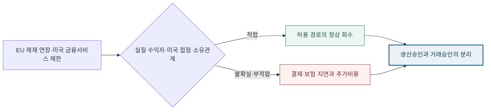

<!-- AUTO-GENERATED BY market-sensing-intelligence. DO NOT EDIT. -->

**POSCO International**{ .signal-pill .signal-pill-company .signal-company-name aria-label="회사 POSCO International" } **에너지**{ .signal-pill .signal-pill-axis aria-label="사업축 에너지" } **복합 이슈**{ .signal-pill .signal-pill-type aria-label="변화 유형 복합 이슈" }
{ .signal-detail-context .strategic-issue-context aria-label="회사, 사업축과 변화 유형" }

# 미얀마 가스전의 정상 생산과 대금회수를 갈라놓는 국제 제재

**이 이슈의 위치** · **경영 Function:** 재무 · 생산·운영 · 전략·투자 · **지역·시장:** 미얀마 해상 가스전 · 미얀마·중국 가스판매 · 국제 금융·보험 · **시간:** 2026년 거래 재검증부터 2027년 4월 EU 연례 검토까지

**왜 우리 회사 이슈인가 · 핵심 관심** · 가스 판매대금의 수익 귀속, 통화·은행·보험·보증, 비용회수율과 회수기간이 직접 노출됩니다. **바꿀 결정:** 생산·정비 승인과 거래별 결제·보험·외환 적합성 승인을 별도 절차로 분리할지 결정해야 합니다.

??? info "회사 연결 근거"

    **공식 사업 근거:** 포스코인터내셔널 감사자료는 미얀마 A-1·A-3 가스전의 51% 운영지분, MOGE 15% 참여와 정상 운영 상태를 확인합니다.

    **전달 경로:** 국제 제재가 거래별 금융서비스 심사로 전달되면 생산이 계속돼도 결제지연과 금융·보험 비용이 현금흐름을 바꿉니다.

    **회사 공식 원문:** [[sources/SRC-20260820-54ADB74E|회사 공식 근거 1]] · [[sources/SRC-20260819-D7164DFA|회사 공식 근거 2]]

!!! warning "대응 검토 · 활성 · 위험"

    **판단 질문:** 미얀마 가스전의 생산·정비 승인과 거래별 결제·보험·외환 승인을 별도 경영절차로 분리할 것인가?

    **잠정 결론:** 정상 생산과 정상 현금회수는 같은 상태가 아니므로 거래별 제재 적합성 지도를 별도 승인해야 합니다.

    **다음 사업 분기점:** EU의 2027년 연례 제재 검토와 거래은행 심사기준 변경 확인

**세 숫자로 읽는 시장 전환**

| **51%** | **15%** | **2027-04-30** |
| ---: | ---: | ---: |
| 포스코인터내셔널 가스전 운영지분 | MOGE 참여지분 | EU 제재 연장기한 |
| 생산·정비의 직접 운영노출입니다. | 제재 대상과 연결된 수익 귀속을 분리할 기준입니다. | 거래경로 재검증을 지속할 공식 시간경계입니다. |
| [[sources/SRC-20260820-54ADB74E|근거 1]] | [[sources/SRC-20260820-54ADB74E|근거 1]] | [[sources/SRC-20260820-E33837C5|근거 1]] |

**운영지분과 제재 소유기준을 같은 표에서 구분**

**읽는 법:** 51% 운영권, MOGE 15% 참여, OFAC 50% 기준은 서로 다른 질문에 답하므로 지분 하나로 위험을 단정할 수 없습니다.
{ .strategic-quant-lead }

| 항목 | 확인값 | 판단 |
| --- | --- | --- |
| 포스코인터내셔널 운영지분 | 51% | 생산·정비 운영노출 |
| MOGE 참여지분 | 15% | 수익 귀속·제재 접점 |
| OFAC 소유기준 | 50% | 자동 적용 여부의 한 경계 |

_단위 % · 기준일 2026-08-20 · 공식 확인값 · [[sources/SRC-20260820-54ADB74E|근거 1]] · [[sources/SRC-20260820-71D52944|근거 2]]_

_계산·범위: 회사 감사자료와 OFAC FAQ의 확인값을 나란히 둔 비교이며 회사 손실액이 아닙니다._

## 정상 생산 위에 결제·보험의 두 번째 운영조건이 생겼다

EU는 2026년 연례 검토에서 미얀마 제재를 2027년 4월 30일까지 연장했습니다. 제재 대상은 105명과 22개 기관·기업이며 자산동결과 직·간접 자금 제공 금지가 유지됩니다. 미국 재무부 지침은 미국인이 MOGE를 위해 송금·보험·보증·외환·신용장 등 금융서비스를 제공하는 것을 금지합니다. 이 조치들은 미얀마 가스전의 모든 생산활동을 일괄 중단시키는 규칙은 아니지만, 생산된 가스를 현금으로 바꾸는 거래경로에 별도 조건을 만들었습니다. 가동률과 판매량이 정상이어도 은행·보험사가 실질 수익자와 미국 접점을 재심사하면 회수시점과 비용은 달라질 수 있습니다.

**51% 운영권이 15% 제재 접점을 지우지 않는다.**

포스코인터내셔널은 미얀마 A-1·A-3 가스전의 51% 운영지분을 보유하고 MOGE는 15% 참여합니다. MOGE 지분이 OFAC의 50% 소유기준보다 낮다는 사실은 합작법인 전체가 자동으로 MOGE와 동일 취급되는지 판단하는 한 요소입니다. 그러나 금융서비스가 직접 또는 간접으로 MOGE의 이익을 위한 것인지, 미국인이나 미국 금융망이 관여하는지는 별도 질문으로 남습니다. 따라서 '지분율이 낮으니 제재 영향도 낮다'와 '생산이 정상이라 현금회수도 정상이다'라는 두 단순화 모두 피해야 합니다. 운영권, 수익 귀속, 결제서비스를 서로 다른 열로 관리하는 것이 필요합니다.

**변화와 분기점**

| 시점 | 구분 | 확인된 변화·판단 |
| --- | --- | --- |
| **2023년 10월 31일** | 공개 | 미국 재무부가 MOGE 금융서비스 지침 발표 |
| **2023년 12월 15일** | 시행 | 미국인의 MOGE 관련 금융서비스 제한 시행 |
| **2024년 12월 31일** | 시장 사건 | 회사가 미얀마 가스전 정상 운영과 영향액 산정 불가 공시 |
| **2026년 4월 27일** | 공개 | EU가 미얀마 제재를 12개월 연장 |
| **2027년 4월 30일** | 사업 분기점 | 현행 EU 제재 연장기한과 다음 연례 검토 기준 |

## 손익의 지배변수는 생산량에서 회수기간과 금융비용으로 확장

2025년 3분기 회사 자료는 미얀마 가스전 판매량 42.9Bcf와 영업이익 900억원을 제시해 사업의 현금창출 중요성을 보여줍니다. 같은 자료는 비용회수율 하락이 이익 감소 원인이라고 설명합니다. 여기에 제재상 심사가 더해지면 생산량뿐 아니라 미수금 일수, 환전·보험·보증 비용, 허용된 결제경로의 지속성이 자산가치를 좌우합니다. 총노출액은 가스판매대금 전체가 아니라 거래별 MOGE 귀속분과 제재 접점에서 시작해야 합니다. 실제 순영향은 결제지연에 따른 운전자본, 대체은행·통화 비용, 보험·보증 프리미엄을 더하고 정상 회수분을 제외해 계산해야 합니다.

**정상 생산이 거래심사를 거쳐 현금흐름으로 바뀌는 경로**

_구조 선택 근거: 생산과 결제를 분리하고 거래경로 적합성에서 정상 회수와 지연 위험이 갈리도록 설계했습니다._

**기회·위험·미실행 비용의 분기**

| 판단 축 | 성립 조건 | 사업 효과와 행동 |
| --- | --- | --- |
| **기회** | 거래별 제재 접점과 허용 결제경로를 사전에 문서화할 때 | **효과:** 정상 생산분의 회수 선택권과 금융기관 협상속도를 유지 **행동:** 계약·송금·보험·외환을 연결한 적합성 거래지도 완성 |
| **위험** | 추가 지정이나 금융기관 위험회피로 현행 경로가 막힐 때 | **효과:** 대금회수 지연과 금융·보험 비용 증가로 현금흐름 하락 **행동:** 거래를 중단하고 법무 승인된 대체은행·통화·보험으로 전환 |
| **미실행 비용** | 판단을 미룰 때 | 거래지도를 늦게 만들면 규칙이나 은행정책이 바뀐 뒤에야 대체경로를 찾아 정상 생산분의 회수시점과 협상 선택권을 잃을 수 있습니다. |

**결정 전환 조건:** 제재 명단·일반허가·은행 심사기준이 강화되면 방어경로로 전환하고, 현행 경로의 적합성과 정상 결제가 확인되면 대응강도를 낮춥니다.

**판단 범위:** 2026년 거래경로 재검증부터 2027년 4월 EU 연례 검토까지 · 분석 신뢰도 중간

## 계약·송금·보험을 한 장의 거래지도로 연결

가스판매 계약마다 지급자와 최종 수취인, 통화, 은행, 보험사, 보증 제공자, 미국인·미국 금융망 접점, MOGE 귀속분과 적용 예외를 연결해야 합니다. 각 경로에 법률검토일, 증빙 갱신일, 평시 승인기간과 대체경로를 붙이면 생산상태와 결제상태를 독립적으로 승인할 수 있습니다. 경영진에게는 생산량·비용회수율·미수금 일수·경로별 추가비용을 같은 화면에 두되 하나의 종합점수로 뭉개지 않는 편이 낫습니다. 거래은행이 경로를 중단하면 법무 승인 없이 우회하지 않고, 허용된 대체통화·은행·보험의 비용과 회수기간을 비교해 전환합니다. 이 거래지도는 제재 명단이 바뀔 때 영향을 받는 지급·수취 경로만 즉시 골라내고, 생산계획은 유지하되 현금회수 계획만 별도로 조정하는 운영 기반이 됩니다.

**거래별 적합성에서 현금흐름까지 이어지는 세 산출물**

| 순서·책임 | 이번에 만들 것 | 완료 후 판단 |
| --- | --- | --- |
| 1 · 법무·컴플라이언스 | 거래경로별 제재 적합성 지도 | 허용·보완·중단 분류 |
| 2 · 자금·보험 | 대체은행·통화·보험 비용표 | 경로별 전환 가능성 |
| 3 · 미얀마 사업·재무 | 결제지연 현금흐름 민감도 | 운영계획·배당·투자 조정 |

**권고 시한:** 2027-04-30

**제재 명단보다 거래은행 승인기간이 먼저 보내는 경보.**

외부에서는 EU 제재 명단과 연례 검토, OFAC 지침·FAQ·일반허가, 주요 금융기관의 미얀마 거래정책을 추적합니다. 내부에서는 미국 달러 결제비중, 미국인·미국 금융기관 접점, MOGE 귀속분, 은행별 승인기간, 미수금 일수, 보험·보증 거절과 비용회수율을 월별로 확인합니다. 명단이 바뀌지 않아도 은행의 위험회피로 승인기간이 늘면 현금흐름 경보를 높입니다. 반대로 현행 경로의 적합성이 재확인되고 승인기간과 미수금이 평시 범위에 머물면 방어비용과 이슈 강도를 낮춥니다.

**생산·결제·제재의 세 확인선을 분리**

| 관찰 지표·책임 | 강화 신호 | 완화 신호 |
| --- | --- | --- |
| 생산·비용회수 · 미얀마 사업 | 비용회수율 하락·정비차질 | 안정 생산·회수율 정상화 |
| 결제·보험 · 자금 | 승인지연·거절·비용증가 | 승인기간·미수금 정상 |
| 제재규칙 · 법무 | 추가 지정·일반허가 축소 | 명시적 허용·제한 해제 |

**결론을 바꾸는 조건**

| 이슈 강화 | 이슈 완화 |
| --- | --- |
| MOGE 관련 제재가 추가되거나 거래은행·보험사가 현행 경로를 중단합니다. | EU·미국이 MOGE 관련 제한을 해제하거나 현행 경로를 명시적으로 허용합니다. |
| 미수금 일수나 금융·보험 비용이 평시 범위를 이탈합니다. | 주요 거래은행 승인기간과 미수금이 정상 범위에서 지속됩니다. |

## 정책 원문과 감사자료가 위험의 범위와 반대조건을 함께 제시

EU 이사회 원문은 제재 연장기한과 자산동결·자금 제공 금지를 확인합니다. 미국 재무부 지침과 FAQ는 금융서비스의 넓은 범위, 다른 활동의 허용 경계, 50% 소유기준을 구분합니다. 회사 감사자료는 51% 운영지분과 MOGE 15% 지분, 2024년 말 정상 운영, 미래 영향액 산정 불가를 동시에 공시합니다. 이는 '즉시 생산중단' 결론을 제한하면서도 '영향 없음' 결론도 허용하지 않는 반대근거입니다. 2025년 3분기 실적은 실제 판매량과 이익, 비용회수율 민감도를 보여줍니다. 정책 사실과 회사 운영상태를 섞어 제재 손실액을 만들지 않고 거래별 내부자료가 필요한 경계를 남겼습니다.

**연결된 마켓 시그널**

- [[signals/SIG-3C1FC7BD3A4D|EU의 미얀마 제재가 2027년 4월까지 연장]] · 영향 5/5 · 긴급 4/5
- [[signals/SIG-562D3364FA7B|미국의 미얀마 국영가스공사 금융서비스 금지]] · 영향 5/5 · 긴급 4/5
- [[signals/SIG-DC54DC18D74A|미얀마 가스전 이익 감소와 Senex 판매단가 상승]] · 영향 5/5 · 긴급 4/5 · 회사 노출 확인
- [[signals/SIG-B3D99438BE40|Senex 판매·영업이익 증가와 미얀마 가스전 이익 감소]] · 영향 5/5 · 긴급 4/5 · 회사 노출 확인

??? note "공개지분과 정상운영만으로 거래의 적법성을 판정하지 않는 경계"

    공개자료는 계약별 판매대금의 수취인, MOGE 귀속분, 사용통화, 은행·보험사와 미국 접점을 보여주지 않습니다. OFAC 50% 소유기준 아래라는 사실도 개별 금융서비스가 MOGE의 이익을 위한 것인지에 대한 판단을 대신하지 않습니다. 이 보고서는 특정 거래의 적법성에 관한 법률의견이 아니며 제재를 우회할 방법을 제안하지 않습니다. 회사의 2024년 말 정상 운영 공시는 그 시점의 상태이고 이후 규칙·금융기관 행동을 확정하지 않습니다. 실제 영향액은 내부 계약·송금·보험 자료와 최신 법률검토를 넣어야 계산할 수 있습니다.
??? info "문서 관리 정보"

    등록 2026-08-20 · 최근 확인 2026-08-20 · 다음 모니터링 2026-10-31

    **지속 관찰 원칙:** 거래별 제재 적합성과 결제경로가 확인되고 반증 조건이 충족될 때까지 유지합니다.

    | 날짜 | 조치 | 단계 변화 | 판단 근거 |
    | --- | --- | --- | --- |
    | 2026-08-21 | title_pattern_rewrite | - | 활성 이슈 목록의 반복적인 ~할 때·~먼저다 문형을 해소하고 이슈별 변화·간극·판단에 맞는 제목 구조로 재작성 |
    | 2026-08-20 | 최초 등록 | 대응 검토 | EU와 미국의 서로 다른 제재 사건이 하나의 거래경로·현금회수 결정으로 수렴했습니다. |

**확인한 원문과 보관본**

- **Myanmar: EU restrictive measures extended until April 2027** · Council of the European Union · 2026-04-27 · [원문 링크](https://www.consilium.europa.eu/en/press/press-releases/2026/04/27/myanmar-eu-restrictive-measures-extended-until-april-2027/) · [[sources/SRC-20260820-E33837C5|보관 원문]]
- **Directive 1: Financial services involving MOGE** · U.S. Department of the Treasury OFAC · 2023-10-31 · [원문 링크](https://ofac.treasury.gov/media/932251/download?inline) · [[sources/SRC-20260820-5E07EF78|보관 원문]]
- **OFAC FAQs 1138 and 1139 on the MOGE directive** · U.S. Department of the Treasury OFAC · 2023-10-31 · [원문 링크](https://ofac.treasury.gov/faqs/added/2023-10-31) · [[sources/SRC-20260820-71D52944|보관 원문]]
- **POSCO International 2024 audited disclosure on Myanmar gas-field uncertainty** · POSCO INTERNATIONAL · 게시일 미상 · [원문 링크](https://www.poscointl.com/upload/file/202506/202506jSC_mILrzPv.pdf) · [[sources/SRC-20260820-54ADB74E|보관 원문]]
- **POSCO International 2025 Q3 Senex ramp-up results** · POSCO INTERNATIONAL · 2025-10-27 · [원문 링크](https://www.poscointl.com/upload/file/202510/202510QrrmjSOggdZe.pdf) · [[sources/SRC-20260819-D7164DFA|보관 원문]]
