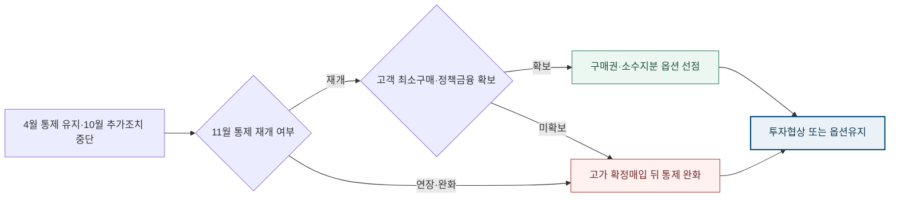

<!-- AUTO-GENERATED BY market-sensing-intelligence. DO NOT EDIT. -->

**POSCO Holdings**{ .signal-pill .signal-pill-company .signal-company-name aria-label="회사 POSCO Holdings" } **전략광물**{ .signal-pill .signal-pill-axis aria-label="사업축 전략광물" } **복합 이슈**{ .signal-pill .signal-pill-type aria-label="변화 유형 복합 이슈" }
{ .signal-detail-context .strategic-issue-context aria-label="회사, 사업축과 변화 유형" }

# 11월 끝나는 중국 희토류 추가통제 유예, 광산보다 구매권 선점

**이 이슈의 위치** · **경영 Function:** 전략·투자 · 구매·공급망 · **지역·시장:** 중국 희토류 공급망 · 미국·한국 비중국 조달시장 · **시간:** 2026년 11월 후속공고 전후

**왜 우리 회사 이슈인가 · 조건부 관심** · 신규 진입 후보의 구매권·소수지분·분리정제 옵션과 잠재 고객 최소구매 조건이 조건부로 노출됩니다. **바꿀 결정:** 자산을 확정 매입하지 않고 고객계약이 붙은 구매권과 단계투자 옵션만 먼저 확보할지 결정해야 합니다.

??? info "회사 연결 근거"

    **공식 사업 근거:** 포스코홀딩스는 핵심광물 현지 연구와 비중국 공급망 후보 검토를 공식화했지만 희토류를 확정 주력사업으로 공시하지는 않았습니다.

    **전달 경로:** 중국 허가제와 미국 가격·구매 지원이 비중국 희토류 옵션가치를 높이지만 고객계약이 없으면 자산가격과 판로 위험이 남습니다.

    **회사 공식 원문:** [[sources/SRC-20260820-C228E651|회사 공식 근거 1]]

!!! warning "대응 검토 · 활성 · 기회·위험 혼재"

    **판단 질문:** 11월 후속공고 전 희토류 자산을 매입할 것인가, 고객계약이 붙은 옵션만 먼저 확보할 것인가?

    **잠정 결론:** 11월 후속결정 전에는 확정 자산보다 철회 가능한 구매권·소수지분·단계투자의 가치를 비교해야 합니다.

    **다음 사업 분기점:** 2026년 11월 10일 중국 상무부의 추가통제 재개·연장·조정 여부

**세 숫자로 읽는 시장 전환**

| **2026-11-10 종료일** | **2026년 11월 10일** | **2025년 11월 7일** |
| ---: | ---: | ---: |
| 추가 희토류 통제 중단 종료일 | 변화 시점 | 변화 시점 |
| 재개·연장 여부가 대체공급 투자와 구매권의 가치를 바꿉니다. | 추가조치 중단 종료와 후속결정 확인선 | 10월 추가조치 여섯 건의 한시 중단 공고 |
| [[sources/SRC-20260819-6BAE3360|근거 1]] | [[sources/SRC-20260819-6BAE3360|근거 1]] | [[sources/SRC-20260819-6BAE3360|근거 1]] |

**미국은 희토류 공급망에 자본 4억 달러와 대출 1.5억 달러를 묶었다**

**읽는 법:** 자본과 대출만 5.5억 달러이며 가격하한·구매계약까지 붙어 비중국 공급의 하방을 여러 층으로 나눴습니다.
{ .strategic-quant-lead }

| 시점·항목 | 확인값 | 첫 값 대비 |
| --- | --- | --- |
| 우선주 투자 | 400 USD million | 기준 |
| 분리설비 대출 | 150 USD million | -62% |

_단위 표 안에 표시 · 기준일 2025-08-10 · 공식 확인값 · [[sources/SRC-20260819-0692EE56|근거 1]] · [[sources/SRC-20260819-F04174E5|근거 2]]_

_계산·범위: MP Materials 공시와 미국 국방부 발표의 확정 금액만 비교했으며 가격하한과 구매계약 가치는 합산하지 않았습니다._

## 중단과 해제를 혼동하면 진입가격부터 틀어진다

미국 지원은 보조금 한 줄이 아니라 4억 달러 자본, 1억5천만 달러 대출, kg당 110달러 가격하한과 10년 구매계약을 묶은 구조입니다. 대체공급의 경제성은 광물가격보다 이 하방분담 패키지를 받을 수 있는지에 달렸습니다.

중국은 2025년 4월 사마륨·가돌리늄·터븀·디스프로슘·루테튬·스칸듐·이트륨 관련 품목에 허가제를 시행했습니다. 뒤이어 10월 더 넓은 조치를 발표했지만, 11월 공고로 그 추가조치 여섯 건만 2026년 11월 10일까지 중단했습니다. 따라서 현재 상태는 전면 해제도 전면 시행도 아닙니다. 같은 기간 미국은 MP Materials에 지분·대출·10년 가격하한·10년 구매계약을 묶어 비중국 공급망을 계약으로 고정했습니다. 중국 공고의 불확실성과 미국 수요 선점이 동시에 움직이는 것이 이번 변화의 핵심입니다.

**공급불안이 확정된 뒤 사도 된다는 전제의 붕괴.**

기존 접근은 통제 범위가 확정되면 부족 품목을 고르고 광산이나 분리정제 자산을 실사하는 순서일 수 있습니다. 그러나 장기구매와 정책금융이 먼저 체결되면 후발 투자자는 좋은 자산뿐 아니라 고객·가격보호·허용국가의 선택권까지 잃습니다. 반대로 통제 재개를 확정사실처럼 보고 자산을 비싸게 매입하면 중단 연장 시 하방을 회사가 홀로 부담합니다. 판단 순서를 자산 선정에서 고객 최소구매, 정책 적격성, 옵션가격, 지배구조 제한의 결합 심사로 바꿔야 합니다.

**변화와 분기점**

| 시점 | 구분 | 확인된 변화·판단 |
| --- | --- | --- |
| **2025년 4월 4일** | 시행 | 7개 희토류 관련 품목 수출허가 시행 |
| **2025년 11월 7일** | 공개 | 10월 추가조치 여섯 건의 한시 중단 공고 |
| **2026년 11월 10일** | 사업 분기점 | 추가조치 중단 종료와 후속결정 확인선 |

## 희토류 진입 손익은 광물가격보다 계약 순서에서 갈린다

상단 정량표는 자본과 대출만 5.5억 달러이며 가격하한·구매계약까지 붙어 비중국 공급의 하방을 여러 층으로 나눴습니다. 단위와 기준일을 확인하고, 공식 확인값과 공개자료 역산값으로 읽어야 합니다.

포스코홀딩스에 첫 영향은 자산가격입니다. 통제 우려가 선반영된 확정매입은 가격 하락과 수율 부진을 동시에 떠안을 수 있습니다. 두 번째는 판매량입니다. 국내외 고객의 최소구매가 없으면 분리정제 설비가 가동돼도 판로 하방이 남습니다. 세 번째는 통제권입니다. 해외 정책금융은 판매처·원산지·지배구조 조건을 붙일 수 있어 지원액보다 잃는 선택권이 클 수 있습니다. 구매권과 소수지분을 먼저 쓰면 11월 전 공급선은 확보하면서 규제와 고객행동이 엇갈릴 때 철회할 수 있습니다.

**통제 재개 가능성이 자산매입과 옵션확보를 가르는 구조**

_구조 선택 근거: 중국 후속공고와 고객 최소구매라는 두 조건이 함께 충족될 때만 확정투자로 넘어가므로 조건 분기와 옵션 경로를 함께 보여줍니다._

**기회·위험·미실행 비용의 분기**

| 판단 축 | 성립 조건 | 사업 효과와 행동 |
| --- | --- | --- |
| **기회** | 추가통제 재개 가능성과 국내 고객 최소구매가 함께 확인될 때 | **효과:** 비중국 원료·분리정제의 판매 하방을 낮춘 진입 선택권 확보 **행동:** 고객 공동의 구매권·소수지분·정책금융 패키지를 우선협상 |
| **위험** | 추가통제 중단이 연장되고 후보자산 가격이 공급불안을 선반영할 때 | **효과:** 고가 진입 뒤 통제 완화로 자산가치와 가동률이 동시에 하락 **행동:** 확정매입을 보류하고 품목별 재고·복수 공급계약으로 노출 방어 |
| **미실행 비용** | 판단을 미룰 때 | 11월까지 아무 옵션도 잡지 않으면 통제 재개 시 우량 원료권과 고객 공동개발 협상순서를 경쟁사에 내줄 수 있습니다. |

**결정 전환 조건:** 중국 공고와 고객 최소구매가 모두 강화되면 투자협상으로, 둘 중 하나가 약해지면 옵션·구매계약 중심으로 전환합니다.

**판단 범위:** 2026년 11월 중국 후속공고 전후의 희토류 진입 방식 · 분석 신뢰도 높음

## 11월 전 확정매입보다 조건부 옵션 세 묶음

11월 공고 전에는 확정매입보다 철회 가능한 구매권·소수지분·단계투자를 우선하는 것이 타당합니다. 그 판단은 4월 유지품목과 10월 중단품목을 고객 제품별로 나눈 재고·대체 가능성, 후보사업의 고객 최소구매·가격공식·정책금융·허용국가·지배구조 제한을 같은 기준으로 비교한 뒤 내려야 합니다. 통제 재개와 고객계약이 함께 확인될 때만 확정투자로 넘어가고, 둘 중 하나가 약하면 옵션과 조달계약을 유지합니다. 공고 후에는 이미 합의한 전환 규칙과 승인절차로 품목별 투자·조달안을 즉시 다시 판단할 수 있어야 합니다.

**결정을 미루지 않기 위해 먼저 완성할 세 가지 산출물**

| 순서·책임 | 이번에 만들 것 | 완료 후 판단 |
| --- | --- | --- |
| 1 · 포스코홀딩스 전략광물 사업개발·구매·정책금융 담당 | 통제품목별 국내 고객 노출과 최소구매 의향표를 만듭니다. | 두 번째 검증으로 이동 |
| 2 · 포스코홀딩스 전략광물 사업개발·구매·정책금융 담당 | 희토류 원료·분리정제·재활용 후보의 구매권·소수지분 조건을 비교합니다. | 대안의 경제성과 실행 가능성 비교 |
| 3 · 포스코홀딩스 전략광물 사업개발·구매·정책금융 담당 | 11월 공고별 48시간 재평가와 협상전환 절차를 확정합니다. | 투자·계약·보류 중 하나를 선택 |

_문단에 흩어진 행동을 실행 순서와 완료 후 판단으로 재구성했습니다._

**권고 시한:** 2026-11-10

**공고 한 줄보다 고객 주문과 허가 처리속도가 먼저다.**

가장 먼저 볼 외부 지표는 11월 10일 전후 중국 상무부 후속공고, 4월 품목의 허가 처리기간, 수출량과 납기입니다. 시장에서는 NdPr와 중희토류 가격만 보지 말고 고객의 실제 장기구매·재고 축적과 비중국 공급자의 가동률을 확인해야 합니다. 내부에서는 품목별 고객 최소구매, 허용 대체재, 후보사업 옵션가격과 철회조건을 관리합니다. 통제가 연장돼도 고객 주문이 늘지 않으면 확정투자를 늦추고, 재개와 최소구매가 동시에 확인되면 즉시 우선협상으로 올립니다.

**세 확인선이 현재 결론을 강화하거나 낮춘다**

| 관찰 지표·책임 | 강화 신호 | 완화 신호 |
| --- | --- | --- |
| 1 · 포스코홀딩스 전략광물 사업개발·구매·정책금융 담당 | 중국이 10월 추가조치를 재개하거나 대상 품목을 확대합니다. | 중국이 추가조치를 장기 중단하고 4월 품목도 공식 해제합니다. |
| 2 · 포스코홀딩스 전략광물 사업개발·구매·정책금융 담당 | 국내 고객이 12개월 이상 최소구매와 가격공식에 합의합니다. | 고객 수요와 정책금융을 결합해도 후보사업의 하방이 분담되지 않습니다. |
| 3 · 포스코홀딩스 전략광물 사업개발·구매·정책금융 담당 | 2026년 11월 10일 중국 상무부의 추가통제 재개·연장·조정 여부 | 반증 조건이 확인되면 이슈 강도를 낮춥니다. |

_공식 발표와 내부 확인값이 바뀌면 같은 표에서 이슈 강도를 다시 판단합니다._

**결론을 바꾸는 조건**

| 이슈 강화 | 이슈 완화 |
| --- | --- |
| 중국이 10월 추가조치를 재개하거나 대상 품목을 확대합니다. | 중국이 추가조치를 장기 중단하고 4월 품목도 공식 해제합니다. |
| 국내 고객이 12개월 이상 최소구매와 가격공식에 합의합니다. | 고객 수요와 정책금융을 결합해도 후보사업의 하방이 분담되지 않습니다. |

## 중국 공고와 미국 계약을 서로 다른 역할로 읽은 근거

중국 상무부 공고는 어떤 품목이 시행 중이고 어떤 추가조치가 언제까지 중단됐는지를 확인하는 1차 근거입니다. 미국 SEC 공시와 국방부 발표는 비중국 희토류 공급망에서 지분·대출·가격하한·장기구매가 실제 계약으로 묶였음을 보여줍니다. 미국 사례를 포스코홀딩스 수익으로 전용하지 않고, 진입구조의 비교 기준으로만 사용했습니다.

**판단 메모:** 이 이슈의 핵심은 11월 10일을 임의의 투자 마감일로 쓰는 것이 아니라, 중국의 추가조치 중단 상태가 바뀌는 공식 확인선으로 쓰는 데 있습니다. 포스코홀딩스는 공고가 나오기 전에는 품목별 노출, 고객 최소구매, 정책금융, 옵션가격을 준비하고 공고 뒤에는 이미 합의한 전환 규칙으로 확정투자·옵션유지·철회를 선택해야 합니다. 통제 재개만 확인되고 고객 주문이 없으면 재고·구매권으로 방어하고, 고객 주문만 늘고 통제가 연장되면 재활용·대체재 사업을 우선합니다. 두 조건이 함께 강화될 때만 광산·분리정제의 확정자본을 늘리는 구조가 과잉반응을 막습니다. 내부 회의에는 원소별 규제상태, 12개월 수요, 안전재고, 대체 가능성, 후보사업의 최소구매 커버리지와 철회비용을 한 장에 올려야 합니다.

**의사결정 연결:** 유지 중인 4월 통제와 중단된 10월 조치를 분리해야 하며, 미국의 장기계약 선점 때문에 11월 후속결정 전 옵션 확보의 가치가 커졌습니다. 이를 실행으로 옮길 첫 산출물은 ‘통제품목별 국내 고객 노출과 최소구매 의향표를 만듭니다.’이며, 반증 조건이 확인되면 보고서 강도를 낮추고 이력에 근거를 남깁니다.

**연결된 마켓 시그널**

- [[signals/SIG-35E375530293|중국 추가 희토류 통제 2026년 11월까지 중단]] · 영향 5/5 · 긴급 5/5
- [[signals/SIG-C68CC1899242|미국, 희토류 공급망에 10년 가격·구매 보장]] · 영향 5/5 · 긴급 4/5

??? note "원소 후보와 정부 방향을 확정하지 않는 분석 경계"

    전략광물의 정부 공식 범위와 포스코홀딩스의 후보 원소는 확인되지 않았으므로 희토류 전체를 확정 진입대상으로 단정하지 않습니다. 10년 가격하한과 구매계약은 미국의 특정 회사·시설에 적용된 계약이며 한국 사업에 같은 조건이 제공된다는 보장이 없습니다. 공개정보로는 국내 고객 품목별 소비량, 후보자산 가격·수율·환경비용을 알 수 없습니다. 따라서 이 보고서는 지금 확정매입하라는 결론이 아니라 11월 전 철회 가능한 옵션과 고객계약을 선행하자는 판단입니다.
??? info "문서 관리 정보"

    등록 2026-08-20 · 최근 확인 2026-08-20 · 다음 모니터링 2026-09-30

    **지속 관찰 원칙:** 반증 조건이 충족되거나 사람이 근거를 기록해 종료하기 전까지 유지하고 다음 검토일에 지표를 갱신합니다.

    | 날짜 | 조치 | 단계 변화 | 판단 근거 |
    | --- | --- | --- | --- |
    | 2026-08-21 | title_pattern_rewrite | - | 활성 이슈 목록의 반복적인 ~할 때·~먼저다 문형을 해소하고 이슈별 변화·간극·판단에 맞는 제목 구조로 재작성 |
    | 2026-08-20 | executive_title_rewrite | - | 법령 코드·영문 약어·단위·업계 은어를 제목에서 제거하고 임원이 사전 설명 없이 이해할 수 있는 시장 변화와 판단으로 재작성 |
    | 2026-08-20 | sparse_visual_rewrite | - | 2~3개 값과 시나리오를 강제 차트에서 가정·결과가 함께 보이는 정량표로 교체 |
    | 2026-08-20 | quantitative_rewrite | - | 공개 수치와 회사 민감도를 분리하고 첫 화면 정량 차트 중심으로 전면 편집 |
    | 2026-08-20 | 최초 등록 | 대응 검토 | 유지 중인 4월 통제와 중단된 10월 조치를 분리해야 하며, 미국의 장기계약 선점 때문에 11월 후속결정 전 옵션 확보의 가치가 커졌습니다. |

**확인한 원문과 보관본**

- **중국 일부 희토류 관련 품목 수출통제** · 중화인민공화국 상무부·해관총서 · 2025-04-04 · [원문 링크](https://www.mofcom.gov.cn/cms_files/filemanager/policySummary/viewcore_a6ea0f03b9be475a9d06ee9d088d605d.html) · [[sources/SRC-20260819-F35BD3B2|보관 원문]]
- **중국 2025년 10월 추가 수출통제의 한시 중단** · 중화인민공화국 상무부·해관총서 · 2025-11-07 · [원문 링크](https://policy.mofcom.gov.cn/claw/clawContent.shtml?id=104117) · [[sources/SRC-20260819-6BAE3360|보관 원문]]
- **MP Materials 8-K: U.S. Department of Defense rare earth partnership** · MP Materials Corp. / U.S. Securities and Exchange Commission · 2025-07-10 · [원문 링크](https://www.sec.gov/Archives/edgar/data/1801368/000119312525157310/d43796d8k.htm) · [[sources/SRC-20260819-0692EE56|보관 원문]]
- **Office of Strategic Capital first loan for MP Materials heavy rare earth separation** · U.S. Department of Defense · 2025-08-10 · [원문 링크](https://www.war.gov/News/Releases/Release/Article/4270722/office-of-strategic-capital-announces-first-loan-through-dod-agreement-with-mp/) · [[sources/SRC-20260819-F04174E5|보관 원문]]
