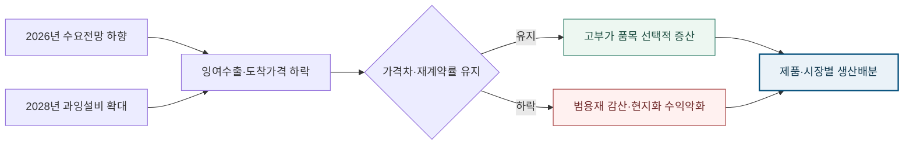

<!-- AUTO-GENERATED BY market-sensing-intelligence. DO NOT EDIT. -->

**POSCO**{ .signal-pill .signal-pill-company .signal-company-name aria-label="회사 POSCO" } **철강**{ .signal-pill .signal-pill-axis aria-label="사업축 철강" } **수급·가격**{ .signal-pill .signal-pill-type aria-label="변화 유형 수급·가격" }
{ .signal-detail-context .strategic-issue-context aria-label="회사, 사업축과 변화 유형" }

# 2028년 세계 철강 과잉설비 7.45억 톤, 총톤보다 가격방어

**이 이슈의 위치** · **경영 Function:** 전략·투자 · 영업·고객 · 생산·운영 · **지역·시장:** 글로벌 철강시장 · 중국·신흥국 수출시장 · **시간:** 2027~2028년 제품·시장별 물량계획

**왜 우리 회사 이슈인가 · 핵심 관심** · 범용재 생산량, 제품별 가격차, 고객 재계약률, 해외 거점 가동률과 현지화 투자안이 직접 노출됩니다. **바꿀 결정:** 범용재 물량 확대를 유지할지, 가격방어력이 확인된 제품·시장 물량만 생산할지 결정해야 합니다.

??? info "회사 연결 근거"

    **공식 사업 근거:** 포스코는 국내 일관제철소와 해외 생산·가공 거점을 운영해 글로벌 수요 둔화와 잉여수출이 제품가격·가동률·현지화 수익에 직접 연결됩니다.

    **전달 경로:** 수요전망 하향과 과잉설비 확대가 도착가격과 무역구제를 거쳐 제품별 마진·생산배분·현지화 투자수익을 바꿉니다.

    **회사 공식 원문:** [[sources/SRC-20260819-A3487743|회사 공식 근거 1]]

!!! warning "대응 검토 · 활성 · 위험"

    **판단 질문:** 2027~2028 범용재 물량 확대를 유지할 것인가, 제품·시장별 가격방어력이 확인된 물량만 생산할 것인가?

    **잠정 결론:** 2027~2028 생산·판매 예산은 총톤이 아니라 제품별 가격방어력과 시장접근비용으로 재배분해야 합니다.

    **다음 사업 분기점:** worldsteel 차기 수요전망과 중국·ASEAN 잉여수출의 POSCO 핵심시장 도착가격 확인

**세 숫자로 읽는 시장 전환**

| **745 Mt** | **2026년 6월 4일** | **2026년 4월 14일** |
| ---: | ---: | ---: |
| 2028년 세계 철강 과잉설비 전망 | 변화 시점 | 변화 시점 |
| 수요 회복보다 설비 증가가 빨라 범용재 가격과 무역구제 압력이 함께 커질 수 있습니다. | OECD가 2028년 과잉설비 7억4,500만 톤 전망 | 2026년 수요전망을 17억2,400만 톤으로 하향 |
| [[sources/SRC-20260818-2778E1E7|근거 1]] | [[sources/SRC-20260818-2778E1E7|근거 1]] | [[sources/SRC-20260819-4E44C10E|근거 1]] |

**수요보다 설비가 1억500만 톤 더 늘어난다**

**읽는 법:** 2025~2028 과잉설비가 640Mt에서 745Mt로 16% 늘어 범용재 가동률 경쟁의 가격 하방이 강화됩니다.
{ .strategic-quant-lead }

| 시점·항목 | 확인값 | 첫 값 대비 |
| --- | --- | --- |
| 2025 | 640 Mt | 기준 |
| 2028 | 745 Mt | +16% |

_단위 표 안에 표시 · 기준일 2026-06-04 · 공식 확인값 · [[sources/SRC-20260818-2778E1E7|근거 1]]_

_계산·범위: OECD가 제시한 2025년 추정치와 2028년 전망치를 연결했습니다. 중간 연도는 보간하지 않았습니다._

## 수요 4,900만 톤 하향과 과잉설비 1억500만 톤 확대의 교차

OECD 전망에서 2026~2028 수요 증가는 3,400만 톤, 신규 설비는 최대 1억3,900만 톤입니다. 차이는 1억500만 톤으로 과잉설비가 6.4억 톤에서 7.45억 톤으로 커지는 계산과 정확히 맞물립니다.

worldsteel은 2025년 10월 2026년 세계 철강 수요를 17억7,300만 톤으로 봤지만 2026년 4월 17억2,400만 톤으로 낮췄습니다. 같은 사이 중국의 2025년 수요 감소는 예상보다 컸습니다. OECD는 세계 과잉설비가 2025년 6억4,000만 톤에서 2028년 7억4,500만 톤으로 늘고, 계획된 신규 설비는 최대 1억3,900만 톤인 반면 2030년까지 수요는 연평균 약 0.9% 늘 것으로 전망했습니다. 수요 하향과 설비 확대가 동시에 가격방어력을 압박합니다.

**가동률을 높이면 이익이 따라온다는 범용재 계획의 한계.**

수요가 플러스로 돌아서면 물량과 가동률을 늘려 고정비를 흡수할 수 있다는 계획은 설비 증가가 수요보다 빠를 때 약해집니다. 잉여물량이 수출로 밀리면 판매량을 늘려도 도착가격과 마진이 더 빨리 떨어질 수 있고 무역구제·쿼터 비용까지 붙습니다. 인도 성장과 선진국 회복은 기회지만 세계 평균을 POSCO 모든 제품·시장에 적용할 수는 없습니다. 생산계획 기준을 총톤과 평균 가동률에서 제품별 가격차, 고객 재계약률, 통상비용, 현지화 후 저가격 수익률로 바꿔야 합니다.

**변화와 분기점**

| 시점 | 구분 | 확인된 변화·판단 |
| --- | --- | --- |
| **2025년 10월 13일** | 공개 | worldsteel이 2026년 수요 17억7,300만 톤 전망 |
| **2026년 4월 14일** | 공개 | 2026년 수요전망을 17억2,400만 톤으로 하향 |
| **2026년 6월 4일** | 공개 | OECD가 2028년 과잉설비 7억4,500만 톤 전망 |

## 범용재 가격·통상비용·현지화 자본이 한 손익으로 묶인다

상단 정량표는 2025~2028 과잉설비가 640Mt에서 745Mt로 16% 늘어 범용재 가동률 경쟁의 가격 하방이 강화됩니다. 단위와 기준일을 확인하고, 공식 확인값과 공개자료 역산값으로 읽어야 합니다.

첫 영향은 범용재 가격입니다. 중국·신흥국 잉여수출이 POSCO 핵심시장에 도착하면 할인과 재고가 늘 수 있습니다. 두 번째는 제품 믹스입니다. 고객승인·규격·서비스가 가격차를 지키는 품목은 생산능력 재배분의 기회가 되지만 프리미엄이 원가차보다 작으면 고부가라는 이름만 남습니다. 세 번째는 현지화 투자입니다. 관세회피 효과가 있어도 현지 가격과 가동률이 낮으면 자본비용을 회수하지 못합니다. 동일한 가격충격을 각 시장·Signal에서 중복 합산하지 않고 제품별 순노출을 계산해야 합니다.

**수요 하향과 과잉설비가 제품별 가격방어력에서 합류하는 경로**

_구조 선택 근거: 수요와 설비라는 독립 채널이 잉여수출·무역구제로 합류한 뒤 제품별 가격차에 따라 선택적 증산과 감산이 갈리도록 구성했습니다._

**기회·위험·미실행 비용의 분기**

| 판단 축 | 성립 조건 | 사업 효과와 행동 |
| --- | --- | --- |
| **기회** | 고부가 제품의 가격차·재계약률과 인도 등 성장시장의 주문잔고가 유지될 때 | **효과:** 범용재 감산 속에서도 고마진 제품·시장에 설비와 영업을 재배분해 이익 방어 **행동:** 고객승인·서비스·규격 장벽이 있는 품목에 생산과 계약 우선배정 |
| **위험** | 잉여수출 도착가격이 내려가고 무역구제가 확대될 때 | **효과:** 범용재 단가·가동률·현지화 투자수익이 함께 하락 **행동:** 제품별 최소마진·감산·대체시장 기준을 조기에 가동 |
| **미실행 비용** | 판단을 미룰 때 | 총톤 계획을 그대로 유지하면 가격차가 남은 고객·품목에 생산능력과 영업자원을 옮길 시간을 잃을 수 있습니다. |

**결정 전환 조건:** 가격차와 재계약률이 유지되면 선택적 증산으로, 둘 중 하나가 하한을 깨면 감산·시장재배치 방어안으로 전환합니다.

**판단 범위:** 2027~2028 제품·시장별 생산·판매·현지화 계획 · 분석 신뢰도 높음

## 총톤 예산을 가격방어력 지도와 자동 감산기준으로 교체

제품·시장별 판매가격, 원료비, 물류·관세·CBAM, 할인, 고객 재계약률을 연결해 도착기준 순마진 지도를 만들어야 합니다. 중국·ASEAN 수출과 핵심시장 도착가격이 내부 하한을 깨면 감산·시장재배치가 자동 시작되는 기준을 정합니다. 고부가 품목은 명칭이 아니라 고객 승인기간, 가격차, 재계약률과 서비스 수익으로 검증합니다. 해외 현지화는 기준가격뿐 아니라 저가격·저가동률·추가 무역장벽 시나리오에서 NPV를 비교하고, 세계 수요 평균 대신 실제 주문잔고와 계약가격이 확인된 시장만 선택적으로 증산합니다.

**결정을 미루지 않기 위해 먼저 완성할 세 가지 산출물**

| 순서·책임 | 이번에 만들 것 | 완료 후 판단 |
| --- | --- | --- |
| 1 · POSCO 전략기획·글로벌마케팅·생산·해외투자 담당 | 제품·시장별 도착가격 차이와 재계약률 지도를 만듭니다. | 두 번째 검증으로 이동 |
| 2 · POSCO 전략기획·글로벌마케팅·생산·해외투자 담당 | 중국·ASEAN 잉여수출 충격을 생산배분과 감산기준에 연결합니다. | 대안의 경제성과 실행 가능성 비교 |
| 3 · POSCO 전략기획·글로벌마케팅·생산·해외투자 담당 | 현지화 투자안을 저가격·저가동률·통상장벽 세 시나리오로 재평가합니다. | 투자·계약·보류 중 하나를 선택 |

_문단에 흩어진 행동을 실행 순서와 완료 후 판단으로 재구성했습니다._

**도착가격·가격차·재계약률이 생산배분을 바꾸는 세 지표.**

외부에서는 중국·ASEAN 월간 수출, 지역별 도착가격, 신규 설비의 실제 가동·취소, 무역구제 조사와 쿼터 소진을 봅니다. 내부에서는 제품별 원료비 대비 판매가격 차이, 고객 재계약률, 주문잔고, 재고일수와 현지화 투자수익률을 관리합니다. 핵심 품목 가격차와 재계약률이 유지되면 선택적 증산을 허용합니다. 둘 중 하나가 내부 하한을 깨고 잉여수출 도착가격도 내려가면 범용재 감산과 대체시장 전환을 즉시 가동합니다. 전망보다 계약과 도착가격을 우선합니다.

**세 확인선이 현재 결론을 강화하거나 낮춘다**

| 관찰 지표·책임 | 강화 신호 | 완화 신호 |
| --- | --- | --- |
| 1 · POSCO 전략기획·글로벌마케팅·생산·해외투자 담당 | 중국 수출과 핵심시장 도착가격 하락이 두 분기 이상 이어집니다. | 고부가 품목의 가격차와 재계약률이 구조적으로 유지됩니다. |
| 2 · POSCO 전략기획·글로벌마케팅·생산·해외투자 담당 | 핵심 품목의 가격차 또는 재계약률이 내부 하한 아래로 떨어집니다. | 계획된 설비 취소·감산으로 과잉설비 전망이 유의하게 낮아집니다. |
| 3 · POSCO 전략기획·글로벌마케팅·생산·해외투자 담당 | worldsteel 차기 수요전망과 중국·ASEAN 잉여수출의 POSCO 핵심시장 도착가격 확인 | 반증 조건이 확인되면 이슈 강도를 낮춥니다. |

_공식 발표와 내부 확인값이 바뀌면 같은 표에서 이슈 강도를 다시 판단합니다._

**결론을 바꾸는 조건**

| 이슈 강화 | 이슈 완화 |
| --- | --- |
| 중국 수출과 핵심시장 도착가격 하락이 두 분기 이상 이어집니다. | 고부가 품목의 가격차와 재계약률이 구조적으로 유지됩니다. |
| 핵심 품목의 가격차 또는 재계약률이 내부 하한 아래로 떨어집니다. | 계획된 설비 취소·감산으로 과잉설비 전망이 유의하게 낮아집니다. |

## worldsteel 단기수요와 OECD 중기설비를 결합한 이유

worldsteel의 2025년 10월과 2026년 4월 전망 비교는 같은 기관이 수요 회복 강도를 낮춘 변화를 보여줍니다. OECD Steel Outlook 2026은 과잉설비·신규설비·수요성장과 중국 수출을 중기 구조로 확인합니다. 두 독립 산업·정책 채널이 같은 가격압박 방향을 가리키지만 POSCO 제품별 가격과 계약은 공개되지 않아 내부 검증을 결론의 조건으로 남겼습니다.

**판단 메모:** 수요 전망 4,900만 톤 하향과 2025~2028년 과잉설비 1억500만 톤 확대는 같은 단위의 단순 차감값이 아닙니다. 하나는 특정 연도의 소비 전망 변화이고 다른 하나는 중기 설비와 수요의 격차입니다. 다만 두 채널이 모두 범용재 도착가격과 통상조치의 압력을 높인다는 점은 일치합니다. 생산계획에는 세계 평균 대신 제품·시장별 주문잔고, 가격차, 재계약률, 재고일수와 통상비용을 넣어야 합니다. 가격차가 남는 품목은 고객승인·서비스 결합을 확대하고, 범용재는 감산과 대체시장 전환의 자동 기준을 둡니다. 해외 현지화는 관세회피만 보지 말고 현지 가격이 하락하고 가동률이 낮아져도 자본비용을 넘는지 확인해야 합니다. 이 지표들이 없으면 물량 확대와 고부가 전환이 구호에 머물고 실제 설비·고객 우선순위를 바꾸지 못합니다.

**의사결정 연결:** 수요 전망 하향과 설비 증가가 같은 방향으로 범용재 가격을 압박해 2027~2028 생산·판매·현지화 계획을 총톤이 아닌 가격방어력 기준으로 다시 봐야 합니다. 이를 실행으로 옮길 첫 산출물은 ‘제품·시장별 도착가격 차이와 재계약률 지도를 만듭니다.’이며, 반증 조건이 확인되면 보고서 강도를 낮추고 이력에 근거를 남깁니다.

**연결된 마켓 시그널**

- [[signals/SIG-E31D64ABA031|세계 철강 수요 회복 전망 하향]] · 영향 5/5 · 긴급 4/5
- [[signals/SIG-A07F1B887CA2|2028년 세계 철강 과잉설비 7억4,500만 톤 전망]] · 영향 5/5 · 긴급 4/5

??? note "세계 총량을 POSCO 제품 손익으로 바로 옮기지 않는 경계"

    worldsteel과 OECD 전망은 세계·지역 총량이며 POSCO의 제품별 판매가격, 원가, 고객 충성도와 현지화 투자조건을 직접 계산하지 않습니다. 인도 성장, 선진국 회복, 고부가 제품의 규격장벽은 결론을 완화할 수 있습니다. 과잉설비 전망도 프로젝트 취소·지연과 정책 변화에 따라 달라집니다. 따라서 이 보고서는 전면 감산이나 투자중단을 권고하지 않습니다. 내부 가격차·재계약률·주문잔고를 넣어 가격방어력이 확인된 물량만 생산·투자하자는 조건부 판단입니다.
??? info "문서 관리 정보"

    등록 2026-08-20 · 최근 확인 2026-08-20 · 다음 모니터링 2026-09-30

    **지속 관찰 원칙:** 반증 조건이 충족되거나 사람이 근거를 기록해 종료하기 전까지 유지하고 다음 검토일에 지표를 갱신합니다.

    | 날짜 | 조치 | 단계 변화 | 판단 근거 |
    | --- | --- | --- | --- |
    | 2026-08-21 | title_pattern_rewrite | - | 활성 이슈 목록의 반복적인 ~할 때·~먼저다 문형을 해소하고 이슈별 변화·간극·판단에 맞는 제목 구조로 재작성 |
    | 2026-08-20 | executive_title_rewrite | - | 법령 코드·영문 약어·단위·업계 은어를 제목에서 제거하고 임원이 사전 설명 없이 이해할 수 있는 시장 변화와 판단으로 재작성 |
    | 2026-08-20 | sparse_visual_rewrite | - | 2~3개 값과 시나리오를 강제 차트에서 가정·결과가 함께 보이는 정량표로 교체 |
    | 2026-08-20 | quantitative_rewrite | - | 공개 수치와 회사 민감도를 분리하고 첫 화면 정량 차트 중심으로 전면 편집 |
    | 2026-08-20 | 최초 등록 | 대응 검토 | 수요 전망 하향과 설비 증가가 같은 방향으로 범용재 가격을 압박해 2027~2028 생산·판매·현지화 계획을 총톤이 아닌 가격방어력 기준으로 다시 봐야 합니다. |

**확인한 원문과 보관본**

- **worldsteel Short Range Outlook October 2025** · World Steel Association · 2025-10-13 · [원문 링크](https://worldsteel.org/media/press-releases/2025/worldsteel-short-range-outlook-october-2025/) · [[sources/SRC-20260819-33A52DFC|보관 원문]]
- **worldsteel Short Range Outlook April 2026** · World Steel Association · 2026-04-14 · [원문 링크](https://worldsteel.org/media/press-releases/2026/worldsteel-short-range-outlook-april-2026/) · [[sources/SRC-20260819-4E44C10E|보관 원문]]
- **OECD Steel Outlook 2026** · OECD · 2026-06-04 · [원문 링크](https://www.oecd.org/en/publications/oecd-steel-outlook-2026_99ab9b0c-en.html) · [[sources/SRC-20260818-2778E1E7|보관 원문]]
