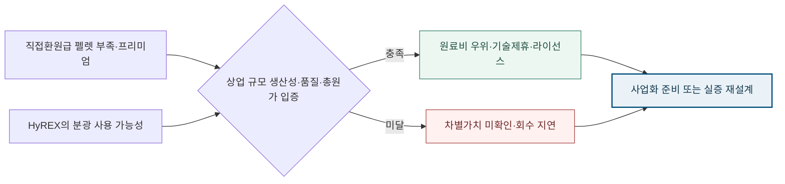

<!-- AUTO-GENERATED BY market-sensing-intelligence. DO NOT EDIT. -->

# 수소환원제철의 병목은 수소가 아니라 철광석일 수 있다

!!! warning "관찰 · 활성 · 기회"

    **OECD는 직접환원급 고품위 철광석이 해상 거래량의 3~4%에 불과하다고 지적했습니다. 수소가격만 낮추면 수소환원제철 경쟁력이 결정된다는 통념과 달리, 분광 사용을 목표로 하는 HyREX가 상업 규모에서 성능과 총원가를 입증하면 원료 유연성이 독립적인 경쟁우위가 될 수 있습니다.**

    **판단 질문:** HyREX 실증의 핵심 판단지표에 광종별 총현금원가와 펠렛 회피가치를 포함할 것인가?

    **다음 사업 분기점:** 2027년 3월까지 HyREX 실증의 광종별 생산성·품질·총현금원가 비교

**변화와 분기점**

| 시점 | 구분 | 확인된 변화·판단 |
| --- | --- | --- |
| **2025년 5월 20일** | 공개 | OECD가 직접환원급 해상 철광석 비중 3~4%와 원료 병목을 제시 |
| **현재 개발방향** | 시장 사건 | POSCO가 HyREX의 분광 활용 경로를 공식 설명 |
| **2027년 3월 31일** | 판단 시한 | 광종별 총원가와 펠렛 회피가치를 실증 판단지표에 반영할 시한 |
**판단을 고정한 수치와 일정**

| 지표 | 현재 확인값 | 기준일 | 해석 | 근거 |
| --- | ---: | --- | --- | --- |
| 직접환원급 해상 철광석 비중 | **3~4%** | 2025-05-20 | 수소와 별개로 원료 품질이 전환의 병목임을 보여줍니다. | [[sources/SRC-20260819-CE5F863E|원문 1]] |

## 수소환원제철 경쟁의 숨은 제약, 직접환원급 펠렛 부족

수소환원제철 논의는 주로 청정수소 가격과 전력, 환원로 효율에 집중돼 왔습니다. 그러나 OECD는 다수 샤프트로가 요구하는 직접환원급 고품위 철광석이 해상 철광석 거래의 3~4%에 불과하다고 지적합니다. 여러 국가가 동시에 직접환원설비를 늘리면 수소가 충분해도 적합한 펠렛의 가격과 물량이 상업화를 제약할 수 있습니다.

고품위 원료 부족은 단순 구매문제가 아닙니다. 저품위 광석을 선광·펠렛화하는 투자, 에너지와 물류비, 불순물 처리와 슬래그량이 철강 원가와 탄소배출에 함께 영향을 줍니다. 경쟁공정의 사업성 평가에서 수소가격만 비교하면 실제 원료 프리미엄과 전처리 CAPEX를 빠뜨릴 위험이 있습니다.

**청정수소 가격이 기술 승자를 결정한다는 단일변수 접근의 한계.**

기존 비교는 동일한 고품위 펠렛을 사용할 수 있다는 전제에서 수소와 전력 소비량, 설비 생산성을 놓고 경쟁하는 경우가 많습니다. 원료가 희소해지면 이 전제가 깨집니다. 필요한 품질의 펠렛을 장기 확보하지 못한 프로젝트는 명목 설비효율이 높아도 가동률과 원가에서 불리해질 수 있습니다.

HyREX가 목표로 하는 분광 직접 활용은 이 병목을 피할 가능성을 제공합니다. 상업 규모에서 광종별 생산성, 품질과 에너지 사용을 입증한다면 원료 프리미엄과 펠렛화 투자를 줄이고 공급선 선택폭을 넓힐 수 있습니다. 기술의 가치는 환원로 성능 하나가 아니라 회피한 전처리비와 공급안정성까지 포함해 평가해야 합니다.

## 원료 유연성이 HyREX의 원가·공급안정·기술수출 가치를 동시 확대

원료 유연성이 검증되면 포스코는 경쟁 샤프트로 대비 펠렛 프리미엄과 전처리비를 줄일 수 있고, 특정 광산에 대한 의존도도 낮출 수 있습니다. 이는 수소가격이 높은 초기 상업화 단계에서도 총현금원가 격차를 일부 상쇄할 수 있습니다. 광종 선택폭은 장기 원료계약 협상력과 조달 리스크 관리에도 영향을 줍니다.

기술제휴 관점에서는 고품위 펠렛을 확보하기 어려운 국가와 철강사에 HyREX의 가치가 더 커질 수 있습니다. 반대로 분광 사용으로 전력, 슬래그, 내화물, 품질관리 비용이 크게 늘면 회피가치가 사라집니다. 따라서 ‘분광 사용 가능’이라는 기술 설명보다 동일 조강 기준의 원료·전처리·에너지·부산물 총원가가 핵심 사업지표입니다.

**펠렛 병목이 HyREX 원료 유연성을 기술수출 옵션으로 바꾸는 검증선**

_구조 선택 근거: 기회가 성립하려면 시장 병목과 HyREX의 상업 검증이 모두 필요하므로 두 입력이 하나의 검증 조건에 모이고 통과 여부에 따라 사업화와 재설계로 분기되게 했습니다._

**기회·위험·미실행 비용의 분기**

| 판단 축 | 성립 조건 | 사업 효과와 행동 |
| --- | --- | --- |
| **기회** | 직접환원급 펠렛 부족과 가격 프리미엄이 지속되는 가운데 HyREX의 분광 사용 성능·품질·총원가가 상업 규모에서 입증 | 원료 유연성이 저탄소 철강의 독립 경쟁우위가 되어 원료비 절감과 기술제휴·라이선스 선택권을 확대 광종별 실증 데이터를 공개 가능한 검증 패키지로 만들고 원료·기술을 묶은 제휴안을 설계 |
| **위험** | 고품위 펠렛 공급이 빠르게 늘거나 HyREX의 생산성·품질·총원가 검증이 지연 | 원료 유연성의 차별가치가 줄고 실증·설비투자 회수와 기술제휴 일정이 늦어짐 수소·효율 중심 비교안을 병행하고 상업 검증 단계별 투자 중단 기준을 적용 |
| **미실행 비용** | 판단을 미룰 때 | 원료 병목을 조달 위험으로만 관리하면 분광 활용을 원가우위와 기술수출 자산으로 전환할 수 있는 선점 기회를 놓칠 수 있습니다. |

**결정 전환 조건:** 광종별 장기 연속운전에서 생산성·품질·총원가가 기준을 충족하면 제휴·라이선스 준비를 시작하고, 미달하면 실증 범위를 재설계합니다.

**판단 범위:** HyREX 실증과 상업화 투자 판단 · 분석 신뢰도 중간

## HyREX 실증의 성공기준을 광종별 총현금원가로 확장

실증계획에 광종별 투입성상, 생산성, 환원율, 제품품질, 전력·수소 사용량, 슬래그와 내화물 비용을 동일 기준으로 기록해야 합니다. 경쟁 샤프트로는 직접환원급 펠렛 구매가격과 펠렛화 CAPEX, 물류비를 포함해 비교해야 합니다. 그래야 분광 사용이 기술적 가능성을 넘어 실제 펠렛 회피가치로 전환되는지 판단할 수 있습니다.

2027년 3월까지 방어·기준·상방 광종 시나리오의 총현금원가와 공급가능량을 만들고, 실증 공개지표를 후속 투자와 기술제휴의 단계조건에 연결하는 것이 권고됩니다. 원료 유연성이 큰 지역을 우선 파트너 후보로 삼되 상업 규모 데이터가 확인되기 전에는 경쟁우위를 확정적으로 가격에 반영하지 않아야 합니다.

**권고 시한:** 2027-03-31 · **담당:** 포스코 기술연구원·철강전략·원료구매

**지금 만들 산출물**

- 경쟁공정과 광종별 총원가를 동일 기준으로 비교합니다.
- 실증 공개지표를 기술제휴 단계조건에 연결합니다.

**펠렛 프리미엄과 광종별 실증 성능이 기회 현실성을 가르는 조건.**

외부에서는 직접환원급 펠렛 가격 프리미엄, 신규 광산·펠렛 프로젝트의 실제 가동, 경쟁 샤프트로 프로젝트의 원료계약을 추적해야 합니다. 공급이 빠르게 늘고 프리미엄이 정상화되면 HyREX의 회피가치는 낮아집니다. 반대로 프로젝트 지연과 프리미엄 상승이 이어지면 원료 유연성의 전략가치는 커집니다.

내부에서는 광종별 생산성·품질·총에너지·슬래그·내화물·가동률을 같은 캠페인에서 비교해야 합니다. 생산성·품질·원가가 함께 검증될 때만 이슈 단계를 높입니다. 추가 전력과 부산물 비용이 펠렛 절감보다 크거나 상업 규모 운전에서 광종 유연성이 제한되면 기회평가를 낮춰야 합니다.

| 확인 방향 | 구체적 변화 |
| --- | --- |
| 이슈 강도 상승 | 광종별 실증에서 생산성·품질·원가가 함께 검증됩니다. |
| 이슈 강도 상승 | 직접환원용 펠렛 프리미엄이 추가 상승합니다. |
| 이슈 강도 완화 | 상업 실증에서 원료 유연성의 비용효과가 사라집니다. |
| 이슈 강도 완화 | 펠렛 공급부족이 해소됩니다. |
| 기존 해석 재검토 | HyREX의 추가 전력·슬래그 비용이 원료 절감보다 큽니다. |
| 기존 해석 재검토 | 직접환원용 펠렛 공급과 프리미엄이 빠르게 정상화됩니다. |

## OECD의 원료 병목과 POSCO의 공정경로를 연결한 기회 근거

OECD Steel Outlook은 직접환원급 해상 철광석의 희소성과 전환 프로젝트의 원료 제약을 외부 근거로 제공합니다. POSCO의 공식 HyREX 설명은 분광 활용이라는 기술경로를 확인하는 실행 맥락입니다. 외부 병목과 내부 기술경로를 구분해 연결했으며, 아직 확인되지 않은 상업 원가와 생산성은 사실로 간주하지 않았습니다.

**연결된 마켓 시그널**

- [[signals/SIG-73C13A4E0FC9|수소환원제철의 고품위 펠렛 병목]] · 영향 5/5 · 긴급 3/5

??? note "상업 규모 데이터가 없는 상태에서 기술우위를 확정하지 않는 경계"

    HyREX는 아직 상업 규모에서 장기간 생산성과 총원가를 공개적으로 입증하지 않았습니다. 분광 사용 가능성이 곧 모든 저품위 광석의 경제적 사용을 뜻하지 않으며 불순물, 선광, 전력과 슬래그 비용이 광종마다 달라질 수 있습니다. 직접환원급 펠렛 신규 공급도 현재의 병목을 완화할 수 있습니다.

    공개자료만으로 포스코의 실증 수율, 설비비와 조달계약을 비교할 수 없습니다. 이 보고서는 원료 유연성을 별도의 사업가치로 측정하자는 제안이며 HyREX가 이미 경쟁기술보다 저렴하다는 결론이 아닙니다. 동일 조강 기준의 검증 데이터가 없으면 투자와 기술수출 평가에 옵션가치로만 반영해야 합니다.
??? info "문서 관리 정보"

    등록 2026-08-19 · 최근 확인 2026-08-19 · 다음 모니터링 2027-03-31

    **지속 관찰 원칙:** 반증 조건이 충족되거나 사람이 근거를 기록해 종료하기 전까지 유지하고 다음 검토일에 지표를 갱신합니다.

    | 날짜 | 조치 | 단계 변화 | 판단 근거 |
    | --- | --- | --- | --- |
    | 2026-08-19 | 최초 등록 | 관찰 | 외부 원료 병목은 명확하지만 HyREX의 상업 규모 성능·총원가는 아직 실증이 필요합니다. |

**확인한 원문과 보관본**

- **OECD Steel Outlook 2025: hydrogen DRI raw-material bottleneck** · OECD · 2025-05-20 · [원문 링크](https://www.oecd.org/content/dam/oecd/en/publications/reports/2025/05/oecd-steel-outlook-2025_bf2b6109/28b61a5e-en.pdf) · [[sources/SRC-20260819-CE5F863E|보관 원문]]
- **POSCO HyREX raw-material route** · POSCO · 게시일 미상 · [원문 링크](https://hyrex.posco.com/T54/T54A01/t54a01300e.do) · [[sources/SRC-20260819-E8EA9DEC|보관 원문]]
