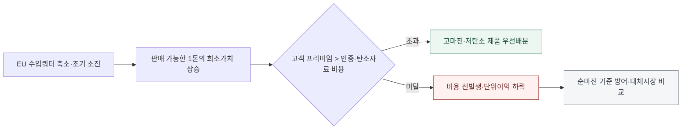

<!-- AUTO-GENERATED BY market-sensing-intelligence. DO NOT EDIT. -->

**POSCO**{ .signal-pill .signal-pill-company .signal-company-name aria-label="회사 POSCO" } **철강**{ .signal-pill .signal-pill-axis aria-label="사업축 철강" } **정책·규제**{ .signal-pill .signal-pill-type aria-label="변화 유형 정책·규제" }
{ .signal-detail-context .strategic-issue-context aria-label="회사, 사업축과 변화 유형" }

# 47% 줄어드는 유럽 무관세 철강 물량, 고객 배분의 기준은 순마진

**이 이슈의 위치** · **경영 Function:** 영업·고객 · 전략·투자 · 생산·운영 · **지역·시장:** EU 철강 수입시장 · 한국 수출 생산거점 · **시간:** EU 쿼터·저탄소 조달규칙 시행 전후

**왜 우리 회사 이슈인가 · 핵심 관심** · EU 수출 쿼터, 제품·고객별 순마진, 탄소강도·인증비용과 저탄소 제품 전환투자가 직접 노출됩니다. **바꿀 결정:** EU 쿼터 1톤당 순마진과 탄소조달자격을 기준으로 제품·고객 우선순위를 바꿀지 결정해야 합니다.

??? info "회사 연결 근거"

    **공식 사업 근거:** 포스코는 국내 생산기반과 글로벌 판매·가공망을 통해 EU 고객에 철강을 공급하므로 쿼터와 저탄소 조달자격이 수출 믹스에 직접 연결됩니다.

    **전달 경로:** 수입량 축소와 저탄소 기준이 결합되면 희소 쿼터의 고객·제품별 가치가 갈려 가격협상과 생산배분이 달라집니다.

    **회사 공식 원문:** [[sources/SRC-20260819-A3487743|회사 공식 근거 1]]

!!! warning "주목 · 활성 · 기회·위험 혼재"

    **판단 질문:** EU 쿼터 1톤당 순마진과 탄소조달자격을 기준으로 제품·고객 우선순위를 바꿀 것인가?

    **잠정 결론:** EU 쿼터는 물량 소진율이 아니라 고객별 순마진과 저탄소 계약 가능성으로 배분해야 합니다.

    **다음 사업 분기점:** 2026년 말 2027년 EU 제품·고객별 쿼터 배분과 저탄소 인증 계획 확정

**세 숫자로 읽는 시장 전환**

| **18.3 Mt/년** | **2026년 7월 1일** | **2026년 6월 30일** |
| ---: | ---: | ---: |
| EU 무관세 철강 수입한도 | 변화 시점 | 변화 시점 |
| 2024년 쿼터보다 47% 줄어 쿼터 1톤의 가치가 높아집니다. | 강화된 EU 철강 수입조치 적용 | 연 1,830만톤 무관세 한도와 쿼터 밖 50% 관세 조치 공개 |
| [[sources/SRC-20260818-5C2CEB19|근거 1]] | [[sources/SRC-20260818-5C2CEB19|근거 1]] | [[sources/SRC-20260818-5C2CEB19|근거 1]] |

**EU 무관세 수입공간이 약 3,450만 톤에서 1,830만 톤으로 줄었다**

**읽는 법:** 무관세 공간이 47% 줄어 같은 판매량보다 어떤 고객에게 쿼터를 배분하는지가 더 중요해졌습니다.
{ .strategic-quant-lead }

| 시점·항목 | 확인값 | 첫 값 대비 |
| --- | --- | --- |
| 2024 기준 | 34.5 Mt/year | 기준 |
| 2026 조치 | 18.3 Mt/year | -47% |

_단위 표 안에 표시 · 기준일 2026-06-30 · 공개자료 역산 · [[sources/SRC-20260818-5C2CEB19|근거 1]]_

_계산·범위: 새 한도 18.3Mt와 공식 축소율 47%로 이전 기준을 18.3÷0.53=34.5Mt로 역산했습니다._

## EU 시장 병목, 판매물량에서 쿼터의 경제적 가치로 이동

47% 축소를 역산하면 이전 기준 물량은 약 3,450만 톤입니다. 1,830만 톤으로 줄어든 뒤 초과분에 50% 관세가 붙으므로 쿼터 안 1톤과 밖 1톤의 경제성이 크게 갈립니다.

EU의 새 철강 조치는 무관세 수입한도를 연 1,830만톤으로 줄이고 쿼터를 넘는 물량에 50% 관세를 적용합니다. 이전보다 적은 물량만 경제적으로 판매할 수 있어 국가·품목별 배정량 자체가 희소자원이 됐습니다. 같은 1톤의 쿼터라도 제품가격과 물류비, 고객계약에 따라 만들어내는 순마진이 달라집니다.

동시에 EU는 산업가속법 제안에서 자동차와 건설 등 전략 수요의 저탄소 조달을 확대하려 합니다. 수입제한과 저탄소 수요창출이 같은 시장에서 움직이면 쿼터는 단순 출하 허가가 아니라 고마진·저탄소 제품을 어떤 고객에게 배분할지의 문제가 됩니다. 통상팀의 물량관리와 마케팅·저탄소전략의 고객선정이 하나의 의사결정으로 합쳐집니다.

**국가·품목별 쿼터 소진율만 관리하던 방식의 한계.**

기존 대응은 확보된 쿼터를 국가와 품목별로 나누고 소진 속도를 관리하는 데 초점을 둘 수 있습니다. 그러나 쿼터가 줄어들수록 먼저 채우는 것보다 어떤 거래에 쓰는지가 중요해집니다. 낮은 마진 고객에게 쿼터를 선점당하면 뒤에 들어오는 저탄소 프리미엄 고객을 놓칠 수 있고, 인증비용을 들인 제품도 적절한 고객과 연결되지 않으면 가치를 회수하지 못합니다.

따라서 ‘판매 가능한 톤’을 ‘쿼터 1톤당 위험조정 순마진’으로 바꿔 봐야 합니다. 제품의 탄소강도와 고객 조달자격, 가격 전가 가능성, 장기계약 가치와 쿼터 소진시점을 함께 평가해야 합니다. 저탄소강이 반드시 높은 이익을 내는 것도 아니므로 인증비용과 생산비 상승까지 차감한 순가치가 기준이 돼야 합니다.

**변화와 분기점**

| 시점 | 구분 | 확인된 변화·판단 |
| --- | --- | --- |
| **2026년 3월 4일** | 공개 | EU 산업가속법 제안으로 자동차·건설 저탄소 조달기준 방향 공개 |
| **2026년 6월 30일** | 공개 | 연 1,830만톤 무관세 한도와 쿼터 밖 50% 관세 조치 공개 |
| **2026년 7월 1일** | 시행 | 강화된 EU 철강 수입조치 적용 |
| **2026년 12월 31일** | 판단 시한 | 2027년 제품·고객별 쿼터 우선순위와 인증투자 확정 시한 |

## 제품 믹스·가격협상·저탄소 인증투자가 하나로 연결되는 손익 경로

상단 정량표는 무관세 공간이 47% 줄어 같은 판매량보다 어떤 고객에게 쿼터를 배분하는지가 더 중요해졌습니다. 단위와 기준일을 확인하고, 공식 확인값과 공개자료 역산값으로 읽어야 합니다.

첫 번째 영향은 수출 믹스입니다. 제한된 쿼터를 저마진 범용재에 배분하면 판매량은 유지돼도 총이익을 방어하기 어렵습니다. 두 번째는 가격협상입니다. 고객이 저탄소 조달자격을 필요로 하고 대체 공급자가 적다면 인증된 제품의 가격 전가력이 높아질 수 있지만, 프리미엄이 추가 생산비와 인증비용보다 낮으면 경제성이 없습니다.

세 번째는 투자 우선순위입니다. 저탄소 제품 인증과 생산전환 비용은 쿼터가 배분될 고객·제품의 확정 수요와 연결해야 합니다. 쿼터, 고객 요구, 탄소강도와 순마진을 따로 관리하면 과잉 인증이나 저가 판매가 생길 수 있습니다. 반대로 고가치 고객을 선별하면 수입한도 축소 속에서도 톤당 이익과 장기관계를 방어할 기회가 있습니다.

**희소 쿼터 1톤의 가치가 고객 프리미엄에서 결정되는 배분 구조**

_구조 선택 근거: 쿼터 축소만으로 결론이 정해지지 않고 고객의 저탄소 가격 가산분이 인증비를 넘는지가 배분 기준을 바꾸므로 수익성 문턱에서 공격과 방어 전략을 분기했습니다._

**기회·위험·미실행 비용의 분기**

| 판단 축 | 성립 조건 | 사업 효과와 행동 |
| --- | --- | --- |
| **기회** | 저탄소 조달기준이 실제 고객 구매와 가격 가산분으로 이어지고 검증 배출량이 경쟁재보다 우위 | **효과:** 희소한 수입쿼터를 고마진·저탄소 제품에 배분해 쿼터 1톤당 순이익과 장기계약 가치를 높임 **행동:** 고객별 순마진·탄소요건·구매의향을 결합한 쿼터 배분표로 물량을 선제 재배치 |
| **위험** | 쿼터는 조기 소진되지만 저탄소 기준 입법과 고객 가격 가산분이 지연 | **효과:** 수출 가능 물량과 단위이익이 함께 줄고 인증·탄소자료 비용만 먼저 발생 **행동:** 고객별 최소 수익성 기준을 적용하고 현지 생산·대체시장 전환 손익을 병행 비교 |
| **미실행 비용** | 판단을 미룰 때 | 쿼터 축소를 물량 방어로만 대응하면 저탄소 제품의 희소성과 고객별 가격 가산분을 이용해 수익구조를 바꿀 기회를 놓칠 수 있습니다. |

**결정 전환 조건:** 고객의 저탄소 구매의향과 가격 가산분이 인증비를 넘으면 우선배분을 시작하고, 입법 지연 시 순마진 중심 방어안으로 전환합니다.

**판단 범위:** 2027년 EU 판매계획과 저탄소 제품 인증 · 분석 신뢰도 중간

## 2027년 쿼터를 고객별 순마진과 조달자격으로 재배분

제품·고객별로 판매가격, 제조원가, 물류비, CBAM·관세, 할인과 인증비용을 차감한 쿼터 1톤당 순마진을 계산해야 합니다. 여기에 고객의 저탄소 조달요건, 제품 탄소강도, 인증상태, 계약기간과 전략적 중요도를 연결해 우선순위를 정합니다. 물량 극대화와 순이익 극대화의 결과 차이를 경영회의에 나란히 보여주는 것이 필요합니다.

2026년 말까지 2027년 배분안을 확정하고 쿼터 소진 중간점에서 재배분할 규칙을 마련하는 것이 권고됩니다. 글로벌마케팅·통상·저탄소전략이 같은 고객 단위 데이터를 사용해야 하며, 법안이 아직 확정되지 않은 저탄소 기준은 단일 예측값이 아니라 포함·완화·삭제 시나리오로 반영해야 합니다.

**결정을 미루지 않기 위해 먼저 완성할 세 가지 산출물**

| 순서·책임 | 이번에 만들 것 | 완료 후 판단 |
| --- | --- | --- |
| 1 · 포스코 글로벌마케팅·통상·저탄소전략 | 쿼터 1톤당 제품·고객별 순마진을 계산합니다. | 두 번째 검증으로 이동 |
| 2 · 포스코 글로벌마케팅·통상·저탄소전략 | 고객 조달요건과 제품 탄소강도를 계약계획에 연결합니다. | 대안의 경제성과 실행 가능성 비교 |
| 3 · 포스코 글로벌마케팅·통상·저탄소전략 | 2026년 말 2027년 EU 제품·고객별 쿼터 배분과 저탄소 인증 계획 확정 | 투자·계약·보류 중 하나를 선택 |

_문단에 흩어진 행동을 실행 순서와 완료 후 판단으로 재구성했습니다._

**권고 시한:** 2026-12-31

**최종 저탄소 기준과 고객 프리미엄이 배분전략을 확정할 관찰선.**

법률 측면에서는 산업가속법 최종문에 철강 저탄소 조달기준이 어떤 형태로 남는지, 역외 저탄소 제품이 참여할 수 있는지, 인증 상호인정이 가능한지를 확인해야 합니다. 시장 측면에서는 주요 자동차·건설 고객이 실제 입찰에서 탄소기준과 가격 가산분을 제시하는지가 중요합니다. 제안 문구보다 구매행동을 우선합니다.

내부적으로는 제품·고객별 순마진, 쿼터 소진률, 탄소강도, 인증비용과 프리미엄을 월별로 연결해야 합니다. 고객 프리미엄이 비용을 넘고 적격 수요가 확인되면 저탄소 제품 배분을 확대합니다. 최종 법률에서 기준이 삭제되거나 포스코 제품이 대상에서 제외되거나 프리미엄이 비용보다 낮으면 관련 투자와 우선순위를 낮춥니다.

**세 확인선이 현재 결론을 강화하거나 낮춘다**

| 관찰 지표·책임 | 강화 신호 | 완화 신호 |
| --- | --- | --- |
| 1 · 포스코 글로벌마케팅·통상·저탄소전략 | 최종 법률이 역외 저탄소강의 조달 참여를 유지합니다. | 저탄소 철강 기준이 최종문에서 삭제됩니다. |
| 2 · 포스코 글로벌마케팅·통상·저탄소전략 | 주요 고객이 저탄소 가격 가산분을 제시합니다. | 포스코 제품이 조달대상에서 제외됩니다. |
| 3 · 포스코 글로벌마케팅·통상·저탄소전략 | 2026년 말 2027년 EU 제품·고객별 쿼터 배분과 저탄소 인증 계획 확정 | 반증 조건이 확인되면 이슈 강도를 낮춥니다. |

_공식 발표와 내부 확인값이 바뀌면 같은 표에서 이슈 강도를 다시 판단합니다._

**결론을 바꾸는 조건**

| 이슈 강화 | 이슈 완화 |
| --- | --- |
| 최종 법률이 역외 저탄소강의 조달 참여를 유지합니다. | 저탄소 철강 기준이 최종문에서 삭제됩니다. |
| 주요 고객이 저탄소 가격 가산분을 제시합니다. | 포스코 제품이 조달대상에서 제외됩니다. |

## 시행 중인 수입한도와 제안 단계의 저탄소 수요를 구분한 근거

유럽연합 집행위원회의 철강 수입조치는 연 1,830만톤 무관세 한도와 쿼터 밖 50% 관세를 확인하는 직접 근거입니다. 산업가속법 제안은 자동차·건설의 저탄소 조달 방향을 보여주지만 아직 최종 법률은 아닙니다. 확정된 물량제약과 제안 단계 수요기준을 분리해 결론의 신뢰도를 중간으로 유지했습니다.

**연결된 마켓 시그널**

- [[signals/SIG-EFB4A11676A9|EU 철강 수입축소와 저탄소 조달기준 결합]] · 영향 5/5 · 긴급 4/5

??? note "확정된 수입규제와 미확정 조달법안을 섞지 않는 분석 경계"

    무관세 수입한도와 쿼터 밖 관세는 시행 근거가 있지만 산업가속법의 저탄소 조달기준은 제안 단계입니다. 최종 협상에서 산업별 기준, 역외 제품 참여, 시행시기와 인증방식이 달라질 수 있습니다. 철강에 EU 원산지 의무가 동일하게 적용된다고 가정하지 않았으며 저탄소 기준만 별도로 검토했습니다.

    공개정보로는 포스코의 고객별 가격, 쿼터 배정, 탄소강도와 인증비용을 알 수 없습니다. 이 보고서는 배분 기준을 순마진과 조달자격으로 바꿔야 한다는 방향을 제안하며 특정 고객을 제외하라는 결론은 아닙니다. 내부값을 넣은 결과 프리미엄이 비용보다 낮거나 계약상 재배분이 불가능하면 실행안은 달라져야 합니다.
??? info "문서 관리 정보"

    등록 2026-08-19 · 최근 확인 2026-08-19 · 다음 모니터링 2026-12-31

    **지속 관찰 원칙:** 반증 조건이 충족되거나 사람이 근거를 기록해 종료하기 전까지 유지하고 다음 검토일에 지표를 갱신합니다.

    | 날짜 | 조치 | 단계 변화 | 판단 근거 |
    | --- | --- | --- | --- |
    | 2026-08-21 | title_pattern_rewrite | - | 활성 이슈 목록의 반복적인 ~할 때·~먼저다 문형을 해소하고 이슈별 변화·간극·판단에 맞는 제목 구조로 재작성 |
    | 2026-08-20 | executive_title_rewrite | - | 법령 코드·영문 약어·단위·업계 은어를 제목에서 제거하고 임원이 사전 설명 없이 이해할 수 있는 시장 변화와 판단으로 재작성 |
    | 2026-08-20 | sparse_visual_rewrite | - | 2~3개 값과 시나리오를 강제 차트에서 가정·결과가 함께 보이는 정량표로 교체 |
    | 2026-08-20 | quantitative_rewrite | - | 공개 수치와 회사 민감도를 분리하고 첫 화면 정량 차트 중심으로 전면 편집 |
    | 2026-08-19 | 최초 등록 | 주목 | 수입한도는 시행 중이지만 저탄소 수요기준은 입법 제안 단계여서 고객행동과 최종문을 함께 확인해야 합니다. |

**확인한 원문과 보관본**

- **EU steel measure: 18.3 Mt tariff-free quota and 50% out-of-quota duty** · European Commission · 2026-06-30 · [원문 링크](https://policy.trade.ec.europa.eu/enforcement-and-protection/protecting-eu-steelmaking_en) · [[sources/SRC-20260818-5C2CEB19|보관 원문]]
- **Industrial Accelerator Act proposal COM(2026)100** · European Commission · 2026-03-04 · [원문 링크](https://single-market-economy.ec.europa.eu/publications/industrial-accelerator-act_en) · [[sources/SRC-20260819-E0FF0193|보관 원문]]
