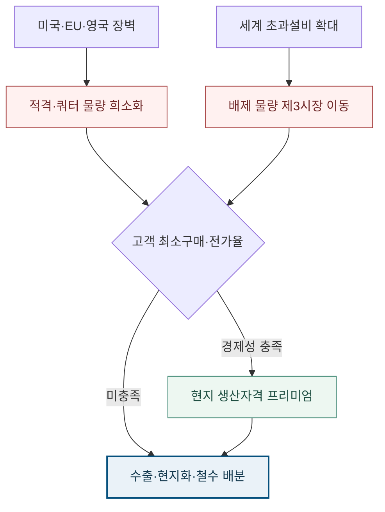

<!-- AUTO-GENERATED BY market-sensing-intelligence. DO NOT EDIT. -->

**POSCO**{ .signal-pill .signal-pill-company .signal-company-name aria-label="회사 POSCO" } **철강**{ .signal-pill .signal-pill-axis aria-label="사업축 철강" } **복합 이슈**{ .signal-pill .signal-pill-type aria-label="변화 유형 복합 이슈" }
{ .signal-detail-context .strategic-issue-context aria-label="회사, 사업축과 변화 유형" }

# 철강시장 진입조건이 관세율에서 생산지·원산지 자격으로 이동

**이 이슈의 위치** · **경영 Function:** 전략·투자 · 영업·고객 · 생산·운영 · **지역·시장:** 미국·EU·영국·인도 보호시장 · 동남아·중동 제3시장 · **시간:** 2026~2028년 시장접근·현지화 결정

**왜 우리 회사 이슈인가 · 핵심 관심** · 보호시장 수출물량, 관세 전가율, 고객별 최소구매, 현지 가공·생산자격과 제3시장 가격이 직접 노출됩니다. **바꿀 결정:** 수출을 유지할지, 최소구매가 붙은 고객군에 한해 현지 가공·생산자격을 확보할지 결정해야 합니다.

??? info "회사 연결 근거"

    **공식 사업 근거:** 포스코는 국내 수출기지와 해외 생산·가공 거점을 함께 운영해 지역별 생산자격과 고객 최소구매가 판매·투자 배분에 직접 연결됩니다.

    **전달 경로:** 지역별 접근조건 강화와 초과설비 확대가 적격물량 희소화와 배제물량 이동을 통해 보호시장 마진과 제3시장 가격을 동시에 바꿉니다.

    **회사 공식 원문:** [[sources/SRC-20260819-A3487743|회사 공식 근거 1]]

!!! warning "대응 검토 · 활성 · 기회·위험 혼재"

    **판단 질문:** 2027년 보호시장 물량을 계속 수출할 것인가, 고객 최소구매가 붙은 현지 가공·생산자격을 확보할 것인가?

    **잠정 결론:** 현지화 투자는 관세율 하나가 아니라 고객별 시장 진입 가능성·순노출·최소구매를 같은 3년 순현재가치로 비교한 뒤 결정해야 합니다.

    **다음 사업 분기점:** EU 대체조치의 최종 법문과 국가·품목별 쿼터 배분 확인

**세 숫자로 읽는 시장 전환**

| **18.3 Mt/년** | **50%** | **745 Mt** |
| ---: | ---: | ---: |
| EU 제안 무관세 물량 | EU·영국 초과관세 | 2028년 세계 초과설비 전망 |
| 보호시장 안에 남는 접근권의 크기 | 가격조정만으로 흡수하기 어려운 장벽 | 배제 물량이 제3시장으로 향할 압력 |
| [[sources/SRC-20260818-5C2CEB19|근거 1]] | [[sources/SRC-20260818-5C2CEB19|근거 1]] · [[sources/SRC-20260820-422EE636|근거 2]] | [[sources/SRC-20260818-2778E1E7|근거 1]] |

**같은 10만 톤도 전가율에 따라 순관세 노출이 100배 달라진다**

**읽는 법:** 물량보다 관세율·고객 전가율·시장접근자격이 현지화 경제성을 지배합니다.
{ .strategic-quant-lead }

| 시나리오 | 정량 결과 | 기준 대비 |
| --- | --- | --- |
| 방어 | 0.9 USD million/year | 기준 대비 0.0배 |
| 기준 | 20 USD million/year | 기준 |
| 압박 | 87.5 USD million/year | 기준 대비 4.4배 |

_단위 표 안에 표시 · 기준일 2026-08-20 · 회사 실제값이 아닌 민감도 · [[sources/SRC-20260818-5C2CEB19|근거 1]] · [[sources/SRC-20260820-422EE636|근거 2]]_

_계산·범위: 순관세 노출=물량×가격×관세율×(1-고객 전가율). 방어 0.9, 기준 20, 압박 87.5는 공개 규정과 조절 가능한 가정이며 POSCO 전망이 아닙니다._

## 관세를 내면 팔 수 있던 시장이 자격이 있어야 파는 시장으로 바뀐다

같은 50% 장벽이라도 미국은 생산자격, EU와 영국은 쿼터가 병목입니다. 보호시장에 못 들어간 물량은 2028년 7.45억 톤 과잉설비와 합쳐져 제3시장 가격까지 누르므로 직접 관세와 간접 가격압력을 함께 봐야 합니다.

미국은 철강 Section 232 관세를 50%로 높인 뒤 일부 자본재에 최소 85% 미국 내 용해·주조 기준을 제시했습니다. EU는 세이프가드 대체안에서 무관세 물량을 18.3백만 톤으로 줄이고 초과관세 50%에 원산지 추적과 저탄소 조달조건을 결합했습니다. 영국도 2026년 7월부터 무관세 쿼터를 51% 줄이고 초과분에 50%를 적용했습니다. 제도의 문구는 다르지만 사업적으로는 한 방향입니다. 고객이 원하는 가격과 품질을 맞춰도 생산지·용도·쿼터 순번이 맞지 않으면 보호시장에 들어가기 어려워집니다.

**수출 총량보다 주문별 접근권을 먼저 계산해야 한다.**

국가·품목별 쿼터를 먼저 나누고 초과관세를 가격에 반영하는 방식만으로는 부족합니다. 같은 강종도 어느 나라에서 용해·주조하고 어떤 고객 용도로 납품하는지에 따라 접근가치가 달라지기 때문입니다. 더 중요한 간극은 직접 장벽과 간접 가격압력의 시점이 다르다는 점입니다. 관세와 쿼터는 계약 수익성을 즉시 바꾸지만, 보호시장 밖으로 밀린 물량은 시차를 두고 동남아·중동 가격을 누릅니다. 두 충격을 한 숫자로 합산하지 말고 주문별 직접 노출과 제품별 제3시장 노출을 나눠 생산을 배분해야 합니다.

**같은 50% 장벽도 시장별로 요구하는 자격이 다르다**

| 시장 | 확인된 접근조건 | 시장접근의 병목 | 포스코가 확인할 값 |
| --- | --- | --- | --- |
| 미국 | 철강 관세 50%, 일부 자본재 85% 미국 내 용해·주조 | 용해·주조 원산지와 적용품목 | 주문별 생산경로·인증 가능성 |
| EU | 18.3 Mt 무관세 제안, 초과관세 50% | 국가·품목 쿼터와 원산지·저탄소 조건 | 쿼터 배분·탄소자격·고객 전가율 |
| 영국 | 무관세 쿼터 51% 축소, 초과관세 50% | 쿼터 소진 순서와 과도기 예외 | 계약시점·품목별 잔여 쿼터 |
| 인도 | 세이프가드 이후 열연 반덤핑 조사 | 품목·수출자별 추가 장벽 가능성 | 예비판정·제품 스프레드·대체시장 |

_기준일 2026-08-20. EU 조치는 제안 단계이며 미국·영국·인도는 품목별 적용범위를 별도 확인해야 합니다._

**변화와 분기점**

| 시점 | 구분 | 확인된 변화·판단 |
| --- | --- | --- |
| **2025년 6월 4일** | 시행 | 미국 철강 Section 232 관세 25%에서 50%로 인상 |
| **2026년 6월 8일** | 시행 | 미국 일부 자본재 철강에 85% 미국 내 용해·주조 기준 적용 |
| **2026년 7월 1일** | 시행 | 영국 무관세 쿼터 51% 축소와 초과관세 50% 적용 |
| **2026년** | 공개 | EU 18.3백만 톤 무관세 물량과 50% 초과관세 대체조치 제안 |

## 현지화의 기준선은 관세율이 아니라 3년 순노출이다

상단 정량표는 물량보다 관세율·고객 전가율·시장접근자격이 현지화 경제성을 지배합니다. 단위와 기준일을 확인하고, 회사 실제 실적 전망이 아닌 민감도 결과로 읽어야 합니다.

OECD는 세계 초과설비가 2025년 약 6억4천만 톤에서 2028년 7억4천5백만 톤으로 늘고 수요 증가율은 연 0.9%에 그칠 것으로 봅니다. 관세 대상 10만 톤, 가격 800달러/톤, 관세 50%를 예로 들면 총관세는 4천만 달러입니다. 그러나 고객이 절반을 부담한다면 회사 측 연간 순노출은 2천만 달러입니다. 고객 전가율 30~70% 범위에서는 1천2백만~2천8백만 달러로 달라집니다. 투자 판단에는 이 순노출을 3년 계약물량으로 환산하고 현지 가공·생산의 연간 자본비와 운영비를 빼야 합니다. 관세가 높다는 이유만으로 공장을 짓는 것이 아니라, 최소구매가 보장된 고객군에서만 접근권 프리미엄을 사는 결정입니다.

**지역 장벽과 과잉설비가 생산배분을 바꾸는 경로**

_구조 선택 근거: 직접 시장접근 충격과 제3시장 가격충격이 같은 생산배분 결정으로 합쳐지는 과정을 좁은 화면에서도 읽을 수 있도록 상하 흐름으로 배치했습니다._

**기회·위험·미실행 비용의 분기**

| 판단 축 | 성립 조건 | 사업 효과와 행동 |
| --- | --- | --- |
| **기회** | 3년 고객 최소구매와 접근권 프리미엄이 현지화 증분비용을 넘을 때 | **효과:** 희소한 보호시장 접근권과 장기마진 확보 **행동:** 현지 가공·JV·생산 옵션 우선협상 |
| **위험** | 고객 전가율이 낮고 배제 물량이 제3시장 가격을 누를 때 | **효과:** 보호시장과 잔여시장 마진의 동시 압박 **행동:** 저마진 수출 축소와 제품·고객별 생산 재배분 |
| **미실행 비용** | 판단을 미룰 때 | 접근권 원장과 옵션 검토를 늦추면 장기계약·쿼터·현지 파트너 협상순서를 잃고 저마진 잔여시장에 물량이 남을 수 있습니다. |

**결정 전환 조건:** 고객별 3년 순관세 노출이 현지화 증분비용보다 크고 최소구매가 계약되면 현지화로 전환합니다.

**판단 범위:** 2026년 시행 조치부터 2027년 고객계약·생산배분까지 · 분석 신뢰도 중간

## 지금 살 것은 공장이 아니라 되돌릴 수 있는 선택권이다

지금 필요한 결정은 해외 공장 건설 여부가 아닙니다. 2027년 계약이 고정되기 전에 어떤 주문이 접근권을 잃고, 어떤 고객이 관세와 현지화 비용을 함께 부담할지를 가르는 일입니다.

현지화는 고객별 3년 순관세 노출이 증분비용을 넘고 최소구매가 계약된 경우에만 투자안으로 올립니다. 그 전에는 현지 가공사 예약, JV 우선협상권, 고객 최소구매 의향서처럼 철회 가능한 선택권을 확보해 EU 최종 법문이 어느 방향으로 바뀌더라도 대응 순서를 지킵니다. 각 옵션은 같은 고객·물량·가격을 기준으로 비교해 관세회피와 시장확대 효과를 섞지 않습니다.

**공장 투자 전에 세 개의 의사결정 산출물을 완성한다**

| 단계·책임 | 산출물·완료 기준 | 다음 결정 |
| --- | --- | --- |
| 1 · 통상·마케팅 | 접근권 원장: 생산경로·품목코드·쿼터·관세 귀속 매핑 | 수출 유지 가능한 주문 분류 |
| 2 · 생산전략·해외투자 | 3년 NPV: 동일 물량·가격으로 수출·가공·생산·철수 비교 | 현지화 후보 고객군 압축 |
| 3 · 마케팅·해외투자 | 선택권: 최소구매 의향서·가공사 예약·JV 우선협상권 | 투자심의 상정 또는 수출 유지 |

_EU 최종 법문이 바뀌어도 회수하기 어려운 고정비를 먼저 집행하지 않고, 규칙이 강화될 때 필요한 협상순서를 확보하는 흐름입니다._

**관세율보다 결정이 바뀌는 신호를 먼저 본다.**

모니터링의 목적은 뉴스를 더 모으는 것이 아니라 수출 유지와 현지화 중 어느 쪽의 경제성이 바뀌었는지를 조기에 확인하는 데 있습니다.

외부 규칙은 공식 법문과 시행자료가 나올 때 갱신하고, 고객별 순노출과 제품 스프레드는 월별로 계산합니다. 규정이 강화돼도 고객 최소구매가 없으면 투자하지 않으며, 규정이 완화돼도 제3시장 가격압력이 커지면 저마진 물량 재배분은 계속합니다.

**네 지표가 수출 유지와 현지화를 가르는 기준**

| 관찰 지표·책임 | 판단 의미 | 전환 신호 |
| --- | --- | --- |
| EU 최종 법문·쿼터 · 통상 | 접근권 희소성이 확정되는가 | 18.3 Mt·50%·원산지 조건 유지 |
| 고객별 3년 순노출 · 마케팅·해외투자 | 현지화 경제성이 있는가 | 증분비용 초과와 최소구매 계약 |
| 미국 인증·영국 쿼터 · 통상·생산전략 | 직접 시장접근이 막히는가 | 인증 거절 또는 쿼터 조기 소진 |
| 동남아·중동 제품 스프레드 · 마케팅 | 배제 물량이 가격을 누르는가 | 두 분기 연속 스프레드 하락 |

_외부 규칙은 공식 발표 때, 고객 경제성과 제품 스프레드는 월별로 갱신합니다._

**결론을 바꾸는 조건**

| 이슈 강화 | 이슈 완화 |
| --- | --- |
| EU 최종 법문에서 18.3백만 톤과 50% 관세, 원산지·저탄소 조건이 유지됩니다. | 최종 규칙에서 생산자격 조건이 약화되고 고객이 관세를 대부분 부담합니다. |
| 주요 고객의 3년 순관세 노출이 현지화 증분비용을 초과합니다. | 제3시장 제품 스프레드가 방어되고 현지화 NPV가 수출 유지보다 낮습니다. |

## 시행 중인 장벽과 아직 바뀔 수 있는 규칙을 구분했다

미국과 영국 원문은 이미 시행 중인 접근비용과 자격을 보여주지만, EU 자료의 18.3백만 톤·50% 초과관세·저탄소 조건은 최종 법문이 남은 제안입니다. 인도 자료는 장벽이 다른 수입시장으로 확산될 가능성을, OECD 전망은 배제 물량이 흘러갈 시장의 초과공급을 설명합니다. 이 역할을 섞지 않았습니다. 시나리오 계산에서도 50% 관세만 검증값으로 쓰고 노출톤·가격·전가율은 조절 가능한 가정으로 분리했습니다. 직접 관세와 제3시장 가격하락은 같은 톤에서 중복 합산하지 않습니다. 반대 조건도 명확합니다. 고객이 관세를 대부분 부담하거나 최소구매가 없고, EU 최종 법문에서 원산지·저탄소 자격이 약해진다면 현지화보다 수출 유지가 유리할 수 있습니다. 결론을 확정하는 변수는 관세율 자체가 아니라 고객별 3년 순노출과 현지화 증분비용의 차이입니다.

**연결된 마켓 시그널**

- [[signals/SIG-A07F1B887CA2|2028년 세계 철강 과잉설비 7억4,500만 톤 전망]] · 영향 5/5 · 긴급 4/5
- [[signals/SIG-50D67D94CE68|미국 철강 추가관세율 50%로 인상]] · 영향 5/5 · 긴급 5/5
- [[signals/SIG-C8AF9A1B623E|인도 평강 세이프가드 관세 최대 12% 권고]] · 영향 4/5 · 긴급 4/5
- [[signals/SIG-EFB4A11676A9|EU 철강 수입축소와 저탄소 조달기준 결합]] · 영향 5/5 · 긴급 4/5
- [[signals/SIG-DE2981C00725|미국 자본재에 85% 자국 용해·주조 기준 적용]] · 영향 4/5 · 긴급 4/5
- [[signals/SIG-7A55EC61FBC5|영국 철강 무관세 쿼터 51% 축소]] · 영향 4/5 · 긴급 5/5

??? note "제안된 EU 규칙과 POSCO 실제 노출을 확정값으로 쓰지 않았다"

    EU 대체조치는 입법과 세부 배분이 남아 있고 저탄소 조달기준도 최종 법문에서 달라질 수 있습니다. 미국 85% 기준은 품목·거래별 적용범위를 확인해야 하며 영국의 과도기 예외도 계약시점에 따라 다릅니다. 공개자료로 POSCO의 시장·제품·고객별 노출톤, 실제 계약가격, 관세 귀속, 현지 투자비를 알 수 없습니다. 제시한 0.9~87.5백만 달러 순노출은 조절 가능한 민감도이며 실적 전망이 아니므로 내부 원장을 넣어 재계산해야 합니다. 중국 수출 증가가 특정 POSCO 제품의 가격하락으로 직결된다고 단정하지 않았으며, 제품별 품질·납기·고객인증 차이를 내부 데이터로 확인해야 합니다. 현지화 역시 관세회피만으로 승인하지 않고 고객 최소구매와 가동률을 함께 검증해야 합니다.
??? info "문서 관리 정보"

    등록 2026-08-20 · 최근 확인 2026-08-20 · 다음 모니터링 2026-09-15

    **지속 관찰 원칙:** EU·미국·영국 세부규칙과 고객별 순노출을 확인하고 반증 조건이 충족될 때까지 유지합니다.

    | 날짜 | 조치 | 단계 변화 | 판단 근거 |
    | --- | --- | --- | --- |
    | 2026-08-21 | title_pattern_rewrite | - | 활성 이슈 목록의 반복적인 ~할 때·~먼저다 문형을 해소하고 이슈별 변화·간극·판단에 맞는 제목 구조로 재작성 |
    | 2026-08-20 | executive_title_rewrite | - | 법령 코드·영문 약어·단위·업계 은어를 제목에서 제거하고 임원이 사전 설명 없이 이해할 수 있는 시장 변화와 판단으로 재작성 |
    | 2026-08-20 | sparse_visual_rewrite | - | 2~3개 값과 시나리오를 강제 차트에서 가정·결과가 함께 보이는 정량표로 교체 |
    | 2026-08-20 | quantitative_rewrite | - | 공개 수치와 회사 민감도를 분리하고 첫 화면 정량 차트 중심으로 전면 편집 |
    | 2026-08-20 | 정기 검토 | 대응 검토 → 대응 검토 | 여러 국가를 합친 광역 Signal을 미국 생산자격과 영국 쿼터의 원자 Signal로 분리하고 종합 판단은 핵심 전략 이슈에 남겼습니다. |
    | 2026-08-20 | 최초 등록 | 대응 검토 | 과잉설비와 미국·EU·영국·인도 장벽이 하나의 생산·판매·현지화 배분 결정으로 수렴했습니다. |

**확인한 원문과 보관본**

- **OECD Steel Outlook 2026** · OECD · 2026-06-04 · [원문 링크](https://www.oecd.org/en/publications/oecd-steel-outlook-2026_99ab9b0c-en.html) · [[sources/SRC-20260818-2778E1E7|보관 원문]]
- **EU steel measure: 18.3 Mt tariff-free quota and 50% out-of-quota duty** · European Commission · 2026-06-30 · [원문 링크](https://policy.trade.ec.europa.eu/enforcement-and-protection/protecting-eu-steelmaking_en) · [[sources/SRC-20260818-5C2CEB19|보관 원문]]
- **Industrial Accelerator Act proposal COM(2026)100** · European Commission · 2026-03-04 · [원문 링크](https://single-market-economy.ec.europa.eu/publications/industrial-accelerator-act_en) · [[sources/SRC-20260819-E0FF0193|보관 원문]]
- **U.S. Section 232 steel tariff increased from 25% to 50%** · The White House · 2025-06-03 · [원문 링크](https://www.whitehouse.gov/presidential-actions/2025/06/adjusting-imports-of-aluminum-and-steel-into-the-united-states/) · [[sources/SRC-20260819-E42DE3D9|보관 원문]]
- **India DGTR recommends safeguard duty on non-alloy and alloy steel flat products** · Directorate General of Trade Remedies, Government of India · 2025-08-16 · [원문 링크](https://dgtr.gov.in/sites/default/files/2025-08/NCV%20FINAL%20SGD%20Steel%2016.08.2025.pdf) · [[sources/SRC-20260819-1066116D|보관 원문]]
- **UK's steel trade measure from 1 July 2026** · UK Department for Business and Trade · 2026-07-22 · [원문 링크](https://www.gov.uk/government/publications/uks-steel-trade-measure-from-1-july-2026/uks-steel-trade-measure-from-1-july-2026) · [[sources/SRC-20260820-422EE636|보관 원문]]
- **Further Adjusting the Tariff Regimes for Imports of Aluminum, Steel, and Copper** · The White House · 2026-06-01 · [원문 링크](https://www.whitehouse.gov/presidential-actions/2026/06/further-adjusting-the-tariff-regimes-for-imports-of-aluminum-steel-and-copper-into-the-united-states/) · [[sources/SRC-20260820-214114A4|보관 원문]]
