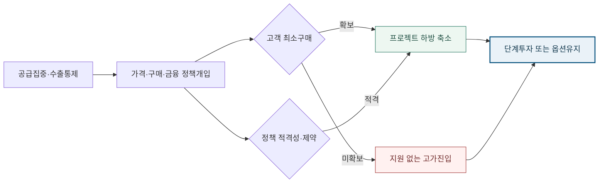

<!-- AUTO-GENERATED BY market-sensing-intelligence. DO NOT EDIT. -->

**POSCO Holdings**{ .signal-pill .signal-pill-company .signal-company-name aria-label="회사 POSCO Holdings" } **전략광물**{ .signal-pill .signal-pill-axis aria-label="사업축 전략광물" } **복합 이슈**{ .signal-pill .signal-pill-type aria-label="변화 유형 복합 이슈" }
{ .signal-detail-context .strategic-issue-context aria-label="회사, 사업축과 변화 유형" }

# 전략광물 지원이 가격·구매·세제까지 묶는다, 투자의 출발점은 계약

**이 이슈의 위치** · **경영 Function:** 전략·투자 · 구매·공급망 · 기술·연구개발 · **지역·시장:** 미국·호주 핵심광물 시장 · 한국 수요산업 · **시간:** 2026~2030년 신규 진입 후보 선별

**왜 우리 회사 이슈인가 · 조건부 관심** · 후보 광물의 구매권·소수지분·단계투자, 고객 최소구매, 정책금융과 가격하한 조건이 조건부로 노출됩니다. **바꿀 결정:** 광산을 먼저 매입하지 않고 고객·정부가 하방을 분담하는 구매권과 단계투자를 먼저 계약할지 결정해야 합니다.

??? info "회사 연결 근거"

    **공식 사업 근거:** 포스코홀딩스는 핵심광물 현지 연구와 후보 발굴을 공식화했지만 개별 광물을 확정 사업으로 공시하기 전에는 신규 진입 후보로 관리해야 합니다.

    **전달 경로:** 정부의 가격·구매·금융 개입이 프로젝트 하방을 줄일 수 있지만 판매처·원산지 제한과 잔여 투자위험은 회사에 남습니다.

    **회사 공식 원문:** [[sources/SRC-20260820-C228E651|회사 공식 근거 1]]

!!! warning "대응 검토 · 활성 · 기회·위험 혼재"

    **판단 질문:** 신규 전략광물 자산을 먼저 매입할 것인가, 고객·정부가 하방을 분담하는 구매권과 단계투자를 먼저 계약할 것인가?

    **잠정 결론:** 신규 광종은 자산 매입보다 고객 수요와 정부 하방분담을 동시에 잠그는 조건부 계약부터 설계해야 합니다.

    **다음 사업 분기점:** 2027년 7월 1일 호주 Critical Minerals Production Tax Incentive 적용 시작

**세 숫자로 읽는 시장 전환**

| **110 USD/kg** | **10 percent** | **2026-04-13 date** |
| ---: | ---: | ---: |
| 미국 NdPr 계약 가격하한 | 호주 적격 가공·정제비 세액상계율 | EU 원자재 메커니즘 개시일 |
| 가격하방을 정부 계약으로 분담한 실증 사례입니다. | 정책이 광산보다 중간가공 비용으로 이동하는 정도를 보여줍니다. | 공동구매와 매칭이 실제 계약으로 이어지는지 확인할 시작점입니다. |
| [[sources/SRC-20260819-0692EE56|근거 1]] | [[sources/SRC-20260820-F778010D|근거 1]] | [[sources/SRC-20260820-E5D2140D|근거 1]] |

**미국 희토류 패키지는 자본과 대출만 5.5억 달러다**

**읽는 법:** 가격하한·구매계약 가치를 빼고도 확정 금융이 5.5억 달러여서 단일 보조금보다 계약 패키지의 하방분담이 큽니다.
{ .strategic-quant-lead }

| 시점·항목 | 확인값 | 첫 값 대비 |
| --- | --- | --- |
| 우선주 투자 | 400 USD million | 기준 |
| 분리설비 대출 | 150 USD million | -62% |

_단위 표 안에 표시 · 기준일 2025-08-10 · 공식 확인값 · [[sources/SRC-20260819-0692EE56|근거 1]] · [[sources/SRC-20260819-F04174E5|근거 2]]_

_계산·범위: MP Materials 공시와 미국 국방부 발표의 자본·대출만 비교했습니다. 서로 다른 통화·세제인 호주 10% 상계는 같은 축에 합치지 않았습니다._

## 보조금 한 번에서 가격·물량·자본비의 장기 분담으로

확정된 미국 사례만 봐도 4억 달러 자본, 1억5천만 달러 대출, kg당 110달러 가격하한과 10년 구매계약이 함께 움직입니다. 호주의 10% 세액상계와 EU 공동매칭은 다른 방식이므로 지원 건수를 세기보다 어떤 하방을 누가 부담하는지 비교해야 합니다.

미국의 MP Materials 계약은 지분 4억 달러와 대출 1억5천만 달러에 10년 NdPr 가격하한 110달러/kg과 10년 구매계약을 묶었습니다. G7은 이어 가격하한·장기구매·차액계약·공급기반 가격책정을 공식 수단으로 열거했습니다. EU는 수요자와 공급자 매칭, 공동구매, 비축을 위한 메커니즘을 열었고 호주는 2027년 7월부터 적격 가공·정제비 10% 세액상계를 시작합니다. 국가별 제도는 다르지만 프로젝트 가격·물량·자본비 하방을 정부와 고객이 나누는 쪽으로 수렴합니다.

**유망 광종을 찾은 뒤 판로를 붙인다는 순서가 뒤집힌다.**

기존 진입 순서는 공급집중도가 높은 광종을 고르고 자원량·품위·공정을 검토한 뒤 고객과 정책지원을 붙이는 방식일 수 있습니다. 그러나 장기구매와 가격하한이 우량 프로젝트에 먼저 계약되면 후발 투자자는 자산뿐 아니라 판매처·정책금융·가격보호의 선택권을 잃습니다. 반대로 발표된 지원만 믿고 자산을 비싸게 사면 적격비용 밖의 CAPEX, 낮은 가동률, 지원 종료 뒤 가격하락을 포스코가 부담합니다. 따라서 광종보다 계약 가능한 하방분담 구조를 먼저 심사해야 합니다.

**변화와 분기점**

| 시점 | 구분 | 확인된 변화·판단 |
| --- | --- | --- |
| **2025년 7월 10일** | 공개 | 미 국방부가 MP Materials에 지분·대출·10년 가격하한·구매계약을 결합 |
| **2025년 10월 31일** | 공개 | G7이 가격하한·장기구매·차액계약 등 시장기반 수단 로드맵 발표 |
| **2026년 4월 13일** | 시행 | EU Raw Materials Mechanism 등록 개시 |
| **2027년 7월 1일** | 사업 분기점 | 호주 적격 가공·정제비 10% 세액상계 적용 시작 |

## 포스코 신규 진입의 단위는 광산이 아니라 계약 패키지다

상단 정량표는 가격하한·구매계약 가치를 빼고도 확정 금융이 5.5억 달러여서 단일 보조금보다 계약 패키지의 하방분담이 큽니다. 단위와 기준일을 확인하고, 공식 확인값과 공개자료 역산값으로 읽어야 합니다.

포스코홀딩스의 퍼스 핵심광물 연구소는 선광·제련·정제 공정과 경제성을 검토할 수 있지만 판매량과 가격하방을 없애지는 못합니다. 후보별 고객 최소구매, 가격공식과 하한, 적격 가공비, 정책금융 금리, 원산지·판매처·지배구조 제한을 기술검토와 동시에 비교해야 합니다. 최소구매와 지원이 함께 계약되면 단계투자 NPV의 하방이 줄고, 둘 중 하나가 없으면 구매권이나 소수지분만 유지하는 편이 낫습니다. 지원액보다 포스코가 끝까지 부담할 순하방을 계산하는 것이 핵심입니다.

**정책 시장설계가 전략광물 진입순서를 바꾸는 경로**

_구조 선택 근거: 가격·물량·자본비 하방이 함께 분담될 때만 확정투자로 넘어가는 조건을 보여줍니다._

**기회·위험·미실행 비용의 분기**

| 판단 축 | 성립 조건 | 사업 효과와 행동 |
| --- | --- | --- |
| **기회** | 최소구매·가격하방·정책금융 중 두 가지 이상이 계약화될 때 | **효과:** 판매·가격·자본비 하방을 분담한 신규 진입 선택권 확보 **행동:** 구매권·소수지분·단계투자를 우선협상 |
| **위험** | 지원은 발표에 머물고 제약조건이 지원가치보다 클 때 | **효과:** 고가 자산·저가동률·선택권 축소를 포스코가 부담 **행동:** 확정매입을 보류하고 구매옵션만 유지 |
| **미실행 비용** | 판단을 미룰 때 | 계약수단이 구체화되는 동안 옵션을 잡지 않으면 우량 프로젝트의 고객 구매권과 정책금융 배정순서를 경쟁사에 내줄 수 있습니다. |

**결정 전환 조건:** 최소구매 커버리지와 지원조건 반영 하방 NPV가 내부 기준을 모두 넘으면 단계투자로 전환합니다.

**판단 범위:** 2026년 첫 G7·EU 계약부터 2027년 호주 세액상계 시행까지 · 분석 신뢰도 중간

## 90일 안에 후보광종별 하방분담표와 옵션 조건을 만든다

전략광물 진입의 순서는 광종 선택보다 수요·정책·철회조건의 결합이 먼저입니다. 후보광종별 장기 수요와 최소구매 의향을 확인하고, G7·EU·호주 지원이 발표인지 실제 조건서·계약 단계인지 구분해 적격비용·판매처·지배구조 제한을 비교해야 합니다. 구매권·소수지분·단계투자의 철회비용까지 넣은 하방 NPV와 최소구매 커버리지가 내부 기준을 넘을 때만 확정투자로 전환합니다. 첫 계약을 뒤따라가는 방식보다 공통 계약 템플릿을 먼저 준비해 고객과 정부를 동시에 협상하는 편이 선택권을 지키는 데 유리합니다.

**결정을 미루지 않기 위해 먼저 완성할 세 가지 산출물**

| 순서·책임 | 이번에 만들 것 | 완료 후 판단 |
| --- | --- | --- |
| 1 · 포스코홀딩스 전략광물 사업개발·기술·구매·정책금융 담당 | 후보광종별 고객 최소구매·가격하방·정책지원·제약조건 비교표를 만듭니다. | 두 번째 검증으로 이동 |
| 2 · 포스코홀딩스 전략광물 사업개발·기술·구매·정책금융 담당 | 지원 종료 후 손익분기 가격과 하방 NPV를 계산합니다. | 대안의 경제성과 실행 가능성 비교 |
| 3 · 포스코홀딩스 전략광물 사업개발·기술·구매·정책금융 담당 | 구매권·소수지분·단계투자의 철회조건을 표준화합니다. | 투자·계약·보류 중 하나를 선택 |

_문단에 흩어진 행동을 실행 순서와 완료 후 판단으로 재구성했습니다._

**발표 건수보다 첫 계약의 최소구매와 제약조건을 본다.**

외부에서는 G7 가격하한·차액계약의 첫 프로젝트, EU Raw Materials Mechanism의 첫 매칭·공동구매 물량, 호주 세액상계의 적격비용 세부규칙과 실제 청구를 봅니다. 고객이 최소구매량과 가격공식에 서명하는지, 정책금융이 판매처·원산지·지배구조 선택을 얼마나 제한하는지도 함께 확인합니다. 내부에서는 후보별 하방 NPV, 지원 종료 후 손익분기 가격, 철회비용, 최소구매 커버리지를 같은 원장으로 갱신합니다. 두 조건이 함께 개선될 때만 투자수준을 높입니다.

**세 확인선이 현재 결론을 강화하거나 낮춘다**

| 관찰 지표·책임 | 강화 신호 | 완화 신호 |
| --- | --- | --- |
| 1 · 포스코홀딩스 전략광물 사업개발·기술·구매·정책금융 담당 | G7 또는 EU에서 가격하한·차액계약·공동구매가 실제 프로젝트 계약으로 체결됩니다. | 발표된 수단이 2개 분기 동안 계약으로 이어지지 않습니다. |
| 2 · 포스코홀딩스 전략광물 사업개발·기술·구매·정책금융 담당 | 포스코 고객이 후보광종의 장기 최소구매와 가격공식에 합의합니다. | 지원 제약을 반영한 후보사업 NPV가 무지원 구매대안보다 낮습니다. |
| 3 · 포스코홀딩스 전략광물 사업개발·기술·구매·정책금융 담당 | 2027년 7월 1일 호주 Critical Minerals Production Tax Incentive 적용 시작 | 반증 조건이 확인되면 이슈 강도를 낮춥니다. |

_공식 발표와 내부 확인값이 바뀌면 같은 표에서 이슈 강도를 다시 판단합니다._

**결론을 바꾸는 조건**

| 이슈 강화 | 이슈 완화 |
| --- | --- |
| G7 또는 EU에서 가격하한·차액계약·공동구매가 실제 프로젝트 계약으로 체결됩니다. | 발표된 수단이 2개 분기 동안 계약으로 이어지지 않습니다. |
| 포스코 고객이 후보광종의 장기 최소구매와 가격공식에 합의합니다. | 지원 제약을 반영한 후보사업 NPV가 무지원 구매대안보다 낮습니다. |

## 7개 원문을 정책·계약·가공·회사노출·제약 역할로 분리했다

미 국방부 발표와 SEC 공시는 가격하한·구매계약·지분·대출이 실제 한 계약에 결합된 사례를 확인합니다. G7 로드맵은 여러 정부가 검토하는 정책수단의 범위를, EU 메커니즘과 호주 세액상계는 구매·비축 및 가공비 보전의 실행경로를 보여줍니다. EU 전략프로젝트 목록은 지원이 특정 소재와 프로젝트 선별을 전제로 한다는 제약 근거이고, 포스코 퍼스 연구소 발표는 회사가 공정·경제성 검토역량을 구축 중이라는 노출 근거입니다. 미국 사례를 포스코 수익으로 전용하지 않았습니다. 시간축도 구분했습니다. 2025년 미국 계약은 이미 체결된 사건, G7 로드맵은 정책 방향, 2026년 EU 메커니즘은 운영을 시작한 거래기반, 호주 세액상계는 2027년 적용 예정인 세제입니다. 네 사건을 모두 확정 현금지원처럼 더하지 않았습니다. 또한 가격하한만으로는 수율·가동률·판매량을 보장하지 않고, 장기구매만으로는 원가 초과를 막지 못한다는 반대 경로를 유지했습니다. 따라서 승격 근거는 지원금 규모가 아니라 서로 다른 정부와 계약당사자가 동일한 하방변수를 각기 다른 수단으로 분담하기 시작했다는 구조적 수렴입니다. 다음 검증에서는 발표 수보다 실제 조건서의 최소구매량·기간·가격공식·종료조항을 우선 확인합니다.

**연결된 마켓 시그널**

- [[signals/SIG-C68CC1899242|미국, 희토류 공급망에 10년 가격·구매 보장]] · 영향 5/5 · 긴급 4/5
- [[signals/SIG-58262BC4861B|전략광물 지원이 가격·구매·가공비 보전으로 확대]] · 영향 5/5 · 긴급 4/5

??? note "정책 방향과 포스코가 받을 계약조건은 같은 사실이 아니다"

    MP Materials의 110달러/kg 가격하한과 10년 구매계약은 특정 미국 기업·품목·시설에 적용된 계약입니다. G7 로드맵 일부는 아직 제도 설계 단계이며 EU 메커니즘도 첫 공동구매 성과가 확인되지 않았습니다. 호주 10% 상계는 적격 가공·정제비에 한정되고 광산 인수가격과 운영손실 전체를 보전하지 않습니다. 포스코의 신규 진입 광종, 고객 최소구매량, 프로젝트 원가가 공개되지 않아 영향액은 모델링하지 않았고 조건서 확보 뒤 NPV로 재평가해야 합니다. 지원기간 종료 뒤 손익도 별도로 확인해야 합니다.
??? info "문서 관리 정보"

    등록 2026-08-20 · 최근 확인 2026-08-20 · 다음 모니터링 2026-09-30

    **지속 관찰 원칙:** 첫 프로젝트 계약과 포스코 후보별 하방분담 구조를 확인하고 반증 조건이 충족될 때까지 유지합니다.

    | 날짜 | 조치 | 단계 변화 | 판단 근거 |
    | --- | --- | --- | --- |
    | 2026-08-21 | title_pattern_rewrite | - | 활성 이슈 목록의 반복적인 ~할 때·~먼저다 문형을 해소하고 이슈별 변화·간극·판단에 맞는 제목 구조로 재작성 |
    | 2026-08-20 | executive_title_rewrite | - | 법령 코드·영문 약어·단위·업계 은어를 제목에서 제거하고 임원이 사전 설명 없이 이해할 수 있는 시장 변화와 판단으로 재작성 |
    | 2026-08-20 | sparse_visual_rewrite | - | 2~3개 값과 시나리오를 강제 차트에서 가정·결과가 함께 보이는 정량표로 교체 |
    | 2026-08-20 | quantitative_rewrite | - | 공개 수치와 회사 민감도를 분리하고 첫 화면 정량 차트 중심으로 전면 편집 |
    | 2026-08-20 | 최초 등록 | 대응 검토 | 개별 희토류 계약 사례가 G7·EU·호주 정책수단으로 확장돼 광종 공통의 진입 의사결정으로 수렴했습니다. |

**확인한 원문과 보관본**

- **MP Materials 8-K: U.S. Department of Defense rare earth partnership** · MP Materials Corp. / U.S. Securities and Exchange Commission · 2025-07-10 · [원문 링크](https://www.sec.gov/Archives/edgar/data/1801368/000119312525157310/d43796d8k.htm) · [[sources/SRC-20260819-0692EE56|보관 원문]]
- **Office of Strategic Capital first loan for MP Materials heavy rare earth separation** · U.S. Department of Defense · 2025-08-10 · [원문 링크](https://www.war.gov/News/Releases/Release/Article/4270722/office-of-strategic-capital-announces-first-loan-through-dod-agreement-with-mp/) · [[sources/SRC-20260819-F04174E5|보관 원문]]
- **Selected strategic projects under the Critical Raw Materials Act** · European Commission · 2025-06-04 · [원문 링크](https://single-market-economy.ec.europa.eu/sectors/raw-materials/areas-specific-interest/critical-raw-materials/strategic-projects-under-crma/selected-projects_en) · [[sources/SRC-20260819-67D8D329|보관 원문]]
- **Roadmap to Promote Standards-based Markets for Critical Minerals** · G7 Canada · 2025-10-31 · [원문 링크](https://g7.canada.ca/en/news-and-media/news/roadmap-to-promote-standards-based-markets-for-critical-minerals/) · [[sources/SRC-20260820-FF867E92|보관 원문]]
- **Commission launches platform to aggregate demand of raw materials and boost diversification** · European Commission · 2026-04-13 · [원문 링크](https://single-market-economy.ec.europa.eu/news/commission-launches-platform-aggregate-demand-raw-materials-and-boost-diversification-2026-04-13_en) · [[sources/SRC-20260820-E5D2140D|보관 원문]]
- **Critical Minerals Production Tax Incentive** · Australian Department of Industry, Science and Resources · 2026-07-01 · [원문 링크](https://www.industry.gov.au/mining-oil-and-gas/minerals/critical-minerals/critical-minerals-production-tax-incentive) · [[sources/SRC-20260820-F778010D|보관 원문]]
- **POSCO Holdings strengthens future competitiveness through localized research strategy for critical minerals** · POSCO Holdings · 2025-06-09 · [원문 링크](https://newsroom.posco.com/en/posco-holdings-strengthens-future-competitiveness-through-localized-research-strategy-for-critical-minerals-in-steel-and-battery-sectors/) · [[sources/SRC-20260820-C228E651|보관 원문]]
