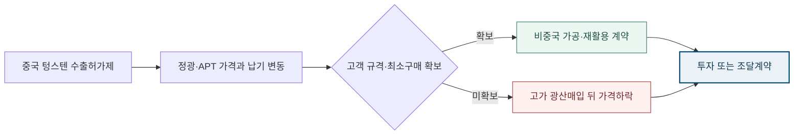

<!-- AUTO-GENERATED BY market-sensing-intelligence. DO NOT EDIT. -->

**POSCO Holdings**{ .signal-pill .signal-pill-company .signal-company-name aria-label="회사 POSCO Holdings" } **전략광물**{ .signal-pill .signal-pill-axis aria-label="사업축 전략광물" } **수급·가격**{ .signal-pill .signal-pill-type aria-label="변화 유형 수급·가격" }
{ .signal-detail-context .strategic-issue-context aria-label="회사, 사업축과 변화 유형" }

# 두 배 오른 텅스텐 가격보다 고객 규격이 투자 성패를 좌우한다

**이 이슈의 위치** · **경영 Function:** 전략·투자 · 구매·공급망 · 영업·고객 · **지역·시장:** 중국 텅스텐 공급망 · 한국·글로벌 수요시장 · **시간:** 2025~2027년 수출허가·가격 정상화 구간

**왜 우리 회사 이슈인가 · 조건부 관심** · 비중국 가공·재활용 후보, 잠재 고객 규격과 최소구매, 원료권·운전자본과 가격 정상화 위험이 조건부로 노출됩니다. **바꿀 결정:** 광산 인수보다 고객 규격이 확정된 가공·재활용 단계로 진입 범위를 제한할지 결정해야 합니다.

??? info "회사 연결 근거"

    **공식 사업 근거:** 포스코홀딩스는 핵심광물 후보를 연구·선별하고 있으나 텅스텐 광산을 확정 사업으로 공시하지 않아 고객 수요가 확인될 때만 관심이 성립합니다.

    **전달 경로:** 중국 수출허가제가 납기와 가격 변동을 키우면 국내 고객의 대체조달 수요가 늘지만 허가 정상화 시 자산가격과 가동률이 낮아질 수 있습니다.

    **회사 공식 원문:** [[sources/SRC-20260820-C228E651|회사 공식 근거 1]]

!!! warning "주목 · 활성 · 기회·위험 혼재"

    **판단 질문:** 텅스텐 진입을 광산 인수로 시작할 것인가, 고객 규격이 확정된 가공·재활용 단계로 제한할 것인가?

    **잠정 결론:** 고객 승인과 최소구매가 확인되기 전에는 가격 상승을 자산 수익으로 환산하지 말고 계약형 옵션으로 접근해야 합니다.

    **다음 사업 분기점:** 중국 허가 처리기간·수출량과 국내 고객의 장기구매 의향 동시 확인

**세 숫자로 읽는 시장 전환**

| **79 %** | **2026년 2월 6일** | **2025년 연간** |
| ---: | ---: | ---: |
| 중국의 세계 텅스텐 광산생산 비중 | 변화 시점 | 변화 시점 |
| 허가 지연이 정광·APT 가격과 비중국 가공설비 가동률에 크게 전달될 수 있습니다. | USGS가 생산집중과 가격변화를 공식 집계 | 로테르담 정광·APT 가격의 두 배 안팎 상승 |
| [[sources/SRC-20260819-1D416335|근거 1]] | [[sources/SRC-20260819-1D416335|근거 1]] | [[sources/SRC-20260819-1D416335|근거 1]] |

**정광과 APT 가격이 같은 해 모두 두 배가 됐다**

**읽는 법:** 정광은 207, APT는 204로 올라 수출통제 충격이 원료와 중간재에 함께 전달됐습니다.
{ .strategic-quant-lead }

| 시점·항목 | 65% 정광 | APT | 첫 시점 대비 |
| --- | --- | --- | --- |
| 2025 시작 | 100 2025 start=100 index | 100 2025 start=100 index | 기준 / 기준 |
| 2025 종료 | 207 2025 start=100 index | 204 2025 start=100 index | +107% / +104% |

_단위 표 안에 표시 · 기준일 2026-02-06 · 공개자료 역산 · [[sources/SRC-20260819-1D416335|근거 1]]_

_계산·범위: USGS가 인용한 2025년 시작·종료 가격을 각각 100으로 지수화했습니다. POSCO 조달가격이나 장기 전망이 아닙니다._

## 허가제가 가격보다 납기와 규격을 먼저 흔든다

같은 해 정광은 266에서 551로 107%, APT는 331에서 675로 104% 상승했습니다. 두 제품이 비슷한 폭으로 움직였다는 점은 단일 품목 이상이 아니라 공급망 전반의 충격이었음을 보여주지만 영구 가격수준을 보장하지는 않습니다.

중국은 2025년 2월 4일부터 일부 텅스텐 제품·합금과 관련 생산기술을 수출허가 대상으로 전환했습니다. USGS는 2025년 중국 광산생산을 6만7천 톤, 세계 생산을 8만5천 톤으로 추정해 약 79%의 집중도를 보여줍니다. 같은 해 로테르담 정광과 암모늄파라텅스테이트(APT) 가격은 두 배 안팎 뛰었습니다. 이 변화는 텅스텐이 단순 고가 광물이 아니라 허가·가공규격·납기가 고객 생산을 멈출 수 있는 투입재가 됐다는 뜻입니다. 가격만 보면 이미 오른 자산을 살 위험이 있고, 납기와 규격을 보면 고객계약이 붙은 가공단계의 가치가 보입니다.

**원광 자산이 곧 공급안보라는 통념의 빈틈.**

높은 중국 점유율만 보면 비중국 광산을 확보하는 것이 가장 직접적인 답처럼 보입니다. 그러나 원광을 확보해도 APT 전환, 분말·탄화물 제조, 고객 규격 승인과 장기구매가 연결되지 않으면 판매처와 가동률 위험은 남습니다. 반대로 초경 스크랩 재활용이나 특정 가공단계는 자원량이 작아 보여도 고객 규격과 회수체계를 장악하면 더 낮은 자본으로 공급안보 가치를 만들 수 있습니다. 진입 심사는 매장량과 현물가격 중심에서 품질승인 기간, 원료수율, 최소구매, 가격공식, 중국 공정 의존도를 함께 보는 단계별 계약 심사로 바뀌어야 합니다.

**변화와 분기점**

| 시점 | 구분 | 확인된 변화·판단 |
| --- | --- | --- |
| **2025년 2월 4일** | 시행 | 중국의 일부 텅스텐 품목·기술 수출허가 시행 |
| **2025년 연간** | 시장 사건 | 로테르담 정광·APT 가격의 두 배 안팎 상승 |
| **2026년 2월 6일** | 공개 | USGS가 생산집중과 가격변화를 공식 집계 |

## 가격상승의 수혜와 고가진입의 위험이 같은 손익에 공존

상단 정량표는 정광은 207, APT는 204로 올라 수출통제 충격이 원료와 중간재에 함께 전달됐습니다. 단위와 기준일을 확인하고, 공식 확인값과 공개자료 역산값으로 읽어야 합니다.

포스코홀딩스가 비중국 공급단계를 확보하면 국내 수요기업의 공급중단 위험을 낮추고 장기계약·가공마진·재활용 원료권을 얻을 수 있습니다. 그러나 현재 가격을 장기 기준으로 삼아 광산을 매입하면 중국 허가 정상화나 신규광산 증산 때 평가손실과 낮은 가동률이 겹칠 수 있습니다. 총노출액은 투자비와 운전자본이지만 순영향은 제품별 가격공식, 수율, 회수율, 고객 최소구매, 물류·인증비를 차감해 봐야 합니다. 포스코 그룹 철강사업의 텅스텐 사용량도 공개되지 않았으므로 그룹 내부수요를 확정 판로처럼 가정해서는 안 됩니다.

**허가 지연과 고객 규격이 텅스텐 진입단계를 가르는 경로**

_구조 선택 근거: 가격상승만으로 투자하지 않고 허가 지속성과 고객 최소구매가 합류할 때 가공·재활용 투자로 넘어가는 구조를 표현했습니다._

**기회·위험·미실행 비용의 분기**

| 판단 축 | 성립 조건 | 사업 효과와 행동 |
| --- | --- | --- |
| **기회** | 허가 지연이 지속되고 국내 고객 최소구매와 비중국 원료가 함께 확보될 때 | **효과:** 원료안보 수요와 가공마진을 결합한 계약형 신규사업 확보 **행동:** APT·분말·재활용 중 고객 승인 단계에 옵션형 투자 |
| **위험** | 수출량이 정상화되거나 가격급등이 자산가격에 과도하게 반영될 때 | **효과:** 고가 자산매입 뒤 가격하락과 가동률 부족이 겹침 **행동:** 확정매입을 보류하고 장기구매·재고·복수조달로 방어 |
| **미실행 비용** | 판단을 미룰 때 | 고객 규격과 원료권을 먼저 묶지 못하면 경쟁사가 장기계약을 선점해 국내 공급망 파트너가 될 선택권을 잃을 수 있습니다. |

**결정 전환 조건:** 허가 지연과 고객 최소구매가 함께 강화되면 투자로, 가격 정상화나 주문 부재가 확인되면 조달계약으로 전환합니다.

**판단 범위:** 중국 허가제 아래 텅스텐 후보사업의 단계·고객·가격공식 선정 · 분석 신뢰도 높음

## 광산·가공·재활용을 고객 승인속도로 다시 배열

먼저 그룹과 국내 초경·특수강·방산 수요기업의 품목별 규격, 연간 사용량, 안전재고, 대체 가능성, 가격공식을 확인해야 합니다. 다음으로 광산, APT, 분말, 탄화물, 스크랩 회수·재활용 후보를 동일 기준으로 비교하되 매장량보다 고객 승인까지 걸리는 시간과 비중국 원료권을 우선합니다. 가격은 2024년 복귀, 현재 유지, 허가 장기화의 세 시나리오로 두고 각 단계의 손익분기 가동률을 계산합니다. 고객 최소구매와 원료계약이 모두 확보되기 전에는 확정 인수보다 구매권·위탁가공·소수지분을 우선하는 것이 타당합니다.

**결정을 미루지 않기 위해 먼저 완성할 세 가지 산출물**

| 순서·책임 | 이번에 만들 것 | 완료 후 판단 |
| --- | --- | --- |
| 1 · 포스코홀딩스 전략광물 사업개발·그룹 구매·수요기업 기술영업 담당 | 국내 초경·특수강·방산 수요기업의 규격별 최소구매 의향을 확인합니다. | 두 번째 검증으로 이동 |
| 2 · 포스코홀딩스 전략광물 사업개발·그룹 구매·수요기업 기술영업 담당 | 광산·APT·분말·초경 스크랩 재활용 단계별 원료권과 수율을 비교합니다. | 대안의 경제성과 실행 가능성 비교 |
| 3 · 포스코홀딩스 전략광물 사업개발·그룹 구매·수요기업 기술영업 담당 | 2024년 가격 복귀와 허가지연 장기화의 현금흐름 스트레스를 함께 계산합니다. | 투자·계약·보류 중 하나를 선택 |

_문단에 흩어진 행동을 실행 순서와 완료 후 판단으로 재구성했습니다._

**수출량·허가일수·고객 최소구매가 결론을 바꾸는 세 숫자.**

외부에서는 중국 월별 수출량, 허가 처리기간, 로테르담 정광·APT 가격과 중국 밖 신규광산·가공설비의 실제 출하를 봐야 합니다. 내부에서는 고객별 규격 승인 여부, 최소구매량, 가격 전가 공식, 스크랩 회수량과 목표 수율을 확인합니다. 허가 지연과 수출감소가 두 분기 이상 이어지고 고객 최소구매가 손익분기 가동률을 넘으면 투자 검토를 높입니다. 반대로 수출량이 회복되고 가격이 2024년 범위로 돌아오거나 고객 주문이 부족하면 자산투자를 낮추고 장기조달·재고·재활용 계약으로 대응합니다.

**세 확인선이 현재 결론을 강화하거나 낮춘다**

| 관찰 지표·책임 | 강화 신호 | 완화 신호 |
| --- | --- | --- |
| 1 · 포스코홀딩스 전략광물 사업개발·그룹 구매·수요기업 기술영업 담당 | 중국 허가 처리기간이 늘고 수출량 감소가 두 분기 이상 이어집니다. | 수출량과 가격이 2024년 범위로 안정됩니다. |
| 2 · 포스코홀딩스 전략광물 사업개발·그룹 구매·수요기업 기술영업 담당 | 고객 최소구매와 비중국 원료계약을 동시에 확보합니다. | 고객 품질승인과 최소구매가 사업규모를 지지하지 못합니다. |
| 3 · 포스코홀딩스 전략광물 사업개발·그룹 구매·수요기업 기술영업 담당 | 중국 허가 처리기간·수출량과 국내 고객의 장기구매 의향 동시 확인 | 반증 조건이 확인되면 이슈 강도를 낮춥니다. |

_공식 발표와 내부 확인값이 바뀌면 같은 표에서 이슈 강도를 다시 판단합니다._

**결론을 바꾸는 조건**

| 이슈 강화 | 이슈 완화 |
| --- | --- |
| 중국 허가 처리기간이 늘고 수출량 감소가 두 분기 이상 이어집니다. | 수출량과 가격이 2024년 범위로 안정됩니다. |
| 고객 최소구매와 비중국 원료계약을 동시에 확보합니다. | 고객 품질승인과 최소구매가 사업규모를 지지하지 못합니다. |

## 중국 규제 원문과 USGS 생산·가격 통계의 결합

중국 상무부·해관총서 공고는 통제 품목과 시행일을 확인하는 직접 근거입니다. USGS 2026 광물요약은 중국과 세계 생산량, 정광·APT 가격변화를 같은 기준으로 제공합니다. 다만 허가 건별 처리기간과 국내 고객 계약은 공개자료에 없으므로 가격급등을 곧바로 포스코홀딩스 사업수익으로 환산하지 않았습니다.

**판단 메모:** 텅스텐은 가격지표가 이미 크게 움직였기 때문에 ‘오르기 전에 산다’는 논리가 늦었습니다. 지금의 의사결정은 어느 가치사슬 단계에서 중국 허가제의 병목을 실제 고객계약으로 전환할 수 있는지 찾는 것입니다. 광산은 원료권을 주지만 가공규격과 고객승인이 없으면 재고가 되고, APT·분말은 고객에 가깝지만 비중국 원료가 없으면 중국 의존을 되풀이합니다. 스크랩 재활용은 규모가 작아도 회수계약과 품질수율을 잠그면 자본을 단계화할 수 있습니다. 세 경로를 동일한 장기 하방가격, 고객 최소구매, 수율, 인증기간과 투자비로 비교하고, 그룹 내부 사용량은 실제 구매부서 확인 전까지 확정 판로로 계산하지 않아야 합니다. 이 비교가 없으면 가격급등을 사업성으로 오인할 가능성이 큽니다.

**의사결정 연결:** 높은 중국 생산집중과 허가제 이후 가격급등이 확인됐지만 실제 진입가치는 국내 고객 규격·최소구매와 비중국 원료를 결합할 수 있는 단계에서 결정됩니다. 이를 실행으로 옮길 첫 산출물은 ‘국내 초경·특수강·방산 수요기업의 규격별 최소구매 의향을 확인합니다.’이며, 반증 조건이 확인되면 보고서 강도를 낮추고 이력에 근거를 남깁니다.

**연결된 마켓 시그널**

- [[signals/SIG-ECBFAFB863BF|중국 텅스텐 통제 뒤 국제가격 급등]] · 영향 5/5 · 긴급 4/5

??? note "가격 두 배를 영구수익으로 보지 않는 보수적 경계"

    USGS 국제가격은 지표가격이며 포스코홀딩스나 국내 고객의 실제 계약가격·품질할인·운송비를 보여주지 않습니다. 중국 생산비중도 각 제품 단계의 공급집중도와 같지 않고, 신규광산의 허가·가동 일정은 지연될 수 있습니다. 전략광물의 정부 공식 범위도 아직 확인되지 않아 텅스텐을 확정 진입대상으로 표현하지 않습니다. 이 보고서는 고객 규격과 원료권이 결합된 단계만 우선 검증하자는 판단이며, 특정 광산·국가·투자금액을 추천하지 않습니다.
??? info "문서 관리 정보"

    등록 2026-08-20 · 최근 확인 2026-08-20 · 다음 모니터링 2026-09-30

    **지속 관찰 원칙:** 반증 조건이 충족되거나 사람이 근거를 기록해 종료하기 전까지 유지하고 다음 검토일에 지표를 갱신합니다.

    | 날짜 | 조치 | 단계 변화 | 판단 근거 |
    | --- | --- | --- | --- |
    | 2026-08-21 | title_pattern_rewrite | - | 활성 이슈 목록의 반복적인 ~할 때·~먼저다 문형을 해소하고 이슈별 변화·간극·판단에 맞는 제목 구조로 재작성 |
    | 2026-08-20 | executive_title_rewrite | - | 법령 코드·영문 약어·단위·업계 은어를 제목에서 제거하고 임원이 사전 설명 없이 이해할 수 있는 시장 변화와 판단으로 재작성 |
    | 2026-08-20 | sparse_visual_rewrite | - | 2~3개 값과 시나리오를 강제 차트에서 가정·결과가 함께 보이는 정량표로 교체 |
    | 2026-08-20 | quantitative_rewrite | - | 공개 수치와 회사 민감도를 분리하고 첫 화면 정량 차트 중심으로 전면 편집 |
    | 2026-08-20 | 최초 등록 | 주목 | 높은 중국 생산집중과 허가제 이후 가격급등이 확인됐지만 실제 진입가치는 국내 고객 규격·최소구매와 비중국 원료를 결합할 수 있는 단계에서 결정됩니다. |

**확인한 원문과 보관본**

- **중국 텅스텐 등 관련 품목 수출통제** · 중화인민공화국 상무부·해관총서 · 2025-02-04 · [원문 링크](https://www.mofcom.gov.cn/cms_files/filemanager/policySummary/viewcore_eecb876dd3e440deaab226390c863807.html) · [[sources/SRC-20260819-8AC9B06A|보관 원문]]
- **Mineral Commodity Summaries 2026: Tungsten** · U.S. Geological Survey · 2026-02-06 · [원문 링크](https://pubs.usgs.gov/periodicals/mcs2026/mcs2026-tungsten.pdf) · [[sources/SRC-20260819-1D416335|보관 원문]]
