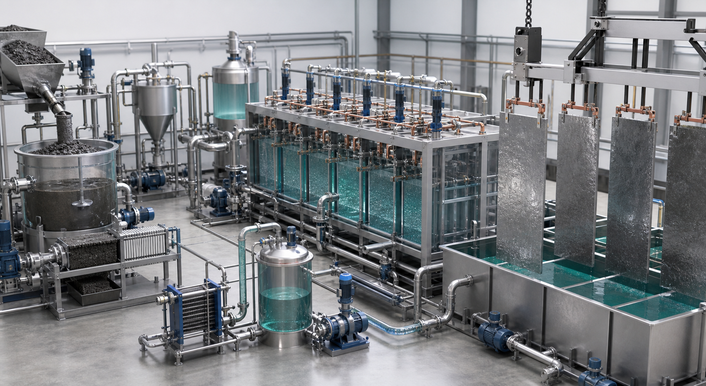

<!-- AUTO-GENERATED BY steel-intelligence. DO NOT EDIT. -->

# ArcelorMittal 기술 현황

> 조사 기준일: **2026-07-28** · 공식·1차 자료 중심 · 사실과 AI 분석을 구분해 작성

{ .steel-media-image .steel-hero-image .steel-media-compact }

*대표 이미지 — ArcelorMittal Ghent Steelanol 산업용 에탄올 생산설비 공식 사진 (실제 설비 사진 · 권리 `link_only` · 출처 [[sources/SRC-20260725-624E124C|SRC-20260725-624E124C]] · [원문 페이지](https://europe.arcelormittal.com/newsandmedia/pressreleases/6227/Steelanol-first-industrial-scale-production))*

!!! abstract "한눈에 보기"

    | 항목 | 확인 내용 |
    | --- | --- |
    | **확인된 기술** | 6개 / 감시 기술 13개 |
    | **연결 프로젝트** | 4개 |
    | **실행 단계** | 중단·연기 신호 1건 · 계획·투자 2건 · 연구·실증 2건 · 건설·구축 1건 |
    | **직접 연결 근거** | 22건 |

!!! warning "주의해서 볼 항목"

    - **수소 직접환원철 (Hydrogen DRI):** Bremen·Eisenhüttenstadt DRI-EAF 계획은 2025-06-19 기준 진행 불가; 유럽에서는 EAF 우선의 단계적 접근 [^src-20260725-395d8a82]
    - **저온 수계 전해제철 (Aqueous Iron Electrolysis):** Volteron 저온 직접 전해를 공식 설명 기준 TRL 6 R&D 설비까지 확대했으나 4만~8만 t/y 산업 1단계의 착공·가동은 미확인 [^src-20260725-fbe26310]

## 기술 포트폴리오

현재 저장소에서 직접 근거가 확인된 기술만 표시합니다.

| 기술 | 현재 확인 내용 | 단계 |
| --- | --- | --- |
| **[[technologies/TEC-hydrogen-direct-reduced-iron|수소 직접환원철 (Hydrogen DRI)]]** | Bremen·Eisenhüttenstadt DRI-EAF 계획은 2025-06-19 기준 진행 불가; 유럽에서는 EAF 우선의 단계적 접근 [^src-20260725-395d8a82] | **중단·연기 신호** |
| **[[technologies/TEC-molten-oxide-electrolysis|용융산화물 전기분해 (Molten Oxide Electrolysis)]]** | Boston Metal MOE에 $36m 전략 투자; 자체 상용 설비가 아닌 외부 기술 투자 단계 [^src-20260725-9d378e7f] | **계획·투자** |
| **[[technologies/TEC-blast-furnace-ccus|고로 CCUS]]** | Ghent에서 EUR 200 million Steelanol CCU 설비를 2022년 개소해 제철 부생가스를 연 80 million L 에탄올로 전환하는 경로를 실증; 영구저장 CCS와는 구분 [^src-20260725-b6fb82e5] | **연구·실증** |
| **[[technologies/TEC-low-carbon-ironmaking|저탄소 제철 종합 경로 (Low-carbon Ironmaking)]]** | Dunkirk 2 Mtpa EAF 건설 확정, €1.3bn 투자, 2029 가동 목표; scrap·HBI/DRI·hot metal 혼합 투입 [^src-20260725-61382798] | **계획·투자** |
| **[[technologies/TEC-smart-steelworks|스마트 제철소 (Smart Steelworks)]]** | 2025년 6개 공장 ADII 디지털 가속, 주요 공장 예지보전 플랫폼, EAF 산업시험 AI 적용, 19개 공장 23기 재가열로 최적화 모델 배치를 공시 [^src-20260728-bec180e2] | **연구·실증** |
| **[[technologies/TEC-low-temperature-aqueous-iron-electrolysis|저온 수계 전해제철 (Aqueous Iron Electrolysis)]]** | Volteron 저온 직접 전해를 공식 설명 기준 TRL 6 R&D 설비까지 확대했으나 4만~8만 t/y 산업 1단계의 착공·가동은 미확인 [^src-20260725-fbe26310] | **건설·구축** |

## 기술별 근거와 확인 과제

??? info "수소 직접환원철 (Hydrogen DRI) · 중단·연기 신호"

    **확인된 사실:** Bremen·Eisenhüttenstadt DRI-EAF 계획은 2025-06-19 기준 진행 불가; 유럽에서는 EAF 우선의 단계적 접근 [^src-20260725-395d8a82]

    **판단 기준:** 공식 발표에 실행 차질이 명시된 상태이므로 기존 목표 일정과 투자 지속 여부를 우선 재확인해야 합니다.

    **확인 날짜:** 발표 2025-06-19 · 검증 2026-07-25

    **다음 확인:** 실제 수소 사용 비율, 연간 DRI 생산량, 천연가스에서 수소로 전환하는 시점, 수소·가열 전력 원단위, 금속화율·제품 탄소와 상용 연속운전 실적을 확인해야 합니다.

??? info "용융산화물 전기분해 (Molten Oxide Electrolysis) · 계획·투자"

    **확인된 사실:** Boston Metal MOE에 $36m 전략 투자; 자체 상용 설비가 아닌 외부 기술 투자 단계 [^src-20260725-9d378e7f]

    **판단 기준:** 기업의 방향성과 자원 투입 의지는 확인되지만 실제 설비 성능이나 상용 운전이 입증된 단계는 아닙니다.

    **확인 날짜:** 발표 2023-01-27 · 검증 2026-07-25

    **다음 확인:** 투자·제휴 발표와 자체 설비 운영을 구분하고, 셀 규모, 연속 운전시간, 제품 품질과 상용 설비 착공 여부를 확인해야 합니다.

??? info "고로 CCUS · 연구·실증"

    **확인된 사실:** Ghent에서 EUR 200 million Steelanol CCU 설비를 2022년 개소해 제철 부생가스를 연 80 million L 에탄올로 전환하는 경로를 실증; 영구저장 CCS와는 구분 [^src-20260725-b6fb82e5]

    **판단 기준:** 기술 가능성을 검증하는 단계입니다. 시험 규모의 성공을 상용 생산성과로 해석하지 않고 규모 확대 계획을 따로 확인해야 합니다.

    **확인 날짜:** 발표 2022-12-08 · 검증 2026-07-25

    **다음 확인:** 고로 배출가스가 실제 포집 대상인지, CCU와 영구저장 CCS 중 어느 경로인지, 포집량과 최종 저장처가 확정됐는지, 재생열·압축·수송을 포함한 순회피량과 톤당 비용이 공개됐는지 확인해야 합니다.

??? info "저탄소 제철 종합 경로 (Low-carbon Ironmaking) · 계획·투자"

    **확인된 사실:** Dunkirk 2 Mtpa EAF 건설 확정, €1.3bn 투자, 2029 가동 목표; scrap·HBI/DRI·hot metal 혼합 투입 [^src-20260725-61382798]

    **판단 기준:** 기업의 방향성과 자원 투입 의지는 확인되지만 실제 설비 성능이나 상용 운전이 입증된 단계는 아닙니다.

    **확인 날짜:** 발표 2026-02-10 · 검증 2026-07-25

    **다음 확인:** 발표·MOU와 FID·착공·준공·램프업을 분리하고, 철광석 품위와 스크랩 추가성, 실제 수소 비율, 전력 탄소집약도, CO2 영구저장량, 제품별 Scope 1·2·상류 Scope 3 및 제3자 검증 출하량을 같은 기준으로 확인해야 합니다.

??? info "스마트 제철소 (Smart Steelworks) · 연구·실증"

    **확인된 사실:** 2025년 6개 공장 ADII 디지털 가속, 주요 공장 예지보전 플랫폼, EAF 산업시험 AI 적용, 19개 공장 23기 재가열로 최적화 모델 배치를 공시 [^src-20260728-bec180e2]

    **판단 기준:** 기술 가능성을 검증하는 단계입니다. 시험 규모의 성공을 상용 생산성과로 해석하지 않고 규모 확대 계획을 따로 확인해야 합니다.

    **확인 날짜:** 발표 2026-03-06 · 검증 2026-07-28

    **다음 확인:** 적용 공정·설비 수·운전기간, 모델 입력과 검증 기준, 조언·사람 승인·폐루프 중 실제 권한, 수동 전환·인터록·OT 보안, 기준선이 공개된 정량 성과와 다른 공장으로의 재현 여부를 확인해야 합니다.

??? info "저온 수계 전해제철 (Aqueous Iron Electrolysis) · 건설·구축"

    **확인된 사실:** Volteron 저온 직접 전해를 공식 설명 기준 TRL 6 R&D 설비까지 확대했으나 4만~8만 t/y 산업 1단계의 착공·가동은 미확인 [^src-20260725-fbe26310]

    **판단 기준:** 설비 투자가 물리적 실행 단계에 들어갔습니다. 준공 일정, 공사비 변동과 시운전 결과가 다음 판단 기준입니다.

    **확인 날짜:** 발표 미상 · 검증 2026-07-25

    **다음 확인:** 전력원단위·전류효율, 산·알칼리·공정수 회수율, 광종별 철 회수와 불순물 거동, 막·전극 수명, 스택 가동률, 전착 철판 자동 회수, 500 tpy 실제 월간 생산량과 EAF 장입 시험, 다음 규모 투자 결정을 확인해야 합니다.

## 사업화·프로젝트 지표

| 항목 | 현재 확인 내용 |
| --- | --- |
| **aws industrial ai status** | AWS와 생산현장 cloud·edge AI 협력을 추진하며 일부 OT/IT 수렴과 예지보전·비전검사·digital twin 배치를 계획; 전 거점 완료 상태가 아님 [^src-20260728-3f39f82d] |
| **steelanol commercial risk** | Steelanol은 첫 바지선 출하까지 도달했지만 2025-06 회사 측이 약 1년 내 폐쇄 판단 가능성을 언급했고, EU 집행위는 2025-09 관련 RCF 산정 변경이 기준 충족을 용이하게 할 것으로 예상했다. 2026-07 현재 폐쇄 확정 근거는 확인되지 않았다. [^src-20260728-fb3e03f1][^src-20260728-5607c101] |

## 주요 프로젝트

회사 직접 Claim뿐 아니라 같은 원문 근거 또는 참여기관 문구로 연결된 프로젝트를 함께 표시합니다.

| 프로젝트 | 현재 상태 | 핵심 일정·규모 |
| --- | --- | --- |
| **[[projects/PRJ-ARCELORMITTAL-DUNKIRK-EAF|ArcelorMittal Dunkirk 대형 전기로]]** | 2026-02-10 200만 t/y 전기로 건설을 확정한 투자 실행 단계; 실제 착공·설비 설치·가동은 후속 확인 필요 [^src-20260725-61382798] | **기술 경로** 스크랩·HBI/DRI·용선을 혼합 투입하는 대형 EAF 제강 경로 [^src-20260725-61382798] · **위치** Dunkirk, France [^src-20260725-61382798] · **연간 생산능력** 연간 2,000,000톤 조강 [^src-20260725-61382798] · **투자비** EUR 1.3 billion [^src-20260725-61382798] · **지원·조달 금액** 프랑스 에너지절감인증서 지원이 EUR 1.3 billion 투자비의 50%를 담당할 예정 [^src-20260725-61382798] · **목표 시운전 시점** 2029년 가동 목표 [^src-20260725-61382798] |
| **[[projects/PRJ-ARCELORMITTAL-GHENT-MHI-CO2-PILOT|ArcelorMittal Gent MHI CO2 포집·전환 파일럿]]** | 2024-05-21 공개 기준 ArcelorMittal Gent 고로 정상부 가스에 연결한 MHI Advanced KM CDR Process 파일럿 운전 개시 [^src-20260727-7863b18f][^src-20260728-9d74d878] | - |
| **[[projects/PRJ-ARCELORMITTAL-VOLTERON|ArcelorMittal–John Cockerill Volteron]]** | 2025년 1:1 수직 셀 파일럿의 성공 운전과 산업규모 플랜트 엔지니어링 설계 완료가 확인됐으나, 40,000~80,000 t/y 단계의 FID·착공·가동은 확인되지 않음 [^src-20260728-53edaf62] | **기술 경로** 철광석·물·수산화나트륨 전해질을 약 110°C에서 전해해 철판을 직접 생산한 뒤 EAF 제강으로 연결 [^src-20260725-fbe26310] · **연간 생산능력** 2023년 발표한 산업 1단계 목표 40,000~80,000 t/y [^src-20260725-a6716adb] · **목표 가동 시점** 2023년 발표 당시 2027년 생산 개시 목표; 현재 착공·가동 확인 필요 [^src-20260725-a6716adb] |
| **[[projects/PRJ-STEELANOL-GHENT|ArcelorMittal Ghent Steelanol]]** | 2022-12-08 CCU 플랜트 준공·개소가 확인됐으며, 고로계 탄소함유 부생가스를 바이오촉매로 에탄올화하는 산업 실증 설비 [^src-20260725-b6fb82e5] | **기술 경로** 제철 부생가스·폐바이오매스 가스 → 전처리 → LanzaTech 바이오촉매 발효 → advanced ethanol [^src-20260725-b6fb82e5] · **위치** ArcelorMittal Ghent, Belgium [^src-20260725-b6fb82e5] · **연간 제품 생산능력** 연 80 million litres advanced ethanol, full-capacity nameplate [^src-20260725-b6fb82e5] · **투자비** EUR 200 million [^src-20260725-b6fb82e5] · **상업 가동 시점** 2023-11-07 첫 산업 규모 에탄올 생산 [^src-20260725-624e124c] |

## 프로젝트별 상세

??? info "ArcelorMittal Dunkirk 대형 전기로"

    **프로젝트 문서:** [[projects/PRJ-ARCELORMITTAL-DUNKIRK-EAF|ArcelorMittal Dunkirk 대형 전기로]]

    | 항목 | 확인된 내용 |
    | --- | --- |
    | **기술 경로** | 스크랩·HBI/DRI·용선을 혼합 투입하는 대형 EAF 제강 경로 [^src-20260725-61382798] |
    | **위치** | Dunkirk, France [^src-20260725-61382798] |
    | **지원·조달 금액** | 프랑스 에너지절감인증서 지원이 EUR 1.3 billion 투자비의 50%를 담당할 예정 [^src-20260725-61382798] |
    | **제품 단위 배출** | 회사 추정 0.6 tCO2/t-steel로 고로 비교 대비 약 3분의 1 [^src-20260725-61382798] |
    | **목표 시운전 시점** | 2029년 가동 목표 [^src-20260725-61382798] |
    | **일정·의사결정 변경** | 2025년 유럽 탈탄소 프로젝트 연기 국면의 조건부 투자 의향에서 2026년 EUR 1.3 billion 건설 확정으로 전환 [^src-20260725-3b0845ff] |
    | **프로젝트 상태** | 2026-02-10 200만 t/y 전기로 건설을 확정한 투자 실행 단계; 실제 착공·설비 설치·가동은 후속 확인 필요 [^src-20260725-61382798] |
    | **연간 생산능력** | 연간 2,000,000톤 조강 [^src-20260725-61382798] |
    | **투자비** | EUR 1.3 billion [^src-20260725-61382798] |
    | **투자 의향 발표 시점** | 2025-05-15 약 EUR 1.2 billion 투자 의향 발표 [^src-20260725-3b0845ff] |

    **전체 공개 연혁**

    | 날짜 | 구분 | 확인된 사건 |
    | --- | --- | --- |
    | 2025 | 일정·의사결정 변화 | **일정·의사결정 변경**: 2025년 유럽 탈탄소 프로젝트 연기 국면의 조건부 투자 의향에서 2026년 EUR 1.3 billion 건설 확정으로 전환 [^src-20260725-3b0845ff] |
    | 2025-05-15 | 발표·검증 | **일정·의사결정 변경**: 2025년 유럽 탈탄소 프로젝트 연기 국면의 조건부 투자 의향에서 2026년 EUR 1.3 billion 건설 확정으로 전환 · **투자 의향 발표 시점**: 2025-05-15 약 EUR 1.2 billion 투자 의향 발표 [^src-20260725-3b0845ff] |
    | 2025-05-15 | 투자 의향 발표 | **투자 의향 발표 시점**: 2025-05-15 약 EUR 1.2 billion 투자 의향 발표 [^src-20260725-3b0845ff] |
    | 2026-02-10 | 발표·검증 | **기술 경로**: 스크랩·HBI/DRI·용선을 혼합 투입하는 대형 EAF 제강 경로 · **위치**: Dunkirk, France · **지원·조달 금액**: 프랑스 에너지절감인증서 지원이 EUR 1.3 billion 투자비의 50%를 담당할 예정 · **제품 단위 배출**: 회사 추정 0.6 tCO2/t-steel로 고로 비교 대비 약 3분의 1 · **목표 시운전 시점**: 2029년 가동 목표 · **프로젝트 상태**: 2026-02-10 200만 t/y 전기로 건설을 확정한 투자 실행 단계; 실제 착공·설비 설치·가동은 후속 확인 필요 · **연간 생산능력**: 연간 2,000,000톤 조강 · **투자비**: EUR 1.3 billion [^src-20260725-61382798] |
    | 2029 | 목표 일정 | **목표 시운전 시점**: 2029년 가동 목표 [^src-20260725-61382798] |

??? info "ArcelorMittal Gent MHI CO2 포집·전환 파일럿"

    **프로젝트 문서:** [[projects/PRJ-ARCELORMITTAL-GHENT-MHI-CO2-PILOT|ArcelorMittal Gent MHI CO2 포집·전환 파일럿]]

    | 항목 | 확인된 내용 |
    | --- | --- |
    | **프로젝트 상태** | 2024-05-21 공개 기준 ArcelorMittal Gent 고로 정상부 가스에 연결한 MHI Advanced KM CDR Process 파일럿 운전 개시 [^src-20260727-7863b18f][^src-20260728-9d74d878] |
    | **Dcrbn eic project status** | CORDIS는 D-CRBN EIC 프로젝트(101161563, 2024-07-01~2026-06-30)를 행정상 closed로 표시하며 총사업비 €3,607,500·EU 기여 €2,499,999를 기록한다. 이는 자금지원 기간 종료 상태이지 Gent 통합실증의 정량 성능 달성이나 상용화 완료 증거는 아니다. [^src-20260728-50a784e1] |
    | **CO2 전환장치 연결 시점** | 2024-07-01 [^src-20260727-275a6495] |
    | **원료가스 불순물 위험** | 고로 정상부 가스의 변동하는 오염물 수준이 1단계 분리·포집의 명시된 기술 과제 [^src-20260727-7863b18f] |
    | **전환공정 검증 범위** | 제철 배출 CO2의 잔류 불순물이 D-CRBN 공정과 제품가스에 미치는 영향 검증; CO 생산량·전환율·제품가스 순도·전력원단위는 발표에 미공개 [^src-20260727-275a6495] |
    | **시험기간 목표** | Gent에서 1–2년 운전해 full-scale 적용 가능성을 시험하는 목표 [^src-20260727-7863b18f][^src-20260728-9d74d878] |
    | **일일 CO2 시험 처리율** | 약 300 kg CO2/day, 1단계 공개 시험 처리율이며 장기간 평균 포집량이 아님 [^src-20260727-7863b18f][^src-20260728-9d74d878] |
    | **CO2 전환 경로** | 포집한 고순도 CO2를 재생전력 기반 플라즈마로 CO로 전환해 제철 환원탄소 일부 또는 화학·대체연료 원료로 사용하는 시험 [^src-20260727-275a6495] |
    | **Demonstration status** | MHI의 2025-12 FY2024 보고는 Gent에서 고로·열연 재가열로 배출가스 CO2 포집과 D-CRBN 플라즈마 CO 전환 실증시험을 수행했다고 과거형으로 확인한다. 다만 전환율·CO 생산량·순도·전력원단위·운전시간·스케일업 결정은 공개하지 않았다. [^src-20260728-c30eae04] |
    | **2단계 시험 목표** | 열연 재가열로에서 코크스오븐가스·고로가스·천연가스를 혼소한 배가스의 CO2 분리·포집 시험 [^src-20260727-7863b18f] |

    **전체 공개 연혁**

    | 날짜 | 구분 | 확인된 사건 |
    | --- | --- | --- |
    | 2024-05-21 | 발표·검증 | **프로젝트 상태**: 2024-05-21 공개 기준 ArcelorMittal Gent 고로 정상부 가스에 연결한 MHI Advanced KM CDR Process 파일럿 운전 개시 · **시험기간 목표**: Gent에서 1–2년 운전해 full-scale 적용 가능성을 시험하는 목표 · **일일 CO2 시험 처리율**: 약 300 kg CO2/day, 1단계 공개 시험 처리율이며 장기간 평균 포집량이 아님 [^src-20260728-9d74d878] |
    | 2024-05-21 | 발표·검증 | **프로젝트 상태**: 2024-05-21 공개 기준 ArcelorMittal Gent 고로 정상부 가스에 연결한 MHI Advanced KM CDR Process 파일럿 운전 개시 · **원료가스 불순물 위험**: 고로 정상부 가스의 변동하는 오염물 수준이 1단계 분리·포집의 명시된 기술 과제 · **시험기간 목표**: Gent에서 1–2년 운전해 full-scale 적용 가능성을 시험하는 목표 · **일일 CO2 시험 처리율**: 약 300 kg CO2/day, 1단계 공개 시험 처리율이며 장기간 평균 포집량이 아님 · **2단계 시험 목표**: 열연 재가열로에서 코크스오븐가스·고로가스·천연가스를 혼소한 배가스의 CO2 분리·포집 시험 [^src-20260727-7863b18f] |
    | 2024-07-01 | 설비 연결 | **CO2 전환장치 연결 시점**: 2024-07-01 [^src-20260727-275a6495] |
    | 2024-07-08 | 발표·검증 | **CO2 전환장치 연결 시점**: 2024-07-01 · **전환공정 검증 범위**: 제철 배출 CO2의 잔류 불순물이 D-CRBN 공정과 제품가스에 미치는 영향 검증; CO 생산량·전환율·제품가스 순도·전력원단위는 발표에 미공개 · **CO2 전환 경로**: 포집한 고순도 CO2를 재생전력 기반 플라즈마로 CO로 전환해 제철 환원탄소 일부 또는 화학·대체연료 원료로 사용하는 시험 [^src-20260727-275a6495] |
    | 2025-10-20 | 발표·검증 | **Dcrbn eic project status**: CORDIS는 D-CRBN EIC 프로젝트(101161563, 2024-07-01~2026-06-30)를 행정상 closed로 표시하며 총사업비 €3,607,500·EU 기여 €2,499,999를 기록한다. 이는 자금지원 기간 종료 상태이지 Gent 통합실증의 정량 성능 달성이나 상용화 완료 증거는 아니다. [^src-20260728-50a784e1] |
    | 2025-12-05 | 발표·검증 | **Demonstration status**: MHI의 2025-12 FY2024 보고는 Gent에서 고로·열연 재가열로 배출가스 CO2 포집과 D-CRBN 플라즈마 CO 전환 실증시험을 수행했다고 과거형으로 확인한다. 다만 전환율·CO 생산량·순도·전력원단위·운전시간·스케일업 결정은 공개하지 않았다. [^src-20260728-c30eae04] |

??? info "ArcelorMittal–John Cockerill Volteron"

    **프로젝트 문서:** [[projects/PRJ-ARCELORMITTAL-VOLTERON|ArcelorMittal–John Cockerill Volteron]]

    | 항목 | 확인된 내용 |
    | --- | --- |
    | **확대 검증 계획** | 1단계 검증 후 연간 300,000~1,000,000톤으로 확대 의향 [^src-20260725-a6716adb] |
    | **파일럿 셀 구성** | 1 m²급 셀에 양극 3개·음극 2개를 배치해 4장의 철판, 약 140 kg 금속 철을 한 열로 생산하는 파일럿 구성 [^src-20260727-71a7fa21] |
    | **기술 경로** | 철광석·물·수산화나트륨 전해질을 약 110°C에서 전해해 철판을 직접 생산한 뒤 EAF 제강으로 연결 [^src-20260725-fbe26310] |
    | **목표 가동 시점** | 2023년 발표 당시 2027년 생산 개시 목표; 현재 착공·가동 확인 필요 [^src-20260725-a6716adb] |
    | **제품 형태** | 약 1 m² 면적·5 mm 두께의 순철 판재를 R&D 설비에서 생산 [^src-20260725-fbe26310] |
    | **운전 온도** | 최대 약 110°C [^src-20260725-fbe26310] |
    | **기술성숙도** | ArcelorMittal 공식 설명 기준 TRL 1에서 TRL 6까지 진전 [^src-20260725-fbe26310] |
    | **전력원단위 추정** | INCITE 추정 3.5–4.3 MWh/t-iron plate, 목표 3.7 MWh/t; 완전 상업규모 실측 원단위가 아님 [^src-20260727-71a7fa21] |
    | **산업화 선결조건** | 최초 scale-up plant 배치는 파일럿 결과, 제도·사업 여건, 자금조달에 조건부이며 착공 확정이 아님 [^src-20260727-71a7fa21] |
    | **연간 생산능력** | 2023년 발표한 산업 1단계 목표 40,000~80,000 t/y [^src-20260725-a6716adb] |
    | **TRL 근거 해석 주의** | INCITE 구조화 필드는 Operational·Achieved TRL 7로 표시하지만 본문은 2025년 말 TRL 7 검증 예정이라고 서술하므로, TRL 7 표시는 산업규모 신뢰성 입증으로 확대 해석할 수 없음 [^src-20260727-71a7fa21] |
    | **참여 기관** | ArcelorMittal과 John Cockerill; 전신 SIDERWIN은 EU Horizon 2020 컨소시엄 [^src-20260725-a6716adb] |
    | **공개 성과의 한계** | 3.5–4.3 MWh/t 추정치는 공개됐지만 상업규모 실측 전력원단위·장기 연속운전·전극수명·가동률·제품 품질 합격률은 확인되지 않음 [^src-20260727-71a7fa21] |
    | **최신 파일럿 운전 상태** | EU JRC INCITE 기준 1 m² 파일럿을 2025년에 시운전했고 2025년 4월부터 운전 중; 산업규모 연속운전 입증과는 구분 [^src-20260727-71a7fa21] |
    | **설비 구성** | 저온 수계 전해 셀과 1 m² 철판 생산 규모 R&D 설비 [^src-20260725-fbe26310] |
    | **프로젝트 상태** | 2025년 1:1 수직 셀 파일럿의 성공 운전과 산업규모 플랜트 엔지니어링 설계 완료가 확인됐으나, 40,000~80,000 t/y 단계의 FID·착공·가동은 확인되지 않음 [^src-20260728-53edaf62] |
    | **Industrial engineering status** | John Cockerill이 full-scale industrial plant 엔지니어링 설계를 완료했고 ArcelorMittal은 이를 1:1 파일럿 성공 운전과 함께 기술경제적 타당성 입증으로 설명했다. 공개 보고에는 산업 플랜트의 FID·부지·EPC 착수 정보가 없다. [^src-20260728-53edaf62] |
    | **최신 규모 확대 계획** | 40 kt/y 모듈을 기반으로 최대 800 kt/y 설비까지 확대하는 엔지니어링·CAPEX 검토 계획 [^src-20260727-71a7fa21] |

    **전체 공개 연혁**

    | 날짜 | 구분 | 확인된 사건 |
    | --- | --- | --- |
    | 2023 | 목표 일정 | **목표 가동 시점**: 2023년 발표 당시 2027년 생산 개시 목표; 현재 착공·가동 확인 필요 [^src-20260725-a6716adb] |
    | 2023-06-14 | 발표·검증 | **확대 검증 계획**: 1단계 검증 후 연간 300,000~1,000,000톤으로 확대 의향 · **목표 가동 시점**: 2023년 발표 당시 2027년 생산 개시 목표; 현재 착공·가동 확인 필요 · **연간 생산능력**: 2023년 발표한 산업 1단계 목표 40,000~80,000 t/y · **참여 기관**: ArcelorMittal과 John Cockerill; 전신 SIDERWIN은 EU Horizon 2020 컨소시엄 [^src-20260725-a6716adb] |
    | 2026-03-06 | 발표·검증 | **프로젝트 상태**: 2025년 1:1 수직 셀 파일럿의 성공 운전과 산업규모 플랜트 엔지니어링 설계 완료가 확인됐으나, 40,000~80,000 t/y 단계의 FID·착공·가동은 확인되지 않음 · **Industrial engineering status**: John Cockerill이 full-scale industrial plant 엔지니어링 설계를 완료했고 ArcelorMittal은 이를 1:1 파일럿 성공 운전과 함께 기술경제적 타당성 입증으로 설명했다. 공개 보고에는 산업 플랜트의 FID·부지·EPC 착수 정보가 없다. [^src-20260728-53edaf62] |
    | 2026-07-25 | 수집 확인 | **기술 경로**: 철광석·물·수산화나트륨 전해질을 약 110°C에서 전해해 철판을 직접 생산한 뒤 EAF 제강으로 연결 · **제품 형태**: 약 1 m² 면적·5 mm 두께의 순철 판재를 R&D 설비에서 생산 · **운전 온도**: 최대 약 110°C · **기술성숙도**: ArcelorMittal 공식 설명 기준 TRL 1에서 TRL 6까지 진전 · **공개 성과의 한계**: 전류효율·전력원단위·연속운전시간·전극수명·산업 1단계 부지와 투자비는 공개 확인이 부족 · 후속 정보로 대체 · **설비 구성**: 저온 수계 전해 셀과 1 m² 철판 생산 규모 R&D 설비 · **프로젝트 상태**: 저온 철 전해 기술을 TRL 6 연구개발 설비까지 확대했으나 40,000~80,000 t/y 산업 1단계의 착공·가동은 확인되지 않음 · 후속 정보로 대체 [^src-20260725-fbe26310] |
    | 2026-07-27 | 수집 확인 | **파일럿 셀 구성**: 1 m²급 셀에 양극 3개·음극 2개를 배치해 4장의 철판, 약 140 kg 금속 철을 한 열로 생산하는 파일럿 구성 · **전력원단위 추정**: INCITE 추정 3.5–4.3 MWh/t-iron plate, 목표 3.7 MWh/t; 완전 상업규모 실측 원단위가 아님 · **산업화 선결조건**: 최초 scale-up plant 배치는 파일럿 결과, 제도·사업 여건, 자금조달에 조건부이며 착공 확정이 아님 · **TRL 근거 해석 주의**: INCITE 구조화 필드는 Operational·Achieved TRL 7로 표시하지만 본문은 2025년 말 TRL 7 검증 예정이라고 서술하므로, TRL 7 표시는 산업규모 신뢰성 입증으로 확대 해석할 수 없음 · **공개 성과의 한계**: 3.5–4.3 MWh/t 추정치는 공개됐지만 상업규모 실측 전력원단위·장기 연속운전·전극수명·가동률·제품 품질 합격률은 확인되지 않음 · **최신 파일럿 운전 상태**: EU JRC INCITE 기준 1 m² 파일럿을 2025년에 시운전했고 2025년 4월부터 운전 중; 산업규모 연속운전 입증과는 구분 · **프로젝트 상태**: 1 m² 파일럿은 2025년 4월부터 운전 중이라는 JRC 기록이 있으나, 40 kt/y 이상 scale-up plant의 착공·가동은 여전히 확인되지 않음 · 후속 정보로 대체 · **최신 규모 확대 계획**: 40 kt/y 모듈을 기반으로 최대 800 kt/y 설비까지 확대하는 엔지니어링·CAPEX 검토 계획 [^src-20260727-71a7fa21] |

    **변경·중단 이력**

    - **공개 성과의 한계 · 후속 정보로 대체:** 전류효율·전력원단위·연속운전시간·전극수명·산업 1단계 부지와 투자비는 공개 확인이 부족 [^src-20260725-fbe26310]
    - **프로젝트 상태 · 후속 정보로 대체:** 1 m² 파일럿은 2025년 4월부터 운전 중이라는 JRC 기록이 있으나, 40 kt/y 이상 scale-up plant의 착공·가동은 여전히 확인되지 않음 [^src-20260727-71a7fa21]
    - **프로젝트 상태 · 후속 정보로 대체:** 저온 철 전해 기술을 TRL 6 연구개발 설비까지 확대했으나 40,000~80,000 t/y 산업 1단계의 착공·가동은 확인되지 않음 [^src-20260725-fbe26310]

??? info "ArcelorMittal Ghent Steelanol"

    **프로젝트 문서:** [[projects/PRJ-STEELANOL-GHENT|ArcelorMittal Ghent Steelanol]]

    | 항목 | 확인된 내용 |
    | --- | --- |
    | **참여 기관** | ArcelorMittal, LanzaTech, Primetals Technologies, E4tech [^src-20260725-b6fb82e5] |
    | **기술 경로** | 제철 부생가스·폐바이오매스 가스 → 전처리 → LanzaTech 바이오촉매 발효 → advanced ethanol [^src-20260725-b6fb82e5] |
    | **제품 출하 이정표** | 에탄올 생산량이 바지선 운송을 지원할 수준에 도달해 LanzaTech가 첫 선적분 소유권을 인수; 정제 후 향료·생활용품 고객 판매 예정 [^src-20260727-96f6d922] |
    | **Operating economics risk** | 기술 문제를 해결해 목표 60,000 t/y에 도달하더라도 EU 연료·탄소회계 인정이 바뀌지 않으면 경제성이 어렵다는 회사 평가 [^src-20260728-87554b83] |
    | **제품 단위 배출** | ArcelorMittal 주장 기준 full-capacity에서 Ghent 연간 배출 125,000톤 감축; 독립 전과정 검증값은 별도 확인 필요 [^src-20260725-b6fb82e5] |
    | **프로젝트 상태** | 2022-12-08 CCU 플랜트 준공·개소가 확인됐으며, 고로계 탄소함유 부생가스를 바이오촉매로 에탄올화하는 산업 실증 설비 [^src-20260725-b6fb82e5] |
    | **Regulatory status** | EU 집행위는 2025-09 전력 배출계수·rigid input 대체 산정 변경이 Steelanol 같은 불가피한 산업 부생가스 기반 RCF 설비의 온실가스 절감 기준 충족을 용이하게 할 것으로 예상했으나, Steelanol 연료 인정 완료나 경제성 확보를 확인한 것은 아니다. [^src-20260728-fb3e03f1] |
    | **연간 제품 생산능력** | 연 80 million litres advanced ethanol, full-capacity nameplate [^src-20260725-b6fb82e5] |
    | **첫 바지선 출하 시점** | 2024-12 초, 정확한 일자는 미공개 [^src-20260727-96f6d922] |
    | **프로젝트 착수 시점** | 2015년부터 공정 개념·온실가스 효과 평가 협력 [^src-20260725-b6fb82e5] |
    | **가동·시운전 확인 시점** | 2022-12-08 [^src-20260725-b6fb82e5] |
    | **Conditional closure review** | 2025-06-18 회사는 약 1년 안에 폐쇄 여부를 결정하겠다고 밝혔으나, 이는 조건부 검토이며 폐쇄 확정이 아님 [^src-20260728-87554b83] |
    | **위치** | ArcelorMittal Ghent, Belgium [^src-20260725-b6fb82e5] |
    | **Commercial viability risk** | 2025-06 회사 측은 기술 문제와 EU 연료 인정·경제성 문제를 이유로 약 1년 안에 폐쇄 여부를 판단하겠다고 밝혔으나, 이는 폐쇄 확정이 아니며 2026-07 현재 공식 Gent 설비 목록에는 Steelanol과 에탄올 제품이 계속 표시된다. [^src-20260728-5607c101][^src-20260728-87554b83] |
    | **Current maintenance status** | 2026-05-08 생물반응기 2 수리 후 질소 압력 누설시험을 실시했으며 재가동 전 안전 절차였음; 실제 재가동·전 설비 가동·정격 생산 달성은 확인되지 않음 [^src-20260728-2c8bd70b] |
    | **투자비** | EUR 200 million [^src-20260725-b6fb82e5] |
    | **배출 경계** | CO2 영구저장이 아니라 탄소를 에탄올에 전환하는 CCU이므로 제품 사용·대체재·추가 에너지까지 포함한 전과정 회계가 필요 [^src-20260725-b6fb82e5] |
    | **상업 가동 시점** | 2023-11-07 첫 산업 규모 에탄올 생산 [^src-20260725-624e124c] |

    **전체 공개 연혁**

    | 날짜 | 구분 | 확인된 사건 |
    | --- | --- | --- |
    | 2015 | 착수 | **프로젝트 착수 시점**: 2015년부터 공정 개념·온실가스 효과 평가 협력 [^src-20260725-b6fb82e5] |
    | 2022-12-08 | 발표·검증 | **참여 기관**: ArcelorMittal, LanzaTech, Primetals Technologies, E4tech · **기술 경로**: 제철 부생가스·폐바이오매스 가스 → 전처리 → LanzaTech 바이오촉매 발효 → advanced ethanol · **제품 단위 배출**: ArcelorMittal 주장 기준 full-capacity에서 Ghent 연간 배출 125,000톤 감축; 독립 전과정 검증값은 별도 확인 필요 · **프로젝트 상태**: 2022-12-08 CCU 플랜트 준공·개소가 확인됐으며, 고로계 탄소함유 부생가스를 바이오촉매로 에탄올화하는 산업 실증 설비 · **연간 제품 생산능력**: 연 80 million litres advanced ethanol, full-capacity nameplate · **프로젝트 착수 시점**: 2015년부터 공정 개념·온실가스 효과 평가 협력 · **가동·시운전 확인 시점**: 2022-12-08 · **위치**: ArcelorMittal Ghent, Belgium · **투자비**: EUR 200 million · **배출 경계**: CO2 영구저장이 아니라 탄소를 에탄올에 전환하는 CCU이므로 제품 사용·대체재·추가 에너지까지 포함한 전과정 회계가 필요 [^src-20260725-b6fb82e5] |
    | 2023-11-07 | 실행 일정 | **상업 가동 시점**: 2023-11-07 첫 산업 규모 에탄올 생산 [^src-20260725-624e124c] |
    | 2023-11-16 | 발표·검증 | **상업 가동 시점**: 2023-11-07 첫 산업 규모 에탄올 생산 [^src-20260725-624e124c] |
    | 2024-12 | 출하 이력 | **첫 바지선 출하 시점**: 2024-12 초, 정확한 일자는 미공개 [^src-20260727-96f6d922] |
    | 2024-12-11 | 발표·검증 | **제품 출하 이정표**: 에탄올 생산량이 바지선 운송을 지원할 수준에 도달해 LanzaTech가 첫 선적분 소유권을 인수; 정제 후 향료·생활용품 고객 판매 예정 · **첫 바지선 출하 시점**: 2024-12 초, 정확한 일자는 미공개 [^src-20260727-96f6d922] |
    | 2025-06-18 | 발표·검증 | **Operating economics risk**: 기술 문제를 해결해 목표 60,000 t/y에 도달하더라도 EU 연료·탄소회계 인정이 바뀌지 않으면 경제성이 어렵다는 회사 평가 · **Conditional closure review**: 2025-06-18 회사는 약 1년 안에 폐쇄 여부를 결정하겠다고 밝혔으나, 이는 조건부 검토이며 폐쇄 확정이 아님 · **Commercial viability risk**: 2025-06 회사 측은 기술 문제와 EU 연료 인정·경제성 문제를 이유로 약 1년 안에 폐쇄 여부를 판단하겠다고 밝혔으나, 이는 폐쇄 확정이 아니며 2026-07 현재 공식 Gent 설비 목록에는 Steelanol과 에탄올 제품이 계속 표시된다. [^src-20260728-87554b83] |
    | 2025-06-19 | 발표·검증 | **Commercial viability risk**: 2025-06 회사 측은 기술 문제와 EU 연료 인정·경제성 문제를 이유로 약 1년 안에 폐쇄 여부를 판단하겠다고 밝혔으나, 이는 폐쇄 확정이 아니며 2026-07 현재 공식 Gent 설비 목록에는 Steelanol과 에탄올 제품이 계속 표시된다. [^src-20260728-5607c101] |
    | 2025-09-17 | 발표·검증 | **Regulatory status**: EU 집행위는 2025-09 전력 배출계수·rigid input 대체 산정 변경이 Steelanol 같은 불가피한 산업 부생가스 기반 RCF 설비의 온실가스 절감 기준 충족을 용이하게 할 것으로 예상했으나, Steelanol 연료 인정 완료나 경제성 확보를 확인한 것은 아니다. [^src-20260728-fb3e03f1] |
    | 2026-05-07 | 발표·검증 | **Current maintenance status**: 2026-05-08 생물반응기 2 수리 후 질소 압력 누설시험을 실시했으며 재가동 전 안전 절차였음; 실제 재가동·전 설비 가동·정격 생산 달성은 확인되지 않음 [^src-20260728-2c8bd70b] |

## AI 분석

!!! warning "공개 근거와 구분"

    - 확인된 사실만으로 기술 경쟁력을 단일 순위로 평가하지 않았습니다. 실증 규모, 상용 운전, 원료·에너지 조건이 서로 다르기 때문입니다.
    - 현재 자료의 실행 단계 분포는 중단·연기 신호 1건 · 계획·투자 2건 · 연구·실증 2건 · 건설·구축 1건입니다. 이는 공식 발표 문구를 바탕으로 한 분류이며 정식 TRL 판정이 아닙니다.
    - 다음 갱신에서는 목표치보다 착공·준공·누적 생산량·가동률·제품 단위 배출량처럼 실행을 입증하는 지표를 우선 확인하는 것이 좋습니다.

??? note "변경 이력"

    - **aqueous iron electrolysis status · 후속 정보로 대체:** Volteron 저온 직접 전해 공정의 파일럿 철판 생산 확인 후 산업 규모 설비 개발 계획 단계 [^src-20260725-a6716adb]

## 설비·공정 이미지

{ .steel-media-image .steel-media-compact }

**AI 재구성.** Dunkirk 대형 EAF의 스크랩·HBI/DRI·용선 혼합, 배가스 처리와 후단 정련 경로 AI 재구성. 실제 Dunkirk 준공도가 아님

- 출처 [[sources/SRC-20260725-61382798|SRC-20260725-61382798]] · 권리 `ai_generated` · [원문 페이지](https://corporate.arcelormittal.com/media/news/regulatory-news/arcelormittal-confirms-the-construction-of-an-electric-arc-furnace-in-dunkirk-france-a-13-billion-investment-supporting-an-important-step-in-its-decarbonisation) · 작성·촬영 OpenAI image generation / Codex
- 권리 메모: ArcelorMittal 공식 투자 발표의 공정 범위를 바탕으로 생성했으며 실제 설비 배치·형상·공사진척의 증거로 사용하지 않음

{ .steel-media-image .steel-media-compact }

**AI 재구성.** Volteron 저온 수계 전해의 광석 용해·불순물 분리·전해액 순환·철판 전착 경로 AI 재구성. 실제 R&D 설비의 준공도가 아님

- 출처 [[sources/SRC-20260725-FBE26310|SRC-20260725-FBE26310]] · 권리 `ai_generated` · [원문 페이지](https://corporate.arcelormittal.com/media/insights-and-podcasts/insights/steel-thoughts-developing-breakthrough-process-innovations) · 작성·촬영 OpenAI image generation / Codex
- 권리 메모: ArcelorMittal 공식 R&D 설명을 바탕으로 생성했으며 실제 장치 형상과 배치의 증거로 사용하지 않음

## 근거 자료

| 자료 | 발행 정보 | 원문 |
| --- | --- | --- |
| [[sources/SRC-20260725-395D8A82|ArcelorMittal cannot proceed with Bremen and Eisenhüttenstadt DRI-EAF plans]] | ArcelorMittal · 2025-06-19 | [원문 보기](https://corporate.arcelormittal.com/media/news/non-regulatory-news/arcelormittal-europe-urges-faster-implementation-of-steel-and-metals-action-plan) |
| [[sources/SRC-20260725-3B0845FF|ArcelorMittal confirms intention to invest EUR 1.2 billion in Dunkirk]] | ArcelorMittal · 2025-05-15 | [원문 보기](https://corporate.arcelormittal.com/media/news/non-regulatory-news/arcelormittal-confirms-its-intention-to-invest-12-billion-in-dunkirk-to-decarbonize) |
| [[sources/SRC-20260725-61382798|ArcelorMittal confirms €1.3bn Dunkirk EAF construction]] | ArcelorMittal · 2026-02-10 | [원문 보기](https://corporate.arcelormittal.com/media/news/regulatory-news/arcelormittal-confirms-the-construction-of-an-electric-arc-furnace-in-dunkirk-france-a-13-billion-investment-supporting-an-important-step-in-its-decarbonisation) |
| [[sources/SRC-20260725-624E124C|ArcelorMittal announces first industrial production of ethanol at Steelanol]] | ArcelorMittal Europe · 2023-11-16 | [원문 보기](https://europe.arcelormittal.com/newsandmedia/pressreleases/6227/Steelanol-first-industrial-scale-production) |
| [[sources/SRC-20260725-9D378E7F|ArcelorMittal invests $36 million in Boston Metal]] | ArcelorMittal · 2023-01-27 | [원문 보기](https://corporate.arcelormittal.com/media/news/regulatory-news/arcelormittal-invests-36-million-in-steel-decarbonisation-disruptor-boston-metal) |
| [[sources/SRC-20260725-A6716ADB|ArcelorMittal and John Cockerill develop Volteron low-temperature electrolysis]] | ArcelorMittal · 2023-06-14 | [원문 보기](https://corporate.arcelormittal.com/media/news/regulatory-news/arcelormittal-and-john-cockerill-announce-plans-to-develop-world-s-first-industrial-scale-low-temperature-iron-electrolysis-plant) |
| [[sources/SRC-20260725-B6FB82E5|ArcelorMittal inaugurates Steelanol CCU project at Ghent]] | ArcelorMittal · 2022-12-08 | [원문 보기](https://corporate.arcelormittal.com/media/news/regulatory-news/arcelormittal-inaugurates-flagship-carbon-capture-and-utilisation-project-at-its-steel-plant-in-ghent-belgium) |
| [[sources/SRC-20260725-FBE26310|ArcelorMittal Volteron research and scale-up status]] | ArcelorMittal · 게시일 미상 | [원문 보기](https://corporate.arcelormittal.com/media/insights-and-podcasts/insights/steel-thoughts-developing-breakthrough-process-innovations) |
| [[sources/SRC-20260727-275A6495|MHI and D-CRBN connect steelmaking CO2 capture and plasma conversion units]] | Mitsubishi Heavy Industries · 2024-07-08 | [원문 보기](https://www.mhi.com/news/240708.html) |
| [[sources/SRC-20260727-71A7FA21|Low temperature electrolysis of iron ore in an aqueous alkaline solution - Volteron]] | European Commission Joint Research Centre / INCITE · 게시일 미상 | [원문 보기](https://innovation-centre-for-industrial-transformation.ec.europa.eu/innovative-techniques/low-temperature-electrolysis-iron-ore-aqueous-alkaline-solution-volterontm) |
| [[sources/SRC-20260727-7863B18F|Carbon capture pilot begins operation at ArcelorMittal Gent]] | Mitsubishi Heavy Industries · 2024-05-21 | [원문 보기](https://www.mhi.com/news/24052102.html) |
| [[sources/SRC-20260727-96F6D922|ArcelorMittal and LanzaTech announce first Steelanol barge shipment]] | ArcelorMittal and LanzaTech · 2024-12-11 | [원문 보기](https://corporate.arcelormittal.com/media/news/non-regulatory-news/arcelormittal-and-lanzatech-announce-ethanol-production-milestone-and-shipment-of-first-barge-from-flagship-steelanol-facility-in-belgium) |
| [[sources/SRC-20260728-2C8BD70B|Geluidshinder door testen bij Steelanol]] | ArcelorMittal Belgium · 2026-05-07 | [원문 보기](https://belgium.arcelormittal.com/nieuws-publicaties/nieuws/geluidshinder-Steelanol) |
| [[sources/SRC-20260728-3F39F82D|ArcelorMittal announces strategic collaboration with AWS to drive industrial automation and lower-carbon construction globally]] | ArcelorMittal · 2026-06-22 | [원문 보기](https://corporate.arcelormittal.com/media/news/regulatory-news/arcelormittal-announces-strategic-collaboration-with-aws-to-drive-industrial-automation-and-lower-carbon-construction-globally) |
| [[sources/SRC-20260728-50A784E1|D-CRBN EIC project fact sheet and administrative closure status]] | European Commission CORDIS · 2025-10-20 | [원문 보기](https://cordis.europa.eu/project/id/101161563) |
| [[sources/SRC-20260728-53EDAF62|ArcelorMittal 2025 Form 20-F: Volteron pilot and industrial engineering]] | ArcelorMittal · 2026-03-06 | [원문 보기](https://cms.arcelormittal.com/media/21bhvfoo/mt-31-12-2025-20-f-document.pdf) |
| [[sources/SRC-20260728-5607C101|ArcelorMittal considers closing Steelanol facility in Ghent]] | The Brussels Times with Belga · 2025-06-19 | [원문 보기](https://www.brusselstimes.com/belgium/1635520/totally-unacceptable-arcelormittal-considers-closing-ghent-plant) |
| [[sources/SRC-20260728-87554B83|Europe puts flagship green project in jeopardy: ArcelorMittal considers shutting down the Steelanol plant in Ghent]] | Belga News Agency · 2025-06-18 | [원문 보기](https://www.belganewsagency.eu/europe-puts-flagship-green-project-in-jeopardy-arcelormittal-considers-shutting-down-the-steelanol-plant-in-ghent) |
| [[sources/SRC-20260728-9D74D878|Trial carbon capture unit begins operating on Blast Furnace at ArcelorMittal Gent, Belgium]] | BHP · 2024-05-21 | [원문 보기](https://www.bhp.com/news/media-centre/releases/2024/05/trial-carbon-capture-unit-begins-operating-on-blast-furnace-at-arcelormittal-gent-belgium) |
| [[sources/SRC-20260728-BEC180E2|ArcelorMittal 2025 Form 20-F: digital and AI deployment]] | ArcelorMittal / U.S. SEC · 2026-03-06 | [원문 보기](https://www.sec.gov/Archives/edgar/data/1243429/000124342926000020/mt-20251231.htm) |
| [[sources/SRC-20260728-C30EAE04|MHI FY2024 transition-bond report on Gent CO2 capture and D-CRBN demonstration]] | Mitsubishi Heavy Industries · 2025-12-05 | [원문 보기](https://www.mhi.com/finance/stock/esg/transitionbond/pdf/42tb_reporting2024.pdf) |
| [[sources/SRC-20260728-FB3E03F1|Answer on recycled carbon fuel methodology and Steelanol]] | European Commission / European Parliament · 2025-09-17 | [원문 보기](https://www.europarl.europa.eu/doceo/document/P-10-2025-002752-ASW_EN.pdf) |

[^src-20260725-395d8a82]: **ArcelorMittal cannot proceed with Bremen and Eisenhüttenstadt DRI-EAF plans** — ArcelorMittal, 2025-06-19. [원문](https://corporate.arcelormittal.com/media/news/non-regulatory-news/arcelormittal-europe-urges-faster-implementation-of-steel-and-metals-action-plan) · [[sources/SRC-20260725-395D8A82|보관 원문·메타데이터]]
[^src-20260725-3b0845ff]: **ArcelorMittal confirms intention to invest EUR 1.2 billion in Dunkirk** — ArcelorMittal, 2025-05-15. [원문](https://corporate.arcelormittal.com/media/news/non-regulatory-news/arcelormittal-confirms-its-intention-to-invest-12-billion-in-dunkirk-to-decarbonize) · [[sources/SRC-20260725-3B0845FF|보관 원문·메타데이터]]
[^src-20260725-61382798]: **ArcelorMittal confirms €1.3bn Dunkirk EAF construction** — ArcelorMittal, 2026-02-10. [원문](https://corporate.arcelormittal.com/media/news/regulatory-news/arcelormittal-confirms-the-construction-of-an-electric-arc-furnace-in-dunkirk-france-a-13-billion-investment-supporting-an-important-step-in-its-decarbonisation) · [[sources/SRC-20260725-61382798|보관 원문·메타데이터]]
[^src-20260725-624e124c]: **ArcelorMittal announces first industrial production of ethanol at Steelanol** — ArcelorMittal Europe, 2023-11-16. [원문](https://europe.arcelormittal.com/newsandmedia/pressreleases/6227/Steelanol-first-industrial-scale-production) · [[sources/SRC-20260725-624E124C|보관 원문·메타데이터]]
[^src-20260725-9d378e7f]: **ArcelorMittal invests $36 million in Boston Metal** — ArcelorMittal, 2023-01-27. [원문](https://corporate.arcelormittal.com/media/news/regulatory-news/arcelormittal-invests-36-million-in-steel-decarbonisation-disruptor-boston-metal) · [[sources/SRC-20260725-9D378E7F|보관 원문·메타데이터]]
[^src-20260725-a6716adb]: **ArcelorMittal and John Cockerill develop Volteron low-temperature electrolysis** — ArcelorMittal, 2023-06-14. [원문](https://corporate.arcelormittal.com/media/news/regulatory-news/arcelormittal-and-john-cockerill-announce-plans-to-develop-world-s-first-industrial-scale-low-temperature-iron-electrolysis-plant) · [[sources/SRC-20260725-A6716ADB|보관 원문·메타데이터]]
[^src-20260725-b6fb82e5]: **ArcelorMittal inaugurates Steelanol CCU project at Ghent** — ArcelorMittal, 2022-12-08. [원문](https://corporate.arcelormittal.com/media/news/regulatory-news/arcelormittal-inaugurates-flagship-carbon-capture-and-utilisation-project-at-its-steel-plant-in-ghent-belgium) · [[sources/SRC-20260725-B6FB82E5|보관 원문·메타데이터]]
[^src-20260725-fbe26310]: **ArcelorMittal Volteron research and scale-up status** — ArcelorMittal, 게시일 미상. [원문](https://corporate.arcelormittal.com/media/insights-and-podcasts/insights/steel-thoughts-developing-breakthrough-process-innovations) · [[sources/SRC-20260725-FBE26310|보관 원문·메타데이터]]
[^src-20260727-275a6495]: **MHI and D-CRBN connect steelmaking CO2 capture and plasma conversion units** — Mitsubishi Heavy Industries, 2024-07-08. [원문](https://www.mhi.com/news/240708.html) · [[sources/SRC-20260727-275A6495|보관 원문·메타데이터]]
[^src-20260727-71a7fa21]: **Low temperature electrolysis of iron ore in an aqueous alkaline solution - Volteron** — European Commission Joint Research Centre / INCITE, 게시일 미상. [원문](https://innovation-centre-for-industrial-transformation.ec.europa.eu/innovative-techniques/low-temperature-electrolysis-iron-ore-aqueous-alkaline-solution-volterontm) · [[sources/SRC-20260727-71A7FA21|보관 원문·메타데이터]]
[^src-20260727-7863b18f]: **Carbon capture pilot begins operation at ArcelorMittal Gent** — Mitsubishi Heavy Industries, 2024-05-21. [원문](https://www.mhi.com/news/24052102.html) · [[sources/SRC-20260727-7863B18F|보관 원문·메타데이터]]
[^src-20260727-96f6d922]: **ArcelorMittal and LanzaTech announce first Steelanol barge shipment** — ArcelorMittal and LanzaTech, 2024-12-11. [원문](https://corporate.arcelormittal.com/media/news/non-regulatory-news/arcelormittal-and-lanzatech-announce-ethanol-production-milestone-and-shipment-of-first-barge-from-flagship-steelanol-facility-in-belgium) · [[sources/SRC-20260727-96F6D922|보관 원문·메타데이터]]
[^src-20260728-2c8bd70b]: **Geluidshinder door testen bij Steelanol** — ArcelorMittal Belgium, 2026-05-07. [원문](https://belgium.arcelormittal.com/nieuws-publicaties/nieuws/geluidshinder-Steelanol) · [[sources/SRC-20260728-2C8BD70B|보관 원문·메타데이터]]
[^src-20260728-3f39f82d]: **ArcelorMittal announces strategic collaboration with AWS to drive industrial automation and lower-carbon construction globally** — ArcelorMittal, 2026-06-22. [원문](https://corporate.arcelormittal.com/media/news/regulatory-news/arcelormittal-announces-strategic-collaboration-with-aws-to-drive-industrial-automation-and-lower-carbon-construction-globally) · [[sources/SRC-20260728-3F39F82D|보관 원문·메타데이터]]
[^src-20260728-50a784e1]: **D-CRBN EIC project fact sheet and administrative closure status** — European Commission CORDIS, 2025-10-20. [원문](https://cordis.europa.eu/project/id/101161563) · [[sources/SRC-20260728-50A784E1|보관 원문·메타데이터]]
[^src-20260728-53edaf62]: **ArcelorMittal 2025 Form 20-F: Volteron pilot and industrial engineering** — ArcelorMittal, 2026-03-06. [원문](https://cms.arcelormittal.com/media/21bhvfoo/mt-31-12-2025-20-f-document.pdf) · [[sources/SRC-20260728-53EDAF62|보관 원문·메타데이터]]
[^src-20260728-5607c101]: **ArcelorMittal considers closing Steelanol facility in Ghent** — The Brussels Times with Belga, 2025-06-19. [원문](https://www.brusselstimes.com/belgium/1635520/totally-unacceptable-arcelormittal-considers-closing-ghent-plant) · [[sources/SRC-20260728-5607C101|보관 원문·메타데이터]]
[^src-20260728-87554b83]: **Europe puts flagship green project in jeopardy: ArcelorMittal considers shutting down the Steelanol plant in Ghent** — Belga News Agency, 2025-06-18. [원문](https://www.belganewsagency.eu/europe-puts-flagship-green-project-in-jeopardy-arcelormittal-considers-shutting-down-the-steelanol-plant-in-ghent) · [[sources/SRC-20260728-87554B83|보관 원문·메타데이터]]
[^src-20260728-9d74d878]: **Trial carbon capture unit begins operating on Blast Furnace at ArcelorMittal Gent, Belgium** — BHP, 2024-05-21. [원문](https://www.bhp.com/news/media-centre/releases/2024/05/trial-carbon-capture-unit-begins-operating-on-blast-furnace-at-arcelormittal-gent-belgium) · [[sources/SRC-20260728-9D74D878|보관 원문·메타데이터]]
[^src-20260728-bec180e2]: **ArcelorMittal 2025 Form 20-F: digital and AI deployment** — ArcelorMittal / U.S. SEC, 2026-03-06. [원문](https://www.sec.gov/Archives/edgar/data/1243429/000124342926000020/mt-20251231.htm) · [[sources/SRC-20260728-BEC180E2|보관 원문·메타데이터]]
[^src-20260728-c30eae04]: **MHI FY2024 transition-bond report on Gent CO2 capture and D-CRBN demonstration** — Mitsubishi Heavy Industries, 2025-12-05. [원문](https://www.mhi.com/finance/stock/esg/transitionbond/pdf/42tb_reporting2024.pdf) · [[sources/SRC-20260728-C30EAE04|보관 원문·메타데이터]]
[^src-20260728-fb3e03f1]: **Answer on recycled carbon fuel methodology and Steelanol** — European Commission / European Parliament, 2025-09-17. [원문](https://www.europarl.europa.eu/doceo/document/P-10-2025-002752-ASW_EN.pdf) · [[sources/SRC-20260728-FB3E03F1|보관 원문·메타데이터]]
