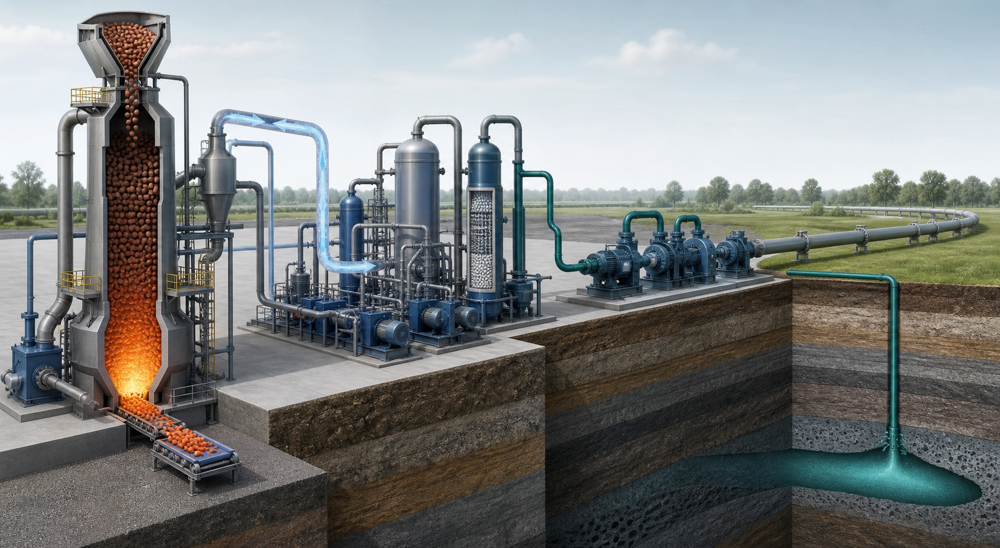

<!-- AUTO-GENERATED BY steel-intelligence. DO NOT EDIT. -->

# Nucor 기술 현황

> 조사 기준일: **2026-07-28** · 공식·1차 자료 중심 · 사실과 AI 분석을 구분해 작성

{ .steel-media-image .steel-hero-image .steel-media-compact }

*대표 이미지 — Convent 천연가스 DRI-CO2 포집·압축-수송-지중저장 계획의 출처 기반 AI 재구성; 실제 준공도나 가동 사진이 아님 (AI 재구성 · 권리 `ai_generated` · 출처 [[sources/SRC-20260725-BF5036AE|SRC-20260725-BF5036AE]] · [원문 페이지](https://corporate.exxonmobil.com/news/news-releases/2023/0601_lcs-nucor-agreement))*

!!! abstract "한눈에 보기"

    | 항목 | 확인 내용 |
    | --- | --- |
    | **확인된 기술** | 1개 / 감시 기술 13개 |
    | **연결 프로젝트** | 4개 |
    | **실행 단계** | 공식 현황 확인 1건 |
    | **직접 연결 근거** | 22건 |

## 기술 포트폴리오

현재 저장소에서 직접 근거가 확인된 기술만 표시합니다.

| 기술 | 현재 확인 내용 | 단계 |
| --- | --- | --- |
| **[[technologies/TEC-low-carbon-ironmaking|저탄소 제철 종합 경로 (Low-carbon Ironmaking)]]** | 재활용 scrap 기반 EAF가 주력; 2025 worldsteel 기준 0.77 tCO2e/t steel, 평균 재활용 함량 79.1% [^src-20260725-aa686449] | **공식 현황 확인** |

## 기술별 근거와 확인 과제

??? info "저탄소 제철 종합 경로 (Low-carbon Ironmaking) · 공식 현황 확인"

    **확인된 사실:** 재활용 scrap 기반 EAF가 주력; 2025 worldsteel 기준 0.77 tCO2e/t steel, 평균 재활용 함량 79.1% [^src-20260725-aa686449]

    **판단 기준:** 공식 자료에서 관련 움직임은 확인되지만 단계 구분에 필요한 일정·설비·운전 정보가 충분하지 않습니다.

    **확인 날짜:** 발표 미상 · 검증 2026-07-25

    **다음 확인:** 발표·MOU와 FID·착공·준공·램프업을 분리하고, 철광석 품위와 스크랩 추가성, 실제 수소 비율, 전력 탄소집약도, CO2 영구저장량, 제품별 Scope 1·2·상류 Scope 3 및 제3자 검증 출하량을 같은 기준으로 확인해야 합니다.

## 사업화·프로젝트 지표

| 항목 | 현재 확인 내용 |
| --- | --- |
| **advanced scrap recovery status** | Florida Bushnell facility에서 구리·기타 비철금속의 장입 전 분리·회수를 운영하고 매립물 재처리까지 수행한다고 보고; 독립 성능 검증은 미공개 [^src-20260728-8e7e10c4] |
| **west virginia sheet mill status** | Mason County 3 million short tons/year 첨단 판재 공장은 2026년 설비별 시운전 중이며 2027년 상업출하 램프업 목표 [^src-20260728-8c43a9d2] |

## 주요 프로젝트

회사 직접 Claim뿐 아니라 같은 원문 근거 또는 참여기관 문구로 연결된 프로젝트를 함께 표시합니다.

| 프로젝트 | 현재 상태 | 핵심 일정·규모 |
| --- | --- | --- |
| **[[projects/PRJ-ELECTRA-CLEAN-IRON-DEMO|Electra 청정철 시범공장]]** | 2026년 가동 목표로 시범공장 건설 중 [^src-20260725-4c014458] | **기술 경로** 철광석을 산성 수용액에 용해해 공존 광물을 분리하고 산을 재생한 뒤 전해채취 셀에서 금속 철을 전착하는 저온 전기화학·습식제련 경로 [^src-20260725-d6930918] · **연간 생산능력** 연간 500톤 (500 tpy) [^src-20260725-4c014458][^src-20260727-44dc8b30][^src-20260728-4b823cfa] · **목표 가동 시점** 2026년 [^src-20260725-4c014458] |
| **[[projects/PRJ-NUCOR-CONVENT-DRI-CCS|Nucor Convent DRI–CCS]]** | 2026-05 ExxonMobil report continues to list the Nucor Convent project as an announced long-term contract for up to about 0.8 Mt-CO2/y, while naming only CF Industries and NG3 as then transporting and storing CO2; Nucor start-up remains unconfirmed [^src-20260728-19397fad] | **기술 경로** Convent 천연가스 DRI 설비 배출 CO2 포집 → ExxonMobil 수송 → Louisiana 내 ExxonMobil 저장시설 영구저장 계획 [^src-20260725-bf5036ae] · **위치** Nucor DRI plant, Convent, Louisiana, United States [^src-20260725-bf5036ae] · **연간 CO2 포집능력** 연간 최대 800,000 metric tonnes CO2 포집·수송·저장 계약 [^src-20260725-bf5036ae] · **목표 가동 시점** 2026 target, conditional on further investment, supportive policy and permitting; actual start-up date remains unconfirmed [^src-20260728-c1d1d6ad] |
| **[[projects/PRJ-NUCOR-GALLATIN-EAF-CCUS|Nucor Gallatin EAF 탄소포집 파일럿]]** | 기존 열통합 아민 포집 파일럿의 구축·시험 후, DOE 선정 과제로 수소생산 결합 polishing loop를 기존 포집장치에 통합 설계·건설·시험하는 연구개발 단계 [^src-20260725-fe353d3a][^src-20260725-6d04090a][^src-20260728-fb94e7b7] | **기술 경로** EAF 저농도 배가스 → 기존 수계 아민 포집 → 수소생산 결합 이중 polishing loop → 용매 열화물·대기오염물질 측정 [^src-20260725-6d04090a] · **위치** Nucor Steel Gallatin, Ghent, Kentucky, United States [^src-20260725-fe353d3a] · **지원·조달 금액** DOE USD 3,000,000 + 비연방 USD 750,001 = 총 USD 3,750,001 [^src-20260725-6d04090a] |
| **[[projects/PRJ-NUCOR-WEST-VIRGINIA-SHEET-MILL|Nucor West Virginia 첨단 판재 공장]]** | 2026년 1분기 기준 최종 건설·설비별 시운전 단계이며, 산세 라인부터 냉연·도금·용해·열연 설비를 순차 시운전 중; 통합 상업생산 확정 상태가 아님 [^src-20260728-8c43a9d2] | **위치** Mason County, West Virginia, United States [^src-20260728-c4258413][^src-20260728-995b25fb] · **연간 생산능력** 3 million short tons/year sheet steel design capacity [^src-20260728-c4258413][^src-20260728-18d65a80] · **목표 가동 시점** 2027년 생산 개시·상업 출하 램프업 목표; 2026년은 설비별 commissioning 기간 [^src-20260728-8c43a9d2][^src-20260728-18d65a80] |

## 프로젝트별 상세

??? info "Electra 청정철 시범공장"

    **프로젝트 문서:** [[projects/PRJ-ELECTRA-CLEAN-IRON-DEMO|Electra 청정철 시범공장]]

    | 항목 | 확인된 내용 |
    | --- | --- |
    | **Customer demonstration signal** | 2026년 7월 Electra는 Toyota Tsusho 관계자에게 demonstration facility의 Clean Iron 기술을 작동 상태로 시연했다고 밝혔으나, 전체 공정 full operation·첫 제품 출하·연속운전·500 t/y 달성은 공개하지 않음 [^src-20260728-0356e66a] |
    | **설비 부지 규모** | Jefferson County 130,000 ft² demonstration facility [^src-20260727-44dc8b30][^src-20260728-4b823cfa] |
    | **수요사 품질인증 약정** | Nucor·Toyota Tsusho America·INTERFER가 시범 생산 철의 제강·유통·특수강 적용 검증을 위한 구매 약정을 체결; 품질 승인 완료 실적과는 구분 [^src-20260727-44dc8b30][^src-20260728-4b823cfa] |
    | **상용화 목표** | Electra CCO는 부지선정 중인 최초 상업시설에 대해 2029년 말 준비, 최대 1 Mt/y를 전망했다. 이는 site selection·FID 전 회사 전망이며 확정 부지·EPC·건설 일정이나 승인 용량이 아니다. [^src-20260728-4b823cfa] |
    | **Equipment installation milestone** | Electra는 2026-04-23 Colorado demonstration facility에 핵심 electrowinning bath 설치를 공개했다. 이는 장비 설치·construction 진척 근거이며 시운전 완료, 연속 철 생산 또는 500 t/y 달성 근거가 아니다. [^src-20260728-f9066cb4] |
    | **프로젝트 상태** | 2026년 가동 목표로 시범공장 건설 중 [^src-20260725-4c014458] |
    | **목표 가동 시점** | 2026년 [^src-20260725-4c014458] |
    | **기술 경로** | 철광석을 산성 수용액에 용해해 공존 광물을 분리하고 산을 재생한 뒤 전해채취 셀에서 금속 철을 전착하는 저온 전기화학·습식제련 경로 [^src-20260725-d6930918] |
    | **공개 성과의 한계** | 500 t/y 설계용량과 2026 가동 목표는 공개됐지만 전류효율·전력원단위·연속운전시간·전극수명·투자비는 공개되지 않음 [^src-20260725-4c014458] |
    | **설비 구성** | 산·염기 생성과 원료 분리를 담당하는 셀 스택과 철 전착을 담당하는 전해채취 셀 스택의 모듈식 구성 [^src-20260725-d6930918] |
    | **적용 원료** | 실리카·알루미나 등 불순물을 포함하거나 과거 채굴 후 미활용된 철 함유 원료까지 적용 가능하다는 회사 설명 [^src-20260725-d6930918] |
    | **후단 활용** | 생산 철을 EAF 제강 원료 또는 철 기반 배터리 소재로 사용 [^src-20260725-d6930918] |
    | **운전 온도** | 회사 기술 설명 기준 약 60°C 저온 운전 [^src-20260725-d6930918] |
    | **Commercial facility financing** | Electra는 2026-03-10 J.P. Morgan으로부터 USD 30 million venture debt facility를 확보했으며 용도는 최초 상업시설의 planning·preparation이다. 시범공장 CAPEX, 상업시설 FID 또는 전체 건설재원 확보와는 구분해야 한다. [^src-20260728-1be1edaf] |
    | **실증 자금조달** | Breakthrough Energy Catalyst 보조금 USD 50 million과 Colorado CITCO 세액공제 USD 8 million 발표; 총설비투자비와는 다름 [^src-20260727-44dc8b30][^src-20260728-1be1edaf] |
    | **Independent pilot scale crosscheck** | Ramboll은 Boulder 파일럿이 약 2 m²·60 kg cathode sheet와 약 60°C·99% 철을 보였다고 정리하지만, 이는 500 t/y demonstration facility의 연속운전·원가·가동률 검증과 구분 [^src-20260728-60d60f81] |
    | **제품 순도** | 회사 주장 기준 99% 초과 순도 철 [^src-20260725-d6930918] |
    | **시운전 목표** | Electra CCO는 2026-03-10 인터뷰에서 Colorado demonstration facility의 완전 가동 목표를 2026년 3분기로 제시했다. 2025년 10월의 시설 개장·ribbon cutting과 완전 가동은 구분되며, 2026년 7월 현재 실제 full operation 달성 실적을 확인한 값이 아니라 회사 목표다. [^src-20260728-4b823cfa] |
    | **연간 생산능력** | 연간 500톤 (500 tpy) [^src-20260725-4c014458][^src-20260727-44dc8b30][^src-20260728-4b823cfa] |

    **전체 공개 연혁**

    | 날짜 | 구분 | 확인된 사건 |
    | --- | --- | --- |
    | 2025-10-21 | 발표·검증 | **설비 부지 규모**: Jefferson County 130,000 ft² demonstration facility · **수요사 품질인증 약정**: Nucor·Toyota Tsusho America·INTERFER가 시범 생산 철의 제강·유통·특수강 적용 검증을 위한 구매 약정을 체결; 품질 승인 완료 실적과는 구분 · **상용화 목표**: 회사 목표는 2020년대 말 상업규모 청정철 생산이며 확정 가동 일정이 아님 · 후속 정보로 대체 · **시운전 목표**: 회사 발표 기준 2026년 중반 가동 개시 목표이며, 발표 시점에는 실제 가동 실적이 아님 · 후속 정보로 대체 · **실증 자금조달**: Breakthrough Energy Catalyst 보조금 USD 50 million과 Colorado CITCO 세액공제 USD 8 million 발표; 총설비투자비와는 다름 · **연간 생산능력**: 연간 500톤 (500 tpy) [^src-20260727-44dc8b30] |
    | 2026 | 목표 일정 | **목표 가동 시점**: 2026년 [^src-20260725-4c014458] |
    | 2026-03-10 | 발표·검증 | **Commercial facility financing**: Electra는 2026-03-10 J.P. Morgan으로부터 USD 30 million venture debt facility를 확보했으며 용도는 최초 상업시설의 planning·preparation이다. 시범공장 CAPEX, 상업시설 FID 또는 전체 건설재원 확보와는 구분해야 한다. · **실증 자금조달**: Breakthrough Energy Catalyst 보조금 USD 50 million과 Colorado CITCO 세액공제 USD 8 million 발표; 총설비투자비와는 다름 [^src-20260728-1be1edaf] |
    | 2026-03-12 | 발표·검증 | **설비 부지 규모**: Jefferson County 130,000 ft² demonstration facility · **수요사 품질인증 약정**: Nucor·Toyota Tsusho America·INTERFER가 시범 생산 철의 제강·유통·특수강 적용 검증을 위한 구매 약정을 체결; 품질 승인 완료 실적과는 구분 · **상용화 목표**: Electra CCO는 부지선정 중인 최초 상업시설에 대해 2029년 말 준비, 최대 1 Mt/y를 전망했다. 이는 site selection·FID 전 회사 전망이며 확정 부지·EPC·건설 일정이나 승인 용량이 아니다. · **시운전 목표**: Electra CCO는 2026-03-10 인터뷰에서 Colorado demonstration facility의 완전 가동 목표를 2026년 3분기로 제시했다. 2025년 10월의 시설 개장·ribbon cutting과 완전 가동은 구분되며, 2026년 7월 현재 실제 full operation 달성 실적을 확인한 값이 아니라 회사 목표다. · **연간 생산능력**: 연간 500톤 (500 tpy) [^src-20260728-4b823cfa] |
    | 2026-04-23 | 발표·검증 | **Equipment installation milestone**: Electra는 2026-04-23 Colorado demonstration facility에 핵심 electrowinning bath 설치를 공개했다. 이는 장비 설치·construction 진척 근거이며 시운전 완료, 연속 철 생산 또는 500 t/y 달성 근거가 아니다. [^src-20260728-f9066cb4] |
    | 2026-04-28 | 발표·검증 | **프로젝트 상태**: 2026년 가동 목표로 시범공장 건설 중 · **목표 가동 시점**: 2026년 · **공개 성과의 한계**: 500 t/y 설계용량과 2026 가동 목표는 공개됐지만 전류효율·전력원단위·연속운전시간·전극수명·투자비는 공개되지 않음 · **연간 생산능력**: 연간 500톤 (500 tpy) [^src-20260725-4c014458] |
    | 2026-07-25 | 수집 확인 | **기술 경로**: 철광석을 산성 수용액에 용해해 공존 광물을 분리하고 산을 재생한 뒤 전해채취 셀에서 금속 철을 전착하는 저온 전기화학·습식제련 경로 · **설비 구성**: 산·염기 생성과 원료 분리를 담당하는 셀 스택과 철 전착을 담당하는 전해채취 셀 스택의 모듈식 구성 · **적용 원료**: 실리카·알루미나 등 불순물을 포함하거나 과거 채굴 후 미활용된 철 함유 원료까지 적용 가능하다는 회사 설명 · **후단 활용**: 생산 철을 EAF 제강 원료 또는 철 기반 배터리 소재로 사용 · **운전 온도**: 회사 기술 설명 기준 약 60°C 저온 운전 · **제품 순도**: 회사 주장 기준 99% 초과 순도 철 [^src-20260725-d6930918] |
    | 2026-07-28 | 수집 확인 | **Customer demonstration signal**: 2026년 7월 Electra는 Toyota Tsusho 관계자에게 demonstration facility의 Clean Iron 기술을 작동 상태로 시연했다고 밝혔으나, 전체 공정 full operation·첫 제품 출하·연속운전·500 t/y 달성은 공개하지 않음 [^src-20260728-0356e66a] |
    | 2026-07-28 | 수집 확인 | **Independent pilot scale crosscheck**: Ramboll은 Boulder 파일럿이 약 2 m²·60 kg cathode sheet와 약 60°C·99% 철을 보였다고 정리하지만, 이는 500 t/y demonstration facility의 연속운전·원가·가동률 검증과 구분 [^src-20260728-60d60f81] |

    **변경·중단 이력**

    - **상용화 목표 · 후속 정보로 대체:** 회사 목표는 2020년대 말 상업규모 청정철 생산이며 확정 가동 일정이 아님 [^src-20260727-44dc8b30]
    - **시운전 목표 · 후속 정보로 대체:** 회사 발표 기준 2026년 중반 가동 개시 목표이며, 발표 시점에는 실제 가동 실적이 아님 [^src-20260727-44dc8b30]

??? info "Nucor Convent DRI–CCS"

    **프로젝트 문서:** [[projects/PRJ-NUCOR-CONVENT-DRI-CCS|Nucor Convent DRI–CCS]]

    | 항목 | 확인된 내용 |
    | --- | --- |
    | **기술 경로** | Convent 천연가스 DRI 설비 배출 CO2 포집 → ExxonMobil 수송 → Louisiana 내 ExxonMobil 저장시설 영구저장 계획 [^src-20260725-bf5036ae] |
    | **프로젝트 상태** | 2026-05 ExxonMobil report continues to list the Nucor Convent project as an announced long-term contract for up to about 0.8 Mt-CO2/y, while naming only CF Industries and NG3 as then transporting and storing CO2; Nucor start-up remains unconfirmed [^src-20260728-19397fad] |
    | **연간 CO2 포집능력** | 연간 최대 800,000 metric tonnes CO2 포집·수송·저장 계약 [^src-20260725-bf5036ae] |
    | **위치** | Nucor DRI plant, Convent, Louisiana, United States [^src-20260725-bf5036ae] |
    | **목표 가동 시점** | 2026 target, conditional on further investment, supportive policy and permitting; actual start-up date remains unconfirmed [^src-20260728-c1d1d6ad] |
    | **계약 교차확인** | Nucor도 ExxonMobil과의 Convent DRI CO2 포집·수송·영구저장 계약과 최대 80만 t/y 설계를 별도 공식 확인 [^src-20260725-11668643] |
    | **배출 경계** | 고로가 아닌 천연가스 DRI 설비 CCS이며, DRI 환원제를 수소로 전환했다는 근거는 아님 [^src-20260725-bf5036ae] |
    | **공개 성과의 한계** | 계약과 설계용량은 양사에서 확인되지만 시운전·연간 실제 포집량·포집률·수송 개시·영구 주입 실적은 미확인 [^src-20260725-11668643] |
    | **참여 기관** | Nucor Corporation 및 ExxonMobil [^src-20260725-bf5036ae] |

    **전체 공개 연혁**

    | 날짜 | 구분 | 확인된 사건 |
    | --- | --- | --- |
    | 2023 | 목표 일정 | **목표 가동 시점**: 2023년 발표 당시 2026년 가동 예상; 실제 개시일은 현재 등록 근거에서 미확인 [^src-20260725-bf5036ae] |
    | 2023-06-01 | 발표·검증 | **계약 교차확인**: Nucor도 ExxonMobil과의 Convent DRI CO2 포집·수송·영구저장 계약과 최대 80만 t/y 설계를 별도 공식 확인 · **공개 성과의 한계**: 계약과 설계용량은 양사에서 확인되지만 시운전·연간 실제 포집량·포집률·수송 개시·영구 주입 실적은 미확인 [^src-20260725-11668643] |
    | 2023-06-01 | 발표·검증 | **기술 경로**: Convent 천연가스 DRI 설비 배출 CO2 포집 → ExxonMobil 수송 → Louisiana 내 ExxonMobil 저장시설 영구저장 계획 · **연간 CO2 포집능력**: 연간 최대 800,000 metric tonnes CO2 포집·수송·저장 계약 · **프로젝트 상태**: Nucor와 ExxonMobil의 DRI 설비 CO2 포집·수송·저장 계약은 2025 Form 10-K에도 공시됐으나 실제 2026 시운전 완료는 확인되지 않음 · 후속 정보로 대체 · **위치**: Nucor DRI plant, Convent, Louisiana, United States · **배출 경계**: 고로가 아닌 천연가스 DRI 설비 CCS이며, DRI 환원제를 수소로 전환했다는 근거는 아님 · **참여 기관**: Nucor Corporation 및 ExxonMobil · **목표 가동 시점**: 2023년 발표 당시 2026년 가동 예상; 실제 개시일은 현재 등록 근거에서 미확인 · 후속 정보로 대체 [^src-20260725-bf5036ae] |
    | 2025-12-09 | 발표·검증 | **목표 가동 시점**: 2026 target, conditional on further investment, supportive policy and permitting; actual start-up date remains unconfirmed [^src-20260728-c1d1d6ad] |
    | 2026 | 목표 일정 | **목표 가동 시점**: 2026 target, conditional on further investment, supportive policy and permitting; actual start-up date remains unconfirmed [^src-20260728-c1d1d6ad] |
    | 2026-05-01 | 발표·검증 | **프로젝트 상태**: 2026-05 ExxonMobil report continues to list the Nucor Convent project as an announced long-term contract for up to about 0.8 Mt-CO2/y, while naming only CF Industries and NG3 as then transporting and storing CO2; Nucor start-up remains unconfirmed [^src-20260728-19397fad] |

    **변경·중단 이력**

    - **프로젝트 상태 · 후속 정보로 대체:** Nucor와 ExxonMobil의 DRI 설비 CO2 포집·수송·저장 계약은 2025 Form 10-K에도 공시됐으나 실제 2026 시운전 완료는 확인되지 않음 [^src-20260725-bf5036ae]
    - **목표 가동 시점 · 후속 정보로 대체:** 2023년 발표 당시 2026년 가동 예상; 실제 개시일은 현재 등록 근거에서 미확인 [^src-20260725-bf5036ae]

??? info "Nucor Gallatin EAF 탄소포집 파일럿"

    **프로젝트 문서:** [[projects/PRJ-NUCOR-GALLATIN-EAF-CCUS|Nucor Gallatin EAF 탄소포집 파일럿]]

    | 항목 | 확인된 내용 |
    | --- | --- |
    | **프로젝트 상태** | 기존 열통합 아민 포집 파일럿의 구축·시험 후, DOE 선정 과제로 수소생산 결합 polishing loop를 기존 포집장치에 통합 설계·건설·시험하는 연구개발 단계 [^src-20260725-fe353d3a][^src-20260725-6d04090a][^src-20260728-fb94e7b7] |
    | **지원·조달 금액** | DOE USD 3,000,000 + 비연방 USD 750,001 = 총 USD 3,750,001 [^src-20260725-6d04090a] |
    | **기술 경로** | EAF 저농도 배가스 → 기존 수계 아민 포집 → 수소생산 결합 이중 polishing loop → 용매 열화물·대기오염물질 측정 [^src-20260725-6d04090a] |
    | **배출 측정 범위** | 통합 포집계통 시험에서 용매·용매열화물 배출과 criteria pollutants를 측정하는 범위 [^src-20260725-6d04090a] |
    | **후단 CO2 농도 목표** | 이중 polishing 처리 후 CO2 100 ppm 미만 배가스 대상 기술개발 목표; 달성 실적은 미확인 [^src-20260725-6d04090a] |
    | **위치** | Nucor Steel Gallatin, Ghent, Kentucky, United States [^src-20260725-fe353d3a] |
    | **참여 기관** | Nucor Corporation, University of Kentucky Research Foundation, U.S. DOE/NETL; 2022 발표 기준 산학 전문가 50명 초과 참여 [^src-20260725-fe353d3a] |
    | **공개 개발 단계** | engineering-scale 포집 성능·비용·재현성 평가; 상업 포집량·영구저장량은 미공개 [^src-20260725-fe353d3a][^src-20260725-6d04090a] |

    **전체 공개 연혁**

    | 날짜 | 구분 | 확인된 사건 |
    | --- | --- | --- |
    | 2022-04-22 | 발표·검증 | **프로젝트 상태**: 기존 열통합 아민 포집 파일럿의 구축·시험 후, DOE 선정 과제로 수소생산 결합 polishing loop를 기존 포집장치에 통합 설계·건설·시험하는 연구개발 단계 · **위치**: Nucor Steel Gallatin, Ghent, Kentucky, United States · **참여 기관**: Nucor Corporation, University of Kentucky Research Foundation, U.S. DOE/NETL; 2022 발표 기준 산학 전문가 50명 초과 참여 · **공개 개발 단계**: engineering-scale 포집 성능·비용·재현성 평가; 상업 포집량·영구저장량은 미공개 [^src-20260725-fe353d3a] |
    | 2024-08-27 | 발표·검증 | **프로젝트 상태**: 기존 열통합 아민 포집 파일럿의 구축·시험 후, DOE 선정 과제로 수소생산 결합 polishing loop를 기존 포집장치에 통합 설계·건설·시험하는 연구개발 단계 [^src-20260728-fb94e7b7] |
    | 2026-07-25 | 수집 확인 | **프로젝트 상태**: 기존 열통합 아민 포집 파일럿의 구축·시험 후, DOE 선정 과제로 수소생산 결합 polishing loop를 기존 포집장치에 통합 설계·건설·시험하는 연구개발 단계 · **지원·조달 금액**: DOE USD 3,000,000 + 비연방 USD 750,001 = 총 USD 3,750,001 · **기술 경로**: EAF 저농도 배가스 → 기존 수계 아민 포집 → 수소생산 결합 이중 polishing loop → 용매 열화물·대기오염물질 측정 · **배출 측정 범위**: 통합 포집계통 시험에서 용매·용매열화물 배출과 criteria pollutants를 측정하는 범위 · **후단 CO2 농도 목표**: 이중 polishing 처리 후 CO2 100 ppm 미만 배가스 대상 기술개발 목표; 달성 실적은 미확인 · **공개 개발 단계**: engineering-scale 포집 성능·비용·재현성 평가; 상업 포집량·영구저장량은 미공개 [^src-20260725-6d04090a] |

??? info "Nucor West Virginia 첨단 판재 공장"

    **프로젝트 문서:** [[projects/PRJ-NUCOR-WEST-VIRGINIA-SHEET-MILL|Nucor West Virginia 첨단 판재 공장]]

    | 항목 | 확인된 내용 |
    | --- | --- |
    | **목표 제품 범위** | 현재 Nucor 제품 페이지가 84-inch sheet, 76-inch tandem cold mill, advanced high-end automotive 및 construction grades용 2개 galvanizing line의 계획 범위를 재확인; 실제 생산·품질승인 실적은 아님 [^src-20260728-1e16b6c3] |
    | **위치** | Mason County, West Virginia, United States [^src-20260728-c4258413][^src-20260728-995b25fb] |
    | **연간 생산능력** | 3 million short tons/year sheet steel design capacity [^src-20260728-c4258413][^src-20260728-18d65a80] |
    | **프로젝트 상태** | 2026년 1분기 기준 최종 건설·설비별 시운전 단계이며, 산세 라인부터 냉연·도금·용해·열연 설비를 순차 시운전 중; 통합 상업생산 확정 상태가 아님 [^src-20260728-8c43a9d2] |
    | **Commissioning sequence** | 2026년 산세 라인부터 냉연·건설용 도금·자동차용 도금·용해 공장·열연 공장 순으로 시운전하며, 생산능력·제품군은 2027~2028년에 단계 확대 [^src-20260728-8c43a9d2] |
    | **목표 가동 시점** | 2027년 생산 개시·상업 출하 램프업 목표; 2026년은 설비별 commissioning 기간 [^src-20260728-8c43a9d2][^src-20260728-18d65a80] |

    **전체 공개 연혁**

    | 날짜 | 구분 | 확인된 사건 |
    | --- | --- | --- |
    | 2022-01-12 | 발표·검증 | **목표 제품 범위**: 84-inch sheet, 76-inch tandem cold mill, high-end automotive galvanizing with full inspection, and construction-grade galvanizing · 후속 정보로 대체 · **위치**: Mason County, West Virginia, United States · **연간 생산능력**: 3 million short tons/year sheet steel design capacity [^src-20260728-c4258413] |
    | 2026-04-28 | 발표·검증 | **프로젝트 상태**: 2026년 1분기 기준 최종 건설·설비별 시운전 단계이며, 산세 라인부터 냉연·도금·용해·열연 설비를 순차 시운전 중; 통합 상업생산 확정 상태가 아님 · **Commissioning sequence**: 2026년 산세 라인부터 냉연·건설용 도금·자동차용 도금·용해 공장·열연 공장 순으로 시운전하며, 생산능력·제품군은 2027~2028년에 단계 확대 · **목표 가동 시점**: 2027년 생산 개시·상업 출하 램프업 목표; 2026년은 설비별 commissioning 기간 [^src-20260728-8c43a9d2] |
    | 2026-06-16 | 발표·검증 | **연간 생산능력**: 3 million short tons/year sheet steel design capacity · **목표 가동 시점**: 2027년 생산 개시·상업 출하 램프업 목표; 2026년은 설비별 commissioning 기간 [^src-20260728-18d65a80] |
    | 2026-07-01 | 발표·검증 | **위치**: Mason County, West Virginia, United States [^src-20260728-995b25fb] |
    | 2026-07-28 | 수집 확인 | **목표 제품 범위**: 현재 Nucor 제품 페이지가 84-inch sheet, 76-inch tandem cold mill, advanced high-end automotive 및 construction grades용 2개 galvanizing line의 계획 범위를 재확인; 실제 생산·품질승인 실적은 아님 [^src-20260728-1e16b6c3] |
    | 2027 | 목표 일정 | **목표 가동 시점**: 2027년 생산 개시·상업 출하 램프업 목표; 2026년은 설비별 commissioning 기간 [^src-20260728-8c43a9d2][^src-20260728-18d65a80] |

    **변경·중단 이력**

    - **목표 제품 범위 · 후속 정보로 대체:** 84-inch sheet, 76-inch tandem cold mill, high-end automotive galvanizing with full inspection, and construction-grade galvanizing [^src-20260728-c4258413]

## AI 분석

!!! warning "공개 근거와 구분"

    - 확인된 사실만으로 기술 경쟁력을 단일 순위로 평가하지 않았습니다. 실증 규모, 상용 운전, 원료·에너지 조건이 서로 다르기 때문입니다.
    - 현재 자료의 실행 단계 분포는 공식 현황 확인 1건입니다. 이는 공식 발표 문구를 바탕으로 한 분류이며 정식 TRL 판정이 아닙니다.
    - 다음 갱신에서는 목표치보다 착공·준공·누적 생산량·가동률·제품 단위 배출량처럼 실행을 입증하는 지표를 우선 확인하는 것이 좋습니다.

## 설비·공정 이미지

{ .steel-media-image .steel-media-compact }

**AI 재구성.** Nucor Gallatin EAF 저농도 배가스-아민 포집-polishing loop·측정 계통의 출처 기반 AI 재구성; 실제 설치 사진이 아님

- 출처 [[sources/SRC-20260725-FE353D3A|SRC-20260725-FE353D3A]] · 권리 `ai_generated` · [원문 페이지](https://nucor.com/news?article=nucor-and-the-university-of-kentucky-receive-federal-grant-for-carbon-capture-r%26d-at-gallatin-mill-122742) · 작성·촬영 OpenAI image generation / Codex
- 권리 메모: Nucor와 DOE 공개 설명을 바탕으로 생성한 AI 재구성. 실제 Gallatin 장치 배치나 규모의 증거로 사용하지 않음

## 근거 자료

| 자료 | 발행 정보 | 원문 |
| --- | --- | --- |
| [[sources/SRC-20260725-11668643|Nucor Convent DRI carbon capture and storage agreement]] | Nucor Corporation · 2023-06-01 | [원문 보기](https://investors.nucor.com/news/news-details/2023/Nucor-Enters-Into-Carbon-Capture-Storage-Agreement-with-ExxonMobil-06-01-2023/default.aspx) |
| [[sources/SRC-20260725-4C014458|POSCO and Electra partner on low-temperature clean iron]] | POSCO Group Newsroom · 2026-04-28 | [원문 보기](https://newsroom.posco.com/kr/%ED%8F%AC%EC%8A%A4%EC%BD%94-%EC%A0%80%ED%83%84%EC%86%8C-%EC%A0%9C%EC%B2%A0-%EA%B8%B0%EC%88%A0-%EB%B3%B4%EC%9C%A0-%E7%BE%8E-%ED%98%81%EC%8B%A0%EA%B8%B0%EC%97%85-%EC%9D%BC%EB%A0%89%ED%8A%B8%EB%9D%BC/) |
| [[sources/SRC-20260725-6D04090A|DOE Round 5 selection: UK IDEA dual-loop capture at Nucor Steel Gallatin]] | U.S. Department of Energy · 게시일 미상 | [원문 보기](https://www.energy.gov/hgeo/project-selections-foa-2614-carbon-management-round-5) |
| [[sources/SRC-20260725-AA686449|Nucor sustainability and EAF steelmaking profile]] | Nucor Corporation · 게시일 미상 | [원문 보기](https://nucor.com/sustainability/) |
| [[sources/SRC-20260725-BF5036AE|ExxonMobil and Nucor carbon capture agreement for Convent DRI plant]] | ExxonMobil · 2023-06-01 | [원문 보기](https://corporate.exxonmobil.com/news/news-releases/2023/0601_lcs-nucor-agreement) |
| [[sources/SRC-20260725-D6930918|Electra Technology: How the low-temperature iron process works]] | Electra · 게시일 미상 | [원문 보기](https://www.electra.earth/our-technology/) |
| [[sources/SRC-20260725-FE353D3A|Nucor and University of Kentucky carbon-capture pilot at Gallatin]] | Nucor Corporation · 2022-04-22 | [원문 보기](https://nucor.com/news-release/nucor-and-the-university-of-kentucky-receive-federal-grant-for-carbon-capture-r%26d-at-gallatin-mill-122742) |
| [[sources/SRC-20260727-44DC8B30|Electra Unveils Demonstration Facility along with Advanced Purchase Commitments for Clean Iron and Environmental Attributes]] | Electra / GlobeNewswire · 2025-10-21 | [원문 보기](https://www.globenewswire.com/news-release/2025/10/21/3170489/0/en/Electra-Unveils-Demonstration-Facility-along-with-Advanced-Purchase-Commitments-for-Clean-Iron-and-Environmental-Attributes.html) |
| [[sources/SRC-20260728-0356E66A|Electra hosts Toyota Tsusho at demonstration facility to show Clean Iron technology in action]] | Electra · 게시일 미상 | [원문 보기](https://www.linkedin.com/company/electra-earth) |
| [[sources/SRC-20260728-18D65A80|Commissioning Underway at New Nucor Mill]] | Association for Iron & Steel Technology · 2026-06-16 | [원문 보기](https://www.aist.org/commissioning-underway-at-new-nucor-mill) |
| [[sources/SRC-20260728-19397FAD|Advancing Climate Solutions 2026 - Nucor Convent CCS status]] | Exxon Mobil Corporation · 2026-05-01 | [원문 보기](https://corporate.exxonmobil.com/-/media/global/files/advancing-climate-solutions/2026/2026-advancing-climate-solutions-report.pdf) |
| [[sources/SRC-20260728-1BE1EDAF|Electra Secures $30M in New Capital to Accelerate Commercial Production]] | Electra / GlobeNewswire · 2026-03-10 | [원문 보기](https://www.globenewswire.com/news-release/2026/03/10/3252582/0/en/Electra-Secures-30M-in-New-Capital-to-Accelerate-Commercial-Production.html) |
| [[sources/SRC-20260728-1E16B6C3|Steel Sheet Products: American-Made EAF Steel]] | Nucor Corporation · 게시일 미상 | [원문 보기](https://nucor.com/products/sheet/) |
| [[sources/SRC-20260728-4B823CFA|EAFs increasingly able to fill blast furnace gap: Electra]] | Fastmarkets · 2026-03-12 | [원문 보기](https://www.fastmarkets.com/insights/eaf-able-to-fill-blast-iron-furnace-gap/) |
| [[sources/SRC-20260728-60D60F81|Forging a cleaner future: Advances and business models in electrochemical iron production]] | Ramboll · 게시일 미상 | [원문 보기](https://c.ramboll.com/hubfs/Low-Carbon-Steel/Electrochemical-Whitepaper.pdf) |
| [[sources/SRC-20260728-8C43A9D2|Nucor Q1 2026 earnings presentation: West Virginia sheet mill]] | Nucor Corporation · 2026-04-28 | [원문 보기](https://s202.q4cdn.com/531038915/files/doc_financials/2026/q1/Q1-2026-Earnings-Call-Presentation.pdf) |
| [[sources/SRC-20260728-8E7E10C4|Transforming the Electric Grid with Scrap Recovery Technology]] | Nucor Corporation · 2025-05-16 | [원문 보기](https://nucor.com/case-study/advanced-material-recovery-case-study/) |
| [[sources/SRC-20260728-995B25FB|Crane and Mobile Mechanical Maintenance - Nucor Steel West Virginia]] | Nucor Corporation · 2026-07-01 | [원문 보기](https://jobs.nucor.com/job/Apple-Grove-Crane-and-Mobile-Mechanical-Maintenance-WV-25502/1359010400/) |
| [[sources/SRC-20260728-C1D1D6AD|ExxonMobil raises its 2030 Plan - conditional Nucor CCS start-up target]] | Exxon Mobil Corporation · 2025-12-09 | [원문 보기](https://corporate.exxonmobil.com/news/news-releases/2025/1209-exxonmobil-raises-2030-plan-transformation) |
| [[sources/SRC-20260728-C4258413|Nucor selects West Virginia for new sheet mill]] | Nucor Corporation · 2022-01-12 | [원문 보기](https://nucor.com/news/?article=nucor-selects-west-virginia-as-location-for-new-state-of-the-art-sheet-mill-122736) |
| [[sources/SRC-20260728-F9066CB4|Electra demonstration-facility electrowinning baths installed]] | Electra · 2026-04-23 | [원문 보기](https://www.linkedin.com/posts/electra-earth_a-lot-of-hard-work-became-real-this-week-activity-7453155218462183424-N15E) |
| [[sources/SRC-20260728-FB94E7B7|UK IDEA Dual Loop CO2 Capture at Nucor Steel Gallatin - Categorical Exclusion]] | U.S. Department of Energy, National Energy Technology Laboratory · 2024-08-27 | [원문 보기](https://www.energy.gov/sites/default/files/2025-01/CX-032360.pdf) |

[^src-20260725-11668643]: **Nucor Convent DRI carbon capture and storage agreement** — Nucor Corporation, 2023-06-01. [원문](https://investors.nucor.com/news/news-details/2023/Nucor-Enters-Into-Carbon-Capture-Storage-Agreement-with-ExxonMobil-06-01-2023/default.aspx) · [[sources/SRC-20260725-11668643|보관 원문·메타데이터]]
[^src-20260725-4c014458]: **POSCO and Electra partner on low-temperature clean iron** — POSCO Group Newsroom, 2026-04-28. [원문](https://newsroom.posco.com/kr/%ED%8F%AC%EC%8A%A4%EC%BD%94-%EC%A0%80%ED%83%84%EC%86%8C-%EC%A0%9C%EC%B2%A0-%EA%B8%B0%EC%88%A0-%EB%B3%B4%EC%9C%A0-%E7%BE%8E-%ED%98%81%EC%8B%A0%EA%B8%B0%EC%97%85-%EC%9D%BC%EB%A0%89%ED%8A%B8%EB%9D%BC/) · [[sources/SRC-20260725-4C014458|보관 원문·메타데이터]]
[^src-20260725-6d04090a]: **DOE Round 5 selection: UK IDEA dual-loop capture at Nucor Steel Gallatin** — U.S. Department of Energy, 게시일 미상. [원문](https://www.energy.gov/hgeo/project-selections-foa-2614-carbon-management-round-5) · [[sources/SRC-20260725-6D04090A|보관 원문·메타데이터]]
[^src-20260725-aa686449]: **Nucor sustainability and EAF steelmaking profile** — Nucor Corporation, 게시일 미상. [원문](https://nucor.com/sustainability/) · [[sources/SRC-20260725-AA686449|보관 원문·메타데이터]]
[^src-20260725-bf5036ae]: **ExxonMobil and Nucor carbon capture agreement for Convent DRI plant** — ExxonMobil, 2023-06-01. [원문](https://corporate.exxonmobil.com/news/news-releases/2023/0601_lcs-nucor-agreement) · [[sources/SRC-20260725-BF5036AE|보관 원문·메타데이터]]
[^src-20260725-d6930918]: **Electra Technology: How the low-temperature iron process works** — Electra, 게시일 미상. [원문](https://www.electra.earth/our-technology/) · [[sources/SRC-20260725-D6930918|보관 원문·메타데이터]]
[^src-20260725-fe353d3a]: **Nucor and University of Kentucky carbon-capture pilot at Gallatin** — Nucor Corporation, 2022-04-22. [원문](https://nucor.com/news-release/nucor-and-the-university-of-kentucky-receive-federal-grant-for-carbon-capture-r%26d-at-gallatin-mill-122742) · [[sources/SRC-20260725-FE353D3A|보관 원문·메타데이터]]
[^src-20260727-44dc8b30]: **Electra Unveils Demonstration Facility along with Advanced Purchase Commitments for Clean Iron and Environmental Attributes** — Electra / GlobeNewswire, 2025-10-21. [원문](https://www.globenewswire.com/news-release/2025/10/21/3170489/0/en/Electra-Unveils-Demonstration-Facility-along-with-Advanced-Purchase-Commitments-for-Clean-Iron-and-Environmental-Attributes.html) · [[sources/SRC-20260727-44DC8B30|보관 원문·메타데이터]]
[^src-20260728-0356e66a]: **Electra hosts Toyota Tsusho at demonstration facility to show Clean Iron technology in action** — Electra, 게시일 미상. [원문](https://www.linkedin.com/company/electra-earth) · [[sources/SRC-20260728-0356E66A|보관 원문·메타데이터]]
[^src-20260728-18d65a80]: **Commissioning Underway at New Nucor Mill** — Association for Iron & Steel Technology, 2026-06-16. [원문](https://www.aist.org/commissioning-underway-at-new-nucor-mill) · [[sources/SRC-20260728-18D65A80|보관 원문·메타데이터]]
[^src-20260728-19397fad]: **Advancing Climate Solutions 2026 - Nucor Convent CCS status** — Exxon Mobil Corporation, 2026-05-01. [원문](https://corporate.exxonmobil.com/-/media/global/files/advancing-climate-solutions/2026/2026-advancing-climate-solutions-report.pdf) · [[sources/SRC-20260728-19397FAD|보관 원문·메타데이터]]
[^src-20260728-1be1edaf]: **Electra Secures $30M in New Capital to Accelerate Commercial Production** — Electra / GlobeNewswire, 2026-03-10. [원문](https://www.globenewswire.com/news-release/2026/03/10/3252582/0/en/Electra-Secures-30M-in-New-Capital-to-Accelerate-Commercial-Production.html) · [[sources/SRC-20260728-1BE1EDAF|보관 원문·메타데이터]]
[^src-20260728-1e16b6c3]: **Steel Sheet Products: American-Made EAF Steel** — Nucor Corporation, 게시일 미상. [원문](https://nucor.com/products/sheet/) · [[sources/SRC-20260728-1E16B6C3|보관 원문·메타데이터]]
[^src-20260728-4b823cfa]: **EAFs increasingly able to fill blast furnace gap: Electra** — Fastmarkets, 2026-03-12. [원문](https://www.fastmarkets.com/insights/eaf-able-to-fill-blast-iron-furnace-gap/) · [[sources/SRC-20260728-4B823CFA|보관 원문·메타데이터]]
[^src-20260728-60d60f81]: **Forging a cleaner future: Advances and business models in electrochemical iron production** — Ramboll, 게시일 미상. [원문](https://c.ramboll.com/hubfs/Low-Carbon-Steel/Electrochemical-Whitepaper.pdf) · [[sources/SRC-20260728-60D60F81|보관 원문·메타데이터]]
[^src-20260728-8c43a9d2]: **Nucor Q1 2026 earnings presentation: West Virginia sheet mill** — Nucor Corporation, 2026-04-28. [원문](https://s202.q4cdn.com/531038915/files/doc_financials/2026/q1/Q1-2026-Earnings-Call-Presentation.pdf) · [[sources/SRC-20260728-8C43A9D2|보관 원문·메타데이터]]
[^src-20260728-8e7e10c4]: **Transforming the Electric Grid with Scrap Recovery Technology** — Nucor Corporation, 2025-05-16. [원문](https://nucor.com/case-study/advanced-material-recovery-case-study/) · [[sources/SRC-20260728-8E7E10C4|보관 원문·메타데이터]]
[^src-20260728-995b25fb]: **Crane and Mobile Mechanical Maintenance - Nucor Steel West Virginia** — Nucor Corporation, 2026-07-01. [원문](https://jobs.nucor.com/job/Apple-Grove-Crane-and-Mobile-Mechanical-Maintenance-WV-25502/1359010400/) · [[sources/SRC-20260728-995B25FB|보관 원문·메타데이터]]
[^src-20260728-c1d1d6ad]: **ExxonMobil raises its 2030 Plan - conditional Nucor CCS start-up target** — Exxon Mobil Corporation, 2025-12-09. [원문](https://corporate.exxonmobil.com/news/news-releases/2025/1209-exxonmobil-raises-2030-plan-transformation) · [[sources/SRC-20260728-C1D1D6AD|보관 원문·메타데이터]]
[^src-20260728-c4258413]: **Nucor selects West Virginia for new sheet mill** — Nucor Corporation, 2022-01-12. [원문](https://nucor.com/news/?article=nucor-selects-west-virginia-as-location-for-new-state-of-the-art-sheet-mill-122736) · [[sources/SRC-20260728-C4258413|보관 원문·메타데이터]]
[^src-20260728-f9066cb4]: **Electra demonstration-facility electrowinning baths installed** — Electra, 2026-04-23. [원문](https://www.linkedin.com/posts/electra-earth_a-lot-of-hard-work-became-real-this-week-activity-7453155218462183424-N15E) · [[sources/SRC-20260728-F9066CB4|보관 원문·메타데이터]]
[^src-20260728-fb94e7b7]: **UK IDEA Dual Loop CO2 Capture at Nucor Steel Gallatin - Categorical Exclusion** — U.S. Department of Energy, National Energy Technology Laboratory, 2024-08-27. [원문](https://www.energy.gov/sites/default/files/2025-01/CX-032360.pdf) · [[sources/SRC-20260728-FB94E7B7|보관 원문·메타데이터]]
