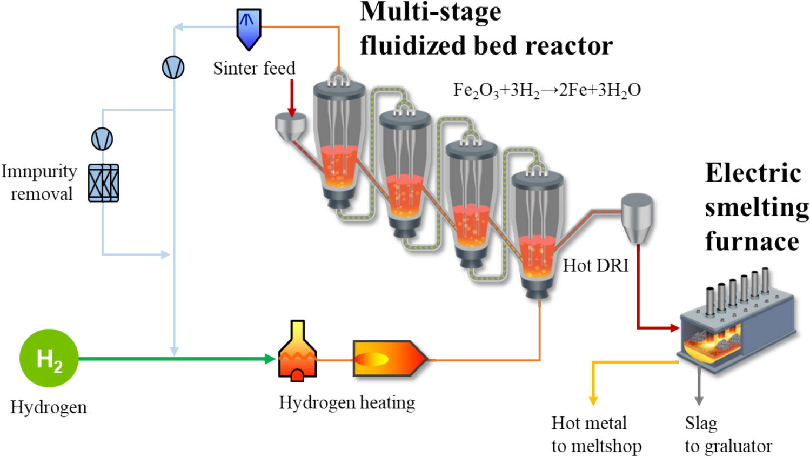

<!-- AUTO-GENERATED BY steel-intelligence. DO NOT EDIT. -->

# POSCO 기술 현황

> 조사 기준일: **2026-07-28** · 공식·1차 자료 중심 · 사실과 AI 분석을 구분해 작성

{ .steel-media-image .steel-hero-image .steel-media-detail }

*대표 이미지 — POSCO 공식 HyREX 공정도: 분철광석-4단 유동층 환원로-DRI-전기용융로-전로-연속주조 연계 (공정 개념도 · 권리 `link_only` · 출처 [[sources/SRC-20260725-013F0FA1|SRC-20260725-013F0FA1]] · [원문 페이지](https://www.posco.com/homepage/docs/eng7/jsp/hyrex))*

!!! abstract "한눈에 보기"

    | 항목 | 확인 내용 |
    | --- | --- |
    | **확인된 기술** | 7개 / 감시 기술 13개 |
    | **연결 프로젝트** | 5개 |
    | **실행 단계** | 연구·실증 3건 · 준공·가동 준비 1건 · 공식 현황 확인 1건 · 계획·투자 1건 · 가동·현장 적용 1건 |
    | **직접 연결 근거** | 27건 |

!!! warning "주의해서 볼 항목"

    - **전기용융로 (Electric Smelting Furnace):** 2024년 4월 1 t/h 파일럿 전기용융로에서 첫 용선 생산, DRI·HBI 용융 시험 계획 단계; 상업 규모 운전은 미확인 [^src-20260725-a6759186]
    - **스마트 제철소 (Smart Steelworks):** 포항 2고로 AI 예측·제어와 제철소 연속공정용 PosFrame 운용이 확인됨; 2020년 기준선이며 현재 전 설비 배치 범위는 미확인 [^src-20260725-28e5a30f]

## 기술 포트폴리오

현재 저장소에서 직접 근거가 확인된 기술만 표시합니다.

| 기술 | 현재 확인 내용 | 단계 |
| --- | --- | --- |
| **[[technologies/TEC-electric-smelting-furnace|전기용융로 (Electric Smelting Furnace)]]** | 2024년 4월 1 t/h 파일럿 전기용융로에서 첫 용선 생산, DRI·HBI 용융 시험 계획 단계; 상업 규모 운전은 미확인 [^src-20260725-a6759186] | **연구·실증** |
| **[[technologies/TEC-molten-oxide-electrolysis|용융산화물 전기분해 (Molten Oxide Electrolysis)]]** | POSCO 프로젝트 2022Z001이 서울대의 900°C 저온 MOE 학술 연구를 지원했다. 이 출처만으로 POSCO 자체 MOE 파일럿 설비 운전은 확인되지 않는다. [^src-20260725-1486633e] | **연구·실증** |
| **[[technologies/TEC-low-carbon-ironmaking|저탄소 제철 종합 경로 (Low-carbon Ironmaking)]]** | 광양 2.5 Mtpa 전기로를 2026년 6월 준공해 저탄소강 생산 착수; 약 KRW 600bn 투자, 고급강용 합탕·스크랩·성분제어 기술 개발 중 [^src-20260725-b859ca04] | **준공·가동 준비** |
| **[[technologies/TEC-smart-steelworks|스마트 제철소 (Smart Steelworks)]]** | 포항 2고로 AI 예측·제어와 제철소 연속공정용 PosFrame 운용이 확인됨; 2020년 기준선이며 현재 전 설비 배치 범위는 미확인 [^src-20260725-28e5a30f] | **공식 현황 확인** |
| **[[technologies/TEC-low-temperature-aqueous-iron-electrolysis|저온 수계 전해제철 (Aqueous Iron Electrolysis)]]** | Electra와 저온 전기화학 철 생산 공동개발·투자; 연산 500톤 시범공장의 상업화 기술·경제성 공동 검증 단계 [^src-20260725-4c014458] | **계획·투자** |
| **[[technologies/TEC-high-grade-eaf-and-scrap-impurity-removal|고급강 EAF·스크랩 불순물 제거]]** | 광양제철소 연 250만 톤 대형 전기로(EAF)를 2026년 6월 17일 준공해 저탄소강 생산을 개시했으며 약 6,000억 원을 투자했다. 고로 용선 혼합, 스크랩 선별·성분 제어 기술을 개발해 2030년 자동차강판·전기강판 등 고급강 양산을 목표로 한다. [^src-20260725-b859ca04] | **가동·현장 적용** |
| **[[technologies/TEC-hydrogen-based-fine-ore-reduction|무펠릿 미분광 수소환원 (Fluidized-bed Hydrogen Reduction)]]** | 포항제철소에서 연 30만 톤 HyREX 통합 실증설비를 공동설계하고 부지를 준비 중; 2030년 상용화 기술개발 완료 목표 [^src-20260725-b859ca04] | **연구·실증** |

## 기술별 근거와 확인 과제

??? info "전기용융로 (Electric Smelting Furnace) · 연구·실증"

    **확인된 사실:** 2024년 4월 1 t/h 파일럿 전기용융로에서 첫 용선 생산, DRI·HBI 용융 시험 계획 단계; 상업 규모 운전은 미확인 [^src-20260725-a6759186]

    **판단 기준:** 기술 가능성을 검증하는 단계입니다. 시험 규모의 성공을 상용 생산성과로 해석하지 않고 규모 확대 계획을 따로 확인해야 합니다.

    **확인 날짜:** 발표 2024-09-11 · 검증 2026-07-25

    **다음 확인:** 시험 규모와 상업 설비의 차이, 투입 원료 품위·금속화율, 탄소·전력원단위, 철 회수율, 슬래그량·조성, 전극·내화물 수명과 후단 BOF·EAF 통합 여부를 확인해야 합니다.

??? info "용융산화물 전기분해 (Molten Oxide Electrolysis) · 연구·실증"

    **확인된 사실:** POSCO 프로젝트 2022Z001이 서울대의 900°C 저온 MOE 학술 연구를 지원했다. 이 출처만으로 POSCO 자체 MOE 파일럿 설비 운전은 확인되지 않는다. [^src-20260725-1486633e]

    **판단 기준:** 기술 가능성을 검증하는 단계입니다. 시험 규모의 성공을 상용 생산성과로 해석하지 않고 규모 확대 계획을 따로 확인해야 합니다.

    **확인 날짜:** 발표 2026-07-07 · 검증 2026-07-25

    **다음 확인:** 투자·제휴 발표와 자체 설비 운영을 구분하고, 셀 규모, 연속 운전시간, 제품 품질과 상용 설비 착공 여부를 확인해야 합니다.

??? info "저탄소 제철 종합 경로 (Low-carbon Ironmaking) · 준공·가동 준비"

    **확인된 사실:** 광양 2.5 Mtpa 전기로를 2026년 6월 준공해 저탄소강 생산 착수; 약 KRW 600bn 투자, 고급강용 합탕·스크랩·성분제어 기술 개발 중 [^src-20260725-b859ca04]

    **판단 기준:** 설비 구축 완료는 확인되지만 안정적인 상용 생산까지 확인된 것은 아닙니다. 시운전, 가동률과 실제 제품 출하를 후속 자료로 확인해야 합니다.

    **확인 날짜:** 발표 2026-06-22 · 검증 2026-07-25

    **다음 확인:** 발표·MOU와 FID·착공·준공·램프업을 분리하고, 철광석 품위와 스크랩 추가성, 실제 수소 비율, 전력 탄소집약도, CO2 영구저장량, 제품별 Scope 1·2·상류 Scope 3 및 제3자 검증 출하량을 같은 기준으로 확인해야 합니다.

??? info "스마트 제철소 (Smart Steelworks) · 공식 현황 확인"

    **확인된 사실:** 포항 2고로 AI 예측·제어와 제철소 연속공정용 PosFrame 운용이 확인됨; 2020년 기준선이며 현재 전 설비 배치 범위는 미확인 [^src-20260725-28e5a30f]

    **판단 기준:** 공식 자료에서 관련 움직임은 확인되지만 단계 구분에 필요한 일정·설비·운전 정보가 충분하지 않습니다.

    **확인 날짜:** 발표 2020-01-20 · 검증 2026-07-25

    **다음 확인:** 적용 공정·설비 수·운전기간, 모델 입력과 검증 기준, 조언·사람 승인·폐루프 중 실제 권한, 수동 전환·인터록·OT 보안, 기준선이 공개된 정량 성과와 다른 공장으로의 재현 여부를 확인해야 합니다.

??? info "저온 수계 전해제철 (Aqueous Iron Electrolysis) · 계획·투자"

    **확인된 사실:** Electra와 저온 전기화학 철 생산 공동개발·투자; 연산 500톤 시범공장의 상업화 기술·경제성 공동 검증 단계 [^src-20260725-4c014458]

    **판단 기준:** 기업의 방향성과 자원 투입 의지는 확인되지만 실제 설비 성능이나 상용 운전이 입증된 단계는 아닙니다.

    **확인 날짜:** 발표 2026-04-28 · 검증 2026-07-25

    **다음 확인:** 전력원단위·전류효율, 산·알칼리·공정수 회수율, 광종별 철 회수와 불순물 거동, 막·전극 수명, 스택 가동률, 전착 철판 자동 회수, 500 tpy 실제 월간 생산량과 EAF 장입 시험, 다음 규모 투자 결정을 확인해야 합니다.

??? info "고급강 EAF·스크랩 불순물 제거 · 가동·현장 적용"

    **확인된 사실:** 광양제철소 연 250만 톤 대형 전기로(EAF)를 2026년 6월 17일 준공해 저탄소강 생산을 개시했으며 약 6,000억 원을 투자했다. 고로 용선 혼합, 스크랩 선별·성분 제어 기술을 개발해 2030년 자동차강판·전기강판 등 고급강 양산을 목표로 한다. [^src-20260725-b859ca04]

    **판단 기준:** 설비 준공을 넘어 생산 개시 또는 상용 운전이 확인됩니다. 이용률과 제품 단위 성과는 후속 운전 데이터로 계속 검증해야 합니다.

    **확인 날짜:** 발표 2026-06-22 · 검증 2026-07-25

    **다음 확인:** 스크랩 종류·해방도·센서 판정의 대표성, Cu·Sn 실제 제거율과 철 손실, DRI/HBI·용선 희석 의존도, 탭 N·P·S, 처리량·가동률, 제품별 합격률과 대형 EAF 장기 생산 실적을 확인해야 합니다.

??? info "무펠릿 미분광 수소환원 (Fluidized-bed Hydrogen Reduction) · 연구·실증"

    **확인된 사실:** 포항제철소에서 연 30만 톤 HyREX 통합 실증설비를 공동설계하고 부지를 준비 중; 2030년 상용화 기술개발 완료 목표 [^src-20260725-b859ca04]

    **판단 기준:** 기술 가능성을 검증하는 단계입니다. 시험 규모의 성공을 상용 생산성과로 해석하지 않고 규모 확대 계획을 따로 확인해야 합니다.

    **확인 날짜:** 발표 2026-06-22 · 검증 2026-07-25

    **다음 확인:** 광종별 입도창·열적 파쇄, 반응기별 ΔP·고착·비산, 수소 이용률과 금속화율 분포, 분진 회수 후 철 수율, 고온 환원철 이송, ESF 통합 가동률, 장기 캠페인 정비 이력과 원료부터 용선까지의 에너지·배출 경계를 확인해야 합니다.

## 사업화·프로젝트 지표

| 항목 | 현재 확인 내용 |
| --- | --- |
| **HyREX 공식 공정 구성** | POSCO 공식 HyREX 공정도는 분철광석을 4단 유동층 환원로에서 순차 환원해 DRI로 만들고, 전기용융로에서 용선화한 뒤 전로와 연속주조로 연결하는 구성을 제시한다. [^src-20260725-013f0fa1] |
| **제철소 CCUS 상태** | 2024년 1월 포항 코크스오븐에서 중순도 포집 CO2 주입·전환을 실증했고 코크스오븐·소결·열풍로·발전설비별 단계적 CCS를 검토 중; 고로 자체 CCUS 실증 또는 전 고로 CCS 상용 배치 근거는 미확인 [^src-20260725-ff076fe4] |

## 주요 프로젝트

회사 직접 Claim뿐 아니라 같은 원문 근거 또는 참여기관 문구로 연결된 프로젝트를 함께 표시합니다.

| 프로젝트 | 현재 상태 | 핵심 일정·규모 |
| --- | --- | --- |
| **[[projects/PRJ-ELECTRA-CLEAN-IRON-DEMO|Electra 청정철 시범공장]]** | 2026년 가동 목표로 시범공장 건설 중 [^src-20260725-4c014458] | **기술 경로** 철광석을 산성 수용액에 용해해 공존 광물을 분리하고 산을 재생한 뒤 전해채취 셀에서 금속 철을 전착하는 저온 전기화학·습식제련 경로 [^src-20260725-d6930918] · **연간 생산능력** 연간 500톤 (500 tpy) [^src-20260725-4c014458][^src-20260727-44dc8b30][^src-20260728-4b823cfa] · **목표 가동 시점** 2026년 [^src-20260725-4c014458] |
| **[[projects/PRJ-POSCO-GWANGYANG-EAF|POSCO 광양 250만 톤 전기로]]** | 2026-06-17 준공 후 저탄소강 생산 개시 [^src-20260725-b859ca04] | **기술 경로** 스크랩 전기로 + 고로 용선 혼합 합탕 + 스크랩 선별·성분 제어 [^src-20260725-b859ca04] · **위치** 대한민국 전라남도 광양제철소 [^src-20260725-b859ca04] · **연간 생산능력** 연간 2,500,000톤 [^src-20260725-b859ca04] · **목표 시운전 시점** 2025년 말 생산 진입 예정(2023년 공급사 계획; 실제 준공·생산은 2026-06-17 확인) [^src-20260725-c888600a] |
| **[[projects/PRJ-POSCO-GWANGYANG-ONE-TOUCH-CONVERTER|POSCO 광양 2전로 원터치 자동화]]** | 광양제철소 제2전로에서 원터치 자동운전과 원격 기동·조업 시연이 확인된 생산현장 적용 사례 [^src-20260725-285480de] | **위치** 대한민국 광양제철소 제2전로 [^src-20260725-285480de] |
| **[[projects/PRJ-POSCO-HYREX-DEMO|POSCO 포항 HyREX 통합 실증]]** | 포항제철소 30만 t/y HyREX 통합 실증설비 공동설계 및 부지 준비 단계 [^src-20260725-b859ca04] | **기술 경로** FINEX 유동층 경험을 바탕으로 미분광을 수소계 가스로 직접환원하고 ESF에서 용융 [^src-20260725-ff076fe4] · **위치** POSCO 포항제철소 [^src-20260725-bab49577] · **연간 생산능력** 연 300,000 tonnes [^src-20260725-b859ca04] |
| **[[projects/PRJ-POSCO-HYREX-POHANG-DEMO|PRJ-POSCO-HYREX-POHANG-DEMO]]** | 현재 상태 Claim 미등록 | - |

## 프로젝트별 상세

??? info "Electra 청정철 시범공장"

    **프로젝트 문서:** [[projects/PRJ-ELECTRA-CLEAN-IRON-DEMO|Electra 청정철 시범공장]]

    | 항목 | 확인된 내용 |
    | --- | --- |
    | **Customer demonstration signal** | 2026년 7월 Electra는 Toyota Tsusho 관계자에게 demonstration facility의 Clean Iron 기술을 작동 상태로 시연했다고 밝혔으나, 전체 공정 full operation·첫 제품 출하·연속운전·500 t/y 달성은 공개하지 않음 [^src-20260728-0356e66a] |
    | **설비 부지 규모** | Jefferson County 130,000 ft² demonstration facility [^src-20260727-44dc8b30][^src-20260728-4b823cfa] |
    | **수요사 품질인증 약정** | Nucor·Toyota Tsusho America·INTERFER가 시범 생산 철의 제강·유통·특수강 적용 검증을 위한 구매 약정을 체결; 품질 승인 완료 실적과는 구분 [^src-20260727-44dc8b30][^src-20260728-4b823cfa] |
    | **상용화 목표** | Electra CCO는 부지선정 중인 최초 상업시설에 대해 2029년 말 준비, 최대 1 Mt/y를 전망했다. 이는 site selection·FID 전 회사 전망이며 확정 부지·EPC·건설 일정이나 승인 용량이 아니다. [^src-20260728-4b823cfa] |
    | **Equipment installation milestone** | Electra는 2026-04-23 Colorado demonstration facility에 핵심 electrowinning bath 설치를 공개했다. 이는 장비 설치·construction 진척 근거이며 시운전 완료, 연속 철 생산 또는 500 t/y 달성 근거가 아니다. [^src-20260728-f9066cb4] |
    | **프로젝트 상태** | 2026년 가동 목표로 시범공장 건설 중 [^src-20260725-4c014458] |
    | **목표 가동 시점** | 2026년 [^src-20260725-4c014458] |
    | **기술 경로** | 철광석을 산성 수용액에 용해해 공존 광물을 분리하고 산을 재생한 뒤 전해채취 셀에서 금속 철을 전착하는 저온 전기화학·습식제련 경로 [^src-20260725-d6930918] |
    | **공개 성과의 한계** | 500 t/y 설계용량과 2026 가동 목표는 공개됐지만 전류효율·전력원단위·연속운전시간·전극수명·투자비는 공개되지 않음 [^src-20260725-4c014458] |
    | **설비 구성** | 산·염기 생성과 원료 분리를 담당하는 셀 스택과 철 전착을 담당하는 전해채취 셀 스택의 모듈식 구성 [^src-20260725-d6930918] |
    | **적용 원료** | 실리카·알루미나 등 불순물을 포함하거나 과거 채굴 후 미활용된 철 함유 원료까지 적용 가능하다는 회사 설명 [^src-20260725-d6930918] |
    | **후단 활용** | 생산 철을 EAF 제강 원료 또는 철 기반 배터리 소재로 사용 [^src-20260725-d6930918] |
    | **운전 온도** | 회사 기술 설명 기준 약 60°C 저온 운전 [^src-20260725-d6930918] |
    | **Commercial facility financing** | Electra는 2026-03-10 J.P. Morgan으로부터 USD 30 million venture debt facility를 확보했으며 용도는 최초 상업시설의 planning·preparation이다. 시범공장 CAPEX, 상업시설 FID 또는 전체 건설재원 확보와는 구분해야 한다. [^src-20260728-1be1edaf] |
    | **실증 자금조달** | Breakthrough Energy Catalyst 보조금 USD 50 million과 Colorado CITCO 세액공제 USD 8 million 발표; 총설비투자비와는 다름 [^src-20260727-44dc8b30][^src-20260728-1be1edaf] |
    | **Independent pilot scale crosscheck** | Ramboll은 Boulder 파일럿이 약 2 m²·60 kg cathode sheet와 약 60°C·99% 철을 보였다고 정리하지만, 이는 500 t/y demonstration facility의 연속운전·원가·가동률 검증과 구분 [^src-20260728-60d60f81] |
    | **제품 순도** | 회사 주장 기준 99% 초과 순도 철 [^src-20260725-d6930918] |
    | **시운전 목표** | Electra CCO는 2026-03-10 인터뷰에서 Colorado demonstration facility의 완전 가동 목표를 2026년 3분기로 제시했다. 2025년 10월의 시설 개장·ribbon cutting과 완전 가동은 구분되며, 2026년 7월 현재 실제 full operation 달성 실적을 확인한 값이 아니라 회사 목표다. [^src-20260728-4b823cfa] |
    | **연간 생산능력** | 연간 500톤 (500 tpy) [^src-20260725-4c014458][^src-20260727-44dc8b30][^src-20260728-4b823cfa] |

    **전체 공개 연혁**

    | 날짜 | 구분 | 확인된 사건 |
    | --- | --- | --- |
    | 2025-10-21 | 발표·검증 | **설비 부지 규모**: Jefferson County 130,000 ft² demonstration facility · **수요사 품질인증 약정**: Nucor·Toyota Tsusho America·INTERFER가 시범 생산 철의 제강·유통·특수강 적용 검증을 위한 구매 약정을 체결; 품질 승인 완료 실적과는 구분 · **상용화 목표**: 회사 목표는 2020년대 말 상업규모 청정철 생산이며 확정 가동 일정이 아님 · 후속 정보로 대체 · **시운전 목표**: 회사 발표 기준 2026년 중반 가동 개시 목표이며, 발표 시점에는 실제 가동 실적이 아님 · 후속 정보로 대체 · **실증 자금조달**: Breakthrough Energy Catalyst 보조금 USD 50 million과 Colorado CITCO 세액공제 USD 8 million 발표; 총설비투자비와는 다름 · **연간 생산능력**: 연간 500톤 (500 tpy) [^src-20260727-44dc8b30] |
    | 2026 | 목표 일정 | **목표 가동 시점**: 2026년 [^src-20260725-4c014458] |
    | 2026-03-10 | 발표·검증 | **Commercial facility financing**: Electra는 2026-03-10 J.P. Morgan으로부터 USD 30 million venture debt facility를 확보했으며 용도는 최초 상업시설의 planning·preparation이다. 시범공장 CAPEX, 상업시설 FID 또는 전체 건설재원 확보와는 구분해야 한다. · **실증 자금조달**: Breakthrough Energy Catalyst 보조금 USD 50 million과 Colorado CITCO 세액공제 USD 8 million 발표; 총설비투자비와는 다름 [^src-20260728-1be1edaf] |
    | 2026-03-12 | 발표·검증 | **설비 부지 규모**: Jefferson County 130,000 ft² demonstration facility · **수요사 품질인증 약정**: Nucor·Toyota Tsusho America·INTERFER가 시범 생산 철의 제강·유통·특수강 적용 검증을 위한 구매 약정을 체결; 품질 승인 완료 실적과는 구분 · **상용화 목표**: Electra CCO는 부지선정 중인 최초 상업시설에 대해 2029년 말 준비, 최대 1 Mt/y를 전망했다. 이는 site selection·FID 전 회사 전망이며 확정 부지·EPC·건설 일정이나 승인 용량이 아니다. · **시운전 목표**: Electra CCO는 2026-03-10 인터뷰에서 Colorado demonstration facility의 완전 가동 목표를 2026년 3분기로 제시했다. 2025년 10월의 시설 개장·ribbon cutting과 완전 가동은 구분되며, 2026년 7월 현재 실제 full operation 달성 실적을 확인한 값이 아니라 회사 목표다. · **연간 생산능력**: 연간 500톤 (500 tpy) [^src-20260728-4b823cfa] |
    | 2026-04-23 | 발표·검증 | **Equipment installation milestone**: Electra는 2026-04-23 Colorado demonstration facility에 핵심 electrowinning bath 설치를 공개했다. 이는 장비 설치·construction 진척 근거이며 시운전 완료, 연속 철 생산 또는 500 t/y 달성 근거가 아니다. [^src-20260728-f9066cb4] |
    | 2026-04-28 | 발표·검증 | **프로젝트 상태**: 2026년 가동 목표로 시범공장 건설 중 · **목표 가동 시점**: 2026년 · **공개 성과의 한계**: 500 t/y 설계용량과 2026 가동 목표는 공개됐지만 전류효율·전력원단위·연속운전시간·전극수명·투자비는 공개되지 않음 · **연간 생산능력**: 연간 500톤 (500 tpy) [^src-20260725-4c014458] |
    | 2026-07-25 | 수집 확인 | **기술 경로**: 철광석을 산성 수용액에 용해해 공존 광물을 분리하고 산을 재생한 뒤 전해채취 셀에서 금속 철을 전착하는 저온 전기화학·습식제련 경로 · **설비 구성**: 산·염기 생성과 원료 분리를 담당하는 셀 스택과 철 전착을 담당하는 전해채취 셀 스택의 모듈식 구성 · **적용 원료**: 실리카·알루미나 등 불순물을 포함하거나 과거 채굴 후 미활용된 철 함유 원료까지 적용 가능하다는 회사 설명 · **후단 활용**: 생산 철을 EAF 제강 원료 또는 철 기반 배터리 소재로 사용 · **운전 온도**: 회사 기술 설명 기준 약 60°C 저온 운전 · **제품 순도**: 회사 주장 기준 99% 초과 순도 철 [^src-20260725-d6930918] |
    | 2026-07-28 | 수집 확인 | **Customer demonstration signal**: 2026년 7월 Electra는 Toyota Tsusho 관계자에게 demonstration facility의 Clean Iron 기술을 작동 상태로 시연했다고 밝혔으나, 전체 공정 full operation·첫 제품 출하·연속운전·500 t/y 달성은 공개하지 않음 [^src-20260728-0356e66a] |
    | 2026-07-28 | 수집 확인 | **Independent pilot scale crosscheck**: Ramboll은 Boulder 파일럿이 약 2 m²·60 kg cathode sheet와 약 60°C·99% 철을 보였다고 정리하지만, 이는 500 t/y demonstration facility의 연속운전·원가·가동률 검증과 구분 [^src-20260728-60d60f81] |

    **변경·중단 이력**

    - **상용화 목표 · 후속 정보로 대체:** 회사 목표는 2020년대 말 상업규모 청정철 생산이며 확정 가동 일정이 아님 [^src-20260727-44dc8b30]
    - **시운전 목표 · 후속 정보로 대체:** 회사 발표 기준 2026년 중반 가동 개시 목표이며, 발표 시점에는 실제 가동 실적이 아님 [^src-20260727-44dc8b30]

??? info "POSCO 광양 250만 톤 전기로"

    **프로젝트 문서:** [[projects/PRJ-POSCO-GWANGYANG-EAF|POSCO 광양 250만 톤 전기로]]

    | 항목 | 확인된 내용 |
    | --- | --- |
    | **프로젝트 상태** | 2026-06-17 준공 후 저탄소강 생산 개시 [^src-20260725-b859ca04] |
    | **목표 제품 양산 시점** | 2030년 자동차강판·전기강판 등 프리미엄강 양산 목표 [^src-20260725-b859ca04] |
    | **설비 구성** | Tenova 280t 출강 전기로, Consteel 연속 스크랩 장입·예열, Consteerrer 전자기 교반, 로봇 응용, Safe+ 수누출 감지 [^src-20260725-c888600a] |
    | **가동·시운전 확인 시점** | 2026-06-17 준공식 및 생산 개시 확인 [^src-20260725-b859ca04] |
    | **제품 단위 배출** | 2017~2019 고로 기준 대비 Scope 1·2 최대 약 75% 감축 가능; 스크랩 공급과 발전원에 따라 변동 [^src-20260725-b859ca04] |
    | **기술 경로** | 스크랩 전기로 + 고로 용선 혼합 합탕 + 스크랩 선별·성분 제어 [^src-20260725-b859ca04] |
    | **투자비** | 약 6,000억원 [^src-20260725-b859ca04] |
    | **목표 시운전 시점** | 2025년 말 생산 진입 예정(2023년 공급사 계획; 실제 준공·생산은 2026-06-17 확인) [^src-20260725-c888600a] |
    | **착공 시점** | 2024-02 [^src-20260725-b859ca04] |
    | **위치** | 대한민국 전라남도 광양제철소 [^src-20260725-b859ca04] |
    | **연간 생산능력** | 연간 2,500,000톤 [^src-20260725-b859ca04] |

    **전체 공개 연혁**

    | 날짜 | 구분 | 확인된 사건 |
    | --- | --- | --- |
    | 2023-06-07 | 발표·검증 | **설비 구성**: Tenova 280t 출강 전기로, Consteel 연속 스크랩 장입·예열, Consteerrer 전자기 교반, 로봇 응용, Safe+ 수누출 감지 · **목표 시운전 시점**: 2025년 말 생산 진입 예정(2023년 공급사 계획; 실제 준공·생산은 2026-06-17 확인) [^src-20260725-c888600a] |
    | 2024-02 | 실행 일정 | **착공 시점**: 2024-02 [^src-20260725-b859ca04] |
    | 2025 | 목표 일정 | **목표 시운전 시점**: 2025년 말 생산 진입 예정(2023년 공급사 계획; 실제 준공·생산은 2026-06-17 확인) [^src-20260725-c888600a] |
    | 2026-06-17 | 실행 일정 | **가동·시운전 확인 시점**: 2026-06-17 준공식 및 생산 개시 확인 [^src-20260725-b859ca04] |
    | 2026-06-22 | 발표·검증 | **프로젝트 상태**: 2026-06-17 준공 후 저탄소강 생산 개시 · **목표 제품 양산 시점**: 2030년 자동차강판·전기강판 등 프리미엄강 양산 목표 · **가동·시운전 확인 시점**: 2026-06-17 준공식 및 생산 개시 확인 · **제품 단위 배출**: 2017~2019 고로 기준 대비 Scope 1·2 최대 약 75% 감축 가능; 스크랩 공급과 발전원에 따라 변동 · **기술 경로**: 스크랩 전기로 + 고로 용선 혼합 합탕 + 스크랩 선별·성분 제어 · **투자비**: 약 6,000억원 · **착공 시점**: 2024-02 · **위치**: 대한민국 전라남도 광양제철소 · **연간 생산능력**: 연간 2,500,000톤 [^src-20260725-b859ca04] |
    | 2030 | 목표 일정 | **목표 제품 양산 시점**: 2030년 자동차강판·전기강판 등 프리미엄강 양산 목표 [^src-20260725-b859ca04] |

??? info "POSCO 광양 2전로 원터치 자동화"

    **프로젝트 문서:** [[projects/PRJ-POSCO-GWANGYANG-ONE-TOUCH-CONVERTER|POSCO 광양 2전로 원터치 자동화]]

    | 항목 | 확인된 내용 |
    | --- | --- |
    | **모델 예측 정확도** | 용강 온도·성분 예측 정확도 94%에서 97%로 향상(회사 발표; 지표 정의·표본수 미공개) [^src-20260725-285480de] |
    | **의사결정·제어 권한** | 시스템이 운전을 자동화하지만 운전자는 공정 감시와 관리 책임을 유지 [^src-20260725-285480de] |
    | **프로젝트 상태** | 광양제철소 제2전로에서 원터치 자동운전과 원격 기동·조업 시연이 확인된 생산현장 적용 사례 [^src-20260725-285480de] |
    | **프로젝트 착수 시점** | 2018년 기술 개발 착수 [^src-20260725-285480de] |
    | **다른 설비 확산 조건** | 포항제철소와 인도네시아 확대 로드맵 발표; 해당 사업장 배치 완료는 이 출처로 확인되지 않음 [^src-20260725-285480de] |
    | **공개 시연 시점** | 2024-10-24 서울에서 광양 2전로를 원격 기동해 최고급 자동차강 생산 시연 [^src-20260725-285480de] |
    | **위치** | 대한민국 광양제철소 제2전로 [^src-20260725-285480de] |
    | **예상 경제 효과** | 연간 약 338억원 경제 효과 추정(회사 추정치; 산식·기준기간 미공개) [^src-20260725-285480de] |
    | **설비 구성** | IoT 카메라·영상계측, 출강·슬래그 분리·코팅 자동화, 3년 조업데이터 예측모델, 물리 전로와 동기화된 가상 전로 [^src-20260725-285480de] |
    | **자동화 범위** | 기존 25개 수동 조작을 하나의 원터치 운전 순서로 통합 [^src-20260725-285480de] |

    **전체 공개 연혁**

    | 날짜 | 구분 | 확인된 사건 |
    | --- | --- | --- |
    | 2018 | 착수 | **프로젝트 착수 시점**: 2018년 기술 개발 착수 [^src-20260725-285480de] |
    | 2024-10-24 | 실행 일정 | **공개 시연 시점**: 2024-10-24 서울에서 광양 2전로를 원격 기동해 최고급 자동차강 생산 시연 [^src-20260725-285480de] |
    | 2024-12-11 | 발표·검증 | **모델 예측 정확도**: 용강 온도·성분 예측 정확도 94%에서 97%로 향상(회사 발표; 지표 정의·표본수 미공개) · **의사결정·제어 권한**: 시스템이 운전을 자동화하지만 운전자는 공정 감시와 관리 책임을 유지 · **프로젝트 상태**: 광양제철소 제2전로에서 원터치 자동운전과 원격 기동·조업 시연이 확인된 생산현장 적용 사례 · **프로젝트 착수 시점**: 2018년 기술 개발 착수 · **다른 설비 확산 조건**: 포항제철소와 인도네시아 확대 로드맵 발표; 해당 사업장 배치 완료는 이 출처로 확인되지 않음 · **공개 시연 시점**: 2024-10-24 서울에서 광양 2전로를 원격 기동해 최고급 자동차강 생산 시연 · **위치**: 대한민국 광양제철소 제2전로 · **예상 경제 효과**: 연간 약 338억원 경제 효과 추정(회사 추정치; 산식·기준기간 미공개) · **설비 구성**: IoT 카메라·영상계측, 출강·슬래그 분리·코팅 자동화, 3년 조업데이터 예측모델, 물리 전로와 동기화된 가상 전로 · **자동화 범위**: 기존 25개 수동 조작을 하나의 원터치 운전 순서로 통합 [^src-20260725-285480de] |

??? info "POSCO 포항 HyREX 통합 실증"

    **프로젝트 문서:** [[projects/PRJ-POSCO-HYREX-DEMO|POSCO 포항 HyREX 통합 실증]]

    | 항목 | 확인된 내용 |
    | --- | --- |
    | **목표 착공 시점** | 2026-04 예정 [^src-20260727-a39f1d70] |
    | **Reported construction status** | POSCO Holdings는 2026-03-03 공시에서 30만 t/y HyREX 실증플랜트가 건설에 들어갔다고 표현했으나, 2026-06-22 후속 POSCO 자료가 구체적으로 확인한 진척은 산단 승인 후 약 135만 m² 공유수면 매립 추진이다. 핵심 환원·용융설비 설치나 시운전 개시로 확대 해석하지 않는다. [^src-20260728-f9f9f2cd][^src-20260728-e90d8967][^src-20260728-7ef29afa] |
    | **개발부지 면적** | 1,350,000 m² [^src-20260727-a39f1d70] |
    | **실증설비 완공 목표** | 2028년 300,000 t/y 통합 실증설비 완공 목표 [^src-20260727-a39f1d70] |
    | **파일럿 첫 용선 생산** | 2024-04 [^src-20260725-a6759186] |
    | **통합 설비 구성** | 광석 건조기, 다단 유동층, 고온 DRI 이송, 전기용융로, 집진, 출선, 슬래그 조립 계통 [^src-20260725-bab49577] |
    | **연간 생산능력** | 연 300,000 tonnes [^src-20260725-b859ca04] |
    | **유동환원 시험로 도입 연도** | 2023 [^src-20260727-a39f1d70] |
    | **유동환원 시험로 회분 규모** | 50 kg/batch [^src-20260727-a39f1d70] |
    | **업무협약 시점** | 2022 [^src-20260725-bab49577] |
    | **Academic evidence boundary** | AISTech 2026 결과는 400 g 실험실 다단 환원 연구이며, 포항 300,000 t/y 통합 실증설비의 처리량·수소원단위·가동률·제품 품질 실적으로 해석할 수 없다. [^src-20260728-188fd401] |
    | **정부 최종 부지 승인** | 2026-03 [^src-20260727-a39f1d70][^src-20260728-7ef29afa] |
    | **공정 구성** | POSCO 공식 개념 기준 분철광석-4단 유동층 환원로-DRI-전기용융로-전로-연속주조 연계 [^src-20260725-013f0fa1] |
    | **National rnd total budget krw** | KRW 814.56 billion [^src-20260728-5db16a4e] |
    | **Secured project funding krw** | KRW 308.8 billion; POSCO Holdings가 2025-06 사전타당성조사 통과와 함께 확보했다고 공시한 project funding이며 전체 사업비·실집행액과 동일하지 않음 [^src-20260728-f9f9f2cd] |
    | **적용 원료** | 소결용 철광석 미분을 직접 유동층 환원에 사용 [^src-20260725-bab49577] |
    | **Published scaleup challenge scope** | 2026-07 POSCO 발표는 환원 kinetics, 유동화·defluidization, 환원 중 입도·밀도 변화, 고체 이송, 가스 재순환, 연결 반응기 압력평형, distributor·cyclone 설계, 고온 환원철 저장·이송을 상용 확대 기술과제로 다룸; 정량 설계값·성능 공개는 아님 [^src-20260728-fa603c67] |
    | **Government rd call project count** | 신규 지원 연구개발과제 11개(총괄 2개, 세부 7개, 일반 2개). 개별 수행기관 선정·협약·집행 완료를 뜻하지 않는다. [^src-20260728-a93b9bd0] |
    | **National rnd government budget krw** | KRW 308.84 billion [^src-20260728-5db16a4e] |
    | **Government rd support period** | 지원기간 최대 57개월, 공고상 연차 구분 2026-04-01~2030-12-31. 이는 연구개발 지원기간이며 건설·시운전·상업가동 완료 보증 일정이 아니다. [^src-20260728-a93b9bd0] |
    | **위치** | POSCO 포항제철소 [^src-20260725-bab49577] |
    | **Government rd call scope** | 산업통상부 2026년 신규지원 공고의 사업 목적은 연산 30만 톤급 한국형 수소환원제철 핵심 실증기술 확보이며, 분광수소 유동환원로-전기용융로 연속공정과 수소환원철·냉선의 전기로 활용 실증을 지원 범위로 둔다. [^src-20260728-a93b9bd0] |
    | **Funding evidence boundary** | 국회예산정책처 표는 예타 조정 후 국비 3,088.4억 원, 민간 5,057.1억 원, 총사업비 8,145.6억 원을 각각 제시한다. 표시된 구성요소의 단순합은 8,145.5억 원으로 총액과 0.1억 원 차이가 나며, 원문은 반올림·숨은 자리수 여부를 설명하지 않는다. 각 표기값을 그대로 보존하며 전액 교부·집행 실적이나 POSCO 자체 설비 CAPEX로 해석하지 않는다. [^src-20260728-5db16a4e] |
    | **협력계약 체결 시점** | 2024-07-22 [^src-20260725-bab49577] |
    | **목표 준공 시점** | 2030년까지 상용화 기술개발 완료 목표 [^src-20260725-b859ca04] |
    | **공개 성과의 한계** | 1 t/h ESF의 첫 용선은 용융 단위조작 근거이며 30만 t/y 통합설비의 연속운전을 입증하지 않음 [^src-20260725-a6759186] |
    | **National rd budget proposal and adjusted alternative** | KISTEP 연차보고서에서 기획보고서 원안은 총 8,849.6억 원(국고 3,386.5억 원, 민자 5,463.1억 원)이었고, 예타 조정 대안은 약 8,145억 원(국고 3,088억 원, 민자 5,057억 원)이다. 국회예산정책처의 8,145.6억 원은 이 조정 대안의 정밀 표기와 부합하며, 원안과 대안을 병합하지 않는다. [^src-20260728-ff44a697] |
    | **공급사 발표 시점** | 2024-09-19 [^src-20260725-bab49577] |
    | **Pre feasibility decision boundary** | 예타는 사업 시행 대안을 제시하면서 과다 산출된 일부 장비금액과 범위를 조정했다. 이는 실제 연차별 교부·집행, 개별 설비 발주, HyREX 플랜트 CAPEX 또는 준공을 증명하지 않는다. [^src-20260728-ff44a697] |
    | **대표 설비 참고** | HYFOR 파일럿 유동층 반응기 실제 설비 사진; 포항 HyREX 준공도·실제 설비가 아닌 유동층 기술 참고 [^src-20260725-a23b5a64] |
    | **Cpfd simulation validation scope** | Barracuda Virtual Reactor를 drag model 선택, 최소유동화속도와 층 압력강하 검증에 활용한다는 발표 소개; 시뮬레이션 정확도·실증설비 운전 성능의 독립 검증 아님 [^src-20260728-fa603c67] |
    | **프로젝트 상태** | 포항제철소 30만 t/y HyREX 통합 실증설비 공동설계 및 부지 준비 단계 [^src-20260725-b859ca04] |
    | **파일럿 생산량** | 1 t/h 전기용융 파일럿을 가동해 첫 용선을 생산 [^src-20260725-a6759186] |
    | **Government rd call budget 2026 krw** | 2026년도 신규지원 공고예산 501.46억 원. 실제 집행액·총사업비·민간분담액·실증플랜트 설비 CAPEX가 아니다. [^src-20260728-a93b9bd0] |
    | **Academic multistage reduction test** | POSTECH 연구진은 AISTech 2026에서 400 g 미분광을 R4–R3–R2–R1 네 단계로 순차 환원한 실험을 공개해 HyREX 다단 유동층 운전 최적화 연구를 뒷받침했다. [^src-20260728-188fd401] |
    | **단계별 시험운전 목표** | 2030년까지 단계별 시험운전 수행 계획 [^src-20260727-a39f1d70] |
    | **기술 경로** | FINEX 유동층 경험을 바탕으로 미분광을 수소계 가스로 직접환원하고 ESF에서 용융 [^src-20260725-ff076fe4] |
    | **National rnd private budget krw** | KRW 505.71 billion [^src-20260728-5db16a4e] |
    | **부지 준비 확인 시점** | 2026-06-22 현재 포항제철소 부지 준비 중 [^src-20260725-b859ca04] |

    **전체 공개 연혁**

    | 날짜 | 구분 | 확인된 사건 |
    | --- | --- | --- |
    | 2022 | 협력 이력 | **업무협약 시점**: 2022 [^src-20260725-bab49577] |
    | 2024-04 | 실증 이력 | **파일럿 첫 용선 생산**: 2024-04 [^src-20260725-a6759186] |
    | 2024-07-22 | 협력 이력 | **협력계약 체결 시점**: 2024-07-22 [^src-20260725-bab49577] |
    | 2024-09-11 | 발표·검증 | **파일럿 첫 용선 생산**: 2024-04 · **공개 성과의 한계**: 1 t/h ESF의 첫 용선은 용융 단위조작 근거이며 30만 t/y 통합설비의 연속운전을 입증하지 않음 · **파일럿 생산량**: 1 t/h 전기용융 파일럿을 가동해 첫 용선을 생산 [^src-20260725-a6759186] |
    | 2024-09-19 | 공식 발표 | **공급사 발표 시점**: 2024-09-19 [^src-20260725-bab49577] |
    | 2024-09-19 | 발표·검증 | **통합 설비 구성**: 광석 건조기, 다단 유동층, 고온 DRI 이송, 전기용융로, 집진, 출선, 슬래그 조립 계통 · **업무협약 시점**: 2022 · **적용 원료**: 소결용 철광석 미분을 직접 유동층 환원에 사용 · **위치**: POSCO 포항제철소 · **협력계약 체결 시점**: 2024-07-22 · **공급사 발표 시점**: 2024-09-19 [^src-20260725-bab49577] |
    | 2025-07-29 | 발표·검증 | **National rnd total budget krw**: KRW 814.56 billion · **National rnd government budget krw**: KRW 308.84 billion · **Funding evidence boundary**: 국회예산정책처 표는 예타 조정 후 국비 3,088.4억 원, 민간 5,057.1억 원, 총사업비 8,145.6억 원을 각각 제시한다. 표시된 구성요소의 단순합은 8,145.5억 원으로 총액과 0.1억 원 차이가 나며, 원문은 반올림·숨은 자리수 여부를 설명하지 않는다. 각 표기값을 그대로 보존하며 전액 교부·집행 실적이나 POSCO 자체 설비 CAPEX로 해석하지 않는다. · **National rnd private budget krw**: KRW 505.71 billion · **Funding evidence boundary**: 예타 확정 3,088.4억원은 국비 몫이고 민간 5,057.1억원을 포함한 국가 R&D 사업 총예산은 8,145.6억원이다. 예산구조는 전액 교부·집행 실적이나 POSCO 자체 설비 CAPEX와 동일하지 않다. · 후속 정보로 대체 [^src-20260728-5db16a4e] |
    | 2025-10-29 | 발표·검증 | **기술 경로**: FINEX 유동층 경험을 바탕으로 미분광을 수소계 가스로 직접환원하고 ESF에서 용융 [^src-20260725-ff076fe4] |
    | 2026-01-26 | 발표·검증 | **Government rd call project count**: 신규 지원 연구개발과제 11개(총괄 2개, 세부 7개, 일반 2개). 개별 수행기관 선정·협약·집행 완료를 뜻하지 않는다. · **Government rd support period**: 지원기간 최대 57개월, 공고상 연차 구분 2026-04-01~2030-12-31. 이는 연구개발 지원기간이며 건설·시운전·상업가동 완료 보증 일정이 아니다. · **Government rd call scope**: 산업통상부 2026년 신규지원 공고의 사업 목적은 연산 30만 톤급 한국형 수소환원제철 핵심 실증기술 확보이며, 분광수소 유동환원로-전기용융로 연속공정과 수소환원철·냉선의 전기로 활용 실증을 지원 범위로 둔다. · **Government rd call budget 2026 krw**: 2026년도 신규지원 공고예산 501.46억 원. 실제 집행액·총사업비·민간분담액·실증플랜트 설비 CAPEX가 아니다. [^src-20260728-a93b9bd0] |
    | 2026-03 | 부지 승인 | **정부 최종 부지 승인**: 2026-03 [^src-20260727-a39f1d70][^src-20260728-7ef29afa] |
    | 2026-03-03 | 발표·검증 | **Reported construction status**: POSCO Holdings는 2026-03-03 공시에서 30만 t/y HyREX 실증플랜트가 건설에 들어갔다고 표현했으나, 2026-06-22 후속 POSCO 자료가 구체적으로 확인한 진척은 산단 승인 후 약 135만 m² 공유수면 매립 추진이다. 핵심 환원·용융설비 설치나 시운전 개시로 확대 해석하지 않는다. · **Secured project funding krw**: KRW 308.8 billion; POSCO Holdings가 2025-06 사전타당성조사 통과와 함께 확보했다고 공시한 project funding이며 전체 사업비·실집행액과 동일하지 않음 [^src-20260728-f9f9f2cd] |
    | 2026-03-26 | 발표·검증 | **National rd budget proposal and adjusted alternative**: KISTEP 연차보고서에서 기획보고서 원안은 총 8,849.6억 원(국고 3,386.5억 원, 민자 5,463.1억 원)이었고, 예타 조정 대안은 약 8,145억 원(국고 3,088억 원, 민자 5,057억 원)이다. 국회예산정책처의 8,145.6억 원은 이 조정 대안의 정밀 표기와 부합하며, 원안과 대안을 병합하지 않는다. · **Pre feasibility decision boundary**: 예타는 사업 시행 대안을 제시하면서 과다 산출된 일부 장비금액과 범위를 조정했다. 이는 실제 연차별 교부·집행, 개별 설비 발주, HyREX 플랜트 CAPEX 또는 준공을 증명하지 않는다. [^src-20260728-ff44a697] |
    | 2026-04 | 목표 일정 | **목표 착공 시점**: 2026-04 예정 [^src-20260727-a39f1d70] |
    | 2026-05-04 | 발표·검증 | **Academic evidence boundary**: AISTech 2026 결과는 400 g 실험실 다단 환원 연구이며, 포항 300,000 t/y 통합 실증설비의 처리량·수소원단위·가동률·제품 품질 실적으로 해석할 수 없다. · **Academic multistage reduction test**: POSTECH 연구진은 AISTech 2026에서 400 g 미분광을 R4–R3–R2–R1 네 단계로 순차 환원한 실험을 공개해 HyREX 다단 유동층 운전 최적화 연구를 뒷받침했다. [^src-20260728-188fd401] |
    | 2026-06-22 | 발표·검증 | **Reported construction status**: POSCO Holdings는 2026-03-03 공시에서 30만 t/y HyREX 실증플랜트가 건설에 들어갔다고 표현했으나, 2026-06-22 후속 POSCO 자료가 구체적으로 확인한 진척은 산단 승인 후 약 135만 m² 공유수면 매립 추진이다. 핵심 환원·용융설비 설치나 시운전 개시로 확대 해석하지 않는다. [^src-20260728-e90d8967] |
    | 2026-06-22 | 발표·검증 | **연간 생산능력**: 연 300,000 tonnes · **목표 준공 시점**: 2030년까지 상용화 기술개발 완료 목표 · **프로젝트 상태**: 포항제철소 30만 t/y HyREX 통합 실증설비 공동설계 및 부지 준비 단계 · **부지 준비 확인 시점**: 2026-06-22 현재 포항제철소 부지 준비 중 [^src-20260725-b859ca04] |
    | 2026-06-22 | 실행 현황 | **부지 준비 확인 시점**: 2026-06-22 현재 포항제철소 부지 준비 중 [^src-20260725-b859ca04] |
    | 2026-07-17 | 발표·검증 | **Published scaleup challenge scope**: 2026-07 POSCO 발표는 환원 kinetics, 유동화·defluidization, 환원 중 입도·밀도 변화, 고체 이송, 가스 재순환, 연결 반응기 압력평형, distributor·cyclone 설계, 고온 환원철 저장·이송을 상용 확대 기술과제로 다룸; 정량 설계값·성능 공개는 아님 · **Cpfd simulation validation scope**: Barracuda Virtual Reactor를 drag model 선택, 최소유동화속도와 층 압력강하 검증에 활용한다는 발표 소개; 시뮬레이션 정확도·실증설비 운전 성능의 독립 검증 아님 [^src-20260728-fa603c67] |
    | 2026-07-25 | 수집 확인 | **공정 구성**: POSCO 공식 개념 기준 분철광석-4단 유동층 환원로-DRI-전기용융로-전로-연속주조 연계 [^src-20260725-013f0fa1] |
    | 2026-07-25 | 수집 확인 | **대표 설비 참고**: HYFOR 파일럿 유동층 반응기 실제 설비 사진; 포항 HyREX 준공도·실제 설비가 아닌 유동층 기술 참고 [^src-20260725-a23b5a64] |
    | 2026-07-27 | 수집 확인 | **목표 착공 시점**: 2026-04 예정 · **개발부지 면적**: 1,350,000 m² · **실증설비 완공 목표**: 2028년 300,000 t/y 통합 실증설비 완공 목표 · **유동환원 시험로 도입 연도**: 2023 · **유동환원 시험로 회분 규모**: 50 kg/batch · **정부 최종 부지 승인**: 2026-03 · **단계별 시험운전 목표**: 2030년까지 단계별 시험운전 수행 계획 [^src-20260727-a39f1d70] |
    | 2026-07-28 | 수집 확인 | **Reported construction status**: POSCO Holdings는 2026-03-03 공시에서 30만 t/y HyREX 실증플랜트가 건설에 들어갔다고 표현했으나, 2026-06-22 후속 POSCO 자료가 구체적으로 확인한 진척은 산단 승인 후 약 135만 m² 공유수면 매립 추진이다. 핵심 환원·용융설비 설치나 시운전 개시로 확대 해석하지 않는다. · **정부 최종 부지 승인**: 2026-03 [^src-20260728-7ef29afa] |
    | 2030 | 목표 일정 | **목표 준공 시점**: 2030년까지 상용화 기술개발 완료 목표 [^src-20260725-b859ca04] |

    **변경·중단 이력**

    - **Funding evidence boundary · 후속 정보로 대체:** 예타 확정 3,088.4억원은 국비 몫이고 민간 5,057.1억원을 포함한 국가 R&D 사업 총예산은 8,145.6억원이다. 예산구조는 전액 교부·집행 실적이나 POSCO 자체 설비 CAPEX와 동일하지 않다. [^src-20260728-5db16a4e]

??? info "PRJ-POSCO-HYREX-POHANG-DEMO"

    **프로젝트 문서:** [[projects/PRJ-POSCO-HYREX-POHANG-DEMO|PRJ-POSCO-HYREX-POHANG-DEMO]]

    | 항목 | 확인된 내용 |
    | --- | --- |
    | **Site permit status** | POSCO ESG 페이지에 따르면 포항제철소 135만㎡ 수소환원제철 부지는 2026년 3월 국토교통부 최종 승인을 받았다. 이는 부지 인허가 진전이며 핵심 환원로·ESF 설치 완료 증거는 아니다. [^src-20260728-7ef29afa] |
    | **Construction evidence boundary** | 2026년 3~6월 POSCO 자료를 종합하면 회사는 시범사업 착공을 선언했지만 최신 구체 현장 범위는 부지 최종 승인과 매립·지반 준비 단계이며, 핵심 환원로·ESF 설치나 시운전 진입은 공개 확인되지 않았다. [^src-20260728-7ef29afa] |

    **전체 공개 연혁**

    | 날짜 | 구분 | 확인된 사건 |
    | --- | --- | --- |
    | 2026-07-28 | 수집 확인 | **Site permit status**: POSCO ESG 페이지에 따르면 포항제철소 135만㎡ 수소환원제철 부지는 2026년 3월 국토교통부 최종 승인을 받았다. 이는 부지 인허가 진전이며 핵심 환원로·ESF 설치 완료 증거는 아니다. · **Construction evidence boundary**: 2026년 3~6월 POSCO 자료를 종합하면 회사는 시범사업 착공을 선언했지만 최신 구체 현장 범위는 부지 최종 승인과 매립·지반 준비 단계이며, 핵심 환원로·ESF 설치나 시운전 진입은 공개 확인되지 않았다. [^src-20260728-7ef29afa] |

## AI 분석

!!! warning "공개 근거와 구분"

    - 확인된 사실만으로 기술 경쟁력을 단일 순위로 평가하지 않았습니다. 실증 규모, 상용 운전, 원료·에너지 조건이 서로 다르기 때문입니다.
    - 현재 자료의 실행 단계 분포는 연구·실증 3건 · 준공·가동 준비 1건 · 공식 현황 확인 1건 · 계획·투자 1건 · 가동·현장 적용 1건입니다. 이는 공식 발표 문구를 바탕으로 한 분류이며 정식 TRL 판정이 아닙니다.
    - 다음 갱신에서는 목표치보다 착공·준공·누적 생산량·가동률·제품 단위 배출량처럼 실행을 입증하는 지표를 우선 확인하는 것이 좋습니다.

??? note "변경 이력"

    - **blast furnace ccus status · 후속 정보로 대체:** 2024년 1월 포항 코크스오븐 중순도 CO2 주입·전환 실증 및 제철소 설비별 단계적 CCS 검토; 전 고로 CCS 상용 배치 근거는 미확인 [^src-20260725-ff076fe4]
    - **hydrogen dri status · 후속 정보로 대체:** 연 30만 톤 HyREX 실증설비 부지를 준비 중이며 2030년까지 상용화 기술 개발 완료 목표; 상용 운전 달성 근거는 아님 [^src-20260725-b859ca04]

## 설비·공정 이미지

{ .steel-media-image .steel-media-detail }

**공정 개념도.** POSCO 광양 2전로의 실시간 물리 공정과 가상 전로를 동기화한 원터치 자동화 디지털 트윈 운전 화면

- 출처 [[sources/SRC-20260725-285480DE|SRC-20260725-285480DE]] · 권리 `link_only` · [원문 페이지](https://newsroom.posco.com/en/tech-talk-part-8-poscos-game-changing-one-touch-converter-operation-automation-technology) · 작성·촬영 POSCO Group Newsroom
- 권리 메모: POSCO 공식 기술 소개 페이지에서 원본과 맥락을 확인했습니다. 재사용 권한을 별도 확인하지 않아 원격 링크로만 표시합니다.

{ .steel-media-image .steel-media-detail }

**학술 자료 그림.** POSCO 연구진이 공개한 HyREX 개념 구성. 4기의 독립 유동층 반응기가 계단식으로 배치되고, 각 reactor shell 내부 freeboard에 4기의 고효율 cyclone과 dipleg가 표시된다. 사이클론은 비산 초미분을 포집·환류하며, 외부 stage gas loop와 별도의 고체 이송 경로를 거쳐 환원분이 ESF로 공급된다. 공개 학술 개념도이며 포항 실증설비의 PFD·P&ID 또는 준공도는 아니다.

- 출처 [[sources/SRC-20260728-D16CF64F|SRC-20260728-D16CF64F]] · 권리 `permitted` · [원문 페이지](https://link.springer.com/article/10.1007/s11663-025-03645-1/figures/1) · 작성·촬영 Gi-Ho La, Ji-Wook Park, Chang-Kuk Ko, Young-Seok Lee, Myoung-Gyun Shin / POSCO Technical Research Laboratories
- 권리 메모: Figure 1 of La et al. (2025), Metallurgical and Materials Transactions B, DOI 10.1007/s11663-025-03645-1. Article distributed under Creative Commons Attribution 4.0; no separate third-party credit is shown for this figure. Attribution and source link retained.

## 근거 자료

| 자료 | 발행 정보 | 원문 |
| --- | --- | --- |
| [[sources/SRC-20260725-013F0FA1|HyREX Hydrogen Reduction Ironmaking]] | POSCO · 게시일 미상 | [원문 보기](https://www.posco.com/homepage/docs/eng7/jsp/hyrex/) |
| [[sources/SRC-20260725-1486633E|Production of Fe metal from Fe ores through novel molten oxide electrolysis at 1173 K]] | Scientific Reports · 2026-07-07 | [원문 보기](https://www.nature.com/articles/s41598-026-58521-y) |
| [[sources/SRC-20260725-285480DE|POSCO One-Touch Converter Operation Automation Technology]] | POSCO Group Newsroom · 2024-12-11 | [원문 보기](https://newsroom.posco.com/en/tech-talk-part-8-poscos-game-changing-one-touch-converter-operation-automation-technology/) |
| [[sources/SRC-20260725-28E5A30F|POSCO AI blast furnace and smart steelworks baseline]] | POSCO Group Newsroom · 2020-01-20 | [원문 보기](https://newsroom.posco.com/en/meet-the-ai-blast-furnace-of-pohang-works/) |
| [[sources/SRC-20260725-4C014458|POSCO and Electra partner on low-temperature clean iron]] | POSCO Group Newsroom · 2026-04-28 | [원문 보기](https://newsroom.posco.com/kr/%ED%8F%AC%EC%8A%A4%EC%BD%94-%EC%A0%80%ED%83%84%EC%86%8C-%EC%A0%9C%EC%B2%A0-%EA%B8%B0%EC%88%A0-%EB%B3%B4%EC%9C%A0-%E7%BE%8E-%ED%98%81%EC%8B%A0%EA%B8%B0%EC%97%85-%EC%9D%BC%EB%A0%89%ED%8A%B8%EB%9D%BC/) |
| [[sources/SRC-20260725-A23B5A64|HYFOR: Hydrogen-Based Fine-Ore Reduction]] | Primetals Technologies · 게시일 미상 | [원문 보기](https://www.primetals.com/en/portfolio/solutions/ironmaking/direct-reduction/hyfor/) |
| [[sources/SRC-20260725-A6759186|POSCO HyREX electric smelting furnace pilot status]] | POSCO Group Newsroom · 2024-09-11 | [원문 보기](https://newsroom.posco.com/en/world-climate-industry-expo-2024-checking-posco-groups-carbon-reduction-capabilities/) |
| [[sources/SRC-20260725-B859CA04|POSCO completes Gwangyang EAF and advances HyREX]] | POSCO Group Newsroom · 2026-06-22 | [원문 보기](https://newsroom.posco.com/en/posco-accelerates-transition-to-decarbonized-production-system-with-completion-of-koreas-largest-electric-arc-furnace/) |
| [[sources/SRC-20260725-BAB49577|Primetals Technologies and POSCO Sign Cooperation Agreement for HyREX Direct Reduction Plant]] | Primetals Technologies · 2024-09-19 | [원문 보기](https://www.primetals.com/en/news/primetals-technologies-and-posco-sign-cooperation-agreement-for-hyrex-direct-reduction-plant/) |
| [[sources/SRC-20260725-C888600A|Tenova for POSCO Gwangyang plant]] | Tenova · 2023-06-07 | [원문 보기](https://tenova.com/newsroom/latest-tenova/tenova-posco-gwangyang-plant) |
| [[sources/SRC-20260725-D6930918|Electra Technology: How the low-temperature iron process works]] | Electra · 게시일 미상 | [원문 보기](https://www.electra.earth/our-technology/) |
| [[sources/SRC-20260725-FF076FE4|POSCO decarbonization strategies from CCUS to HyREX]] | POSCO Group Newsroom · 2025-10-29 | [원문 보기](https://newsroom.posco.com/en/from-ccus-to-hyrex-the-full-lineup-of-posco-groups-decarbonization-strategies-for-a-sustainable-steel-industry/) |
| [[sources/SRC-20260727-44DC8B30|Electra Unveils Demonstration Facility along with Advanced Purchase Commitments for Clean Iron and Environmental Attributes]] | Electra / GlobeNewswire · 2025-10-21 | [원문 보기](https://www.globenewswire.com/news-release/2025/10/21/3170489/0/en/Electra-Unveils-Demonstration-Facility-along-with-Advanced-Purchase-Commitments-for-Clean-Iron-and-Environmental-Attributes.html) |
| [[sources/SRC-20260727-A39F1D70|POSCO Climate Change - HyREX demonstration plan and current schedule]] | POSCO ESG · 게시일 미상 | [원문 보기](https://sustainability.posco.com/S91/S91F10/eng/cmspage.do?mmcd=2648825310001953) |
| [[sources/SRC-20260728-0356E66A|Electra hosts Toyota Tsusho at demonstration facility to show Clean Iron technology in action]] | Electra · 게시일 미상 | [원문 보기](https://www.linkedin.com/company/electra-earth) |
| [[sources/SRC-20260728-188FD401|Experimental Study on Multistage Hydrogen Reduction of Iron Ore by Fluidized Bed Reactor]] | Association for Iron & Steel Technology · 2026-05-04 | [원문 보기](https://aistech.secure-platform.com/site/gallery/rounds/82013/details/17615) |
| [[sources/SRC-20260728-1BE1EDAF|Electra Secures $30M in New Capital to Accelerate Commercial Production]] | Electra / GlobeNewswire · 2026-03-10 | [원문 보기](https://www.globenewswire.com/news-release/2026/03/10/3252582/0/en/Electra-Secures-30M-in-New-Capital-to-Accelerate-Commercial-Production.html) |
| [[sources/SRC-20260728-4B823CFA|EAFs increasingly able to fill blast furnace gap: Electra]] | Fastmarkets · 2026-03-12 | [원문 보기](https://www.fastmarkets.com/insights/eaf-able-to-fill-blast-iron-furnace-gap/) |
| [[sources/SRC-20260728-5DB16A4E|산업부문 온실가스 감축 정책 평가]] | 대한민국 국회예산정책처 · 2025-07-29 | [원문 보기](https://www.nabo.go.kr/ko/report/analysisView.do?idx=8839) |
| [[sources/SRC-20260728-60D60F81|Forging a cleaner future: Advances and business models in electrochemical iron production]] | Ramboll · 게시일 미상 | [원문 보기](https://c.ramboll.com/hubfs/Low-Carbon-Steel/Electrochemical-Whitepaper.pdf) |
| [[sources/SRC-20260728-7EF29AFA|Climate Change - HyREX deployment status]] | POSCO · 게시일 미상 | [원문 보기](https://sustainability.posco.co.kr/S91/S91F10/eng/cmspage.do?mmcd=2648825310001953) |
| [[sources/SRC-20260728-A93B9BD0|2026년도 한국형수소환원제철실증기술개발사업 신규지원 대상과제 공고]] | 대한민국 산업통상부 · 2026-01-26 | [원문 보기](https://www.motir.go.kr/kor/article/ATCLf724eb567/212874/view) |
| [[sources/SRC-20260728-E90D8967|POSCO accelerates decarbonized production system - HyREX groundwork update]] | POSCO Group Newsroom · 2026-06-22 | [원문 보기](https://newsroom.posco.com/en/posco-accelerates-transition-to-decarbonized-production-system-with-completion-of-koreas-largest-electric-arc-furnace/) |
| [[sources/SRC-20260728-F9066CB4|Electra demonstration-facility electrowinning baths installed]] | Electra · 2026-04-23 | [원문 보기](https://www.linkedin.com/posts/electra-earth_a-lot-of-hard-work-became-real-this-week-activity-7453155218462183424-N15E) |
| [[sources/SRC-20260728-F9F9F2CD|POSCO Holdings FY2025 ESG Management Update - HyREX construction status]] | POSCO Holdings / U.S. SEC · 2026-03-03 | [원문 보기](https://www.sec.gov/Archives/edgar/data/889132/000119312526062778/d31229dex991.htm) |
| [[sources/SRC-20260728-FA603C67|Introduction to HyREX by POSCO - 2026 Emerging Fluidization Applications Workshop]] | CPFD Software · 2026-07-17 | [원문 보기](https://cpfd-software.com/introduction-to-hyrex-by-posco/) |
| [[sources/SRC-20260728-FF44A697|국가연구개발사업 예비타당성조사 2025 연차보고서 - 한국형 수소환원제철 실증기술개발사업]] | 한국과학기술기획평가원(KISTEP) · 2026-03-26 | [원문 보기](https://www.kistep.re.kr/reportDetail.es?mid=a10305060000&rpt_no=RES0220260093&rpt_tp=831-003) |

[^src-20260725-013f0fa1]: **HyREX Hydrogen Reduction Ironmaking** — POSCO, 게시일 미상. [원문](https://www.posco.com/homepage/docs/eng7/jsp/hyrex/) · [[sources/SRC-20260725-013F0FA1|보관 원문·메타데이터]]
[^src-20260725-1486633e]: **Production of Fe metal from Fe ores through novel molten oxide electrolysis at 1173 K** — Scientific Reports, 2026-07-07. DOI: [10.1038/s41598-026-58521-y](https://doi.org/10.1038/s41598-026-58521-y). [원문](https://www.nature.com/articles/s41598-026-58521-y) · [[sources/SRC-20260725-1486633E|보관 원문·메타데이터]]
[^src-20260725-285480de]: **POSCO One-Touch Converter Operation Automation Technology** — POSCO Group Newsroom, 2024-12-11. [원문](https://newsroom.posco.com/en/tech-talk-part-8-poscos-game-changing-one-touch-converter-operation-automation-technology/) · [[sources/SRC-20260725-285480DE|보관 원문·메타데이터]]
[^src-20260725-28e5a30f]: **POSCO AI blast furnace and smart steelworks baseline** — POSCO Group Newsroom, 2020-01-20. [원문](https://newsroom.posco.com/en/meet-the-ai-blast-furnace-of-pohang-works/) · [[sources/SRC-20260725-28E5A30F|보관 원문·메타데이터]]
[^src-20260725-4c014458]: **POSCO and Electra partner on low-temperature clean iron** — POSCO Group Newsroom, 2026-04-28. [원문](https://newsroom.posco.com/kr/%ED%8F%AC%EC%8A%A4%EC%BD%94-%EC%A0%80%ED%83%84%EC%86%8C-%EC%A0%9C%EC%B2%A0-%EA%B8%B0%EC%88%A0-%EB%B3%B4%EC%9C%A0-%E7%BE%8E-%ED%98%81%EC%8B%A0%EA%B8%B0%EC%97%85-%EC%9D%BC%EB%A0%89%ED%8A%B8%EB%9D%BC/) · [[sources/SRC-20260725-4C014458|보관 원문·메타데이터]]
[^src-20260725-a23b5a64]: **HYFOR: Hydrogen-Based Fine-Ore Reduction** — Primetals Technologies, 게시일 미상. [원문](https://www.primetals.com/en/portfolio/solutions/ironmaking/direct-reduction/hyfor/) · [[sources/SRC-20260725-A23B5A64|보관 원문·메타데이터]]
[^src-20260725-a6759186]: **POSCO HyREX electric smelting furnace pilot status** — POSCO Group Newsroom, 2024-09-11. [원문](https://newsroom.posco.com/en/world-climate-industry-expo-2024-checking-posco-groups-carbon-reduction-capabilities/) · [[sources/SRC-20260725-A6759186|보관 원문·메타데이터]]
[^src-20260725-b859ca04]: **POSCO completes Gwangyang EAF and advances HyREX** — POSCO Group Newsroom, 2026-06-22. [원문](https://newsroom.posco.com/en/posco-accelerates-transition-to-decarbonized-production-system-with-completion-of-koreas-largest-electric-arc-furnace/) · [[sources/SRC-20260725-B859CA04|보관 원문·메타데이터]]
[^src-20260725-bab49577]: **Primetals Technologies and POSCO Sign Cooperation Agreement for HyREX Direct Reduction Plant** — Primetals Technologies, 2024-09-19. [원문](https://www.primetals.com/en/news/primetals-technologies-and-posco-sign-cooperation-agreement-for-hyrex-direct-reduction-plant/) · [[sources/SRC-20260725-BAB49577|보관 원문·메타데이터]]
[^src-20260725-c888600a]: **Tenova for POSCO Gwangyang plant** — Tenova, 2023-06-07. [원문](https://tenova.com/newsroom/latest-tenova/tenova-posco-gwangyang-plant) · [[sources/SRC-20260725-C888600A|보관 원문·메타데이터]]
[^src-20260725-d6930918]: **Electra Technology: How the low-temperature iron process works** — Electra, 게시일 미상. [원문](https://www.electra.earth/our-technology/) · [[sources/SRC-20260725-D6930918|보관 원문·메타데이터]]
[^src-20260725-ff076fe4]: **POSCO decarbonization strategies from CCUS to HyREX** — POSCO Group Newsroom, 2025-10-29. [원문](https://newsroom.posco.com/en/from-ccus-to-hyrex-the-full-lineup-of-posco-groups-decarbonization-strategies-for-a-sustainable-steel-industry/) · [[sources/SRC-20260725-FF076FE4|보관 원문·메타데이터]]
[^src-20260727-44dc8b30]: **Electra Unveils Demonstration Facility along with Advanced Purchase Commitments for Clean Iron and Environmental Attributes** — Electra / GlobeNewswire, 2025-10-21. [원문](https://www.globenewswire.com/news-release/2025/10/21/3170489/0/en/Electra-Unveils-Demonstration-Facility-along-with-Advanced-Purchase-Commitments-for-Clean-Iron-and-Environmental-Attributes.html) · [[sources/SRC-20260727-44DC8B30|보관 원문·메타데이터]]
[^src-20260727-a39f1d70]: **POSCO Climate Change - HyREX demonstration plan and current schedule** — POSCO ESG, 게시일 미상. [원문](https://sustainability.posco.com/S91/S91F10/eng/cmspage.do?mmcd=2648825310001953) · [[sources/SRC-20260727-A39F1D70|보관 원문·메타데이터]]
[^src-20260728-0356e66a]: **Electra hosts Toyota Tsusho at demonstration facility to show Clean Iron technology in action** — Electra, 게시일 미상. [원문](https://www.linkedin.com/company/electra-earth) · [[sources/SRC-20260728-0356E66A|보관 원문·메타데이터]]
[^src-20260728-188fd401]: **Experimental Study on Multistage Hydrogen Reduction of Iron Ore by Fluidized Bed Reactor** — Association for Iron & Steel Technology, 2026-05-04. [원문](https://aistech.secure-platform.com/site/gallery/rounds/82013/details/17615) · [[sources/SRC-20260728-188FD401|보관 원문·메타데이터]]
[^src-20260728-1be1edaf]: **Electra Secures $30M in New Capital to Accelerate Commercial Production** — Electra / GlobeNewswire, 2026-03-10. [원문](https://www.globenewswire.com/news-release/2026/03/10/3252582/0/en/Electra-Secures-30M-in-New-Capital-to-Accelerate-Commercial-Production.html) · [[sources/SRC-20260728-1BE1EDAF|보관 원문·메타데이터]]
[^src-20260728-4b823cfa]: **EAFs increasingly able to fill blast furnace gap: Electra** — Fastmarkets, 2026-03-12. [원문](https://www.fastmarkets.com/insights/eaf-able-to-fill-blast-iron-furnace-gap/) · [[sources/SRC-20260728-4B823CFA|보관 원문·메타데이터]]
[^src-20260728-5db16a4e]: **산업부문 온실가스 감축 정책 평가** — 대한민국 국회예산정책처, 2025-07-29. [원문](https://www.nabo.go.kr/ko/report/analysisView.do?idx=8839) · [[sources/SRC-20260728-5DB16A4E|보관 원문·메타데이터]]
[^src-20260728-60d60f81]: **Forging a cleaner future: Advances and business models in electrochemical iron production** — Ramboll, 게시일 미상. [원문](https://c.ramboll.com/hubfs/Low-Carbon-Steel/Electrochemical-Whitepaper.pdf) · [[sources/SRC-20260728-60D60F81|보관 원문·메타데이터]]
[^src-20260728-7ef29afa]: **Climate Change - HyREX deployment status** — POSCO, 게시일 미상. [원문](https://sustainability.posco.co.kr/S91/S91F10/eng/cmspage.do?mmcd=2648825310001953) · [[sources/SRC-20260728-7EF29AFA|보관 원문·메타데이터]]
[^src-20260728-a93b9bd0]: **2026년도 한국형수소환원제철실증기술개발사업 신규지원 대상과제 공고** — 대한민국 산업통상부, 2026-01-26. [원문](https://www.motir.go.kr/kor/article/ATCLf724eb567/212874/view) · [[sources/SRC-20260728-A93B9BD0|보관 원문·메타데이터]]
[^src-20260728-e90d8967]: **POSCO accelerates decarbonized production system - HyREX groundwork update** — POSCO Group Newsroom, 2026-06-22. [원문](https://newsroom.posco.com/en/posco-accelerates-transition-to-decarbonized-production-system-with-completion-of-koreas-largest-electric-arc-furnace/) · [[sources/SRC-20260728-E90D8967|보관 원문·메타데이터]]
[^src-20260728-f9066cb4]: **Electra demonstration-facility electrowinning baths installed** — Electra, 2026-04-23. [원문](https://www.linkedin.com/posts/electra-earth_a-lot-of-hard-work-became-real-this-week-activity-7453155218462183424-N15E) · [[sources/SRC-20260728-F9066CB4|보관 원문·메타데이터]]
[^src-20260728-f9f9f2cd]: **POSCO Holdings FY2025 ESG Management Update - HyREX construction status** — POSCO Holdings / U.S. SEC, 2026-03-03. [원문](https://www.sec.gov/Archives/edgar/data/889132/000119312526062778/d31229dex991.htm) · [[sources/SRC-20260728-F9F9F2CD|보관 원문·메타데이터]]
[^src-20260728-fa603c67]: **Introduction to HyREX by POSCO - 2026 Emerging Fluidization Applications Workshop** — CPFD Software, 2026-07-17. [원문](https://cpfd-software.com/introduction-to-hyrex-by-posco/) · [[sources/SRC-20260728-FA603C67|보관 원문·메타데이터]]
[^src-20260728-ff44a697]: **국가연구개발사업 예비타당성조사 2025 연차보고서 - 한국형 수소환원제철 실증기술개발사업** — 한국과학기술기획평가원(KISTEP), 2026-03-26. [원문](https://www.kistep.re.kr/reportDetail.es?mid=a10305060000&rpt_no=RES0220260093&rpt_tp=831-003) · [[sources/SRC-20260728-FF44A697|보관 원문·메타데이터]]
