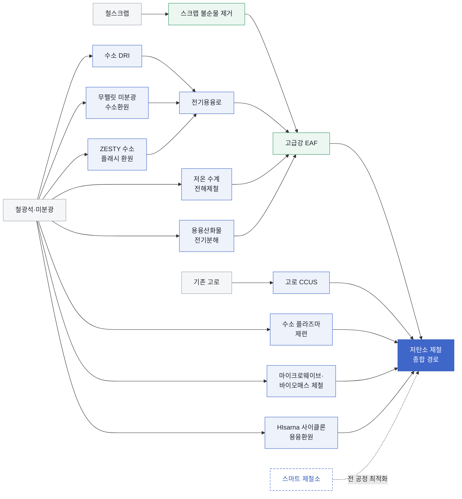

<!-- AUTO-GENERATED BY steel-intelligence. DO NOT EDIT. -->

# 철강 기술 인텔리전스

## 현황

!!! info "현재 감시 범위"

    **12개 기업** · **13개 기술** · **314개 Source** · **1184개 Claim**

    [[REVIEW|사람 검토 대기]] **0건** · 근거가 연결된 주체 **70개**

## 기술 포트폴리오 지도

기술 간 관계를 나타낸 지도이며, 화살표는 확정된 공정 순서나 기술 우열을 뜻하지 않습니다.

> **색상 범례 (AI 의미 그룹):** 중립 회색=원료·기준 공정 · 옅은 코발트=전환 기술 · 옅은 녹색=자원 순환 경로 · 점선 코발트=전 공정 지원 · 진한 코발트=종합 경로

## 기술별 기업 현황

기술을 행, 기업을 열로 비교합니다. **단계명**을 선택하면 해당 기업의 근거 상세로 이동합니다.

| 기술 | [[companies/COM-POSCO|POSCO]] | [[companies/COM-ArcelorMittal|ArcelorMittal]] | [[companies/COM-China-Baowu|China Baowu Steel Group]] | [[companies/COM-Nippon-Steel|Nippon Steel]] | [[companies/COM-JFE-Steel|JFE Steel]] | [[companies/COM-Tata-Steel|Tata Steel]] | [[companies/COM-thyssenkrupp-Steel|thyssenkrupp Steel]] | [[companies/COM-SSAB|SSAB]] | [[companies/COM-Nucor|Nucor]] | [[companies/COM-voestalpine|voestalpine]] | [[companies/COM-Rio-Tinto|Rio Tinto]] | [[companies/COM-Boston-Metal|Boston Metal]] |
|---|---:|---:|---:|---:|---:|---:|---:|---:|---:|---:|---:|---:|
| [[technologies/TEC-hydrogen-direct-reduced-iron|수소 직접환원철 (Hydrogen DRI)]] |  | [[companies/COM-ArcelorMittal|일부 프로젝트 중단]] | [[companies/COM-China-Baowu|가동·적용]] | [[companies/COM-Nippon-Steel|실증]] | [[companies/COM-JFE-Steel|계획·투자]] | [[companies/COM-Tata-Steel|조건부 계획]] | [[companies/COM-thyssenkrupp-Steel|건설·수소전환 조건]] | [[companies/COM-SSAB|실증]] |  |  |  |  |
| [[technologies/TEC-electric-smelting-furnace|전기용융로 (Electric Smelting Furnace)]] | [[companies/COM-POSCO|파일럿]] |  | [[companies/COM-China-Baowu|소규모 시험]] |  |  |  | [[companies/COM-thyssenkrupp-Steel|건설·구축]] |  |  |  | [[companies/COM-Rio-Tinto|계획·투자]] |  |
| [[technologies/TEC-molten-oxide-electrolysis|용융산화물 전기분해 (Molten Oxide Electrolysis)]] | [[companies/COM-POSCO|외부 연구 지원]] | [[companies/COM-ArcelorMittal|외부 전략투자]] |  |  |  |  |  |  |  |  |  | [[companies/COM-Boston-Metal|가동·적용]] |
| [[technologies/TEC-blast-furnace-ccus|고로 CCUS]] |  | [[companies/COM-ArcelorMittal|실증]] |  | [[companies/COM-Nippon-Steel|실증]] | [[companies/COM-JFE-Steel|연구]] | [[companies/COM-Tata-Steel|가동·적용]] | [[companies/COM-thyssenkrupp-Steel|실증]] |  |  |  |  |  |
| [[technologies/TEC-low-carbon-ironmaking|저탄소 제철 종합 경로 (Low-carbon Ironmaking)]] | [[companies/COM-POSCO|경로·프로젝트 확인]] | [[companies/COM-ArcelorMittal|경로·프로젝트 확인]] | [[companies/COM-China-Baowu|경로·프로젝트 확인]] | [[companies/COM-Nippon-Steel|경로·프로젝트 확인]] | [[companies/COM-JFE-Steel|경로·프로젝트 확인]] | [[companies/COM-Tata-Steel|경로·프로젝트 확인]] | [[companies/COM-thyssenkrupp-Steel|경로·프로젝트 확인]] | [[companies/COM-SSAB|경로·프로젝트 확인]] | [[companies/COM-Nucor|경로·프로젝트 확인]] |  |  |  |
| [[technologies/TEC-smart-steelworks|스마트 제철소 (Smart Steelworks)]] | [[companies/COM-POSCO|가동·적용]] | [[companies/COM-ArcelorMittal|단계 미상]] |  | [[companies/COM-Nippon-Steel|연구]] | [[companies/COM-JFE-Steel|가동·적용]] | [[companies/COM-Tata-Steel|가동·적용]] |  |  |  |  |  |  |
| [[technologies/TEC-low-temperature-aqueous-iron-electrolysis|저온 수계 전해제철 (Aqueous Iron Electrolysis)]] | [[companies/COM-POSCO|연구]] | [[companies/COM-ArcelorMittal|연구]] |  |  |  |  |  |  |  |  |  |  |
| [[technologies/TEC-high-grade-eaf-and-scrap-impurity-removal|고급강 EAF·스크랩 불순물 제거]] | [[companies/COM-POSCO|EAF 가동·고급강 개발]] |  |  | [[companies/COM-Nippon-Steel|상용]] | [[companies/COM-JFE-Steel|계획·투자]] |  |  |  |  |  |  |  |
| [[technologies/TEC-hydrogen-based-fine-ore-reduction|무펠릿 미분광 수소환원 (Fluidized-bed Hydrogen Reduction)]] | [[companies/COM-POSCO|건설·구축]] |  |  |  |  |  |  |  |  | [[companies/COM-voestalpine|건설·구축]] | [[companies/COM-Rio-Tinto|실증]] |  |
| [[technologies/TEC-hydrogen-plasma-smelting-reduction|수소 플라즈마 용융환원 (HPSR)]] |  |  |  |  |  |  |  |  |  | [[companies/COM-voestalpine|파일럿]] |  |  |
| [[technologies/TEC-microwave-biomass-ironmaking|마이크로웨이브·바이오매스 환원제철 (BioIron)]] |  |  |  |  |  |  |  |  |  |  | [[companies/COM-Rio-Tinto|일부 프로젝트 중단]] |  |
| [[technologies/TEC-zesty-hydrogen-flash-reduction|ZESTY 수소 직접 플래시 환원]] |  |  |  |  |  |  |  |  |  |  |  |  |
| [[technologies/TEC-hisarna-cyclone-smelting-reduction|HIsarna 사이클론 용융환원]] |  |  |  |  |  |  |  |  |  |  |  |  |

> **단계 흐름:** 연구 → 소규모 시험·파일럿 → 실증 → 건설·구축 → 준공·시운전 → 가동·적용 → 상용
>
> **표 읽는 법:** 단계는 현재 저장소에 직접 연결된 Claim의 공개 표현을 보수적으로 분류한 것입니다. `계획·투자`, `조건부 계획`, `일부 프로젝트 중단`, `외부 전략투자`, `외부 연구 지원`은 성숙도 단계가 아닌 별도 실행 신호이며, `단계 미상`은 근거는 있으나 공개 정보만으로 단계를 구분하기 어렵다는 뜻입니다. 빈 칸은 현재 화면에 표시할 직접 근거가 없다는 뜻입니다.
>
> `저탄소 제철 종합 경로`는 단일 기술이 아니므로 기업 간 성숙도를 비교하지 않고 `경로·프로젝트 확인`으로만 표시합니다. 각 회사의 실제 설비·프로젝트 단계는 개별 기술 행과 연결된 상세 근거에서 확인합니다.

## 현재 관심사

- 기술 센싱
- 경쟁사 프로젝트
- POSCO-경쟁사 비교
- 리스크 감시

## 감시 대상

- **기업:** POSCO, ArcelorMittal, China Baowu Steel Group, Nippon Steel, JFE Steel, Tata Steel, thyssenkrupp Steel, SSAB, Nucor, voestalpine, Rio Tinto, Calix Ltd
- **기술:** hydrogen direct reduced iron, electric smelting furnace, molten oxide electrolysis, blast furnace CCUS, low-carbon ironmaking, smart steelworks, low-temperature aqueous iron electrolysis, high-grade EAF and scrap impurity removal, hydrogen-based fine-ore reduction, hydrogen plasma smelting reduction, microwave biomass ironmaking, zesty hydrogen flash reduction, hisarna cyclone smelting reduction
- **프로젝트:** Calix ZESTY Kwinana Green Iron Demonstration Plant, Tata Steel HIsarna Jamshedpur Demonstration Plant, HYBRIT Gällivare Industrial Demonstration Plant, Stegra Boden Green Steel Plant, EU H2PlasmaRed, Metso Pori DRI Smelting Furnace Pilot, EU PURESCRAP, ArcelorMittal Gent MHI Carbon Capture and D-CRBN Pilot
- **국가:** None

## 회사

- [[companies/COM-ArcelorMittal|ArcelorMittal]]
- [[companies/COM-Boston-Metal|Boston Metal]]
- [[companies/COM-China-Baowu|China Baowu Steel Group]]
- [[companies/COM-JFE-Steel|JFE Steel]]
- [[companies/COM-Nippon-Steel|Nippon Steel]]
- [[companies/COM-Nucor|Nucor]]
- [[companies/COM-POSCO|POSCO]]
- [[companies/COM-Rio-Tinto|Rio Tinto]]
- [[companies/COM-SSAB|SSAB]]
- [[companies/COM-Tata-Steel|Tata Steel]]
- [[companies/COM-thyssenkrupp-Steel|thyssenkrupp Steel]]
- [[companies/COM-voestalpine|voestalpine]]

## 기술

- [[technologies/TEC-blast-furnace-ccus|고로 CCUS]]
- [[technologies/TEC-electric-smelting-furnace|전기용융로 (Electric Smelting Furnace)]]
- [[technologies/TEC-high-grade-eaf-and-scrap-impurity-removal|고급강 EAF·스크랩 불순물 제거]]
- [[technologies/TEC-hisarna-cyclone-smelting-reduction|HIsarna 사이클론 용융환원]]
- [[technologies/TEC-hydrogen-based-fine-ore-reduction|무펠릿 미분광 수소환원 (Fluidized-bed Hydrogen Reduction)]]
- [[technologies/TEC-hydrogen-direct-reduced-iron|수소 직접환원철 (Hydrogen DRI)]]
- [[technologies/TEC-hydrogen-plasma-smelting-reduction|수소 플라즈마 용융환원 (HPSR)]]
- [[technologies/TEC-low-carbon-ironmaking|저탄소 제철 종합 경로 (Low-carbon Ironmaking)]]
- [[technologies/TEC-low-temperature-aqueous-iron-electrolysis|저온 수계 전해제철 (Aqueous Iron Electrolysis)]]
- [[technologies/TEC-microwave-biomass-ironmaking|마이크로웨이브·바이오매스 환원제철 (BioIron)]]
- [[technologies/TEC-molten-oxide-electrolysis|용융산화물 전기분해 (Molten Oxide Electrolysis)]]
- [[technologies/TEC-smart-steelworks|스마트 제철소 (Smart Steelworks)]]
- [[technologies/TEC-zesty-hydrogen-flash-reduction|ZESTY 수소 직접 플래시 환원]]

## 프로젝트

- [[projects/PRJ-ARCELORMITTAL-DUNKIRK-EAF|ArcelorMittal Dunkirk 대형 전기로]]
- [[projects/PRJ-ARCELORMITTAL-GHENT-MHI-CO2-PILOT|ArcelorMittal Gent MHI CO2 포집·전환 파일럿]]
- [[projects/PRJ-ARCELORMITTAL-VOLTERON|ArcelorMittal–John Cockerill Volteron]]
- [[projects/PRJ-BAOWU-ZHANJIANG-H2-SHAFT-EAF|China Baowu Zhanjiang 수소 샤프트로–전기로 라인]]
- [[projects/PRJ-BIOIRON-WA-RD|BioIron 연구개발 시설 (Western Australia)]]
- [[projects/PRJ-BOSTON-METAL-MOE-WOBURN|Boston Metal Woburn MOE 산업 셀]]
- [[projects/PRJ-CARBON2CHEM-DUISBURG|thyssenkrupp Duisburg Carbon2Chem]]
- [[projects/PRJ-ELECTRA-CLEAN-IRON-DEMO|Electra 청정철 시범공장]]
- [[projects/PRJ-H2PLASMARED-EU|EU H2PlasmaRed 통합 실증]]
- [[projects/PRJ-HISARNA-JAMSHEDPUR-DEMO|Tata Steel Jamshedpur HIsarna 약 100만 t/y 실증 계획]]
- [[projects/PRJ-HY4SMELT|HY4Smelt 실증 프로젝트]]
- [[projects/PRJ-HYBRIT-GALLIVARE-DEMO|HYBRIT Gällivare 무화석 스펀지철 산업 실증]]
- [[projects/PRJ-HYBRIT-LULEA-PILOT|HYBRIT 룰레오 수소 DRI 파일럿]]
- [[projects/PRJ-HYFOR-DONAWITZ-PILOT|HYFOR Donawitz 수소환원 파일럿]]
- [[projects/PRJ-JFE-CHIBA-CARBON-RECYCLING-BF|JFE Chiba 150 m³ 탄소순환 시험고로]]
- [[projects/PRJ-JFE-CHIBA-NO4-EAF|JFE 치바 제4제강 전기로]]
- [[projects/PRJ-JFE-KURASHIKI-LARGE-EAF|JFE Kurashiki 대형 고효율 전기로]]
- [[projects/PRJ-JFE-SINTER-CPS-ROLLOUT|JFE 일본 7개 소결설비 CPS 전개]]
- [[projects/PRJ-LIGHTBOW-HPSR-CONTROL|LIGHTBOW HPSR 아크 제어 연구]]
- [[projects/PRJ-METSO-PORI-DRI-SMELTING-PILOT|Metso Pori DRI 용융 파일럿]]
- [[projects/PRJ-MOLTEN-SULFIDE-ELECTROLYSIS|용융 황화물 전해 프로젝트]]
- [[projects/PRJ-NEOSMELT-KWINANA|NeoSmelt Kwinana DRI–ESF 파일럿]]
- [[projects/PRJ-NIPPON-HASAKI-H2-DRI|Nippon Steel Hasaki 수소 DRI 시험로]]
- [[projects/PRJ-NIPPON-JAPAN-EAF-CONVERSION|Nippon Steel 일본 3개 거점 전기로 전환]]
- [[projects/PRJ-NIPPON-KIMITSU-COURSE50|Nippon Steel Kimitsu COURSE50 실증]]
- [[projects/PRJ-NIPPON-USS-BIG-RIVER-DRI|Nippon Steel·U. S. Steel Big River DRI]]
- [[projects/PRJ-NUCOR-CONVENT-DRI-CCS|Nucor Convent DRI–CCS]]
- [[projects/PRJ-NUCOR-GALLATIN-EAF-CCUS|Nucor Gallatin EAF 탄소포집 파일럿]]
- [[projects/PRJ-NUCOR-WEST-VIRGINIA-SHEET-MILL|Nucor West Virginia 첨단 판재 공장]]
- [[projects/PRJ-POSCO-GWANGYANG-EAF|POSCO 광양 250만 톤 전기로]]
- [[projects/PRJ-POSCO-GWANGYANG-ONE-TOUCH-CONVERTER|POSCO 광양 2전로 원터치 자동화]]
- [[projects/PRJ-POSCO-HYREX-DEMO|POSCO 포항 HyREX 통합 실증]]
- [[projects/PRJ-POSCO-HYREX-POHANG-DEMO|PRJ-POSCO-HYREX-POHANG-DEMO]]
- [[projects/PRJ-PURESCRAP-EU-SCRAP-PURITY|EU PURESCRAP 스크랩 순도 검증]]
- [[projects/PRJ-SORTERA-SCRAP-DECOPPER|Sortera 스크랩 구리 제거 프로젝트]]
- [[projects/PRJ-SSAB-LULEA-ELECTRIC-MILL|SSAB Luleå 신규 전기제철소]]
- [[projects/PRJ-STEELANOL-GHENT|ArcelorMittal Ghent Steelanol]]
- [[projects/PRJ-STEGRA-BODEN|Stegra Boden 통합 그린스틸 프로젝트]]
- [[projects/PRJ-SUSTEEL-DONAWITZ|voestalpine Donawitz SuSteel·SuS-F]]
- [[projects/PRJ-TATA-IJMUIDEN-DRP-EAF|Tata Steel IJmuiden DRP–EAF 전환]]
- [[projects/PRJ-TATA-JAMSHEDPUR-BF-CCU|Tata Jamshedpur 고로가스 CCU]]
- [[projects/PRJ-TATA-JAMSHEDPUR-EASYMELT|Tata Jamshedpur EASyMelt 산업 실증]]
- [[projects/PRJ-TK-H2STEEL-DUISBURG|thyssenkrupp Duisburg tkH2Steel]]
- [[projects/PRJ-ULCOS-TGR-BF|ULCOS 상부가스 재순환 고로]]
- [[projects/PRJ-ZESTY-ROCKINGHAM-DEMO|Calix ZESTY Rockingham 3만 t/y 실증 계획]]

## 기타 항목

- None

## 최근 변경

- 2030-12-31 · PRJ-POSCO-GWANGYANG-EAF · `target_product_date` · created
- 2029-12-31 · PRJ-SSAB-LULEA-ELECTRIC-MILL · `target_start_date` · created
- 2027-12-31 · PRJ-TK-H2STEEL-DUISBURG · `target_commissioning_date` · created
- 2027-12-31 · PRJ-TK-H2STEEL-DUISBURG · `hydrogen_network_date` · created
- 2026-12-31 · PRJ-BIOIRON-WA-RD · `original_commissioning_target` · created
- 2026-07-28 · TEC-smart-steelworks · `reheating_furnace_model_deployment` · verified
- 2026-07-28 · TEC-smart-steelworks · `jfe_bf_guidance_result` · status_changed
- 2026-07-28 · TEC-smart-steelworks · `jfe_bf_guidance_result` · review_supersede
- 2026-07-28 · TEC-smart-steelworks · `jfe_bf_guidance_result` · created
- 2026-07-28 · TEC-smart-steelworks · `jfe_bf_guidance_result` · created

## 출처

- [[sources/SRC-20260725-013F0FA1|HyREX Hydrogen Reduction Ironmaking]]
- [[sources/SRC-20260725-017C8BAE|NIST SP 800-82 Rev. 3 Guide to Operational Technology Security]]
- [[sources/SRC-20260725-043634EA|A Review on Prevention of Sticking during Fluidized Bed Reduction of Fine Iron Ore]]
- [[sources/SRC-20260725-054778AA|JFE Steel carbon-neutral strategy — carbon-recycling blast furnace]]
- [[sources/SRC-20260725-0A7903EA|Nippon Steel decides Kimitsu No. 2 BF hydrogen-reduction demonstration]]
- [[sources/SRC-20260725-0CC8B82B|Tata Steel first-in-world digital twin in sinter making]]
- [[sources/SRC-20260725-11668643|Nucor Convent DRI carbon capture and storage agreement]]
- [[sources/SRC-20260725-133D1C12|ROSIE Project Descriptions: Electra Low-Temperature Green Ironmaking]]
- [[sources/SRC-20260725-147875E9|A new anode material for oxygen evolution in molten oxide electrolysis]]
- [[sources/SRC-20260725-1486633E|Production of Fe metal from Fe ores through novel molten oxide electrolysis at 1173 K]]
- [[sources/SRC-20260725-1A31BE76|Breakthrough technology development and CCUS for carbon-neutral steelmaking]]
- [[sources/SRC-20260725-1A6AFBF8|Electrolysis of Molten Iron Oxide with an Iridium Anode: The Role of Electrolyte Basicity]]
- [[sources/SRC-20260725-1AD87D2B|Economics of Electrowinning Iron from Ore for Green Steel Production]]
- [[sources/SRC-20260725-1F1EA152|Strategic Selection of a Pre-Reduction Reactor for Increased Hydrogen Utilization in Hydrogen Plasma Smelting Reduction]]
- [[sources/SRC-20260725-238E8691|Emissions Measurement and Data Collection for a Net Zero Steel Industry]]
- [[sources/SRC-20260725-26EA1CBD|MOE Steel: process, scale-up model, and current deployment status]]
- [[sources/SRC-20260725-280A7FAC|Nippon Steel GX briefing: Hasaki hydrogen DRI test furnace]]
- [[sources/SRC-20260725-285480DE|POSCO One-Touch Converter Operation Automation Technology]]
- [[sources/SRC-20260725-28E5A30F|POSCO AI blast furnace and smart steelworks baseline]]
- [[sources/SRC-20260725-29802D50|Tata Steel proceeds with phased EASyMelt industrial demonstration]]
- [[sources/SRC-20260725-2B01239E|Iron and Steel Technology Roadmap]]
- [[sources/SRC-20260725-2EABD949|Iron and Steel CCS Study — Techno-Economics Integrated Steel Mill]]
- [[sources/SRC-20260725-2FA1B498|Project SuSteel: Sustainable steel production utilising hydrogen]]
- [[sources/SRC-20260725-30A4249E|Digital Twins for Advanced Manufacturing]]
- [[sources/SRC-20260725-31601585|SSAB begins construction of new Luleå electric steel mill]]
- [[sources/SRC-20260725-31725163|Application of Electric Smelting Furnace to Ironmaking]]
- [[sources/SRC-20260725-3176F88E|Tata Steel FY2023-24 Jamshedpur CCU operating update]]
- [[sources/SRC-20260725-32EA9484|Decarbonising the steel value chain 2024]]
- [[sources/SRC-20260725-34D63EEA|SUS-F Sustainable Steelmaking Follow Up]]
- [[sources/SRC-20260725-34FFE3B8|DOE selects steel scrap copper-removal and molten sulfide electrolysis projects]]
- [[sources/SRC-20260725-38165ABC|Iron and Steel Technology Roadmap]]
- [[sources/SRC-20260725-38762376|JFE Steel to introduce advanced large-scale EAF at Kurashiki]]
- [[sources/SRC-20260725-395D8A82|ArcelorMittal cannot proceed with Bremen and Eisenhüttenstadt DRI-EAF plans]]
- [[sources/SRC-20260725-3B0845FF|ArcelorMittal confirms intention to invest EUR 1.2 billion in Dunkirk]]
- [[sources/SRC-20260725-3C2197EF|Boston Metal Celebrates Historic Commissioning Run of MOE Green Steel Cell]]
- [[sources/SRC-20260725-3D62F9A6|Electra Launches Pilot Plant to Advance Commercialization of Sustainable Clean Iron Production]]
- [[sources/SRC-20260725-3DA8B9C7|Sortera Technologies AI sensor sorting platform]]
- [[sources/SRC-20260725-3FF9886C|China Baowu and Rio Tinto complete hydrogen DRI and electric-smelting trials]]
- [[sources/SRC-20260725-41586A75|JFE Steel deploys CPS technology across sintering facilities]]
- [[sources/SRC-20260725-4333339B|In Situ Observation of Sustainable Hematite-Magnetite-Wustite-Iron Hydrogen Plasma Reduction]]
- [[sources/SRC-20260725-4366E5B1|Finding the Most Efficient Way to Remove Residual Copper from Steel Scrap]]
- [[sources/SRC-20260725-45A1D063|Nippon Steel research and development for carbon-neutral steelmaking]]
- [[sources/SRC-20260725-45CF187D|Impact of Hydrogen DRI on EAF Steelmaking]]
- [[sources/SRC-20260725-46A2055D|Tata Steel commissions carbon capture plant for blast furnace gas at Jamshedpur]]
- [[sources/SRC-20260725-46C2DBC8|Nippon Steel Kimitsu COURSE50 large-BF preparation status]]
- [[sources/SRC-20260725-4C014458|POSCO and Electra partner on low-temperature clean iron]]
- [[sources/SRC-20260725-4C776B11|Rio Tinto BioIron proves successful for low-carbon iron-making]]
- [[sources/SRC-20260725-4E9EE842|Low-carbon technologies for the global steel transformation: Molten oxide electrolysis]]
- [[sources/SRC-20260725-61382798|ArcelorMittal confirms €1.3bn Dunkirk EAF construction]]
- [[sources/SRC-20260725-624E124C|ArcelorMittal announces first industrial production of ethanol at Steelanol]]
- [[sources/SRC-20260725-67CAA465|BlueScope, BHP and Rio Tinto select WA for Australia’s largest ironmaking electric smelting furnace]]
- [[sources/SRC-20260725-6B30EDDE|Tata Steel and SMS group plan EASyMelt industrial demonstration]]
- [[sources/SRC-20260725-6C80084B|Tata Steel climate action technology roadmap]]
- [[sources/SRC-20260725-6D04090A|DOE Round 5 selection: UK IDEA dual-loop capture at Nucor Steel Gallatin]]
- [[sources/SRC-20260725-6EC0DF4D|Pathways to decarbonisation: the electric smelting furnace]]
- [[sources/SRC-20260725-6F7C35D8|Circored Fine Ore Direct Reduction]]
- [[sources/SRC-20260725-75A329BD|HYBRIT six-year pilot research results]]
- [[sources/SRC-20260725-789AB58F|Tata Steel Nederland integrated decarbonisation project letter of intent]]
- [[sources/SRC-20260725-79D4B2ED|Energy Technology Perspectives 2026 executive summary]]
- [[sources/SRC-20260725-7D498404|China Baowu green development report: Zhanjiang hydrogen shaft furnace]]
- [[sources/SRC-20260725-7DDD98E7|Image-Segmentation-Guided Fragmentized Steel Scrap Tramp Material Characterization]]
- [[sources/SRC-20260725-7E6DFD33|JFE technical report on carbon-recycling blast furnace]]
- [[sources/SRC-20260725-7E8ABC86|China launches first million-tonne near-zero-carbon steel line at Baowu]]
- [[sources/SRC-20260725-84498FDF|Rio Tinto climate reporting: 2025 progress and 2026 action]]
- [[sources/SRC-20260725-8A93E42F|Value chain GHG emission reductions — DRI-ESF programme update]]
- [[sources/SRC-20260725-8BA7A1B3|Conceptual Architecture of Digital Twins with Human-in-the-Loop Based Smart Manufacturing]]
- [[sources/SRC-20260725-8D0BD4B8|thyssenkrupp Steel direct-reduction transformation project status]]
- [[sources/SRC-20260725-973F138F|LIGHTBOW: Model-based control in metallurgical arc-plasma processes]]
- [[sources/SRC-20260725-99B78C86|Sticking in Shaft Furnace and Fluidized Bed Ironmaking Processes: A Comprehensive Review Focusing on the Effect of Coating Materials]]
- [[sources/SRC-20260725-9A98E2AF|European Commission approves German aid for thyssenkrupp Steel Duisburg transition]]
- [[sources/SRC-20260725-9B4DDCDD|The Decarbonisation Progress Levels]]
- [[sources/SRC-20260725-9D378E7F|ArcelorMittal invests $36 million in Boston Metal]]
- [[sources/SRC-20260725-9DCCDB31|Nippon Steel Carbon Neutral Vision 2050]]
- [[sources/SRC-20260725-9FBEF9C2|Nitrogen Control in Electric Arc Furnace Steelmaking by DRI (TRP 0009)]]
- [[sources/SRC-20260725-A0AC41D7|Project SuS-F: SuSteel follow-up]]
- [[sources/SRC-20260725-A23B5A64|HYFOR: Hydrogen-Based Fine-Ore Reduction]]
- [[sources/SRC-20260725-A6716ADB|ArcelorMittal and John Cockerill develop Volteron low-temperature electrolysis]]
- [[sources/SRC-20260725-A6759186|POSCO HyREX electric smelting furnace pilot status]]
- [[sources/SRC-20260725-A8C28387|ULCOS New Blast Furnace Process]]
- [[sources/SRC-20260725-AA686449|Nucor sustainability and EAF steelmaking profile]]
- [[sources/SRC-20260725-AEE7865A|Introduction to BioIron - Investor Seminar 2023]]
- [[sources/SRC-20260725-AFA5C853|Hydrogen Uses in Ironmaking]]
- [[sources/SRC-20260725-B6FB82E5|ArcelorMittal inaugurates Steelanol CCU project at Ghent]]
- [[sources/SRC-20260725-B859CA04|POSCO completes Gwangyang EAF and advances HyREX]]
- [[sources/SRC-20260725-BAB49577|Primetals Technologies and POSCO Sign Cooperation Agreement for HyREX Direct Reduction Plant]]
- [[sources/SRC-20260725-BBCC117E|Al Reyadah commercial steel-sector CCUS facility]]
- [[sources/SRC-20260725-BC8DE092|HYFOR Pilot Plant Under Operation]]
- [[sources/SRC-20260725-BD336973|Demand and Supply Measures for the Steel and Cement Transition]]
- [[sources/SRC-20260725-BF5036AE|ExxonMobil and Nucor carbon capture agreement for Convent DRI plant]]
- [[sources/SRC-20260725-C37A3042|Industry giants collaborating to seek to decarbonise steel]]
- [[sources/SRC-20260725-C4A8EDA3|Swedish Energy Agency review of HYBRIT pilot phase]]
- [[sources/SRC-20260725-C79793B1|Suppression of Surface Hot Shortness due to Cu in Recycled Steels]]
- [[sources/SRC-20260725-C888600A|Tenova for POSCO Gwangyang plant]]
- [[sources/SRC-20260725-C925BF86|Rio Tinto pauses BioIron pilot construction]]
- [[sources/SRC-20260725-C9D824F2|Metso opens DRI Smelting Furnace pilot facility in Pori, Finland]]
- [[sources/SRC-20260725-CD029AB1|Carbon2Chem development phases and industrial application validation]]
- [[sources/SRC-20260725-CEDC4521|Carbon-free Iron for a Sustainable Future: Boston Metal IEDO Peer Review]]
- [[sources/SRC-20260725-D230993B|MIDREX H2 current process configuration]]
- [[sources/SRC-20260725-D37C44F7|Integrating Metallurgical Mechanisms and Explainable Deep Learning Methods to Predict Phosphorus Content in Electric Arc Furnace Steelmaking for Enhanced Efficiency]]
- [[sources/SRC-20260725-D3C50354|DOE NEPA review for Iron Production by Molten Sulfide Electrolysis]]
- [[sources/SRC-20260725-D6930918|Electra Technology: How the low-temperature iron process works]]
- [[sources/SRC-20260725-D965F782|US11959153B2 Production of iron]]
- [[sources/SRC-20260725-DAAEEC2B|Nippon Steel develops high-grade steel production in large EAFs]]
- [[sources/SRC-20260725-DB8169D9|Impact of Iron Ore Pre-Reduction Degree on the Hydrogen Plasma Smelting Reduction Process]]
- [[sources/SRC-20260725-DED07902|METI Green Steel for GX: Kurashiki EAF]]
- [[sources/SRC-20260725-E316D68F|Construction begins on HYFOR and Smelter demonstration plant]]
- [[sources/SRC-20260725-E3271B0A|Nippon Steel starts Yawata large-EAF conversion construction]]
- [[sources/SRC-20260725-E493B07B|ULCOS top gas recycling blast furnace process — final report]]
- [[sources/SRC-20260725-E5BC335B|Nippon Steel investment decision for three-site EAF conversion]]
- [[sources/SRC-20260725-E5CFE77A|BioIron Pilot Plant Works Approval W6964/2024/1 Decision Report]]
- [[sources/SRC-20260725-E71081D1|Tata Steel Nederland 2025-2026 Green Steel Project status]]
- [[sources/SRC-20260725-EC77A362|JFE Steel 2025 priorities for carbon-neutral technologies]]
- [[sources/SRC-20260725-EE8A09EF|The Optical Spectra of Hydrogen Plasma Smelting Reduction of Iron Ore: Application and Requirements]]
- [[sources/SRC-20260725-F13F33CD|Properties evaluation of DRI smelting slag for molten iron production: viscosity and sulfide capacity]]
- [[sources/SRC-20260725-F1D3EDEA|Rio Tinto develops BioIron R&D facility in Western Australia]]
- [[sources/SRC-20260725-F2F9BB6E|Application of SuSteel technology and operation of the SuSteel pilot plant in Donawitz]]
- [[sources/SRC-20260725-F396D188|Nippon Steel FY2025 results: carbon-neutral technology progress]]
- [[sources/SRC-20260725-FAB12DBF|SSAB postpones Luleå mill commissioning to end-2029]]
- [[sources/SRC-20260725-FBE26310|ArcelorMittal Volteron research and scale-up status]]
- [[sources/SRC-20260725-FBF8EA9E|NeoSmelt pilot project — Legislative Council answer]]
- [[sources/SRC-20260725-FE22DEFE|voestalpine researches hydrogen plasma steelmaking in SuSteel]]
- [[sources/SRC-20260725-FE353D3A|Nucor and University of Kentucky carbon-capture pilot at Gallatin]]
- [[sources/SRC-20260725-FED4B2D7|Carbon2Chem technical center in Duisburg]]
- [[sources/SRC-20260725-FF076FE4|POSCO decarbonization strategies from CCUS to HyREX]]
- [[sources/SRC-20260726-10602BC9|Chemical and electrochemical pathways to low-carbon iron and steel]]
- [[sources/SRC-20260726-3F53AC8C|Low temperature electrolysis for iron production via conductive colloidal electrode]]
- [[sources/SRC-20260726-443630DE|Conceptualizing Hydrogen Plasma Reduction for Industrial-Scale Prereduced Iron Ore Smelting: A Scenario-Based Approach]]
- [[sources/SRC-20260726-6AADACF1|Routes to reducing emissions from steel production]]
- [[sources/SRC-20260726-6CC774DD|Electric Smelting Furnace-Based Flowsheets]]
- [[sources/SRC-20260726-7A19874F|Rio Tinto Steel Decarbonisation and Biomass Ironmaking]]
- [[sources/SRC-20260726-7BCEED6F|ΣIDERWIN—A New Route for Iron Production]]
- [[sources/SRC-20260726-9F56DB69|Volteron — Scalable Electrochemical Ironmaking for Green Steel Production]]
- [[sources/SRC-20260726-B392BD57|Profitable Decarbonization of the Blast Furnace Through Electrified Top-Gas Recycling]]
- [[sources/SRC-20260726-B9ACCB8F|Low-Temperature Electrowinning of Iron from Mixed Hematite-Magnetite Alkaline Suspensions]]
- [[sources/SRC-20260726-CEDF7736|Tomorrow’s Steel Mill, Today: Ternium Pesquería Leads Sustainable Innovation]]
- [[sources/SRC-20260726-DEF03677|Evolving Scrapyard: Integrating New Solutions for Advanced Scrap Management]]
- [[sources/SRC-20260726-E01E47B8|Smelter — Green Steelmaking Using Low-Grade DRI]]
- [[sources/SRC-20260726-EADB3777|Reduction Behaviour of Iron Ores by H2 at Multi-Stage Reduction]]
- [[sources/SRC-20260727-112971A7|LKAB granted environmental permit for operations in Gallivare]]
- [[sources/SRC-20260727-275A6495|MHI and D-CRBN connect steelmaking CO2 capture and plasma conversion units]]
- [[sources/SRC-20260727-3D412017|Low Temperature Direct Electrochemical Reduction for Zero Emissions Iron Project - Core Research Final Report]]
- [[sources/SRC-20260727-44DC8B30|Electra Unveils Demonstration Facility along with Advanced Purchase Commitments for Clean Iron and Environmental Attributes]]
- [[sources/SRC-20260727-481A04FD|US6585798B2 — Fluidized bed reactor for preventing the fine iron ore from sticking therein and method thereof]]
- [[sources/SRC-20260727-48351ABD|PURESCRAP — CORDIS project fact sheet 101092168]]
- [[sources/SRC-20260727-56D0B35D|Stegra announces closing of EUR 1.4 billion financing round]]
- [[sources/SRC-20260727-71A7FA21|Low temperature electrolysis of iron ore in an aqueous alkaline solution - Volteron]]
- [[sources/SRC-20260727-7863B18F|Carbon capture pilot begins operation at ArcelorMittal Gent]]
- [[sources/SRC-20260727-786D57D4|Recent HIsarna operational developments at the IJmuiden pilot plant]]
- [[sources/SRC-20260727-7DEFB3CE|PURESCRAP project status and sensor-station installation]]
- [[sources/SRC-20260727-824DD247|New Insights Into Hydrogen Reduction of Hematite in an Indirectly Heated Flash Reactor from Measurements and First-Order Modeling]]
- [[sources/SRC-20260727-91F88878|LKAB Interim Report First Quarter 2026]]
- [[sources/SRC-20260727-96F6D922|ArcelorMittal and LanzaTech announce first Steelanol barge shipment]]
- [[sources/SRC-20260727-9BC68665|Advancing hydrogen plasma smelting reduction: Experimental insights from a pilot plant]]
- [[sources/SRC-20260727-9F7FF95C|DRI Smelting Furnace - pilot and commercial design details]]
- [[sources/SRC-20260727-A33857DE|Crucial Environmental Permit Application Announced - Important Milestone for LKAB Development]]
- [[sources/SRC-20260727-A39F1D70|POSCO Climate Change - HyREX demonstration plan and current schedule]]
- [[sources/SRC-20260727-AAE02C9E|Tata Steel Annual Report 2011-12 — Principle 2: Sustainable Products and Processes]]
- [[sources/SRC-20260727-C280FAED|Off-Gas System Scale-Up of HIsarna Iron-Making Process: A CFD-Based Approach]]
- [[sources/SRC-20260727-C43117BC|Calix - ZESTY Green Iron Demonstration Plant]]
- [[sources/SRC-20260727-F628E684|Hydrogen Plasma Reduction for Steelmaking and Circular Economy - H2PlasmaRed periodic report]]
- [[sources/SRC-20260727-FD3EBA92|Tata Steel Board affirms the long-term strategy for growth in India]]
- [[sources/SRC-20260728-00A0FA40|Rio Tinto scraps $215m research centre and BioIron product after decade of development]]
- [[sources/SRC-20260728-01342E8C|Boston Metal Raises $75 Million to Scale Critical Metals Business]]
- [[sources/SRC-20260728-02AD30CD|Thermodynamic-kinetic modeling of hematite reduction in a laboratory-scale hydrogen plasma smelting reduction furnace]]
- [[sources/SRC-20260728-0356ABDC|Infrastruktur- och bostadsminister Andreas Carlson inviger järnvägen till Boden Industrial Park]]
- [[sources/SRC-20260728-0356E66A|Electra hosts Toyota Tsusho at demonstration facility to show Clean Iron technology in action]]
- [[sources/SRC-20260728-05FA3DD1|Validation of slag freeze lining thickness model for online monitoring purposes in pyrometallurgical furnaces]]
- [[sources/SRC-20260728-06DEF489|Hydrogen based ultra fine ore reduction combined with a continuous powered electric smelting furnace for liquid iron production (HYFOR / HY4SMELT)]]
- [[sources/SRC-20260728-0CB6166D|Achieving Sustainable Green Steel - HYFOR flowsheet]]
- [[sources/SRC-20260728-10B44FBE|Application of Electric Smelting Furnace to Ironmaking]]
- [[sources/SRC-20260728-11747E83|ZEROSTEEL CORDIS Results page and listed COM 2026 proceeding]]
- [[sources/SRC-20260728-13A7A69D|Forging the Future of Iron: Energy, Economics, and Emissions]]
- [[sources/SRC-20260728-1444F21D|Noetra Launches Full-Scale R&D for Japan-Developed Multimodal Foundation Model]]
- [[sources/SRC-20260728-15D8C4A6|Nippon Steel confirms Big River DRI investment]]
- [[sources/SRC-20260728-188FD401|Experimental Study on Multistage Hydrogen Reduction of Iron Ore by Fluidized Bed Reactor]]
- [[sources/SRC-20260728-18CEA56E|MIDREX H2: Ultimate Low CO2 Ironmaking and its place in the new Hydrogen Economy]]
- [[sources/SRC-20260728-18D65A80|Commissioning Underway at New Nucor Mill]]
- [[sources/SRC-20260728-19397FAD|Advancing Climate Solutions 2026 - Nucor Convent CCS status]]
- [[sources/SRC-20260728-19665AC7|Non-isothermal Hydrogen Reduction and Kinetic Behavior of Iron Ore Pellets Under Simulated Shaft Furnace Conditions]]
- [[sources/SRC-20260728-1AB6BC47|Policy Engagement - Carbon-Recycling Blast Furnaces]]
- [[sources/SRC-20260728-1BE1EDAF|Electra Secures $30M in New Capital to Accelerate Commercial Production]]
- [[sources/SRC-20260728-1BF41B90|HY4SMELT AUF DEM WEG ZUR UMSETZUNG]]
- [[sources/SRC-20260728-1BFBFBDF|Integrated Report & Annual Accounts 2025-26 (119th Year): HIsarna Jamshedpur status]]
- [[sources/SRC-20260728-1E16B6C3|Steel Sheet Products: American-Made EAF Steel]]
- [[sources/SRC-20260728-1F248414|Rio Tinto Annual Report on Form 20-F 2025: BioIron pilot pause]]
- [[sources/SRC-20260728-203CCD00|Healey-Driscoll Administration Awards $4.45 Million to Expand Advanced Manufacturing, Create Jobs Across Massachusetts]]
- [[sources/SRC-20260728-233C5C7D|Midrex selected for Big River DRI plant]]
- [[sources/SRC-20260728-253AB0A9|Stegra announces closing of EUR 1.4 billion financing round]]
- [[sources/SRC-20260728-2B2AEFFD|Electrical and Spectroscopic Diagnostics as Real-Time Metallization Indicators During Hydrogen Plasma Smelting Reduction]]
- [[sources/SRC-20260728-2B829977|Hydrogen Plasma Smelting Reduction Technology: One Example of Clean Steel Partnership Success Stories]]
- [[sources/SRC-20260728-2BB4FEA7|SSAB Report for Q2 2026 - Lulea project schedule update]]
- [[sources/SRC-20260728-2C8BD70B|Geluidshinder door testen bij Steelanol]]
- [[sources/SRC-20260728-3049F33D|Rapport: Utvidga transmissionsnätet i norra Norrbottens län]]
- [[sources/SRC-20260728-351FFC36|Green steel smelting production successfully piloted in Metso Research Center]]
- [[sources/SRC-20260728-3BAB455E|Control Guidance Technology for Blast Furnace Hot Metal Temperature]]
- [[sources/SRC-20260728-3C88A721|After cyanide alarm, SSAB resumes steel mill construction]]
- [[sources/SRC-20260728-3D63EF37|Production of Iron from Iron Oxide Powder by Suspension Electrolysis in Alkaline Electrolyte]]
- [[sources/SRC-20260728-3DA8271F|Tata Steel Partners with Google Cloud To Deploy a Unified Agentic AI Across its Global Value Chain]]
- [[sources/SRC-20260728-3F39F82D|ArcelorMittal announces strategic collaboration with AWS to drive industrial automation and lower-carbon construction globally]]
- [[sources/SRC-20260728-4039F069|Towards green steel from hydrogen-based direct reduction of low-grade iron ores: Techno-economic and greenhouse gas emissions assessment]]
- [[sources/SRC-20260728-40534940|Production of green steel from low-grade ores: An end-to-end techno-economic assessment]]
- [[sources/SRC-20260728-4075282F|Mechanism of H2 plasma-enabled reduction of hematite thin films]]
- [[sources/SRC-20260728-422A2AB7|MOE Steel current roadmap and critical-metals sequencing]]
- [[sources/SRC-20260728-433E5CF1|Green Steel Technology to Drive India's Sustainable Industrial Transition (Press Release 41/2026)]]
- [[sources/SRC-20260728-44EB4AEB|PURESCRAP Newsletter No. 7]]
- [[sources/SRC-20260728-4A07DD3E|Effect of Heating Rate on the Non-Isothermal Hydrogen Reduction of Hematite Pellets]]
- [[sources/SRC-20260728-4B823CFA|EAFs increasingly able to fill blast furnace gap: Electra]]
- [[sources/SRC-20260728-4C948F2F|Operational thermodynamics and hydrogen embrittlement risk in lined rock cavern–shaft systems: Numerical insights from Sweden’s first LRC hydrogen storage pilot]]
- [[sources/SRC-20260728-4F6EAEA2|SSAB pauses work at construction site in Lulea]]
- [[sources/SRC-20260728-50A784E1|D-CRBN EIC project fact sheet and administrative closure status]]
- [[sources/SRC-20260728-521FD424|Advancing Electric Smelting for Sustainable Iron Production: Pilot-Scale Validation of Controlled Open-Arc DC Technology]]
- [[sources/SRC-20260728-53EDAF62|ArcelorMittal 2025 Form 20-F: Volteron pilot and industrial engineering]]
- [[sources/SRC-20260728-5607C101|ArcelorMittal considers closing Steelanol facility in Ghent]]
- [[sources/SRC-20260728-5DB16A4E|산업부문 온실가스 감축 정책 평가]]
- [[sources/SRC-20260728-5F743371|ZEROSTEEL CORDIS 현행 팩트시트]]
- [[sources/SRC-20260728-600ABF35|Low temperature electrolysis of iron ore in an aqueous alkaline solution - Volteron]]
- [[sources/SRC-20260728-60D60F81|Forging a cleaner future: Advances and business models in electrochemical iron production]]
- [[sources/SRC-20260728-664277C6|A generalized Grain-Scale model for the Non-Plasma and Plasma-Assisted hydrogen direct reduction of iron ore]]
- [[sources/SRC-20260728-698EFDF6|JFE AI scrap automatic inspection enters operation]]
- [[sources/SRC-20260728-6CAF8AD1|Computational Fluid Dynamics Simulation of Iron Ore Reduction in Industrial-Scale Fluidized Beds]]
- [[sources/SRC-20260728-6E02E4F3|Elucidating key reducing species beyond ions in hydrogen plasma smelting reduction of iron ore]]
- [[sources/SRC-20260728-71D36A10|Hydrogen evolution behavior and morphology regulation of electrowinning of iron in acidic sulfate system]]
- [[sources/SRC-20260728-71F1636F|12th Steering Committee Meeting]]
- [[sources/SRC-20260728-735F3BF8|News Clarification (Ref. SEC/2018/2025-26)]]
- [[sources/SRC-20260728-73732712|ZESTY Green Iron Demonstration Project - Kick-off Report]]
- [[sources/SRC-20260728-73FAEBA5|Effect of process parameters on fluidization and agglomeration behavior of iron ore fines]]
- [[sources/SRC-20260728-740711D5|H2PlasmaRed public results and lab-scale deliverables]]
- [[sources/SRC-20260728-75962E74|Energy-system optimization for hydrogen-based green steel production from medium-grade iron ore]]
- [[sources/SRC-20260728-7765BF98|Stegra ramps up in Boden but remains far from full pace]]
- [[sources/SRC-20260728-7C490C85|Hy4Smelt official project page - overall approach and Smelter inside schematic]]
- [[sources/SRC-20260728-7CCF544F|Stable, Efficient Iron Electrodeposition via Anion-Directed Control of Fe(II) Coordination]]
- [[sources/SRC-20260728-7D3D8F38|Hy4Smelt – Industrial Demonstration Project to Proof Potential Net-Zero Ironmaking by Combining Breakthrough HYFOR and Smelter Technologies]]
- [[sources/SRC-20260728-7EF29AFA|Climate Change - HyREX deployment status]]
- [[sources/SRC-20260728-7FC0DF46|Direct reduction of low-grade taconite ore by atmospheric-pressure, microwave-powered hydrogen plasma]]
- [[sources/SRC-20260728-8147C73E|Final electrolyzer module installed at Stegra green hydrogen plant]]
- [[sources/SRC-20260728-830BD90F|Decision on extended operation of HYBRIT's pilot facility for fossil-free hydrogen storage in Lulea]]
- [[sources/SRC-20260728-839E48B6|ROSIE Project Descriptions: Microwave-Powered Hydrogen Plasma Rotary Kiln]]
- [[sources/SRC-20260728-85A65391|Erosion resistance evaluation of ceramic crucible in oxide-fluoride slags: Application to high-temperature molten oxide electrolysis]]
- [[sources/SRC-20260728-87554B83|Europe puts flagship green project in jeopardy: ArcelorMittal considers shutting down the Steelanol plant in Ghent]]
- [[sources/SRC-20260728-87ECD6CE|Systematic research on DRI furnace technology - Pori 3-in-line pilot schematic]]
- [[sources/SRC-20260728-88C8008A|Layoffs hit Boston Metal as company plans Woburn shutdown]]
- [[sources/SRC-20260728-8A38B43F|Start of construction for hydrogen-based iron production plant in Linz - HYFOR pilot update]]
- [[sources/SRC-20260728-8B5F092E|Calix completes first ARENA grant milestone for Zesty, triggering $2m cash payment]]
- [[sources/SRC-20260728-8C2998FE|ZEROSTEEL 공식 프로젝트 소개]]
- [[sources/SRC-20260728-8C43A9D2|Nucor Q1 2026 earnings presentation: West Virginia sheet mill]]
- [[sources/SRC-20260728-8D2313B9|System analysis of direct reduced iron production with elevated levels of hydrogen in the shaft furnace]]
- [[sources/SRC-20260728-8E7E10C4|Transforming the Electric Grid with Scrap Recovery Technology]]
- [[sources/SRC-20260728-90668131|EP4724635A1 — Process and system for electrolytically producing an iron-bearing product from iron ore particles]]
- [[sources/SRC-20260728-995B25FB|Crane and Mobile Mechanical Maintenance - Nucor Steel West Virginia]]
- [[sources/SRC-20260728-9C00A766|CO2-free alkaline electrolysis of magnetite suspensions: impact of mineralogical source and particle size]]
- [[sources/SRC-20260728-9D74D878|Trial carbon capture unit begins operating on Blast Furnace at ArcelorMittal Gent, Belgium]]
- [[sources/SRC-20260728-9EA9EFD0|Spatiotemporal Dynamics of Hydrogen Plasma Smelting Reduction of iron ore: A Multi-Species Diagnostic Approach]]
- [[sources/SRC-20260728-A0536CA5|Hematite Leach Residue as a Material for Hydrogen Plasma Smelting Reduction: A Laboratory-Scale Study on Chemical Composition and Optical Emissions]]
- [[sources/SRC-20260728-A423AD07|Nucor Steel West Virginia project page and construction gallery]]
- [[sources/SRC-20260728-A93B9BD0|2026년도 한국형수소환원제철실증기술개발사업 신규지원 대상과제 공고]]
- [[sources/SRC-20260728-A94B5406|Priority Projects]]
- [[sources/SRC-20260728-A9BA86B5|보스턴 메탈, 친환경 철강 생산의 새 이정표 찍다]]
- [[sources/SRC-20260728-A9F63B06|JFE Steel and AWS Sign an Agreement Toward the Realization of a Sustainable Society]]
- [[sources/SRC-20260728-AADE96F1|U. S. Steel Big River DRI investment and site integration]]
- [[sources/SRC-20260728-ABFA913A|Optimization of Scrap Blending by Estimation Model for Hot Metal Cu Concentration in Electric Arc Furnace]]
- [[sources/SRC-20260728-AD1561EC|Fluxing Options and Slag Operating Window for Metso’s Sustainable DRI Smelting Furnace]]
- [[sources/SRC-20260728-AD321DEC|Numerical analysis of hydrogen-based iron ore reduction in a fluidized bed reactor: influence of distributor plate on reaction kinetics]]
- [[sources/SRC-20260728-B0280688|Smelting Issue 1/2025: Pori DRI pilot commissioned and tested]]
- [[sources/SRC-20260728-B069E634|Production of Fe metal from Fe ores through novel molten oxide electrolysis at 1173 K]]
- [[sources/SRC-20260728-B14401AF|EUR 1.4 billion - Stegra rescue package completed]]
- [[sources/SRC-20260728-BAB40223|BioIron Pilot Plant Works Approval W6964/2024/1 현행 색인]]
- [[sources/SRC-20260728-BC8B3047|JFE Chiba No. 4 Steelmaking Shop EAF start-up]]
- [[sources/SRC-20260728-BDB79FE9|Volteron low-temperature iron electrowinning product page]]
- [[sources/SRC-20260728-BE2CCB14|Ore dissolution and iron conversion system (US11753732B2)]]
- [[sources/SRC-20260728-BEC180E2|ArcelorMittal 2025 Form 20-F: digital and AI deployment]]
- [[sources/SRC-20260728-BFA997FF|Metso Annual Report 2025: Pori DRI Smelting Furnace hot commissioning]]
- [[sources/SRC-20260728-C00B1E0B|High-temperature electrolytic ironmaking driven by green electricity toward decarbonization: Evaluating molten salt electrolysis and molten oxide electrolysis routes]]
- [[sources/SRC-20260728-C1D1D6AD|ExxonMobil raises its 2030 Plan - conditional Nucor CCS start-up target]]
- [[sources/SRC-20260728-C2858286|Systems and methods for molten oxide electrolysis (US11591703B2)]]
- [[sources/SRC-20260728-C30EAE04|MHI FY2024 transition-bond report on Gent CO2 capture and D-CRBN demonstration]]
- [[sources/SRC-20260728-C4258413|Nucor selects West Virginia for new sheet mill]]
- [[sources/SRC-20260728-C7D9F0C3|Production of Fe metal from Fe ores through novel molten oxide electrolysis at 1173 K]]
- [[sources/SRC-20260728-C820F901|Editors Choice—Understanding the Role of Multivalency in Chloride-Based Electrolytes for Efficient Iron Electrosynthesis]]
- [[sources/SRC-20260728-CBA8AC84|Rio Tinto Annual Report on Form 20-F 2025 - Hy4Smelt disclosure]]
- [[sources/SRC-20260728-CE51E854|Expecting Layoffs Saturday, 71 Boston Metal Workers Get Reprieve - For Now]]
- [[sources/SRC-20260728-CEB5A3B1|High efficiency iron electrowinning (WO2025199035A1)]]
- [[sources/SRC-20260728-CEF2D62E|H2 Green Steel Story - the Quest for Earth's Sustainable Future]]
- [[sources/SRC-20260728-CFBEE0AE|Zesty patents, pilots and progress towards commercial demonstration]]
- [[sources/SRC-20260728-D16CF64F|Evaluation of Hydrogen Reduction Characteristics of Different Iron Ore Types under HyREX Reduction Conditions]]
- [[sources/SRC-20260728-D30AB70A|Hydrogen Breakthrough Ironmaking Technology (HYBRIT)]]
- [[sources/SRC-20260728-D4ADAE82|Spatiotemporal Dynamics of Hydrogen Plasma Smelting Reduction of iron ore]]
- [[sources/SRC-20260728-D4BCB579|U. S. Steel targets 2029 start for Big River DRI plant]]
- [[sources/SRC-20260728-D5828B6F|voestalpine Annual Report 2025/26 - Hy4Smelt demonstration plant]]
- [[sources/SRC-20260728-D887E861|Consolidated Financial Results for the Fiscal Year Ended March 31, 2026: DX and steelworks logistics]]
- [[sources/SRC-20260728-D8C7D596|Hydrogen fluidised-bed reduction of Australian hematite-goethite iron ores]]
- [[sources/SRC-20260728-DC2DCCF5|Proposed low-emissions iron pilot not to be formally assessed by EPA]]
- [[sources/SRC-20260728-DC34166F|HYBRIT Demonstration - official fossil-free steel value chain]]
- [[sources/SRC-20260728-DF4ED6D1|Malmberget permit appealed by regulator and LKAB]]
- [[sources/SRC-20260728-E14C2E6C|Malmberget environmental permit judgment M 1413-23]]
- [[sources/SRC-20260728-E41E2371|PURESCRAP results and amended schedule]]
- [[sources/SRC-20260728-E6F2E802|Effective Equilibrium Reaction Zone Modeling of Hydrogen Plasma Smelting Reduction: A Scenario Analysis]]
- [[sources/SRC-20260728-E7D8D580|Microstructure and Faradaic Efficiency of Electrodeposited Iron in NaOH(aq)]]
- [[sources/SRC-20260728-E89C0798|Tata Steel Partners with Google Cloud To Deploy a Unified Agentic AI Across its Global Value Chain]]
- [[sources/SRC-20260728-E8CB361F|Decarbonizing ironmaking through green-electricity-driven low-temperature electrodeposition]]
- [[sources/SRC-20260728-E90D8967|POSCO accelerates decarbonized production system - HyREX groundwork update]]
- [[sources/SRC-20260728-EAC4FDB6|Fossil-free steel mini-mill to produce specialty hot-rolled strip in Luleå, Sweden]]
- [[sources/SRC-20260728-EC5093B5|Swedish Energy Agency grants SEK 390 million in support to Stegra]]
- [[sources/SRC-20260728-EEB8C7F8|Station Degerträsk driftsatt]]
- [[sources/SRC-20260728-EEBA9605|Fortescue low-temperature DER project and Core Research public status]]
- [[sources/SRC-20260728-F7DA1903|ArcelorMittal announces strategic collaboration with AWS to drive industrial automation and lower-carbon construction globally]]
- [[sources/SRC-20260728-F9066CB4|Electra demonstration-facility electrowinning baths installed]]
- [[sources/SRC-20260728-F9F9F2CD|POSCO Holdings FY2025 ESG Management Update - HyREX construction status]]
- [[sources/SRC-20260728-FA021A32|Investment in Noetra Corporation, which promotes the development of a Japan-made AI foundation model]]
- [[sources/SRC-20260728-FA603C67|Introduction to HyREX by POSCO - 2026 Emerging Fluidization Applications Workshop]]
- [[sources/SRC-20260728-FB3E03F1|Answer on recycled carbon fuel methodology and Steelanol]]
- [[sources/SRC-20260728-FB94E7B7|UK IDEA Dual Loop CO2 Capture at Nucor Steel Gallatin - Categorical Exclusion]]
- [[sources/SRC-20260728-FECCAF8C|In-flight reduction of iron oxides from various sources by hydrogen plasma]]
- [[sources/SRC-20260728-FF44A697|국가연구개발사업 예비타당성조사 2025 연차보고서 - 한국형 수소환원제철 실증기술개발사업]]
- [[sources/SRC-20260728-FF583C8E|Pathways to Electrochemical Ironmaking at Scale Via the Direct Reduction of Fe2O3]]

## 최근 동향 보고서

- [2020년 상반기 철강 신기술·프로젝트 동향](reports/briefs/brief-2020-h1.md)
- [2020년 하반기 철강 신기술·프로젝트 동향](reports/briefs/brief-2020-h2.md)
- [2021년 상반기 철강 신기술·프로젝트 동향](reports/briefs/brief-2021-h1.md)
- [2021년 하반기 철강 신기술·프로젝트 동향](reports/briefs/brief-2021-h2.md)
- [2022년 상반기 철강 신기술·프로젝트 동향](reports/briefs/brief-2022-h1.md)
- [2022년 하반기 철강 신기술·프로젝트 동향](reports/briefs/brief-2022-h2.md)
- [2023년 상반기 철강 신기술·프로젝트 동향](reports/briefs/brief-2023-h1.md)
- [2023년 하반기 철강 신기술·프로젝트 동향](reports/briefs/brief-2023-h2.md)
- [2024년 상반기 철강 신기술·프로젝트 동향](reports/briefs/brief-2024-h1.md)
- [2024년 하반기 철강 신기술·프로젝트 동향](reports/briefs/brief-2024-h2.md)
