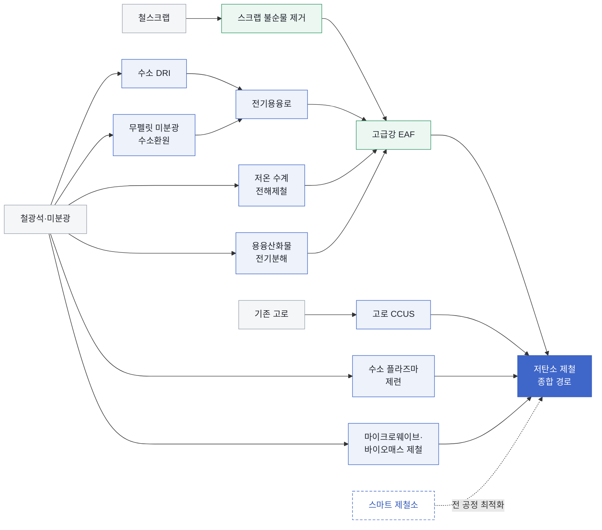

<!-- AUTO-GENERATED BY steel-intelligence. DO NOT EDIT. -->

# 철강 기술 인텔리전스

## 현황

!!! info "현재 감시 범위"

    **11개 기업** · **11개 기술** · **97개 Source** · **491개 Claim**

    [[REVIEW|사람 검토 대기]] **0건** · 근거가 연결된 주체 **43개**

## 기술 포트폴리오 지도

기술 간 관계를 나타낸 지도이며, 화살표는 확정된 공정 순서나 기술 우열을 뜻하지 않습니다.

> **색상 범례 (AI 의미 그룹):** 중립 회색=원료·기준 공정 · 옅은 코발트=전환 기술 · 옅은 녹색=자원 순환 경로 · 점선 코발트=전 공정 지원 · 진한 코발트=종합 경로

## 기술별 기업 현황

기술을 행, 기업을 열로 비교합니다. **확인**을 선택하면 해당 기업의 근거 상세로 이동합니다.

| 기술 | [[companies/COM-POSCO|POSCO]] | [[companies/COM-ArcelorMittal|ArcelorMittal]] | [[companies/COM-China-Baowu|China Baowu Steel Group]] | [[companies/COM-Nippon-Steel|Nippon Steel]] | [[companies/COM-JFE-Steel|JFE Steel]] | [[companies/COM-Tata-Steel|Tata Steel]] | [[companies/COM-thyssenkrupp-Steel|thyssenkrupp Steel]] | [[companies/COM-SSAB|SSAB]] | [[companies/COM-Nucor|Nucor]] | [[companies/COM-voestalpine|voestalpine]] | [[companies/COM-Rio-Tinto|Rio Tinto]] | [[companies/COM-Boston-Metal|Boston Metal]] |
|---|---:|---:|---:|---:|---:|---:|---:|---:|---:|---:|---:|---:|
| [[technologies/TEC-hydrogen-direct-reduced-iron|수소 직접환원철 (Hydrogen DRI)]] | [[companies/COM-POSCO|● 확인]] | [[companies/COM-ArcelorMittal|● 확인]] | [[companies/COM-China-Baowu|● 확인]] | [[companies/COM-Nippon-Steel|● 확인]] | [[companies/COM-JFE-Steel|● 확인]] | [[companies/COM-Tata-Steel|● 확인]] | [[companies/COM-thyssenkrupp-Steel|● 확인]] | [[companies/COM-SSAB|● 확인]] |  |  |  |  |
| [[technologies/TEC-electric-smelting-furnace|전기용융로 (Electric Smelting Furnace)]] | [[companies/COM-POSCO|● 확인]] |  | [[companies/COM-China-Baowu|● 확인]] |  |  | [[companies/COM-Tata-Steel|● 확인]] | [[companies/COM-thyssenkrupp-Steel|● 확인]] |  |  |  | [[companies/COM-Rio-Tinto|● 확인]] |  |
| [[technologies/TEC-molten-oxide-electrolysis|용융산화물 전기분해 (Molten Oxide Electrolysis)]] | [[companies/COM-POSCO|● 확인]] | [[companies/COM-ArcelorMittal|● 확인]] |  |  |  |  |  |  |  |  |  | [[companies/COM-Boston-Metal|● 확인]] |
| [[technologies/TEC-blast-furnace-ccus|고로 CCUS]] | [[companies/COM-POSCO|● 확인]] | [[companies/COM-ArcelorMittal|● 확인]] |  | [[companies/COM-Nippon-Steel|● 확인]] | [[companies/COM-JFE-Steel|● 확인]] | [[companies/COM-Tata-Steel|● 확인]] | [[companies/COM-thyssenkrupp-Steel|● 확인]] |  |  |  |  |  |
| [[technologies/TEC-low-carbon-ironmaking|저탄소 제철 종합 경로 (Low-carbon Ironmaking)]] | [[companies/COM-POSCO|● 확인]] | [[companies/COM-ArcelorMittal|● 확인]] | [[companies/COM-China-Baowu|● 확인]] | [[companies/COM-Nippon-Steel|● 확인]] | [[companies/COM-JFE-Steel|● 확인]] | [[companies/COM-Tata-Steel|● 확인]] | [[companies/COM-thyssenkrupp-Steel|● 확인]] | [[companies/COM-SSAB|● 확인]] | [[companies/COM-Nucor|● 확인]] |  |  |  |
| [[technologies/TEC-smart-steelworks|스마트 제철소 (Smart Steelworks)]] | [[companies/COM-POSCO|● 확인]] |  |  | [[companies/COM-Nippon-Steel|● 확인]] | [[companies/COM-JFE-Steel|● 확인]] | [[companies/COM-Tata-Steel|● 확인]] |  |  |  |  |  |  |
| [[technologies/TEC-low-temperature-aqueous-iron-electrolysis|저온 수계 전해제철 (Aqueous Iron Electrolysis)]] | [[companies/COM-POSCO|● 확인]] | [[companies/COM-ArcelorMittal|● 확인]] |  |  |  |  |  |  |  |  |  |  |
| [[technologies/TEC-high-grade-eaf-and-scrap-impurity-removal|고급강 EAF·스크랩 불순물 제거]] |  |  |  | [[companies/COM-Nippon-Steel|● 확인]] |  |  |  |  |  |  |  |  |
| [[technologies/TEC-hydrogen-based-fine-ore-reduction|무펠릿 미분광 수소환원 (Fluidized-bed Hydrogen Reduction)]] | [[companies/COM-POSCO|● 확인]] |  |  |  |  |  |  |  |  | [[companies/COM-voestalpine|● 확인]] | [[companies/COM-Rio-Tinto|● 확인]] |  |
| [[technologies/TEC-hydrogen-plasma-smelting-reduction|수소 플라즈마 용융환원 (HPSR)]] |  |  |  |  |  |  |  |  |  | [[companies/COM-voestalpine|● 확인]] |  |  |
| [[technologies/TEC-microwave-biomass-ironmaking|마이크로웨이브·바이오매스 제철]] |  |  |  |  |  |  |  |  |  |  | [[companies/COM-Rio-Tinto|● 확인]] |  |

> **표 읽는 법:** `● 확인`은 현재 저장소에 직접 근거가 연결된 조합이며, 빈 칸은 현재 화면에 표시할 직접 근거가 없다는 뜻입니다.

## 현재 관심사

- 기술 센싱
- 경쟁사 프로젝트
- POSCO-경쟁사 비교
- 리스크 감시

## 감시 대상

- **기업:** POSCO, ArcelorMittal, China Baowu Steel Group, Nippon Steel, JFE Steel, Tata Steel, thyssenkrupp Steel, SSAB, Nucor, voestalpine, Rio Tinto
- **기술:** hydrogen direct reduced iron, electric smelting furnace, molten oxide electrolysis, blast furnace CCUS, low-carbon ironmaking, smart steelworks, low-temperature aqueous iron electrolysis, high-grade EAF and scrap impurity removal, hydrogen-based fine-ore reduction, hydrogen plasma smelting reduction, microwave biomass ironmaking
- **프로젝트:** None
- **국가:** None

## 회사

- [[companies/COM-ArcelorMittal|ArcelorMittal]]
- [[companies/COM-Boston-Metal|Boston Metal]]
- [[companies/COM-China-Baowu|China Baowu Steel Group]]
- [[companies/COM-JFE-Steel|JFE Steel]]
- [[companies/COM-Nippon-Steel|Nippon Steel]]
- [[companies/COM-Nucor|Nucor]]
- [[companies/COM-POSCO|POSCO]]
- [[companies/COM-Rio-Tinto|Rio Tinto]]
- [[companies/COM-SSAB|SSAB]]
- [[companies/COM-Tata-Steel|Tata Steel]]
- [[companies/COM-thyssenkrupp-Steel|thyssenkrupp Steel]]
- [[companies/COM-voestalpine|voestalpine]]

## 기술

- [[technologies/TEC-blast-furnace-ccus|고로 CCUS]]
- [[technologies/TEC-electric-smelting-furnace|전기용융로 (Electric Smelting Furnace)]]
- [[technologies/TEC-high-grade-eaf-and-scrap-impurity-removal|고급강 EAF·스크랩 불순물 제거]]
- [[technologies/TEC-hydrogen-based-fine-ore-reduction|무펠릿 미분광 수소환원 (Fluidized-bed Hydrogen Reduction)]]
- [[technologies/TEC-hydrogen-direct-reduced-iron|수소 직접환원철 (Hydrogen DRI)]]
- [[technologies/TEC-hydrogen-plasma-smelting-reduction|수소 플라즈마 용융환원 (HPSR)]]
- [[technologies/TEC-low-carbon-ironmaking|저탄소 제철 종합 경로 (Low-carbon Ironmaking)]]
- [[technologies/TEC-low-temperature-aqueous-iron-electrolysis|저온 수계 전해제철 (Aqueous Iron Electrolysis)]]
- [[technologies/TEC-microwave-biomass-ironmaking|마이크로웨이브·바이오매스 제철]]
- [[technologies/TEC-molten-oxide-electrolysis|용융산화물 전기분해 (Molten Oxide Electrolysis)]]
- [[technologies/TEC-smart-steelworks|스마트 제철소 (Smart Steelworks)]]

## 프로젝트

- [[projects/PRJ-BIOIRON-WA-RD|BioIron 연구개발 시설 (Western Australia)]]
- [[projects/PRJ-BOSTON-METAL-MOE-WOBURN|Boston Metal Woburn MOE 산업 셀]]
- [[projects/PRJ-CARBON2CHEM-DUISBURG|thyssenkrupp Duisburg Carbon2Chem]]
- [[projects/PRJ-ELECTRA-CLEAN-IRON-DEMO|Electra 청정철 시범공장]]
- [[projects/PRJ-HY4SMELT|HY4Smelt 실증 프로젝트]]
- [[projects/PRJ-HYBRIT-LULEA-PILOT|HYBRIT 룰레오 수소 DRI 파일럿]]
- [[projects/PRJ-HYFOR-DONAWITZ-PILOT|HYFOR Donawitz 수소환원 파일럿]]
- [[projects/PRJ-JFE-SINTER-CPS-ROLLOUT|JFE 일본 7개 소결설비 CPS 전개]]
- [[projects/PRJ-LIGHTBOW-HPSR-CONTROL|LIGHTBOW HPSR 아크 제어 연구]]
- [[projects/PRJ-MOLTEN-SULFIDE-ELECTROLYSIS|용융 황화물 전해 프로젝트]]
- [[projects/PRJ-NEOSMELT-KWINANA|NeoSmelt Kwinana DRI–ESF 파일럿]]
- [[projects/PRJ-POSCO-GWANGYANG-EAF|POSCO 광양 250만 톤 전기로]]
- [[projects/PRJ-POSCO-GWANGYANG-ONE-TOUCH-CONVERTER|POSCO 광양 2전로 원터치 자동화]]
- [[projects/PRJ-POSCO-HYREX-DEMO|POSCO 포항 HyREX 통합 실증]]
- [[projects/PRJ-SORTERA-SCRAP-DECOPPER|Sortera 스크랩 구리 제거 프로젝트]]
- [[projects/PRJ-SSAB-LULEA-ELECTRIC-MILL|SSAB Luleå 신규 전기제철소]]
- [[projects/PRJ-STEELANOL-GHENT|ArcelorMittal Ghent Steelanol]]
- [[projects/PRJ-SUSTEEL-DONAWITZ|voestalpine Donawitz SuSteel·SuS-F]]
- [[projects/PRJ-TATA-JAMSHEDPUR-BF-CCU|Tata Jamshedpur 고로가스 CCU]]
- [[projects/PRJ-TK-H2STEEL-DUISBURG|thyssenkrupp Duisburg tkH2Steel]]
- [[projects/PRJ-ULCOS-TGR-BF|ULCOS 상부가스 재순환 고로]]

## 기타 항목

- None

## 최근 변경

- 2030-12-31 · PRJ-POSCO-GWANGYANG-EAF · `target_product_date` · created
- 2029-12-31 · PRJ-SSAB-LULEA-ELECTRIC-MILL · `target_start_date` · created
- 2027-12-31 · PRJ-TK-H2STEEL-DUISBURG · `target_commissioning_date` · created
- 2027-12-31 · PRJ-TK-H2STEEL-DUISBURG · `hydrogen_network_date` · created
- 2026-07-25 · TEC-smart-steelworks · `vvuq` · created
- 2026-07-25 · TEC-smart-steelworks · `traceability` · created
- 2026-07-25 · TEC-smart-steelworks · `technical_definition` · created
- 2026-07-25 · TEC-smart-steelworks · `synchronization_requirement` · created
- 2026-07-25 · TEC-smart-steelworks · `sensing_layer` · created
- 2026-07-25 · TEC-smart-steelworks · `scale_out_requirement` · created

## 출처

- [[sources/SRC-20260725-017C8BAE|NIST SP 800-82 Rev. 3 Guide to Operational Technology Security]]
- [[sources/SRC-20260725-043634EA|A Review on Prevention of Sticking during Fluidized Bed Reduction of Fine Iron Ore]]
- [[sources/SRC-20260725-054778AA|JFE Steel carbon-neutral strategy — carbon-recycling blast furnace]]
- [[sources/SRC-20260725-0CC8B82B|Tata Steel first-in-world digital twin in sinter making]]
- [[sources/SRC-20260725-133D1C12|ROSIE Project Descriptions: Electra Low-Temperature Green Ironmaking]]
- [[sources/SRC-20260725-147875E9|A new anode material for oxygen evolution in molten oxide electrolysis]]
- [[sources/SRC-20260725-1486633E|Production of Fe metal from Fe ores through novel molten oxide electrolysis at 1173 K]]
- [[sources/SRC-20260725-1A31BE76|Breakthrough technology development and CCUS for carbon-neutral steelmaking]]
- [[sources/SRC-20260725-1A6AFBF8|Electrolysis of Molten Iron Oxide with an Iridium Anode: The Role of Electrolyte Basicity]]
- [[sources/SRC-20260725-1AD87D2B|Economics of Electrowinning Iron from Ore for Green Steel Production]]
- [[sources/SRC-20260725-1F1EA152|Strategic Selection of a Pre-Reduction Reactor for Increased Hydrogen Utilization in Hydrogen Plasma Smelting Reduction]]
- [[sources/SRC-20260725-238E8691|Emissions Measurement and Data Collection for a Net Zero Steel Industry]]
- [[sources/SRC-20260725-26EA1CBD|MOE Steel: process, scale-up model, and current deployment status]]
- [[sources/SRC-20260725-285480DE|POSCO One-Touch Converter Operation Automation Technology]]
- [[sources/SRC-20260725-28E5A30F|POSCO AI blast furnace and smart steelworks baseline]]
- [[sources/SRC-20260725-2B01239E|Iron and Steel Technology Roadmap]]
- [[sources/SRC-20260725-2EABD949|Iron and Steel CCS Study — Techno-Economics Integrated Steel Mill]]
- [[sources/SRC-20260725-2FA1B498|Project SuSteel: Sustainable steel production utilising hydrogen]]
- [[sources/SRC-20260725-30A4249E|Digital Twins for Advanced Manufacturing]]
- [[sources/SRC-20260725-31601585|SSAB begins construction of new Luleå electric steel mill]]
- [[sources/SRC-20260725-31725163|Application of Electric Smelting Furnace to Ironmaking]]
- [[sources/SRC-20260725-3176F88E|Tata Steel FY2023-24 Jamshedpur CCU operating update]]
- [[sources/SRC-20260725-34D63EEA|SUS-F Sustainable Steelmaking Follow Up]]
- [[sources/SRC-20260725-34FFE3B8|DOE selects steel scrap copper-removal and molten sulfide electrolysis projects]]
- [[sources/SRC-20260725-38165ABC|Iron and Steel Technology Roadmap]]
- [[sources/SRC-20260725-395D8A82|ArcelorMittal cannot proceed with Bremen and Eisenhüttenstadt DRI-EAF plans]]
- [[sources/SRC-20260725-3C2197EF|Boston Metal Celebrates Historic Commissioning Run of MOE Green Steel Cell]]
- [[sources/SRC-20260725-3D62F9A6|Electra Launches Pilot Plant to Advance Commercialization of Sustainable Clean Iron Production]]
- [[sources/SRC-20260725-3DA8B9C7|Sortera Technologies AI sensor sorting platform]]
- [[sources/SRC-20260725-3FF9886C|China Baowu and Rio Tinto complete hydrogen DRI and electric-smelting trials]]
- [[sources/SRC-20260725-41586A75|JFE Steel deploys CPS technology across sintering facilities]]
- [[sources/SRC-20260725-4333339B|In Situ Observation of Sustainable Hematite-Magnetite-Wustite-Iron Hydrogen Plasma Reduction]]
- [[sources/SRC-20260725-4366E5B1|Finding the Most Efficient Way to Remove Residual Copper from Steel Scrap]]
- [[sources/SRC-20260725-45A1D063|Nippon Steel research and development for carbon-neutral steelmaking]]
- [[sources/SRC-20260725-45CF187D|Impact of Hydrogen DRI on EAF Steelmaking]]
- [[sources/SRC-20260725-46A2055D|Tata Steel commissions carbon capture plant for blast furnace gas at Jamshedpur]]
- [[sources/SRC-20260725-4C014458|POSCO and Electra partner on low-temperature clean iron]]
- [[sources/SRC-20260725-4E9EE842|Low-carbon technologies for the global steel transformation: Molten oxide electrolysis]]
- [[sources/SRC-20260725-61382798|ArcelorMittal confirms €1.3bn Dunkirk EAF construction]]
- [[sources/SRC-20260725-624E124C|ArcelorMittal announces first industrial production of ethanol at Steelanol]]
- [[sources/SRC-20260725-67CAA465|BlueScope, BHP and Rio Tinto select WA for Australia’s largest ironmaking electric smelting furnace]]
- [[sources/SRC-20260725-6B30EDDE|Tata Steel and SMS group plan EASyMelt industrial demonstration]]
- [[sources/SRC-20260725-6C80084B|Tata Steel climate action technology roadmap]]
- [[sources/SRC-20260725-6EC0DF4D|Pathways to decarbonisation: the electric smelting furnace]]
- [[sources/SRC-20260725-6F7C35D8|Circored Fine Ore Direct Reduction]]
- [[sources/SRC-20260725-75A329BD|HYBRIT six-year pilot research results]]
- [[sources/SRC-20260725-789AB58F|Tata Steel Nederland integrated decarbonisation project letter of intent]]
- [[sources/SRC-20260725-79D4B2ED|Energy Technology Perspectives 2026 executive summary]]
- [[sources/SRC-20260725-7DDD98E7|Image-Segmentation-Guided Fragmentized Steel Scrap Tramp Material Characterization]]
- [[sources/SRC-20260725-7E6DFD33|JFE technical report on carbon-recycling blast furnace]]
- [[sources/SRC-20260725-7E8ABC86|China launches first million-tonne near-zero-carbon steel line at Baowu]]
- [[sources/SRC-20260725-8A93E42F|Value chain GHG emission reductions — DRI-ESF programme update]]
- [[sources/SRC-20260725-8BA7A1B3|Conceptual Architecture of Digital Twins with Human-in-the-Loop Based Smart Manufacturing]]
- [[sources/SRC-20260725-8D0BD4B8|thyssenkrupp Steel direct-reduction transformation project status]]
- [[sources/SRC-20260725-973F138F|LIGHTBOW: Model-based control in metallurgical arc-plasma processes]]
- [[sources/SRC-20260725-99B78C86|Sticking in Shaft Furnace and Fluidized Bed Ironmaking Processes: A Comprehensive Review Focusing on the Effect of Coating Materials]]
- [[sources/SRC-20260725-9B4DDCDD|The Decarbonisation Progress Levels]]
- [[sources/SRC-20260725-9D378E7F|ArcelorMittal invests $36 million in Boston Metal]]
- [[sources/SRC-20260725-9DCCDB31|Nippon Steel Carbon Neutral Vision 2050]]
- [[sources/SRC-20260725-9FBEF9C2|Nitrogen Control in Electric Arc Furnace Steelmaking by DRI (TRP 0009)]]
- [[sources/SRC-20260725-A0AC41D7|Project SuS-F: SuSteel follow-up]]
- [[sources/SRC-20260725-A23B5A64|HYFOR: Hydrogen-Based Fine-Ore Reduction]]
- [[sources/SRC-20260725-A6716ADB|ArcelorMittal and John Cockerill develop Volteron low-temperature electrolysis]]
- [[sources/SRC-20260725-A6759186|POSCO HyREX electric smelting furnace pilot status]]
- [[sources/SRC-20260725-A8C28387|ULCOS New Blast Furnace Process]]
- [[sources/SRC-20260725-AA686449|Nucor sustainability and EAF steelmaking profile]]
- [[sources/SRC-20260725-AFA5C853|Hydrogen Uses in Ironmaking]]
- [[sources/SRC-20260725-B6FB82E5|ArcelorMittal inaugurates Steelanol CCU project at Ghent]]
- [[sources/SRC-20260725-B859CA04|POSCO completes Gwangyang EAF and advances HyREX]]
- [[sources/SRC-20260725-BAB49577|Primetals Technologies and POSCO Sign Cooperation Agreement for HyREX Direct Reduction Plant]]
- [[sources/SRC-20260725-BBCC117E|Al Reyadah commercial steel-sector CCUS facility]]
- [[sources/SRC-20260725-BC8DE092|HYFOR Pilot Plant Under Operation]]
- [[sources/SRC-20260725-BD336973|Demand and Supply Measures for the Steel and Cement Transition]]
- [[sources/SRC-20260725-BF5036AE|ExxonMobil and Nucor carbon capture agreement for Convent DRI plant]]
- [[sources/SRC-20260725-C37A3042|Industry giants collaborating to seek to decarbonise steel]]
- [[sources/SRC-20260725-C79793B1|Suppression of Surface Hot Shortness due to Cu in Recycled Steels]]
- [[sources/SRC-20260725-C888600A|Tenova for POSCO Gwangyang plant]]
- [[sources/SRC-20260725-C9D824F2|Metso opens DRI Smelting Furnace pilot facility in Pori, Finland]]
- [[sources/SRC-20260725-CD029AB1|Carbon2Chem development phases and industrial application validation]]
- [[sources/SRC-20260725-CEDC4521|Carbon-free Iron for a Sustainable Future: Boston Metal IEDO Peer Review]]
- [[sources/SRC-20260725-D230993B|MIDREX H2 current process configuration]]
- [[sources/SRC-20260725-D37C44F7|Integrating Metallurgical Mechanisms and Explainable Deep Learning Methods to Predict Phosphorus Content in Electric Arc Furnace Steelmaking for Enhanced Efficiency]]
- [[sources/SRC-20260725-D6930918|Electra Technology: How the low-temperature iron process works]]
- [[sources/SRC-20260725-DAAEEC2B|Nippon Steel develops high-grade steel production in large EAFs]]
- [[sources/SRC-20260725-DB8169D9|Impact of Iron Ore Pre-Reduction Degree on the Hydrogen Plasma Smelting Reduction Process]]
- [[sources/SRC-20260725-E316D68F|Construction begins on HYFOR and Smelter demonstration plant]]
- [[sources/SRC-20260725-E493B07B|ULCOS top gas recycling blast furnace process — final report]]
- [[sources/SRC-20260725-EC77A362|JFE Steel 2025 priorities for carbon-neutral technologies]]
- [[sources/SRC-20260725-EE8A09EF|The Optical Spectra of Hydrogen Plasma Smelting Reduction of Iron Ore: Application and Requirements]]
- [[sources/SRC-20260725-F13F33CD|Properties evaluation of DRI smelting slag for molten iron production: viscosity and sulfide capacity]]
- [[sources/SRC-20260725-F1D3EDEA|Rio Tinto develops BioIron R&D facility in Western Australia]]
- [[sources/SRC-20260725-F2F9BB6E|Application of SuSteel technology and operation of the SuSteel pilot plant in Donawitz]]
- [[sources/SRC-20260725-FAB12DBF|SSAB postpones Luleå mill commissioning to end-2029]]
- [[sources/SRC-20260725-FBF8EA9E|NeoSmelt pilot project — Legislative Council answer]]
- [[sources/SRC-20260725-FE22DEFE|voestalpine researches hydrogen plasma steelmaking in SuSteel]]
- [[sources/SRC-20260725-FED4B2D7|Carbon2Chem technical center in Duisburg]]
- [[sources/SRC-20260725-FF076FE4|POSCO decarbonization strategies from CCUS to HyREX]]

## 최근 동향 보고서

- 아직 발행된 동향 보고서가 없습니다. [동향 보고서 안내](reports/index.md)
