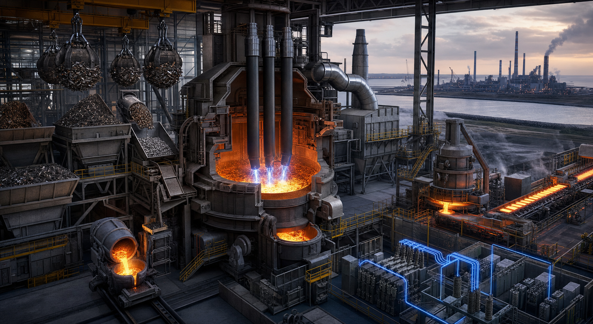

<!-- AUTO-GENERATED BY steel-intelligence. DO NOT EDIT. -->

# ArcelorMittal Dunkirk 대형 전기로

> 최근 검증 **2026-07-25** · 확인된 핵심 정보 **10건** · 직접 연결 근거 **2건**

{ .steel-media-image .steel-hero-image .steel-media-compact }

*대표 이미지 — Dunkirk 대형 EAF의 스크랩·HBI/DRI·용선 혼합, 배가스 처리와 후단 정련 경로 AI 재구성. 실제 Dunkirk 준공도가 아님 (AI 재구성 · 권리 `ai_generated` · 출처 [[sources/SRC-20260725-61382798|SRC-20260725-61382798]] · [원문 페이지](https://corporate.arcelormittal.com/media/news/regulatory-news/arcelormittal-confirms-the-construction-of-an-electric-arc-furnace-in-dunkirk-france-a-13-billion-investment-supporting-an-important-step-in-its-decarbonisation))*

!!! abstract "현재 상태"

    **2026-02-10 200만 t/y 전기로 건설을 확정한 투자 실행 단계; 실제 착공·설비 설치·가동은 후속 확인 필요** [^src-20260725-61382798]

## 확인된 핵심 정보

| 항목 | 확인된 내용 |
| --- | --- |
| **프로젝트 상태** | 2026-02-10 200만 t/y 전기로 건설을 확정한 투자 실행 단계; 실제 착공·설비 설치·가동은 후속 확인 필요 [^src-20260725-61382798] |
| **연간 생산능력** | 연간 2,000,000톤 조강 [^src-20260725-61382798] |
| **투자비** | EUR 1.3 billion [^src-20260725-61382798] |
| **기술 경로** | 스크랩·HBI/DRI·용선을 혼합 투입하는 대형 EAF 제강 경로 [^src-20260725-61382798] |
| **지원·조달 금액** | 프랑스 에너지절감인증서 지원이 EUR 1.3 billion 투자비의 50%를 담당할 예정 [^src-20260725-61382798] |
| **제품 단위 배출** | 회사 추정 0.6 tCO2/t-steel로 고로 비교 대비 약 3분의 1 [^src-20260725-61382798] |
| **투자 의향 발표 시점** | 2025-05-15 약 EUR 1.2 billion 투자 의향 발표 [^src-20260725-3b0845ff] |
| **위치** | Dunkirk, France [^src-20260725-61382798] |
| **일정·의사결정 변경** | 2025년 유럽 탈탄소 프로젝트 연기 국면의 조건부 투자 의향에서 2026년 EUR 1.3 billion 건설 확정으로 전환 [^src-20260725-3b0845ff] |
| **목표 시운전 시점** | 2029년 가동 목표 [^src-20260725-61382798] |

## 전체 확인 이력

현재 상태만 남기지 않고, 등록된 Source와 일정 Claim에서 확인되는 발표·검증·목표·실행 이력을 모두 시간순으로 표시합니다.

| 날짜 | 구분 | 확인된 사건 |
| --- | --- | --- |
| 2025 | 일정·의사결정 변화 | **일정·의사결정 변경**: 2025년 유럽 탈탄소 프로젝트 연기 국면의 조건부 투자 의향에서 2026년 EUR 1.3 billion 건설 확정으로 전환 [^src-20260725-3b0845ff] |
| 2025-05-15 | 발표·검증 | **일정·의사결정 변경**: 2025년 유럽 탈탄소 프로젝트 연기 국면의 조건부 투자 의향에서 2026년 EUR 1.3 billion 건설 확정으로 전환 · **투자 의향 발표 시점**: 2025-05-15 약 EUR 1.2 billion 투자 의향 발표 [^src-20260725-3b0845ff] |
| 2025-05-15 | 투자 의향 발표 | **투자 의향 발표 시점**: 2025-05-15 약 EUR 1.2 billion 투자 의향 발표 [^src-20260725-3b0845ff] |
| 2026-02-10 | 발표·검증 | **기술 경로**: 스크랩·HBI/DRI·용선을 혼합 투입하는 대형 EAF 제강 경로 · **위치**: Dunkirk, France · **지원·조달 금액**: 프랑스 에너지절감인증서 지원이 EUR 1.3 billion 투자비의 50%를 담당할 예정 · **제품 단위 배출**: 회사 추정 0.6 tCO2/t-steel로 고로 비교 대비 약 3분의 1 · **목표 시운전 시점**: 2029년 가동 목표 · **프로젝트 상태**: 2026-02-10 200만 t/y 전기로 건설을 확정한 투자 실행 단계; 실제 착공·설비 설치·가동은 후속 확인 필요 · **연간 생산능력**: 연간 2,000,000톤 조강 · **투자비**: EUR 1.3 billion [^src-20260725-61382798] |
| 2029 | 목표 일정 | **목표 시운전 시점**: 2029년 가동 목표 [^src-20260725-61382798] |

## 근거 자료

- **ArcelorMittal confirms intention to invest EUR 1.2 billion in Dunkirk** — ArcelorMittal, 2025-05-15 · [원문 보기](https://corporate.arcelormittal.com/media/news/non-regulatory-news/arcelormittal-confirms-its-intention-to-invest-12-billion-in-dunkirk-to-decarbonize) · [[sources/SRC-20260725-3B0845FF|보관 원문·메타데이터]]
- **ArcelorMittal confirms €1.3bn Dunkirk EAF construction** — ArcelorMittal, 2026-02-10 · [원문 보기](https://corporate.arcelormittal.com/media/news/regulatory-news/arcelormittal-confirms-the-construction-of-an-electric-arc-furnace-in-dunkirk-france-a-13-billion-investment-supporting-an-important-step-in-its-decarbonisation) · [[sources/SRC-20260725-61382798|보관 원문·메타데이터]]

[^src-20260725-3b0845ff]: **ArcelorMittal confirms intention to invest EUR 1.2 billion in Dunkirk** — ArcelorMittal, 2025-05-15. [원문](https://corporate.arcelormittal.com/media/news/non-regulatory-news/arcelormittal-confirms-its-intention-to-invest-12-billion-in-dunkirk-to-decarbonize) · [[sources/SRC-20260725-3B0845FF|보관 원문·메타데이터]]
[^src-20260725-61382798]: **ArcelorMittal confirms €1.3bn Dunkirk EAF construction** — ArcelorMittal, 2026-02-10. [원문](https://corporate.arcelormittal.com/media/news/regulatory-news/arcelormittal-confirms-the-construction-of-an-electric-arc-furnace-in-dunkirk-france-a-13-billion-investment-supporting-an-important-step-in-its-decarbonisation) · [[sources/SRC-20260725-61382798|보관 원문·메타데이터]]
