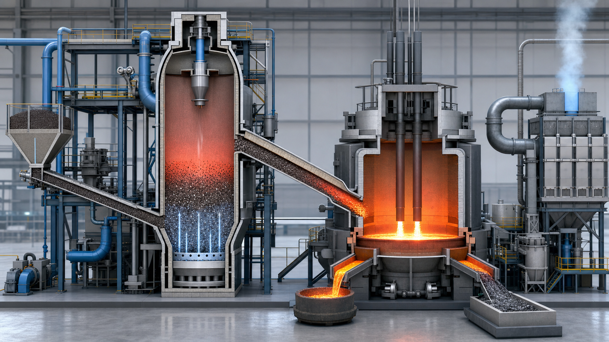

<!-- AUTO-GENERATED BY steel-intelligence. DO NOT EDIT. -->

# HY4Smelt 실증 프로젝트

> 최근 검증 **2026-07-25** · 확인된 핵심 정보 **11건** · 직접 연결 근거 **2건**

{ .steel-media-image .steel-hero-image .steel-media-compact }

*대표 이미지 — HY4Smelt 미분광 수소환원-전기용융 연계 공정의 출처 기반 AI 재구성; 실제 준공도나 설비 사진이 아님 (AI 재구성 · 권리 `ai_generated` · 출처 [[sources/SRC-20260725-E316D68F|SRC-20260725-E316D68F]] · [원문 페이지](https://dam.primetals.com/m/6c938163b0f170c0/original/PR2025083472en.pdf))*

!!! abstract "현재 상태"

    **건설 중** [^src-20260725-e316d68f]

## 확인된 핵심 정보

| 항목 | 확인된 내용 |
| --- | --- |
| **프로젝트 상태** | 건설 중 [^src-20260725-e316d68f] |
| **목표 가동 시점** | 2027년 말 [^src-20260725-e316d68f] |
| **시간당 처리능력** | 시간당 3톤 (3 tonnes per hour) [^src-20260725-e316d68f] |
| **착공 시점** | 2025-09-25 [^src-20260725-e316d68f] |
| **대표 설비 참고** | HYFOR 파일럿 유동층 반응기 실제 설비 사진; HY4SMELT 준공 설비 사진이 아닌 기술 참고 [^src-20260725-a23b5a64] |
| **적용 원료** | 응집하지 않은 저·중품위 철광석 미분을 중점 검증 [^src-20260725-e316d68f] |
| **통합 설비 구성** | HYFOR 수소 미분광 직접환원과 전기 Smelter를 결합한 통합 실증설비 [^src-20260725-e316d68f] |
| **위치** | Linz, Austria [^src-20260725-e316d68f] |
| **참여 기관** | voestalpine, Primetals Technologies, Rio Tinto 및 기타 프로젝트 파트너 [^src-20260725-e316d68f] |
| **제품 형태** | 미분 DRI를 전기 Smelter에서 용융해 용융 철 제품을 생산하는 경로 [^src-20260725-e316d68f] |
| **공개 성과의 한계** | 착공과 설계 처리량은 연속 실증 또는 상업 운전 완료의 증거가 아님 [^src-20260725-e316d68f] |

## 전체 확인 이력

현재 상태만 남기지 않고, 등록된 Source와 일정 Claim에서 확인되는 발표·검증·목표·실행 이력을 모두 시간순으로 표시합니다.

| 날짜 | 구분 | 확인된 사건 |
| --- | --- | --- |
| 2025-09-25 | 발표·검증 | **위치**: Linz, Austria · **적용 원료**: 응집하지 않은 저·중품위 철광석 미분을 중점 검증 · **프로젝트 상태**: 건설 중 · **공개 성과의 한계**: 착공과 설계 처리량은 연속 실증 또는 상업 운전 완료의 증거가 아님 · **목표 가동 시점**: 2027년 말 · **시간당 처리능력**: 시간당 3톤 (3 tonnes per hour) · **제품 형태**: 미분 DRI를 전기 Smelter에서 용융해 용융 철 제품을 생산하는 경로 · **참여 기관**: voestalpine, Primetals Technologies, Rio Tinto 및 기타 프로젝트 파트너 · **통합 설비 구성**: HYFOR 수소 미분광 직접환원과 전기 Smelter를 결합한 통합 실증설비 · **착공 시점**: 2025-09-25 [^src-20260725-e316d68f] |
| 2026-07-25 | 수집 확인 | **대표 설비 참고**: HYFOR 파일럿 유동층 반응기 실제 설비 사진; HY4SMELT 준공 설비 사진이 아닌 기술 참고 [^src-20260725-a23b5a64] |
| 2027 | 목표 일정 | **목표 가동 시점**: 2027년 말 [^src-20260725-e316d68f] |

## 근거 자료

- **HYFOR: Hydrogen-Based Fine-Ore Reduction** — Primetals Technologies, 게시일 미상 · [원문 보기](https://www.primetals.com/en/portfolio/solutions/ironmaking/direct-reduction/hyfor/) · [[sources/SRC-20260725-A23B5A64|보관 원문·메타데이터]]
- **Construction begins on HYFOR and Smelter demonstration plant** — Primetals Technologies, 2025-09-25 · [원문 보기](https://dam.primetals.com/m/6c938163b0f170c0/original/PR2025083472en.pdf) · [[sources/SRC-20260725-E316D68F|보관 원문·메타데이터]]

[^src-20260725-a23b5a64]: **HYFOR: Hydrogen-Based Fine-Ore Reduction** — Primetals Technologies, 게시일 미상. [원문](https://www.primetals.com/en/portfolio/solutions/ironmaking/direct-reduction/hyfor/) · [[sources/SRC-20260725-A23B5A64|보관 원문·메타데이터]]
[^src-20260725-e316d68f]: **Construction begins on HYFOR and Smelter demonstration plant** — Primetals Technologies, 2025-09-25. [원문](https://dam.primetals.com/m/6c938163b0f170c0/original/PR2025083472en.pdf) · [[sources/SRC-20260725-E316D68F|보관 원문·메타데이터]]
