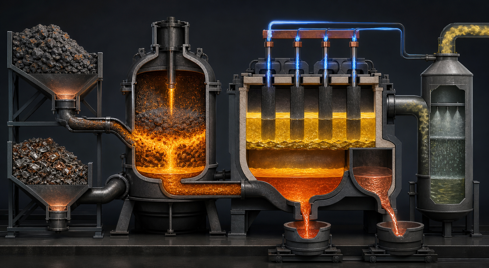

<!-- AUTO-GENERATED BY steel-intelligence. DO NOT EDIT. -->

# 용융 황화물 전해 프로젝트

> 최근 검증 **2026-07-25** · 확인된 핵심 정보 **8건** · 직접 연결 근거 **2건**

{ .steel-media-image .steel-hero-image .steel-media-compact }

*대표 이미지 — 선택 황화–용융 황화물 전해–용철·구리계 분리–황계 배가스 세정 경로의 출처 기반 AI 재구성. 실제 MIT 시험설비의 준공도나 운전 사진이 아님 (AI 재구성 · 권리 `ai_generated` · 출처 [[sources/SRC-20260725-D3C50354|SRC-20260725-D3C50354]] · [원문 페이지](https://www.energy.gov/nepa/articles/cx-032248-iron-production-molten-sulfide-electrolysis))*

!!! abstract "현재 상태"

    **DOE 지원 아래 MIT가 황화·전해 설비의 설계·개발·제작·현장시험을 추진하는 연구개발 단계이며 통합 파일럿 완료 운전은 확인되지 않음** [^src-20260725-d3c50354]

## 확인된 핵심 정보

| 항목 | 확인된 내용 |
| --- | --- |
| **프로젝트 상태** | DOE 지원 아래 MIT가 황화·전해 설비의 설계·개발·제작·현장시험을 추진하는 연구개발 단계이며 통합 파일럿 완료 운전은 확인되지 않음 [^src-20260725-d3c50354] |
| **기술 경로** | 광석·고Cu 스크랩을 선택적으로 황화한 뒤 용융 황화물 전해로 철을 용융 금속으로 회수하고 Cu 불순물 분리를 병행하는 경로 [^src-20260725-34ffe3b8] |
| **지원·조달 금액** | 미 연방정부 지원 대상 선정 · 560만 달러 [^src-20260725-34ffe3b8] |
| **설비 구성** | 선택 황화 장치와 용융 황화물 전해 장치의 설계·제작·현장시험 범위 [^src-20260725-d3c50354] |
| **위치** | MIT Building 5, Cambridge, Massachusetts, USA [^src-20260725-d3c50354] |
| **참여 기관** | Massachusetts Institute of Technology와 Rio Tinto [^src-20260725-34ffe3b8] |
| **환경 허가 결정** | 2024-10-15 DOE NEPA categorical exclusion 게시 [^src-20260725-d3c50354] |
| **공정 안전·환경 위험** | CO·CO2·SO2·황·H2S 계열 가스의 포집·세정·배출 관리가 필요한 연구 설비 [^src-20260725-d3c50354] |

## 전체 확인 이력

현재 상태만 남기지 않고, 등록된 Source와 일정 Claim에서 확인되는 발표·검증·목표·실행 이력을 모두 시간순으로 표시합니다.

| 날짜 | 구분 | 확인된 사건 |
| --- | --- | --- |
| 2024-10-15 | 발표·검증 | **위치**: MIT Building 5, Cambridge, Massachusetts, USA · **프로젝트 상태**: DOE 지원 아래 MIT가 황화·전해 설비의 설계·개발·제작·현장시험을 추진하는 연구개발 단계이며 통합 파일럿 완료 운전은 확인되지 않음 · **설비 구성**: 선택 황화 장치와 용융 황화물 전해 장치의 설계·제작·현장시험 범위 · **환경 허가 결정**: 2024-10-15 DOE NEPA categorical exclusion 게시 · **공정 안전·환경 위험**: CO·CO2·SO2·황·H2S 계열 가스의 포집·세정·배출 관리가 필요한 연구 설비 [^src-20260725-d3c50354] |
| 2024-10-15 | 허가 이력 | **환경 허가 결정**: 2024-10-15 DOE NEPA categorical exclusion 게시 [^src-20260725-d3c50354] |
| 2026-07-25 | 수집 확인 | **참여 기관**: Massachusetts Institute of Technology와 Rio Tinto · **기술 경로**: 광석·고Cu 스크랩을 선택적으로 황화한 뒤 용융 황화물 전해로 철을 용융 금속으로 회수하고 Cu 불순물 분리를 병행하는 경로 · **지원·조달 금액**: 미 연방정부 지원 대상 선정 · 560만 달러 [^src-20260725-34ffe3b8] |

## 근거 자료

- **DOE selects steel scrap copper-removal and molten sulfide electrolysis projects** — U.S. Department of Energy, 게시일 미상 · [원문 보기](https://www.energy.gov/cmei/ito/ito-fy23-fy24-high-priority-selections) · [[sources/SRC-20260725-34FFE3B8|보관 원문·메타데이터]]
- **DOE NEPA review for Iron Production by Molten Sulfide Electrolysis** — U.S. Department of Energy, 2024-10-15 · [원문 보기](https://www.energy.gov/nepa/articles/cx-032248-iron-production-molten-sulfide-electrolysis) · [[sources/SRC-20260725-D3C50354|보관 원문·메타데이터]]

[^src-20260725-34ffe3b8]: **DOE selects steel scrap copper-removal and molten sulfide electrolysis projects** — U.S. Department of Energy, 게시일 미상. [원문](https://www.energy.gov/cmei/ito/ito-fy23-fy24-high-priority-selections) · [[sources/SRC-20260725-34FFE3B8|보관 원문·메타데이터]]
[^src-20260725-d3c50354]: **DOE NEPA review for Iron Production by Molten Sulfide Electrolysis** — U.S. Department of Energy, 2024-10-15. [원문](https://www.energy.gov/nepa/articles/cx-032248-iron-production-molten-sulfide-electrolysis) · [[sources/SRC-20260725-D3C50354|보관 원문·메타데이터]]
