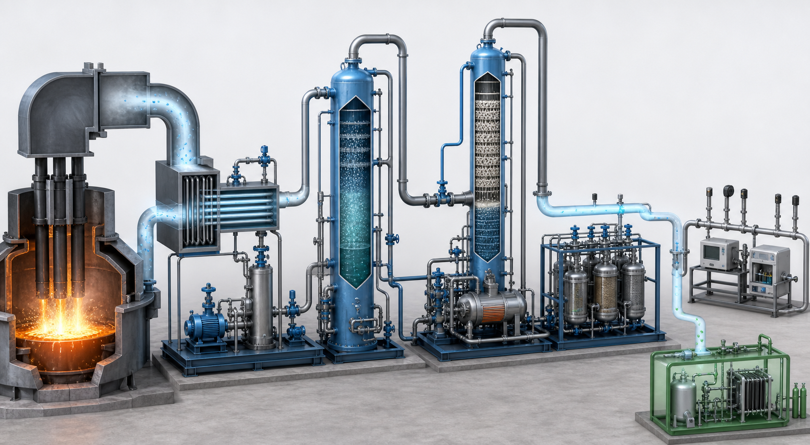

<!-- AUTO-GENERATED BY steel-intelligence. DO NOT EDIT. -->

# Nucor Gallatin EAF 탄소포집 파일럿

> 최근 검증 **2026-07-28** · 확인된 핵심 정보 **8건** · 직접 연결 근거 **3건**

{ .steel-media-image .steel-hero-image .steel-media-compact }

*대표 이미지 — Nucor Gallatin EAF 저농도 배가스-아민 포집-polishing loop·측정 계통의 출처 기반 AI 재구성; 실제 설치 사진이 아님 (AI 재구성 · 권리 `ai_generated` · 출처 [[sources/SRC-20260725-FE353D3A|SRC-20260725-FE353D3A]] · [원문 페이지](https://nucor.com/news?article=nucor-and-the-university-of-kentucky-receive-federal-grant-for-carbon-capture-r%26d-at-gallatin-mill-122742))*

!!! abstract "현재 상태"

    **기존 열통합 아민 포집 파일럿의 구축·시험 후, DOE 선정 과제로 수소생산 결합 polishing loop를 기존 포집장치에 통합 설계·건설·시험하는 연구개발 단계** [^src-20260725-fe353d3a][^src-20260725-6d04090a][^src-20260728-fb94e7b7]

## 확인된 핵심 정보

| 항목 | 확인된 내용 |
| --- | --- |
| **프로젝트 상태** | 기존 열통합 아민 포집 파일럿의 구축·시험 후, DOE 선정 과제로 수소생산 결합 polishing loop를 기존 포집장치에 통합 설계·건설·시험하는 연구개발 단계 [^src-20260725-fe353d3a][^src-20260725-6d04090a][^src-20260728-fb94e7b7] |
| **기술 경로** | EAF 저농도 배가스 → 기존 수계 아민 포집 → 수소생산 결합 이중 polishing loop → 용매 열화물·대기오염물질 측정 [^src-20260725-6d04090a] |
| **지원·조달 금액** | DOE USD 3,000,000 + 비연방 USD 750,001 = 총 USD 3,750,001 [^src-20260725-6d04090a] |
| **공개 개발 단계** | engineering-scale 포집 성능·비용·재현성 평가; 상업 포집량·영구저장량은 미공개 [^src-20260725-fe353d3a][^src-20260725-6d04090a] |
| **배출 측정 범위** | 통합 포집계통 시험에서 용매·용매열화물 배출과 criteria pollutants를 측정하는 범위 [^src-20260725-6d04090a] |
| **위치** | Nucor Steel Gallatin, Ghent, Kentucky, United States [^src-20260725-fe353d3a] |
| **후단 CO2 농도 목표** | 이중 polishing 처리 후 CO2 100 ppm 미만 배가스 대상 기술개발 목표; 달성 실적은 미확인 [^src-20260725-6d04090a] |
| **참여 기관** | Nucor Corporation, University of Kentucky Research Foundation, U.S. DOE/NETL; 2022 발표 기준 산학 전문가 50명 초과 참여 [^src-20260725-fe353d3a] |

## 전체 확인 이력

현재 상태만 남기지 않고, 등록된 Source와 일정 Claim에서 확인되는 발표·검증·목표·실행 이력을 모두 시간순으로 표시합니다.

| 날짜 | 구분 | 확인된 사건 |
| --- | --- | --- |
| 2022-04-22 | 발표·검증 | **프로젝트 상태**: 기존 열통합 아민 포집 파일럿의 구축·시험 후, DOE 선정 과제로 수소생산 결합 polishing loop를 기존 포집장치에 통합 설계·건설·시험하는 연구개발 단계 · **위치**: Nucor Steel Gallatin, Ghent, Kentucky, United States · **참여 기관**: Nucor Corporation, University of Kentucky Research Foundation, U.S. DOE/NETL; 2022 발표 기준 산학 전문가 50명 초과 참여 · **공개 개발 단계**: engineering-scale 포집 성능·비용·재현성 평가; 상업 포집량·영구저장량은 미공개 [^src-20260725-fe353d3a] |
| 2024-08-27 | 발표·검증 | **프로젝트 상태**: 기존 열통합 아민 포집 파일럿의 구축·시험 후, DOE 선정 과제로 수소생산 결합 polishing loop를 기존 포집장치에 통합 설계·건설·시험하는 연구개발 단계 [^src-20260728-fb94e7b7] |
| 2026-07-25 | 수집 확인 | **프로젝트 상태**: 기존 열통합 아민 포집 파일럿의 구축·시험 후, DOE 선정 과제로 수소생산 결합 polishing loop를 기존 포집장치에 통합 설계·건설·시험하는 연구개발 단계 · **지원·조달 금액**: DOE USD 3,000,000 + 비연방 USD 750,001 = 총 USD 3,750,001 · **기술 경로**: EAF 저농도 배가스 → 기존 수계 아민 포집 → 수소생산 결합 이중 polishing loop → 용매 열화물·대기오염물질 측정 · **배출 측정 범위**: 통합 포집계통 시험에서 용매·용매열화물 배출과 criteria pollutants를 측정하는 범위 · **후단 CO2 농도 목표**: 이중 polishing 처리 후 CO2 100 ppm 미만 배가스 대상 기술개발 목표; 달성 실적은 미확인 · **공개 개발 단계**: engineering-scale 포집 성능·비용·재현성 평가; 상업 포집량·영구저장량은 미공개 [^src-20260725-6d04090a] |

## 근거 자료

- **DOE Round 5 selection: UK IDEA dual-loop capture at Nucor Steel Gallatin** — U.S. Department of Energy, 게시일 미상 · [원문 보기](https://www.energy.gov/hgeo/project-selections-foa-2614-carbon-management-round-5) · [[sources/SRC-20260725-6D04090A|보관 원문·메타데이터]]
- **Nucor and University of Kentucky carbon-capture pilot at Gallatin** — Nucor Corporation, 2022-04-22 · [원문 보기](https://nucor.com/news-release/nucor-and-the-university-of-kentucky-receive-federal-grant-for-carbon-capture-r%26d-at-gallatin-mill-122742) · [[sources/SRC-20260725-FE353D3A|보관 원문·메타데이터]]
- **UK IDEA Dual Loop CO2 Capture at Nucor Steel Gallatin - Categorical Exclusion** — U.S. Department of Energy, National Energy Technology Laboratory, 2024-08-27 · [원문 보기](https://www.energy.gov/sites/default/files/2025-01/CX-032360.pdf) · [[sources/SRC-20260728-FB94E7B7|보관 원문·메타데이터]]

[^src-20260725-6d04090a]: **DOE Round 5 selection: UK IDEA dual-loop capture at Nucor Steel Gallatin** — U.S. Department of Energy, 게시일 미상. [원문](https://www.energy.gov/hgeo/project-selections-foa-2614-carbon-management-round-5) · [[sources/SRC-20260725-6D04090A|보관 원문·메타데이터]]
[^src-20260725-fe353d3a]: **Nucor and University of Kentucky carbon-capture pilot at Gallatin** — Nucor Corporation, 2022-04-22. [원문](https://nucor.com/news-release/nucor-and-the-university-of-kentucky-receive-federal-grant-for-carbon-capture-r%26d-at-gallatin-mill-122742) · [[sources/SRC-20260725-FE353D3A|보관 원문·메타데이터]]
[^src-20260728-fb94e7b7]: **UK IDEA Dual Loop CO2 Capture at Nucor Steel Gallatin - Categorical Exclusion** — U.S. Department of Energy, National Energy Technology Laboratory, 2024-08-27. [원문](https://www.energy.gov/sites/default/files/2025-01/CX-032360.pdf) · [[sources/SRC-20260728-FB94E7B7|보관 원문·메타데이터]]
