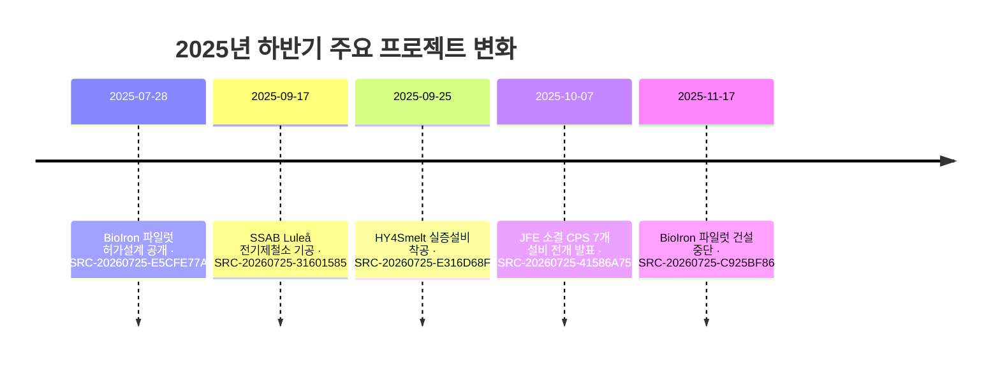

# 2025년 하반기 철강 신기술·프로젝트 동향

> 관찰 기간 **2025-07-01–2025-12-31** · 현재 위키에 등록된 당시 공개자료 기준

!!! abstract "한눈에 보기"

    **핵심 변화 7건** · SSAB와 HY4Smelt는 건설에 들어갔고, JFE는 CPS를 확대했지만
    BioIron은 허가설계 공개 뒤 노 설계 문제로 건설이 중단됐습니다.

## 확인된 변화

| 구분 | 기업·프로젝트 | 확인된 변화 | 현재 상태 해석 |
| --- | --- | --- | --- |
| 허가설계 | Rio Tinto BioIron WA | 1 t/h, 연 약 2,000시간, 최대 12개 microwave horn을 포함한 파일럿 허가설계가 공개됐습니다.[^src-20260725-e5cfe77a] | 설계·허가 수치로 달성 실적이 아닙니다. |
| 건설 중단 | Rio Tinto BioIron WA | 2025년 11월 현재 노 설계의 기술위험과 성능 최적화 필요를 이유로 건설을 중단했습니다.[^src-20260725-c925bf86] | 기술 R&D는 University of Nottingham·Metso와 계속됩니다. |
| 착공 | SSAB Luleå electric mill | 2.5 Mt/y, EUR 4.5 billion 전기제철소 기공식을 열고 건설에 착수했습니다.[^src-20260725-31601585] | 2029년 말 가동 목표이며 실제 시운전은 미완료입니다. |
| 착공 | HY4Smelt Linz | HYFOR 미분광 수소환원과 전기 Smelter를 결합한 3 t/h 실증설비 건설을 시작했습니다.[^src-20260725-e316d68f] | 2027년 말 가동 목표의 통합 실증 단계입니다. |
| 조건부 계획 | Tata Steel Nederland | 정부·지자체와 DRI–EAF 전환 관련 비구속 의향서를 체결했습니다.[^src-20260725-789ab58f] | 초기 천연가스 뒤 바이오메탄·수소 도입 계획으로 FID·착공은 미확정입니다. |
| 생산 적용 확대 | JFE Sinter CPS | 전 고로 CPS 배치 뒤 일본 7개 소결설비로 센서·AI·물리모델 기반 CPS 전개를 발표했습니다.[^src-20260725-41586a75] | 정량 성과와 완전 폐루프 제어 권한은 미공개입니다. |
| CCUS 전략 | POSCO | 코크스오븐 포집 CO2 주입·전환 실증과 설비별 단계적 CCS, HyREX 경로를 함께 제시했습니다.[^src-20260725-ff076fe4] | 고로 자체 CCUS 상용배치 또는 전 설비 적용 근거는 아닙니다. |

## 단계 변화

## AI 분석

!!! note "POSCO 관점 시사점"

    같은 반기 안에서도 허가설계가 건설 중단으로 바뀔 수 있었습니다. 프로젝트 감시는
    발표·허가·FID·착공·통합 시운전·장기운전을 별도 상태로 관리해야 합니다. HY4Smelt는
    HyREX와 가장 직접적인 미분광 수소환원–전기용융 비교대상이므로 처리량보다 원료범위,
    고온이송, 금속화율과 연속운전 데이터를 우선 비교할 필요가 있습니다.

## 추가 검증 필요 항목

- BioIron 재설계와 파일럿 재개 여부
- HY4Smelt·SSAB 공정률과 예산·일정 변화
- Tata Nederland FID와 정부지원 조건
- JFE CPS의 라인별 장기 정량효과

## 근거 자료

[^src-20260725-e5cfe77a]: **BioIron Pilot Plant Works Approval W6964/2024/1 Decision Report** — Western Australia Department of Water and Environmental Regulation, 2025-07-28. [원문](https://www.der.wa.gov.au/images/documents/our-work/licences-and-works-approvals/Decisions_/W6964/W6964%2028-07-2025%20DR.pdf) · [[sources/SRC-20260725-E5CFE77A|보관 원문·메타데이터]]
[^src-20260725-c925bf86]: **Rio Tinto pauses BioIron pilot construction** — Rio Tinto, 2025-11-17. [원문](https://www.riotinto.com/en/news/releases/2025/rio-tinto-partners-with-calix-to-test-low-emissions-steel-making-in-western-australia-pauses-bioiron) · [[sources/SRC-20260725-C925BF86|보관 원문·메타데이터]]
[^src-20260725-31601585]: **SSAB begins construction of new Luleå electric steel mill** — SSAB, 2025-09-17. [원문](https://www.ssab.com/en/news/2025/09/the-deputy-prime-minister-and-ssabs-ceo-broke-ground-on-a-new-steel-mill-in-lule) · [[sources/SRC-20260725-31601585|보관 원문·메타데이터]]
[^src-20260725-e316d68f]: **Construction begins on HYFOR and Smelter demonstration plant** — Primetals Technologies, 2025-09-25. [원문](https://dam.primetals.com/m/6c938163b0f170c0/original/PR2025083472en.pdf) · [[sources/SRC-20260725-E316D68F|보관 원문·메타데이터]]
[^src-20260725-789ab58f]: **Tata Steel Nederland integrated decarbonisation project letter of intent** — Tata Steel, 2025-09-29. [원문](https://www.tatasteel.com/newsroom/press-releases/india/2025/tata-steel-signs-the-non-binding-joint-letter-of-intent-with-the-government-of-the-netherlands-and-the-province-of-north-holland-on-integrated-decarbonisation-and-health-measures-project/) · [[sources/SRC-20260725-789AB58F|보관 원문·메타데이터]]
[^src-20260725-41586a75]: **JFE Steel deploys CPS technology across sintering facilities** — JFE Steel Corporation, 2025-10-07. [원문](https://www.jfe-steel.co.jp/en/release/2025/10/251007.html) · [[sources/SRC-20260725-41586A75|보관 원문·메타데이터]]
[^src-20260725-ff076fe4]: **POSCO decarbonization strategies from CCUS to HyREX** — POSCO Group Newsroom, 2025-10-29. [원문](https://newsroom.posco.com/en/from-ccus-to-hyrex-the-full-lineup-of-posco-groups-decarbonization-strategies-for-a-sustainable-steel-industry/) · [[sources/SRC-20260725-FF076FE4|보관 원문·메타데이터]]
