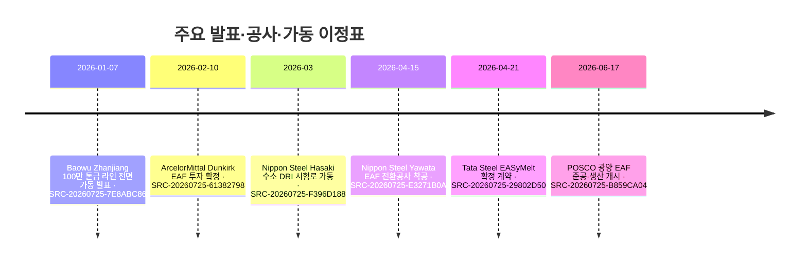

# 2026년 상반기 철강 신기술·프로젝트 동향

> 관찰 기간 **2026-01-01–2026-07-25** · 저장된 Claim 가운데 사업 단계나 경쟁 구도에 의미가 큰 변화를 선별

!!! abstract "한눈에 보기"

    **핵심 변화 7건** · **사람 검토 대기 0건**

    전기로 전환은 대규모 투자·착공·가동 단계로 이동했고, 수소환원과 대체 제철은
    시험로 가동부터 대형 설비 건설까지 단계 차이가 크게 나타났습니다.

## 핵심 변화

| 구분 | 기업·프로젝트 | 확인된 변화 | 현재 해석 |
| --- | --- | --- | --- |
| 가동 | **POSCO 광양 250만 톤 전기로** | 2026년 6월 준공 후 연 250만 톤 규모 저탄소강 생산을 시작했습니다.[^src-20260725-b859ca04] | 고급강용 합탕·스크랩 선별·성분 제어는 후속 양산 성과 확인이 필요합니다. |
| 착공 | **Nippon Steel 일본 3개 거점 EAF 전환** | Yawata 전환공사를 2026년 4월 15일 시작했습니다. 3개 거점 총투자는 JPY 868.7 billion, 생산능력은 약 2.9 Mt/y, 정부지원 한도는 JPY 251.4 billion입니다.[^src-20260725-e3271b0a][^src-20260725-e5bc335b] | Yawata 착공은 확인됐지만 Hirohata·Shunan의 동시 착공을 뜻하지는 않습니다. |
| 가동 발표 | **China Baowu Zhanjiang 수소 샤프트로–전기로 라인** | 중국 국유자산감독관리위원회는 2026년 1월 100만 톤급 수소 기반 샤프트로–전기용융 연계 후판 라인의 전면 가동을 발표했습니다.[^src-20260725-7e8abc86] | 수소의 탄소집약도와 실제 사용 비율은 공개 자료에서 확인되지 않았습니다. |
| 투자 확정 | **ArcelorMittal Dunkirk 대형 전기로** | 연 200만 톤 EAF 건설과 EUR 1.3 billion 투자를 확정했으며 2029년 가동을 목표로 합니다.[^src-20260725-61382798] | 확정된 범위는 EAF이며 신규 수소 DRI 설비 확정으로 확대 해석할 수 없습니다. |
| 건설 | **thyssenkrupp Steel Duisburg tkH2Steel** | 2024년 말 본 공사 착수 후 2026년 2월 직접환원탑 철골 설치 단계에 진입했습니다. 설계능력은 연 250만 톤 DRI, 시운전 목표는 2027년입니다.[^src-20260725-8d0bd4b8] | 초기에는 천연가스를 사용하고 수소망 연결 뒤 수소 비중을 높이는 단계적 전환입니다. |
| 실증 결정 | **Tata Steel Jamshedpur EASyMelt** | 2026년 4월 21일 확정 계약을 체결하고 기존 E 고로를 활용한 단계적 산업 실증 추진으로 이동했습니다.[^src-20260725-29802d50] | 시운전일·CAPEX·완료 운전 결과는 아직 공개되지 않았습니다. |
| 시험로 가동 | **Nippon Steel Hasaki 수소 DRI 시험로** | 저품위 철광석용 수소환원 시험로를 건설해 2026년 3월 운전을 시작했습니다.[^src-20260725-f396d188] | 연구개발 이정표이며 상업 규모 수소환원철 생산 근거는 아닙니다. |

## 단계 변화

## POSCO와 경쟁사 비교

| 비교축 | POSCO | 경쟁사 움직임 | 확인 포인트 |
| --- | --- | --- | --- |
| 대형 EAF | 광양 2.5 Mt/y 생산 개시[^src-20260725-b859ca04] | Nippon Steel 3개 거점 2.9 Mt/y 투자·Yawata 착공,[^src-20260725-e5bc335b][^src-20260725-e3271b0a] ArcelorMittal Dunkirk 2.0 Mt/y 투자 확정[^src-20260725-61382798] | 고급강 품질, 스크랩 조달, 전력 탄소집약도, 실제 가동률 |
| 수소환원 | HyREX 0.3 Mt/y 통합 실증설비 부지 준비[^src-20260725-b859ca04] | Baowu 1.0 Mt/y 라인 가동 발표,[^src-20260725-7e8abc86] thyssenkrupp 2.5 Mt/y DRI 설비 건설,[^src-20260725-8d0bd4b8] Nippon Steel 시험로 가동[^src-20260725-f396d188] | ‘수소 기반’의 실제 수소 비율과 전 과정 배출량을 같은 기준으로 비교 |
| 대체 경로 | HyREX 상용화 기술 개발 목표[^src-20260725-b859ca04] | Tata EASyMelt 산업 실증 결정[^src-20260725-29802d50] | 연속운전, 노 설계, 원료 적응성, 스케일업 일정 |

## AI 분석

!!! note "POSCO 관점 시사점"

    **대형 EAF는 더 이상 계획 비교만으로 차별화하기 어렵습니다.** POSCO는 광양에서
    생산을 시작했지만 Nippon Steel과 ArcelorMittal도 대규모 설비 전환을 실행하고
    있습니다. 다음 비교축은 설비 용량보다 고급강 양산 품질, 합탕 운전, 스크랩 불순물
    제어와 전력 원단위가 되어야 합니다.

    **수소환원 프로젝트의 단계 표기를 통일할 필요가 있습니다.** Baowu의 ‘전면 가동’,
    thyssenkrupp의 ‘건설’, Nippon Steel의 ‘시험로 가동’, POSCO의 ‘부지 준비’는 서로
    다른 성숙 단계입니다. 용량 숫자만 나란히 놓으면 경쟁 우위를 잘못 해석할 수 있습니다.

## 추가 검증 필요 항목

!!! warning "후속 모니터링"

    - Baowu Zhanjiang 라인의 수소 사용 비율, 전력원과 제품당 실제 배출량
    - ArcelorMittal Dunkirk EAF의 실제 착공·주요 설비 발주와 2029 일정 유지 여부
    - thyssenkrupp Duisburg의 2027 시운전 및 지역 수소망 연결 일정
    - Tata Steel EASyMelt의 CAPEX, 시운전일과 단계별 성능 결과
    - Nippon Steel Hasaki 시험로의 저품위광 환원율·연속운전 결과
    - POSCO 광양 EAF의 고급 자동차강·전기강판 양산 실적과 HyREX 부지 공사 진척

## 근거 자료

[^src-20260725-b859ca04]: **POSCO completes Gwangyang EAF and advances HyREX** — POSCO Group Newsroom, 2026-06-22. [원문](https://newsroom.posco.com/en/posco-accelerates-transition-to-decarbonized-production-system-with-completion-of-koreas-largest-electric-arc-furnace/) · [[sources/SRC-20260725-B859CA04|보관 원문·메타데이터]]
[^src-20260725-e3271b0a]: **Nippon Steel starts Yawata large-EAF conversion construction** — Nippon Steel Corporation, 2026-04-15. [원문](https://www.nipponsteel.com/newsroom/news/2026/20260415_100.html) · [[sources/SRC-20260725-E3271B0A|보관 원문·메타데이터]]
[^src-20260725-e5bc335b]: **Nippon Steel investment decision for three-site EAF conversion** — Nippon Steel Corporation, 2025-05-30. [원문](https://www.nipponsteel.com/en/newsroom/news/2025/__icsFiles/afieldfile/2025/09/26/20250530_200.pdf) · [[sources/SRC-20260725-E5BC335B|보관 원문·메타데이터]]
[^src-20260725-7e8abc86]: **China launches first million-tonne near-zero-carbon steel line at Baowu** — State-owned Assets Supervision and Administration Commission of China, 2026-01-07. [원문](https://en.sasac.gov.cn/2026/01/07/c_20292.htm) · [[sources/SRC-20260725-7E8ABC86|보관 원문·메타데이터]]
[^src-20260725-61382798]: **ArcelorMittal confirms €1.3bn Dunkirk EAF construction** — ArcelorMittal, 2026-02-10. [원문](https://corporate.arcelormittal.com/media/news/regulatory-news/arcelormittal-confirms-the-construction-of-an-electric-arc-furnace-in-dunkirk-france-a-13-billion-investment-supporting-an-important-step-in-its-decarbonisation) · [[sources/SRC-20260725-61382798|보관 원문·메타데이터]]
[^src-20260725-8d0bd4b8]: **thyssenkrupp Steel direct-reduction transformation project status** — thyssenkrupp Steel Europe, 게시일 미상. [원문](https://transformation.thyssenkrupp-steel.com/startseite.html) · [[sources/SRC-20260725-8D0BD4B8|보관 원문·메타데이터]]
[^src-20260725-29802d50]: **Tata Steel proceeds with phased EASyMelt industrial demonstration** — Tata Steel, 2026-04-21. [원문](https://www.tatasteel.com/newsroom/press-releases/india/2026/tata-steel-partners-sms-group-to-deploy-world-first-easymelt-decarbonisation-technology/) · [[sources/SRC-20260725-29802D50|보관 원문·메타데이터]]
[^src-20260725-f396d188]: **Nippon Steel FY2025 results: carbon-neutral technology progress** — Nippon Steel Corporation, 2026-06-02. [원문](https://www.nipponsteel.com/en/ir/individual/pdf/20260602_nipponsteel_notice_en.pdf) · [[sources/SRC-20260725-F396D188|보관 원문·메타데이터]]
