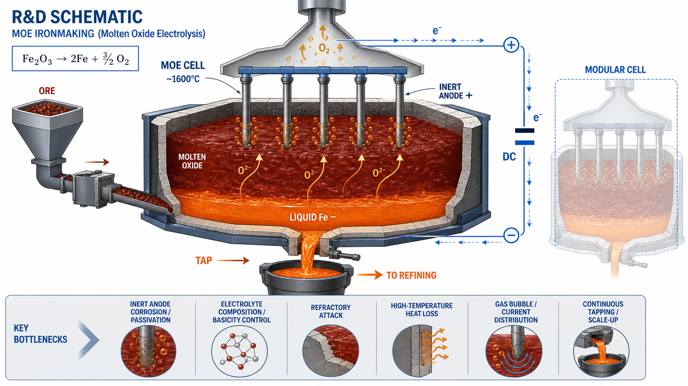

<!-- AUTO-GENERATED BY steel-intelligence. DO NOT EDIT. -->

# MOE Steel: process, scale-up model, and current deployment status

- Source ID: `SRC-20260725-26EA1CBD`
- 발행자: Boston Metal
- 게시일: 미상
- 수집일: 2026-07-25
- 유형: `company_release`
- 신뢰도: `primary`
- 원 URL: <https://www.bostonmetal.com/moe-steel/>

## 설비·공정 이미지

{ .steel-media-image .steel-media-detail }

**AI 재구성.** AI 재구성 — Boston Metal 공개 설명과 학술 근거를 바탕으로 다중 불활성 양극·용융산화물 전해질·액체철 음극 풀·산소 발생·연속 출선을 기능 단위로 재구성한 MOE R&D 공정도. 실제 Woburn 셀 준공도가 아님.

- 출처 [[sources/SRC-20260725-26EA1CBD|SRC-20260725-26EA1CBD]] · 권리 `ai_generated` · [원문 페이지](https://www.bostonmetal.com/moe-steel) · 작성·촬영 OpenAI image generation / Codex
- 권리 메모: Boston Metal 공개 설명과 연결 학술 근거를 바탕으로 생성했습니다. 실제 셀 치수·전극 수명·운전성능을 나타내는 준공도나 실증 증거가 아닙니다.

## 연결된 지식

- [[technologies/TEC-molten-oxide-electrolysis|용융산화물 전기분해 (Molten Oxide Electrolysis)]]

## 보관 원문

> Source evidence excerpt collected 2026-07-25.
>
> Boston Metal describes its MOE Steel process as direct electrolysis of iron ore
> in a molten oxide electrolyte. An inert anode is immersed in the electrolyte and
> the cell is operated at 1600 degrees Celsius. Electricity separates iron oxide
> into oxygen gas and high-purity liquid metal, which is tapped from the bottom and
> can be sent directly to ladle metallurgy.
>
> The company states that this single-step route can replace coke production, ore
> sintering and pelletizing, blast-furnace reduction, and basic-oxygen-furnace
> refining. It claims compatibility with all iron ore grades and says the process
> does not require hydrogen infrastructure, carbon capture, or process water.
>
> The company describes modular cells about the size of a school bus. Capacity is
> scaled first by adding inert anodes within a cell and then by adding cells within
> a plant. Its business model is to license the MOE platform to steelmakers and
> sell the metallic inert anodes. The page states that a multi-inert-anode
> industrial cell produced tonnage steel in 2025, while a separate MOE Steel
> demonstration plant remains a future milestone.
>
> URL: https://www.bostonmetal.com/moe-steel/
