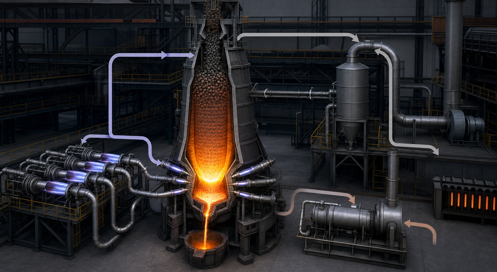

<!-- AUTO-GENERATED BY steel-intelligence. DO NOT EDIT. -->

# Tata Steel proceeds with phased EASyMelt industrial demonstration

- Source ID: `SRC-20260725-29802D50`
- 발행자: Tata Steel
- 게시일: 2026-04-21
- 수집일: 2026-07-25
- 유형: `company_release`
- 신뢰도: `primary`
- 원 URL: <https://www.tatasteel.com/newsroom/press-releases/india/2026/tata-steel-partners-sms-group-to-deploy-world-first-easymelt-decarbonisation-technology/>

## 설비·공정 이미지

{ .steel-media-image .steel-media-compact }

**AI 재구성.** EASyMelt의 고로 상부가스 재순환·코크스오븐가스 개질·플라즈마 가열·열풍구 주입 경로 AI 재구성. Jamshedpur E고로의 준공도가 아님

- 출처 [[sources/SRC-20260725-29802D50|SRC-20260725-29802D50]] · 권리 `ai_generated` · [원문 페이지](https://www.tatasteel.com/newsroom/press-releases/india/2026/tata-steel-partners-sms-group-to-deploy-world-first-easymelt-decarbonisation-technology) · 작성·촬영 OpenAI image generation / Codex
- 권리 메모: Tata Steel과 SMS group의 공식 공정 설명을 바탕으로 생성했으며 실제 개조 설비 배치와 운전 증거로 사용하지 않음

## 연결된 지식

- [[companies/COM-Tata-Steel|Tata Steel]]
- [[projects/PRJ-TATA-JAMSHEDPUR-EASYMELT|Tata Jamshedpur EASyMelt 산업 실증]]

## 보관 원문

> # Tata Steel proceeds with phased EASyMelt industrial demonstration
>
> Tata Steel announced on 2026-04-21 that it had entered definitive agreements
> with Paul Wurth, part of SMS group, for implementation of the first industrial
> EASyMelt demonstration.
>
> The project is planned as a phased conversion of the 649 cubic metre E blast
> furnace at Tata Steel's Jamshedpur Works. Tata Steel states that the project
> aims to reduce carbon dioxide emissions by more than 50 percent relative to the
> blast furnace's baseline operation.
>
> The announcement follows the June 2023 memorandum of understanding and a
> completed front-end loading study. It confirms a decision to proceed with
> implementation and development, but does not disclose a commissioning date,
> capital cost or completed operating result.
>
> URL: https://www.tatasteel.com/newsroom/press-releases/india/2026/tata-steel-partners-sms-group-to-deploy-world-first-easymelt-decarbonisation-technology/
