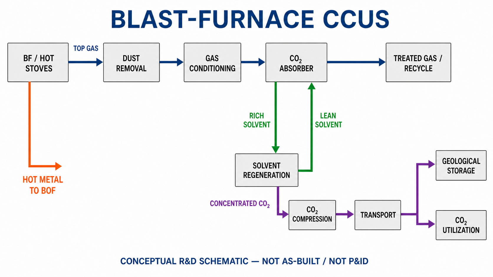

<!-- AUTO-GENERATED BY steel-intelligence. DO NOT EDIT. -->

# Iron and Steel CCS Study — Techno-Economics Integrated Steel Mill

- Source ID: `SRC-20260725-2EABD949`
- 발행자: IEAGHG
- 게시일: 2013-07-01
- 수집일: 2026-07-25
- 유형: `academic`
- 신뢰도: `high`

## 학술 정보

- 자료 구분: 연구보고서
- 저자: IEAGHG
- 게재지·프로시딩: IEAGHG Technical Report 2013/04
- 동료심사: 확인되지 않음
- 원 URL: <https://ieaghg.org/publications/iron-and-steel-ccs-study-techno-economics-integrated-steel-mill/>

## 설비·공정 이미지

{ .steel-media-image .steel-media-detail }

**AI 재구성.** AI 재구성 — 고로 상부가스를 집진·조정한 뒤 용매 흡수로 CO2를 분리하고, rich/lean solvent 재생루프와 재생탑 상부의 농축 CO2 압축·수송·저장/활용 경계를 분리한 대표 구성. 처리 가스의 연료사용·재순환 여부와 포집기술은 사이트별 설계에 따라 달라지며 실제 제철소의 준공도나 P&ID가 아니다.

- 출처 [[sources/SRC-20260725-2EABD949|SRC-20260725-2EABD949]] · 권리 `ai_generated` · [원문 페이지](https://ieaghg.org/publications/iron-and-steel-ccs-study-techno-economics-integrated-steel-mill) · 작성·촬영 OpenAI ImageGen / Codex
- 권리 메모: IEAGHG 통합제철소 CCS 연구와 공개 고로 가스 포집 사례를 바탕으로 2026-07-27 생성한 대표 공정 개념도다. 용매 종류, 포집률, 재생열, 가스 재순환율, 압력과 배관은 특정 설비 성능값이 아니다.

## 연결된 지식

- [[technologies/TEC-blast-furnace-ccus|고로 CCUS]]

## 보관 원문

> # IEAGHG — Iron and Steel CCS Study (2013)
>
> Official publication page:
> https://ieaghg.org/publications/iron-and-steel-ccs-study-techno-economics-integrated-steel-mill/
>
> Publication date: 2013-07-01.
>
> The study compares a reference integrated steel mill with two main capture
> configurations: end-of-pipe post-combustion capture using MEA and an
> oxygen-blown blast furnace with top-gas recycle and MDEA/Pz capture.
>
> The publication summary states that reducing direct BF–BOF emissions by more
> than 50% requires CCS. It also states that post-combustion capture can be
> retrofitted technically, but the associated energy and cost burden can affect
> commercial viability. Oxygen-blown BF and top-gas-recycle configurations still
> require large-scale demonstration and integrated engineering validation.
>
> Interpretation boundary: figures in the report are modeled study cases, not
> measured performance from a commercial BF–CCS installation.
