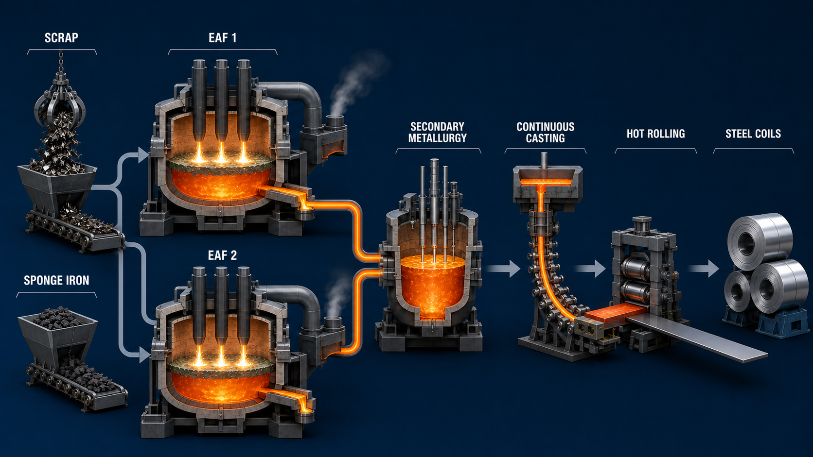

<!-- AUTO-GENERATED BY steel-intelligence. DO NOT EDIT. -->

# SSAB begins construction of new Luleå electric steel mill

- Source ID: `SRC-20260725-31601585`
- 발행자: SSAB
- 게시일: 2025-09-17
- 수집일: 2026-07-25
- 유형: `company_release`
- 신뢰도: `primary`
- 원 URL: <https://www.ssab.com/en/news/2025/09/the-deputy-prime-minister-and-ssabs-ceo-broke-ground-on-a-new-steel-mill-in-lule>

## 설비·공정 이미지

{ .steel-media-image .steel-media-compact }

**실제 설비 사진.** SSAB Luleå 신규 전기제철소 기공식 현장

- 출처 [[sources/SRC-20260725-31601585|SRC-20260725-31601585]] · 권리 `link_only` · [원문 페이지](https://www.ssab.com/en/news/2025/09/the-deputy-prime-minister-and-ssabs-ceo-broke-ground-on-a-new-steel-mill-in-lule) · 작성·촬영 SSAB / official press image
- 권리 메모: SSAB 공식 보도자료의 기공식 사진입니다. 재사용 권한을 별도 확인하지 않아 원문 링크로만 표시합니다.

{ .steel-media-image .steel-media-detail }

**AI 재구성.** AI 재구성 — SSAB Lulea 계획 공정의 스크랩·무화석 스폰지철 병렬 2기 EAF 투입, 2차정련, 연속주조, 열간압연과 코일 생산 흐름. 실제 준공도·배치도·P&ID가 아니다.

- 출처 [[sources/SRC-20260725-31601585|SRC-20260725-31601585]] · 권리 `ai_generated` · [원문 페이지](https://www.ssab.com/en/news/2025/09/the-deputy-prime-minister-and-ssabs-ceo-broke-ground-on-a-new-steel-mill-in-lule) · 작성·촬영 OpenAI ImageGen / Codex
- 권리 메모: SSAB 공식 발표의 2기 EAF, 2차정련, 일관 압연, 무화석 스폰지철·스크랩 사용 Claim을 바탕으로 2026-07-28 생성한 설명용 AI 재구성입니다. 실제 Lulea 설비 준공도나 상세설계가 아닙니다.

## 연결된 지식

- [[companies/COM-SSAB|SSAB]]
- [[projects/PRJ-SSAB-LULEA-ELECTRIC-MILL|SSAB Luleå 신규 전기제철소]]

## 보관 원문

> # SSAB Luleå construction
>
> SSAB held the groundbreaking for its new Luleå mill and stated an end-2029 start-up.
> The €4.5 billion project is designed for 2.5 million tonnes per year with two EAFs,
> advanced secondary metallurgy and integrated rolling. It can use fossil-free sponge
> iron and recycled scrap. SSAB estimated about 3 Mt of annual CO2 reduction after
> replacement of the current blast-furnace route.
