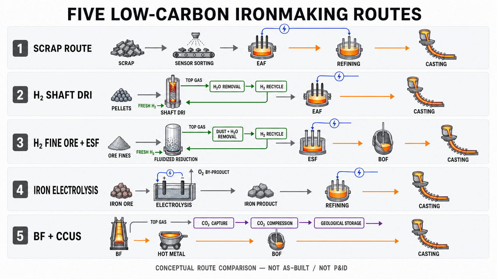

<!-- AUTO-GENERATED BY steel-intelligence. DO NOT EDIT. -->

# Iron and Steel Technology Roadmap

- Source ID: `SRC-20260725-38165ABC`
- 발행자: International Energy Agency
- 게시일: 2020-10-08
- 수집일: 2026-07-25
- 유형: `government`
- 신뢰도: `high`
- 원 URL: <https://www.iea.org/reports/iron-and-steel-technology-roadmap>
- 이전 버전: [[sources/SRC-20260725-2B01239E|SRC-20260725-2B01239E]]

## 설비·공정 이미지

{ .steel-media-image .steel-media-compact }

**실제 설비 사진.** IEA 철강 기술 로드맵 대표 이미지: 철강 소재와 전환 경로를 다루는 공식 보고서 표지 사진

- 출처 [[sources/SRC-20260725-38165ABC|SRC-20260725-38165ABC]] · 권리 `link_only` · [원문 페이지](https://www.iea.org/reports/iron-and-steel-technology-roadmap) · 작성·촬영 International Energy Agency / source-page credited stock image
- 권리 메모: IEA 공식 보고서 페이지의 대표 이미지입니다. 재사용 권한을 별도 확인하지 않아 다운로드하지 않고 원문 링크로만 표시합니다.

{ .steel-media-image .steel-media-detail }

**AI 재구성.** AI 재구성 — 미래 저탄소 제철의 5개 대표 경로를 동일한 경계로 비교한 포트폴리오 지도: 고급 스크랩-EAF, H2 shaft-DRI-EAF, H2 미분광 유동층-ESF-BOF, 철광석 직접 전해-정련, BF-BOF+CCUS. 회색은 고체, 녹색은 H2, 청색은 전력, 주황색은 용융금속, 보라색은 CO2 계통으로 구분했으며 개별 프로젝트의 준공도나 우열·배출량 순위를 뜻하지 않는다.

- 출처 [[sources/SRC-20260725-38165ABC|SRC-20260725-38165ABC]] · 권리 `ai_generated` · [원문 페이지](https://www.iea.org/reports/iron-and-steel-technology-roadmap) · 작성·촬영 OpenAI ImageGen / Codex
- 권리 메모: IEA 철강 기술 로드맵과 이 Wiki의 기술별 1차 근거를 종합해 2026-07-27 생성한 비교용 AI 재구성이다. 각 경로의 실제 에너지·배출·원료·제품 품질과 상용성은 사이트별 조건 및 하위 기술 페이지 근거로 별도 판단해야 한다.

## 연결된 지식

- [[technologies/TEC-low-carbon-ironmaking|저탄소 제철 종합 경로 (Low-carbon Ironmaking)]]

## 보관 원문

> # IEA Iron and Steel Technology Roadmap
>
> The IEA describes steel decarbonisation as a portfolio problem rather than a
> single-technology substitution. Hydrogen, CCUS, bioenergy, direct
> electrification, material efficiency and recycling all contribute, while the
> regional mix depends on energy prices, raw-material availability, technology
> costs and policy.
>
> Scrap-based electric-furnace steel requires roughly one eighth of the energy of
> ore-based production, but scrap availability grows with in-use steel stocks and
> cannot remove the need for primary iron production. The Sustainable Development
> Scenario therefore combines increasing scrap use with hydrogen DRI, CCUS-equipped
> routes and other innovative processes.
>
> In the scenario, renewable electricity at USD 20-30/MWh can provide a competitive
> advantage to hydrogen DRI. Following market introduction, roughly one hydrogen
> DRI plant per month is required, while steel-sector electricity demand rises by
> 720 TWh by 2050. CCUS deployment reaches about 0.4 Gt CO2 captured in 2050,
> equivalent to a 1 MtCO2/year installation every two to three weeks from 2030.
>
> The route definitions distinguish commercial DRI-EAF using gas or coal, 100%
> electrolytic-hydrogen DRI-EAF, innovative BF-BOF and smelting-reduction routes
> with CCUS, and scrap-based electric furnaces. These categories should not be
> collapsed into one “green steel” label because their residual and upstream
> emissions differ.
