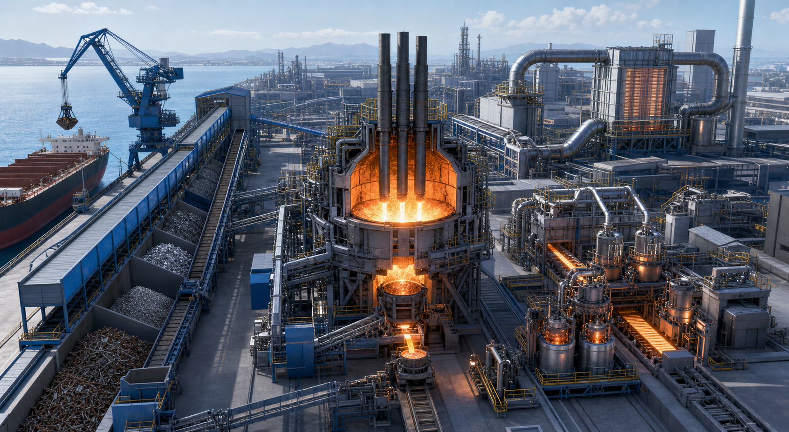

<!-- AUTO-GENERATED BY steel-intelligence. DO NOT EDIT. -->

# JFE Steel to introduce advanced large-scale EAF at Kurashiki

- Source ID: `SRC-20260725-38762376`
- 발행자: JFE Steel Corporation
- 게시일: 2025-04-10
- 수집일: 2026-07-25
- 유형: `company_release`
- 신뢰도: `primary`
- 원 URL: <https://www.jfe-steel.co.jp/en/release/2025/04/250410.html>

## 설비·공정 이미지

{ .steel-media-image .steel-media-compact }

**AI 재구성.** Kurashiki 대형 EAF의 부두·냉철원 물류·스크랩/DRI 용해·노외정련 통합 경로 AI 재구성. 실제 JFE 준공도가 아님

- 출처 [[sources/SRC-20260725-38762376|SRC-20260725-38762376]] · 권리 `ai_generated` · [원문 페이지](https://www.jfe-steel.co.jp/en/release/2025/04/250410.html) · 작성·촬영 OpenAI image generation / Codex
- 권리 메모: JFE 공식 투자 발표의 설비 범위를 바탕으로 생성했으며 실제 배치·공사진척·성능의 증거로 사용하지 않음

## 연결된 지식

- [[companies/COM-JFE-Steel|JFE Steel]]
- [[projects/PRJ-JFE-KURASHIKI-LARGE-EAF|JFE Kurashiki 대형 고효율 전기로]]

## 보관 원문

> # JFE Steel Kurashiki advanced large-scale electric arc furnace
>
> JFE Steel announced on 2025-04-10 that it had decided to construct and operate
> an advanced high-efficiency large-scale electric arc furnace at the Kurashiki
> facility of West Japan Works.
>
> The announced project scope includes the electric arc furnace, off-site
> refining facilities, cold-iron-source distribution facilities and an upgraded
> quay. Total investment is JPY 329.4 billion, of which a maximum JPY 104.5
> billion is expected to be covered by a Japanese government grant.
>
> The EAF is designed for about 2 million tonnes of steel per year and is expected
> to start production in the first quarter of the fiscal year beginning April
> 2028. JFE plans to combine scrap and low-carbon direct-reduced iron with
> high-grade and high-efficiency melting technologies to supply electrical steel
> sheet and high-tensile steel.
>
> The release records an approved investment and construction decision. It does
> not provide evidence of completed construction or operation.
>
> URL: https://www.jfe-steel.co.jp/en/release/2025/04/250410.html
