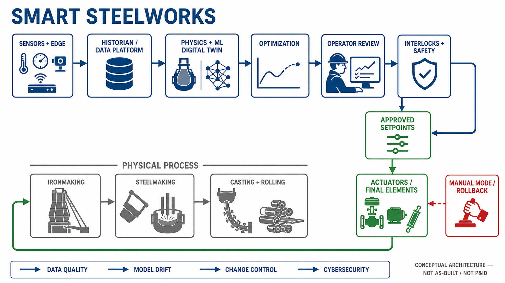

<!-- AUTO-GENERATED BY steel-intelligence. DO NOT EDIT. -->

# JFE Steel deploys CPS technology across sintering facilities

- Source ID: `SRC-20260725-41586A75`
- 발행자: JFE Steel Corporation
- 게시일: 2025-10-07
- 수집일: 2026-07-25
- 유형: `company_release`
- 신뢰도: `primary`
- 원 URL: <https://www.jfe-steel.co.jp/en/release/2025/10/251007.html>

## 설비·공정 이미지

{ .steel-media-image .steel-media-detail }

**공정 개념도.** 소결기 내부 연소·열 상태를 센서, 기계학습, 물리 시뮬레이션으로 예측하고 최적 조작으로 되먹임하는 JFE 소결 CPS 구성도

- 출처 [[sources/SRC-20260725-41586A75|SRC-20260725-41586A75]] · 권리 `link_only` · [원문 페이지](https://www.jfe-steel.co.jp/en/release/2025/10/251007.html) · 작성·촬영 JFE Steel Corporation
- 권리 메모: JFE Steel 공식 발표의 Figure 1 원본을 확인했습니다. 재사용 권한을 별도 확인하지 않아 원격 링크로만 표시합니다.

{ .steel-media-image .steel-media-detail }

**공정 개념도.** 제철소 센서·운전데이터에서 사이버 모델·AI로 올라가 운전지침과 로봇 자동화로 되돌아오는 JFE 지능형 제철소 CPS 전체 구조

- 출처 [[sources/SRC-20260725-41586A75|SRC-20260725-41586A75]] · 권리 `link_only` · [원문 페이지](https://www.jfe-steel.co.jp/en/release/2025/10/251007.html) · 작성·촬영 JFE Steel Corporation
- 권리 메모: JFE Steel 공식 발표의 Figure 2 원본을 확인했습니다. 재사용 권한을 별도 확인하지 않아 원격 링크로만 표시합니다.

{ .steel-media-image .steel-media-detail }

**AI 재구성.** AI 재구성 — 센서·historian·물리+ML 디지털 트윈·최적화·운전자 검토·안전 인터록·승인 setpoint·actuator를 단일 제어 경로로 연결하고 수동모드·rollback을 분리한 스마트 제철소 참조 아키텍처. 전면 무인 운전이나 모든 설비의 자동 폐루프 적용을 뜻하지 않는다.

- 출처 [[sources/SRC-20260725-41586A75|SRC-20260725-41586A75]] · 권리 `ai_generated` · [원문 페이지](https://www.jfe-steel.co.jp/en/release/2025/10/251007.html) · 작성·촬영 OpenAI ImageGen / Codex
- 권리 메모: JFE Steel CPS 공개 사례와 일반적인 OT 안전 경계를 종합해 2026-07-27 생성한 개념 아키텍처다. 특정 제철소의 실제 네트워크, 제어로직, as-built 또는 P&ID가 아니다.

## 연결된 지식

- [[companies/COM-JFE-Steel|JFE Steel]]
- [[projects/PRJ-JFE-SINTER-CPS-ROLLOUT|JFE 일본 7개 소결설비 CPS 전개]]
- [[technologies/TEC-smart-steelworks|스마트 제철소 (Smart Steelworks)]]

## 보관 원문

> # JFE Steel intelligent steelworks deployment
>
> JFE Steel began deploying cyber-physical-system technology at all seven sinter
> production facilities in Japan. The system combines sensor data, statistical models
> and thermochemical physical models for real-time prediction. JFE said CPS deployment
> for all blast-furnace processes was already complete and that it was extending CPS
> across manufacturing processes. Reported objectives and results include stable quality,
> productivity improvement and reduced coke use and GHG emissions.
