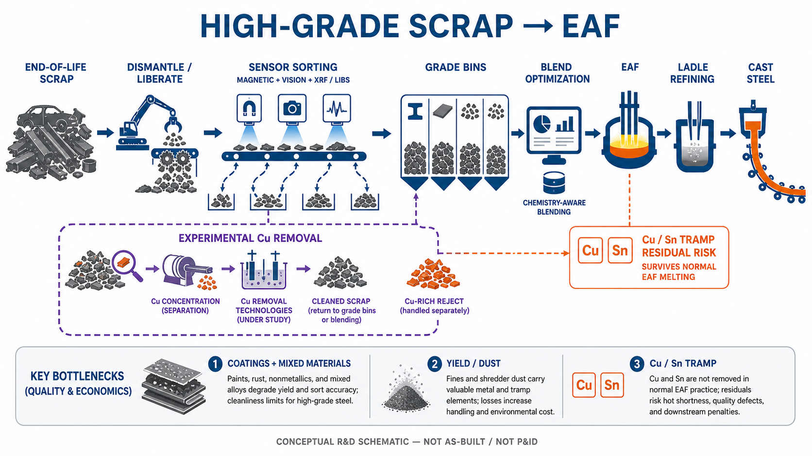

<!-- AUTO-GENERATED BY steel-intelligence. DO NOT EDIT. -->

# Finding the Most Efficient Way to Remove Residual Copper from Steel Scrap

- Source ID: `SRC-20260725-4366E5B1`
- 발행자: Springer Nature / Metallurgical and Materials Transactions B
- 게시일: 2019-02-27
- 수집일: 2026-07-25
- 유형: `academic`
- 신뢰도: `high`

## 학술 정보

- 자료 구분: 학술지 논문
- 저자: Katrin E. Daehn, André Cabrera Serrenho, Julian Allwood
- 게재지·프로시딩: Metallurgical and Materials Transactions B
- DOI: [10.1007/s11663-019-01537-9](https://doi.org/10.1007/s11663-019-01537-9)
- 동료심사: 동료심사 완료
- 원 URL: <https://link.springer.com/article/10.1007/s11663-019-01537-9>

## 설비·공정 이미지

{ .steel-media-image .steel-media-detail }

**AI 재구성.** AI 재구성 — 폐스크랩 해체·센서 선별·강종별 bin·조성 기반 배합·EAF·정련 흐름과 실험적 탈동 분기를 구분한 개념도.

- 출처 [[sources/SRC-20260725-4366E5B1|SRC-20260725-4366E5B1]] · 권리 `ai_generated` · [원문 페이지](https://link.springer.com/article/10.1007/s11663-019-01537-9) · 작성·촬영 OpenAI ImageGen
- 권리 메모: 공개 기술 근거를 바탕으로 2026-07-27 생성. 탈동 분기는 연구·실증 중인 경로이며 상용 표준공정이 아니다.

## 연결된 지식

- [[technologies/TEC-high-grade-eaf-and-scrap-impurity-removal|고급강 EAF·스크랩 불순물 제거]]

## 보관 원문

> # Finding the Most Efficient Way to Remove Residual Copper from Steel Scrap
>
> Daehn, Serrenho and Allwood evaluate the full set of physical and chemical
> routes proposed for removing residual copper from steel scrap and molten
> steel. They report that end-of-life shredded scrap typically contains about
> 0.4 wt% Cu, while many flat products require less than 0.1 wt% Cu. Copper
> wiring becomes entangled with ferrous fragments during hammer shredding, and
> magnetic separation does not completely remove it.
>
> The authors distinguish solid-scrap separation from treatment after melting.
> Separation before mixing is generally more efficient, but physical separation
> depends on how well copper-bearing objects are liberated during shredding.
> Once copper is dissolved in molten steel it cannot be removed by the ordinary
> oxidizing-slag practice because iron oxidizes preferentially.
>
> Candidate routes assessed in the paper include higher-density shredding and
> physical separation, preferential melting, oxygen embrittlement, chlorination,
> ammonia leaching, vacuum distillation, sulfide slag or matte treatment,
> filtration, and solidification segregation. At publication, no commercial
> copper extraction process beyond hand picking was established for copper
> attached during shredding. Improved shredding and physical separation had
> been demonstrated at scale, whereas most chemical and melt-treatment routes
> were based on laboratory work, proposed reactors, or special low-volume
> practice.
>
> Vacuum distillation could be technically viable if radiation heat losses are
> controlled, but vacuum arc remelting is an additional low-throughput,
> energy-intensive remelting step used commercially for special steels.
> High-temperature solid-scrap treatments can require less energy than
> melt-treatment routes, but their effectiveness on realistic heterogeneous
> shredded scrap had not been confirmed. Sulfide-slag routes and reactive-gas
> routes may also require corrective downstream treatments because they can
> alter carbon, sulfur, or nitrogen in the steel.
>
