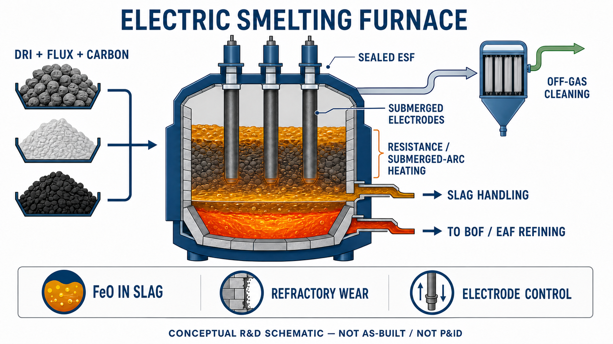

<!-- AUTO-GENERATED BY steel-intelligence. DO NOT EDIT. -->

# Pathways to decarbonisation: the electric smelting furnace

- Source ID: `SRC-20260725-6EC0DF4D`
- 발행자: BHP
- 게시일: 2023-06-16
- 수집일: 2026-07-25
- 유형: `company_release`
- 신뢰도: `primary`
- 원 URL: <https://www.bhp.com/news/bhp-insights/2023/06/pathways-to-decarbonisation-episode-seven-the-electric-smelting-furnace>

## 설비·공정 이미지

{ .steel-media-image .steel-media-detail }

**공정 개념도.** BHP가 공개한 4개 1차 제철 경로 비교도 — DRI–ESF 경로 포함

- 출처 [[sources/SRC-20260725-6EC0DF4D|SRC-20260725-6EC0DF4D]] · 권리 `link_only` · [원문 페이지](https://www.bhp.com/news/bhp-insights/2023/06/pathways-to-decarbonisation-episode-seven-the-electric-smelting-furnace) · 작성·촬영 BHP
- 권리 메모: BHP 공식 기술 설명 페이지의 원본 그림을 외부 링크로만 표시하며 복제 권한은 별도 확인하지 않음

{ .steel-media-image .steel-media-detail }

**AI 재구성.** AI 재구성 — DRI·flux·탄소원을 밀폐형 ESF에 투입하고 침지 전극의 저항·서브머지드 아크 가열로 환원·용융해 상부 슬래그와 하부 탄소함유 용선을 분리 출탕하는 개념도. 후단 BOF/EAF 정련, 배가스 정제와 FeO-in-slag·내화물·전극제어의 핵심 운전변수를 표시했으며 실제 NeoSmelt·Metso 설비의 준공도나 P&ID가 아니다.

- 출처 [[sources/SRC-20260725-6EC0DF4D|SRC-20260725-6EC0DF4D]] · 권리 `ai_generated` · [원문 페이지](https://www.bhp.com/news/prospects/2023/06/pathways-to-decarbonisation-episode-seven-the-electric-smelting-furnace) · 작성·촬영 OpenAI ImageGen / Codex
- 권리 메모: BHP ESF 설명과 Metso Pori DRI smelting furnace 공개사양을 종합해 2026-07-27 생성한 기술 설명용 AI 재구성이다. 특정 공급사의 전극 배치, 노체 형상, 내화물 설계, 실제 유동 또는 성능을 보증하지 않는다.

## 연결된 지식

- [[technologies/TEC-electric-smelting-furnace|전기용융로 (Electric Smelting Furnace)]]

## 보관 원문

> # BHP technical explanation of the electric smelting furnace
>
> BHP explains the DRI–ESF route as a sequence of direct reduction, electric
> smelting and downstream refining. The DRI unit removes oxygen without melting
> the ore. The ESF then supplies electrical heat, completes reduction of residual
> iron oxide with a limited carbon addition, melts the metallic iron and gangue,
> and separates hot metal from slag. The hot metal still requires refining in a
> BOF or EAF; it is not liquid steel ready for casting.
>
> Unlike a batch scrap-melting EAF, the described ESF is sealed against air
> ingress, maintains reducing conditions, continuously receives DRI and flux, and
> periodically taps hot metal and slag without stopping. Electrodes are operated
> so the current path, power density and metallurgical zone differ from an EAF.
> The feed forms a gradually reducing and melting layer around the electrodes and
> above the metal and slag baths.
>
> BHP identifies submerged arc furnaces (SAF) and open slag bath furnaces (OSBF)
> as prominent ESF types. It describes ESF feed flexibility across DRI pellets,
> fines, lump and briquettes, including medium-grade Pilbara ores. This is a
> company technical position rather than an independent industrial guarantee.
>
> BHP states that EAF-quality DRI generally uses ore above 67% Fe with less than
> 2.5% gangue, low phosphorus, very high metallisation and significant scrap
> dilution. For the ESF route, it estimates that DRI metallisation could be
> reduced to 80–85%, which may ease the sticking problems encountered above 90%
> metallisation and make fluid-bed reduction of fines more compatible with the
> route. This operating window still needs pilot and scale-up validation.
>
> The resulting hot metal and slag are intended to resemble blast-furnace
> products. BHP expects lower iron loss to slag than in high-DRI EAF operation,
> with phosphorus managed in downstream refining. It estimates 0.05–0.08 tonnes
> of carbon per tonne of crude steel remains necessary in the route, equivalent
> to 0.18–0.29 tonnes of carbon dioxide if oxidised.
>
> BHP estimates 250–330 kg of slag per tonne of ESF hot metal and identifies a
> potential cement-substitution benefit of 150–200 kg CO2 per tonne of hot metal,
> assuming one-for-one slag replacement of Portland cement. Both values are
> scenario estimates, not measurements from a commercial low-emissions ESF.
>
> The company notes that the component technologies are mature in ferroalloy,
> titania and nickel applications, but that metallurgy, engineering and
> operations for low-emissions ironmaking from Pilbara-type ore remain
> insufficiently characterised. It therefore treats pilot operation as necessary
> before commercial deployment.
>
