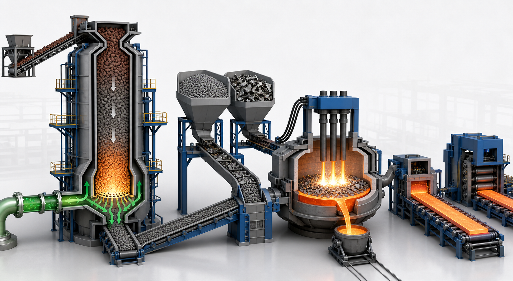

<!-- AUTO-GENERATED BY steel-intelligence. DO NOT EDIT. -->

# China Baowu green development report: Zhanjiang hydrogen shaft furnace

- Source ID: `SRC-20260725-7D498404`
- 발행자: China Baowu Steel Group Corporation Limited
- 게시일: 2025-08-18
- 수집일: 2026-07-25
- 유형: `company_ir`
- 신뢰도: `primary`
- 원 URL: <https://res.baowugroup.com/attach/2025/08/18/a284678855c94f6ab74f2d394d80042f.pdf>

## 설비·공정 이미지

{ .steel-media-image .steel-media-compact }

**AI 재구성.** Zhanjiang 수소 기반 샤프트로-DRI·스크랩-전기로-슬래브 압연 경로의 출처 기반 AI 재구성; 실제 준공도나 설비 사진이 아님

- 출처 [[sources/SRC-20260725-7D498404|SRC-20260725-7D498404]] · 권리 `ai_generated` · [원문 페이지](https://res.baowugroup.com/attach/2025/08/18/a284678855c94f6ab74f2d394d80042f.pdf) · 작성·촬영 OpenAI image generation / Codex
- 권리 메모: China Baowu 공식 보고서와 SASAC 공정 설명을 바탕으로 생성한 AI 재구성. 실제 Zhanjiang 설비 형상 증거로 사용하지 않음

## 연결된 지식

- [[projects/PRJ-BAOWU-ZHANJIANG-H2-SHAFT-EAF|China Baowu Zhanjiang 수소 샤프트로–전기로 라인]]

## 보관 원문

> # China Baowu 2024-2025 Green and Low-Carbon Report: Zhanjiang hydrogen shaft furnace
>
> China Baowu reports that Baosteel Zhanjiang Iron & Steel's first domestic
> million-tonne-class hydrogen-based shaft furnace was ignited and put into
> operation on 2023-12-23. The demonstration line is designed to integrate
> multiple gas sources and ultimately use full hydrogen for industrial direct
> reduced iron production.
>
> On 2024-08-22 the million-tonne-class shaft furnace completed a weekly capacity
> performance evaluation after 168 hours of continuous full-load production.
> China Baowu reports that a high-hydrogen operating condition with 70 percent
> hydrogen content was verified and that operating indicators exceeded design
> values. The disclosed report does not provide the individual measured values,
> product metallization, energy intensity, or independently verified carbon
> intensity.
>
> The same report states that China Baowu is advancing commercialization of a
> 2,500 cubic metre hydrogen-rich carbon-recycling oxygen blast furnace and
> industrial trials at the Zhanjiang hydrogen-based shaft furnace. Those two
> routes should not be treated as the same project.
