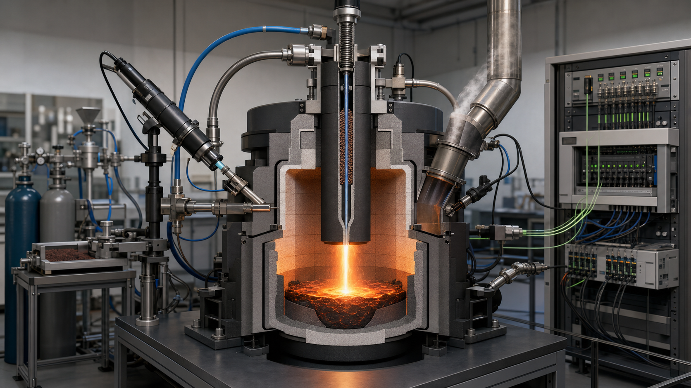

<!-- AUTO-GENERATED BY steel-intelligence. DO NOT EDIT. -->

# LIGHTBOW: Model-based control in metallurgical arc-plasma processes

- Source ID: `SRC-20260725-973F138F`
- 발행자: Austrian Research Promotion Agency (FFG)
- 게시일: 미상
- 수집일: 2026-07-25
- 유형: `government`
- 신뢰도: `primary`
- 원 URL: <https://projekte.ffg.at/projekt/5122268>

## 설비·공정 이미지

{ .steel-media-image .steel-media-compact }

**AI 재구성.** LIGHTBOW 수소 플라즈마 용융환원 반응기·계측제어 연구 구성의 출처 기반 AI 재구성; 실제 연구장치 사진이 아님

- 출처 [[sources/SRC-20260725-973F138F|SRC-20260725-973F138F]] · 권리 `ai_generated` · [원문 페이지](https://www.k1-met.com/en/lightbow) · 작성·촬영 OpenAI image generation; Codex research reconstruction
- 권리 메모: LIGHTBOW 공식 연구 설명과 Wiki의 검증된 제어·계측 Claim을 바탕으로 생성한 설명용 재구성입니다. 실제 실험장치 사진이나 제작도면이 아닙니다.

## 연결된 지식

- [[projects/PRJ-LIGHTBOW-HPSR-CONTROL|LIGHTBOW HPSR 아크 제어 연구]]
- [[technologies/TEC-hydrogen-plasma-smelting-reduction|수소 플라즈마 용융환원 (HPSR)]]

## 보관 원문

> # FFG LIGHTBOW project record
>
> The Austrian Research Promotion Agency records LIGHTBOW as an active project
> on simulation and experimental foundations for model-based control of
> metallurgical arc-plasma processes. The project runs from 2024-07-01 through
> 2026-12-31.
>
> For SuSteel follow-up HPSR, a mixture of argon, hydrogen, and ore particles is
> fed through a hollow electrode into a vessel. The direct-current arc burns
> between the electrode and molten bath. Hydrogen is activated as reductant and
> electrical power is converted to melting heat.
>
> The government project description identifies precise arc-power control
> during continuous hydrogen and ore feed as an unresolved challenge. The work
> combines experiments and numerical simulation to derive a model intended for
> integration into the process-control strategy. K1-MET coordinates the project
> with Universität Linz, Pirhofer Automation, voestalpine Stahl, and
> voestalpine Stahl Donawitz.
