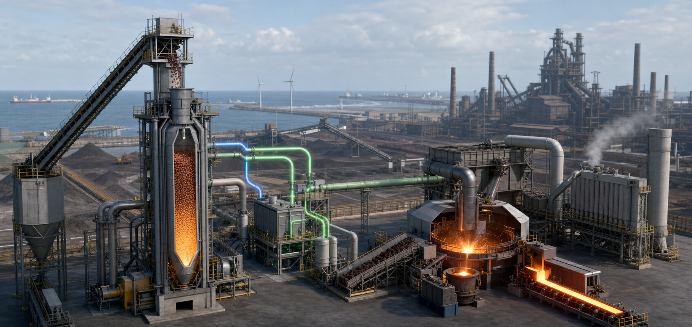

<!-- AUTO-GENERATED BY steel-intelligence. DO NOT EDIT. -->

# Tata Steel Nederland 2025-2026 Green Steel Project status

- Source ID: `SRC-20260725-E71081D1`
- 발행자: Tata Steel Nederland
- 게시일: 2026-05-01
- 수집일: 2026-07-25
- 유형: `company_ir`
- 신뢰도: `primary`
- 원 URL: <https://www.tatasteel.com/media/25923/tsnbv-fy-25-26.pdf>

## 설비·공정 이미지

{ .steel-media-image .steel-media-compact }

**AI 재구성.** IJmuiden Green Steel 1단계의 DRP–EAF·스크랩 통합 전환 경로 AI 재구성. 최종 설계나 착공 완료 상태를 나타내지 않음

- 출처 [[sources/SRC-20260725-E71081D1|SRC-20260725-E71081D1]] · 권리 `ai_generated` · [원문 페이지](https://www.tatasteel.com/media/25923/tsnbv-fy-25-26.pdf) · 작성·촬영 OpenAI image generation / Codex
- 권리 메모: Tata Steel Nederland 연차보고서의 계획 범위를 바탕으로 생성했으며 FID·준공도·실제 공사진척의 증거가 아님

## 연결된 지식

- [[projects/PRJ-TATA-IJMUIDEN-DRP-EAF|Tata Steel IJmuiden DRP–EAF 전환]]

## 보관 원문

> # Tata Steel Nederland 2025-2026 Green Steel Project status
>
> Tata Steel Nederland's 2025-2026 annual report describes the Green Steel
> Project Phase 1 at IJmuiden as a planned transition to direct-reduction and
> electric-arc-furnace steelmaking.
>
> The phase-one scope is to replace Blast Furnace 7 and Coke and Gas Plant 2 with
> a direct reduction plant and an electric arc furnace. The report also retains
> a 2030 target to increase recycled material in the metallic charge from the
> 2019 reference level of 17 percent to 30 percent.
>
> The annual report describes project development and future actions. It does not
> confirm a final investment decision, construction start, capital cost or a firm
> commissioning date for the DRP-EAF facilities.
>
> URL: https://www.tatasteel.com/media/25923/tsnbv-fy-25-26.pdf
