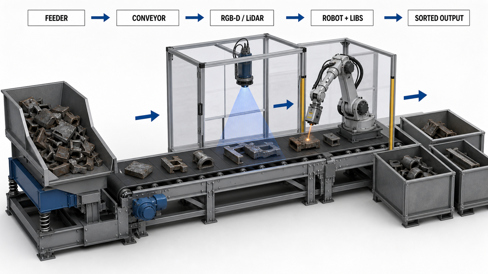

<!-- AUTO-GENERATED BY steel-intelligence. DO NOT EDIT. -->

# PURESCRAP results and amended schedule

- Source ID: `SRC-20260728-E41E2371`
- 발행자: European Commission CORDIS
- 게시일: 2026-05-03
- 수집일: 2026-07-28
- 유형: `government`
- 신뢰도: `primary`
- 원 URL: <https://cordis.europa.eu/project/id/101092168/results>

## 설비·공정 이미지

{ .steel-media-image .steel-media-detail }

**AI 재구성.** AI 기능 재구성 — PURESCRAP 공개 결과가 설명한 중량 스크랩 시험라인의 진동 피더·컨베이어·RGB-D/LiDAR·로봇 LIBS 분석·분류 용기 구성을 재구성했다. 실제 설치 설비의 준공도나 성능 검증 그림이 아니다.

- 출처 [[sources/SRC-20260728-E41E2371|SRC-20260728-E41E2371]] · 권리 `ai_generated` · [원문 페이지](https://cordis.europa.eu/project/id/101092168/results) · 작성·촬영 OpenAI ImageGen / Codex
- 권리 메모: 2026-07-28 생성. CORDIS 공개 결과와 D2.2 공개 설명의 기능 구성만 반영했으며 제한된 공식 도면을 복제하지 않았다. 실제 설치 치수·배치·성능을 확정하지 않는다.

## 연결된 지식

- [[projects/PRJ-PURESCRAP-EU-SCRAP-PURITY|EU PURESCRAP 스크랩 순도 검증]]

## 보관 원문

> # CORDIS 2026 PURESCRAP results and amended schedule
>
> - Title: Purity improvement of scrap metal - Results
> - Publisher: European Commission CORDIS
> - Last updated: 2026-05-03
> - URL: https://cordis.europa.eu/project/id/101092168/results
> - Collected: 2026-07-28
>
> ## Verified project record
>
> - CORDIS identifies PURESCRAP as grant agreement **101092168**, starting
>   **2023-01-01** and ending **2027-03-31**.
> - The project record reports total cost of **EUR 6,181,056.25** and an EU
>   contribution of **EUR 4,997,059.75**.
> - The results page lists **12 public documents/reports**, two
>   demonstrator/prototype records and one data-management plan.
>
> ## Verified progress signals
>
> - Public results include a second intermediate KPI monitoring report and an
>   intermediate report on melting and quality-steel production with increased
>   post-consumer scrap.
> - The melting report description says PURESCRAP-processed scrap is sent to the
>   TechMet demonstration plant at VASD for EAF-process simulation.
> - Public demonstrator records include functional configurations for both the
>   heavy-scrap and shredded-scrap sensor stations.
> - The heavy-scrap deliverable D2.2, submitted 2024-07-10, describes a pilot
>   analysis line consisting of a vibratory feeder, conveyor, sensor module and
>   steel container. The sensor module combines LiDAR/RGB-D vision, a robot and
>   LIBS analysis.
>
> ## Cross-check and interpretation boundary
>
> - The 2024 D2.2 deliverable still printed the then-current project end date as
>   2026-06-30, while the CORDIS record updated on 2026-05-03 reports
>   2027-03-31. This is evidence of a schedule amendment, not proof that all
>   deliverables were completed.
> - The newer CORDIS contract database is the stronger source for the current
>   grant end date. The older consortium document remains valid evidence for the
>   sensor-station design and its historical schedule.
> - Public deliverable titles and descriptions show ongoing validation activity;
>   they do not by themselves prove the target scrap-share, quality or CO2 KPIs
>   have been achieved.
>
> ## Image-rights boundary
>
> - D2.2 pages 10-13 contain useful official layouts and schematics of the
>   heavy-scrap sensor station.
> - The document states that it may not be copied, reproduced or modified without
>   written permission from the coordinator and consortium. The figures therefore
>   must not be downloaded into the Wiki or used as a local representative image
>   without permission. They may be cited and linked as source material.
