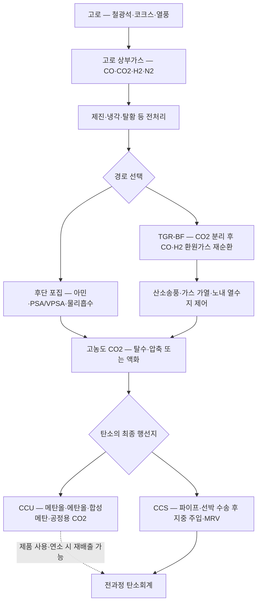

<!-- AUTO-GENERATED BY steel-intelligence. DO NOT EDIT. -->

# 고로 CCUS

> 조사 기준일: **2026-07-28** · 공식·1차 자료 중심 · 사실과 AI 분석을 구분해 작성

??? info "관련 기술 바로가기 · 현재 위치: 기존 설비·순환 경로"

    탐색을 위한 편의 분류이며 기술 우열이나 확정된 공정 관계를 뜻하지 않습니다.

    **환원·용융 경로**

    [[technologies/TEC-hydrogen-direct-reduced-iron|수소 직접환원철 (Hydrogen DRI)]] · [[technologies/TEC-hydrogen-based-fine-ore-reduction|무펠릿 미분광 수소환원 (Fluidized-bed Hydrogen Reduction)]] · [[technologies/TEC-zesty-hydrogen-flash-reduction|ZESTY 수소 직접 플래시 환원]] · [[technologies/TEC-electric-smelting-furnace|전기용융로 (Electric Smelting Furnace)]] · [[technologies/TEC-hisarna-cyclone-smelting-reduction|HIsarna 사이클론 용융환원]] · [[technologies/TEC-hydrogen-plasma-smelting-reduction|수소 플라즈마 용융환원 (HPSR)]] · [[technologies/TEC-microwave-biomass-ironmaking|마이크로웨이브·바이오매스 환원제철 (BioIron)]]

    **전해 기반 경로**

    [[technologies/TEC-molten-oxide-electrolysis|용융산화물 전기분해 (Molten Oxide Electrolysis)]] · [[technologies/TEC-low-temperature-aqueous-iron-electrolysis|저온 수계 전해제철 (Aqueous Iron Electrolysis)]]

    **기존 설비·순환 경로**

    **고로 CCUS · 현재** · [[technologies/TEC-high-grade-eaf-and-scrap-impurity-removal|고급강 EAF·스크랩 불순물 제거]]

    **통합·운영 기술**

    [[technologies/TEC-low-carbon-ironmaking|저탄소 제철 종합 경로 (Low-carbon Ironmaking)]] · [[technologies/TEC-smart-steelworks|스마트 제철소 (Smart Steelworks)]]

{ .steel-media-image .steel-hero-image .steel-media-compact }

*대표 이미지 — Tata Steel Jamshedpur 5 TPD 고로가스 CO2 포집설비 공식 사진 (실제 설비 사진 · 권리 `link_only` · 출처 [[sources/SRC-20260725-46A2055D|SRC-20260725-46A2055D]] · [원문 페이지](https://www.tatasteel.com/media/newsroom/press-releases/india/2021/tata-steel-commissions-india-s-first-plant-for-co2-capture-from-blast-furnace-gas-at-jamshedpur))*

!!! abstract "한눈에 보기"

    | 항목 | 내용 |
    | --- | --- |
    | **분류 (편집)** | 기존 BF–BOF 자산의 잔존탄소 포집·순환·저장 |
    | **핵심 원리** | 고로가스 또는 통합제철소의 탄소함유 가스에서 CO2를 분리·포집하고, 환원가스 재순환·제품 활용 또는 압축·수송·지중 저장과 결합해 BF–BOF 경로의 잔존배출을 줄이는 시스템 기술 [^src-20260725-2eabd949] |
    | **공개 개발 단계** | 소규모 고로가스 포집과 CCU 제품화 설비는 가동 사례가 있으나, 상업 규모 고로 상부가스 포집과 대규모 영구 저장을 결합한 일관 BF–CCS 사슬은 공개 근거상 아직 확대 실증이 필요하다. [^src-20260725-2eabd949] |

## 개요

고로가스 또는 통합제철소의 탄소함유 가스에서 CO2를 분리·포집하고, 환원가스 재순환·제품 활용 또는 압축·수송·지중 저장과 결합해 BF–BOF 경로의 잔존배출을 줄이는 시스템 기술 [^src-20260725-2eabd949]

이 문서는 고로가스에서 CO2를 분리하는 설비만이 아니라, 고로가스 재순환·산소송풍, 압축·액화·수송, 영구 저장 또는 제품 전환까지의 사슬을 다룹니다. CCU 제품화와 지중 CCS는 탄소의 체류기간과 회계 경계가 다르므로 분리해 봅니다.

- **근거 확인 기업:** 5개
- **직접 연결 근거:** 29건

## 작동 원리

- **총괄 반응:** 탄소순환 고로의 메탄화 반응은 CO2 + 4H2 → CH4 + 2H2O이며, 생성 합성메탄을 환원제로 재주입한다. [^src-20260725-054778aa]
- **작동 원리:** 고로 상부가스를 전처리한 뒤 CO2를 선택적으로 제거하고, CO·H2가 풍부한 잔류가스는 고로 또는 가스망에 재순환하며 포집 CO2는 활용 또는 저장 규격으로 정제·압축한다. [^src-20260725-2eabd949]

## 공정 구성

**색상 범례 (AI 의미 그룹):** 회색=기존 고로·가스 · 파랑=분리·포집 · 주황=가스 재순환·열수지 · 녹색=수송·저장 · 보라=제품화·탄소회계

!!! note "도식 해석"

    위 흐름도는 공개 자료의 단계를 비교하기 쉽게 재구성한 것입니다. 실제 물질수지·열수지·설비 치수·배관계장·제어 구성을 뜻하는 설계도는 아닙니다. [^src-20260725-054778aa][^src-20260725-2eabd949]

## 주요 기술 특성

### 반응·셀·공정

| 구분 | 공개된 내용 | 근거 성격 |
| --- | --- | --- |
| **총괄 반응** | 탄소순환 고로의 메탄화 반응은 CO2 + 4H2 → CH4 + 2H2O이며, 생성 합성메탄을 환원제로 재주입한다. [^src-20260725-054778aa] | 회사 IR |
| **작동 원리** | 고로 상부가스를 전처리한 뒤 CO2를 선택적으로 제거하고, CO·H2가 풍부한 잔류가스는 고로 또는 가스망에 재순환하며 포집 CO2는 활용 또는 저장 규격으로 정제·압축한다. [^src-20260725-2eabd949] | 연구보고서 |
| **학회 공개 공정 구성** | Helix Carbon의 AIST 2026 발표는 고로 상부가스 재순환, 전기화 및 탄소 관리를 결합한 retrofit 개념을 제안했다. [^src-20260726-b392bd57] | 학회 발표 |
| **포집 대상·지점** | 우선 포집 대상은 연소 전의 고로 상부가스이며, 제철소 전체 감축을 위해서는 열풍로·코크스오븐·소결·발전 등 분산 배출원을 별도로 포함해야 한다. [^src-20260725-46a2055d] | 회사 발표 |
| **원료가스 조건** | 고로가스는 CO2뿐 아니라 CO·H2·N2와 분진·황계 불순물을 포함하므로 포집 전 제진·냉각·불순물 제거와 가스 조성 안정화가 필요하다. [^src-20260725-2eabd949] | 연구보고서 |
| **포집 공정 경로** | 대표 구성은 기존 연소가스에 MEA를 적용하는 후단 포집과, 산소송풍 고로에서 상부가스를 재순환하고 MDEA/Pz로 CO2를 제거하는 공정통합형 포집이다. [^src-20260725-2eabd949] | 연구보고서 |
| **분리·흡수 방식** | 공개 경로에는 MEA·MDEA/Pz 화학흡수, PSA/VPSA와 같은 흡착 분리가 포함되며 선택은 원료가스 압력·CO2 농도·불순물·요구 순도에 좌우된다. [^src-20260725-2eabd949] | 연구보고서 |
| **상부가스 재순환** | CO2 제거 후 CO·H2가 풍부해진 상부가스를 고로에 재주입하면 환원가스 이용률과 포집가스 CO2 농도를 높일 수 있으나, 재순환 가스 가열·압축과 노내 분포 제어가 필요하다. [^src-20260725-a8c28387] | 정부·공공자료 |
| **산소송풍·열수지** | TGR-BF는 질소 희석을 줄이기 위해 산소송풍을 결합하며, 열풍 현열 감소와 환원반응 열수지를 보상할 산소공장·가스 가열·노내 열관리 설계가 필요하다. [^src-20260725-2eabd949] | 연구보고서 |

### 에너지·환경·경제

| 구분 | 공개된 내용 | 근거 성격 |
| --- | --- | --- |
| **배출 경계** | BF–BOF 직접배출을 50% 이상 줄이는 시나리오에는 CCS가 필요하지만, 실제 순감축은 포집률이 아니라 포집 에너지·수송·저장·누출과 CCU 제품 재배출을 반영한 CO2 순회피량으로 산정해야 한다. [^src-20260725-2eabd949] | 연구보고서 |
| **경제성 평가** | IEAGHG는 후단 포집의 기술적 적용 가능성을 확인하면서도 에너지·자본비가 철강 원가와 국제 경쟁력에 큰 부담이 될 수 있다고 평가했으며, 산소고로는 대규모 실증이 더 필요하다고 보았다. [^src-20260725-2eabd949] | 연구보고서 |
| **포집 성능** | Nippon Steel ESCAP은 일반 화학흡수 대비 열소비 40% 이상 절감과 불순물 함유 원료가스에서 99.9% 이상 고순도 CO2 회수를 공표했지만, 이는 특정 대형 고로 전체 포집률을 의미하지 않는다. [^src-20260725-1a31be76] | 회사 발표 |
| **재생열·에너지 부담** | 화학흡수의 흡수액 재생열과 CO2 압축 전력은 순회피량과 비용의 핵심 부하이며, 제철소 폐열·증기망 통합 여부에 따라 성능이 달라진다. [^src-20260725-2eabd949] | 연구보고서 |
| **압축·액화·수송** | 포집 후에는 탈수·압축 또는 액화, 육상 배관이나 선박 수송, 인수터미널을 하나의 규격으로 연결해야 하며 Nippon Steel은 액화·선박 수송을 포함한 CCS 가치사슬을 설계 중이다. [^src-20260725-1a31be76] | 회사 발표 |
| **영구 저장 경로** | 영구 저장은 저장용량 평가, 주입정, 압력관리, MRV와 장기 책임이 필요하며, 제철소 포집설비와 저장처의 연간 인수능력·가동률이 일치해야 한다. [^src-20260725-bbcc117e] | 회사 발표 |
| **활용 경로** | 공개 활용 경로는 공정용 CO2, 폐수 pH 조정, 전로 저취가스 대체, 에탄올·메탄올·합성메탄 생산이며 각 경로의 규모와 탄소 체류기간이 다르다. [^src-20260725-3176f88e] | 회사 IR |
| **탄소회계 경계** | CCU 제품의 포집량을 전량 영구 감축으로 계산할 수 없으며, 추가 수소·전력, 대체 화석제품, 제품 사용 중 재배출과 최종 처분을 포함한 전과정 순회피량으로 평가해야 한다. [^src-20260725-b6fb82e5] | 회사 발표 |
| **개조 범위** | 후단 연소가스 포집은 기존 제철소 개조가 기술적으로 가능하지만, 대형 흡수탑·재생기·증기·냉각수·압축기와 가스망 개조가 필요해 단순 부착형 설비로 볼 수 없다. [^src-20260725-2eabd949] | 연구보고서 |
| **제철소 전체 포집 범위** | 고로가스 한 지점의 회수율과 BF–BOF 제품 1톤당 제철소 전체 감축률은 구분해야 하며, 소결·코크스·열풍로·발전과 포집 에너지 배출을 시스템 경계에 포함해야 한다. [^src-20260725-2eabd949] | 연구보고서 |

### 실증·산업화

| 구분 | 공개된 내용 | 근거 성격 |
| --- | --- | --- |
| **공개 개발 단계** | 소규모 고로가스 포집과 CCU 제품화 설비는 가동 사례가 있으나, 상업 규모 고로 상부가스 포집과 대규모 영구 저장을 결합한 일관 BF–CCS 사슬은 공개 근거상 아직 확대 실증이 필요하다. [^src-20260725-2eabd949] | 연구보고서 |
| **확인된 실증 규모** | 확인 규모는 Tata 5 t-CO2/day BF가스 포집, Steelanol 80 million L/year 에탄올 제품화, ULCOS 기술규모 TGR-BF 연구, JFE 150 m³ 탄소순환 시험고로 운전까지이며 서로 다른 포집·활용 경로다. [^src-20260728-1ab6bc47] | 회사 발표 |
| **공개 성과의 한계** | 전기화 상부가스 재순환 자료는 독립 운전 검증이 아닌 공급사의 비동료심사 학회 발표이므로 정량 성능은 별도 운전자료나 독립 연구로 교차검증해야 한다. [^src-20260726-b392bd57] | 학회 발표 |
| **기존 산업 운전 사례** | Al Reyadah는 철강부문 연 800,000톤 CO2 포집·EOR 주입의 상업 사슬이지만 Emirates Steel은 가스기반 DRI이므로 상업 고로 CCUS의 직접 근거로 사용할 수 없다. [^src-20260725-bbcc117e] | 회사 발표 |

### 최신 실증·검증 정보

기존 분류표에 속하지 않는 최신 공개 결과와 확대 계획을 별도로 보존합니다. 목표·계획 문구는 달성 실적으로 해석하지 않습니다.

| 구분 | 공개된 내용 | 근거 성격 |
| --- | --- | --- |
| **ghent dcrbn validation status** | ArcelorMittal Gent에서는 MHI 흡수식 포집과 D-CRBN 플라즈마 CO2→CO 전환을 연계한 실증시험 수행이 확인되지만, 공개 근거만으로 포집·전환 성능이나 상용 규모 경제성을 판단할 수 없다. [^src-20260728-c30eae04] | 회사 IR |
| **jfe demonstration status** | JFE Chiba의 150 m³ 탄소순환 시험고로가 2025년 5월 운전을 시작했으며, 공개 성능치는 아직 확인되지 않음 [^src-20260728-1ab6bc47] | 회사 발표 |

## 공개 개발 연혁

| 날짜 | 공개 사건 |
| --- | --- |
| 2013-07-01 | Iron and Steel CCS Study — Techno-Economics Integrated Steel Mill [^src-20260725-2eabd949] |
| 2014-01-31 | ULCOS top gas recycling blast furnace process — final report [^src-20260725-e493b07b] |
| 2017-01-19 | Al Reyadah commercial steel-sector CCUS facility [^src-20260725-bbcc117e] |
| 2018-09-04 | Carbon2Chem technical center in Duisburg [^src-20260725-fed4b2d7] |
| 2021-09-14 | Tata Steel commissions carbon capture plant for blast furnace gas at Jamshedpur [^src-20260725-46a2055d] |
| 2022-09-01 | JFE Steel carbon-neutral strategy — carbon-recycling blast furnace [^src-20260725-054778aa] |
| 2022-09-01 | JFE technical report on carbon-recycling blast furnace [^src-20260725-7e6dfd33] |
| 2022-12-08 | ArcelorMittal inaugurates Steelanol CCU project at Ghent [^src-20260725-b6fb82e5] |
| 2023-11-16 | ArcelorMittal announces first industrial production of ethanol at Steelanol [^src-20260725-624e124c] |
| 2024-05-21 | Carbon capture pilot begins operation at ArcelorMittal Gent [^src-20260727-7863b18f] |
| 2024-05-21 | Trial carbon capture unit begins operating on Blast Furnace at ArcelorMittal Gent, Belgium [^src-20260728-9d74d878] |
| 2024-06-12 | Tata Steel FY2023-24 Jamshedpur CCU operating update [^src-20260725-3176f88e] |
| 2024-07-08 | MHI and D-CRBN connect steelmaking CO2 capture and plasma conversion units [^src-20260727-275a6495] |
| 2024-12-11 | ArcelorMittal and LanzaTech announce first Steelanol barge shipment [^src-20260727-96f6d922] |
| 2025-01-06 | JFE Steel 2025 priorities for carbon-neutral technologies [^src-20260725-ec77a362] |
| 2025-06-18 | Europe puts flagship green project in jeopardy: ArcelorMittal considers shutting down the Steelanol plant in Ghent [^src-20260728-87554b83] |
| 2025-06-19 | ArcelorMittal considers closing Steelanol facility in Ghent [^src-20260728-5607c101] |
| 2025-09-17 | Answer on recycled carbon fuel methodology and Steelanol [^src-20260728-fb3e03f1] |
| 2025-09-29 | Tata Steel Nederland integrated decarbonisation project letter of intent [^src-20260725-789ab58f] |
| 2025-10-20 | D-CRBN EIC project fact sheet and administrative closure status [^src-20260728-50a784e1] |
| 2025-12-05 | MHI FY2024 transition-bond report on Gent CO2 capture and D-CRBN demonstration [^src-20260728-c30eae04] |
| 2026-03-09 | Profitable Decarbonization of the Blast Furnace Through Electrified Top-Gas Recycling [^src-20260726-b392bd57] |
| 2026-05-07 | Geluidshinder door testen bij Steelanol [^src-20260728-2c8bd70b] |
| 2026-06-02 | Nippon Steel FY2025 results: carbon-neutral technology progress [^src-20260725-f396d188] |

## 설비·공정 이미지

{ .steel-media-image .steel-media-compact }

**실제 설비 사진.** Nippon Steel Kimitsu COURSE50·Super COURSE50 시험고로 공식 사진

- 출처 [[sources/SRC-20260725-1A31BE76|SRC-20260725-1A31BE76]] · 권리 `link_only` · [원문 페이지](https://www.nipponsteel.com/en/sustainability/env/climate/future.html) · 작성·촬영 Nippon Steel Corporation / NEDO
- 권리 메모: 공식 기업 페이지의 원본 이미지를 외부 링크로만 표시하며 복제·재배포 권리는 확인되지 않음

{ .steel-media-image .steel-media-detail }

**공정 개념도.** Nippon Steel ESCAP 화학흡수식 CO2 분리·회수 공정 흐름도

- 출처 [[sources/SRC-20260725-1A31BE76|SRC-20260725-1A31BE76]] · 권리 `link_only` · [원문 페이지](https://www.nipponsteel.com/en/sustainability/env/climate/future.html) · 작성·촬영 Nippon Steel Corporation
- 권리 메모: 공식 기업 페이지의 원본 이미지를 외부 링크로만 표시하며 복제·재배포 권리는 확인되지 않음

{ .steel-media-image .steel-media-detail }

**AI 재구성.** AI 재구성 — 고로 상부가스를 집진·조정한 뒤 용매 흡수로 CO2를 분리하고, rich/lean solvent 재생루프와 재생탑 상부의 농축 CO2 압축·수송·저장/활용 경계를 분리한 대표 구성. 처리 가스의 연료사용·재순환 여부와 포집기술은 사이트별 설계에 따라 달라지며 실제 제철소의 준공도나 P&ID가 아니다.

- 출처 [[sources/SRC-20260725-2EABD949|SRC-20260725-2EABD949]] · 권리 `ai_generated` · [원문 페이지](https://ieaghg.org/publications/iron-and-steel-ccs-study-techno-economics-integrated-steel-mill) · 작성·촬영 OpenAI ImageGen / Codex
- 권리 메모: IEAGHG 통합제철소 CCS 연구와 공개 고로 가스 포집 사례를 바탕으로 2026-07-27 생성한 대표 공정 개념도다. 용매 종류, 포집률, 재생열, 가스 재순환율, 압력과 배관은 특정 설비 성능값이 아니다.

{ .steel-media-image .steel-media-compact }

**실제 설비 사진.** ArcelorMittal Ghent Steelanol 산업용 에탄올 생산설비 공식 사진

- 출처 [[sources/SRC-20260725-624E124C|SRC-20260725-624E124C]] · 권리 `link_only` · [원문 페이지](https://europe.arcelormittal.com/newsandmedia/pressreleases/6227/Steelanol-first-industrial-scale-production) · 작성·촬영 ArcelorMittal Europe
- 권리 메모: ArcelorMittal Europe 공식 보도자료 원본 사진을 외부 링크로만 표시

{ .steel-media-image .steel-media-compact }

**기술 이미지.** European Commission ULCOS TGR-BF 최종보고서 공식 표지

- 출처 [[sources/SRC-20260725-E493B07B|SRC-20260725-E493B07B]] · 권리 `link_only` · [원문 페이지](https://op.europa.eu/en/publication-detail/-/publication/0371a7f6-3e10-40aa-a8ec-16c1bfabdc38/language-en) · 작성·촬영 European Commission Directorate-General for Research and Innovation
- 권리 메모: EU Publications Office가 제공하는 공식 보고서 미리보기 이미지를 외부 링크로만 표시

{ .steel-media-image .steel-media-compact }

**실제 설비 사진.** Fraunhofer UMSICHT Carbon2Chem 기술센터의 파일럿 설비 공식 사진

- 출처 [[sources/SRC-20260725-FED4B2D7|SRC-20260725-FED4B2D7]] · 권리 `link_only` · [원문 페이지](https://www.umsicht.fraunhofer.de/en/carbonmanagement/carbon-cycle/technical-center.html) · 작성·촬영 Fraunhofer UMSICHT
- 권리 메모: Fraunhofer UMSICHT 공식 페이지 원본 사진을 외부 링크로만 표시

## 기업별 상세 현황

### [[companies/COM-ArcelorMittal|ArcelorMittal]]

**확인된 현황.** Ghent에서 EUR 200 million Steelanol CCU 설비를 2022년 개소해 제철 부생가스를 연 80 million L 에탄올로 전환하는 경로를 실증; 영구저장 CCS와는 구분 [^src-20260725-b6fb82e5]

**단계 판단: 연구·실증.** 기술 가능성을 검증하는 단계입니다. 시험 규모의 성공을 상용 생산성과로 해석하지 않고 규모 확대 계획을 따로 확인해야 합니다.

- **날짜:** 발표 2022-12-08 · 수집 2026-07-25 · 검증 2026-07-25

### [[companies/COM-Nippon-Steel|Nippon Steel]]

**확인된 현황.** Kimitsu 12 m3 소형 시험고로에서 2026년 2~3월 수소 활용 CO2 45% 감축을 회사가 보고; 4,500 m3 제2고로 실증 결과가 아니며 고로가스 CO2 분리·포집 및 CCUS 연구는 병행 [^src-20260725-f396d188]

**단계 판단: 연구·실증.** 기술 가능성을 검증하는 단계입니다. 시험 규모의 성공을 상용 생산성과로 해석하지 않고 규모 확대 계획을 따로 확인해야 합니다.

- **날짜:** 발표 2026-06-02 · 수집 2026-07-25 · 검증 2026-06-02

### [[companies/COM-JFE-Steel|JFE Steel]]

**확인된 현황.** 포집 CO2를 수소로 합성메탄화해 고로에 재순환하는 carbon-recycling BF 개발 단계 [^src-20260725-ec77a362][^src-20260725-7e6dfd33]

**단계 판단: 연구·실증.** 기술 가능성을 검증하는 단계입니다. 시험 규모의 성공을 상용 생산성과로 해석하지 않고 규모 확대 계획을 따로 확인해야 합니다.

- **날짜:** 발표 2022-09-01, 2025-01-06 · 수집 2026-07-25 · 검증 2026-07-25

### [[companies/COM-Tata-Steel|Tata Steel]]

**확인된 현황.** Jamshedpur 고로가스 5 t/day CCU 파일럿 운영; Nederland DRP에 후속 CCS 추가 계획 [^src-20260725-6c80084b][^src-20260725-789ab58f]

**단계 판단: 가동·현장 적용.** 연구 발표를 넘어 설비 가동 또는 생산현장 적용이 확인됩니다. 다만 이용률과 제품 단위 성과는 별도 운전 데이터로 검증해야 합니다.

- **날짜:** 발표 2025-09-29 · 수집 2026-07-25 · 검증 2026-07-25

### [[companies/COM-thyssenkrupp-Steel|thyssenkrupp Steel]]

**확인된 현황.** Duisburg Carbon2Chem에서 2018년부터 제철 공정가스를 메탄올·암모니아·고급알코올로 전환했고, 2028년까지 제3단계 응용 검증을 진행 중 [^src-20260725-cd029ab1]

**단계 판단: 공식 현황 확인.** 공식 자료에서 관련 움직임은 확인되지만 단계 구분에 필요한 일정·설비·운전 정보가 충분하지 않습니다.

- **날짜:** 발표 미상 · 수집 2026-07-25 · 검증 2026-07-25

## 관련 프로젝트

기술의 실제 확대 단계를 확인할 수 있도록 프로젝트 문서와 현재 상태를 직접 연결합니다. 각 프로젝트 문서에는 최근 상태뿐 아니라 확인 가능한 전체 일정 이력이 표시됩니다.

| 프로젝트 | 현재 확인 상태 | 일정·규모 |
| --- | --- | --- |
| **[[projects/PRJ-ULCOS-TGR-BF|ULCOS 상부가스 재순환 고로]]** | 2004–2009 연구단계를 종료했으며, 기술규모 시험과 대형 파일럿 준비 데이터가 목적이었고 상업 규모 고로 CCS 가동은 확인되지 않음 [^src-20260725-a8c28387] | **확인된 실증 규모** 수치모델·실험실·기술규모 조사와 소형 고로 시험을 통해 미래 대형 파일럿의 기초 데이터를 확보하는 단계 [^src-20260725-a8c28387] |
| **[[projects/PRJ-TATA-JAMSHEDPUR-BF-CCU|Tata Jamshedpur 고로가스 CCU]]** | 5 t-CO2/day 아민 포집설비가 FY2023-24 기준 1년 이상 24/7 운전됐고, 포집 CO2를 공정 내 활용하며 추가 설비 확대를 검토 중 [^src-20260725-3176f88e] | **일일 CO2 포집능력** 5 t-CO2/day [^src-20260725-46a2055d] |
| **[[projects/PRJ-STEELANOL-GHENT|ArcelorMittal Ghent Steelanol]]** | 2022-12-08 CCU 플랜트 준공·개소가 확인됐으며, 고로계 탄소함유 부생가스를 바이오촉매로 에탄올화하는 산업 실증 설비 [^src-20260725-b6fb82e5] | **연간 제품 생산능력** 연 80 million litres advanced ethanol, full-capacity nameplate [^src-20260725-b6fb82e5] · **상업 가동 시점** 2023-11-07 첫 산업 규모 에탄올 생산 [^src-20260725-624e124c] |
| **[[projects/PRJ-CARBON2CHEM-DUISBURG|thyssenkrupp Duisburg Carbon2Chem]]** | 2016년 착수 후 1·2단계를 거쳐, 2028년까지 제3단계 응용 검증·DR 가스 적용·메탄올·수소 연구를 수행 중 [^src-20260725-cd029ab1] | **확인된 실증 규모** 제철소 인접 약 3,700 m2 기술센터에 실제 코크스오븐·고로·전로가스용 정제·흡착·메탄올·암모니아 합성 및 분석 설비를 구성 [^src-20260725-fed4b2d7] |
| **[[projects/PRJ-ARCELORMITTAL-GHENT-MHI-CO2-PILOT|ArcelorMittal Gent MHI CO2 포집·전환 파일럿]]** | 2024-05-21 공개 기준 ArcelorMittal Gent 고로 정상부 가스에 연결한 MHI Advanced KM CDR Process 파일럿 운전 개시 [^src-20260727-7863b18f][^src-20260728-9d74d878] | - |

## 기술적 쟁점과 미공개 데이터

!!! warning "AI 분석 — 공개 근거와 구분"

    기업별 단계는 인용된 공식 발표 문구를 기준으로 분류한 것으로, 정식 TRL 판정이나 기술 경쟁력 순위가 아닙니다.

- **추가 확인이 필요한 데이터:** 고로 배출가스가 실제 포집 대상인지, CCU와 영구저장 CCS 중 어느 경로인지, 포집량과 최종 저장처가 확정됐는지, 재생열·압축·수송을 포함한 순회피량과 톤당 비용이 공개됐는지 확인해야 합니다.
- 기업 간 비교에는 시험 규모, 실제 투입 원료·에너지 조건, 상용 운전 실적과 제품 단위 배출량을 같은 기준으로 적용해야 합니다.
- 고로가스 포집률과 제철소 전체 감축률은 같은 수치가 아닙니다. 코크스오븐, 소결, 열풍로, 발전 등 여러 배출원이 남고, 포집설비의 증기·전력 배출도 포함해야 하므로 제품 1톤 기준 순회피량을 별도로 계산해야 합니다.
- TGR-BF는 CO2를 제거한 CO·H2를 노 안으로 돌려 환원가스 이용률과 CO2 농도를 높일 수 있지만, 질소 희석을 줄이는 산소송풍과 가스 가열이 필요합니다. 따라서 산소공장·압축기·열교환기까지 포함한 통합 설비입니다.
- 아민식 후단 포집은 기존 가스계통에 추가하기 상대적으로 쉽지만 재생열이 핵심 부담입니다. PSA/VPSA·물리흡수는 가스 압력·조성에 민감해, 공정별 원가 비교는 동일한 CO2 순도·회수율·압축압력을 맞춘 뒤 해야 합니다.
- CCU는 포집량 전체를 영구 감축으로 계산할 수 없습니다. 에탄올·메탄올·합성메탄은 제품 사용 때 탄소가 다시 배출될 수 있으므로 화석 원료 대체량, 추가 수소·전력, 제품 수명과 최종 처분을 포함해야 합니다.
- 영구 저장형 CCS의 병목은 포집설비 밖에 있을 수 있습니다. 저장용량의 탐사·허가, 불순물 규격, 액화·선박 또는 파이프, 주입정, 장기 MRV와 누출 책임이 동시에 계약돼야 실제 포집량을 안정적으로 처리할 수 있습니다.

## POSCO 관점 시사점

!!! info "AI 분석 — 전략 검토용"

    다음 내용은 공개 근거를 바탕으로 한 비교 분석이며, POSCO의 공식 결정이나 투자 권고가 아닙니다.

- HyREX 전환 이전의 잔존 BF 자산에는 포집이 브리지 옵션이 될 수 있지만, 고로별 포집률보다 포항·광양 단지 전체의 CO2 발생원 지도와 공용 압축·액화·출하 허브 설계가 우선입니다.
- 국내 저장지 제약을 고려하면 선박 수송을 포함한 해외 저장사슬의 인수 규격, 장기 책임과 비용을 포집 기술과 함께 검증해야 합니다. CCU 파일럿은 저장 부족을 해소하는 보조 경로이지 자동으로 대규모 영구 감축을 보장하지 않습니다.
- 우선 모니터링 지표는 원료가스 조성·압력, 포집률, CO2 순도, 재생열 GJ/t-CO2, 전력 kWh/t-CO2, 압축·액화 에너지, 연간 이용률, 순회피량, 수송거리, 저장계약 물량, MRV 기준과 톤당 총비용입니다.

## 12–36개월 기술 센싱 대시보드

!!! info "AI 분석 — 연구·전략 의사결정용"

    아래 항목은 공개된 목표가 실제 성과로 전환되는지를 추적하기 위한 관찰 프레임입니다. 정식 TRL 판정이나 투자 권고가 아닙니다.

### 성숙도 승격 신호

- 고로·열연 등 실제 배가스에서 연속운전 시간, 포집률·순도, 용매 열화, 재생열·압축전력을 같은 기간으로 공개
- 포집장치 연결을 넘어 CO2 운송·영구저장 계약 또는 CCU 제품의 반복 출하·실제 이용률과 전과정 avoided-CO2가 확인
- Gent 300 kg/day 파일럿의 가스원 확대와 D-CRBN의 CO2→CO 전환율·제품가스 순도·kWh/t-CO가 공개

### 지연·실패 신호

- ‘세계 최초 연결’·첫 바지선 출하만 반복하고 월간 생산량·가동률·물질·에너지수지가 비공개
- 포집 CO2를 영구저장과 단기 제품전환으로 구분하지 않거나, 증기·전력·압축·수송을 제외한 gross capture만 감축량으로 제시

### POSCO 판단 질문

- 고로 잔존수명 동안 포집·수송·저장 투자를 회수할 수 있는 입지와 시점은 어디인가?
- 저장망이 없는 제철소에서 에탄올·CO 전환의 반복 오프테이크와 탄소회계가 CCS 대비 경쟁력을 갖는 조건은 무엇인가?
- Gent의 변동 불순물·용매·플라즈마 결과를 POSCO 고로·열연 배가스 조성에 어떤 시험으로 이전 검증할 것인가?

## 출처

- [[sources/SRC-20260725-054778AA|JFE Steel carbon-neutral strategy — carbon-recycling blast furnace]] — JFE Steel Corporation, 2022-09-01 · [원문](https://www.jfe-steel.co.jp/en/company/pdf/carbon-neutral-strategy_220901_1.pdf)
- [[sources/SRC-20260725-1A31BE76|Breakthrough technology development and CCUS for carbon-neutral steelmaking]] — Nippon Steel Corporation, 게시일 미상 · [원문](https://www.nipponsteel.com/en/sustainability/env/climate/future.html)
- [[sources/SRC-20260725-2EABD949|Iron and Steel CCS Study — Techno-Economics Integrated Steel Mill]] — IEAGHG, 2013-07-01 · [원문](https://ieaghg.org/publications/iron-and-steel-ccs-study-techno-economics-integrated-steel-mill/)
- [[sources/SRC-20260725-3176F88E|Tata Steel FY2023-24 Jamshedpur CCU operating update]] — Tata Steel, 2024-06-12 · [원문](https://www.tatasteel.com/investors/integrated-report-2023-24/shaping-a-cleaner-tomorrow.html)
- [[sources/SRC-20260725-46A2055D|Tata Steel commissions carbon capture plant for blast furnace gas at Jamshedpur]] — Tata Steel, 2021-09-14 · [원문](https://www.tatasteel.com/media/newsroom/press-releases/india/2021/tata-steel-commissions-india-s-first-plant-for-co2-capture-from-blast-furnace-gas-at-jamshedpur/)
- [[sources/SRC-20260725-624E124C|ArcelorMittal announces first industrial production of ethanol at Steelanol]] — ArcelorMittal Europe, 2023-11-16 · [원문](https://europe.arcelormittal.com/newsandmedia/pressreleases/6227/Steelanol-first-industrial-scale-production)
- [[sources/SRC-20260725-6C80084B|Tata Steel climate action technology roadmap]] — Tata Steel, 게시일 미상 · [원문](https://www.tatasteel.com/sustainability/environment/climate-action/)
- [[sources/SRC-20260725-789AB58F|Tata Steel Nederland integrated decarbonisation project letter of intent]] — Tata Steel, 2025-09-29 · [원문](https://www.tatasteel.com/newsroom/press-releases/india/2025/tata-steel-signs-the-non-binding-joint-letter-of-intent-with-the-government-of-the-netherlands-and-the-province-of-north-holland-on-integrated-decarbonisation-and-health-measures-project/)
- [[sources/SRC-20260725-7E6DFD33|JFE technical report on carbon-recycling blast furnace]] — JFE Steel Corporation, 2022-09-01 · [원문](https://www.jfe-steel.co.jp/en/research/report/028/pdf/028-02.pdf)
- [[sources/SRC-20260725-A8C28387|ULCOS New Blast Furnace Process]] — European Commission CORDIS, 게시일 미상 · [원문](https://cordis.europa.eu/project/id/RFSR-CT-2004-00005)
- [[sources/SRC-20260725-B6FB82E5|ArcelorMittal inaugurates Steelanol CCU project at Ghent]] — ArcelorMittal, 2022-12-08 · [원문](https://corporate.arcelormittal.com/media/news/regulatory-news/arcelormittal-inaugurates-flagship-carbon-capture-and-utilisation-project-at-its-steel-plant-in-ghent-belgium)
- [[sources/SRC-20260725-BBCC117E|Al Reyadah commercial steel-sector CCUS facility]] — ADNOC, 2017-01-19 · [원문](https://www.adnoc.ae/en/news-and-media/press-releases/2017/adnoc-and-masdars-carbon-capture-facility-holds-key-to-limiting-industrial-co2-emissions)
- [[sources/SRC-20260725-CD029AB1|Carbon2Chem development phases and industrial application validation]] — thyssenkrupp AG, 게시일 미상 · [원문](https://www.thyssenkrupp.com/en/newsroom/press-releases/pressdetailpage/carbon2chem%28r%29-awarded-euro50-million-research-grant-295734)
- [[sources/SRC-20260725-E493B07B|ULCOS top gas recycling blast furnace process — final report]] — European Commission Directorate-General for Research and Innovation, 2014-01-31 · [원문](https://op.europa.eu/en/publication-detail/-/publication/0371a7f6-3e10-40aa-a8ec-16c1bfabdc38/language-en)
- [[sources/SRC-20260725-EC77A362|JFE Steel 2025 priorities for carbon-neutral technologies]] — JFE Steel Corporation, 2025-01-06 · [원문](https://www.jfe-steel.co.jp/en/release/2025/01/250106.html)
- [[sources/SRC-20260725-F396D188|Nippon Steel FY2025 results: carbon-neutral technology progress]] — Nippon Steel Corporation, 2026-06-02 · [원문](https://www.nipponsteel.com/en/ir/individual/pdf/20260602_nipponsteel_notice_en.pdf)
- [[sources/SRC-20260725-FED4B2D7|Carbon2Chem technical center in Duisburg]] — Fraunhofer UMSICHT, 2018-09-04 · [원문](https://www.umsicht.fraunhofer.de/en/carbonmanagement/carbon-cycle/technical-center.html)
- [[sources/SRC-20260726-B392BD57|Profitable Decarbonization of the Blast Furnace Through Electrified Top-Gas Recycling]] — Association for Iron & Steel Technology, 2026-03-09 · [원문](https://www.aist.org/getmedia/7b039809-54af-40f1-9c74-1a9df73d4c82/Profitable-Decarbonization-of-the-Blast-Furnace-updated.pdf)
- [[sources/SRC-20260727-275A6495|MHI and D-CRBN connect steelmaking CO2 capture and plasma conversion units]] — Mitsubishi Heavy Industries, 2024-07-08 · [원문](https://www.mhi.com/news/240708.html)
- [[sources/SRC-20260727-7863B18F|Carbon capture pilot begins operation at ArcelorMittal Gent]] — Mitsubishi Heavy Industries, 2024-05-21 · [원문](https://www.mhi.com/news/24052102.html)
- [[sources/SRC-20260727-96F6D922|ArcelorMittal and LanzaTech announce first Steelanol barge shipment]] — ArcelorMittal and LanzaTech, 2024-12-11 · [원문](https://corporate.arcelormittal.com/media/news/non-regulatory-news/arcelormittal-and-lanzatech-announce-ethanol-production-milestone-and-shipment-of-first-barge-from-flagship-steelanol-facility-in-belgium)
- [[sources/SRC-20260728-1AB6BC47|Policy Engagement - Carbon-Recycling Blast Furnaces]] — JFE Holdings, Inc., 게시일 미상 · [원문](https://www.jfe-holdings.co.jp/en/sustainability/environment/climate/steel_industry_efforts/)
- [[sources/SRC-20260728-2C8BD70B|Geluidshinder door testen bij Steelanol]] — ArcelorMittal Belgium, 2026-05-07 · [원문](https://belgium.arcelormittal.com/nieuws-publicaties/nieuws/geluidshinder-Steelanol)
- [[sources/SRC-20260728-50A784E1|D-CRBN EIC project fact sheet and administrative closure status]] — European Commission CORDIS, 2025-10-20 · [원문](https://cordis.europa.eu/project/id/101161563)
- [[sources/SRC-20260728-5607C101|ArcelorMittal considers closing Steelanol facility in Ghent]] — The Brussels Times with Belga, 2025-06-19 · [원문](https://www.brusselstimes.com/belgium/1635520/totally-unacceptable-arcelormittal-considers-closing-ghent-plant)
- [[sources/SRC-20260728-87554B83|Europe puts flagship green project in jeopardy: ArcelorMittal considers shutting down the Steelanol plant in Ghent]] — Belga News Agency, 2025-06-18 · [원문](https://www.belganewsagency.eu/europe-puts-flagship-green-project-in-jeopardy-arcelormittal-considers-shutting-down-the-steelanol-plant-in-ghent)
- [[sources/SRC-20260728-9D74D878|Trial carbon capture unit begins operating on Blast Furnace at ArcelorMittal Gent, Belgium]] — BHP, 2024-05-21 · [원문](https://www.bhp.com/news/media-centre/releases/2024/05/trial-carbon-capture-unit-begins-operating-on-blast-furnace-at-arcelormittal-gent-belgium)
- [[sources/SRC-20260728-C30EAE04|MHI FY2024 transition-bond report on Gent CO2 capture and D-CRBN demonstration]] — Mitsubishi Heavy Industries, 2025-12-05 · [원문](https://www.mhi.com/finance/stock/esg/transitionbond/pdf/42tb_reporting2024.pdf)
- [[sources/SRC-20260728-FB3E03F1|Answer on recycled carbon fuel methodology and Steelanol]] — European Commission / European Parliament, 2025-09-17 · [원문](https://www.europarl.europa.eu/doceo/document/P-10-2025-002752-ASW_EN.pdf)

[^src-20260725-054778aa]: **JFE Steel carbon-neutral strategy — carbon-recycling blast furnace** — JFE Steel Corporation, 2022-09-01. [원문](https://www.jfe-steel.co.jp/en/company/pdf/carbon-neutral-strategy_220901_1.pdf) · [[sources/SRC-20260725-054778AA|보관 원문·메타데이터]]
[^src-20260725-1a31be76]: **Breakthrough technology development and CCUS for carbon-neutral steelmaking** — Nippon Steel Corporation, 게시일 미상. [원문](https://www.nipponsteel.com/en/sustainability/env/climate/future.html) · [[sources/SRC-20260725-1A31BE76|보관 원문·메타데이터]]
[^src-20260725-2eabd949]: **Iron and Steel CCS Study — Techno-Economics Integrated Steel Mill** — IEAGHG, 2013-07-01. [원문](https://ieaghg.org/publications/iron-and-steel-ccs-study-techno-economics-integrated-steel-mill/) · [[sources/SRC-20260725-2EABD949|보관 원문·메타데이터]]
[^src-20260725-3176f88e]: **Tata Steel FY2023-24 Jamshedpur CCU operating update** — Tata Steel, 2024-06-12. [원문](https://www.tatasteel.com/investors/integrated-report-2023-24/shaping-a-cleaner-tomorrow.html) · [[sources/SRC-20260725-3176F88E|보관 원문·메타데이터]]
[^src-20260725-46a2055d]: **Tata Steel commissions carbon capture plant for blast furnace gas at Jamshedpur** — Tata Steel, 2021-09-14. [원문](https://www.tatasteel.com/media/newsroom/press-releases/india/2021/tata-steel-commissions-india-s-first-plant-for-co2-capture-from-blast-furnace-gas-at-jamshedpur/) · [[sources/SRC-20260725-46A2055D|보관 원문·메타데이터]]
[^src-20260725-624e124c]: **ArcelorMittal announces first industrial production of ethanol at Steelanol** — ArcelorMittal Europe, 2023-11-16. [원문](https://europe.arcelormittal.com/newsandmedia/pressreleases/6227/Steelanol-first-industrial-scale-production) · [[sources/SRC-20260725-624E124C|보관 원문·메타데이터]]
[^src-20260725-6c80084b]: **Tata Steel climate action technology roadmap** — Tata Steel, 게시일 미상. [원문](https://www.tatasteel.com/sustainability/environment/climate-action/) · [[sources/SRC-20260725-6C80084B|보관 원문·메타데이터]]
[^src-20260725-789ab58f]: **Tata Steel Nederland integrated decarbonisation project letter of intent** — Tata Steel, 2025-09-29. [원문](https://www.tatasteel.com/newsroom/press-releases/india/2025/tata-steel-signs-the-non-binding-joint-letter-of-intent-with-the-government-of-the-netherlands-and-the-province-of-north-holland-on-integrated-decarbonisation-and-health-measures-project/) · [[sources/SRC-20260725-789AB58F|보관 원문·메타데이터]]
[^src-20260725-7e6dfd33]: **JFE technical report on carbon-recycling blast furnace** — JFE Steel Corporation, 2022-09-01. [원문](https://www.jfe-steel.co.jp/en/research/report/028/pdf/028-02.pdf) · [[sources/SRC-20260725-7E6DFD33|보관 원문·메타데이터]]
[^src-20260725-a8c28387]: **ULCOS New Blast Furnace Process** — European Commission CORDIS, 게시일 미상. [원문](https://cordis.europa.eu/project/id/RFSR-CT-2004-00005) · [[sources/SRC-20260725-A8C28387|보관 원문·메타데이터]]
[^src-20260725-b6fb82e5]: **ArcelorMittal inaugurates Steelanol CCU project at Ghent** — ArcelorMittal, 2022-12-08. [원문](https://corporate.arcelormittal.com/media/news/regulatory-news/arcelormittal-inaugurates-flagship-carbon-capture-and-utilisation-project-at-its-steel-plant-in-ghent-belgium) · [[sources/SRC-20260725-B6FB82E5|보관 원문·메타데이터]]
[^src-20260725-bbcc117e]: **Al Reyadah commercial steel-sector CCUS facility** — ADNOC, 2017-01-19. [원문](https://www.adnoc.ae/en/news-and-media/press-releases/2017/adnoc-and-masdars-carbon-capture-facility-holds-key-to-limiting-industrial-co2-emissions) · [[sources/SRC-20260725-BBCC117E|보관 원문·메타데이터]]
[^src-20260725-cd029ab1]: **Carbon2Chem development phases and industrial application validation** — thyssenkrupp AG, 게시일 미상. [원문](https://www.thyssenkrupp.com/en/newsroom/press-releases/pressdetailpage/carbon2chem%28r%29-awarded-euro50-million-research-grant-295734) · [[sources/SRC-20260725-CD029AB1|보관 원문·메타데이터]]
[^src-20260725-e493b07b]: **ULCOS top gas recycling blast furnace process — final report** — European Commission Directorate-General for Research and Innovation, 2014-01-31. [원문](https://op.europa.eu/en/publication-detail/-/publication/0371a7f6-3e10-40aa-a8ec-16c1bfabdc38/language-en) · [[sources/SRC-20260725-E493B07B|보관 원문·메타데이터]]
[^src-20260725-ec77a362]: **JFE Steel 2025 priorities for carbon-neutral technologies** — JFE Steel Corporation, 2025-01-06. [원문](https://www.jfe-steel.co.jp/en/release/2025/01/250106.html) · [[sources/SRC-20260725-EC77A362|보관 원문·메타데이터]]
[^src-20260725-f396d188]: **Nippon Steel FY2025 results: carbon-neutral technology progress** — Nippon Steel Corporation, 2026-06-02. [원문](https://www.nipponsteel.com/en/ir/individual/pdf/20260602_nipponsteel_notice_en.pdf) · [[sources/SRC-20260725-F396D188|보관 원문·메타데이터]]
[^src-20260725-fed4b2d7]: **Carbon2Chem technical center in Duisburg** — Fraunhofer UMSICHT, 2018-09-04. DOI: [10.1002/cite.201800067](https://doi.org/10.1002/cite.201800067). [원문](https://www.umsicht.fraunhofer.de/en/carbonmanagement/carbon-cycle/technical-center.html) · [[sources/SRC-20260725-FED4B2D7|보관 원문·메타데이터]]
[^src-20260726-b392bd57]: **Profitable Decarbonization of the Blast Furnace Through Electrified Top-Gas Recycling** — Association for Iron & Steel Technology, 2026-03-09. [원문](https://www.aist.org/getmedia/7b039809-54af-40f1-9c74-1a9df73d4c82/Profitable-Decarbonization-of-the-Blast-Furnace-updated.pdf) · [[sources/SRC-20260726-B392BD57|보관 원문·메타데이터]]
[^src-20260727-275a6495]: **MHI and D-CRBN connect steelmaking CO2 capture and plasma conversion units** — Mitsubishi Heavy Industries, 2024-07-08. [원문](https://www.mhi.com/news/240708.html) · [[sources/SRC-20260727-275A6495|보관 원문·메타데이터]]
[^src-20260727-7863b18f]: **Carbon capture pilot begins operation at ArcelorMittal Gent** — Mitsubishi Heavy Industries, 2024-05-21. [원문](https://www.mhi.com/news/24052102.html) · [[sources/SRC-20260727-7863B18F|보관 원문·메타데이터]]
[^src-20260727-96f6d922]: **ArcelorMittal and LanzaTech announce first Steelanol barge shipment** — ArcelorMittal and LanzaTech, 2024-12-11. [원문](https://corporate.arcelormittal.com/media/news/non-regulatory-news/arcelormittal-and-lanzatech-announce-ethanol-production-milestone-and-shipment-of-first-barge-from-flagship-steelanol-facility-in-belgium) · [[sources/SRC-20260727-96F6D922|보관 원문·메타데이터]]
[^src-20260728-1ab6bc47]: **Policy Engagement - Carbon-Recycling Blast Furnaces** — JFE Holdings, Inc., 게시일 미상. [원문](https://www.jfe-holdings.co.jp/en/sustainability/environment/climate/steel_industry_efforts/) · [[sources/SRC-20260728-1AB6BC47|보관 원문·메타데이터]]
[^src-20260728-2c8bd70b]: **Geluidshinder door testen bij Steelanol** — ArcelorMittal Belgium, 2026-05-07. [원문](https://belgium.arcelormittal.com/nieuws-publicaties/nieuws/geluidshinder-Steelanol) · [[sources/SRC-20260728-2C8BD70B|보관 원문·메타데이터]]
[^src-20260728-50a784e1]: **D-CRBN EIC project fact sheet and administrative closure status** — European Commission CORDIS, 2025-10-20. [원문](https://cordis.europa.eu/project/id/101161563) · [[sources/SRC-20260728-50A784E1|보관 원문·메타데이터]]
[^src-20260728-5607c101]: **ArcelorMittal considers closing Steelanol facility in Ghent** — The Brussels Times with Belga, 2025-06-19. [원문](https://www.brusselstimes.com/belgium/1635520/totally-unacceptable-arcelormittal-considers-closing-ghent-plant) · [[sources/SRC-20260728-5607C101|보관 원문·메타데이터]]
[^src-20260728-87554b83]: **Europe puts flagship green project in jeopardy: ArcelorMittal considers shutting down the Steelanol plant in Ghent** — Belga News Agency, 2025-06-18. [원문](https://www.belganewsagency.eu/europe-puts-flagship-green-project-in-jeopardy-arcelormittal-considers-shutting-down-the-steelanol-plant-in-ghent) · [[sources/SRC-20260728-87554B83|보관 원문·메타데이터]]
[^src-20260728-9d74d878]: **Trial carbon capture unit begins operating on Blast Furnace at ArcelorMittal Gent, Belgium** — BHP, 2024-05-21. [원문](https://www.bhp.com/news/media-centre/releases/2024/05/trial-carbon-capture-unit-begins-operating-on-blast-furnace-at-arcelormittal-gent-belgium) · [[sources/SRC-20260728-9D74D878|보관 원문·메타데이터]]
[^src-20260728-c30eae04]: **MHI FY2024 transition-bond report on Gent CO2 capture and D-CRBN demonstration** — Mitsubishi Heavy Industries, 2025-12-05. [원문](https://www.mhi.com/finance/stock/esg/transitionbond/pdf/42tb_reporting2024.pdf) · [[sources/SRC-20260728-C30EAE04|보관 원문·메타데이터]]
[^src-20260728-fb3e03f1]: **Answer on recycled carbon fuel methodology and Steelanol** — European Commission / European Parliament, 2025-09-17. [원문](https://www.europarl.europa.eu/doceo/document/P-10-2025-002752-ASW_EN.pdf) · [[sources/SRC-20260728-FB3E03F1|보관 원문·메타데이터]]
