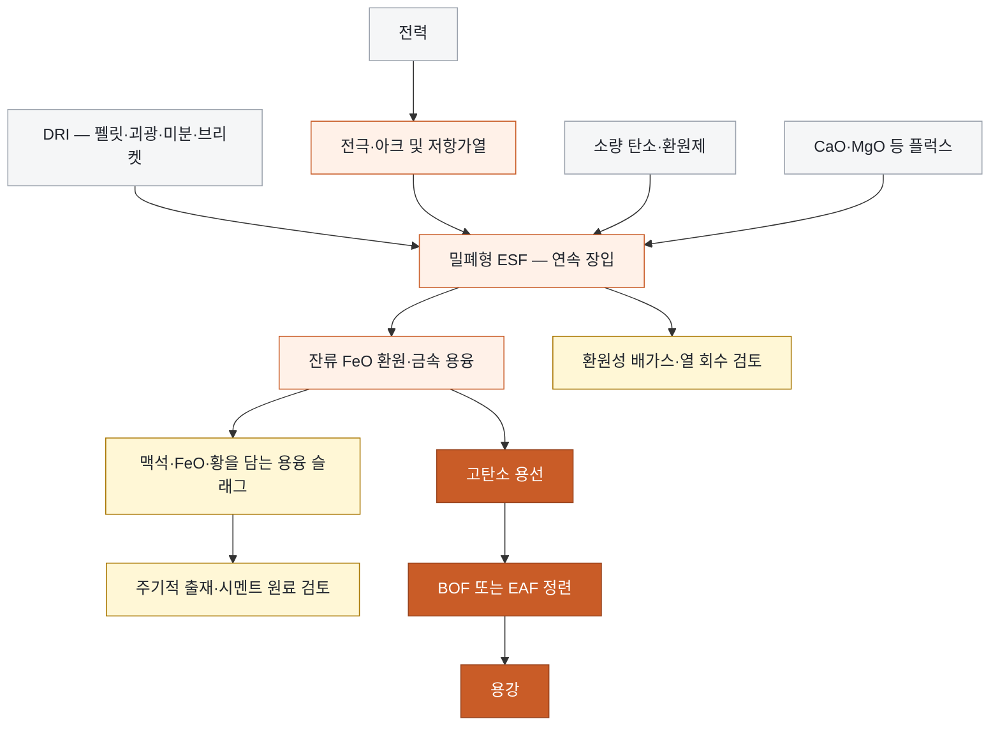

<!-- AUTO-GENERATED BY steel-intelligence. DO NOT EDIT. -->

# 전기용융로 (Electric Smelting Furnace)

> 조사 기준일: **2026-07-26** · 공식·1차 자료 중심 · 사실과 AI 분석을 구분해 작성

??? info "관련 기술 바로가기 · 현재 위치: 환원·용융 경로"

    탐색을 위한 편의 분류이며 기술 우열이나 확정된 공정 관계를 뜻하지 않습니다.

    **환원·용융 경로**

    [[technologies/TEC-hydrogen-direct-reduced-iron|수소 직접환원철 (Hydrogen DRI)]] · [[technologies/TEC-hydrogen-based-fine-ore-reduction|무펠릿 미분광 수소환원 (Fluidized-bed Hydrogen Reduction)]] · **전기용융로 (Electric Smelting Furnace) · 현재** · [[technologies/TEC-hydrogen-plasma-smelting-reduction|수소 플라즈마 용융환원 (HPSR)]] · [[technologies/TEC-microwave-biomass-ironmaking|마이크로웨이브·바이오매스 환원제철 (BioIron)]]

    **전해 기반 경로**

    [[technologies/TEC-molten-oxide-electrolysis|용융산화물 전기분해 (Molten Oxide Electrolysis)]] · [[technologies/TEC-low-temperature-aqueous-iron-electrolysis|저온 수계 전해제철 (Aqueous Iron Electrolysis)]]

    **기존 설비·순환 경로**

    [[technologies/TEC-blast-furnace-ccus|고로 CCUS]] · [[technologies/TEC-high-grade-eaf-and-scrap-impurity-removal|고급강 EAF·스크랩 불순물 제거]]

    **통합·운영 기술**

    [[technologies/TEC-low-carbon-ironmaking|저탄소 제철 종합 경로 (Low-carbon Ironmaking)]] · [[technologies/TEC-smart-steelworks|스마트 제철소 (Smart Steelworks)]]

{ .steel-media-image .steel-hero-image .steel-media-detail }

*대표 이미지 — BHP가 공개한 4개 1차 제철 경로 비교도 — DRI–ESF 경로 포함 (공정 개념도 · 권리 `link_only` · 출처 [[sources/SRC-20260725-6EC0DF4D|SRC-20260725-6EC0DF4D]] · [원문 페이지](https://www.bhp.com/news/bhp-insights/2023/06/pathways-to-decarbonisation-episode-seven-the-electric-smelting-furnace))*

!!! abstract "한눈에 보기"

    | 항목 | 내용 |
    | --- | --- |
    | **분류 (편집)** | DRI 용융·잔류산화물 환원·맥석 분리 제선 |
    | **핵심 원리** | 직접환원철을 전기 에너지와 소량의 탄소로 추가 환원·용융하고, 맥석을 슬래그로 분리하여 후단 정련용 고탄소 용선을 연속 생산하는 제선 경로 [^src-20260725-6ec0df4d] |
    | **제품 형태** | 제품은 대략 3–4% 탄소를 포함할 수 있는 용선이며, 주조 가능한 용강이 아니므로 BOF 또는 EAF 정련이 뒤따른다. [^src-20260725-31725163] |
    | **금속화율** | BHP 공개 시나리오는 EAF용 고금속화 DRI와 달리 ESF가 약 80–85% 금속화 환원물을 받을 가능성을 제시하며, 이는 광종·잔류 FeO·탄소 조건별 실증이 필요한 목표 운전창이다. [^src-20260725-6ec0df4d] |
    | **제품 탄소** | 공개 산업 운전 사례의 ESF 용선 탄소는 약 3.2–4%, 실험실 결과는 2.5–4.5% 범위로 보고됐다. [^src-20260725-31725163] |
    | **적용 원료** | 펠릿·미분·괴광·브리켓 형태의 DRI를 대상으로 하며 중품위 광석 기반 환원물까지 원료 창을 넓힐 잠재력이 있지만, 광종별 성능은 파일럿 검증이 필요하다. [^src-20260725-6ec0df4d] |
    | **전력원단위 추정** | 저품위 냉간 DRI를 EAF에서 직접 처리한 비교 모델은 543–630 kg-slag/t-liquid steel과 약 651 kWh/t를, 스크랩 EAF는 약 413 kWh/t를 제시했다. 이는 ESF 소비전력 측정값이 아니라 ESF 분리단계가 필요한 이유를 보여주는 기준값이다. [^src-20260725-31725163] |
    | **공개 개발 단계** | DRI 전기용융의 산업 운전 경험은 존재하지만 저배출 OSBF의 고로 대체 규모 운전은 아직 입증되지 않았으며, 1 t/h급과 3–4만 tpy급 파일럿·설계 프로젝트가 확대 검증 단계에 있다. [^src-20260725-31725163] |
    | **후단 활용** | ESF 용선은 기존 BOF 또는 EAF에서 탈탄·탈인·탈황·성분조정을 거쳐 용강이 되며, 기존 통합제철소의 제강·연주·압연 자산을 활용할 수 있다. [^src-20260725-6ec0df4d] |

## 개요

직접환원철을 전기 에너지와 소량의 탄소로 추가 환원·용융하고, 맥석을 슬래그로 분리하여 후단 정련용 고탄소 용선을 연속 생산하는 제선 경로 [^src-20260725-6ec0df4d]

이 문서의 ESF는 스크랩을 배치식으로 녹여 용강을 만드는 EAF가 아니라, DRI를 연속 투입해 잔류 FeO를 추가 환원하고 맥석을 슬래그로 분리하여 BOF·EAF 정련용 고탄소 용선을 만드는 제선 설비를 뜻합니다.

- **근거 확인 기업:** 4개
- **직접 연결 근거:** 16건

## 작동 원리

- **작동 원리:** 밀폐한 환원성 노내에서 전극의 전류 경로와 아크·저항가열로 열을 공급하고, 잔류 FeO를 환원한 뒤 용선과 슬래그의 밀도차로 분리한다. [^src-20260725-6ec0df4d]

## 공정 구성

**색상 범례 (AI 의미 그룹):** 회색=원료·에너지 · 주황=용융·환원 · 진한 주황=금속 제품·정련 · 황색=슬래그·배가스 관리

!!! note "도식 해석"

    위 흐름도는 공개 자료의 단계를 비교하기 쉽게 재구성한 것입니다. 실제 물질수지·전해액 조성·셀 배열을 뜻하는 설계도는 아닙니다. [^src-20260725-6ec0df4d]

## 주요 기술 특성

### 반응·셀·공정

| 구분 | 공개된 내용 | 근거 성격 |
| --- | --- | --- |
| **작동 원리** | 밀폐한 환원성 노내에서 전극의 전류 경로와 아크·저항가열로 열을 공급하고, 잔류 FeO를 환원한 뒤 용선과 슬래그의 밀도차로 분리한다. [^src-20260725-6ec0df4d] | 회사 발표 |
| **학회 공개 공정 구성** | Hatch의 AIST 2026 발표는 사전환원 후 ESF에서 맥석을 저-FeO 슬래그로 배출해 저품위 광석을 처리하는 flowsheet를 제시했다. [^src-20260726-6cc774dd] | 학회 발표 |
| **노형·전극 구성** | 주요 형식은 전극이 장입물·슬래그에 잠기는 SAF와 슬래그 표면 가까이에서 brush arc를 형성하는 OSBF이며, 원형·직사각형, AC·DC, graphite·Söderberg 전극 조합이 가능하다. [^src-20260725-31725163] | 학술지 논문 |
| **운전 방식** | DRI와 플럭스를 연속 장입하고 공기 유입을 막은 환원 분위기를 유지하며, 운전을 멈추지 않고 용선과 슬래그를 주기적으로 출선·출재한다. [^src-20260725-6ec0df4d] | 회사 발표 |
| **원료 품위별 용융로 선택** | AISTech 2024 논문 초록은 고품위 DRI·낮은 slag량에는 EAF, 저품위 DRI·높은 gangue에는 별도 smelter가 필요하다고 구분 [^src-20260726-e01e47b8] | 학회 논문 |

### 원료·운전·제품

| 구분 | 공개된 내용 | 근거 성격 |
| --- | --- | --- |
| **적용 원료** | 펠릿·미분·괴광·브리켓 형태의 DRI를 대상으로 하며 중품위 광석 기반 환원물까지 원료 창을 넓힐 잠재력이 있지만, 광종별 성능은 파일럿 검증이 필요하다. [^src-20260725-6ec0df4d] | 회사 발표 |
| **제품 형태** | 제품은 대략 3–4% 탄소를 포함할 수 있는 용선이며, 주조 가능한 용강이 아니므로 BOF 또는 EAF 정련이 뒤따른다. [^src-20260725-31725163] | 학술지 논문 |
| **금속화율** | BHP 공개 시나리오는 EAF용 고금속화 DRI와 달리 ESF가 약 80–85% 금속화 환원물을 받을 가능성을 제시하며, 이는 광종·잔류 FeO·탄소 조건별 실증이 필요한 목표 운전창이다. [^src-20260725-6ec0df4d] | 회사 발표 |
| **제품 탄소** | 공개 산업 운전 사례의 ESF 용선 탄소는 약 3.2–4%, 실험실 결과는 2.5–4.5% 범위로 보고됐다. [^src-20260725-31725163] | 학술지 논문 |
| **부산물** | BHP는 ESF 용선 1톤당 슬래그 250–330 kg을 가정하고, 시멘트 1:1 대체 시 150–200 kgCO2/t-hot metal의 간접 회피 가능성을 추정했다. 실제 슬래그 품질·시장·규격 검증이 필요하다. [^src-20260725-6ec0df4d] | 회사 발표 |
| **슬래그 기능** | 슬래그는 DRI의 SiO2·Al2O3 등 맥석과 잔류 FeO를 받아 용선과 분리하고 황 등 유해원소 관리에 관여하며, 점도·전기전도도·FeO가 철 수율과 열전달을 좌우한다. [^src-20260725-f13f33cd] | 학술지 논문 |
| **슬래그 염기도 창** | CaO/SiO2 질량비 0.4–1.2를 시험한 특정 CaO–SiO2–MgO–Al2O3–FeO 슬래그에서는 0.8 초과가 합리적 유동성·탈황·철-슬래그 분리에 필요했으며, 보편 산업 설정값은 아니다. [^src-20260725-f13f33cd] | 학술지 논문 |
| **잔존 탄소 요구** | BHP 시나리오는 조강 1톤당 약 0.05–0.08톤의 탄소가 ESF 경로에 남는 것으로 추정하며, 전량 산화 시 0.18–0.29 tCO2에 해당한다. [^src-20260725-6ec0df4d] | 회사 발표 |
| **철 수율·손실** | ESF는 고DRI EAF보다 슬래그 중 FeO와 금속 방울 손실을 낮출 잠재력이 있으나, 실제 철 회수율은 DRI 금속화·슬래그 FeO·탄소·체류시간별 공개 검증이 필요하다. [^src-20260725-31725163] | 학술지 논문 |
| **후단 활용** | ESF 용선은 기존 BOF 또는 EAF에서 탈탄·탈인·탈황·성분조정을 거쳐 용강이 되며, 기존 통합제철소의 제강·연주·압연 자산을 활용할 수 있다. [^src-20260725-6ec0df4d] | 회사 발표 |

### 에너지·환경·경제

| 구분 | 공개된 내용 | 근거 성격 |
| --- | --- | --- |
| **전력원단위 추정** | 저품위 냉간 DRI를 EAF에서 직접 처리한 비교 모델은 543–630 kg-slag/t-liquid steel과 약 651 kWh/t를, 스크랩 EAF는 약 413 kWh/t를 제시했다. 이는 ESF 소비전력 측정값이 아니라 ESF 분리단계가 필요한 이유를 보여주는 기준값이다. [^src-20260725-31725163] | 학술지 논문 |
| **제품 단위 배출** | 2026년 리뷰가 인용한 모델의 DRI–ESF–BOF 직접배출은 약 0.33 tCO2/t-liquid steel, BF–BOF는 1.954 tCO2/t였으나 전력·상류 배출과 슬래그 편익을 제외한 Scope 1 시나리오다. [^src-20260725-31725163] | 학술지 논문 |
| **필요 인프라** | 2 Mtpa급 수소 DRI와 전기로를 함께 운전하는 BHP 시나리오는 수소 제조를 포함해 약 1 GW 규모의 firmed 재생전력 수요를 제시한다. ESF 단독 전력값이 아니며 계통·수소 인프라 통합 규모를 뜻한다. [^src-20260725-6ec0df4d] | 회사 발표 |
| **경제성 평가** | 저품위 원료의 ESF 경제성은 선광·펠릿화 절감과 고품위광 프리미엄뿐 아니라 추가 슬래그·플럭스·전력·복수 노체·BOF 정련·철 수율을 함께 계산해야 하며, 현재 공개자료만으로 보편 원가우위를 확정할 수 없다. [^src-20260725-31725163] | 학술지 논문 |
| **내화물·열손실** | OSBF의 open·brush arc는 노정 복사열손실과 내화물 마모를 키울 수 있고, 슬래그 전기·열전도도와 아크 길이·노체 형상의 결합관계가 공개 데이터로 충분히 검증되지 않았다. [^src-20260725-31725163] | 학술지 논문 |
| **장입·전력 제어** | OSBF는 기 설정 전력에서 장입 속도가 느리거나 빠르면 개방 욕과 장입물 피복 상태가 바뀌므로, 전력·전압·전극 위치·장입률을 닫힌 제어로 균형화해야 한다. [^src-20260725-31725163] | 학술지 논문 |

### 실증·산업화

| 구분 | 공개된 내용 | 근거 성격 |
| --- | --- | --- |
| **공개 개발 단계** | DRI 전기용융의 산업 운전 경험은 존재하지만 저배출 OSBF의 고로 대체 규모 운전은 아직 입증되지 않았으며, 1 t/h급과 3–4만 tpy급 파일럿·설계 프로젝트가 확대 검증 단계에 있다. [^src-20260725-31725163] | 학술지 논문 |
| **확인된 실증 규모** | 공개 근거는 장기 산업 운전 사례와 별개로 POSCO 1 t/h 파일럿 첫 용선, Metso 최대 1 t/h 시험 플랫폼, Baowu 500 kg 시험, NeoSmelt 30,000–40,000 tpy 설계 단계까지 혼재하며 동일 성숙도로 볼 수 없다. [^src-20260725-c9d824f2][^src-20260725-a6759186][^src-20260725-3ff9886c][^src-20260725-67caa465][^src-20260725-31725163] | 설비 공급사·회사 발표·학술지 논문 |
| **공개 스케일업 근거 공백** | 발표의 CRISP+ 약 120–160 MW·1.5 Mt/y 초과 수치는 개념 설계치이며, 명명된 상용 설비의 달성 실적으로 확인되지 않았다. [^src-20260726-6cc774dd] | 학회 발표 |
| **상용 규모 확대 조건** | 공급사 기반 추정으로는 중형 고로 2.5–4 Mtpa를 대체하려면 직사각형 OSBF 2기 또는 원형 3기 정도가 필요할 수 있으나, 독립 검증된 상용 확대 자료는 없다. [^src-20260725-31725163] | 학술지 논문 |
| **기존 산업 운전 사례** | 뉴질랜드 제철 사례는 2기의 50 MW 직사각형 ESF로 약 0.6 Mtpa 철강을 생산하고 1980년대 이후 원래 노저에서 누적 23 Mt 초과 용선을 생산한 것으로 보고됐다. [^src-20260725-31725163] | 학술지 논문 |

## 공개 개발 연혁

| 날짜 | 공개 사건 |
| --- | --- |
| 2023-06-16 | Pathways to decarbonisation: the electric smelting furnace [^src-20260725-6ec0df4d] |
| 2024-05-08 | Smelter — Green Steelmaking Using Low-Grade DRI [^src-20260726-e01e47b8] |
| 2024-09-11 | POSCO HyREX electric smelting furnace pilot status [^src-20260725-a6759186] |
| 2024-10-25 | Metso opens DRI Smelting Furnace pilot facility in Pori, Finland [^src-20260725-c9d824f2] |
| 2024-12-17 | BlueScope, BHP and Rio Tinto select WA for Australia’s largest ironmaking electric smelting furnace [^src-20260725-67caa465] |
| 2025-06-17 | Industry giants collaborating to seek to decarbonise steel [^src-20260725-c37a3042] |
| 2025-08-16 | Properties evaluation of DRI smelting slag for molten iron production: viscosity and sulfide capacity [^src-20260725-f13f33cd] |
| 2025-09-25 | Construction begins on HYFOR and Smelter demonstration plant [^src-20260725-e316d68f] |
| 2026-01-07 | China launches first million-tonne near-zero-carbon steel line at Baowu [^src-20260725-7e8abc86] |
| 2026-03-09 | Application of Electric Smelting Furnace to Ironmaking [^src-20260725-31725163] |
| 2026-03-09 | Electric Smelting Furnace-Based Flowsheets [^src-20260726-6cc774dd] |
| 2026-05-14 | NeoSmelt pilot project — Legislative Council answer [^src-20260725-fbf8ea9e] |
| 2026-06-12 | China Baowu and Rio Tinto complete hydrogen DRI and electric-smelting trials [^src-20260725-3ff9886c] |

## 설비·공정 이미지

{ .steel-media-image .steel-media-compact }

**기술 이미지.** NeoSmelt Kwinana 전기용융로 파일럿 프로젝트 공식 대표 이미지

- 출처 [[sources/SRC-20260725-67CAA465|SRC-20260725-67CAA465]] · 권리 `link_only` · [원문 페이지](https://www.bhp.com/news/media-centre/releases/2024/12/bluescope-bhp-and-rio-tinto-select-wa-for-australias-largest-ironmaking-electric-smelting-furnace) · 작성·촬영 NeoSmelt / BHP
- 권리 메모: BHP 공식 발표 페이지의 원본 미디어를 외부 링크로만 표시하며 복제 권한은 별도 확인하지 않음

{ .steel-media-image .steel-media-compact }

**실제 설비 사진.** thyssenkrupp Duisburg 직접환원탑 첫 18 m 지지기둥 설치 현장

- 출처 [[sources/SRC-20260725-8D0BD4B8|SRC-20260725-8D0BD4B8]] · 권리 `link_only` · [원문 페이지](https://transformation.thyssenkrupp-steel.com/startseite.html) · 작성·촬영 thyssenkrupp Steel Europe
- 권리 메모: thyssenkrupp Steel 공식 프로젝트 사이트의 실제 공사 사진입니다. 재사용 권한을 별도 확인하지 않아 원문 링크로만 표시합니다.

## 기업별 상세 현황

### [[companies/COM-POSCO|POSCO]]

**확인된 현황.** 2024년 4월 1 t/h 파일럿 전기용융로에서 첫 용선 생산, DRI·HBI 용융 시험 계획 단계; 상업 규모 운전은 미확인 [^src-20260725-a6759186]

**단계 판단: 연구·실증.** 기술 가능성을 검증하는 단계입니다. 시험 규모의 성공을 상용 생산성과로 해석하지 않고 규모 확대 계획을 따로 확인해야 합니다.

- **날짜:** 발표 2024-09-11 · 수집 2026-07-25 · 검증 2026-07-25

### [[companies/COM-China-Baowu|China Baowu Steel Group]]

**확인된 현황.** Zhanjiang near-zero-carbon 생산라인에 전기용융 경로 적용; 2026년 500 kg ESF로 중품위광 DRI 용융 시험 [^src-20260725-7e8abc86][^src-20260725-3ff9886c]

**단계 판단: 연구·실증.** 기술 가능성을 검증하는 단계입니다. 시험 규모의 성공을 상용 생산성과로 해석하지 않고 규모 확대 계획을 따로 확인해야 합니다.

- **날짜:** 발표 2026-01-07, 2026-06-12 · 수집 2026-07-25 · 검증 2026-07-25

### [[companies/COM-thyssenkrupp-Steel|thyssenkrupp Steel]]

**확인된 현황.** 2.5 Mtpa DRI 설비와 후단 innovative melters를 기존 제강공정에 통합하는 건설 단계 [^src-20260725-8d0bd4b8]

**단계 판단: 공식 현황 확인.** 공식 자료에서 관련 움직임은 확인되지만 단계 구분에 필요한 일정·설비·운전 정보가 충분하지 않습니다.

- **날짜:** 발표 미상 · 수집 2026-07-25 · 검증 2026-07-25

### [[companies/COM-Rio-Tinto|Rio Tinto]]

**확인된 현황.** NeoSmelt Kwinana DRI–ESF 파일럿의 동등 지분 참여사로, 2026년 final design 단계이며 FID는 미확정·2028년 하반기 시운전 목표 [^src-20260725-8a93e42f]

**단계 판단: 연구·실증.** 기술 가능성을 검증하는 단계입니다. 시험 규모의 성공을 상용 생산성과로 해석하지 않고 규모 확대 계획을 따로 확인해야 합니다.

- **날짜:** 발표 미상 · 수집 2026-07-25 · 검증 2026-07-25

## 관련 프로젝트

기술의 실제 확대 단계를 확인할 수 있도록 프로젝트 문서와 현재 상태를 직접 연결합니다. 각 프로젝트 문서에는 최근 상태뿐 아니라 확인 가능한 전체 일정 이력이 표시됩니다.

| 프로젝트 | 현재 확인 상태 | 일정·규모 |
| --- | --- | --- |
| **[[projects/PRJ-NEOSMELT-KWINANA|NeoSmelt Kwinana DRI–ESF 파일럿]]** | Kwinana 부지를 확정하고 pre-feasibility에서 final design 단계로 진전했으나, 2026-05-14 기준 FID와 주정부 자금집행은 미확정 [^src-20260725-8a93e42f][^src-20260725-fbf8ea9e] | **연간 생산능력** 연 30,000–40,000톤 용선 계획 [^src-20260725-67caa465] · **최종투자결정 목표** 2026년 말 [^src-20260725-fbf8ea9e] · **목표 시운전 시점** 2028년 하반기 [^src-20260725-8a93e42f] |
| **[[projects/PRJ-HY4SMELT|HY4Smelt 실증 프로젝트]]** | 건설 중 [^src-20260725-e316d68f] | **시간당 처리능력** 시간당 3톤 (3 tonnes per hour) [^src-20260725-e316d68f] · **목표 가동 시점** 2027년 말 [^src-20260725-e316d68f] |

## 기술적 쟁점과 미공개 데이터

!!! warning "AI 분석 — 공개 근거와 구분"

    기업별 단계는 인용된 공식 발표 문구를 기준으로 분류한 것으로, 정식 TRL 판정이나 기술 경쟁력 순위가 아닙니다.

- **추가 확인이 필요한 데이터:** 시험 규모와 상업 설비의 차이, 투입 원료 품위·금속화율, 탄소·전력원단위, 철 회수율, 슬래그량·조성, 전극·내화물 수명과 후단 BOF·EAF 통합 여부를 확인해야 합니다.
- 기업 간 비교에는 시험 규모, 실제 투입 원료·에너지 조건, 상용 운전 실적과 제품 단위 배출량을 같은 기준으로 적용해야 합니다.
- ESF의 원료 유연성은 맥석을 없애는 것이 아니라 슬래그로 받아내는 능력입니다. 광석 품위가 낮을수록 슬래그량·플럭스·열부하·출재량이 증가하므로 허용 가능과 경제적이라는 판단을 분리해야 합니다.
- 80–85% 금속화 DRI 수용 가능성은 샤프트로의 고금속화·스티킹 부담을 줄일 잠재력이 있지만, BHP의 공개 기술 시나리오입니다. 광종별 잔류 FeO 환원속도, 탄소원단위와 철 회수율이 파일럿에서 함께 입증되어야 합니다.
- OSBF의 고저항·고출력 장점은 공급사 자료 비중이 크고 독립 검증이 부족합니다. 아크 길이, 슬래그 전기전도도, 장입 속도, 열분포와 노체 형상이 서로 결합되므로 작은 로의 안정 운전을 그대로 대형화할 수 없습니다.
- 저배출성은 ESF 단독이 아니라 환원가스의 수소·천연가스 비율, 전력 배출계수, 탄소·플럭스, 철 수율, BOF 정련까지 포함한 DRI–ESF–BOF 시스템 경계에서 평가해야 합니다.

## POSCO 관점 시사점

!!! info "AI 분석 — 전략 검토용"

    다음 내용은 공개 근거를 바탕으로 한 비교 분석이며, POSCO의 공식 결정이나 투자 권고가 아닙니다.

- HyREX의 유동층 환원물은 입도·금속화·잔류 FeO·맥석이 샤프트 DRI와 다를 수 있습니다. 1 t/h 파일럿의 첫 출선보다 광종별 장기 연속장입, Fe 수율, 슬래그 염기도와 출재 안정성이 더 중요한 확대 지표입니다.
- ESF는 기존 BOF·연주·압연 자산을 유지할 수 있는 전환 경로이지만, 고로 한 기를 대체하려면 복수 모듈과 대규모 전력·전극·내화물 정비체계가 필요할 수 있습니다. 배치도와 정비 중 우회 생산까지 포함한 통합 설계가 필요합니다.
- 우선 모니터링 지표는 DRI 품위·입도·금속화율, 잔류 FeO, 탄소 kg/t, 전력 kWh/t-hot metal, 슬래그 kg/t와 FeO, 철 회수율, 용선 C·Si·P·S, 전극소모, 내화물 캠페인 수명, 연속운전 시간과 출선 간격입니다.

## 출처

- [[sources/SRC-20260725-31725163|Application of Electric Smelting Furnace to Ironmaking]] — Journal of Sustainable Metallurgy, 2026-03-09 · [원문](https://link.springer.com/article/10.1007/s40831-026-01459-2)
- [[sources/SRC-20260725-3FF9886C|China Baowu and Rio Tinto complete hydrogen DRI and electric-smelting trials]] — Rio Tinto, 2026-06-12 · [원문](https://www.riotinto.com/news/releases/2026/china-baowu-and-rio-tinto-complete-pilbara-blend-iron-ore-pelletisation-and-direct-reduction-trials)
- [[sources/SRC-20260725-67CAA465|BlueScope, BHP and Rio Tinto select WA for Australia’s largest ironmaking electric smelting furnace]] — BHP, 2024-12-17 · [원문](https://www.bhp.com/news/media-centre/releases/2024/12/bluescope-bhp-and-rio-tinto-select-wa-for-australias-largest-ironmaking-electric-smelting-furnace)
- [[sources/SRC-20260725-6EC0DF4D|Pathways to decarbonisation: the electric smelting furnace]] — BHP, 2023-06-16 · [원문](https://www.bhp.com/news/bhp-insights/2023/06/pathways-to-decarbonisation-episode-seven-the-electric-smelting-furnace)
- [[sources/SRC-20260725-7E8ABC86|China launches first million-tonne near-zero-carbon steel line at Baowu]] — State-owned Assets Supervision and Administration Commission of China, 2026-01-07 · [원문](https://en.sasac.gov.cn/2026/01/07/c_20292.htm)
- [[sources/SRC-20260725-8A93E42F|Value chain GHG emission reductions — DRI-ESF programme update]] — BHP, 게시일 미상 · [원문](https://www.bhp.com/sustainability/climate-change/value-chain-ghg-emission-reductions)
- [[sources/SRC-20260725-8D0BD4B8|thyssenkrupp Steel direct-reduction transformation project status]] — thyssenkrupp Steel Europe, 게시일 미상 · [원문](https://transformation.thyssenkrupp-steel.com/startseite.html)
- [[sources/SRC-20260725-A23B5A64|HYFOR: Hydrogen-Based Fine-Ore Reduction]] — Primetals Technologies, 게시일 미상 · [원문](https://www.primetals.com/en/portfolio/solutions/ironmaking/direct-reduction/hyfor/)
- [[sources/SRC-20260725-A6759186|POSCO HyREX electric smelting furnace pilot status]] — POSCO Group Newsroom, 2024-09-11 · [원문](https://newsroom.posco.com/en/world-climate-industry-expo-2024-checking-posco-groups-carbon-reduction-capabilities/)
- [[sources/SRC-20260725-C37A3042|Industry giants collaborating to seek to decarbonise steel]] — Australian Renewable Energy Agency, 2025-06-17 · [원문](https://arena.gov.au/assets/2025/06/ARENA-Media-Release_NeoSmelt_17062025_FINAL.pdf)
- [[sources/SRC-20260725-C9D824F2|Metso opens DRI Smelting Furnace pilot facility in Pori, Finland]] — Metso, 2024-10-25 · [원문](https://www.metso.com/corporate/media/news/2024/10/metso-opens-dri-smelting-furnace-pilot-facility-in-pori-finland/)
- [[sources/SRC-20260725-E316D68F|Construction begins on HYFOR and Smelter demonstration plant]] — Primetals Technologies, 2025-09-25 · [원문](https://dam.primetals.com/m/6c938163b0f170c0/original/PR2025083472en.pdf)
- [[sources/SRC-20260725-F13F33CD|Properties evaluation of DRI smelting slag for molten iron production: viscosity and sulfide capacity]] — Journal of Iron and Steel Research International, 2025-08-16 · [원문](https://doi.org/10.1007/s42243-025-01583-5)
- [[sources/SRC-20260725-FBF8EA9E|NeoSmelt pilot project — Legislative Council answer]] — Parliament of Western Australia, 2026-05-14 · [원문](https://www.parliament.wa.gov.au/hansard/daily/uh/2026-05-14/25?sid=73938f1f931d45e090&talkerIndex=0)
- [[sources/SRC-20260726-6CC774DD|Electric Smelting Furnace-Based Flowsheets]] — Association for Iron & Steel Technology, 2026-03-09 · [원문](https://www.aist.org/getmedia/1f692aad-90e1-4d92-b591-6b97060144cf/Electric-Smelting-Furnace-based-Flowsheets.pdf)
- [[sources/SRC-20260726-E01E47B8|Smelter — Green Steelmaking Using Low-Grade DRI]] — Association for Iron & Steel Technology, 2024-05-08 · [원문](https://imis.aist.org/store/detail.aspx?id=PR-388-199)

[^src-20260725-31725163]: **Application of Electric Smelting Furnace to Ironmaking** — Journal of Sustainable Metallurgy, 2026-03-09. DOI: [10.1007/s40831-026-01459-2](https://doi.org/10.1007/s40831-026-01459-2). [원문](https://link.springer.com/article/10.1007/s40831-026-01459-2) · [[sources/SRC-20260725-31725163|보관 원문·메타데이터]]
[^src-20260725-3ff9886c]: **China Baowu and Rio Tinto complete hydrogen DRI and electric-smelting trials** — Rio Tinto, 2026-06-12. [원문](https://www.riotinto.com/news/releases/2026/china-baowu-and-rio-tinto-complete-pilbara-blend-iron-ore-pelletisation-and-direct-reduction-trials) · [[sources/SRC-20260725-3FF9886C|보관 원문·메타데이터]]
[^src-20260725-67caa465]: **BlueScope, BHP and Rio Tinto select WA for Australia’s largest ironmaking electric smelting furnace** — BHP, 2024-12-17. [원문](https://www.bhp.com/news/media-centre/releases/2024/12/bluescope-bhp-and-rio-tinto-select-wa-for-australias-largest-ironmaking-electric-smelting-furnace) · [[sources/SRC-20260725-67CAA465|보관 원문·메타데이터]]
[^src-20260725-6ec0df4d]: **Pathways to decarbonisation: the electric smelting furnace** — BHP, 2023-06-16. [원문](https://www.bhp.com/news/bhp-insights/2023/06/pathways-to-decarbonisation-episode-seven-the-electric-smelting-furnace) · [[sources/SRC-20260725-6EC0DF4D|보관 원문·메타데이터]]
[^src-20260725-7e8abc86]: **China launches first million-tonne near-zero-carbon steel line at Baowu** — State-owned Assets Supervision and Administration Commission of China, 2026-01-07. [원문](https://en.sasac.gov.cn/2026/01/07/c_20292.htm) · [[sources/SRC-20260725-7E8ABC86|보관 원문·메타데이터]]
[^src-20260725-8a93e42f]: **Value chain GHG emission reductions — DRI-ESF programme update** — BHP, 게시일 미상. [원문](https://www.bhp.com/sustainability/climate-change/value-chain-ghg-emission-reductions) · [[sources/SRC-20260725-8A93E42F|보관 원문·메타데이터]]
[^src-20260725-8d0bd4b8]: **thyssenkrupp Steel direct-reduction transformation project status** — thyssenkrupp Steel Europe, 게시일 미상. [원문](https://transformation.thyssenkrupp-steel.com/startseite.html) · [[sources/SRC-20260725-8D0BD4B8|보관 원문·메타데이터]]
[^src-20260725-a6759186]: **POSCO HyREX electric smelting furnace pilot status** — POSCO Group Newsroom, 2024-09-11. [원문](https://newsroom.posco.com/en/world-climate-industry-expo-2024-checking-posco-groups-carbon-reduction-capabilities/) · [[sources/SRC-20260725-A6759186|보관 원문·메타데이터]]
[^src-20260725-c37a3042]: **Industry giants collaborating to seek to decarbonise steel** — Australian Renewable Energy Agency, 2025-06-17. [원문](https://arena.gov.au/assets/2025/06/ARENA-Media-Release_NeoSmelt_17062025_FINAL.pdf) · [[sources/SRC-20260725-C37A3042|보관 원문·메타데이터]]
[^src-20260725-c9d824f2]: **Metso opens DRI Smelting Furnace pilot facility in Pori, Finland** — Metso, 2024-10-25. [원문](https://www.metso.com/corporate/media/news/2024/10/metso-opens-dri-smelting-furnace-pilot-facility-in-pori-finland/) · [[sources/SRC-20260725-C9D824F2|보관 원문·메타데이터]]
[^src-20260725-e316d68f]: **Construction begins on HYFOR and Smelter demonstration plant** — Primetals Technologies, 2025-09-25. [원문](https://dam.primetals.com/m/6c938163b0f170c0/original/PR2025083472en.pdf) · [[sources/SRC-20260725-E316D68F|보관 원문·메타데이터]]
[^src-20260725-f13f33cd]: **Properties evaluation of DRI smelting slag for molten iron production: viscosity and sulfide capacity** — Journal of Iron and Steel Research International, 2025-08-16. DOI: [10.1007/s42243-025-01583-5](https://doi.org/10.1007/s42243-025-01583-5). [원문](https://doi.org/10.1007/s42243-025-01583-5) · [[sources/SRC-20260725-F13F33CD|보관 원문·메타데이터]]
[^src-20260725-fbf8ea9e]: **NeoSmelt pilot project — Legislative Council answer** — Parliament of Western Australia, 2026-05-14. [원문](https://www.parliament.wa.gov.au/hansard/daily/uh/2026-05-14/25?sid=73938f1f931d45e090&talkerIndex=0) · [[sources/SRC-20260725-FBF8EA9E|보관 원문·메타데이터]]
[^src-20260726-6cc774dd]: **Electric Smelting Furnace-Based Flowsheets** — Association for Iron & Steel Technology, 2026-03-09. [원문](https://www.aist.org/getmedia/1f692aad-90e1-4d92-b591-6b97060144cf/Electric-Smelting-Furnace-based-Flowsheets.pdf) · [[sources/SRC-20260726-6CC774DD|보관 원문·메타데이터]]
[^src-20260726-e01e47b8]: **Smelter — Green Steelmaking Using Low-Grade DRI** — Association for Iron & Steel Technology, 2024-05-08. [원문](https://imis.aist.org/store/detail.aspx?id=PR-388-199) · [[sources/SRC-20260726-E01E47B8|보관 원문·메타데이터]]
