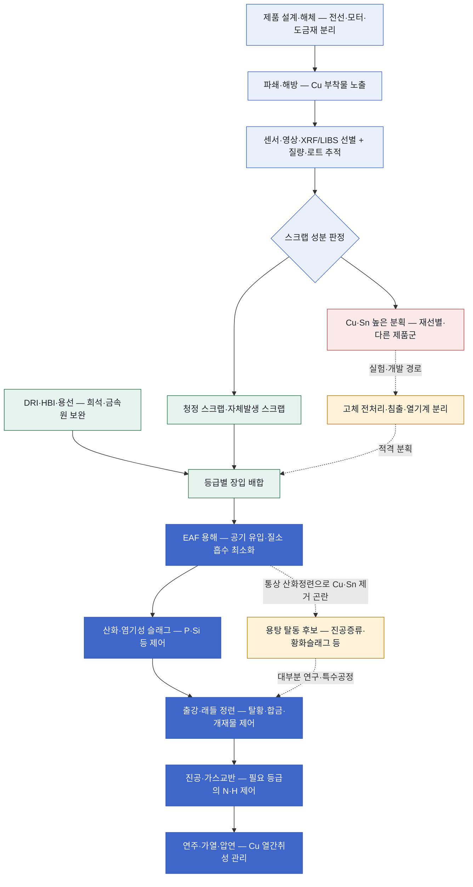

<!-- AUTO-GENERATED BY steel-intelligence. DO NOT EDIT. -->

# 고급강 EAF·스크랩 불순물 제거

> 조사 기준일: **2026-07-25** · 공식·1차 자료 중심 · 사실과 AI 분석을 구분해 작성

??? info "관련 기술 바로가기 · 현재 위치: 기존 설비·순환 경로"

    탐색을 위한 편의 분류이며 기술 우열이나 확정된 공정 관계를 뜻하지 않습니다.

    **환원·용융 경로**

    [[technologies/TEC-hydrogen-direct-reduced-iron|수소 직접환원철 (Hydrogen DRI)]] · [[technologies/TEC-hydrogen-based-fine-ore-reduction|무펠릿 미분광 수소환원 (Fluidized-bed Hydrogen Reduction)]] · [[technologies/TEC-electric-smelting-furnace|전기용융로 (Electric Smelting Furnace)]] · [[technologies/TEC-hydrogen-plasma-smelting-reduction|수소 플라즈마 제련]] · [[technologies/TEC-microwave-biomass-ironmaking|마이크로웨이브·바이오매스 제철]]

    **전해 기반 경로**

    [[technologies/TEC-molten-oxide-electrolysis|용융산화물 전기분해 (Molten Oxide Electrolysis)]] · [[technologies/TEC-low-temperature-aqueous-iron-electrolysis|저온 수계 전해제철 (Aqueous Iron Electrolysis)]]

    **기존 설비·순환 경로**

    [[technologies/TEC-blast-furnace-ccus|고로 CCUS]] · **고급강 EAF·스크랩 불순물 제거 · 현재**

    **통합·운영 기술**

    [[technologies/TEC-low-carbon-ironmaking|저탄소 제철 종합 경로 (Low-carbon Ironmaking)]] · [[technologies/TEC-smart-steelworks|스마트 제철소 (Smart Steelworks)]]

{ .steel-media-image .steel-hero-image .steel-media-detail }

*대표 이미지 — Tenova Consteerrer 전자기 교반 장치의 전기로 하부 내부 구성도. 광양 설비에 적용된 기술의 범용 공급사 도면이며 POSCO 광양 전기로의 준공도(as-built)는 아님 (장치 구성도 · 권리 `link_only` · 출처 [[sources/SRC-20260725-C888600A|SRC-20260725-C888600A]] · [원문 페이지](https://tenova.com/technologies/electric-arc-furnaces-eaf))*

!!! abstract "한눈에 보기"

    | 항목 | 내용 |
    | --- | --- |
    | **분류 (편집)** | 스크랩 품질관리·전기로 정련·고급강 품질 통합 |
    | **핵심 원리** | 고급강 EAF 기술은 전기로 한 기의 용해기술이 아니라 스크랩 선별·배합, Cu·Sn 유입 억제, P·S·N 정련, 2차정련과 제품별 품질관리를 연결하는 통합 경로 [^src-20260725-9dccdb31] |
    | **공개 개발 단계** | 고급강 EAF는 Hirohata 등 특정 통제 원료·제품에서 상업 생산 사례가 있으나 광범위한 노폐스크랩을 정제해 모든 고급 판재에 적용하는 기술은 연구·실증이 병존 [^src-20260725-9dccdb31] |

## 개요

고급강 EAF 기술은 전기로 한 기의 용해기술이 아니라 스크랩 선별·배합, Cu·Sn 유입 억제, P·S·N 정련, 2차정련과 제품별 품질관리를 연결하는 통합 경로 [^src-20260725-9dccdb31]

‘불순물 제거’를 하나의 노내 처리로 보지 않습니다. 구리·주석은 통상적인 산화슬래그로 제거하기 어려워 해체·파쇄·선별·희석 또는 아직 개발 중인 탈동 공정이 핵심인 반면, 인은 산화·염기성 슬래그, 질소는 공기 차단·CO 기포·진공 등 서로 다른 제어창을 사용합니다.

- **근거 확인 기업:** 1개
- **직접 연결 근거:** 11건

## 작동 원리

- **작동 원리:** 불순물의 물성·열역학에 따라 공정 위치를 달리한다. Cu·Sn은 용해 전 분리·희석을 우선하고 P는 산화·염기성 슬래그, N은 공기 차단·CO 기포·진공으로 제어한다 [^src-20260725-4366e5b1]

## 공정 구성

**색상 범례 (AI 재구성):** 청색=용해 전 품질관리 · 녹색=적격 금속원·배합 · 진한 청색=EAF·2차정련·압연 · 적색=고불순물 분획 · 황색=아직 개발·특수공정

!!! note "도식 해석"

    위 도식은 공개 학술자료와 기업·정부 프로젝트를 공정 위치별로 재구성한 것입니다. 모든 불순물이 모든 단계를 거치는 것이 아니며, 제품 규격에 따라 원료 차단·희석·정련·내성 설계를 조합합니다. [^src-20260725-4366e5b1][^src-20260725-9dccdb31]

## 주요 기술 특성

### 스크랩·잔류원소 관리

| 구분 | 공개된 내용 | 근거 성격 |
| --- | --- | --- |
| **스크랩 품질 위계** | 자체발생·가공 스크랩처럼 이력이 분명한 청정 원료에서 노폐 파쇄스크랩으로 갈수록 성분 편차와 Cu·Sn 관리 부담이 커지며, 제품 등급별 허용치에 맞춘 분리 배합이 필요 [^src-20260725-9dccdb31] | 회사 IR |
| **불순물 유입원** | 폐자동차·가전·설비의 구리 배선, 모터와 합금 부품이 파쇄 중 철 조각에 얽히거나 둘러싸여 자력선별 뒤에도 잔류 [^src-20260725-4366e5b1] | 학술 연구 |
| **구리 열간취성** | 가열 중 Fe가 선택 산화되면 강-스케일 계면에 액상 Cu 농축상이 생겨 오스테나이트 입계로 침투하고 열간가공 표면균열을 유발 [^src-20260725-c79793b1] | 학술 연구 |
| **주석의 복합 영향** | Sn은 Cu에 의한 표면 열간취성을 가속하므로 Cu 단독 수치만으로 판재 균열 위험을 판정하면 불충분 [^src-20260725-c79793b1] | 학술 연구 |
| **고급 판재의 구리 기준** | 2019년 종합평가에서 다수 고부가 판재는 야금학적 문제를 피하기 위해 Cu 0.1 wt% 미만이 필요 [^src-20260725-4366e5b1] | 학술 연구 |
| **파쇄 노폐스크랩의 구리 수준** | 2019년 종합평가의 대표값에서 노폐 파쇄스크랩은 통상 약 0.4 wt% Cu [^src-20260725-4366e5b1] | 학술 연구 |
| **통상 산화정련의 한계** | 용강의 통상 산화슬래그 정련에서는 Cu보다 Fe가 우선 산화되므로 용해된 Cu를 제거할 수 없음 [^src-20260725-4366e5b1] | 학술 연구 |
| **용해 전 해방·분리** | Cu 분리는 혼합·용해 전이 에너지상 유리하지만 자력·밀도 선별 성능은 파쇄에서 Cu 부착물을 얼마나 해방했는지에 좌우됨 [^src-20260725-4366e5b1] | 학술 연구 |
| **센서·영상 선별** | RGB 영상은 노출된 구리선·코일 같은 가시 물체를 분류하는 저비용 보조수단이며 XRF·LIBS는 개별 조각의 원소 분석과 등급 선별에 사용 가능 [^src-20260725-7ddd98e7] | 학술 연구 |
| **벌크 성분 측정 한계** | XRF·LIBS의 점측정은 취득시간·표면오염·조각별 편차와 질량정보 부족 때문에 고속 파쇄스크랩 전체의 벌크 Cu 농도를 곧바로 대표하기 어려움 [^src-20260725-7ddd98e7] | 학술 연구 |
| **영상 분류 연구 결과** | 상용 등급 스크랩으로 구성한 연구 데이터셋에서 영상분할 지도 분류기가 Cu 조성 등급을 86.67% 정확도로 분류했으나 생산라인 벌크 성분 보증은 아님 [^src-20260725-7ddd98e7] | 학술 연구 |
| **희석·배합 경로** | 고Cu 스크랩은 청정 스크랩이나 1차 철원과 혼합해 평균 Cu를 낮추는 방식이 현재 활용되지만 이는 Cu 제거가 아니라 희석 [^src-20260725-7ddd98e7] | 학술 연구 |
| **청정 1차 철 배합** | Nippon Steel은 당시 고급강 EAF에 용선·자체발생 스크랩·가공 스크랩을 통제 투입하고 장기적으로 스크랩과 DRI 조합을 제시 [^src-20260725-9dccdb31] | 회사 IR |
| **고체 스크랩 처리 후보** | 고체 스크랩 후보에는 고밀도 파쇄·물리선별, 선택 용융, 산화취화, 염소화, 암모니아 침출 등이 있으나 실제 이종 파쇄스크랩의 효과와 잔사·시약 회수가 핵심 [^src-20260725-4366e5b1] | 학술 연구 |
| **용탕 추출 후보** | 용탕 탈동 후보에는 진공증류·반응성 가스 증발·황화슬래그 또는 매트·용매·세라믹 여과·응고편석이 있으나 다수는 실험·제안 단계 [^src-20260725-4366e5b1] | 학술 연구 |
| **진공증류** | Cu의 높은 증기압을 이용한 진공증류는 열손실이 작은 반응기에서 가능성이 있으나 진공 아크 재용해는 저처리량 특수강용 추가 재용해 공정 [^src-20260725-4366e5b1] | 학술 연구 |
| **황화슬래그·매트** | 황이 Fe보다 Cu와 우선 반응하는 성질을 이용한 황화슬래그·매트 탈동이 제안됐지만 탄소·황 조정과 후속 탈황 등 보정 공정이 추가될 수 있음 [^src-20260725-4366e5b1] | 학술 연구 |
| **탈인 제어** | EAF 탈인은 FeO에 의한 P 산화와 CaO계 슬래그의 인산염 고정으로 진행되며 CaO 활성도·산소퍼텐셜·온도·교반을 함께 제어해야 함 [^src-20260725-d37c44f7] | 학술 연구 |
| **탈질 제어** | 저질소 운전은 저질소 DRI 배합, 포밍슬래그와 출강 관리, CO 미세기포에 의한 질소 세정 및 필요 시 진공처리를 조합 [^src-20260725-9fbef9c2] | 정부·공공자료 |
| **질소 유입원** | EAF 질소는 장입재, 용강의 공기 노출과 아크 영역의 이온화 질소 등에서 유입 [^src-20260725-9fbef9c2] | 정부·공공자료 |
| **보고된 질소 수준 비교** | 2004년 보고서의 당시 비교값은 BOF 30~40 ppm N, EAF 70~100 ppm N이며 현재 모든 공장의 보증값이 아니라 저질소 EAF 과제의 기준선 [^src-20260725-9fbef9c2] | 정부·공공자료 |
| **2차정련 역할** | 고급강 EAF는 용해 뒤 래들 정련·진공처리·연주·압연까지 연결해 N·S·개재물·성분·표면 품질을 맞춰야 하며 EAF 출강 성분만으로 완성되지 않음 [^src-20260725-9dccdb31] | 회사 IR |
| **종점 인 예측 연구 결과** | 실조업 데이터 기반 FA-MM-TabNet 연구는 종점 P 예측 MAE 0.0024, RMSE 0.0034, ±0.005% 범위 적중률 90.82%를 보고했으나 단일 데이터셋 결과 [^src-20260725-d37c44f7] | 학술 연구 |
| **철 수율·잔사** | 선별·침출·고온처리·황화슬래그의 평가는 Cu 저감률뿐 아니라 철 손실, 시약·용매 재순환, Cu 함유 잔사와 후속 정련부하를 포함해야 함 [^src-20260725-4366e5b1] | 학술 연구 |
| **제품 등급별 제약** | 전기강판, 980 MPa 이상 3세대 초고장력강, IF 자동차 외판은 서로 다른 성분·표면 요구를 가지므로 한 강종 생산 실적을 모든 고급강으로 일반화할 수 없음 [^src-20260725-9dccdb31] | 회사 IR |

### 반응·셀·공정

| 구분 | 공개된 내용 | 근거 성격 |
| --- | --- | --- |
| **작동 원리** | 불순물의 물성·열역학에 따라 공정 위치를 달리한다. Cu·Sn은 용해 전 분리·희석을 우선하고 P는 산화·염기성 슬래그, N은 공기 차단·CO 기포·진공으로 제어한다 [^src-20260725-4366e5b1] | 학술 연구 |

### 실증·산업화

| 구분 | 공개된 내용 | 근거 성격 |
| --- | --- | --- |
| **공개 개발 단계** | 고급강 EAF는 Hirohata 등 특정 통제 원료·제품에서 상업 생산 사례가 있으나 광범위한 노폐스크랩을 정제해 모든 고급 판재에 적용하는 기술은 연구·실증이 병존 [^src-20260725-9dccdb31] | 회사 IR |
| **상용 규모 확대 조건** | 대형 EAF 확대에는 스크랩·DRI 용해시간, DRI 맥석·공극의 열전달 저하, 정련 교반, 생산성 및 제품별 불순물 제어를 함께 검증해야 함 [^src-20260725-9dccdb31] | 회사 IR |
| **공개 성과의 한계** | DRI 미분 주입 파일럿은 성공하지 못했고 일부 전규모 데이터만 확보됐으므로 해당 주입법을 상용 검증된 탈질 해법으로 간주할 수 없음 [^src-20260725-9fbef9c2] | 정부·공공자료 |

## 공개 개발 연혁

| 날짜 | 공개 사건 |
| --- | --- |
| 2004-03-31 | Nitrogen Control in Electric Arc Furnace Steelmaking by DRI (TRP 0009) [^src-20260725-9fbef9c2] |
| 2019-02-27 | Finding the Most Efficient Way to Remove Residual Copper from Steel Scrap [^src-20260725-4366e5b1] |
| 2021-03-30 | Nippon Steel Carbon Neutral Vision 2050 [^src-20260725-9dccdb31] |
| 2023-06-07 | Tenova for POSCO Gwangyang plant [^src-20260725-c888600a] |
| 2025-07-15 | Integrating Metallurgical Mechanisms and Explainable Deep Learning Methods to Predict Phosphorus Content in Electric Arc Furnace Steelmaking for Enhanced Efficiency [^src-20260725-d37c44f7] |
| 2026-06-22 | POSCO completes Gwangyang EAF and advances HyREX [^src-20260725-b859ca04] |
| 2026-06-24 | Image-Segmentation-Guided Fragmentized Steel Scrap Tramp Material Characterization [^src-20260725-7ddd98e7] |

## 설비·공정 이미지

{ .steel-media-image .steel-media-detail }

**공정 개념도.** Sortera의 자동차 금속 재활용용 AI 센서 선별 공정 개념도. 파쇄·혼합 스크랩을 AI 선별기에 통과시켜 규격별 원료로 나누는 범용 플랫폼 설명도이며, DOE 지원 철스크랩 열기계적 탈동 모듈의 준공도(as-built)는 아님

- 출처 [[sources/SRC-20260725-3DA8B9C7|SRC-20260725-3DA8B9C7]] · 권리 `link_only` · [원문 페이지](https://www.sorteratechnologies.com/technology) · 작성·촬영 Sortera Technologies
- 권리 메모: Sortera 공식 기술 페이지에서 원본과 맥락을 확인했습니다. 재사용 허가를 별도 확인하지 않아 원격 링크만 보존하며, 철스크랩 탈동 실증 설비의 실제 도면으로 해석하지 않습니다.

{ .steel-media-image .steel-media-detail }

**장치 구성도.** Tenova 전기로 본체·전극 승강부·출강 용기 배치를 보여주는 범용 3D 장치 구성도. POSCO 광양 전기로의 준공도(as-built)는 아님

- 출처 [[sources/SRC-20260725-C888600A|SRC-20260725-C888600A]] · 권리 `link_only` · [원문 페이지](https://tenova.com/technologies/electric-arc-furnaces-eaf) · 작성·촬영 Tenova
- 권리 메모: Tenova 공식 기술 페이지에서 원본을 확인했습니다. 재사용 권한을 별도 확인하지 않아 원격 링크로만 표시하며, 광양 프로젝트의 준공도는 아닙니다.

## 기업별 상세 현황

### [[companies/COM-Nippon-Steel|Nippon Steel]]

**확인된 현황.** 10톤/charge 시험 EAF에서 2025년부터 고효율 탈인·탈질 시험; Hirohata 통합 EAF에서 고급강 상업 생산 [^src-20260725-daaeec2b]

**단계 판단: 연구·실증.** 기술 가능성을 검증하는 단계입니다. 시험 규모의 성공을 상용 생산성과로 해석하지 않고 규모 확대 계획을 따로 확인해야 합니다.

- **날짜:** 발표 미상 · 수집 2026-07-25 · 검증 2026-07-25

## 관련 프로젝트

기술의 실제 확대 단계를 확인할 수 있도록 프로젝트 문서와 현재 상태를 직접 연결합니다. 각 프로젝트 문서에는 최근 상태뿐 아니라 확인 가능한 전체 일정 이력이 표시됩니다.

| 프로젝트 | 현재 확인 상태 | 일정·규모 |
| --- | --- | --- |
| **[[projects/PRJ-SORTERA-SCRAP-DECOPPER|Sortera 스크랩 구리 제거 프로젝트]]** | 미국 DOE가 개발·실증 대상으로 선정한 프로젝트이며 준공·상업운전·성능 결과는 공개 출처에서 확인되지 않음 [^src-20260725-34ffe3b8] | - |
| **[[projects/PRJ-POSCO-GWANGYANG-EAF|POSCO 광양 250만 톤 전기로]]** | 2026-06-17 준공 후 저탄소강 생산 개시 [^src-20260725-b859ca04] | **연간 생산능력** 연간 2,500,000톤 [^src-20260725-b859ca04] · **목표 시운전 시점** 2025년 말 생산 진입 예정(2023년 공급사 계획; 실제 준공·생산은 2026-06-17 확인) [^src-20260725-c888600a] |

## 기술적 쟁점과 미공개 데이터

!!! warning "AI 분석 — 공개 근거와 구분"

    기업별 단계는 인용된 공식 발표 문구를 기준으로 분류한 것으로, 정식 TRL 판정이나 기술 경쟁력 순위가 아닙니다.

- **추가 확인이 필요한 데이터:** 스크랩 종류·해방도·센서 판정의 대표성, Cu·Sn 실제 제거율과 철 손실, DRI/HBI·용선 희석 의존도, 탭 N·P·S, 처리량·가동률, 제품별 합격률과 대형 EAF 장기 생산 실적을 확인해야 합니다.
- 기업 간 비교에는 시험 규모, 실제 투입 원료·에너지 조건, 상용 운전 실적과 제품 단위 배출량을 같은 기준으로 적용해야 합니다.
- Cu·Sn과 P·S·N을 같은 ‘정련 부하’로 합산하면 투자 판단이 왜곡됩니다. P는 산소퍼텐셜과 CaO계 슬래그로 이동시킬 수 있지만 Cu는 Fe보다 산화되기 어려워 통상 산화정련에서 용강에 남습니다. 해결 설비의 위치부터 다릅니다.
- 탈동의 가장 현실적인 기준선은 ‘용탕에서 뺀 양’보다 ‘용해 전에 들어오지 않게 한 양’입니다. 전선·모터를 해체하고, 충분히 파쇄해 Cu 부착물을 해방한 뒤 선별해야 하므로 회수율·철 손실·처리량·로트별 성분 편차를 함께 봐야 합니다.
- RGB 영상은 노출된 전선·코일을 빠르게 찾을 수 있지만 벌크 화학성분을 직접 측정하지 않습니다. XRF·LIBS도 표면 상태와 점측정의 대표성 문제가 있어 센서 결과를 벨트 질량·입도·로트와 연결하고 용해 분석으로 보정해야 합니다.
- DRI·HBI·용선 희석은 즉시 적용 가능한 품질 수단이지만 불순물을 제거하지 않고 평균농도를 낮춥니다. 청정 1차 철의 비용·탄소집약도·맥석·탄소와 저급 스크랩 사용 확대 편익을 등급별 최적화 문제로 관리해야 합니다.
- 진공증류·황화슬래그·침출·고온 고체처리 등은 이론·실험 경로가 존재해도 상용 대량처리와 동일하지 않습니다. 처리시간, 복사열 손실, 반응제 회수, 철 수율, S·C·N 재보정과 부산물 처분까지 포함한 캠페인 근거가 필요합니다.
- 저질소강은 전기로 본체만의 문제가 아닙니다. 장입재 질소, 개방 아크의 공기, 출강 재산화, 포밍슬래그·CO 교반, 진공처리가 연결되므로 탭 질소와 제품 질소, 진공 처리시간을 등급별로 추적해야 합니다.
- 고급강 가능 여부는 ‘한 강종 성공’과 ‘전 제품 대체’ 사이에 큰 간격이 있습니다. 자동차 외판, 초고장력강, 전기강판은 허용 원소·표면·개재물·텍스처 요구가 다르므로 투입 스크랩 범위와 제품별 합격률을 함께 공개해야 합니다.
- 구리 내성 압연·합금 설계는 균열을 억제할 수 있지만 Cu를 순환계에서 없애지 않습니다. 장기 순환성은 내성 기술과 분리·정제 기술의 역할을 구분해 평가해야 하며, 낮은 등급으로만 보내는 다운사이클링을 제거 성과로 계산하면 안 됩니다.

## POSCO 관점 시사점

!!! info "AI 분석 — 전략 검토용"

    다음 내용은 공개 근거를 바탕으로 한 비교 분석이며, POSCO의 공식 결정이나 투자 권고가 아닙니다.

- 광양 250만 톤 전기로의 고급강 경쟁력은 노체 용량보다 장입금속원 장부가 좌우할 수 있습니다. 스크랩 공급사별 Cu·Sn·Ni·Cr, 자체발생 스크랩, 용선·HBI/DRI 희석량과 제품 주문을 heat 단위로 연결하는 품질 원가 모델이 필요합니다.
- 국내 자동차·가전 폐스크랩은 구리 배선·모터를 포함하므로 파쇄업체와 공동으로 해체성, 해방도, 센서 선별, 철 회수율을 검증할 가치가 큽니다. Sortera형 설비는 기존 비철 선별 플랫폼과 철스크랩 탈동 모듈을 구분해 실증해야 합니다.
- Nippon Steel의 10 t/charge 시험 EAF와 Hirohata 사례는 대형 EAF용 탈인·탈질과 제품 믹스의 비교 기준입니다. POSCO도 최고품질 한 heat보다 월간 등급별 합격률, 재처리율, tap-to-tap, 전극·슬래그·진공 비용을 비교해야 합니다.
- 우선 모니터링 지표는 입고·장입·용강 Cu/Sn/N/P/S, 선별 회수율과 철 손실, 희석용 DRI/HBI·용선 비율, 탭 질소, 슬래그 FeO·염기도·P 분배, 진공시간, 제품별 합격률·표면결함·다운그레이드율, 저급 스크랩 추가 사용량입니다.

## 출처

- [[sources/SRC-20260725-34FFE3B8|DOE selects steel scrap copper-removal and molten sulfide electrolysis projects]] — U.S. Department of Energy, 게시일 미상 · [원문](https://www.energy.gov/cmei/ito/ito-fy23-fy24-high-priority-selections)
- [[sources/SRC-20260725-3DA8B9C7|Sortera Technologies AI sensor sorting platform]] — Sortera Technologies, 게시일 미상 · [원문](https://www.sorteratechnologies.com/technology)
- [[sources/SRC-20260725-4366E5B1|Finding the Most Efficient Way to Remove Residual Copper from Steel Scrap]] — Springer Nature / Metallurgical and Materials Transactions B, 2019-02-27 · [원문](https://link.springer.com/article/10.1007/s11663-019-01537-9)
- [[sources/SRC-20260725-7DDD98E7|Image-Segmentation-Guided Fragmentized Steel Scrap Tramp Material Characterization]] — Springer Nature / Journal of Sustainable Metallurgy, 2026-06-24 · [원문](https://link.springer.com/article/10.1007/s40831-026-01569-x)
- [[sources/SRC-20260725-9DCCDB31|Nippon Steel Carbon Neutral Vision 2050]] — Nippon Steel Corporation, 2021-03-30 · [원문](https://www.nipponsteel.com/en/ir/library/pdf/20210330_ZC.pdf)
- [[sources/SRC-20260725-9FBEF9C2|Nitrogen Control in Electric Arc Furnace Steelmaking by DRI (TRP 0009)]] — American Iron and Steel Institute / U.S. Department of Energy, 2004-03-31 · [원문](https://www.osti.gov/biblio/840951)
- [[sources/SRC-20260725-B859CA04|POSCO completes Gwangyang EAF and advances HyREX]] — POSCO Group Newsroom, 2026-06-22 · [원문](https://newsroom.posco.com/en/posco-accelerates-transition-to-decarbonized-production-system-with-completion-of-koreas-largest-electric-arc-furnace/)
- [[sources/SRC-20260725-C79793B1|Suppression of Surface Hot Shortness due to Cu in Recycled Steels]] — The Japan Institute of Metals and Materials, 게시일 미상 · [원문](https://www.jstage.jst.go.jp/article/matertrans/43/3/43_3_292/_article)
- [[sources/SRC-20260725-C888600A|Tenova for POSCO Gwangyang plant]] — Tenova, 2023-06-07 · [원문](https://tenova.com/newsroom/latest-tenova/tenova-posco-gwangyang-plant)
- [[sources/SRC-20260725-D37C44F7|Integrating Metallurgical Mechanisms and Explainable Deep Learning Methods to Predict Phosphorus Content in Electric Arc Furnace Steelmaking for Enhanced Efficiency]] — The Iron and Steel Institute of Japan, 2025-07-15 · [원문](https://www.jstage.jst.go.jp/article/isijinternational/65/8/65_ISIJINT-2024-326/_html/-char/en)
- [[sources/SRC-20260725-DAAEEC2B|Nippon Steel develops high-grade steel production in large EAFs]] — Nippon Steel, 게시일 미상 · [원문](https://www.nipponsteel.com/en/sustainability/env/climate/future.html)

[^src-20260725-34ffe3b8]: **DOE selects steel scrap copper-removal and molten sulfide electrolysis projects** — U.S. Department of Energy, 게시일 미상. [원문](https://www.energy.gov/cmei/ito/ito-fy23-fy24-high-priority-selections) · [[sources/SRC-20260725-34FFE3B8|보관 원문·메타데이터]]
[^src-20260725-4366e5b1]: **Finding the Most Efficient Way to Remove Residual Copper from Steel Scrap** — Springer Nature / Metallurgical and Materials Transactions B, 2019-02-27. [원문](https://link.springer.com/article/10.1007/s11663-019-01537-9) · [[sources/SRC-20260725-4366E5B1|보관 원문·메타데이터]]
[^src-20260725-7ddd98e7]: **Image-Segmentation-Guided Fragmentized Steel Scrap Tramp Material Characterization** — Springer Nature / Journal of Sustainable Metallurgy, 2026-06-24. [원문](https://link.springer.com/article/10.1007/s40831-026-01569-x) · [[sources/SRC-20260725-7DDD98E7|보관 원문·메타데이터]]
[^src-20260725-9dccdb31]: **Nippon Steel Carbon Neutral Vision 2050** — Nippon Steel Corporation, 2021-03-30. [원문](https://www.nipponsteel.com/en/ir/library/pdf/20210330_ZC.pdf) · [[sources/SRC-20260725-9DCCDB31|보관 원문·메타데이터]]
[^src-20260725-9fbef9c2]: **Nitrogen Control in Electric Arc Furnace Steelmaking by DRI (TRP 0009)** — American Iron and Steel Institute / U.S. Department of Energy, 2004-03-31. [원문](https://www.osti.gov/biblio/840951) · [[sources/SRC-20260725-9FBEF9C2|보관 원문·메타데이터]]
[^src-20260725-b859ca04]: **POSCO completes Gwangyang EAF and advances HyREX** — POSCO Group Newsroom, 2026-06-22. [원문](https://newsroom.posco.com/en/posco-accelerates-transition-to-decarbonized-production-system-with-completion-of-koreas-largest-electric-arc-furnace/) · [[sources/SRC-20260725-B859CA04|보관 원문·메타데이터]]
[^src-20260725-c79793b1]: **Suppression of Surface Hot Shortness due to Cu in Recycled Steels** — The Japan Institute of Metals and Materials, 게시일 미상. [원문](https://www.jstage.jst.go.jp/article/matertrans/43/3/43_3_292/_article) · [[sources/SRC-20260725-C79793B1|보관 원문·메타데이터]]
[^src-20260725-c888600a]: **Tenova for POSCO Gwangyang plant** — Tenova, 2023-06-07. [원문](https://tenova.com/newsroom/latest-tenova/tenova-posco-gwangyang-plant) · [[sources/SRC-20260725-C888600A|보관 원문·메타데이터]]
[^src-20260725-d37c44f7]: **Integrating Metallurgical Mechanisms and Explainable Deep Learning Methods to Predict Phosphorus Content in Electric Arc Furnace Steelmaking for Enhanced Efficiency** — The Iron and Steel Institute of Japan, 2025-07-15. [원문](https://www.jstage.jst.go.jp/article/isijinternational/65/8/65_ISIJINT-2024-326/_html/-char/en) · [[sources/SRC-20260725-D37C44F7|보관 원문·메타데이터]]
[^src-20260725-daaeec2b]: **Nippon Steel develops high-grade steel production in large EAFs** — Nippon Steel, 게시일 미상. [원문](https://www.nipponsteel.com/en/sustainability/env/climate/future.html) · [[sources/SRC-20260725-DAAEEC2B|보관 원문·메타데이터]]
