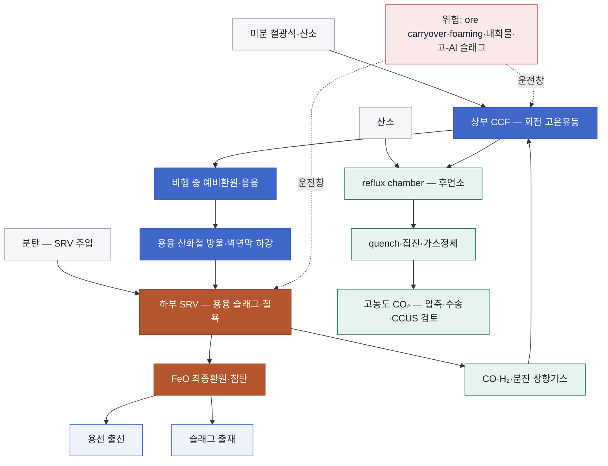
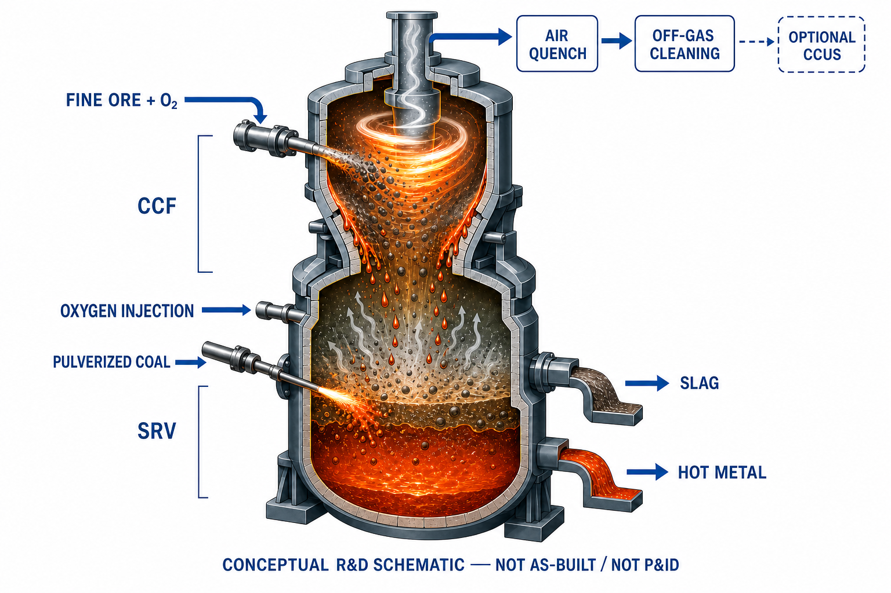

<!-- AUTO-GENERATED BY steel-intelligence. DO NOT EDIT. -->

# HIsarna 사이클론 용융환원

> 조사 기준일: **2026-07-27** · 공식·1차 자료 중심 · 사실과 AI 분석을 구분해 작성

??? info "관련 기술 바로가기 · 현재 위치: 환원·용융 경로"

    탐색을 위한 편의 분류이며 기술 우열이나 확정된 공정 관계를 뜻하지 않습니다.

    **환원·용융 경로**

    [[technologies/TEC-hydrogen-direct-reduced-iron|수소 직접환원철 (Hydrogen DRI)]] · [[technologies/TEC-hydrogen-based-fine-ore-reduction|무펠릿 미분광 수소환원 (Fluidized-bed Hydrogen Reduction)]] · [[technologies/TEC-zesty-hydrogen-flash-reduction|ZESTY 수소 직접 플래시 환원]] · [[technologies/TEC-electric-smelting-furnace|전기용융로 (Electric Smelting Furnace)]] · **HIsarna 사이클론 용융환원 · 현재** · [[technologies/TEC-hydrogen-plasma-smelting-reduction|수소 플라즈마 용융환원 (HPSR)]] · [[technologies/TEC-microwave-biomass-ironmaking|마이크로웨이브·바이오매스 환원제철 (BioIron)]]

    **전해 기반 경로**

    [[technologies/TEC-molten-oxide-electrolysis|용융산화물 전기분해 (Molten Oxide Electrolysis)]] · [[technologies/TEC-low-temperature-aqueous-iron-electrolysis|저온 수계 전해제철 (Aqueous Iron Electrolysis)]]

    **기존 설비·순환 경로**

    [[technologies/TEC-blast-furnace-ccus|고로 CCUS]] · [[technologies/TEC-high-grade-eaf-and-scrap-impurity-removal|고급강 EAF·스크랩 불순물 제거]]

    **통합·운영 기술**

    [[technologies/TEC-low-carbon-ironmaking|저탄소 제철 종합 경로 (Low-carbon Ironmaking)]] · [[technologies/TEC-smart-steelworks|스마트 제철소 (Smart Steelworks)]]

{ .steel-media-image .steel-hero-image .steel-media-detail }

*대표 이미지 — HIsarna IJmuiden 파일럿의 CCF·SRV·배가스 계통 개략도. 논문 Figure 1이며 Jamshedpur 실증설비 준공도가 아니다. (학술 자료 그림 · 권리 `link_only` · 출처 [[sources/SRC-20260727-C280FAED|SRC-20260727-C280FAED]] · [원문 페이지](https://link.springer.com/article/10.1007/s11663-022-02620-4/figures/1))*

!!! abstract "한눈에 보기"

    | 항목 | 내용 |
    | --- | --- |
    | **분류 (편집)** | 미분광 사이클론 예비환원·용융과 탄소계 용융욕 최종환원 |
    | **핵심 원리** | Cyclone Converter Furnace(CCF)와 HIsmelt계 Smelting Reduction Vessel(SRV)을 결합해 미분광을 예환원·용융한 뒤 슬래그층에서 석탄으로 최종 환원하는 용융환원 공정 [^src-20260727-c280faed] |

## 개요

Cyclone Converter Furnace(CCF)와 HIsmelt계 Smelting Reduction Vessel(SRV)을 결합해 미분광을 예환원·용융한 뒤 슬래그층에서 석탄으로 최종 환원하는 용융환원 공정 [^src-20260727-c280faed]

이 문서는 Tata Steel의 CCF와 HIsmelt계 bath smelting을 결합한 HIsarna를 다룹니다. 코크스 충전층을 유지하는 BF-CCUS와 달리 일체형 사이클론-용융욕 반응기이며, 수소 고체환원 뒤 ESF에서 녹이는 DRI–ESF 경로와도 구분합니다.

- **근거 확인 기업:** 0개
- **직접 연결 근거:** 6건

## 작동 원리

- **작동 원리:** CCF에 미분광과 산소를 주입하고 CO-H2 후연소열로 예환원·용융하며, 벽면 용융막이 SRV로 낙하해 주입 석탄과 반응해 용선을 생성 [^src-20260727-c280faed]

## 공정 구성

**색상 범례 (AI 재구성):** 회색=원료 · 코발트=CCF 예비환원·용융 · 갈색=SRV 용융욕 최종환원 · 녹색=배가스·CCUS · 옅은 코발트=용선·슬래그 · 적색=확대 운전 위험

!!! note "도식 해석"

    위 흐름도는 Tata Steel 공식 설명과 동료심사 CFD 논문을 기능 단위로 재구성한 것입니다. IJmuiden 파일럿 또는 Jamshedpur 실증로의 준공도·배관계장도(P&ID)가 아닙니다. [^src-20260727-c280faed]

## 주요 기술 특성

### 반응·셀·공정

| 구분 | 공개된 내용 | 근거 성격 |
| --- | --- | --- |
| **작동 원리** | CCF에 미분광과 산소를 주입하고 CO-H2 후연소열로 예환원·용융하며, 벽면 용융막이 SRV로 낙하해 주입 석탄과 반응해 용선을 생성 [^src-20260727-c280faed] | 학술지 논문 |

### 최신 실증·검증 정보

기존 분류표에 속하지 않는 최신 공개 결과와 확대 계획을 별도로 보존합니다. 목표·계획 문구는 달성 실적으로 해석하지 않습니다.

| 구분 | 공개된 내용 | 근거 성격 |
| --- | --- | --- |
| **IJmuiden 파일럿 명목규모** | 60,000 t-hot-metal/y nominal pilot scale [^src-20260727-c280faed] | 학술지 논문 |
| **scale-up 위험** | 후연소 혼합·체류시간, 산소 포트와 유량, 벽 열손실, 내화물 침식·부착물, 급랭·집진 및 조성변동을 파일럿 데이터로 검증해야 함 [^src-20260727-c280faed] | 학술지 논문 |
| **내화물 검사 결과** | 2020 inspection에서 고온 oxygen-lance 인근 reflux chamber 내화물 평균 두께 32–38 mm, fresh 49.5 mm 대비 감소 [^src-20260727-c280faed] | 학술지 논문 |
| **배가스 계통 구성** | reflux chamber 후연소, air quench, up leg/down leg, 필요 시 water quench, 후단 gas cooling·집진·탈황 [^src-20260727-c280faed] | 학술지 논문 |
| **생략 가능한 전처리 범위** | 미분광 직접 투입으로 소결 공정과 코크스 제조를 생략하는 경로; 펠릿 생략은 이 출처만으로 별도 확정하지 않음 [^src-20260727-c280faed] | 학술지 논문 |
| **석탄 품질 범위 검증** | 석탄 VM 3–39%, S 0.37–1.55%, ash 5–14%, fixed carbon 58–85% 범위의 원료 유연성을 파일럿에서 시험 [^src-20260727-786d57d4] | 학회 발표 |
| **장기운전 제한과 설비 보강** | 기존 활성탄 필터 사용 시 run duration 5–7일 제한; 신형 gas cooler와 SCR DeNOx를 처리용량·생산성·장기운전 개선 목적으로 추가 [^src-20260727-786d57d4] | 학회 발표 |
| **저품위광·고 Al₂O₃ 슬래그 운전** | Fe<60%, Al2O3>5% 저품위광 750 t를 처리하고 slag Al2O3 약 25%에서도 안정운전을 보고 [^src-20260727-786d57d4] | 학회 발표 |
| **제강슬래그 순환이용 실증** | BOF slag 800 t와 EAF slag 100 t를 처리; BOF slag의 표준 flux 사용 및 HIsarna slag의 시멘트·콘크리트 시험 성공을 보고 [^src-20260727-786d57d4] | 학회 발표 |
| **최고 생산성 조건 석탄 원단위** | 7.5 tHM/h 조건에서 석탄 원단위 726 kg/tHM; 특정 파일럿 운전점이며 상용 보증값이 아님 [^src-20260727-786d57d4] | 학회 발표 |
| **파일럿 누적 용선 생산·BOF 공급** | IJmuiden 파일럿 누적 용선 18,450 t, 이 중 BOF 공급 17,450 t; 상용 생산량이 아닌 누적 파일럿 실적 [^src-20260727-786d57d4] | 학회 발표 |
| **파일럿 최고 생산성** | 최고 7.5 tHM/h, 최고 일산 160 tHM/d의 파일럿 campaign 기록 [^src-20260727-786d57d4] | 학회 발표 |
| **파일럿 최장 연속운전·가용률** | 최장 연속운전 19.5일, 장기 campaign 가용률 93%; 연간 상용 가동률로 확대 해석하지 않음 [^src-20260727-786d57d4] | 학회 발표 |
| **화석탄소 대체 실적** | 과거 biochar 석탄대체 45%; 최초 천연가스 commissioning test의 저생산율 조건에서 15% 초과 대체. 100% biochar는 목표로서 미달성 [^src-20260727-786d57d4] | 학회 발표 |

## 공개 개발 연혁

| 날짜 | 공개 사건 |
| --- | --- |
| 2022-09-02 | Off-Gas System Scale-Up of HIsarna Iron-Making Process: A CFD-Based Approach [^src-20260727-c280faed] |
| 2025-12-10 | Tata Steel Board affirms the long-term strategy for growth in India [^src-20260727-fd3eba92] |
| 2026-01-20 | Green Steel Technology to Drive India's Sustainable Industrial Transition (Press Release 41/2026) [^src-20260728-433e5cf1] |
| 2026-03-05 | News Clarification (Ref. SEC/2018/2025-26) [^src-20260728-735f3bf8] |
| 2026-03-09 | Recent HIsarna operational developments at the IJmuiden pilot plant [^src-20260727-786d57d4] |
| 2026-06-04 | Integrated Report & Annual Accounts 2025-26 (119th Year): HIsarna Jamshedpur status [^src-20260728-1bfbfbdf] |

## 설비·공정 이미지

{ .steel-media-image .steel-media-detail }

**AI 재구성.** AI 재구성 — 상부 CCF에서 미분광과 산소를 투입해 용융·부분환원하고, 하부 SRV에서 미분탄 환원과 상부 공간 산소 후연소로 열을 공급해 용선과 슬래그를 분리 배출하는 HIsarna 개념도. 오프가스 급냉·정제와 선택적 CCUS 경계를 함께 표시했으며 실제 설비의 준공도나 P&ID가 아니다.

- 출처 [[sources/SRC-20260727-FD3EBA92|SRC-20260727-FD3EBA92]] · 권리 `ai_generated` · [원문 페이지](https://www.tatasteel.com/newsroom/press-releases/india/2025/tata-steel-board-affirms-the-long-term-strategy-for-growth-in-india) · 작성·촬영 OpenAI ImageGen / Codex
- 권리 메모: Tata Steel의 HIsarna 공개 설명과 Hosseini et al. 2022 오프가스 스케일업 논문을 근거로 2026-07-27 생성한 기술 설명용 AI 재구성이다. 장치 형상과 배관은 개념 표현이며 특정 설비의 as-built 또는 P&ID가 아니다.

{ .steel-media-image .steel-media-compact }

**실제 설비 사진.** Tata Steel IJmuiden의 HIsarna 파일럿 설비 전경. Tata Steel 2011-12 연차보고서 수록 사진으로, Jamshedpur 1 Mt/y 실증설비의 준공도나 현재 상태 사진이 아니다.

- 출처 [[sources/SRC-20260727-AAE02C9E|SRC-20260727-AAE02C9E]] · 권리 `link_only` · [원문 페이지](https://www.tatasteel.com/investors/annual-report-2011-12/html/principle2.html) · 작성·촬영 Tata Steel
- 권리 메모: Tata Steel 공식 연차보고서 원문 서버 직접 표시. 로컬 복제하지 않았으며 재사용 조건은 Tata Steel 원문 정책을 따른다.

## 기업별 상세 현황

## 관련 프로젝트

기술의 실제 확대 단계를 확인할 수 있도록 프로젝트 문서와 현재 상태를 직접 연결합니다. 각 프로젝트 문서에는 최근 상태뿐 아니라 확인 가능한 전체 일정 이력이 표시됩니다.

| 프로젝트 | 현재 확인 상태 | 일정·규모 |
| --- | --- | --- |
| **[[projects/PRJ-HISARNA-JAMSHEDPUR-DEMO|Tata Steel Jamshedpur HIsarna 약 100만 t/y 실증 계획]]** | 2025-12-10 이사회가 엔지니어링 작업 및 규제 승인 절차 개시를 승인; FID·EPC·착공·시운전은 공개 확인되지 않음 [^src-20260727-fd3eba92][^src-20260728-1bfbfbdf] | **연간 생산능력** 약 1,000,000 t/y demonstration design target [^src-20260727-fd3eba92][^src-20260728-1bfbfbdf] · **목표 가동 시점** 2030년까지 약 1 Mt/y 시설 구축 계획(주정부 LoI/MoU 발표상의 목표이며 확정 가동일 아님) [^src-20260728-433e5cf1] |

## 기술적 쟁점과 미공개 데이터

!!! warning "AI 분석 — 공개 근거와 구분"

    기업별 단계는 인용된 공식 발표 문구를 기준으로 분류한 것으로, 정식 TRL 판정이나 기술 경쟁력 순위가 아닙니다.

- **추가 확인이 필요한 데이터:** 향후 12~36개월 동안 Jamshedpur 실증의 설계사·EPC·인허가·FID·착공, 공개 원료사양과 광종별 장기 캠페인·용선·슬래그 품질, 연속운전 시간·가동률, 석탄·산소 원단위, 내화물·냉각 수명, CO₂ 포집·운송·저장 계약과 글로벌 라이선스 정책을 확인해야 합니다.
- 기업 간 비교에는 시험 규모, 실제 투입 원료·에너지 조건, 상용 운전 실적과 제품 단위 배출량을 같은 기준으로 적용해야 합니다.
- HIsarna의 원료 자유도는 소결·코크스를 없애는 데서 오지만, 맥석을 없애지는 않습니다. 고-Al₂O₃·저품위광은 슬래그 부피·점도·융점, flux와 열부하, 탈황·탈인, 철 수율을 동시에 바꿉니다.
- 상부 CCF의 ore carryover는 Fe 수율·집진 부하와 하부 SRV 투입량을 변화시키고, 하부 bath foaming과 후연소는 CCF 열전달·내화물과 연결됩니다. CCF와 SRV를 독립 장치처럼 최적화할 수 없습니다.
- 6만 t/y 명목 파일럿에서 약 100만 t/y 실증으로 확대할 때 cyclone 체류시간, droplet 궤적, 벽면막, 산소·분체 분배와 냉각면 열플럭스가 선형으로 유지되지 않습니다. 실제 연속 캠페인과 가동률이 CFD 설계보다 우선적인 검증치입니다.
- HIsarna는 기본적으로 탄소계 환원 공정입니다. 소결·코크스 생략에 따른 감축과 고농도 CO₂의 포집 잠재력은 회사 주장으로 구분하고, 산소제조·석탄·배가스 정제·CO₂ 수송·저장까지 포함한 순회피량을 요구해야 합니다.
- reflux chamber의 내화물 두께·열손실·CO 변동은 pilot inspection과 CFD 문헌에서 scale-up 변수로 확인됩니다. Jamshedpur 실증 원료 사양은 아직 미공개이므로 IJmuiden의 고-Al 원료 시험과 분리해 추적해야 합니다.
- Tata 이사회가 승인한 것은 엔지니어링과 규제 절차의 개시입니다. FID, EPC, 착공, 준공·가동을 같은 상태로 표시하지 않고 후속 공시를 단계별로 보존해야 합니다.

## POSCO 관점 시사점

!!! info "AI 분석 — 전략 검토용"

    다음 내용은 공개 근거를 바탕으로 한 비교 분석이며, POSCO의 공식 결정이나 투자 권고가 아닙니다.

- FINEX, HIsarna, BF-CCUS와 HyREX–ESF를 동일 광석·제품 경계에서 비교해 원료전처리, O₂, 석탄/H₂, 전력, 슬래그, 용선 P/S와 CO₂ 저장비를 정렬해야 합니다.
- POSCO의 FINEX·용융환원 경험은 HIsarna 평가에 유리하지만 CCF의 in-flight melting과 일체형 SRV 후연소는 별도 노형·제어 문제입니다. 분진·droplet·bath coupling의 계측과 모델 검증 역량을 비교해야 합니다.
- Jamshedpur의 구체 원료 사양은 미공개입니다. 향후 공개되는 광석 Al₂O₃·맥석 범위, basicity, slag kg/t, FeO, P/S 분배와 campaign length를 IJmuiden 시험 데이터와 구분해 추적해야 합니다.
- 향후 12~36개월 선행지표는 Jamshedpur 설계사/EPC·환경인허가, 예산·FID·착공, 공개 원료사양과 광종별 캠페인, 연속시간·가동률, coal–gas–biocarbon 조합, CO₂ 저장 파트너·오프테이크와 Tata의 라이선스 정책입니다.
- 판단 질문은 ‘CCUS 없이 얻는 순감축이 얼마인가’, ‘1 Mt/y 확대 시 CCF carryover와 SRV foaming을 어떻게 제어하는가’, ‘FINEX 대비 원료·용선 품질과 총비용은 어떤가’, ‘Tata의 글로벌 IP가 FTO에 주는 제약은 무엇인가’입니다.

## 12–36개월 기술 센싱 대시보드

!!! info "AI 분석 — 연구·전략 의사결정용"

    아래 항목은 공개된 목표가 실제 성과로 전환되는지를 추적하기 위한 관찰 프레임입니다. 정식 TRL 판정이나 투자 권고가 아닙니다.

### 성숙도 승격 신호

- Jamshedpur 약 1 Mt/y 계획이 엔지니어링·규제 절차에서 예산·FID·EPC·착공으로 실제 전환
- 공개 원료사양별 CCF carryover, SRV foaming, 연속시간·가동률, 용선·슬래그 품질, 석탄·산소 원단위를 검증
- reflux chamber 내화물·열손실·후연소 성능과 CO2 포집·운송·저장 계약을 장기 캠페인 데이터로 공개

### 지연·실패 신호

- 2022년 400 kt/y demo·1 Mt/y industrial 설계와 2025년 약 1 Mt/y demonstration 계획을 같은 단계·확정 용량으로 병합
- Jamshedpur 원료 사양이 미공개인데 IJmuiden 고-Al 시험을 현지 실증 확정조건으로 표현하거나 이사회 승인을 FID·착공으로 표시

### POSCO 판단 질문

- FINEX·BF-CCUS·HyREX–ESF와 동일 광석·용선 경계에서 HIsarna의 총비용·순회피 CO2 우위가 생기는 조건은 무엇인가?
- 1 Mt/y 확대 시 CCF droplet·wall film·carryover와 SRV bath foaming을 어떤 계측·모델·제어로 검증할 것인가?
- Tata의 글로벌 IP가 협력·라이선스·회피설계와 POSCO 용융환원 기술 포트폴리오에 주는 제약은 무엇인가?

## 출처

- [[sources/SRC-20260727-786D57D4|Recent HIsarna operational developments at the IJmuiden pilot plant]] — Tata Steel / Association for Iron & Steel Technology, 2026-03-09 · [원문](https://www.aist.org/getmedia/b77607bd-4387-43ca-8bfd-3dea9630032a/Recent-HIsarna-Operational-Developments-IJmuiden-Pilot-Plant.pdf)
- [[sources/SRC-20260727-C280FAED|Off-Gas System Scale-Up of HIsarna Iron-Making Process: A CFD-Based Approach]] — Springer Nature, 2022-09-02 · [원문](https://link.springer.com/article/10.1007/s11663-022-02620-4)
- [[sources/SRC-20260727-FD3EBA92|Tata Steel Board affirms the long-term strategy for growth in India]] — Tata Steel, 2025-12-10 · [원문](https://www.tatasteel.com/newsroom/press-releases/india/2025/tata-steel-board-affirms-the-long-term-strategy-for-growth-in-india/)
- [[sources/SRC-20260728-1BFBFBDF|Integrated Report & Annual Accounts 2025-26 (119th Year): HIsarna Jamshedpur status]] — Tata Steel Limited, 2026-06-04 · [원문](https://www.tatasteel.com/media/25904/tatasteel-iar-2025-26.pdf)
- [[sources/SRC-20260728-433E5CF1|Green Steel Technology to Drive India's Sustainable Industrial Transition (Press Release 41/2026)]] — Chief Minister's Secretariat, Government of Jharkhand, 2026-01-20 · [원문](https://cm.jharkhand.gov.in/sites/default/files/press-release/2026-01/Press_Release-1-20-01-2026%28English%29.pdf)
- [[sources/SRC-20260728-735F3BF8|News Clarification (Ref. SEC/2018/2025-26)]] — Tata Steel Limited / National Stock Exchange of India, 2026-03-05 · [원문](https://nsearchives.nseindia.com/corporate/NIDHIFADNAVIS_05032026095816_NSE-Clarification_signed.pdf)

[^src-20260727-786d57d4]: **Recent HIsarna operational developments at the IJmuiden pilot plant** — Tata Steel / Association for Iron & Steel Technology, 2026-03-09. [원문](https://www.aist.org/getmedia/b77607bd-4387-43ca-8bfd-3dea9630032a/Recent-HIsarna-Operational-Developments-IJmuiden-Pilot-Plant.pdf) · [[sources/SRC-20260727-786D57D4|보관 원문·메타데이터]]
[^src-20260727-c280faed]: **Off-Gas System Scale-Up of HIsarna Iron-Making Process: A CFD-Based Approach** — Springer Nature, 2022-09-02. DOI: [10.1007/s11663-022-02620-4](https://doi.org/10.1007/s11663-022-02620-4). [원문](https://link.springer.com/article/10.1007/s11663-022-02620-4) · [[sources/SRC-20260727-C280FAED|보관 원문·메타데이터]]
[^src-20260727-fd3eba92]: **Tata Steel Board affirms the long-term strategy for growth in India** — Tata Steel, 2025-12-10. [원문](https://www.tatasteel.com/newsroom/press-releases/india/2025/tata-steel-board-affirms-the-long-term-strategy-for-growth-in-india/) · [[sources/SRC-20260727-FD3EBA92|보관 원문·메타데이터]]
[^src-20260728-1bfbfbdf]: **Integrated Report & Annual Accounts 2025-26 (119th Year): HIsarna Jamshedpur status** — Tata Steel Limited, 2026-06-04. [원문](https://www.tatasteel.com/media/25904/tatasteel-iar-2025-26.pdf) · [[sources/SRC-20260728-1BFBFBDF|보관 원문·메타데이터]]
[^src-20260728-433e5cf1]: **Green Steel Technology to Drive India's Sustainable Industrial Transition (Press Release 41/2026)** — Chief Minister's Secretariat, Government of Jharkhand, 2026-01-20. [원문](https://cm.jharkhand.gov.in/sites/default/files/press-release/2026-01/Press_Release-1-20-01-2026%28English%29.pdf) · [[sources/SRC-20260728-433E5CF1|보관 원문·메타데이터]]
[^src-20260728-735f3bf8]: **News Clarification (Ref. SEC/2018/2025-26)** — Tata Steel Limited / National Stock Exchange of India, 2026-03-05. [원문](https://nsearchives.nseindia.com/corporate/NIDHIFADNAVIS_05032026095816_NSE-Clarification_signed.pdf) · [[sources/SRC-20260728-735F3BF8|보관 원문·메타데이터]]
