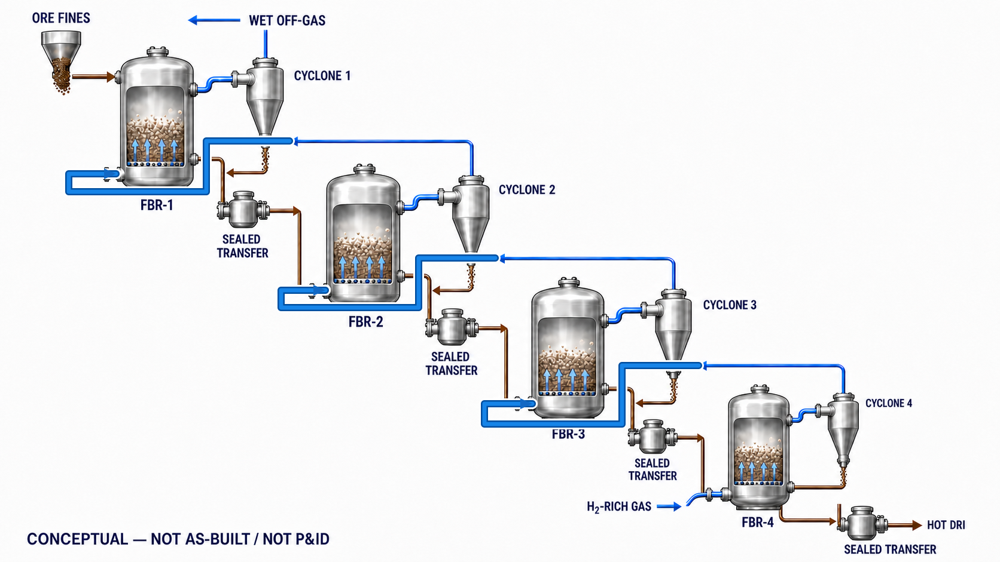
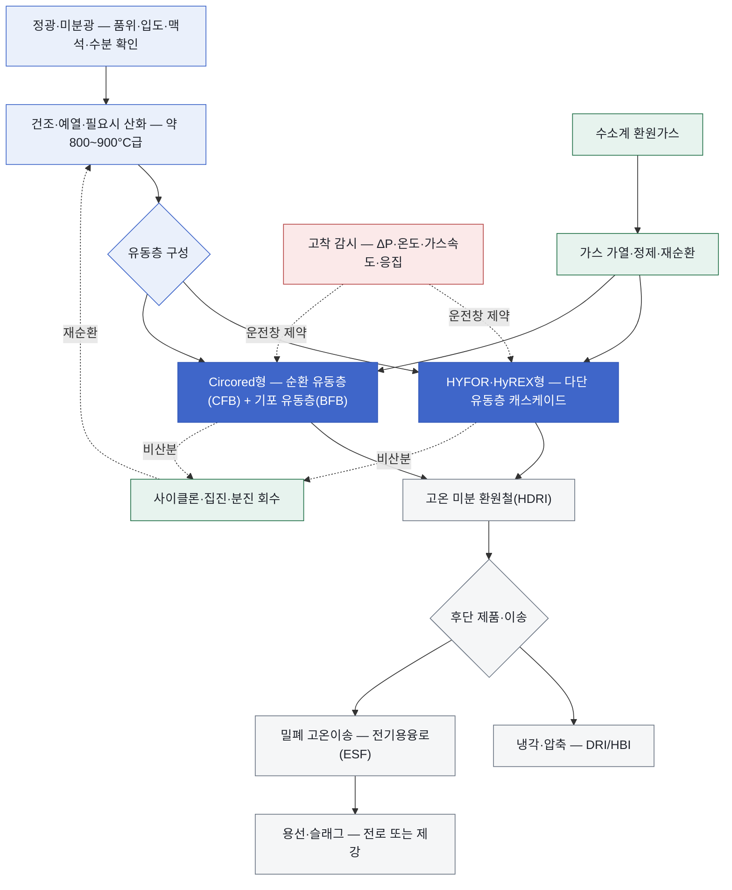

<!-- AUTO-GENERATED BY steel-intelligence. DO NOT EDIT. -->

# 무펠릿 미분광 수소환원 (Fluidized-bed Hydrogen Reduction)

> 조사 기준일: **2026-07-27** · 공식·1차 자료 중심 · 사실과 AI 분석을 구분해 작성

??? info "관련 기술 바로가기 · 현재 위치: 환원·용융 경로"

    탐색을 위한 편의 분류이며 기술 우열이나 확정된 공정 관계를 뜻하지 않습니다.

    **환원·용융 경로**

    [[technologies/TEC-hydrogen-direct-reduced-iron|수소 직접환원철 (Hydrogen DRI)]] · **무펠릿 미분광 수소환원 (Fluidized-bed Hydrogen Reduction) · 현재** · [[technologies/TEC-zesty-hydrogen-flash-reduction|ZESTY 수소 직접 플래시 환원]] · [[technologies/TEC-electric-smelting-furnace|전기용융로 (Electric Smelting Furnace)]] · [[technologies/TEC-hisarna-cyclone-smelting-reduction|HIsarna 사이클론 용융환원]] · [[technologies/TEC-hydrogen-plasma-smelting-reduction|수소 플라즈마 용융환원 (HPSR)]] · [[technologies/TEC-microwave-biomass-ironmaking|마이크로웨이브·바이오매스 환원제철 (BioIron)]]

    **전해 기반 경로**

    [[technologies/TEC-molten-oxide-electrolysis|용융산화물 전기분해 (Molten Oxide Electrolysis)]] · [[technologies/TEC-low-temperature-aqueous-iron-electrolysis|저온 수계 전해제철 (Aqueous Iron Electrolysis)]]

    **기존 설비·순환 경로**

    [[technologies/TEC-blast-furnace-ccus|고로 CCUS]] · [[technologies/TEC-high-grade-eaf-and-scrap-impurity-removal|고급강 EAF·스크랩 불순물 제거]]

    **통합·운영 기술**

    [[technologies/TEC-low-carbon-ironmaking|저탄소 제철 종합 경로 (Low-carbon Ironmaking)]] · [[technologies/TEC-smart-steelworks|스마트 제철소 (Smart Steelworks)]]

{ .steel-media-image .steel-hero-image .steel-media-detail }

*대표 이미지 — AI 재구성 — POSCO 공개 HyREX 개념도를 바탕으로 4개 독립 유동층 반응기의 계단식 캐스케이드, 단계별 cyclone의 비산 미분 회수·동일 반응기 환류, 환원가스의 FBR-4→FBR-1 향류, 압력 경계를 고려한 단계간 고체 이송과 고온 DRI 밀폐 배출을 재구성했다. 반응기 단수와 이송·밀봉 상세는 공개 개념 범위이며 실제 실증설비의 준공도·PFD·P&ID가 아니다. (AI 재구성 · 권리 `ai_generated` · 출처 [[sources/SRC-20260725-013F0FA1|SRC-20260725-013F0FA1]] · [원문 페이지](https://www.posco.com/homepage/docs/eng7/jsp/hyrex))*

!!! abstract "한눈에 보기"

    | 항목 | 내용 |
    | --- | --- |
    | **분류 (편집)** | 미분광 전처리·유동층 직접환원·전기용융 통합 |
    | **핵심 원리** | 철광석 미분을 소결·통상 펠릿화하지 않고 수소계 환원가스로 유동층에서 직접환원하는 공정군 [^src-20260725-a23b5a64] |
    | **제품 형태** | HYFOR의 고온 미분 DRI는 약 600°C로 배출되며 HBI 압축 또는 용융설비 직결이 가능 [^src-20260725-a23b5a64] |
    | **적용 원료** | HYFOR는 입자 크기 0.15 mm 미만의 철광석 농축분을 100% 사용할 수 있도록 설계됨 [^src-20260725-a23b5a64] |
    | **공개 개발 단계** | HYFOR는 파일럿 운전, HY4SMELT와 POSCO HyREX는 통합 실증 설비 건설·준비 단계 [^src-20260725-e316d68f] |

## 개요

철광석 미분을 소결·통상 펠릿화하지 않고 수소계 환원가스로 유동층에서 직접환원하는 공정군 [^src-20260725-a23b5a64]

‘무펠릿’은 모든 조립을 금지한다는 뜻이 아닙니다. Circored는 통상적인 DR 펠릿을 생략하지만 50 μm 이하 초미분을 바인더와 함께 미세 조립할 수 있습니다. 또한 HYFOR·HyREX의 다단 유동층과 Circored의 순환·기포 유동층은 반응기 구성과 운전창이 다르므로 동일 공정으로 합산하지 않습니다.

- **근거 확인 기업:** 3개
- **직접 연결 근거:** 13건

## 작동 원리

## 공정 구성

**색상 범례 (AI 재구성):** 청색=원료 전처리·경로 분기 · 진한 청색=유동층 환원 · 녹색=환원가스·분진 순환 · 회색=환원철·용융 제품 · 적색=고착 운전 제약

!!! note "도식 해석"

    위 도식은 HYFOR·HyREX·Circored 공식 자료와 고착 연구를 공통 기능으로 재구성한 비교도입니다. 특정 플랜트의 배관계장도나 실제 설비 배치도가 아니며, 각 기술의 반응기 수·가스 흐름·초미분 처리 방식은 서로 다릅니다. [^src-20260725-a23b5a64]

## 주요 기술 특성

### 반응·셀·공정

| 구분 | 공개된 내용 | 근거 성격 |
| --- | --- | --- |
| **공정 구성** | 발표는 FINEX·HyREX형 유동층이 소결·펠릿화 없이 분광을 사용할 수 있지만 유동화를 위해 광석 대비 큰 수소 유량이 필요하다고 설명했다. 이는 발표자의 공정 해설이며 HyREX 상업 성능 검증은 아니다. [^src-20260726-eadb3777] | 학회 발표 |
| **건조·예열·산화** | HYFOR는 미분광을 800°C 이상에서 예열·산화하고, 파일럿 설명에서는 약 900°C 예열 후 환원함 [^src-20260725-a23b5a64] | 설비 공급사 |
| **유동화 방식** | HYFOR·HyREX는 다단 유동층 캐스케이드, Circored는 순환 유동층과 기포 유동층을 조합 [^src-20260725-6f7c35d8] | 설비 공급사 |
| **유동층 단계 구성** | HYFOR는 가스 정제·가열 계통과 연결된 일련의 유동층 반응기에서 단계적으로 환원 [^src-20260725-a23b5a64] | 설비 공급사 |
| **환원가스 재순환** | HYFOR는 반응 후 가스를 정제해 공정으로 재순환하는 폐회로 환원가스 계통을 사용 [^src-20260725-a23b5a64] | 설비 공급사 |
| **분진 회수·재순환** | HYFOR 파일럿은 건식 집진으로 회수한 분진을 공정에 재투입하도록 구성 [^src-20260725-bc8de092] | 설비 공급사 |
| **단계별 cyclone 기능** | POSCO·RIST의 FINEX 계열 선행 특허는 각 유동층 반응기 상부 배출가스에서 cyclone으로 비산 미분을 분리해 동일 반응기 하부로 환류하고, 미분이 제거된 가스는 다음 반응기로 보내는 구성을 공개한다. 이는 현재 HyREX 실증설비의 준공도나 상세 압력실링 구성을 뜻하지 않는다. [^src-20260727-481a04fd] | 특허 |
| **고착 발생 메커니즘** | 환원 중 생성된 금속철 표면과 철 whisker가 입자 사이 결합을 만들어 유동층 탈유동화를 일으킬 수 있음 [^src-20260725-043634ea] | 학술지 논문 |
| **고착 억제 수단** | 고착 완화 수단은 표면 코팅, 광석 혼합, 조립, 단계환원, 순환·원추형 유동층, 기계적 교반과 입자 구조 제어를 포함 [^src-20260725-043634ea] | 학술지 논문 |

### 원료·운전·제품

| 구분 | 공개된 내용 | 근거 성격 |
| --- | --- | --- |
| **적용 원료** | HYFOR는 입자 크기 0.15 mm 미만의 철광석 농축분을 100% 사용할 수 있도록 설계됨 [^src-20260725-a23b5a64] | 설비 공급사 |
| **제품 형태** | HYFOR의 고온 미분 DRI는 약 600°C로 배출되며 HBI 압축 또는 용융설비 직결이 가능 [^src-20260725-a23b5a64] | 설비 공급사 |
| **원료 품질 요구** | 다단 수소환원 발표는 맥석 증가가 최종 환원도 저하 및 fayalite 같은 난환원상 형성과 연결될 수 있다고 결론냈다. [^src-20260726-eadb3777] | 학회 발표 |
| **원료 입도 범위** | HYFOR 기준 0.15 mm 미만; Circored 기준 통상 0.1~2.0 mm이며 열적 파쇄 조건에 따라 최대 6 mm까지 검토 [^src-20260725-a23b5a64] | 설비 공급사 |
| **초미분 처리** | Circored는 50 μm 미만 초미분을 바인더와 함께 평균 0.5 mm 미만으로 미세조립할 수 있음 [^src-20260725-6f7c35d8] | 설비 공급사 |
| **환원 온도** | Circored는 철 고착을 피하기 위해 수소 환원을 700°C 미만에서 수행하도록 설계 [^src-20260725-6f7c35d8] | 설비 공급사 |
| **단계별 환원도** | Circored의 첫 순환 유동층에서 최대 약 80%, 후단 기포 유동층에서 95% 초과 금속화를 목표 [^src-20260725-6f7c35d8] | 설비 공급사 |
| **비산·입자 손실 위험** | 미립자 비산은 유동층의 철 손실·집진 부하·입도별 체류시간 편차를 만드는 핵심 운전 위험 [^src-20260725-043634ea] | 학술지 논문 |
| **가스속도 상충관계** | 가스속도를 높이면 입자 접촉·고착을 줄일 수 있으나 가스 이용률 저하와 에너지·비산 부담이 증가할 수 있음 [^src-20260725-043634ea] | 학술지 논문 |
| **광석 품위·맥석 영향** | 광석 품위와 맥석 조성은 철 핵생성·whisker·입자 표면을 통해 고착과 환원 거동에 영향을 줌 [^src-20260725-043634ea] | 학술지 논문 |
| **입자 형상·표면 영향** | 입자 크기뿐 아니라 형상·표면 구조와 환원 중 생성철의 형태가 고착 성향을 좌우함 [^src-20260725-043634ea] | 학술지 논문 |
| **압축·브리켓 필요성** | Circored는 환원철을 HBI로 압축하는 경로와 뜨거운 DRI를 직접 용융하는 경로를 모두 제시 [^src-20260725-6f7c35d8] | 설비 공급사 |
| **고온 환원철 이송** | HyREX 포항 실증 공급범위에는 유동층에서 전기용융로까지 고온 DRI를 운반하는 설비가 포함 [^src-20260725-bab49577] | 설비 공급사 |
| **후단 제품 처리** | 저품위 미분광 Circored 경로는 약 85% 금속화 후 전기용융로에서 용선과 슬래그로 분리하는 구성을 제시 [^src-20260725-6f7c35d8] | 설비 공급사 |

### 실증·산업화

| 구분 | 공개된 내용 | 근거 성격 |
| --- | --- | --- |
| **공개 개발 단계** | HYFOR는 파일럿 운전, HY4SMELT와 POSCO HyREX는 통합 실증 설비 건설·준비 단계 [^src-20260725-e316d68f] | 설비 공급사 |
| **상용 규모 확대 조건** | 상업화에는 장기 압력강하 안정성, 고착·분진·사이클론 마모, 가스정제와 고온 DRI-ESF 통합 가동률 검증이 필요 [^src-20260725-043634ea] | 학술지 논문 |
| **상용화 모델** | Circored 표준 설계는 단일 라인 연 125만 톤 규모를 제시하지만 현재 상업 운전 실적과는 구분해야 함 [^src-20260725-6f7c35d8] | 설비 공급사 |
| **과거 실증 이력** | Trinidad Circored 실증은 1999년 가동을 시작해 수개월 동안 30만 톤을 넘는 HBI를 생산했다고 공급사가 보고 [^src-20260725-6f7c35d8] | 설비 공급사 |
| **파일럿 회분 투입량** | HYFOR 2021년 초기 시험은 시험 회당 약 800 kg의 광석을 사용 [^src-20260725-bc8de092] | 설비 공급사 |
| **파일럿 캠페인 계획** | HYFOR는 2021년부터 최소 2년간 여러 광종을 대상으로 시험 캠페인을 계획 [^src-20260725-bc8de092] | 설비 공급사 |

## 공개 개발 연혁

| 날짜 | 공개 사건 |
| --- | --- |
| 2003-07-01 | US6585798B2 — Fluidized bed reactor for preventing the fine iron ore from sticking therein and method thereof [^src-20260727-481a04fd] |
| 2020-01-15 | A Review on Prevention of Sticking during Fluidized Bed Reduction of Fine Iron Ore [^src-20260725-043634ea] |
| 2021-06-24 | HYFOR Pilot Plant Under Operation [^src-20260725-bc8de092] |
| 2024-09-11 | POSCO HyREX electric smelting furnace pilot status [^src-20260725-a6759186] |
| 2024-09-19 | Primetals Technologies and POSCO Sign Cooperation Agreement for HyREX Direct Reduction Plant [^src-20260725-bab49577] |
| 2025-09-25 | Construction begins on HYFOR and Smelter demonstration plant [^src-20260725-e316d68f] |
| 2025-10-29 | POSCO decarbonization strategies from CCUS to HyREX [^src-20260725-ff076fe4] |
| 2026-03-11 | Reduction Behaviour of Iron Ores by H2 at Multi-Stage Reduction [^src-20260726-eadb3777] |
| 2026-06-22 | POSCO completes Gwangyang EAF and advances HyREX [^src-20260725-b859ca04] |

## 설비·공정 이미지

{ .steel-media-image .steel-media-detail }

**공정 개념도.** POSCO 공식 HyREX 공정도: 분철광석-4단 유동층 환원로-DRI-전기용융로-전로-연속주조 연계

- 출처 [[sources/SRC-20260725-013F0FA1|SRC-20260725-013F0FA1]] · 권리 `link_only` · [원문 페이지](https://www.posco.com/homepage/docs/eng7/jsp/hyrex) · 작성·촬영 POSCO
- 권리 메모: POSCO 공식 HyREX 페이지에서 원본 이미지와 공정 설명을 확인했습니다. 재사용 권한은 별도 확인하지 않아 원격 링크로만 표시합니다.

{ .steel-media-image .steel-media-compact }

**실제 설비 사진.** Primetals Technologies HYFOR 파일럿 플랜트의 실제 유동층 반응기 설비

- 출처 [[sources/SRC-20260725-A23B5A64|SRC-20260725-A23B5A64]] · 권리 `link_only` · [원문 페이지](https://www.primetals.com/en/portfolio/solutions/ironmaking/direct-reduction/hyfor) · 작성·촬영 Primetals Technologies
- 권리 메모: Primetals Technologies 공식 HYFOR 기술 페이지에서 원본 이미지와 캡션을 확인했습니다. 재사용 권한은 별도 확인하지 않아 원문 링크만 보존합니다.

{ .steel-media-image .steel-media-compact }

**실제 설비 사진.** Primetals Technologies HYFOR 파일럿 플랜트의 미분광 분배·공급 설비

- 출처 [[sources/SRC-20260725-A23B5A64|SRC-20260725-A23B5A64]] · 권리 `link_only` · [원문 페이지](https://www.primetals.com/en/portfolio/solutions/ironmaking/direct-reduction/hyfor) · 작성·촬영 Primetals Technologies
- 권리 메모: Primetals Technologies 공식 HYFOR 기술 페이지에서 원본 이미지와 캡션을 확인했습니다. 재사용 권한은 별도 확인하지 않아 원문 링크만 보존합니다.

## 기업별 상세 현황

### [[companies/COM-POSCO|POSCO]]

**확인된 현황.** 포항제철소에서 연 30만 톤 HyREX 통합 실증설비를 공동설계하고 부지를 준비 중; 2030년 상용화 기술개발 완료 목표 [^src-20260725-b859ca04]

**단계 판단: 연구·실증.** 기술 가능성을 검증하는 단계입니다. 시험 규모의 성공을 상용 생산성과로 해석하지 않고 규모 확대 계획을 따로 확인해야 합니다.

- **날짜:** 발표 2026-06-22 · 수집 2026-07-25 · 검증 2026-07-25

### [[companies/COM-voestalpine|voestalpine]]

**확인된 현황.** HYFOR와 Smelter를 결합한 Linz HY4SMELT 산업규모 실증설비 건설 중; 2027년 말 가동 목표 [^src-20260725-e316d68f]

**단계 판단: 건설·구축.** 설비 투자가 물리적 실행 단계에 들어갔습니다. 준공 일정, 공사비 변동과 시운전 결과가 다음 판단 기준입니다.

- **날짜:** 발표 2025-09-25 · 수집 2026-07-25 · 검증 2026-07-25

### [[companies/COM-Rio-Tinto|Rio Tinto]]

**확인된 현황.** voestalpine·Primetals 등과 HY4SMELT 실증에 참여해 저·중품위 미분광의 HYFOR-전기 Smelter 경로를 검증 중 [^src-20260725-e316d68f]

**단계 판단: 연구·실증.** 기술 가능성을 검증하는 단계입니다. 시험 규모의 성공을 상용 생산성과로 해석하지 않고 규모 확대 계획을 따로 확인해야 합니다.

- **날짜:** 발표 2025-09-25 · 수집 2026-07-25 · 검증 2026-07-25

## 관련 프로젝트

기술의 실제 확대 단계를 확인할 수 있도록 프로젝트 문서와 현재 상태를 직접 연결합니다. 각 프로젝트 문서에는 최근 상태뿐 아니라 확인 가능한 전체 일정 이력이 표시됩니다.

| 프로젝트 | 현재 확인 상태 | 일정·규모 |
| --- | --- | --- |
| **[[projects/PRJ-HYFOR-DONAWITZ-PILOT|HYFOR Donawitz 수소환원 파일럿]]** | 2021년 4월 시운전 후 초기 시험 캠페인을 수행한 HYFOR 수소 미분광 환원 파일럿 [^src-20260725-bc8de092] | - |
| **[[projects/PRJ-HY4SMELT|HY4Smelt 실증 프로젝트]]** | 건설 중 [^src-20260725-e316d68f] | **시간당 처리능력** 시간당 3톤 (3 tonnes per hour) [^src-20260725-e316d68f] · **목표 가동 시점** 2027년 말 [^src-20260725-e316d68f] |
| **[[projects/PRJ-POSCO-HYREX-DEMO|POSCO 포항 HyREX 통합 실증]]** | 포항제철소 30만 t/y HyREX 통합 실증설비 공동설계 및 부지 준비 단계 [^src-20260725-b859ca04] | **연간 생산능력** 연 300,000 tonnes [^src-20260725-b859ca04] |

## 기술적 쟁점과 미공개 데이터

!!! warning "AI 분석 — 공개 근거와 구분"

    기업별 단계는 인용된 공식 발표 문구를 기준으로 분류한 것으로, 정식 TRL 판정이나 기술 경쟁력 순위가 아닙니다.

- **추가 확인이 필요한 데이터:** 광종별 입도창·열적 파쇄, 반응기별 ΔP·고착·비산, 수소 이용률과 금속화율 분포, 분진 회수 후 철 수율, 고온 환원철 이송, ESF 통합 가동률, 장기 캠페인 정비 이력과 원료부터 용선까지의 에너지·배출 경계를 확인해야 합니다.
- 기업 간 비교에는 시험 규모, 실제 투입 원료·에너지 조건, 상용 운전 실적과 제품 단위 배출량을 같은 기준으로 적용해야 합니다.
- 이 기술의 경제적 가설은 ‘펠릿 가격을 아낀다’에서 끝나지 않습니다. 선광 정광을 직접 쓰면 소결·펠릿 설비와 그 배출을 줄일 수 있지만, 건조·예열·가스 순환·집진·분진 회수·고온 이송 설비가 새로 필요합니다. 원료부터 용선까지의 총 에너지·수율·설비비를 같은 경계에서 비교해야 합니다.
- 유동화 가능한 입도창은 공급사가 제시하는 평균 입도만으로 판단할 수 없습니다. 광석의 열적 파쇄로 운전 중 초미분이 늘 수 있고, 넓은 입도분포에서는 큰 입자가 덜 환원되는 동안 작은 입자는 비산합니다. 입도별 체류시간·금속화율·비산률과 회수 후 재투입 횟수를 질량수지로 확인해야 합니다.
- 고착은 단순히 ‘입자가 녹아 붙는 현상’이 아닙니다. 환원 중 새로 생성된 금속철 표면과 철 whisker가 입자 사이를 연결해 유동성을 잃게 할 수 있습니다. 온도, 가스속도, 압력, 광석 품위·입자형상·맥석이 함께 작용하므로 한 광종의 단기 성공을 다른 정광과 상업 반응기로 확대하면 안 됩니다.
- 온도를 낮추면 고착을 줄일 수 있지만 환원속도와 가스 이용률이 낮아질 수 있고, 가스속도를 높이면 접촉·응집은 줄어도 압축·가열 동력, 비산과 수소 이용률이 악화될 수 있습니다. 고착 제어는 코팅·혼광·미세조립·단계환원·반응기 구조를 포함한 다목적 운전 최적화 문제입니다.
- HYFOR의 다단 캐스케이드와 Circored의 순환·기포 유동층 조합은 서로 다른 체류시간·열수지 해법입니다. ‘유동층’이라는 이름만으로 처리량·금속화율을 비교하지 말고 각 단계의 온도, 압력강하, 고체 순환, 가스 조성과 환원도를 같은 기준으로 정렬해야 합니다.
- 무펠릿 경로도 초미분 관리는 피할 수 없습니다. Circored는 50 μm 이하 분획을 바인더로 미세조립할 수 있으므로, 펠릿 공정 생략 편익에서 미세조립·건조 비용과 바인더가 환원·슬래그에 미치는 영향을 제외하면 안 됩니다.
- 환원철이 약 600°C의 미분 상태로 나오면 재산화·발화·분진 폭발 위험과 열손실이 생깁니다. HBI로 압축하면 수송성은 좋아지지만 냉각·재가열 손실이 생기고, ESF로 직결하면 밀폐 고온이송의 신뢰성과 양 설비의 가동률 동기화가 핵심이 됩니다.
- Circored의 1999년 Trinidad 실증과 30만 톤 이상 HBI 생산은 중요한 장기 이력이나, 현재의 재생수소·고품위 정광·ESF 통합 상업설비를 곧바로 입증하지는 않습니다. 과거 운전의 정지 원인·제품 품질과 최신 설계 변경을 분리해 읽어야 합니다.
- 파일럿의 배치당 투입량이나 시간당 처리량은 반응 검증 지표이지 상업 준비도 그 자체가 아닙니다. 장기 캠페인에서 압력강하 안정성, 벽면 부착, 사이클론 마모, 가스 정제, 내화물·배관 수명, 정비시간과 전체 철 회수율이 공개되어야 합니다.

## POSCO 관점 시사점

!!! info "AI 분석 — 전략 검토용"

    다음 내용은 공개 근거를 바탕으로 한 비교 분석이며, POSCO의 공식 결정이나 투자 권고가 아닙니다.

- POSCO HyREX의 핵심 경쟁력은 FINEX에서 축적한 분광 유동층 경험을 수소계 가스와 ESF에 재구성하는 데 있습니다. 그러나 FINEX의 석탄가스·공정열과 HyREX의 수소계 열수지는 다르므로 기존 가동경험을 수소 실적으로 간주하면 안 됩니다. 반응기별 가스조성·보조열·금속화율을 별도로 공개해야 합니다.
- 포항 HyREX 실증은 건조기, 다단 유동층, 고온 환원철 이송, ESF, 집진, 출선과 슬래그 처리까지 하나의 공정열차로 검증해야 의미가 있습니다. 1 t/h ESF의 첫 용선 생산은 용융 단위조작의 근거이며, 30만 t/y 통합 실증의 연속운전 증거와는 분리해 관리해야 합니다.
- HYFOR·Circored는 외부 벤치마크로서 가치가 다릅니다. HYFOR는 다양한 정광의 다단 수소 유동층 파일럿 운전, Circored는 상업 크기 설계와 과거 HBI 실증 이력을 제공합니다. POSCO는 동일 정광 샘플을 기준으로 입도창·분진율·금속화율·수소이용률·고착 한계를 비교하는 공급사 중립 시험이 필요합니다.
- 우선 모니터링 지표는 원료 광종·품위·입도분포, 건조·예열 에너지, 반응기별 온도·압력강하·가스속도, 수소 원단위와 재순환율, 금속화율 분포, 비산분·철 손실·재순환 횟수, 고착·비계획 정지, HDRI 온도, ESF 철 회수율·슬래그량, 전체 설비 가동률과 제품 톤당 전력·수소·배출량입니다.

## 12–36개월 기술 센싱 대시보드

!!! info "AI 분석 — 연구·전략 의사결정용"

    아래 항목은 공개된 목표가 실제 성과로 전환되는지를 추적하기 위한 관찰 프레임입니다. 정식 TRL 판정이나 투자 권고가 아닙니다.

### 성숙도 승격 신호

- HyREX의 실제 착공·EPC, 반응기별 장기 ΔP·고착·비산, 광종별 금속화 분포와 Fe 수율을 단계별 시험운전에서 공개
- 50 kg/batch 시험로에서 300,000 t/y 통합실증으로 확대할 때 수소이용률, 분진 회수, 고온이송과 ESF 통합 가동률을 함께 검증
- 2028 설비완공 목표와 2030 운전조건·기술성숙 목표를 구분해 실제 commissioning·ramp-up 이력으로 전환

### 지연·실패 신호

- 부지승인·목표 착공일을 건설 진척으로 표현하거나, 기계적 완공을 상용 운전기술 확보로 간주
- 평균 금속화율만 공개하고 입도별 비산·응집, reactor train 편차, 수소·전력·철 질량수지가 없음

### POSCO 판단 질문

- 광종별 유동화·sticking 운전창과 ESF의 허용 FeO·맥석 창을 하나의 통합시험계획으로 어떻게 연결할 것인가?
- HyREX 독자 확대와 ZESTY·HYFOR·샤프트 DRI benchmark를 어떤 공통 KPI로 비교할 것인가?
- 착공·실증 지연 시 확보할 외부 DRI/HBI 또는 대체 환원 기술의 hedge는 무엇인가?

## 출처

- [[sources/SRC-20260725-013F0FA1|HyREX Hydrogen Reduction Ironmaking]] — POSCO, 게시일 미상 · [원문](https://www.posco.com/homepage/docs/eng7/jsp/hyrex/)
- [[sources/SRC-20260725-043634EA|A Review on Prevention of Sticking during Fluidized Bed Reduction of Fine Iron Ore]] — The Iron and Steel Institute of Japan, 2020-01-15 · [원문](https://www.jstage.jst.go.jp/article/isijinternational/60/1/60_ISIJINT-2019-392/_html/-char/en)
- [[sources/SRC-20260725-6F7C35D8|Circored Fine Ore Direct Reduction]] — Metso Outotec, 게시일 미상 · [원문](https://www.metso.com/globalassets/pdfs-and-other-downloads/circored---fine-ore-direct-reduction.pdf?r=3)
- [[sources/SRC-20260725-A23B5A64|HYFOR: Hydrogen-Based Fine-Ore Reduction]] — Primetals Technologies, 게시일 미상 · [원문](https://www.primetals.com/en/portfolio/solutions/ironmaking/direct-reduction/hyfor/)
- [[sources/SRC-20260725-A6759186|POSCO HyREX electric smelting furnace pilot status]] — POSCO Group Newsroom, 2024-09-11 · [원문](https://newsroom.posco.com/en/world-climate-industry-expo-2024-checking-posco-groups-carbon-reduction-capabilities/)
- [[sources/SRC-20260725-B859CA04|POSCO completes Gwangyang EAF and advances HyREX]] — POSCO Group Newsroom, 2026-06-22 · [원문](https://newsroom.posco.com/en/posco-accelerates-transition-to-decarbonized-production-system-with-completion-of-koreas-largest-electric-arc-furnace/)
- [[sources/SRC-20260725-BAB49577|Primetals Technologies and POSCO Sign Cooperation Agreement for HyREX Direct Reduction Plant]] — Primetals Technologies, 2024-09-19 · [원문](https://www.primetals.com/en/news/primetals-technologies-and-posco-sign-cooperation-agreement-for-hyrex-direct-reduction-plant/)
- [[sources/SRC-20260725-BC8DE092|HYFOR Pilot Plant Under Operation]] — Primetals Technologies, 2021-06-24 · [원문](https://www.primetals.com/en/news/hyfor-pilot-plant-under-operation-the-next-step-for-carbon-free-hydrogen-based-direct-reduction-is-done/)
- [[sources/SRC-20260725-E316D68F|Construction begins on HYFOR and Smelter demonstration plant]] — Primetals Technologies, 2025-09-25 · [원문](https://dam.primetals.com/m/6c938163b0f170c0/original/PR2025083472en.pdf)
- [[sources/SRC-20260725-FF076FE4|POSCO decarbonization strategies from CCUS to HyREX]] — POSCO Group Newsroom, 2025-10-29 · [원문](https://newsroom.posco.com/en/from-ccus-to-hyrex-the-full-lineup-of-posco-groups-decarbonization-strategies-for-a-sustainable-steel-industry/)
- [[sources/SRC-20260726-EADB3777|Reduction Behaviour of Iron Ores by H2 at Multi-Stage Reduction]] — Association for Iron & Steel Technology, 2026-03-11 · [원문](https://www.aist.org/getmedia/36162fc5-d792-4bb2-bcb3-23c66d1e625e/Reduction-Behaviour-of-Iron-Ores-by-H2.pdf)
- [[sources/SRC-20260727-481A04FD|US6585798B2 — Fluidized bed reactor for preventing the fine iron ore from sticking therein and method thereof]] — POSCO Holdings Inc. / RIST, 2003-07-01 · [원문](https://patents.google.com/patent/US6585798)
- [[sources/SRC-20260727-A39F1D70|POSCO Climate Change - HyREX demonstration plan and current schedule]] — POSCO ESG, 게시일 미상 · [원문](https://sustainability.posco.com/S91/S91F10/eng/cmspage.do?mmcd=2648825310001953)

[^src-20260725-043634ea]: **A Review on Prevention of Sticking during Fluidized Bed Reduction of Fine Iron Ore** — The Iron and Steel Institute of Japan, 2020-01-15. DOI: [10.2355/isijinternational.isijint-2019-392](https://doi.org/10.2355/isijinternational.isijint-2019-392). [원문](https://www.jstage.jst.go.jp/article/isijinternational/60/1/60_ISIJINT-2019-392/_html/-char/en) · [[sources/SRC-20260725-043634EA|보관 원문·메타데이터]]
[^src-20260725-6f7c35d8]: **Circored Fine Ore Direct Reduction** — Metso Outotec, 게시일 미상. [원문](https://www.metso.com/globalassets/pdfs-and-other-downloads/circored---fine-ore-direct-reduction.pdf?r=3) · [[sources/SRC-20260725-6F7C35D8|보관 원문·메타데이터]]
[^src-20260725-a23b5a64]: **HYFOR: Hydrogen-Based Fine-Ore Reduction** — Primetals Technologies, 게시일 미상. [원문](https://www.primetals.com/en/portfolio/solutions/ironmaking/direct-reduction/hyfor/) · [[sources/SRC-20260725-A23B5A64|보관 원문·메타데이터]]
[^src-20260725-a6759186]: **POSCO HyREX electric smelting furnace pilot status** — POSCO Group Newsroom, 2024-09-11. [원문](https://newsroom.posco.com/en/world-climate-industry-expo-2024-checking-posco-groups-carbon-reduction-capabilities/) · [[sources/SRC-20260725-A6759186|보관 원문·메타데이터]]
[^src-20260725-b859ca04]: **POSCO completes Gwangyang EAF and advances HyREX** — POSCO Group Newsroom, 2026-06-22. [원문](https://newsroom.posco.com/en/posco-accelerates-transition-to-decarbonized-production-system-with-completion-of-koreas-largest-electric-arc-furnace/) · [[sources/SRC-20260725-B859CA04|보관 원문·메타데이터]]
[^src-20260725-bab49577]: **Primetals Technologies and POSCO Sign Cooperation Agreement for HyREX Direct Reduction Plant** — Primetals Technologies, 2024-09-19. [원문](https://www.primetals.com/en/news/primetals-technologies-and-posco-sign-cooperation-agreement-for-hyrex-direct-reduction-plant/) · [[sources/SRC-20260725-BAB49577|보관 원문·메타데이터]]
[^src-20260725-bc8de092]: **HYFOR Pilot Plant Under Operation** — Primetals Technologies, 2021-06-24. [원문](https://www.primetals.com/en/news/hyfor-pilot-plant-under-operation-the-next-step-for-carbon-free-hydrogen-based-direct-reduction-is-done/) · [[sources/SRC-20260725-BC8DE092|보관 원문·메타데이터]]
[^src-20260725-e316d68f]: **Construction begins on HYFOR and Smelter demonstration plant** — Primetals Technologies, 2025-09-25. [원문](https://dam.primetals.com/m/6c938163b0f170c0/original/PR2025083472en.pdf) · [[sources/SRC-20260725-E316D68F|보관 원문·메타데이터]]
[^src-20260725-ff076fe4]: **POSCO decarbonization strategies from CCUS to HyREX** — POSCO Group Newsroom, 2025-10-29. [원문](https://newsroom.posco.com/en/from-ccus-to-hyrex-the-full-lineup-of-posco-groups-decarbonization-strategies-for-a-sustainable-steel-industry/) · [[sources/SRC-20260725-FF076FE4|보관 원문·메타데이터]]
[^src-20260726-eadb3777]: **Reduction Behaviour of Iron Ores by H2 at Multi-Stage Reduction** — Association for Iron & Steel Technology, 2026-03-11. [원문](https://www.aist.org/getmedia/36162fc5-d792-4bb2-bcb3-23c66d1e625e/Reduction-Behaviour-of-Iron-Ores-by-H2.pdf) · [[sources/SRC-20260726-EADB3777|보관 원문·메타데이터]]
[^src-20260727-481a04fd]: **US6585798B2 — Fluidized bed reactor for preventing the fine iron ore from sticking therein and method thereof** — POSCO Holdings Inc. / RIST, 2003-07-01. [원문](https://patents.google.com/patent/US6585798) · [[sources/SRC-20260727-481A04FD|보관 원문·메타데이터]]
