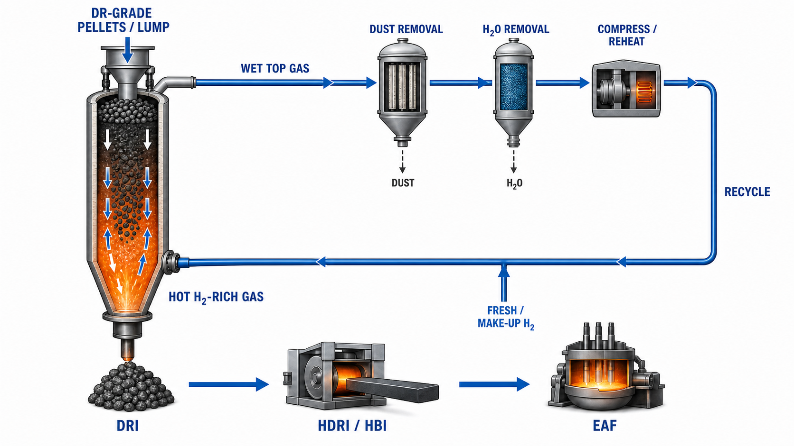
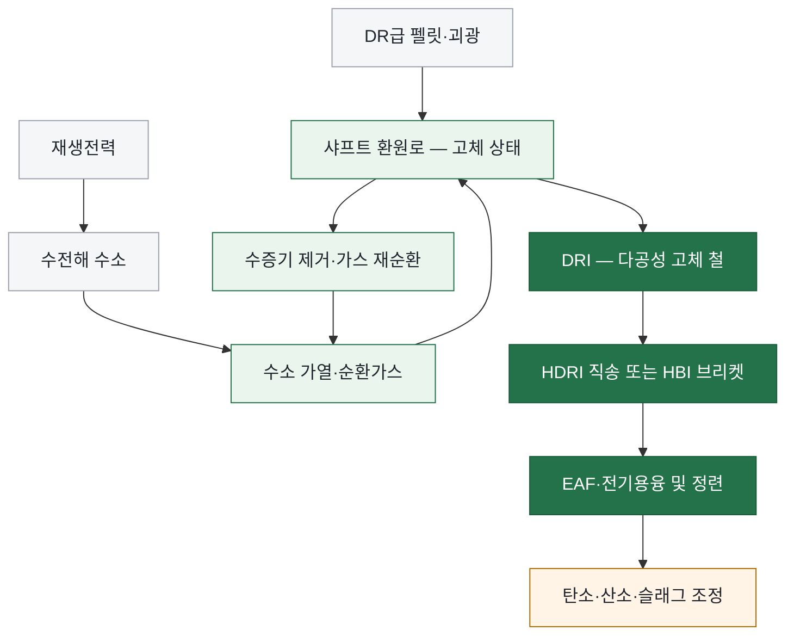

<!-- AUTO-GENERATED BY steel-intelligence. DO NOT EDIT. -->

# 수소 직접환원철 (Hydrogen DRI)

> 조사 기준일: **2026-07-25** · 공식·1차 자료 중심 · 사실과 AI 분석을 구분해 작성

??? info "관련 기술 바로가기 · 현재 위치: 환원·용융 경로"

    탐색을 위한 편의 분류이며 기술 우열이나 확정된 공정 관계를 뜻하지 않습니다.

    **환원·용융 경로**

    **수소 직접환원철 (Hydrogen DRI) · 현재** · [[technologies/TEC-hydrogen-based-fine-ore-reduction|무펠릿 미분광 수소환원 (Fluidized-bed Hydrogen Reduction)]] · [[technologies/TEC-zesty-hydrogen-flash-reduction|ZESTY 수소 직접 플래시 환원]] · [[technologies/TEC-electric-smelting-furnace|전기용융로 (Electric Smelting Furnace)]] · [[technologies/TEC-hisarna-cyclone-smelting-reduction|HIsarna 사이클론 용융환원]] · [[technologies/TEC-hydrogen-plasma-smelting-reduction|수소 플라즈마 용융환원 (HPSR)]] · [[technologies/TEC-microwave-biomass-ironmaking|마이크로웨이브·바이오매스 환원제철 (BioIron)]]

    **전해 기반 경로**

    [[technologies/TEC-molten-oxide-electrolysis|용융산화물 전기분해 (Molten Oxide Electrolysis)]] · [[technologies/TEC-low-temperature-aqueous-iron-electrolysis|저온 수계 전해제철 (Aqueous Iron Electrolysis)]]

    **기존 설비·순환 경로**

    [[technologies/TEC-blast-furnace-ccus|고로 CCUS]] · [[technologies/TEC-high-grade-eaf-and-scrap-impurity-removal|고급강 EAF·스크랩 불순물 제거]]

    **통합·운영 기술**

    [[technologies/TEC-low-carbon-ironmaking|저탄소 제철 종합 경로 (Low-carbon Ironmaking)]] · [[technologies/TEC-smart-steelworks|스마트 제철소 (Smart Steelworks)]]

{ .steel-media-image .steel-hero-image .steel-media-detail }

*대표 이미지 — AI 재구성 — DR급 펠릿·괴광을 샤프트 상부에 장입하고 하부 H2-rich gas와 향류 접촉시켜 DRI를 생산하며, 습윤 상부가스를 집진·제습·압축·재가열한 뒤 보충 수소와 합류해 재순환하는 대표 구성. 냉간 DRI·고온 HDRI·HBI는 대체 제품/이송 선택지이며 실제 HYBRIT·MIDREX·ENERGIRON 설비의 준공도나 P&ID가 아니다. (AI 재구성 · 권리 `ai_generated` · 출처 [[sources/SRC-20260725-75A329BD|SRC-20260725-75A329BD]] · [원문 페이지](https://www.hybritdevelopment.se/en/hybrit-six-years-of-research-paves-the-way-for-fossil-free-iron-and-steel-production-on-an-industrial-scale))*

!!! abstract "한눈에 보기"

    | 항목 | 내용 |
    | --- | --- |
    | **분류 (편집)** | 고체 철광석의 수소 가스 직접환원 |
    | **핵심 원리** | 수소 직접환원철은 철광석을 녹이지 않은 고체 상태에서 수소 중심 환원가스로 환원해 다공성 고체 철을 만드는 제철 경로다. [^src-20260725-d230993b] |
    | **제품 형태** | 환원철은 냉간 DRI, EAF로 직접 보내는 고온 DRI(HDRI), 운송용 열간성형철(HBI)로 공급할 수 있다. [^src-20260725-d230993b] |
    | **금속화율** | HYBRIT가 2018–2024 파일럿 결과로 공개한 수소환원 스펀지철의 금속화율은 98–99%다. [^src-20260725-75a329bd] |
    | **제품 탄소** | HYBRIT 파일럿의 수소환원 스펀지철은 탄소가 없는 제품으로 보고됐다. [^src-20260725-75a329bd] |
    | **적용 원료** | HYBRIT 파일럿은 철광석 펠릿을 수소로 환원했으며, 샤프트로 경로는 펠릿의 강도·환원성·통기성 관리가 전제된다. [^src-20260725-75a329bd] |
    | **수소 원단위** | 2018년 MIDREX H2 설계 추정치는 약 650 Nm3-H2/t-DRI, 질량 기준 약 54 kg-H2/t-DRI다. [^src-20260725-afa5c853] |
    | **공개 개발 단계** | HYBRIT는 반산업 규모 통합 가치사슬과 5,000톤 이상 수소 DRI 생산을 입증했으며, MIDREX는 최대 100% 수소 상업 설비를 설계·건설 프로젝트에 적용 중이다. 완전 재생수소 상업설비의 장기 운전 실적과는 구분된다. [^src-20260725-75a329bd][^src-20260725-d230993b] |

## 개요

수소 직접환원철은 철광석을 녹이지 않은 고체 상태에서 수소 중심 환원가스로 환원해 다공성 고체 철을 만드는 제철 경로다. [^src-20260725-d230993b]

이 문서는 펠릿·괴광을 충전하는 샤프트로 중심의 수소 DRI를 주축으로 다룹니다. 미분광 유동층 경로는 ‘무펠릿 미분광 수소환원’ 문서에서 별도로 비교합니다.

- **근거 확인 기업:** 7개
- **직접 연결 근거:** 22건

## 작동 원리

- **총괄 반응:** 총괄 반응은 Fe2O3 + 3H2 → 2Fe + 3H2O이며, 수소가 산화철의 산소를 수증기로 제거한다. [^src-20260725-afa5c853]
- **작동 원리:** 고체 철광석과 가열한 수소계 환원가스를 접촉시키고 생성 수증기를 제거한 뒤 가스를 재순환해 금속화된 DRI를 만든다. [^src-20260725-d230993b]
- **반응기 구성:** 상부에서 펠릿·괴광을 충전하는 샤프트로와 환원가스 순환계, 수증기 제거계, 수소 가열기를 결합한 구성이다. [^src-20260725-d230993b]

## 공정 구성

**색상 범례 (AI 의미 그룹):** 회색=원료·에너지 · 녹색=환원·가스순환 · 진한 녹색=제품·후단 · 황색=후단 보정 과제

!!! note "도식 해석"

    위 흐름도는 공개 자료의 단계를 비교하기 쉽게 재구성한 것입니다. 실제 물질수지·전해액 조성·셀 배열을 뜻하는 설계도는 아닙니다. [^src-20260725-afa5c853][^src-20260725-d230993b]

## 주요 기술 특성

### 반응·셀·공정

| 구분 | 공개된 내용 | 근거 성격 |
| --- | --- | --- |
| **총괄 반응** | 총괄 반응은 Fe2O3 + 3H2 → 2Fe + 3H2O이며, 수소가 산화철의 산소를 수증기로 제거한다. [^src-20260725-afa5c853] | 정부·공공자료 |
| **작동 원리** | 고체 철광석과 가열한 수소계 환원가스를 접촉시키고 생성 수증기를 제거한 뒤 가스를 재순환해 금속화된 DRI를 만든다. [^src-20260725-d230993b] | 설비 공급사 |
| **반응기 구성** | 상부에서 펠릿·괴광을 충전하는 샤프트로와 환원가스 순환계, 수증기 제거계, 수소 가열기를 결합한 구성이다. [^src-20260725-d230993b] | 설비 공급사 |
| **환원가스 조성** | 2018년 MIDREX H2 설계 사례의 bustle gas는 약 90% H2이고, 1.4% C DRI를 위해 CO·CO2·H2O·CH4가 잔여 성분으로 포함됐다. [^src-20260725-afa5c853] | 정부·공공자료 |
| **열수지** | CO가 없는 수소 환원에서는 최종 FeO→Fe 반응이 흡열이므로 환원가스 가열과 열수지 보완이 필요하다. [^src-20260725-45cf187d] | 설비 공급사 |
| **운전 방식** | 기존 천연가스 DRI 플랫폼에서 수소 비율을 단계적으로 높이거나, 신규 설비를 최대 100% 수소 운전용으로 설계할 수 있다. [^src-20260725-d230993b] | 설비 공급사 |

### 원료·운전·제품

| 구분 | 공개된 내용 | 근거 성격 |
| --- | --- | --- |
| **적용 원료** | HYBRIT 파일럿은 철광석 펠릿을 수소로 환원했으며, 샤프트로 경로는 펠릿의 강도·환원성·통기성 관리가 전제된다. [^src-20260725-75a329bd] | 회사 발표 |
| **제품 형태** | 환원철은 냉간 DRI, EAF로 직접 보내는 고온 DRI(HDRI), 운송용 열간성형철(HBI)로 공급할 수 있다. [^src-20260725-d230993b] | 설비 공급사 |
| **금속화율** | HYBRIT가 2018–2024 파일럿 결과로 공개한 수소환원 스펀지철의 금속화율은 98–99%다. [^src-20260725-75a329bd] | 회사 발표 |
| **제품 탄소** | HYBRIT 파일럿의 수소환원 스펀지철은 탄소가 없는 제품으로 보고됐다. [^src-20260725-75a329bd] | 회사 발표 |
| **부산물** | HYBRIT의 순수 수소 펠릿 환원은 물을 환원 반응의 부산물로 설명한다. [^src-20260725-75a329bd] | 회사 발표 |
| **수소 원단위** | 2018년 MIDREX H2 설계 추정치는 약 650 Nm3-H2/t-DRI, 질량 기준 약 54 kg-H2/t-DRI다. [^src-20260725-afa5c853] | 정부·공공자료 |
| **원료 품질 요구** | 0%C 수소 DRI에 저품위 원료를 쓰면 맥석과 잔류 FeO가 늘어 EAF 슬래그량·전력·수율 부담이 커질 수 있다. [^src-20260725-45cf187d] | 설비 공급사 |
| **스티킹·클러스터링** | DRI 스티킹은 철 whisker, 새로 형성된 고표면에너지 금속철, 저융점 공정상 때문에 발생할 수 있으며 온도가 높을수록 위험이 커진다. 불활성 산화물 코팅은 물리적 장벽이지만 광석·도포 조건별 검증이 필요하다. [^src-20260725-99b78c86] | 학술지 논문 |
| **EAF 연계** | Tenova의 AIST 2026 발표는 건설 중인 Ternium Pesquería 3단계를 DRI–EAF–LF–RH-OB 통합 라인으로 제시하고, 2.1 Mt/y DRI·1.5 Mt/y 스크랩·2.6 Mt/y 슬래브 구성을 보고했다. 수치는 공급사 보고이며 달성 생산량이 아니다. [^src-20260726-cedf7736] | 학회 발표 |
| **단계별 환원도** | AIST 2026 다단 수소환원 실험은 네 광석의 최종 환원도를 Carajás 89%, MAC 80%, Roy Hill 81%, Yandi 73.3%로 보고했다. 이 값은 해당 실험 순서에 한정된다. [^src-20260726-eadb3777] | 학회 발표 |

### 에너지·환경·경제

| 구분 | 공개된 내용 | 근거 성격 |
| --- | --- | --- |
| **배출 경계** | HYBRIT의 0.0 t-CO2e/t-steel 표기는 Scope 1·2 반올림 값이며, 흑연 전극과 슬래그 조정재 때문에 실제 배출은 0.05 t-CO2e/t-steel 미만이라고 설명됐다. [^src-20260725-75a329bd] | 회사 발표 |
| **제품 단위 배출** | HYBRIT가 공개한 수소환원·EAF 경로는 DRI 1톤당 42 kg의 바이오제닉 CO2를 배출한 것으로 평가됐고, 비교 천연가스 경로는 가스 가열 제외 기준 383 kg의 화석 CO2/t-DRI였다. [^src-20260725-75a329bd] | 회사 발표 |
| **필요 인프라** | 2018년 MIDREX 추정에서 1.6 Mt/y·200 t/h급 설비는 약 130,000 Nm3/h의 수소와 약 650 MW 규모 수소 생산설비가 필요했다. [^src-20260725-afa5c853] | 정부·공공자료 |
| **전력 인프라 시나리오** | IEA의 2020 지속가능발전 시나리오는 2050년 철강용 전해수소가 약 720 TWh의 추가 전력을 요구하는 것으로 제시했다. 이는 당시 철강 부문 전력사용의 약 60%에 해당한다. [^src-20260725-2b01239e] | 정부·공공자료 |
| **경제성 평가** | IEA 시나리오는 재생전력 가격이 20–30 USD/MWh인 지역에서 수소 DRI가 경쟁우위를 가질 수 있다고 분석했다. 플랜트 실측 손익분기 전력가격은 아니다. [^src-20260725-2b01239e] | 정부·공공자료 |

### 실증·산업화

| 구분 | 공개된 내용 | 근거 성격 |
| --- | --- | --- |
| **공개 개발 단계** | HYBRIT는 반산업 규모 통합 가치사슬과 5,000톤 이상 수소 DRI 생산을 입증했으며, MIDREX는 최대 100% 수소 상업 설비를 설계·건설 프로젝트에 적용 중이다. 완전 재생수소 상업설비의 장기 운전 실적과는 구분된다. [^src-20260725-75a329bd][^src-20260725-d230993b] | 회사 발표·설비 공급사 |
| **파일럿 생산량** | HYBRIT 룰레오 파일럿은 2024년 8월 발표 시점까지 수소환원철을 5,000톤 이상 생산했다. [^src-20260725-75a329bd] | 회사 발표 |
| **연속운전 결과** | HYBRIT는 175개 공정 모드를 시험했고, 개발한 스펀지철-EAF 용해 조업으로 기존 광석 기반 강과 동등한 품질의 강을 생산했다고 발표했다. [^src-20260725-75a329bd] | 회사 발표 |
| **수소 저장·운전 유연성** | HYBRIT는 저장 수소를 전력시장 조건에 맞춰 사용한 시험에서 수소 생산 변동비를 최대 40% 낮출 수 있었다고 발표했다. [^src-20260725-75a329bd] | 회사 발표 |
| **상용화 모델** | 샤프트로 공급사는 기존 천연가스 DRI 설비의 단계적 수소 전환과 100% 수소 신규 설비를 모두 제공하며, HDRI 직결 또는 HBI 판매형 가치사슬을 제시한다. [^src-20260725-d230993b] | 설비 공급사 |

## 공개 개발 연혁

| 날짜 | 공개 사건 |
| --- | --- |
| 2020-10-08 | Iron and Steel Technology Roadmap [^src-20260725-2b01239e] |
| 2024-07-26 | Sticking in Shaft Furnace and Fluidized Bed Ironmaking Processes: A Comprehensive Review Focusing on the Effect of Coating Materials [^src-20260725-99b78c86] |
| 2024-08-27 | HYBRIT six-year pilot research results [^src-20260725-75a329bd] |
| 2024-12-01 | Swedish Energy Agency review of HYBRIT pilot phase [^src-20260725-c4a8eda3] |
| 2025-01-06 | JFE Steel 2025 priorities for carbon-neutral technologies [^src-20260725-ec77a362] |
| 2025-03-18 | Crucial Environmental Permit Application Announced - Important Milestone for LKAB Development [^src-20260727-a33857de] |
| 2025-06-19 | ArcelorMittal cannot proceed with Bremen and Eisenhüttenstadt DRI-EAF plans [^src-20260725-395d8a82] |
| 2025-09-29 | Tata Steel Nederland integrated decarbonisation project letter of intent [^src-20260725-789ab58f] |
| 2026-01-07 | China launches first million-tonne near-zero-carbon steel line at Baowu [^src-20260725-7e8abc86] |
| 2026-03-09 | Tomorrow’s Steel Mill, Today: Ternium Pesquería Leads Sustainable Innovation [^src-20260726-cedf7736] |
| 2026-03-11 | Reduction Behaviour of Iron Ores by H2 at Multi-Stage Reduction [^src-20260726-eadb3777] |
| 2026-04-23 | LKAB Interim Report First Quarter 2026 [^src-20260727-91f88878] |
| 2026-05-01 | Tata Steel Nederland 2025-2026 Green Steel Project status [^src-20260725-e71081d1] |
| 2026-06-12 | China Baowu and Rio Tinto complete hydrogen DRI and electric-smelting trials [^src-20260725-3ff9886c] |
| 2026-06-15 | LKAB granted environmental permit for operations in Gallivare [^src-20260727-112971a7] |
| 2026-06-24 | Stegra announces closing of EUR 1.4 billion financing round [^src-20260727-56d0b35d] |

## 설비·공정 이미지

{ .steel-media-image .steel-media-compact }

**실제 설비 사진.** 스웨덴 룰레오 HYBRIT 수소 직접환원 파일럿 플랜트 전경

- 출처 [[sources/SRC-20260725-75A329BD|SRC-20260725-75A329BD]] · 권리 `link_only` · [원문 페이지](https://www.ssab.com/en/news/2024/08/hybrit-six-years-of-research-paves-the-way-for-fossilfree-iron-and-steel-production-on-an-industrial) · 작성·촬영 Helena Sundberg
- 권리 메모: SSAB 공식 보도자료의 미디어 첨부 원본을 로컬에 복제하지 않고 원격 표시

{ .steel-media-image .steel-media-compact }

**실제 설비 사진.** thyssenkrupp Duisburg 직접환원탑 첫 18 m 지지기둥 설치 현장

- 출처 [[sources/SRC-20260725-8D0BD4B8|SRC-20260725-8D0BD4B8]] · 권리 `link_only` · [원문 페이지](https://transformation.thyssenkrupp-steel.com/startseite.html) · 작성·촬영 thyssenkrupp Steel Europe
- 권리 메모: thyssenkrupp Steel 공식 프로젝트 사이트의 실제 공사 사진입니다. 재사용 권한을 별도 확인하지 않아 원문 링크로만 표시합니다.

{ .steel-media-image .steel-media-compact }

**AI 재구성.** IJmuiden Green Steel 1단계의 DRP–EAF·스크랩 통합 전환 경로 AI 재구성. 최종 설계나 착공 완료 상태를 나타내지 않음

- 출처 [[sources/SRC-20260725-E71081D1|SRC-20260725-E71081D1]] · 권리 `ai_generated` · [원문 페이지](https://www.tatasteel.com/media/25923/tsnbv-fy-25-26.pdf) · 작성·촬영 OpenAI image generation / Codex
- 권리 메모: Tata Steel Nederland 연차보고서의 계획 범위를 바탕으로 생성했으며 FID·준공도·실제 공사진척의 증거가 아님

## 기업별 상세 현황

### [[companies/COM-ArcelorMittal|ArcelorMittal]]

**확인된 현황.** Bremen·Eisenhüttenstadt DRI-EAF 계획은 2025-06-19 기준 진행 불가; 유럽에서는 EAF 우선의 단계적 접근 [^src-20260725-395d8a82]

**단계 판단: 중단·연기 신호.** 공식 발표에 실행 차질이 명시된 상태이므로 기존 목표 일정과 투자 지속 여부를 우선 재확인해야 합니다.

- **날짜:** 발표 2025-06-19 · 수집 2026-07-25 · 검증 2026-07-25

### [[companies/COM-China-Baowu|China Baowu Steel Group]]

**확인된 현황.** Zhanjiang 1 Mtpa 수소 기반 shaft furnace 가동 및 2026년 중품위 Pilbara Blend 산업 규모 DRI 시험 완료 [^src-20260725-7e8abc86][^src-20260725-3ff9886c]

**단계 판단: 가동·현장 적용.** 연구 발표를 넘어 설비 가동 또는 생산현장 적용이 확인됩니다. 다만 이용률과 제품 단위 성과는 별도 운전 데이터로 검증해야 합니다.

- **날짜:** 발표 2026-01-07, 2026-06-12 · 수집 2026-07-25 · 검증 2026-07-25

### [[companies/COM-Nippon-Steel|Nippon Steel]]

**확인된 현황.** Hasaki R&D Center의 시험 shaft furnace와 전기로를 이용한 수소 DRI 실증 개발 단계 [^src-20260725-45a1d063]

**단계 판단: 연구·실증.** 기술 가능성을 검증하는 단계입니다. 시험 규모의 성공을 상용 생산성과로 해석하지 않고 규모 확대 계획을 따로 확인해야 합니다.

- **날짜:** 발표 미상 · 수집 2026-07-25 · 검증 2026-07-25

### [[companies/COM-JFE-Steel|JFE Steel]]

**확인된 현황.** 수소 직접환원 제철 개발 및 순차 실증 계획 단계 [^src-20260725-ec77a362]

**단계 판단: 연구·실증.** 기술 가능성을 검증하는 단계입니다. 시험 규모의 성공을 상용 생산성과로 해석하지 않고 규모 확대 계획을 따로 확인해야 합니다.

- **날짜:** 발표 2025-01-06 · 수집 2026-07-25 · 검증 2026-07-25

### [[companies/COM-Tata-Steel|Tata Steel]]

**확인된 현황.** Tata Steel Nederland DRP는 초기 천연가스, 경제성 확보 시 biomethane·수소를 단계 도입하는 조건부 계획 [^src-20260725-789ab58f]

**단계 판단: 계획·투자.** 기업의 방향성과 자원 투입 의지는 확인되지만 실제 설비 성능이나 상용 운전이 입증된 단계는 아닙니다.

- **날짜:** 발표 2025-09-29 · 수집 2026-07-25 · 검증 2026-07-25

### [[companies/COM-thyssenkrupp-Steel|thyssenkrupp Steel]]

**확인된 현황.** Duisburg DR tower 2026-02 조립 시작, 2027 시운전 예정; 천연가스 ramp-up 후 수소 비중을 100%까지 단계 확대 [^src-20260725-8d0bd4b8]

**단계 판단: 건설·구축.** 설비 투자가 물리적 실행 단계에 들어갔습니다. 준공 일정, 공사비 변동과 시운전 결과가 다음 판단 기준입니다.

- **날짜:** 발표 미상 · 수집 2026-07-25 · 검증 2026-07-25

### [[companies/COM-SSAB|SSAB]]

**확인된 현황.** HYBRIT Luleå 파일럿에서 수소환원철 5,000 t 이상 생산, 반산업 규모 가치사슬 실증 후 산업화 지원 단계 [^src-20260725-75a329bd]

**단계 판단: 연구·실증.** 기술 가능성을 검증하는 단계입니다. 시험 규모의 성공을 상용 생산성과로 해석하지 않고 규모 확대 계획을 따로 확인해야 합니다.

- **날짜:** 발표 2024-08-27 · 수집 2026-07-25 · 검증 2026-07-25

## 관련 프로젝트

기술의 실제 확대 단계를 확인할 수 있도록 프로젝트 문서와 현재 상태를 직접 연결합니다. 각 프로젝트 문서에는 최근 상태뿐 아니라 확인 가능한 전체 일정 이력이 표시됩니다.

| 프로젝트 | 현재 확인 상태 | 일정·규모 |
| --- | --- | --- |
| **[[projects/PRJ-HYBRIT-LULEA-PILOT|HYBRIT 룰레오 수소 DRI 파일럿]]** | 2018–2024 반산업 규모 파일럿 단계에서 광석→수소 DRI→EAF 조강 통합 가치사슬을 검증했으며, 결과를 바탕으로 산업화 지원 R&D 단계로 전환했다. [^src-20260725-75a329bd] | - |
| **[[projects/PRJ-HYBRIT-GALLIVARE-DEMO|HYBRIT Gällivare 무화석 스펀지철 산업 실증]]** | 현재 상태 Claim 미등록 | - |
| **[[projects/PRJ-STEGRA-BODEN|Stegra Boden 통합 그린스틸 프로젝트]]** | 현재 상태 Claim 미등록 | - |
| **[[projects/PRJ-TATA-IJMUIDEN-DRP-EAF|Tata Steel IJmuiden DRP–EAF 전환]]** | Green Steel Project 1단계 설계·협의 단계이며 최종투자결정·착공·확정 시운전일은 공개 확인되지 않음 [^src-20260725-e71081d1] | - |

## 기술적 쟁점과 미공개 데이터

!!! warning "AI 분석 — 공개 근거와 구분"

    기업별 단계는 인용된 공식 발표 문구를 기준으로 분류한 것으로, 정식 TRL 판정이나 기술 경쟁력 순위가 아닙니다.

- **추가 확인이 필요한 데이터:** 실제 수소 사용 비율, 연간 DRI 생산량, 천연가스에서 수소로 전환하는 시점, 수소·가열 전력 원단위, 금속화율·제품 탄소와 상용 연속운전 실적을 확인해야 합니다.
- 기업 간 비교에는 시험 규모, 실제 투입 원료·에너지 조건, 상용 운전 실적과 제품 단위 배출량을 같은 기준으로 적용해야 합니다.
- 천연가스 기반 DRI 샤프트로와 수소가 포함된 환원가스 운전은 상업 규모 경험이 있지만, 이것이 곧 100% 재생수소의 장기 상업 운전 실적을 뜻하지는 않습니다. 수소 비율·열원·제품 탄소를 함께 확인해야 합니다.
- 수소 환원은 탄소계 환원보다 최종 FeO→Fe 반응의 열수지가 불리해 가스 가열과 열통합이 중요합니다. 환원속도만 빠르다는 이유로 생산성이 자동으로 상승한다고 볼 수 없습니다.
- DR급 원료의 품위·강도·환원성·클러스터링 저항은 샤프트로 통기성과 EAF 슬래그량을 동시에 좌우합니다. 저품위 광석을 쓰려면 선광·펠릿화 또는 전기용융로와의 조합을 별도로 평가해야 합니다.
- 0%C DRI는 제선 단계의 직접배출을 줄이지만 EAF의 화학에너지·슬래그 포밍·FeO 환원·교반을 다른 방식으로 보충해야 하므로 철 생산과 제강을 하나의 시스템 경계에서 비교해야 합니다.

## POSCO 관점 시사점

!!! info "AI 분석 — 전략 검토용"

    다음 내용은 공개 근거를 바탕으로 한 비교 분석이며, POSCO의 공식 결정이나 투자 권고가 아닙니다.

- POSCO HyREX는 미분광 유동층을 지향하므로 샤프트로 수소 DRI와 경쟁 관계인 동시에 벤치마크입니다. 비교 지표는 수소원단위뿐 아니라 펠릿화 에너지·원료 허용범위·스티킹 제어·후단 용융 부담까지 포함해야 합니다.
- 광양 전기로와 향후 전기용융 기술을 고려하면, 외부 HBI 조달·자체 DRI·HyREX 환원물을 같은 금속원 포트폴리오에서 잔류원소·탄소·맥석·물류비로 비교할 필요가 있습니다.
- 우선 모니터링 지표는 실제 수소 비율, 수소 kg/t-DRI, 가스 가열 전력, 연속운전 시간, 금속화율, 제품 탄소, 클러스터링 지수, 펠릿 품위, HDRI 온도와 EAF kWh/t입니다.

## 12–36개월 기술 센싱 대시보드

!!! info "AI 분석 — 연구·전략 의사결정용"

    아래 항목은 공개된 목표가 실제 성과로 전환되는지를 추적하기 위한 관찰 프레임입니다. 정식 TRL 판정이나 투자 권고가 아닙니다.

### 성숙도 승격 신호

- 상업 규모에서 천연가스 보조 없이 실제 수소 비율, 연속운전 시간, 금속화율·제품 탄소·클러스터링 지수를 함께 공개
- 전력·수소 공급계약, 환경허가, FID, 착공, 시운전이 목표일에서 실제 이정표로 순차 전환
- 광종·펠릿별 수소 kg/t-DRI, 가스 가열전력, HDRI 온도와 후단 EAF kWh/t를 동일 캠페인 경계로 제시

### 지연·실패 신호

- HYBRIT처럼 일정 지연으로 기한부 지원이 철회되거나, Stegra처럼 대규모 추가 조달 뒤에도 공식 일정이 계속 검토 상태
- ‘hydrogen-ready’ 또는 구매계약만 반복하고 실제 수소비율·연간 생산량·품질인증 결과가 공개되지 않음

### POSCO 판단 질문

- HyREX와 샤프트 DRI를 원료 전처리·수소·전력·후단 용융까지 같은 시스템 경계에서 비교하면 어느 조건에서 우위가 바뀌는가?
- 외부 HBI 조달, 자체 DRI, 미분광 환원 중 무엇을 핵심 자산으로 두고 어떤 경로를 공급망 헤지로 유지할 것인가?
- 보조금·저가 수소가 지연될 때 천연가스 브리지 운전의 탄소 lock-in을 어떤 투자 gate로 제한할 것인가?

## 출처

- [[sources/SRC-20260725-2B01239E|Iron and Steel Technology Roadmap]] — International Energy Agency, 2020-10-08 · [원문](https://www.iea.org/reports/iron-and-steel-technology-roadmap)
- [[sources/SRC-20260725-395D8A82|ArcelorMittal cannot proceed with Bremen and Eisenhüttenstadt DRI-EAF plans]] — ArcelorMittal, 2025-06-19 · [원문](https://corporate.arcelormittal.com/media/news/non-regulatory-news/arcelormittal-europe-urges-faster-implementation-of-steel-and-metals-action-plan)
- [[sources/SRC-20260725-3FF9886C|China Baowu and Rio Tinto complete hydrogen DRI and electric-smelting trials]] — Rio Tinto, 2026-06-12 · [원문](https://www.riotinto.com/news/releases/2026/china-baowu-and-rio-tinto-complete-pilbara-blend-iron-ore-pelletisation-and-direct-reduction-trials)
- [[sources/SRC-20260725-45A1D063|Nippon Steel research and development for carbon-neutral steelmaking]] — Nippon Steel Corporation, 게시일 미상 · [원문](https://www.nipponsteel.com/en/sustainability/quality/rd.html)
- [[sources/SRC-20260725-45CF187D|Impact of Hydrogen DRI on EAF Steelmaking]] — Midrex Technologies, 게시일 미상 · [원문](https://www.midrex.com/tech-article/impact-of-hydrogen-dri-on-eaf-steelmaking/)
- [[sources/SRC-20260725-6C80084B|Tata Steel climate action technology roadmap]] — Tata Steel, 게시일 미상 · [원문](https://www.tatasteel.com/sustainability/environment/climate-action/)
- [[sources/SRC-20260725-75A329BD|HYBRIT six-year pilot research results]] — SSAB, 2024-08-27 · [원문](https://www.ssab.com/en/news/2024/08/hybrit-six-years-of-research-paves-the-way-for-fossilfree-iron-and-steel-production-on-an-industrial)
- [[sources/SRC-20260725-789AB58F|Tata Steel Nederland integrated decarbonisation project letter of intent]] — Tata Steel, 2025-09-29 · [원문](https://www.tatasteel.com/newsroom/press-releases/india/2025/tata-steel-signs-the-non-binding-joint-letter-of-intent-with-the-government-of-the-netherlands-and-the-province-of-north-holland-on-integrated-decarbonisation-and-health-measures-project/)
- [[sources/SRC-20260725-7E8ABC86|China launches first million-tonne near-zero-carbon steel line at Baowu]] — State-owned Assets Supervision and Administration Commission of China, 2026-01-07 · [원문](https://en.sasac.gov.cn/2026/01/07/c_20292.htm)
- [[sources/SRC-20260725-8D0BD4B8|thyssenkrupp Steel direct-reduction transformation project status]] — thyssenkrupp Steel Europe, 게시일 미상 · [원문](https://transformation.thyssenkrupp-steel.com/startseite.html)
- [[sources/SRC-20260725-99B78C86|Sticking in Shaft Furnace and Fluidized Bed Ironmaking Processes: A Comprehensive Review Focusing on the Effect of Coating Materials]] — Metallurgical and Materials Transactions B, 2024-07-26 · [원문](https://link.springer.com/article/10.1007/s11663-024-03188-x)
- [[sources/SRC-20260725-AFA5C853|Hydrogen Uses in Ironmaking]] — U.S. Department of Energy / Midrex Technologies, 게시일 미상 · [원문](https://www.energy.gov/sites/prod/files/2018/08/f54/fcto-h2-scale-kickoff-2018-8-chevrier.pdf)
- [[sources/SRC-20260725-C4A8EDA3|Swedish Energy Agency review of HYBRIT pilot phase]] — Swedish Energy Agency, 2024-12-01 · [원문](https://www.energimyndigheten.se/4ab557/globalassets/forskning--innovation/industri/nulagesanalys-av-industrins-omstallning-2024_webb.pdf)
- [[sources/SRC-20260725-D230993B|MIDREX H2 current process configuration]] — Midrex Technologies, 게시일 미상 · [원문](https://www.midrex.com/midrex-process/midrex-h2/)
- [[sources/SRC-20260725-E71081D1|Tata Steel Nederland 2025-2026 Green Steel Project status]] — Tata Steel Nederland, 2026-05-01 · [원문](https://www.tatasteel.com/media/25923/tsnbv-fy-25-26.pdf)
- [[sources/SRC-20260725-EC77A362|JFE Steel 2025 priorities for carbon-neutral technologies]] — JFE Steel Corporation, 2025-01-06 · [원문](https://www.jfe-steel.co.jp/en/release/2025/01/250106.html)
- [[sources/SRC-20260726-CEDF7736|Tomorrow’s Steel Mill, Today: Ternium Pesquería Leads Sustainable Innovation]] — Association for Iron & Steel Technology, 2026-03-09 · [원문](https://www.aist.org/getmedia/e89e02e8-f108-4e65-b52a-939bec855f83/Tomorrows-Steel-Mill-Today-Ternium.pdf)
- [[sources/SRC-20260726-EADB3777|Reduction Behaviour of Iron Ores by H2 at Multi-Stage Reduction]] — Association for Iron & Steel Technology, 2026-03-11 · [원문](https://www.aist.org/getmedia/36162fc5-d792-4bb2-bcb3-23c66d1e625e/Reduction-Behaviour-of-Iron-Ores-by-H2.pdf)
- [[sources/SRC-20260727-112971A7|LKAB granted environmental permit for operations in Gallivare]] — LKAB, 2026-06-15 · [원문](https://lkab.com/en/press/lkab-granted-environmental-permit-for-operations-in-gallivare/)
- [[sources/SRC-20260727-56D0B35D|Stegra announces closing of EUR 1.4 billion financing round]] — Stegra / Cision, 2026-06-24 · [원문](https://news.cision.com/stegra/r/stegra-announces-closing-of--1-4-billion-financing-round,c4366881)
- [[sources/SRC-20260727-91F88878|LKAB Interim Report First Quarter 2026]] — LKAB, 2026-04-23 · [원문](https://lkab.com/wp-content/uploads/2026/04/LKAB_2026_Q1_Interim-report.pdf)
- [[sources/SRC-20260727-A33857DE|Crucial Environmental Permit Application Announced - Important Milestone for LKAB Development]] — LKAB, 2025-03-18 · [원문](https://lkab.com/en/press/crucial-environmental-permit-application-announced-important-milestone-for-lkabs-development/)

[^src-20260725-2b01239e]: **Iron and Steel Technology Roadmap** — International Energy Agency, 2020-10-08. [원문](https://www.iea.org/reports/iron-and-steel-technology-roadmap) · [[sources/SRC-20260725-2B01239E|보관 원문·메타데이터]]
[^src-20260725-395d8a82]: **ArcelorMittal cannot proceed with Bremen and Eisenhüttenstadt DRI-EAF plans** — ArcelorMittal, 2025-06-19. [원문](https://corporate.arcelormittal.com/media/news/non-regulatory-news/arcelormittal-europe-urges-faster-implementation-of-steel-and-metals-action-plan) · [[sources/SRC-20260725-395D8A82|보관 원문·메타데이터]]
[^src-20260725-3ff9886c]: **China Baowu and Rio Tinto complete hydrogen DRI and electric-smelting trials** — Rio Tinto, 2026-06-12. [원문](https://www.riotinto.com/news/releases/2026/china-baowu-and-rio-tinto-complete-pilbara-blend-iron-ore-pelletisation-and-direct-reduction-trials) · [[sources/SRC-20260725-3FF9886C|보관 원문·메타데이터]]
[^src-20260725-45a1d063]: **Nippon Steel research and development for carbon-neutral steelmaking** — Nippon Steel Corporation, 게시일 미상. [원문](https://www.nipponsteel.com/en/sustainability/quality/rd.html) · [[sources/SRC-20260725-45A1D063|보관 원문·메타데이터]]
[^src-20260725-45cf187d]: **Impact of Hydrogen DRI on EAF Steelmaking** — Midrex Technologies, 게시일 미상. [원문](https://www.midrex.com/tech-article/impact-of-hydrogen-dri-on-eaf-steelmaking/) · [[sources/SRC-20260725-45CF187D|보관 원문·메타데이터]]
[^src-20260725-75a329bd]: **HYBRIT six-year pilot research results** — SSAB, 2024-08-27. [원문](https://www.ssab.com/en/news/2024/08/hybrit-six-years-of-research-paves-the-way-for-fossilfree-iron-and-steel-production-on-an-industrial) · [[sources/SRC-20260725-75A329BD|보관 원문·메타데이터]]
[^src-20260725-789ab58f]: **Tata Steel Nederland integrated decarbonisation project letter of intent** — Tata Steel, 2025-09-29. [원문](https://www.tatasteel.com/newsroom/press-releases/india/2025/tata-steel-signs-the-non-binding-joint-letter-of-intent-with-the-government-of-the-netherlands-and-the-province-of-north-holland-on-integrated-decarbonisation-and-health-measures-project/) · [[sources/SRC-20260725-789AB58F|보관 원문·메타데이터]]
[^src-20260725-7e8abc86]: **China launches first million-tonne near-zero-carbon steel line at Baowu** — State-owned Assets Supervision and Administration Commission of China, 2026-01-07. [원문](https://en.sasac.gov.cn/2026/01/07/c_20292.htm) · [[sources/SRC-20260725-7E8ABC86|보관 원문·메타데이터]]
[^src-20260725-8d0bd4b8]: **thyssenkrupp Steel direct-reduction transformation project status** — thyssenkrupp Steel Europe, 게시일 미상. [원문](https://transformation.thyssenkrupp-steel.com/startseite.html) · [[sources/SRC-20260725-8D0BD4B8|보관 원문·메타데이터]]
[^src-20260725-99b78c86]: **Sticking in Shaft Furnace and Fluidized Bed Ironmaking Processes: A Comprehensive Review Focusing on the Effect of Coating Materials** — Metallurgical and Materials Transactions B, 2024-07-26. DOI: [10.1007/s11663-024-03188-x](https://doi.org/10.1007/s11663-024-03188-x). [원문](https://link.springer.com/article/10.1007/s11663-024-03188-x) · [[sources/SRC-20260725-99B78C86|보관 원문·메타데이터]]
[^src-20260725-afa5c853]: **Hydrogen Uses in Ironmaking** — U.S. Department of Energy / Midrex Technologies, 게시일 미상. [원문](https://www.energy.gov/sites/prod/files/2018/08/f54/fcto-h2-scale-kickoff-2018-8-chevrier.pdf) · [[sources/SRC-20260725-AFA5C853|보관 원문·메타데이터]]
[^src-20260725-c4a8eda3]: **Swedish Energy Agency review of HYBRIT pilot phase** — Swedish Energy Agency, 2024-12-01. [원문](https://www.energimyndigheten.se/4ab557/globalassets/forskning--innovation/industri/nulagesanalys-av-industrins-omstallning-2024_webb.pdf) · [[sources/SRC-20260725-C4A8EDA3|보관 원문·메타데이터]]
[^src-20260725-d230993b]: **MIDREX H2 current process configuration** — Midrex Technologies, 게시일 미상. [원문](https://www.midrex.com/midrex-process/midrex-h2/) · [[sources/SRC-20260725-D230993B|보관 원문·메타데이터]]
[^src-20260725-e71081d1]: **Tata Steel Nederland 2025-2026 Green Steel Project status** — Tata Steel Nederland, 2026-05-01. [원문](https://www.tatasteel.com/media/25923/tsnbv-fy-25-26.pdf) · [[sources/SRC-20260725-E71081D1|보관 원문·메타데이터]]
[^src-20260725-ec77a362]: **JFE Steel 2025 priorities for carbon-neutral technologies** — JFE Steel Corporation, 2025-01-06. [원문](https://www.jfe-steel.co.jp/en/release/2025/01/250106.html) · [[sources/SRC-20260725-EC77A362|보관 원문·메타데이터]]
[^src-20260726-cedf7736]: **Tomorrow’s Steel Mill, Today: Ternium Pesquería Leads Sustainable Innovation** — Association for Iron & Steel Technology, 2026-03-09. [원문](https://www.aist.org/getmedia/e89e02e8-f108-4e65-b52a-939bec855f83/Tomorrows-Steel-Mill-Today-Ternium.pdf) · [[sources/SRC-20260726-CEDF7736|보관 원문·메타데이터]]
[^src-20260726-eadb3777]: **Reduction Behaviour of Iron Ores by H2 at Multi-Stage Reduction** — Association for Iron & Steel Technology, 2026-03-11. [원문](https://www.aist.org/getmedia/36162fc5-d792-4bb2-bcb3-23c66d1e625e/Reduction-Behaviour-of-Iron-Ores-by-H2.pdf) · [[sources/SRC-20260726-EADB3777|보관 원문·메타데이터]]
[^src-20260727-112971a7]: **LKAB granted environmental permit for operations in Gallivare** — LKAB, 2026-06-15. [원문](https://lkab.com/en/press/lkab-granted-environmental-permit-for-operations-in-gallivare/) · [[sources/SRC-20260727-112971A7|보관 원문·메타데이터]]
[^src-20260727-56d0b35d]: **Stegra announces closing of EUR 1.4 billion financing round** — Stegra / Cision, 2026-06-24. [원문](https://news.cision.com/stegra/r/stegra-announces-closing-of--1-4-billion-financing-round,c4366881) · [[sources/SRC-20260727-56D0B35D|보관 원문·메타데이터]]
[^src-20260727-91f88878]: **LKAB Interim Report First Quarter 2026** — LKAB, 2026-04-23. [원문](https://lkab.com/wp-content/uploads/2026/04/LKAB_2026_Q1_Interim-report.pdf) · [[sources/SRC-20260727-91F88878|보관 원문·메타데이터]]
[^src-20260727-a33857de]: **Crucial Environmental Permit Application Announced - Important Milestone for LKAB Development** — LKAB, 2025-03-18. [원문](https://lkab.com/en/press/crucial-environmental-permit-application-announced-important-milestone-for-lkabs-development/) · [[sources/SRC-20260727-A33857DE|보관 원문·메타데이터]]
