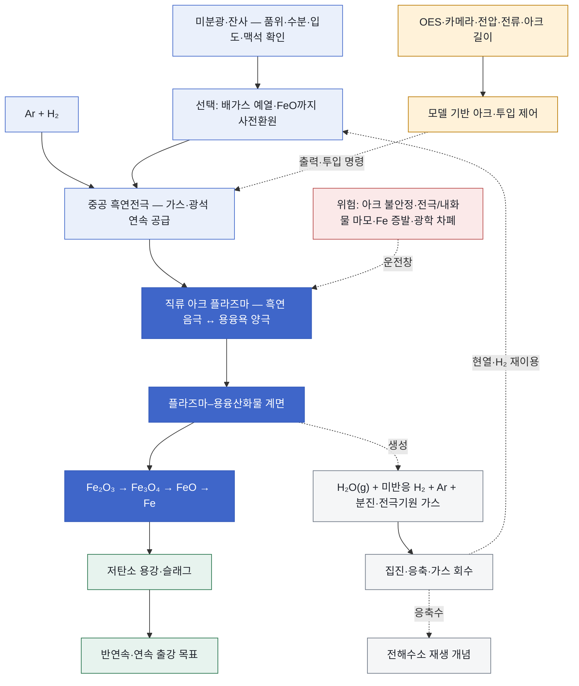

<!-- AUTO-GENERATED BY steel-intelligence. DO NOT EDIT. -->

# 수소 플라즈마 용융환원 (HPSR)

> 조사 기준일: **2026-07-25** · 공식·1차 자료 중심 · 사실과 AI 분석을 구분해 작성

??? info "관련 기술 바로가기 · 현재 위치: 환원·용융 경로"

    탐색을 위한 편의 분류이며 기술 우열이나 확정된 공정 관계를 뜻하지 않습니다.

    **환원·용융 경로**

    [[technologies/TEC-hydrogen-direct-reduced-iron|수소 직접환원철 (Hydrogen DRI)]] · [[technologies/TEC-hydrogen-based-fine-ore-reduction|무펠릿 미분광 수소환원 (Fluidized-bed Hydrogen Reduction)]] · [[technologies/TEC-electric-smelting-furnace|전기용융로 (Electric Smelting Furnace)]] · **수소 플라즈마 용융환원 (HPSR) · 현재** · [[technologies/TEC-microwave-biomass-ironmaking|마이크로웨이브·바이오매스 환원제철 (BioIron)]]

    **전해 기반 경로**

    [[technologies/TEC-molten-oxide-electrolysis|용융산화물 전기분해 (Molten Oxide Electrolysis)]] · [[technologies/TEC-low-temperature-aqueous-iron-electrolysis|저온 수계 전해제철 (Aqueous Iron Electrolysis)]]

    **기존 설비·순환 경로**

    [[technologies/TEC-blast-furnace-ccus|고로 CCUS]] · [[technologies/TEC-high-grade-eaf-and-scrap-impurity-removal|고급강 EAF·스크랩 불순물 제거]]

    **통합·운영 기술**

    [[technologies/TEC-low-carbon-ironmaking|저탄소 제철 종합 경로 (Low-carbon Ironmaking)]] · [[technologies/TEC-smart-steelworks|스마트 제철소 (Smart Steelworks)]]

{ .steel-media-image .steel-hero-image .steel-media-detail }

*대표 이미지 — SuS-F 공식 HPSR 반응기 구성도: 중공 흑연전극을 통한 미분광·Ar·H2 공급, 직류 플라즈마 아크, 용융욕, 출강과 배가스 계통 (공정 개념도 · 권리 `link_only` · 출처 [[sources/SRC-20260725-A0AC41D7|SRC-20260725-A0AC41D7]] · [원문 페이지](https://www.k1-met.com/en/non_comet/sus_f))*

!!! abstract "한눈에 보기"

    | 항목 | 내용 |
    | --- | --- |
    | **분류 (편집)** | 직류 아크·수소 플라즈마 기반 단일단계 용융환원 |
    | **핵심 원리** | 수소를 직류 아크 플라즈마에서 활성화해 철광석 미분의 환원과 용융을 하나의 밀폐 반응기에서 수행하는 공정 [^src-20260725-a0ac41d7] |
    | **제품 형태** | 중간 선철 단계를 우회해 저탄소 용강 또는 조강을 직접 생산하는 연구 경로 [^src-20260725-f2f9bb6e] |
    | **적용 원료** | 철광석 미분과 저품위광, 일부 제철 잔사·산화물까지 연구 후보이나 광종별 성능은 별도 검증 필요 [^src-20260725-4333339b] |
    | **공개 개발 단계** | Donawitz 시험설비는 2021년부터 운전 중이며 200 kg/h 연속화·가스회수·제어는 연구개발 단계 [^src-20260725-f2f9bb6e] |

## 개요

수소를 직류 아크 플라즈마에서 활성화해 철광석 미분의 환원과 용융을 하나의 밀폐 반응기에서 수행하는 공정 [^src-20260725-a0ac41d7]

여기서 HPSR은 일반 수소 DRI나 전기용융로와 구분합니다. 수소가 환원제인 동시에 플라즈마 아크가 용융 열원을 제공하며, 용융욕과 플라즈마의 계면에서 최종 환원이 일어납니다. ‘단일단계’는 보조 예열·사전환원·배가스 회수까지 불필요하다는 뜻이 아니며, 확대 설계는 오히려 이 전단·후단 통합을 검토합니다.

- **근거 확인 기업:** 1개
- **직접 연결 근거:** 10건

## 작동 원리

- **작동 원리:** 수소는 철 산화물의 환원제로 작용하고 플라즈마 아크는 용융에 필요한 전기 열에너지를 공급 [^src-20260725-a0ac41d7]
- **반응기 구성:** 약한 과압의 기밀 직류 아크로에서 용융욕을 양극, 중공 흑연전극을 음극으로 사용 [^src-20260725-1f1ea152]

## 공정 구성

**색상 범례 (AI 재구성):** 청색=원료·플라즈마 가스 공급 · 진한 청색=아크·계면 환원 · 녹색=용강·슬래그 · 회색=배가스·열 회수 · 황색=계측·제어 · 적색=확대 운전 위험

!!! note "도식 해석"

    위 도식은 K1-MET SuS-F 공식 반응기 구성도, FFG LIGHTBOW 제어 설명과 공개 학술자료를 기능 단위로 재구성한 것입니다. 실제 Donawitz 설비의 배관계장도·전극 치수·인터록 또는 향후 200 kg/h 설비의 준공도가 아닙니다. [^src-20260725-a0ac41d7]

## 주요 기술 특성

### 반응·셀·공정

| 구분 | 공개된 내용 | 근거 성격 |
| --- | --- | --- |
| **작동 원리** | 수소는 철 산화물의 환원제로 작용하고 플라즈마 아크는 용융에 필요한 전기 열에너지를 공급 [^src-20260725-a0ac41d7] | 기타 |
| **반응기 구성** | 약한 과압의 기밀 직류 아크로에서 용융욕을 양극, 중공 흑연전극을 음극으로 사용 [^src-20260725-1f1ea152] | 학술 연구 |
| **활성 수소종** | 분자 수소뿐 아니라 원자·이온화 수소종이 환원에 관여하나 실제 계면 종 분포는 운전조건에 따라 달라짐 [^src-20260725-4333339b] | 학술 연구 |
| **플라즈마 아크 구성** | 중공 전극과 용융욕 사이에 직류 플라즈마 아크를 형성 [^src-20260725-973f138f] | 정부·공공자료 |
| **전극·원료 공급 구성** | 아르곤·수소와 미분광을 중공 흑연 음극을 통해 아크 중심부에 공급 [^src-20260725-1f1ea152] | 학술 연구 |
| **플라즈마–용융욕 계면** | 활성 수소종과 용융 산화철의 환원반응은 플라즈마-용융욕 계면에서 진행 [^src-20260725-4333339b] | 학술 연구 |
| **산화철 환원 순서** | 용융 상태에서 hematite-자철광-wustite-금속철 순으로 환원이 진행 [^src-20260725-4333339b] | 학술 연구 |
| **속도결정 단계** | 완전 금속화에 가까워질수록 최종 wustite(FeO)-금속철 환원이 속도결정 단계가 될 수 있음 [^src-20260725-4333339b] | 학술 연구 |
| **광학방출·영상 계측** | 광학방출분광과 영상으로 H·Fe·O 및 FeO 방출종의 시간 변화를 실험실·파일럿에서 관측 [^src-20260725-ee8a09ef] | 학술 연구 |

### 원료·운전·제품

| 구분 | 공개된 내용 | 근거 성격 |
| --- | --- | --- |
| **적용 원료** | 철광석 미분과 저품위광, 일부 제철 잔사·산화물까지 연구 후보이나 광종별 성능은 별도 검증 필요 [^src-20260725-4333339b] | 학술 연구 |
| **제품 형태** | 중간 선철 단계를 우회해 저탄소 용강 또는 조강을 직접 생산하는 연구 경로 [^src-20260725-f2f9bb6e] | 회사 IR |
| **부산물** | 이상적인 수소 환원 반응 부산물은 수증기이나 실제 배가스에는 미반응 H2·Ar·분진과 전극 기원 가스가 포함될 수 있음 [^src-20260725-1f1ea152] | 학술 연구 |
| **원료 공급 방식** | 초기 SuSteel은 배치 운전; SuS-F는 미분광 연속 공급을 포함한 반연속·연속 공정 개발 목표 [^src-20260725-a0ac41d7] | 기타 |
| **출강 방식** | SuS-F는 저탄소강의 반연속 출강을 개발 목표로 설정 [^src-20260725-a0ac41d7] | 기타 |
| **용융욕·회분 용량** | SuSteel 개발은 약 100 g 실험실 용융 규모에서 약 90 kg 파일럿 용융 규모로 확대 [^src-20260725-2fa1b498] | 기타 |
| **시험 원료 공급률** | 2024 광학계측 논문의 K1-MET 캠페인은 미분광을 100~200 g/min으로 연속 공급 [^src-20260725-ee8a09ef] | 학술 연구 |
| **연속화 목표 처리량** | SuSteel follow-up 확대 목표는 철광석 200 kg/h의 완전 연속 환원 [^src-20260725-1f1ea152] | 학술 연구 |
| **수소 이용률** | 2025 확대 시나리오는 액상 FeO-Fe 환원에서 HPSR 수소 이용률의 열역학적 상한을 약 40 vol.%로 가정 [^src-20260725-1f1ea152] | 학술 연구 |
| **아르곤 안정화 부담** | 확대 시나리오는 아크 안정화를 위해 플라즈마 가스 중 약 25 vol.% Ar을 가정하며 Ar 가열은 에너지 부담 [^src-20260725-1f1ea152] | 학술 연구 |
| **전극 소비·탄소 유입** | 흑연전극 마모는 비용·탄소계 배가스·아크 안정성에 영향을 주며 습윤광은 실험에서 전극 소비를 증가시킴 [^src-20260725-db8169d9] | 학술 연구 |
| **철 증발·수율 위험** | 완전 금속화에 가까워질 때 계면 철 증발과 강한 발광이 증가해 철 수율·분진·계측에 영향을 줄 수 있음 [^src-20260725-4333339b] | 학술 연구 |
| **내화물 노출·마모** | 플라즈마·용융욕·슬래그에 노출되는 내화물 영향과 수명이 SuSteel 핵심 연구항목 [^src-20260725-2fa1b498] | 기타 |
| **사전환원 통합** | HPSR 배가스로 광석을 FeO까지 예열·사전환원한 뒤 플라즈마에서 최종 환원하는 하이브리드 확대안 [^src-20260725-1f1ea152] | 학술 연구 |
| **배가스 현열·수소 회수** | 고온 배가스의 미반응 수소와 현열을 전단 사전환원·예열에 이용하는 방안 [^src-20260725-1f1ea152] | 학술 연구 |
| **수증기 회수·재전해** | SuS-F는 배가스 수증기를 응축해 전기분해용 물로 재이용하는 개념을 목표에 포함 [^src-20260725-a0ac41d7] | 기타 |
| **광학계측 시야 한계** | 수증기와 분진이 광 신호를 흡수·차폐해 OES 기반 폐루프 제어의 가용성을 제한할 수 있음 [^src-20260725-ee8a09ef] | 학술 연구 |

### 에너지·환경·경제

| 구분 | 공개된 내용 | 근거 성격 |
| --- | --- | --- |
| **배출 경계** | 반응 자체는 수증기를 주 부산물로 하나 전력·수소 생산, Ar, 흑연전극, 내화물, 광석·슬래그의 전과정 배출은 별도 계상 필요 [^src-20260725-1f1ea152] | 학술 연구 |
| **장입·전력 제어** | 연속 수소·광석 투입 중 정밀 아크 출력 제어는 FFG LIGHTBOW가 명시한 미해결 과제 [^src-20260725-973f138f] | 정부·공공자료 |

### 실증·산업화

| 구분 | 공개된 내용 | 근거 성격 |
| --- | --- | --- |
| **공개 개발 단계** | Donawitz 시험설비는 2021년부터 운전 중이며 200 kg/h 연속화·가스회수·제어는 연구개발 단계 [^src-20260725-f2f9bb6e] | 회사 IR |
| **상용 규모 확대 조건** | 연속 광석 공급·출강, 아크 안정성, H2·Ar·배가스 수지, 전극·내화물 수명, 철 증발과 장기 가동률 검증이 상용 확대 조건 [^src-20260725-973f138f] | 정부·공공자료 |
| **파일럿 회분 투입량** | 2025 검토 논문은 기존 실증 반응기의 광석 회분 용량을 200 kg/trial로 기술 [^src-20260725-1f1ea152] | 학술 연구 |

## 공개 개발 연혁

| 날짜 | 공개 사건 |
| --- | --- |
| 2022-04-27 | voestalpine researches hydrogen plasma steelmaking in SuSteel [^src-20260725-fe22defe] |
| 2023-03-10 | Impact of Iron Ore Pre-Reduction Degree on the Hydrogen Plasma Smelting Reduction Process [^src-20260725-db8169d9] |
| 2024-05-15 | The Optical Spectra of Hydrogen Plasma Smelting Reduction of Iron Ore: Application and Requirements [^src-20260725-ee8a09ef] |
| 2025-02-05 | Strategic Selection of a Pre-Reduction Reactor for Increased Hydrogen Utilization in Hydrogen Plasma Smelting Reduction [^src-20260725-1f1ea152] |
| 2025-06-02 | In Situ Observation of Sustainable Hematite-Magnetite-Wustite-Iron Hydrogen Plasma Reduction [^src-20260725-4333339b] |
| 2026-06-04 | Application of SuSteel technology and operation of the SuSteel pilot plant in Donawitz [^src-20260725-f2f9bb6e] |

## 기업별 상세 현황

### [[companies/COM-voestalpine|voestalpine]]

**확인된 현황.** Donawitz SuSteel 파일럿에서 직류 아크 수소 플라즈마로 철광석 환원·용융 단일공정 연구 단계 [^src-20260725-fe22defe][^src-20260725-f2f9bb6e][^src-20260725-a0ac41d7]

**단계 판단: 연구·실증.** 기술 가능성을 검증하는 단계입니다. 시험 규모의 성공을 상용 생산성과로 해석하지 않고 규모 확대 계획을 따로 확인해야 합니다.

- **날짜:** 발표 2022-04-27, 2026-06-04 · 수집 2026-07-25 · 검증 2026-07-25

## 관련 프로젝트

기술의 실제 확대 단계를 확인할 수 있도록 프로젝트 문서와 현재 상태를 직접 연결합니다. 각 프로젝트 문서에는 최근 상태뿐 아니라 확인 가능한 전체 일정 이력이 표시됩니다.

| 프로젝트 | 현재 확인 상태 | 일정·규모 |
| --- | --- | --- |
| **[[projects/PRJ-SUSTEEL-DONAWITZ|voestalpine Donawitz SuSteel·SuS-F]]** | Donawitz SuSteel 시험설비에서 수소 플라즈마 단일단계 조강 생산 시험을 수행 중; 연속화·수소공급·가스회수 연구 단계 [^src-20260725-f2f9bb6e] | - |
| **[[projects/PRJ-LIGHTBOW-HPSR-CONTROL|LIGHTBOW HPSR 아크 제어 연구]]** | HPSR 연속 투입 중 아크 출력의 모델 기반 제어를 개발하는 FFG 진행 프로젝트 [^src-20260725-973f138f] | - |

## 기술적 쟁점과 미공개 데이터

!!! warning "AI 분석 — 공개 근거와 구분"

    기업별 단계는 인용된 공식 발표 문구를 기준으로 분류한 것으로, 정식 TRL 판정이나 기술 경쟁력 순위가 아닙니다.

- **추가 확인이 필요한 데이터:** 200 kg/h 연속화의 실제 달성 여부, 연속 투입·출강 시간과 가동률, 아크 안정성·Ar 비율, H₂·전력 원단위, 배가스 회수, 전극·내화물 소비, Fe 증발·철 수율, 광종별 슬래그·P/S 거동, 모델 기반 제어와 2026년 이후 후속 일정을 확인해야 합니다.
- 기업 간 비교에는 시험 규모, 실제 투입 원료·에너지 조건, 상용 운전 실적과 제품 단위 배출량을 같은 기준으로 적용해야 합니다.
- HPSR의 핵심 차이는 ‘수소를 뜨겁게 쓴다’가 아니라 플라즈마–용융욕 계면에서 활성 수소종과 용융 산화철이 반응한다는 점입니다. 분자·원자·이온의 실제 분포와 계면 도달종은 온도·아크·재결합에 따라 달라지므로 명목 가스 조성만으로 환원력을 계산하면 안 됩니다.
- 환원과 용융을 한 반응기에 결합하면 DRI 냉각·저장·재가열 단계를 줄일 수 있지만, 모든 산화철의 환원속도가 같은 것은 아닙니다. 2025년 in-situ 연구는 최종 FeO→Fe가 말기에 속도결정 단계가 될 수 있음을 보여줍니다. 완전 금속화 근처에서는 철 증발도 강해져 수율·집진·광학신호가 동시에 변합니다.
- 플라즈마는 열원과 환원제를 결합하지만 전기에너지와 수소의 기여를 분리해 계측해야 합니다. 전력원단위만 낮추면 수소 과잉이나 미환원 산화물이 늘 수 있고, 수소 투입만 늘리면 이용률과 배가스 회수 부담이 악화됩니다. 톤당 전력·수소·Ar, 금속화율과 철 수율을 하나의 수지로 공개해야 합니다.
- Ar은 아크 안정화에 유용하지만 환원에 기여하지 않고 가열·순환·분리 부하를 만듭니다. 2025년 확대 시나리오의 25 vol.% Ar은 설계 가정이지 확정 상용 조건이 아닙니다. 안정성을 유지하면서 Ar 비율을 낮추는 능력이 경제성과 가스 회수계 크기를 좌우합니다.
- 중공 흑연전극은 가스와 미분광을 아크 중심으로 공급하지만 마모·산화·열충격을 받고 탄소계 가스를 만들 수 있습니다. 전극 소비는 비용뿐 아니라 제품 탄소, CO/CO₂ 배출 경계, 아크 길이와 투입 안정성에 영향을 줍니다. ‘탄소 무사용’과 ‘공정 직접 CO₂ 0’ 주장은 전극 경계를 포함해 다시 확인해야 합니다.
- 배치당 90 kg, 반응기 최대 90,000 g, 시험 중 100~200 g/min 투입, 목표 200 kg/h는 서로 다른 지표입니다. 용융욕 보유량·순간 공급률·지속시간·출강 주기·제품량을 혼용하지 않아야 하며, 200 kg/h 목표를 실제 연속 생산 실적으로 표현하면 안 됩니다.
- 확대 설계가 사전환원을 다시 도입하는 것은 단일단계 개념의 실패라기보다 수소·열 이용률 개선입니다. 배가스의 H₂와 현열로 광석을 FeO까지 만들면 플라즈마 체류시간과 전극·내화물 부담을 줄일 수 있지만, 전단 반응기·분진·응축수·가스조성 제어가 추가돼 전체 공정 복잡성은 커집니다.
- LIGHTBOW가 지적한 연속 투입 중 아크 출력 제어는 생산성의 중심 과제입니다. 미분광이 아크와 용융욕을 교란하고, 아크 길이·전압·전류·용탕 높이가 서로 영향을 주므로 단순 정전류 제어로는 부족할 수 있습니다. 모델은 실제 센서 지연·분진·시야 차폐와 비정상 상태에서 검증되어야 합니다.
- OES와 카메라는 H·Fe·O·FeO 방출종을 통해 반응 진행을 볼 수 있지만 수증기와 분진이 광로를 흡수·차폐합니다. 광학 신호를 금속화율의 직접 측정으로 간주하지 말고, 배가스 질량분석·전기신호·샘플 화학분석과 융합해야 폐루프 제어에 쓸 수 있습니다.
- 저품위광·잔사 처리 가능성은 중요한 장점이지만 맥석이 자동으로 제거되는 것은 아닙니다. 슬래그량·염기도·점도·P/S 분배, 철 손실, 내화물 반응과 출강 분리가 제품 품질과 에너지에 직접 연결됩니다. 특정 합성광·소량 실험의 탈인 결과를 상업 광종 전반으로 확장하면 안 됩니다.

## POSCO 관점 시사점

!!! info "AI 분석 — 전략 검토용"

    다음 내용은 공개 근거를 바탕으로 한 비교 분석이며, POSCO의 공식 결정이나 투자 권고가 아닙니다.

- POSCO에는 HyREX 유동층–ESF가 더 가까운 실행 경로이므로 HPSR은 대체안보다 장기 옵션·특수 원료 처리 벤치마크로 보는 편이 현실적입니다. 비교 경계는 미분광 전처리부터 용선·용강까지이며, HPSR의 Ar·전극·가스회수와 HyREX의 유동층·고온이송·ESF 부담을 같은 기준으로 놓아야 합니다.
- HPSR의 직접 용강 경로가 입증되면 저품위광, 제철 잔사, 미세 산화물의 고부가 회수에 먼저 적용될 수 있습니다. POSCO는 대량 조강 경로만 보지 말고 더스트·슬러지·산화스케일별 철 회수율, P/S/Zn 거동, 슬래그·분진 처리비를 기준으로 소형 파일럿 가치도 평가할 수 있습니다.
- Donawitz의 200 kg/h 연속화 목표는 POSCO 1 t/h ESF와 단순 용량 비교가 불가능합니다. HPSR은 환원·용융·출강을 포함한 목표 처리량이고, POSCO 수치는 용융 파일럿 처리량입니다. 운전시간·실제 광석량·제품량·금속화·가동률을 정렬한 뒤 비교해야 합니다.
- 우선 모니터링 지표는 용융욕 질량과 실제품량, 연속 투입·출강 시간, 아크 소호·재점호 횟수, 전압·전류·아크 길이 변동, H₂·Ar·전력 원단위와 가스 회수율, 전극·내화물 소비, 금속화율·Fe 수율·철 증발, 슬래그량·P/S 분배, OES 가용률, 분진·수증기 차폐와 제품 탄소입니다.

## 출처

- [[sources/SRC-20260725-1F1EA152|Strategic Selection of a Pre-Reduction Reactor for Increased Hydrogen Utilization in Hydrogen Plasma Smelting Reduction]] — Processes / MDPI, 2025-02-05 · [원문](https://www.k1-met.com/fileadmin/user_upload/Publications/Adami_2025_-_Strategic_selection_of_a_pre-reduction_reactor_for_increased_hydrogen_utilization_in_hydrogen_plasma_smelting_reduction.pdf)
- [[sources/SRC-20260725-2FA1B498|Project SuSteel: Sustainable steel production utilising hydrogen]] — K1-MET GmbH, 게시일 미상 · [원문](https://www.k1-met.com/en/non_comet/susteel)
- [[sources/SRC-20260725-34D63EEA|SUS-F Sustainable Steelmaking Follow Up]] — Austrian Climate and Energy Fund, 게시일 미상 · [원문](https://www.klimafonds.gv.at/projekt/sus-f/)
- [[sources/SRC-20260725-4333339B|In Situ Observation of Sustainable Hematite-Magnetite-Wustite-Iron Hydrogen Plasma Reduction]] — Metallurgical and Materials Transactions B / Springer, 2025-06-02 · [원문](https://link.springer.com/article/10.1007/s11663-025-03610-y)
- [[sources/SRC-20260725-973F138F|LIGHTBOW: Model-based control in metallurgical arc-plasma processes]] — Austrian Research Promotion Agency (FFG), 게시일 미상 · [원문](https://projekte.ffg.at/projekt/5122268)
- [[sources/SRC-20260725-A0AC41D7|Project SuS-F: SuSteel follow-up]] — K1-MET GmbH, 게시일 미상 · [원문](https://www.k1-met.com/en/non_comet/sus_f)
- [[sources/SRC-20260725-DB8169D9|Impact of Iron Ore Pre-Reduction Degree on the Hydrogen Plasma Smelting Reduction Process]] — Metals / MDPI, 2023-03-10 · [원문](https://pure.unileoben.ac.at/en/publications/impact-of-iron-ore-pre-reduction-degree-on-the-hydrogen-plasma-sm/)
- [[sources/SRC-20260725-EE8A09EF|The Optical Spectra of Hydrogen Plasma Smelting Reduction of Iron Ore: Application and Requirements]] — Steel Research International / Wiley, 2024-05-15 · [원문](https://www.k1-met.com/fileadmin/user_upload/Publications/Journal_articles_open_access/Pauna_et_al__2024__Optical_spectra_HPSR_StResInt.pdf)
- [[sources/SRC-20260725-F2F9BB6E|Application of SuSteel technology and operation of the SuSteel pilot plant in Donawitz]] — voestalpine AG, 2026-06-04 · [원문](https://reports.voestalpine.com/2526/ar/management-report/non-financial-statement/environmental-information/i-r-d-innovation-research-and-development.html)
- [[sources/SRC-20260725-FE22DEFE|voestalpine researches hydrogen plasma steelmaking in SuSteel]] — voestalpine, 2022-04-27 · [원문](https://www.voestalpine.com/group/en/media/press-releases/2022-04-27-voestalpine-researching-into-hydrogen-plasma-for-green-steel-production-in-an-international-showcase-project/)

[^src-20260725-1f1ea152]: **Strategic Selection of a Pre-Reduction Reactor for Increased Hydrogen Utilization in Hydrogen Plasma Smelting Reduction** — Processes / MDPI, 2025-02-05. [원문](https://www.k1-met.com/fileadmin/user_upload/Publications/Adami_2025_-_Strategic_selection_of_a_pre-reduction_reactor_for_increased_hydrogen_utilization_in_hydrogen_plasma_smelting_reduction.pdf) · [[sources/SRC-20260725-1F1EA152|보관 원문·메타데이터]]
[^src-20260725-2fa1b498]: **Project SuSteel: Sustainable steel production utilising hydrogen** — K1-MET GmbH, 게시일 미상. [원문](https://www.k1-met.com/en/non_comet/susteel) · [[sources/SRC-20260725-2FA1B498|보관 원문·메타데이터]]
[^src-20260725-4333339b]: **In Situ Observation of Sustainable Hematite-Magnetite-Wustite-Iron Hydrogen Plasma Reduction** — Metallurgical and Materials Transactions B / Springer, 2025-06-02. [원문](https://link.springer.com/article/10.1007/s11663-025-03610-y) · [[sources/SRC-20260725-4333339B|보관 원문·메타데이터]]
[^src-20260725-973f138f]: **LIGHTBOW: Model-based control in metallurgical arc-plasma processes** — Austrian Research Promotion Agency (FFG), 게시일 미상. [원문](https://projekte.ffg.at/projekt/5122268) · [[sources/SRC-20260725-973F138F|보관 원문·메타데이터]]
[^src-20260725-a0ac41d7]: **Project SuS-F: SuSteel follow-up** — K1-MET GmbH, 게시일 미상. [원문](https://www.k1-met.com/en/non_comet/sus_f) · [[sources/SRC-20260725-A0AC41D7|보관 원문·메타데이터]]
[^src-20260725-db8169d9]: **Impact of Iron Ore Pre-Reduction Degree on the Hydrogen Plasma Smelting Reduction Process** — Metals / MDPI, 2023-03-10. [원문](https://pure.unileoben.ac.at/en/publications/impact-of-iron-ore-pre-reduction-degree-on-the-hydrogen-plasma-sm/) · [[sources/SRC-20260725-DB8169D9|보관 원문·메타데이터]]
[^src-20260725-ee8a09ef]: **The Optical Spectra of Hydrogen Plasma Smelting Reduction of Iron Ore: Application and Requirements** — Steel Research International / Wiley, 2024-05-15. [원문](https://www.k1-met.com/fileadmin/user_upload/Publications/Journal_articles_open_access/Pauna_et_al__2024__Optical_spectra_HPSR_StResInt.pdf) · [[sources/SRC-20260725-EE8A09EF|보관 원문·메타데이터]]
[^src-20260725-f2f9bb6e]: **Application of SuSteel technology and operation of the SuSteel pilot plant in Donawitz** — voestalpine AG, 2026-06-04. [원문](https://reports.voestalpine.com/2526/ar/management-report/non-financial-statement/environmental-information/i-r-d-innovation-research-and-development.html) · [[sources/SRC-20260725-F2F9BB6E|보관 원문·메타데이터]]
[^src-20260725-fe22defe]: **voestalpine researches hydrogen plasma steelmaking in SuSteel** — voestalpine, 2022-04-27. [원문](https://www.voestalpine.com/group/en/media/press-releases/2022-04-27-voestalpine-researching-into-hydrogen-plasma-for-green-steel-production-in-an-international-showcase-project/) · [[sources/SRC-20260725-FE22DEFE|보관 원문·메타데이터]]
