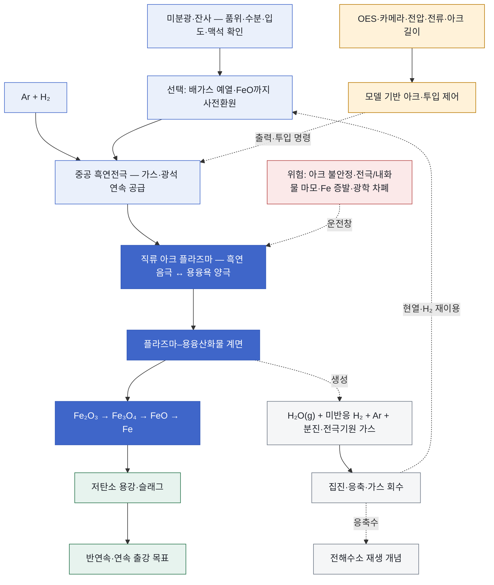
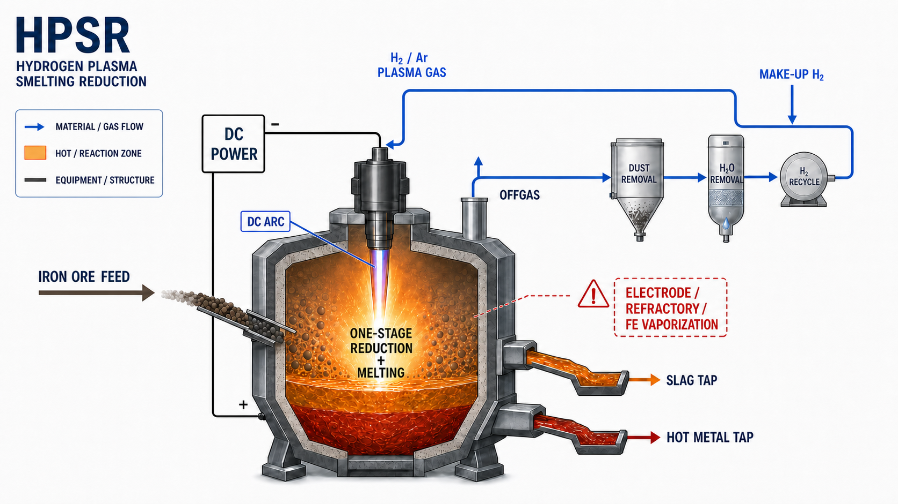

<!-- AUTO-GENERATED BY steel-intelligence. DO NOT EDIT. -->

# 수소 플라즈마 용융환원 (HPSR)

> 조사 기준일: **2026-07-28** · 공식·1차 자료 중심 · 사실과 AI 분석을 구분해 작성

??? info "관련 기술 바로가기 · 현재 위치: 환원·용융 경로"

    탐색을 위한 편의 분류이며 기술 우열이나 확정된 공정 관계를 뜻하지 않습니다.

    **환원·용융 경로**

    [[technologies/TEC-hydrogen-direct-reduced-iron|수소 직접환원철 (Hydrogen DRI)]] · [[technologies/TEC-hydrogen-based-fine-ore-reduction|무펠릿 미분광 수소환원 (Fluidized-bed Hydrogen Reduction)]] · [[technologies/TEC-zesty-hydrogen-flash-reduction|ZESTY 수소 직접 플래시 환원]] · [[technologies/TEC-electric-smelting-furnace|전기용융로 (Electric Smelting Furnace)]] · [[technologies/TEC-hisarna-cyclone-smelting-reduction|HIsarna 사이클론 용융환원]] · **수소 플라즈마 용융환원 (HPSR) · 현재** · [[technologies/TEC-microwave-biomass-ironmaking|마이크로웨이브·바이오매스 환원제철 (BioIron)]]

    **전해 기반 경로**

    [[technologies/TEC-molten-oxide-electrolysis|용융산화물 전기분해 (Molten Oxide Electrolysis)]] · [[technologies/TEC-low-temperature-aqueous-iron-electrolysis|저온 수계 전해제철 (Aqueous Iron Electrolysis)]]

    **기존 설비·순환 경로**

    [[technologies/TEC-blast-furnace-ccus|고로 CCUS]] · [[technologies/TEC-high-grade-eaf-and-scrap-impurity-removal|고급강 EAF·스크랩 불순물 제거]]

    **통합·운영 기술**

    [[technologies/TEC-low-carbon-ironmaking|저탄소 제철 종합 경로 (Low-carbon Ironmaking)]] · [[technologies/TEC-smart-steelworks|스마트 제철소 (Smart Steelworks)]]

{ .steel-media-image .steel-hero-image .steel-media-detail }

*대표 이미지 — SuS-F 공식 HPSR 반응기 구성도: 중공 흑연전극을 통한 미분광·Ar·H2 공급, 직류 플라즈마 아크, 용융욕, 출강과 배가스 계통 (공정 개념도 · 권리 `link_only` · 출처 [[sources/SRC-20260725-A0AC41D7|SRC-20260725-A0AC41D7]] · [원문 페이지](https://www.k1-met.com/en/non_comet/sus_f))*

!!! abstract "한눈에 보기"

    | 항목 | 내용 |
    | --- | --- |
    | **분류 (편집)** | 직류 아크·수소 플라즈마 기반 단일단계 용융환원 |
    | **핵심 원리** | 수소를 직류 아크 플라즈마에서 활성화해 철광석 미분의 환원과 용융을 하나의 밀폐 반응기에서 수행하는 공정 [^src-20260725-a0ac41d7] |
    | **제품 형태** | 중간 선철 단계를 우회해 저탄소 용강 또는 조강을 직접 생산하는 연구 경로 [^src-20260725-f2f9bb6e] |
    | **적용 원료** | 철광석 미분과 저품위광, 일부 제철 잔사·산화물까지 연구 후보이나 광종별 성능은 별도 검증 필요 [^src-20260725-4333339b] |
    | **공개 개발 단계** | Donawitz 시험설비는 2021년부터 운전 중이며 200 kg/h 연속화·가스회수·제어는 연구개발 단계 [^src-20260725-f2f9bb6e] |

## 개요

수소를 직류 아크 플라즈마에서 활성화해 철광석 미분의 환원과 용융을 하나의 밀폐 반응기에서 수행하는 공정 [^src-20260725-a0ac41d7]

여기서 HPSR은 일반 수소 DRI나 전기용융로와 구분합니다. 수소가 환원제인 동시에 플라즈마 아크가 용융 열원을 제공하며, 용융욕과 플라즈마의 계면에서 최종 환원이 일어납니다. ‘단일단계’는 보조 예열·사전환원·배가스 회수까지 불필요하다는 뜻이 아니며, 확대 설계는 오히려 이 전단·후단 통합을 검토합니다.

- **근거 확인 기업:** 1개
- **직접 연결 근거:** 29건

## 작동 원리

- **작동 원리:** 수소는 철 산화물의 환원제로 작용하고 플라즈마 아크는 용융에 필요한 전기 열에너지를 공급 [^src-20260725-a0ac41d7]
- **반응기 구성:** 약한 과압의 기밀 직류 아크로에서 용융욕을 양극, 중공 흑연전극을 음극으로 사용 [^src-20260725-1f1ea152]

## 공정 구성

**색상 범례 (AI 재구성):** 청색=원료·플라즈마 가스 공급 · 진한 청색=아크·계면 환원 · 녹색=용강·슬래그 · 회색=배가스·열 회수 · 황색=계측·제어 · 적색=확대 운전 위험

!!! note "도식 해석"

    위 도식은 K1-MET SuS-F 공식 반응기 구성도, FFG LIGHTBOW 제어 설명과 공개 학술자료를 기능 단위로 재구성한 것입니다. 실제 Donawitz 설비의 배관계장도·전극 치수·인터록 또는 향후 200 kg/h 설비의 준공도가 아닙니다. [^src-20260725-a0ac41d7]

## 주요 기술 특성

### 반응·셀·공정

| 구분 | 공개된 내용 | 근거 성격 |
| --- | --- | --- |
| **작동 원리** | 수소는 철 산화물의 환원제로 작용하고 플라즈마 아크는 용융에 필요한 전기 열에너지를 공급 [^src-20260725-a0ac41d7] | 기타 |
| **반응기 구성** | 약한 과압의 기밀 직류 아크로에서 용융욕을 양극, 중공 흑연전극을 음극으로 사용 [^src-20260725-1f1ea152] | 학술지 논문 |
| **활성 수소종** | 분자 수소뿐 아니라 원자·이온화 수소종이 환원에 관여하나 실제 계면 종 분포는 운전조건에 따라 달라짐 [^src-20260725-4333339b] | 학술지 논문 |
| **플라즈마 아크 구성** | 중공 전극과 용융욕 사이에 직류 플라즈마 아크를 형성 [^src-20260725-973f138f] | 정부·공공자료 |
| **전극·원료 공급 구성** | 아르곤·수소와 미분광을 중공 흑연 음극을 통해 아크 중심부에 공급 [^src-20260725-1f1ea152] | 학술지 논문 |
| **플라즈마–용융욕 계면** | 활성 수소종과 용융 산화철의 환원반응은 플라즈마-용융욕 계면에서 진행 [^src-20260725-4333339b] | 학술지 논문 |
| **산화철 환원 순서** | 용융 상태에서 hematite-자철광-wustite-금속철 순으로 환원이 진행 [^src-20260725-4333339b] | 학술지 논문 |
| **속도결정 단계** | 완전 금속화에 가까워질수록 최종 wustite(FeO)-금속철 환원이 속도결정 단계가 될 수 있음 [^src-20260725-4333339b] | 학술지 논문 |
| **광학방출·영상 계측** | 광학방출분광과 영상으로 H·Fe·O 및 FeO 방출종의 시간 변화를 실험실·파일럿에서 관측 [^src-20260725-ee8a09ef] | 학술지 논문 |

### 원료·운전·제품

| 구분 | 공개된 내용 | 근거 성격 |
| --- | --- | --- |
| **적용 원료** | 철광석 미분과 저품위광, 일부 제철 잔사·산화물까지 연구 후보이나 광종별 성능은 별도 검증 필요 [^src-20260725-4333339b] | 학술지 논문 |
| **제품 형태** | 중간 선철 단계를 우회해 저탄소 용강 또는 조강을 직접 생산하는 연구 경로 [^src-20260725-f2f9bb6e] | 회사 IR |
| **부산물** | 이상적인 수소 환원 반응 부산물은 수증기이나 실제 배가스에는 미반응 H2·Ar·분진과 전극 기원 가스가 포함될 수 있음 [^src-20260725-1f1ea152] | 학술지 논문 |
| **원료 공급 방식** | 초기 SuSteel은 배치 운전; SuS-F는 미분광 연속 공급을 포함한 반연속·연속 공정 개발 목표 [^src-20260725-a0ac41d7] | 기타 |
| **출강 방식** | SuS-F는 저탄소강의 반연속 출강을 개발 목표로 설정 [^src-20260725-a0ac41d7] | 기타 |
| **용융욕·회분 용량** | SuSteel 개발은 약 100 g 실험실 용융 규모에서 약 90 kg 파일럿 용융 규모로 확대 [^src-20260725-2fa1b498] | 기타 |
| **시험 원료 공급률** | 2024 광학계측 논문의 K1-MET 캠페인은 미분광을 100~200 g/min으로 연속 공급 [^src-20260725-ee8a09ef] | 학술지 논문 |
| **연속화 목표 처리량** | SuSteel follow-up 확대 목표는 철광석 200 kg/h의 완전 연속 환원 [^src-20260725-1f1ea152] | 학술지 논문 |
| **수소 이용률** | 2025 확대 시나리오는 액상 FeO-Fe 환원에서 HPSR 수소 이용률의 열역학적 상한을 약 40 vol.%로 가정 [^src-20260725-1f1ea152] | 학술지 논문 |
| **아르곤 안정화 부담** | 확대 시나리오는 아크 안정화를 위해 플라즈마 가스 중 약 25 vol.% Ar을 가정하며 Ar 가열은 에너지 부담 [^src-20260725-1f1ea152] | 학술지 논문 |
| **전극 소비·탄소 유입** | 흑연전극 마모는 비용·탄소계 배가스·아크 안정성에 영향을 주며 습윤광은 실험에서 전극 소비를 증가시킴 [^src-20260725-db8169d9] | 학술지 논문 |
| **철 증발·수율 위험** | 완전 금속화에 가까워질 때 계면 철 증발과 강한 발광이 증가해 철 수율·분진·계측에 영향을 줄 수 있음 [^src-20260725-4333339b] | 학술지 논문 |
| **내화물 노출·마모** | 플라즈마·용융욕·슬래그에 노출되는 내화물 영향과 수명이 SuSteel 핵심 연구항목 [^src-20260725-2fa1b498] | 기타 |
| **사전환원 통합** | HPSR 배가스로 광석을 FeO까지 예열·사전환원한 뒤 플라즈마에서 최종 환원하는 하이브리드 확대안 [^src-20260725-1f1ea152] | 학술지 논문 |
| **배가스 현열·수소 회수** | 고온 배가스의 미반응 수소와 현열을 전단 사전환원·예열에 이용하는 방안 [^src-20260725-1f1ea152] | 학술지 논문 |
| **수증기 회수·재전해** | SuS-F는 배가스 수증기를 응축해 전기분해용 물로 재이용하는 개념을 목표에 포함 [^src-20260725-a0ac41d7] | 기타 |
| **광학계측 시야 한계** | 수증기와 분진이 광 신호를 흡수·차폐해 OES 기반 폐루프 제어의 가용성을 제한할 수 있음 [^src-20260725-ee8a09ef] | 학술지 논문 |

### 에너지·환경·경제

| 구분 | 공개된 내용 | 근거 성격 |
| --- | --- | --- |
| **배출 경계** | 반응 자체는 수증기를 주 부산물로 하나 전력·수소 생산, Ar, 흑연전극, 내화물, 광석·슬래그의 전과정 배출은 별도 계상 필요 [^src-20260725-1f1ea152] | 학술지 논문 |
| **장입·전력 제어** | 연속 수소·광석 투입 중 정밀 아크 출력 제어는 FFG LIGHTBOW가 명시한 미해결 과제 [^src-20260725-973f138f] | 정부·공공자료 |

### 실증·산업화

| 구분 | 공개된 내용 | 근거 성격 |
| --- | --- | --- |
| **공개 개발 단계** | Donawitz 시험설비는 2021년부터 운전 중이며 200 kg/h 연속화·가스회수·제어는 연구개발 단계 [^src-20260725-f2f9bb6e] | 회사 IR |
| **학회 저자 단계 평가** | AISTech 2025 논문 저자들은 HPSR을 TRL 5로 평가했으며 공식 프로젝트 인증과 구분 필요 [^src-20260726-443630de] | 학회 논문 |
| **공개 스케일업 근거 공백** | AISTech 2025 논문은 산업 규모 HPSR의 예비 techno-economic·commercial feasibility 공개 연구가 부족하다고 명시 [^src-20260726-443630de] | 학회 논문 |
| **스케일업 검토 방법** | AISTech 2025 논문은 산업 최종 요구조건을 소규모 시험 설계에 반복 반영하는 scenario-based requirements engineering을 제안 [^src-20260726-443630de] | 학회 논문 |
| **상용 규모 확대 조건** | 연속 광석 공급·출강, 아크 안정성, H2·Ar·배가스 수지, 전극·내화물 수명, 철 증발과 장기 가동률 검증이 상용 확대 조건 [^src-20260725-973f138f] | 정부·공공자료 |
| **파일럿 회분 투입량** | 2025 검토 논문은 기존 실증 반응기의 광석 회분 용량을 200 kg/trial로 기술 [^src-20260725-1f1ea152] | 학술지 논문 |

### 최신 실증·검증 정보

기존 분류표에 속하지 않는 최신 공개 결과와 확대 계획을 별도로 보존합니다. 목표·계획 문구는 달성 실적으로 해석하지 않습니다.

| 구분 | 공개된 내용 | 근거 성격 |
| --- | --- | --- |
| **diagnostic evidence scale** | 약 10 g DRI급 적철광, 7 kW, 100–200 A, Ar-5%H2, 약 0.9 bar 벤치 실험으로 산업규모 장기 온라인 계측 신뢰성은 미검증 [^src-20260728-2b2aeffd] | 학술지 논문 |
| **diagnostic validity range** | 분광 금속화 지표의 양호한 일치 범위는 대략 10–80/85%이며, 약 80% 이상에서는 Fe I 선 자체흡수와 광학적 두꺼움으로 변동이 커져 산업 제어기 완성으로 볼 수 없음 [^src-20260728-2b2aeffd] | 학술지 논문 |
| **eu research program** | ZEROSTEEL(2024-10-01~2028-09-30)은 수소 플라즈마 제련환원을 네 가지 철광석 환원 연구경로 중 하나로 포함하지만, 2026-07 현재 공개 Results에는 해당 경로의 완료 캠페인·처리량·에너지 원단위·제품 품질 성과가 없다. [^src-20260728-5f743371][^src-20260728-8c2998fe] | 정부·공공자료·기타 |
| **evidence scale and conditions** | 7 kW급 벤치 transferred-arc, 100–200 A, Ar-5%H2, DRI급 적철광 양극 조건의 실험·모델 결과이며 다른 극성·가스조성·산업 반응기로 일반화하려면 추가 검증이 필요 [^src-20260728-6e02e4f3] | 학술지 논문 |
| **grain scale model evidence boundary** | TRGM 결과는 단일 미크론 입자의 diffuse reaction zone과 기공 진화에 따른 외곽 수소확산 증가를 설명하는 모델 검증이며, 펠릿·반응기·연속 파일럿 처리량·t당 에너지·내화물 수명·제품 품질 또는 상용 scale-up 실적이 아니다. [^src-20260728-664277c6] | 학술지 논문 |
| **grain scale reduction model** | 2026년 동료심사 TRGM은 미크론급 단일 철산화물 입자에서 가스 수송·환원반응·나노기공 진화·표면 흡착/탈착을 결합하고 원자 H와 분자 H2를 분리해, 비플라즈마 Fe2O3 및 플라즈마 Fe3O4 실험 데이터와의 일치를 보고했다. [^src-20260728-664277c6] | 학술지 논문 |
| **in flight reduction result** | 2026년 undiluted-H2 elongated-arc 실험에서 18~30 ms 비행시간 동안 hematite·combusted iron은 71~76%, Al 함유 goethite는 42% 절대 환원도를 보였고, 보고 효율은 26.8 g-iron/kWh였다. Al계 spinel 형성이 goethite의 빠른 환원을 방해했으며 맥석은 공정에서 제거되지 않았다. [^src-20260728-feccaf8c] | 학술지 논문 |
| **in flight result boundary** | 71~76%, 42%, 26.8 g-iron/kWh는 저자들이 공정성능 시험용으로 설계되지 않았다고 명시한 실험실 in-flight 장치의 특정 원료 결과다. 연속 산업 처리량, 전체 플랜트 전력원단위, 철 회수율·제품규격 또는 H2PlasmaRed·SuSteel 프로젝트 KPI가 아니다. [^src-20260728-feccaf8c] | 학술지 논문 |
| **industrial scenario model** | 2026 EERZ 동적 모델의 배가스 재순환 시나리오는 물 제거 95%·purge 손실 15% 가정에서 신규 H2 공급 86.91% 감소, 전체 H2 이용률 58.48%, 모델 SER 533.02 kWh/t-feed를 계산했다. [^src-20260728-e6f2e802] | 학술지 논문 |
| **interfacial reducing species** | 순방향 극성 transferred-arc의 양극성 광석 계면에서는 양이온 플럭스가 억제되고, 비평형 중성 H 라디칼과 진동 여기 H2가 우세하며 환원속도와 양의 상관을 보임 [^src-20260728-6e02e4f3] | 학술지 논문 |
| **laboratory feedstock** | Metso hematite leach residue를 18 L AM200 HPSR 실험로에서 처리 [^src-20260728-a0536ca5] | 학술지 논문 |
| **laboratory kinetic model** | 2026년 동료심사 모델은 90% Ar–10% H2, 1 atm, 5 L/min, 200 A, 10 mm arc, 12.5분 주기의 실험실 조건에서 hematite→magnetite→wüstite→iron 단계와 금속·슬래그 조성 변화를 XRD·XRF·질량 데이터에 대조했다. [^src-20260728-02ad30cd] | 학술지 논문 |
| **laboratory metal purity** | 5~10분 소규모 실험에서 금속 순도 98% 초과; 산화물 개재물과 실제 회수율은 별도 한계 [^src-20260728-a0536ca5] | 학술지 논문 |
| **laboratory metallization result** | Ar-10 vol.% H2, 200 A, 10분 조건에서 이론 금속화율 87%를 계산했으나 증발 철을 제외하므로 실제 회수 철량은 더 낮음 [^src-20260728-a0536ca5] | 학술지 논문 |
| **metallization monitoring signal** | 벤치 HPSR에서 arc 전압과 계면 광학방출을 결합하면 환원 진행을 비침습적으로 추적할 수 있으며, 약한 Fe I 404.58·438.35 nm 선과 O I 615.6 nm 기반 지표가 중간 금속화 구간과 잘 일치 [^src-20260728-2b2aeffd] | 학술지 논문 |
| **microwave plasma scale boundary** | 45초 완전 전환은 얇게 펼친 타코나이트 미립자의 철산화물상에 대한 200 W 이하 대기압 마이크로파 플라즈마 결과다. 벌크 광석 체류시간, DC 아크 HPSR 처리량, 철-맥석 분리·제품 회수, 수소/전력 원단위나 연속설비 성능 근거가 아니다. [^src-20260728-7fc0df46] | 학술지 논문 |
| **microwave plasma taconite result** | 2026년 Minerals Engineering 논문은 총 Fe 67.43%·SiO2 4.33% 타코나이트의 약 10~40 μm 입자 박막을 150 W, 50% H2/50% Ar, 10 slm, 3 mm 조건에서 45초 처리해 철산화물상의 금속 철 완전 전환을 XRD로 확인했다. SiO2는 거의 변하지 않았다. [^src-20260728-7fc0df46] | 학술지 논문 |
| **microwave rotary kiln evidence boundary** | USD 3,066,221는 연구지원액이고 35%·88%는 ARPA-E가 potential로 제시한 시나리오 값이다. 2026 타코나이트 박막 실험은 기초 환원을 보강하지만 회전로 준공·연속 처리량·제품 회수·실측 배출감축 달성 근거가 아니다. [^src-20260728-839e48b6] | 정부·공공자료 |
| **microwave rotary kiln rd scope** | ARPA-E ROSIE는 Argonne의 타코나이트·농축광 직접환원용 고효율 고체 마이크로파 수소 플라즈마 회전로 개발에 USD 3,066,221를 지원했다. 정부 문서는 펠릿화 생략과 현재 전력망 35%·미래 저탄소망 88% CO2 저감 잠재치를 제시한다. [^src-20260728-839e48b6] | 정부·공공자료 |
| **model scaleup boundary** | 실험실 검증 모델의 일치는 파일럿 체류시간·가스재순환·전극/내화물 수명·연속 장입/출탕·산업 에너지 원단위를 검증하지 않으며, 원자료는 요청 시 제공 상태라 이번 조사에서 독립 수치 재현은 하지 않았다. [^src-20260728-02ad30cd] | 학술지 논문 |
| **model validation scope** | bulk LTE 모델은 arc 전압·전자밀도·플라즈마 온도 분광값으로 검증됐지만, micrometre급 sheath의 유체모델과 표면 소비반응은 추가 실험·입자 및 분자모델 검증이 필요 [^src-20260728-6e02e4f3] | 학술지 논문 |
| **plasma reduction mechanism** | 2026년 1 μm 헤마타이트 박막의 340°C 이하 RF H2 플라즈마 비교 실험에서 플라즈마는 열환원보다 철 핵생성 유도시간을 약 한 자릿수 규모로 단축하고 환원속도를 2.6배 높였다. 저자들은 H 원자에 의한 초기 철 핵생성과 수소 spillover를 주 메커니즘으로 제안했다. [^src-20260728-4075282f] | 학술지 논문 |
| **preprint evidence boundary** | 해당 공간 진단은 중성 H·진동여기 H2 중심의 계면 환원 해석을 보강하지만 프리프린트이며 특정 벤치 반응기 결과로, 파일럿 처리량·에너지·내화물 수명·수소 이용률 근거가 아니다. [^src-20260728-d4adae82][^src-20260728-9ea9efd0] | 프리프린트 |
| **spatial temperature stratification preprint** | 2026-07 HPSR 프리프린트는 Ar 코어 >10,000 K, H Balmer 층 7,000–10,000 K, Fe I 계면층 3,000–4,000 K, 용융 표면 약 1,900–2,300 K의 강한 공간적 온도 구배를 보고했다. [^src-20260728-d4adae82][^src-20260728-9ea9efd0] | 프리프린트 |
| **thin film result boundary** | 2.6배 속도 향상은 실리콘 웨이퍼 위 1 μm 헤마타이트 박막의 저온 RF 플라즈마-열환원 비교값이다. DC 아크 HPSR 광석 용융로의 처리량·금속화율·수소/전력 원단위나 SuSteel/H2PlasmaRed 파일럿 성과로 환산할 수 없다. [^src-20260728-4075282f] | 학술지 논문 |
| **기술성숙도** | 2025 Processes 논문 저자 평가 TRL 5; SuS-F 공식 목표는 TRL 7이며 달성 확인과 구분 [^src-20260725-1f1ea152] | 학술지 논문 |
| **플라즈마 안정화 가스** | 아르곤을 플라즈마 안정화 가스로 사용 [^src-20260725-1f1ea152] | 학술지 논문 |

## 공개 개발 연혁

| 날짜 | 공개 사건 |
| --- | --- |
| 2022-04-27 | voestalpine researches hydrogen plasma steelmaking in SuSteel [^src-20260725-fe22defe] |
| 2023-03-10 | Impact of Iron Ore Pre-Reduction Degree on the Hydrogen Plasma Smelting Reduction Process [^src-20260725-db8169d9] |
| 2024-05-15 | The Optical Spectra of Hydrogen Plasma Smelting Reduction of Iron Ore: Application and Requirements [^src-20260725-ee8a09ef] |
| 2025-02-05 | Strategic Selection of a Pre-Reduction Reactor for Increased Hydrogen Utilization in Hydrogen Plasma Smelting Reduction [^src-20260725-1f1ea152] |
| 2025-04-01 | ROSIE Project Descriptions: Microwave-Powered Hydrogen Plasma Rotary Kiln [^src-20260728-839e48b6] |
| 2025-05-05 | Conceptualizing Hydrogen Plasma Reduction for Industrial-Scale Prereduced Iron Ore Smelting: A Scenario-Based Approach [^src-20260726-443630de] |
| 2025-06-02 | In Situ Observation of Sustainable Hematite-Magnetite-Wustite-Iron Hydrogen Plasma Reduction [^src-20260725-4333339b] |
| 2025-10-28 | Hydrogen Plasma Reduction for Steelmaking and Circular Economy - H2PlasmaRed periodic report [^src-20260727-f628e684] |
| 2025-12-18 | H2PlasmaRed public results and lab-scale deliverables [^src-20260728-740711d5] |
| 2026-03-01 | In-flight reduction of iron oxides from various sources by hydrogen plasma [^src-20260728-feccaf8c] |
| 2026-04-15 | Thermodynamic-kinetic modeling of hematite reduction in a laboratory-scale hydrogen plasma smelting reduction furnace [^src-20260728-02ad30cd] |
| 2026-04-20 | Effective Equilibrium Reaction Zone Modeling of Hydrogen Plasma Smelting Reduction: A Scenario Analysis [^src-20260728-e6f2e802] |
| 2026-05-06 | Hydrogen Plasma Smelting Reduction Technology: One Example of Clean Steel Partnership Success Stories [^src-20260728-2b829977] |
| 2026-05-22 | Hematite Leach Residue as a Material for Hydrogen Plasma Smelting Reduction: A Laboratory-Scale Study on Chemical Composition and Optical Emissions [^src-20260728-a0536ca5] |
| 2026-06-04 | Application of SuSteel technology and operation of the SuSteel pilot plant in Donawitz [^src-20260725-f2f9bb6e] |
| 2026-06-22 | Mechanism of H2 plasma-enabled reduction of hematite thin films [^src-20260728-4075282f] |
| 2026-06-25 | ZEROSTEEL CORDIS 현행 팩트시트 [^src-20260728-5f743371] |
| 2026-07-07 | Spatiotemporal Dynamics of Hydrogen Plasma Smelting Reduction of iron ore: A Multi-Species Diagnostic Approach [^src-20260728-9ea9efd0] |
| 2026-07-07 | Spatiotemporal Dynamics of Hydrogen Plasma Smelting Reduction of iron ore [^src-20260728-d4adae82] |
| 2026-08-15 | Direct reduction of low-grade taconite ore by atmospheric-pressure, microwave-powered hydrogen plasma [^src-20260728-7fc0df46] |

## 설비·공정 이미지

{ .steel-media-image .steel-media-detail }

**AI 재구성.** AI 재구성 — 단일 철광석 투입, H2/Ar 플라즈마 가스와 DC 아크, 동일 용기 내 1단 환원·용융, 상부 슬래그와 하부 용선의 분리 출탕, 배가스 집진·제습·수소 회수·보충가스 합류를 하나의 시험계통으로 나타낸 HPSR 개념도. 전극·내화물 수명과 철 증발 손실은 핵심 검증항목이며 실제 SuSteel/H2PlasmaRed 설비의 준공도나 P&ID가 아니다.

- 출처 [[sources/SRC-20260725-A0AC41D7|SRC-20260725-A0AC41D7]] · 권리 `ai_generated` · [원문 페이지](https://www.k1-met.com/en/projects/susteel) · 작성·촬영 OpenAI ImageGen / Codex
- 권리 메모: K1-MET SuSteel 및 H2PlasmaRed 공개자료와 학술 HPSR 운전 논의를 종합해 2026-07-27 생성한 설명용 AI 재구성이다. 플라즈마 토치 형상, 가스재순환 계통, 연속출탕과 성능은 특정 실증설비를 재현하지 않는다.

{ .steel-media-image .steel-media-detail }

**학술 자료 그림.** Sitaraman 등(2026)의 HPSR 벤치 실험 구성 Figure 2. 텅스텐 음극, 양극성 적철광 시료, 광학방출분광 경로와 수냉 도가니를 나타내며 산업 반응기 준공도가 아니다.

- 출처 [[sources/SRC-20260728-6E02E4F3|SRC-20260728-6E02E4F3]] · 권리 `link_only` · [원문 페이지](https://www.sciencedirect.com/science/article/pii/S0009250926010924) · 작성·촬영 Sitaraman et al.
- 권리 메모: Elsevier 원문은 open access로 표시되지만 그림별 라이선스 세부조건을 별도 확인하지 않아 원문 서버 URL만 표시하고 로컬 복제하지 않는다.

## 기업별 상세 현황

### [[companies/COM-voestalpine|voestalpine]]

**확인된 현황.** Donawitz SuSteel 파일럿에서 직류 아크 수소 플라즈마로 철광석 환원·용융 단일공정 연구 단계 [^src-20260725-fe22defe][^src-20260725-f2f9bb6e][^src-20260725-a0ac41d7]

**단계 판단: 연구·실증.** 기술 가능성을 검증하는 단계입니다. 시험 규모의 성공을 상용 생산성과로 해석하지 않고 규모 확대 계획을 따로 확인해야 합니다.

- **날짜:** 발표 2022-04-27, 2026-06-04 · 수집 2026-07-25 · 검증 2026-07-25

## 관련 프로젝트

기술의 실제 확대 단계를 확인할 수 있도록 프로젝트 문서와 현재 상태를 직접 연결합니다. 각 프로젝트 문서에는 최근 상태뿐 아니라 확인 가능한 전체 일정 이력이 표시됩니다.

| 프로젝트 | 현재 확인 상태 | 일정·규모 |
| --- | --- | --- |
| **[[projects/PRJ-SUSTEEL-DONAWITZ|voestalpine Donawitz SuSteel·SuS-F]]** | Donawitz SuSteel 시험설비에서 수소 플라즈마 단일단계 조강 생산 시험을 수행 중; 연속화·수소공급·가스회수 연구 단계 [^src-20260725-f2f9bb6e] | - |
| **[[projects/PRJ-LIGHTBOW-HPSR-CONTROL|LIGHTBOW HPSR 아크 제어 연구]]** | HPSR 연속 투입 중 아크 출력의 모델 기반 제어를 개발하는 FFG 진행 프로젝트 [^src-20260725-973f138f] | - |
| **[[projects/PRJ-H2PLASMARED-EU|EU H2PlasmaRed 통합 실증]]** | 현재 상태 Claim 미등록 | - |

## 기술적 쟁점과 미공개 데이터

!!! warning "AI 분석 — 공개 근거와 구분"

    기업별 단계는 인용된 공식 발표 문구를 기준으로 분류한 것으로, 정식 TRL 판정이나 기술 경쟁력 순위가 아닙니다.

- **추가 확인이 필요한 데이터:** 200 kg/h 연속화의 실제 달성 여부, 연속 투입·출강 시간과 가동률, 아크 안정성·Ar 비율, H₂·전력 원단위, 배가스 회수, 전극·내화물 소비, Fe 증발·철 수율, 광종별 슬래그·P/S 거동, 모델 기반 제어와 2026년 이후 후속 일정을 확인해야 합니다.
- 기업 간 비교에는 시험 규모, 실제 투입 원료·에너지 조건, 상용 운전 실적과 제품 단위 배출량을 같은 기준으로 적용해야 합니다.
- HPSR의 핵심 차이는 ‘수소를 뜨겁게 쓴다’가 아니라 플라즈마–용융욕 계면에서 활성 수소종과 용융 산화철이 반응한다는 점입니다. 분자·원자·이온의 실제 분포와 계면 도달종은 온도·아크·재결합에 따라 달라지므로 명목 가스 조성만으로 환원력을 계산하면 안 됩니다.
- 환원과 용융을 한 반응기에 결합하면 DRI 냉각·저장·재가열 단계를 줄일 수 있지만, 모든 산화철의 환원속도가 같은 것은 아닙니다. 2025년 in-situ 연구는 최종 FeO→Fe가 말기에 속도결정 단계가 될 수 있음을 보여줍니다. 완전 금속화 근처에서는 철 증발도 강해져 수율·집진·광학신호가 동시에 변합니다.
- 플라즈마는 열원과 환원제를 결합하지만 전기에너지와 수소의 기여를 분리해 계측해야 합니다. 전력원단위만 낮추면 수소 과잉이나 미환원 산화물이 늘 수 있고, 수소 투입만 늘리면 이용률과 배가스 회수 부담이 악화됩니다. 톤당 전력·수소·Ar, 금속화율과 철 수율을 하나의 수지로 공개해야 합니다.
- Ar은 아크 안정화에 유용하지만 환원에 기여하지 않고 가열·순환·분리 부하를 만듭니다. 2025년 확대 시나리오의 25 vol.% Ar은 설계 가정이지 확정 상용 조건이 아닙니다. 안정성을 유지하면서 Ar 비율을 낮추는 능력이 경제성과 가스 회수계 크기를 좌우합니다.
- 중공 흑연전극은 가스와 미분광을 아크 중심으로 공급하지만 마모·산화·열충격을 받고 탄소계 가스를 만들 수 있습니다. 전극 소비는 비용뿐 아니라 제품 탄소, CO/CO₂ 배출 경계, 아크 길이와 투입 안정성에 영향을 줍니다. ‘탄소 무사용’과 ‘공정 직접 CO₂ 0’ 주장은 전극 경계를 포함해 다시 확인해야 합니다.
- 배치당 90 kg, 반응기 최대 90,000 g, 시험 중 100~200 g/min 투입, 목표 200 kg/h는 서로 다른 지표입니다. 용융욕 보유량·순간 공급률·지속시간·출강 주기·제품량을 혼용하지 않아야 하며, 200 kg/h 목표를 실제 연속 생산 실적으로 표현하면 안 됩니다.
- 확대 설계가 사전환원을 다시 도입하는 것은 단일단계 개념의 실패라기보다 수소·열 이용률 개선입니다. 배가스의 H₂와 현열로 광석을 FeO까지 만들면 플라즈마 체류시간과 전극·내화물 부담을 줄일 수 있지만, 전단 반응기·분진·응축수·가스조성 제어가 추가돼 전체 공정 복잡성은 커집니다.
- LIGHTBOW가 지적한 연속 투입 중 아크 출력 제어는 생산성의 중심 과제입니다. 미분광이 아크와 용융욕을 교란하고, 아크 길이·전압·전류·용탕 높이가 서로 영향을 주므로 단순 정전류 제어로는 부족할 수 있습니다. 모델은 실제 센서 지연·분진·시야 차폐와 비정상 상태에서 검증되어야 합니다.
- OES와 카메라는 H·Fe·O·FeO 방출종을 통해 반응 진행을 볼 수 있지만 수증기와 분진이 광로를 흡수·차폐합니다. 광학 신호를 금속화율의 직접 측정으로 간주하지 말고, 배가스 질량분석·전기신호·샘플 화학분석과 융합해야 폐루프 제어에 쓸 수 있습니다.
- 저품위광·잔사 처리 가능성은 중요한 장점이지만 맥석이 자동으로 제거되는 것은 아닙니다. 슬래그량·염기도·점도·P/S 분배, 철 손실, 내화물 반응과 출강 분리가 제품 품질과 에너지에 직접 연결됩니다. 특정 합성광·소량 실험의 탈인 결과를 상업 광종 전반으로 확장하면 안 됩니다.

## POSCO 관점 시사점

!!! info "AI 분석 — 전략 검토용"

    다음 내용은 공개 근거를 바탕으로 한 비교 분석이며, POSCO의 공식 결정이나 투자 권고가 아닙니다.

- POSCO에는 HyREX 유동층–ESF가 더 가까운 실행 경로이므로 HPSR은 대체안보다 장기 옵션·특수 원료 처리 벤치마크로 보는 편이 현실적입니다. 비교 경계는 미분광 전처리부터 용선·용강까지이며, HPSR의 Ar·전극·가스회수와 HyREX의 유동층·고온이송·ESF 부담을 같은 기준으로 놓아야 합니다.
- HPSR의 직접 용강 경로가 입증되면 저품위광, 제철 잔사, 미세 산화물의 고부가 회수에 먼저 적용될 수 있습니다. POSCO는 대량 조강 경로만 보지 말고 더스트·슬러지·산화스케일별 철 회수율, P/S/Zn 거동, 슬래그·분진 처리비를 기준으로 소형 파일럿 가치도 평가할 수 있습니다.
- Donawitz의 200 kg/h 연속화 목표는 POSCO 1 t/h ESF와 단순 용량 비교가 불가능합니다. HPSR은 환원·용융·출강을 포함한 목표 처리량이고, POSCO 수치는 용융 파일럿 처리량입니다. 운전시간·실제 광석량·제품량·금속화·가동률을 정렬한 뒤 비교해야 합니다.
- 우선 모니터링 지표는 용융욕 질량과 실제품량, 연속 투입·출강 시간, 아크 소호·재점호 횟수, 전압·전류·아크 길이 변동, H₂·Ar·전력 원단위와 가스 회수율, 전극·내화물 소비, 금속화율·Fe 수율·철 증발, 슬래그량·P/S 분배, OES 가용률, 분진·수증기 차폐와 제품 탄소입니다.

## 12–36개월 기술 센싱 대시보드

!!! info "AI 분석 — 연구·전략 의사결정용"

    아래 항목은 공개된 목표가 실제 성과로 전환되는지를 추적하기 위한 관찰 프레임입니다. 정식 TRL 판정이나 투자 권고가 아닙니다.

### 성숙도 승격 신호

- 100 kg급 batch 시험에서 5 t DC-EAF 캠페인으로 넘어가 연속 투입·출강, 금속화·철수율·H2/Ar·kWh/t를 함께 공개
- 아크 안정성·plasma length, Fe 증발·분진, 전극·내화물 마모와 slag-metal 분리를 장기 캠페인에서 검증
- H2PlasmaRed의 TRL 5→7 목표를 retrofit 완료, 2026 캠페인 결과와 독립 material/energy balance로 입증

### 지연·실패 신호

- 설비 명목 100/200 kg을 달성 처리량으로 혼용하거나 batch charge·무출강 시험을 연속 공정으로 표현
- 부분환원 90분 시험의 조건부 내화물·단열 개선을 상용 에너지 원단위와 가동률로 확대 해석

### POSCO 판단 질문

- HPSR을 벌크 1차철 경로, EAF retrofit, 저품위광·부산물 처리 중 어느 use case로 집중할 것인가?
- HyREX–ESF 대비 환원·용융 일체화 편익이 Ar·전극·내화물·Fe 증발 부담을 상쇄하는 조건은 무엇인가?
- 논문별 100 kg/200 kg 범위 차이를 장치 버전·캠페인별로 어떤 검증 데이터로 해소할 것인가?

## 출처

- [[sources/SRC-20260725-1F1EA152|Strategic Selection of a Pre-Reduction Reactor for Increased Hydrogen Utilization in Hydrogen Plasma Smelting Reduction]] — Processes / MDPI, 2025-02-05 · [원문](https://www.k1-met.com/fileadmin/user_upload/Publications/Adami_2025_-_Strategic_selection_of_a_pre-reduction_reactor_for_increased_hydrogen_utilization_in_hydrogen_plasma_smelting_reduction.pdf)
- [[sources/SRC-20260725-2FA1B498|Project SuSteel: Sustainable steel production utilising hydrogen]] — K1-MET GmbH, 게시일 미상 · [원문](https://www.k1-met.com/en/non_comet/susteel)
- [[sources/SRC-20260725-34D63EEA|SUS-F Sustainable Steelmaking Follow Up]] — Austrian Climate and Energy Fund, 게시일 미상 · [원문](https://www.klimafonds.gv.at/projekt/sus-f/)
- [[sources/SRC-20260725-4333339B|In Situ Observation of Sustainable Hematite-Magnetite-Wustite-Iron Hydrogen Plasma Reduction]] — Metallurgical and Materials Transactions B / Springer, 2025-06-02 · [원문](https://link.springer.com/article/10.1007/s11663-025-03610-y)
- [[sources/SRC-20260725-973F138F|LIGHTBOW: Model-based control in metallurgical arc-plasma processes]] — Austrian Research Promotion Agency (FFG), 게시일 미상 · [원문](https://projekte.ffg.at/projekt/5122268)
- [[sources/SRC-20260725-A0AC41D7|Project SuS-F: SuSteel follow-up]] — K1-MET GmbH, 게시일 미상 · [원문](https://www.k1-met.com/en/non_comet/sus_f)
- [[sources/SRC-20260725-DB8169D9|Impact of Iron Ore Pre-Reduction Degree on the Hydrogen Plasma Smelting Reduction Process]] — Metals / MDPI, 2023-03-10 · [원문](https://pure.unileoben.ac.at/en/publications/impact-of-iron-ore-pre-reduction-degree-on-the-hydrogen-plasma-sm/)
- [[sources/SRC-20260725-EE8A09EF|The Optical Spectra of Hydrogen Plasma Smelting Reduction of Iron Ore: Application and Requirements]] — Steel Research International / Wiley, 2024-05-15 · [원문](https://www.k1-met.com/fileadmin/user_upload/Publications/Journal_articles_open_access/Pauna_et_al__2024__Optical_spectra_HPSR_StResInt.pdf)
- [[sources/SRC-20260725-F2F9BB6E|Application of SuSteel technology and operation of the SuSteel pilot plant in Donawitz]] — voestalpine AG, 2026-06-04 · [원문](https://reports.voestalpine.com/2526/ar/management-report/non-financial-statement/environmental-information/i-r-d-innovation-research-and-development.html)
- [[sources/SRC-20260725-FE22DEFE|voestalpine researches hydrogen plasma steelmaking in SuSteel]] — voestalpine, 2022-04-27 · [원문](https://www.voestalpine.com/group/en/media/press-releases/2022-04-27-voestalpine-researching-into-hydrogen-plasma-for-green-steel-production-in-an-international-showcase-project/)
- [[sources/SRC-20260726-443630DE|Conceptualizing Hydrogen Plasma Reduction for Industrial-Scale Prereduced Iron Ore Smelting: A Scenario-Based Approach]] — Association for Iron & Steel Technology, 2025-05-05 · [원문](https://imis.aist.org/AISTPapers/Abstracts_Only_PDF/PR-389-235.pdf)
- [[sources/SRC-20260727-9BC68665|Advancing hydrogen plasma smelting reduction: Experimental insights from a pilot plant]] — Materiaux & Techniques / EDP Sciences, 게시일 미상 · [원문](https://doi.org/10.1051/mattech/2025029)
- [[sources/SRC-20260727-F628E684|Hydrogen Plasma Reduction for Steelmaking and Circular Economy - H2PlasmaRed periodic report]] — European Commission CORDIS, 2025-10-28 · [원문](https://cordis.europa.eu/project/id/101138228/reporting)
- [[sources/SRC-20260728-02AD30CD|Thermodynamic-kinetic modeling of hematite reduction in a laboratory-scale hydrogen plasma smelting reduction furnace]] — Elsevier, 2026-04-15 · [원문](https://doi.org/10.1016/j.ces.2026.124018)
- [[sources/SRC-20260728-2B2AEFFD|Electrical and Spectroscopic Diagnostics as Real-Time Metallization Indicators During Hydrogen Plasma Smelting Reduction]] — Wiley / Advanced Sustainable Systems, 게시일 미상 · [원문](https://advanced.onlinelibrary.wiley.com/doi/10.1002/adsu.202501578)
- [[sources/SRC-20260728-2B829977|Hydrogen Plasma Smelting Reduction Technology: One Example of Clean Steel Partnership Success Stories]] — Association for Iron & Steel Technology, 2026-05-06 · [원문](https://aistech.secure-platform.com/site/gallery/rounds/82013/details/17214)
- [[sources/SRC-20260728-4075282F|Mechanism of H2 plasma-enabled reduction of hematite thin films]] — Elsevier, 2026-06-22 · [원문](https://doi.org/10.1016/j.ijhydene.2026.155624)
- [[sources/SRC-20260728-5F743371|ZEROSTEEL CORDIS 현행 팩트시트]] — European Commission CORDIS, 2026-06-25 · [원문](https://cordis.europa.eu/project/id/101178435)
- [[sources/SRC-20260728-664277C6|A generalized Grain-Scale model for the Non-Plasma and Plasma-Assisted hydrogen direct reduction of iron ore]] — Chemical Engineering Science / Elsevier, 게시일 미상 · [원문](https://www.sciencedirect.com/science/article/pii/S0009250926006950)
- [[sources/SRC-20260728-6E02E4F3|Elucidating key reducing species beyond ions in hydrogen plasma smelting reduction of iron ore]] — Elsevier / Chemical Engineering Science, 게시일 미상 · [원문](https://www.sciencedirect.com/science/article/pii/S0009250926010924)
- [[sources/SRC-20260728-740711D5|H2PlasmaRed public results and lab-scale deliverables]] — European Commission CORDIS, 2025-12-18 · [원문](https://cordis.europa.eu/project/id/101138228/results)
- [[sources/SRC-20260728-7FC0DF46|Direct reduction of low-grade taconite ore by atmospheric-pressure, microwave-powered hydrogen plasma]] — Elsevier, 2026-08-15 · [원문](https://doi.org/10.1016/j.mineng.2026.110268)
- [[sources/SRC-20260728-839E48B6|ROSIE Project Descriptions: Microwave-Powered Hydrogen Plasma Rotary Kiln]] — U.S. Department of Energy ARPA-E, 2025-04-01 · [원문](https://arpa-e.energy.gov/sites/default/files/2025-04/ARPA-E%20Project%20Descriptions_ROSIE_R25.1.pdf)
- [[sources/SRC-20260728-8C2998FE|ZEROSTEEL 공식 프로젝트 소개]] — ZEROSTEEL Horizon Project, 게시일 미상 · [원문](https://zerosteel.eu/about/)
- [[sources/SRC-20260728-9EA9EFD0|Spatiotemporal Dynamics of Hydrogen Plasma Smelting Reduction of iron ore: A Multi-Species Diagnostic Approach]] — arXiv, 2026-07-07 · [원문](https://arxiv.org/abs/2607.06840)
- [[sources/SRC-20260728-A0536CA5|Hematite Leach Residue as a Material for Hydrogen Plasma Smelting Reduction: A Laboratory-Scale Study on Chemical Composition and Optical Emissions]] — Metallurgical and Materials Transactions B / Springer Nature, 2026-05-22 · [원문](https://link.springer.com/article/10.1007/s11663-026-04099-9)
- [[sources/SRC-20260728-D4ADAE82|Spatiotemporal Dynamics of Hydrogen Plasma Smelting Reduction of iron ore]] — arXiv, 2026-07-07 · [원문](https://arxiv.org/abs/2607.06840)
- [[sources/SRC-20260728-E6F2E802|Effective Equilibrium Reaction Zone Modeling of Hydrogen Plasma Smelting Reduction: A Scenario Analysis]] — Wiley-VCH, 2026-04-20 · [원문](https://doi.org/10.1002/srin.202501061)
- [[sources/SRC-20260728-FECCAF8C|In-flight reduction of iron oxides from various sources by hydrogen plasma]] — Materialia / Elsevier, 2026-03-01 · [원문](https://www.sciencedirect.com/science/article/pii/S2589152926000104)

[^src-20260725-1f1ea152]: **Strategic Selection of a Pre-Reduction Reactor for Increased Hydrogen Utilization in Hydrogen Plasma Smelting Reduction** — Processes / MDPI, 2025-02-05. DOI: [10.3390/pr13020420](https://doi.org/10.3390/pr13020420). [원문](https://www.k1-met.com/fileadmin/user_upload/Publications/Adami_2025_-_Strategic_selection_of_a_pre-reduction_reactor_for_increased_hydrogen_utilization_in_hydrogen_plasma_smelting_reduction.pdf) · [[sources/SRC-20260725-1F1EA152|보관 원문·메타데이터]]
[^src-20260725-2fa1b498]: **Project SuSteel: Sustainable steel production utilising hydrogen** — K1-MET GmbH, 게시일 미상. [원문](https://www.k1-met.com/en/non_comet/susteel) · [[sources/SRC-20260725-2FA1B498|보관 원문·메타데이터]]
[^src-20260725-4333339b]: **In Situ Observation of Sustainable Hematite-Magnetite-Wustite-Iron Hydrogen Plasma Reduction** — Metallurgical and Materials Transactions B / Springer, 2025-06-02. DOI: [10.1007/s11663-025-03610-y](https://doi.org/10.1007/s11663-025-03610-y). [원문](https://link.springer.com/article/10.1007/s11663-025-03610-y) · [[sources/SRC-20260725-4333339B|보관 원문·메타데이터]]
[^src-20260725-973f138f]: **LIGHTBOW: Model-based control in metallurgical arc-plasma processes** — Austrian Research Promotion Agency (FFG), 게시일 미상. [원문](https://projekte.ffg.at/projekt/5122268) · [[sources/SRC-20260725-973F138F|보관 원문·메타데이터]]
[^src-20260725-a0ac41d7]: **Project SuS-F: SuSteel follow-up** — K1-MET GmbH, 게시일 미상. [원문](https://www.k1-met.com/en/non_comet/sus_f) · [[sources/SRC-20260725-A0AC41D7|보관 원문·메타데이터]]
[^src-20260725-db8169d9]: **Impact of Iron Ore Pre-Reduction Degree on the Hydrogen Plasma Smelting Reduction Process** — Metals / MDPI, 2023-03-10. DOI: [10.3390/met13030558](https://doi.org/10.3390/met13030558). [원문](https://pure.unileoben.ac.at/en/publications/impact-of-iron-ore-pre-reduction-degree-on-the-hydrogen-plasma-sm/) · [[sources/SRC-20260725-DB8169D9|보관 원문·메타데이터]]
[^src-20260725-ee8a09ef]: **The Optical Spectra of Hydrogen Plasma Smelting Reduction of Iron Ore: Application and Requirements** — Steel Research International / Wiley, 2024-05-15. DOI: [10.1002/srin.202400028](https://doi.org/10.1002/srin.202400028). [원문](https://www.k1-met.com/fileadmin/user_upload/Publications/Journal_articles_open_access/Pauna_et_al__2024__Optical_spectra_HPSR_StResInt.pdf) · [[sources/SRC-20260725-EE8A09EF|보관 원문·메타데이터]]
[^src-20260725-f2f9bb6e]: **Application of SuSteel technology and operation of the SuSteel pilot plant in Donawitz** — voestalpine AG, 2026-06-04. [원문](https://reports.voestalpine.com/2526/ar/management-report/non-financial-statement/environmental-information/i-r-d-innovation-research-and-development.html) · [[sources/SRC-20260725-F2F9BB6E|보관 원문·메타데이터]]
[^src-20260725-fe22defe]: **voestalpine researches hydrogen plasma steelmaking in SuSteel** — voestalpine, 2022-04-27. [원문](https://www.voestalpine.com/group/en/media/press-releases/2022-04-27-voestalpine-researching-into-hydrogen-plasma-for-green-steel-production-in-an-international-showcase-project/) · [[sources/SRC-20260725-FE22DEFE|보관 원문·메타데이터]]
[^src-20260726-443630de]: **Conceptualizing Hydrogen Plasma Reduction for Industrial-Scale Prereduced Iron Ore Smelting: A Scenario-Based Approach** — Association for Iron & Steel Technology, 2025-05-05. DOI: [10.33313/389/243](https://doi.org/10.33313/389/243). [원문](https://imis.aist.org/AISTPapers/Abstracts_Only_PDF/PR-389-235.pdf) · [[sources/SRC-20260726-443630DE|보관 원문·메타데이터]]
[^src-20260727-f628e684]: **Hydrogen Plasma Reduction for Steelmaking and Circular Economy - H2PlasmaRed periodic report** — European Commission CORDIS, 2025-10-28. [원문](https://cordis.europa.eu/project/id/101138228/reporting) · [[sources/SRC-20260727-F628E684|보관 원문·메타데이터]]
[^src-20260728-02ad30cd]: **Thermodynamic-kinetic modeling of hematite reduction in a laboratory-scale hydrogen plasma smelting reduction furnace** — Elsevier, 2026-04-15. DOI: [10.1016/j.ces.2026.124018](https://doi.org/10.1016/j.ces.2026.124018). [원문](https://doi.org/10.1016/j.ces.2026.124018) · [[sources/SRC-20260728-02AD30CD|보관 원문·메타데이터]]
[^src-20260728-2b2aeffd]: **Electrical and Spectroscopic Diagnostics as Real-Time Metallization Indicators During Hydrogen Plasma Smelting Reduction** — Wiley / Advanced Sustainable Systems, 게시일 미상. DOI: [10.1002/adsu.202501578](https://doi.org/10.1002/adsu.202501578). [원문](https://advanced.onlinelibrary.wiley.com/doi/10.1002/adsu.202501578) · [[sources/SRC-20260728-2B2AEFFD|보관 원문·메타데이터]]
[^src-20260728-2b829977]: **Hydrogen Plasma Smelting Reduction Technology: One Example of Clean Steel Partnership Success Stories** — Association for Iron & Steel Technology, 2026-05-06. [원문](https://aistech.secure-platform.com/site/gallery/rounds/82013/details/17214) · [[sources/SRC-20260728-2B829977|보관 원문·메타데이터]]
[^src-20260728-4075282f]: **Mechanism of H2 plasma-enabled reduction of hematite thin films** — Elsevier, 2026-06-22. DOI: [10.1016/j.ijhydene.2026.155624](https://doi.org/10.1016/j.ijhydene.2026.155624). [원문](https://doi.org/10.1016/j.ijhydene.2026.155624) · [[sources/SRC-20260728-4075282F|보관 원문·메타데이터]]
[^src-20260728-5f743371]: **ZEROSTEEL CORDIS 현행 팩트시트** — European Commission CORDIS, 2026-06-25. [원문](https://cordis.europa.eu/project/id/101178435) · [[sources/SRC-20260728-5F743371|보관 원문·메타데이터]]
[^src-20260728-664277c6]: **A generalized Grain-Scale model for the Non-Plasma and Plasma-Assisted hydrogen direct reduction of iron ore** — Chemical Engineering Science / Elsevier, 게시일 미상. DOI: [10.1016/j.ces.2026.123983](https://doi.org/10.1016/j.ces.2026.123983). [원문](https://www.sciencedirect.com/science/article/pii/S0009250926006950) · [[sources/SRC-20260728-664277C6|보관 원문·메타데이터]]
[^src-20260728-6e02e4f3]: **Elucidating key reducing species beyond ions in hydrogen plasma smelting reduction of iron ore** — Elsevier / Chemical Engineering Science, 게시일 미상. DOI: [10.1016/j.ces.2026.124377](https://doi.org/10.1016/j.ces.2026.124377). [원문](https://www.sciencedirect.com/science/article/pii/S0009250926010924) · [[sources/SRC-20260728-6E02E4F3|보관 원문·메타데이터]]
[^src-20260728-740711d5]: **H2PlasmaRed public results and lab-scale deliverables** — European Commission CORDIS, 2025-12-18. [원문](https://cordis.europa.eu/project/id/101138228/results) · [[sources/SRC-20260728-740711D5|보관 원문·메타데이터]]
[^src-20260728-7fc0df46]: **Direct reduction of low-grade taconite ore by atmospheric-pressure, microwave-powered hydrogen plasma** — Elsevier, 2026-08-15. DOI: [10.1016/j.mineng.2026.110268](https://doi.org/10.1016/j.mineng.2026.110268). [원문](https://doi.org/10.1016/j.mineng.2026.110268) · [[sources/SRC-20260728-7FC0DF46|보관 원문·메타데이터]]
[^src-20260728-839e48b6]: **ROSIE Project Descriptions: Microwave-Powered Hydrogen Plasma Rotary Kiln** — U.S. Department of Energy ARPA-E, 2025-04-01. [원문](https://arpa-e.energy.gov/sites/default/files/2025-04/ARPA-E%20Project%20Descriptions_ROSIE_R25.1.pdf) · [[sources/SRC-20260728-839E48B6|보관 원문·메타데이터]]
[^src-20260728-8c2998fe]: **ZEROSTEEL 공식 프로젝트 소개** — ZEROSTEEL Horizon Project, 게시일 미상. [원문](https://zerosteel.eu/about/) · [[sources/SRC-20260728-8C2998FE|보관 원문·메타데이터]]
[^src-20260728-9ea9efd0]: **Spatiotemporal Dynamics of Hydrogen Plasma Smelting Reduction of iron ore: A Multi-Species Diagnostic Approach** — arXiv, 2026-07-07. DOI: [10.48550/arXiv.2607.06840](https://doi.org/10.48550/arXiv.2607.06840). [원문](https://arxiv.org/abs/2607.06840) · [[sources/SRC-20260728-9EA9EFD0|보관 원문·메타데이터]]
[^src-20260728-a0536ca5]: **Hematite Leach Residue as a Material for Hydrogen Plasma Smelting Reduction: A Laboratory-Scale Study on Chemical Composition and Optical Emissions** — Metallurgical and Materials Transactions B / Springer Nature, 2026-05-22. DOI: [10.1007/s11663-026-04099-9](https://doi.org/10.1007/s11663-026-04099-9). [원문](https://link.springer.com/article/10.1007/s11663-026-04099-9) · [[sources/SRC-20260728-A0536CA5|보관 원문·메타데이터]]
[^src-20260728-d4adae82]: **Spatiotemporal Dynamics of Hydrogen Plasma Smelting Reduction of iron ore** — arXiv, 2026-07-07. DOI: [10.48550/arXiv.2607.06840](https://doi.org/10.48550/arXiv.2607.06840). [원문](https://arxiv.org/abs/2607.06840) · [[sources/SRC-20260728-D4ADAE82|보관 원문·메타데이터]]
[^src-20260728-e6f2e802]: **Effective Equilibrium Reaction Zone Modeling of Hydrogen Plasma Smelting Reduction: A Scenario Analysis** — Wiley-VCH, 2026-04-20. DOI: [10.1002/srin.202501061](https://doi.org/10.1002/srin.202501061). [원문](https://doi.org/10.1002/srin.202501061) · [[sources/SRC-20260728-E6F2E802|보관 원문·메타데이터]]
[^src-20260728-feccaf8c]: **In-flight reduction of iron oxides from various sources by hydrogen plasma** — Materialia / Elsevier, 2026-03-01. DOI: [10.1016/j.mtla.2026.102658](https://doi.org/10.1016/j.mtla.2026.102658). [원문](https://www.sciencedirect.com/science/article/pii/S2589152926000104) · [[sources/SRC-20260728-FECCAF8C|보관 원문·메타데이터]]
