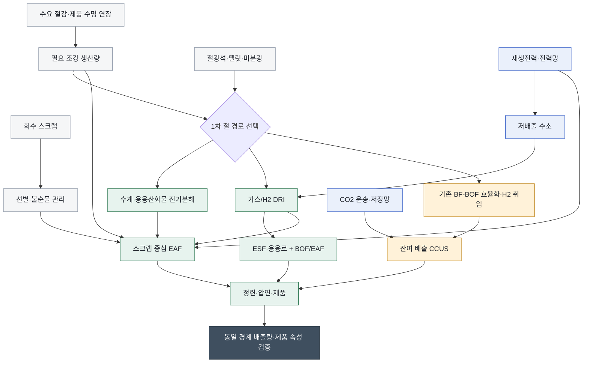

<!-- AUTO-GENERATED BY steel-intelligence. DO NOT EDIT. -->

# 저탄소 제철 종합 경로 (Low-carbon Ironmaking)

> 조사 기준일: **2026-07-25** · 공식·1차 자료 중심 · 사실과 AI 분석을 구분해 작성

??? info "관련 기술 바로가기 · 현재 위치: 통합·운영 기술"

    탐색을 위한 편의 분류이며 기술 우열이나 확정된 공정 관계를 뜻하지 않습니다.

    **환원·용융 경로**

    [[technologies/TEC-hydrogen-direct-reduced-iron|수소 직접환원철 (Hydrogen DRI)]] · [[technologies/TEC-hydrogen-based-fine-ore-reduction|무펠릿 미분광 수소환원 (Fluidized-bed Hydrogen Reduction)]] · [[technologies/TEC-electric-smelting-furnace|전기용융로 (Electric Smelting Furnace)]] · [[technologies/TEC-hydrogen-plasma-smelting-reduction|수소 플라즈마 제련]] · [[technologies/TEC-microwave-biomass-ironmaking|마이크로웨이브·바이오매스 제철]]

    **전해 기반 경로**

    [[technologies/TEC-molten-oxide-electrolysis|용융산화물 전기분해 (Molten Oxide Electrolysis)]] · [[technologies/TEC-low-temperature-aqueous-iron-electrolysis|저온 수계 전해제철 (Aqueous Iron Electrolysis)]]

    **기존 설비·순환 경로**

    [[technologies/TEC-blast-furnace-ccus|고로 CCUS]] · [[technologies/TEC-high-grade-eaf-and-scrap-impurity-removal|고급강 EAF·스크랩 불순물 제거]]

    **통합·운영 기술**

    **저탄소 제철 종합 경로 (Low-carbon Ironmaking) · 현재** · [[technologies/TEC-smart-steelworks|스마트 제철소 (Smart Steelworks)]]

{ .steel-media-image .steel-hero-image .steel-media-detail }

*대표 이미지 — Tenova Consteerrer 전자기 교반 장치의 전기로 하부 내부 구성도. 광양 설비에 적용된 기술의 범용 공급사 도면이며 POSCO 광양 전기로의 준공도(as-built)는 아님 (장치 구성도 · 권리 `link_only` · 출처 [[sources/SRC-20260725-C888600A|SRC-20260725-C888600A]] · [원문 페이지](https://tenova.com/technologies/electric-arc-furnaces-eaf))*

!!! abstract "한눈에 보기"

    | 항목 | 내용 |
    | --- | --- |
    | **분류 (편집)** | 제철소·공급망 단위의 다중 경로 전환 체계 |
    | **핵심 원리** | 철광석·스크랩에서 조강까지의 물질·에너지·탄소 흐름을 대상으로, 기존 자산 개조와 신규 저배출 공정을 단계적으로 조합하는 제철소·공급망 전환 체계이다. [^src-20260725-38165abc] |

## 개요

철광석·스크랩에서 조강까지의 물질·에너지·탄소 흐름을 대상으로, 기존 자산 개조와 신규 저배출 공정을 단계적으로 조합하는 제철소·공급망 전환 체계이다. [^src-20260725-38165abc]

이 문서는 개별 반응기의 우열을 정하는 문서가 아닙니다. 1차 철과 스크랩, 기존 고로 자산과 신규 설비, 전력·수소·CO2 인프라, 제품 인증을 하나의 전환 포트폴리오로 연결해 읽습니다.

- **근거 확인 기업:** 9개
- **직접 연결 근거:** 16건

## 작동 원리

- **작동 원리:** 수요·재활용으로 1차 철 수요를 줄이고, 남은 1차 생산은 수소·전기화·CCUS 등 지역별 최적 경로로 전환하며, 동일한 배출 경계로 감축을 검증한다. [^src-20260725-38165abc]

## 공정 구성

**색상 범례 (AI 재구성):** 회색=수요·원료 · 황색=기존 자산의 교량 경로 · 녹색=공정 전환 · 청색=외부 인프라 · 진회색=동일 경계 검증

!!! note "도식 해석"

    위 흐름도는 공개 자료의 단계를 비교하기 쉽게 재구성한 것입니다. 실제 물질수지·전해액 조성·셀 배열을 뜻하는 설계도는 아닙니다. [^src-20260725-38165abc]

## 주요 기술 특성

### 반응·셀·공정

| 구분 | 공개된 내용 | 근거 성격 |
| --- | --- | --- |
| **작동 원리** | 수요·재활용으로 1차 철 수요를 줄이고, 남은 1차 생산은 수소·전기화·CCUS 등 지역별 최적 경로로 전환하며, 동일한 배출 경계로 감축을 검증한다. [^src-20260725-38165abc] | 정부·공공자료 |
| **전환 경로 정의** | 저탄소 제철은 단일 반응기 교체가 아니라 수소, CCUS, 바이오에너지, 직접 전기화, 자원 효율, 재활용을 지역 여건에 맞춰 조합하는 전환 포트폴리오이다. [^src-20260725-38165abc] | 정부·공공자료 |
| **경로 포트폴리오** | 주요 경로는 스크랩 전기로, 천연가스 또는 수소 DRI-EAF, CCUS 결합 DRI, CCUS 결합 혁신 고로·용융환원, 전기분해 등으로 구분되며 잔여·상류 배출이 서로 다르다. [^src-20260725-38165abc] | 정부·공공자료 |

### 원료·운전·제품

| 구분 | 공개된 내용 | 근거 성격 |
| --- | --- | --- |
| **스크랩 경로 에너지 이점** | 스크랩 기반 전기로 생산은 철광석 기반 생산 에너지의 약 8분의 1이 필요하다는 IEA 분석이 있다. [^src-20260725-38165abc] | 정부·공공자료 |
| **스크랩 공급 제약** | 스크랩 공급은 사회 내 철강 축적량과 제품 수명에 좌우되므로, 재활용 확대만으로 1차 철 생산 수요를 제거할 수 없다. [^src-20260725-38165abc] | 정부·공공자료 |
| **스크랩 비율 보정** | ResponsibleSteel은 스크랩의 제약·지역 편중과 단순 재배분의 탄소누출 위험을 반영하기 위해 스크랩 비율에 따라 문턱이 달라지는 비교 방식을 사용한다. [^src-20260725-9b4ddcdd] | 기타 |

### 에너지·환경·경제

| 구분 | 공개된 내용 | 근거 성격 |
| --- | --- | --- |
| **전력 인프라 시나리오** | IEA 지속가능발전 시나리오에서 철강 부문의 2050년 추가 전력 수요는 720 TWh이며, 당시 철강 전력소비의 약 60%에 해당한다. [^src-20260725-38165abc] | 정부·공공자료 |
| **수소 DRI 경쟁 조건** | IEA 시나리오에서는 재생전력 가격이 USD 20~30/MWh인 지역이 수소 DRI 경쟁 우위를 가질 수 있으나, 실제성은 수소·전력·원료 조건에 좌우된다. [^src-20260725-38165abc] | 정부·공공자료 |
| **CCUS 배치 시나리오** | IEA 지속가능발전 시나리오의 철강 CO2 포집량은 2050년 약 0.4 Gt이며, 2030년부터 1 MtCO2/년급 설비를 2~3주마다 배치하는 규모에 해당한다. [^src-20260725-38165abc] | 정부·공공자료 |
| **비교 배출 경계** | 배출량 비교는 순제로에 부합하는 시스템 경계와 범위, 전력 처리, 부산물·크레딧 규칙을 정렬해야 하며 모든 생산시설 간 비교가 가능해야 한다. [^src-20260725-238e8691] | 정부·공공자료 |
| **데이터 품질 요구** | 일반 배출계수보다 사업장·제품별 감사 가능한 실측 데이터를 우선하고, 세분성·투명성·정기성을 갖춘 자료 수집이 필요하다. [^src-20260725-238e8691] | 정부·공공자료 |
| **산정 방법론 한계** | IEA가 검토한 기존 철강 배출량 산정·데이터 프레임워크 중 제안된 순제로 원칙을 모두 충족하는 단일 체계나 조합은 없었다. [^src-20260725-238e8691] | 정부·공공자료 |
| **초기 비용 프리미엄** | 초기 근제로배출 철강·시멘트의 생산비 프리미엄은 지역과 기술에 따라 기존 공정 대비 약 10~125%로 추정됐다. [^src-20260725-bd336973] | 정부·공공자료 |
| **외부 인프라 의존성** | 저배출 수소, 발전·송배전망, CO2 운송·저장 인프라는 제철소 외부 조건이지만 저탄소 경로의 가동률·배출량·원가를 결정하는 필수 구성요소이다. [^src-20260725-bd336973] | 정부·공공자료 |
| **Progress Level 1 문턱 예시** | ResponsibleSteel Progress Level 1 예시에서 스크랩 20% 사업장은 2.34 tCO2e/t 이하, 스크랩 80% 사업장은 0.96 tCO2e/t 이하이며 Scope 1·2와 상류 Scope 3를 포함한다. [^src-20260725-9b4ddcdd] | 기타 |

### 실증·산업화

| 구분 | 공개된 내용 | 근거 성격 |
| --- | --- | --- |
| **수소 DRI 배치 속도 시나리오** | IEA 지속가능발전 시나리오는 시장 도입 뒤 전 세계적으로 수소 DRI 플랜트를 월 1기꼴로 배치해야 하는 속도를 제시했다. [^src-20260725-38165abc] | 정부·공공자료 |
| **2030 근제로 용량 격차** | 2025년 IEA 집계에서 2030년 발표된 근제로배출 철 기반 철강 생산능력은 약 10 Mt로, 순제로 경로에서 필요한 양의 약 10%였다. [^src-20260725-bd336973] | 정부·공공자료 |
| **오프테이크 격차** | 2030년까지 물량이 공개된 근제로배출 철강 오프테이크는 연간 2 Mt 미만이고, 추가 구매 의향 약 3 Mt는 아직 충족되지 않은 상태였다. [^src-20260725-bd336973] | 정부·공공자료 |
| **자산 재투자 창** | 세계 철강 생산설비의 약 15%가 2035년 전후 재투자 결정을 맞으므로, 이번 투자주기에 전환 가능성과 좌초 위험을 함께 검토해야 한다. [^src-20260725-bd336973] | 정부·공공자료 |
| **탄소 고착 위험** | 2025년 기준 200 Mt를 넘는 고배출 재래식 철강 생산능력이 계획 또는 가동 예정이어서 명확한 전환 설계 없는 신규 투자는 탄소 고착 위험이 있다. [^src-20260725-bd336973] | 정부·공공자료 |
| **2026 발표 파이프라인** | IEA ETP 2026에 따르면 2020년 이후 발표된 근제로배출 철강 생산능력은 105 Mt로 현재 생산의 약 5%이며 같은 기간 추가된 재래식 생산능력의 약 두 배였다. [^src-20260725-79d4b2ed] | 정부·공공자료 |
| **FID 전환 비율** | 2020년 이후 발표된 근제로배출 철강 생산능력 105 Mt 가운데 최종투자결정에 도달한 비중은 2026년 IEA 집계상 5%에 불과했다. [^src-20260725-79d4b2ed] | 정부·공공자료 |
| **전기분해 산업화 시계** | 철광석 전기분해는 잠재적으로 변혁적이지만 기술·비용 장벽이 큰 초기 단계로, IEA는 10년 안에 유의미한 시장점유율 도달 가능성을 낮게 보았다. [^src-20260725-79d4b2ed] | 정부·공공자료 |
| **실행 단계 판독 기준** | 실행 진척은 발표 → 자금·인허가 → FID → 착공 → 시운전 → 램프업 → 검증된 제품 생산 순으로 구분해야 하며, 앞 단계 용량을 가동능력으로 합산하면 안 된다. [^src-20260725-79d4b2ed] | 정부·공공자료 |
| **독립 검증 요구** | ResponsibleSteel 진척도 인증은 인정받은 독립 인증기관의 감사를 요구하므로 회사 자체 선언과 제3자 검증 제품 주장을 구분할 수 있다. [^src-20260725-9b4ddcdd] | 기타 |

## 공개 개발 연혁

| 날짜 | 공개 사건 |
| --- | --- |
| 2020-10-08 | Iron and Steel Technology Roadmap [^src-20260725-38165abc] |
| 2023-04-04 | Emissions Measurement and Data Collection for a Net Zero Steel Industry [^src-20260725-238e8691] |
| 2023-06-07 | Tenova for POSCO Gwangyang plant [^src-20260725-c888600a] |
| 2024-09-23 | The Decarbonisation Progress Levels [^src-20260725-9b4ddcdd] |
| 2025-01-06 | JFE Steel 2025 priorities for carbon-neutral technologies [^src-20260725-ec77a362] |
| 2025-03-19 | Demand and Supply Measures for the Steel and Cement Transition [^src-20260725-bd336973] |
| 2025-09-17 | SSAB begins construction of new Luleå electric steel mill [^src-20260725-31601585] |
| 2025-09-29 | Tata Steel Nederland integrated decarbonisation project letter of intent [^src-20260725-789ab58f] |
| 2026-01-07 | China launches first million-tonne near-zero-carbon steel line at Baowu [^src-20260725-7e8abc86] |
| 2026-02-10 | ArcelorMittal confirms €1.3bn Dunkirk EAF construction [^src-20260725-61382798] |
| 2026-06-22 | POSCO completes Gwangyang EAF and advances HyREX [^src-20260725-b859ca04] |
| 2026-07-01 | Energy Technology Perspectives 2026 executive summary [^src-20260725-79d4b2ed] |

## 설비·공정 이미지

{ .steel-media-image .steel-media-compact }

**실제 설비 사진.** SSAB Luleå 신규 전기제철소 기공식 현장

- 출처 [[sources/SRC-20260725-31601585|SRC-20260725-31601585]] · 권리 `link_only` · [원문 페이지](https://www.ssab.com/en/news/2025/09/the-deputy-prime-minister-and-ssabs-ceo-broke-ground-on-a-new-steel-mill-in-lule) · 작성·촬영 SSAB / official press image
- 권리 메모: SSAB 공식 보도자료의 기공식 사진입니다. 재사용 권한을 별도 확인하지 않아 원문 링크로만 표시합니다.

{ .steel-media-image .steel-media-compact }

**실제 설비 사진.** IEA 철강 기술 로드맵 대표 이미지: 철강 소재와 전환 경로를 다루는 공식 보고서 표지 사진

- 출처 [[sources/SRC-20260725-38165ABC|SRC-20260725-38165ABC]] · 권리 `link_only` · [원문 페이지](https://www.iea.org/reports/iron-and-steel-technology-roadmap) · 작성·촬영 International Energy Agency / source-page credited stock image
- 권리 메모: IEA 공식 보고서 페이지의 대표 이미지입니다. 재사용 권한을 별도 확인하지 않아 다운로드하지 않고 원문 링크로만 표시합니다.

{ .steel-media-image .steel-media-compact }

**실제 설비 사진.** thyssenkrupp Duisburg 직접환원탑 첫 18 m 지지기둥 설치 현장

- 출처 [[sources/SRC-20260725-8D0BD4B8|SRC-20260725-8D0BD4B8]] · 권리 `link_only` · [원문 페이지](https://transformation.thyssenkrupp-steel.com/startseite.html) · 작성·촬영 thyssenkrupp Steel Europe
- 권리 메모: thyssenkrupp Steel 공식 프로젝트 사이트의 실제 공사 사진입니다. 재사용 권한을 별도 확인하지 않아 원문 링크로만 표시합니다.

{ .steel-media-image .steel-media-detail }

**공정 개념도.** ResponsibleSteel 탈탄소 진척도 수준 설명도: 스크랩 비율을 고려해 사업장 배출 성과를 비교하는 공식 도표

- 출처 [[sources/SRC-20260725-9B4DDCDD|SRC-20260725-9B4DDCDD]] · 권리 `link_only` · [원문 페이지](https://www.responsiblesteel.org/resources/the-decarbonisation-progress-levels) · 작성·촬영 ResponsibleSteel
- 권리 메모: ResponsibleSteel 공식 원문에 게시된 설명도입니다. 재사용 권한을 별도 확인하지 않아 다운로드하지 않고 원문 링크로만 표시합니다.

{ .steel-media-image .steel-media-detail }

**장치 구성도.** Tenova 전기로 본체·전극 승강부·출강 용기 배치를 보여주는 범용 3D 장치 구성도. POSCO 광양 전기로의 준공도(as-built)는 아님

- 출처 [[sources/SRC-20260725-C888600A|SRC-20260725-C888600A]] · 권리 `link_only` · [원문 페이지](https://tenova.com/technologies/electric-arc-furnaces-eaf) · 작성·촬영 Tenova
- 권리 메모: Tenova 공식 기술 페이지에서 원본을 확인했습니다. 재사용 권한을 별도 확인하지 않아 원격 링크로만 표시하며, 광양 프로젝트의 준공도는 아닙니다.

## 기업별 상세 현황

### [[companies/COM-POSCO|POSCO]]

**확인된 현황.** 광양 2.5 Mtpa 전기로를 2026년 6월 준공해 저탄소강 생산 착수; 약 KRW 600bn 투자, 고급강용 합탕·스크랩·성분제어 기술 개발 중 [^src-20260725-b859ca04]

**단계 판단: 준공·가동 준비.** 설비 구축 완료는 확인되지만 안정적인 상용 생산까지 확인된 것은 아닙니다. 시운전, 가동률과 실제 제품 출하를 후속 자료로 확인해야 합니다.

- **날짜:** 발표 2026-06-22 · 수집 2026-07-25 · 검증 2026-07-25

### [[companies/COM-ArcelorMittal|ArcelorMittal]]

**확인된 현황.** Dunkirk 2 Mtpa EAF 건설 확정, €1.3bn 투자, 2029 가동 목표; scrap·HBI/DRI·hot metal 혼합 투입 [^src-20260725-61382798]

**단계 판단: 계획·투자.** 기업의 방향성과 자원 투입 의지는 확인되지만 실제 설비 성능이나 상용 운전이 입증된 단계는 아닙니다.

- **날짜:** 발표 2026-02-10 · 수집 2026-07-25 · 검증 2026-07-25

### [[companies/COM-China-Baowu|China Baowu Steel Group]]

**확인된 현황.** Zhanjiang 1 Mtpa near-zero-carbon 고급 후판 생산라인 전 공정 준공 [^src-20260725-7e8abc86]

**단계 판단: 준공·가동 준비.** 설비 구축 완료는 확인되지만 안정적인 상용 생산까지 확인된 것은 아닙니다. 시운전, 가동률과 실제 제품 출하를 후속 자료로 확인해야 합니다.

- **날짜:** 발표 2026-01-07 · 수집 2026-07-25 · 검증 2026-07-25

### [[companies/COM-Nippon-Steel|Nippon Steel]]

**확인된 현황.** 수소 DRI·대형 EAF 고급강·고로 수소취입의 3개 핵심 경로를 시험설비에서 개발 [^src-20260725-45a1d063]

**단계 판단: 연구·실증.** 기술 가능성을 검증하는 단계입니다. 시험 규모의 성공을 상용 생산성과로 해석하지 않고 규모 확대 계획을 따로 확인해야 합니다.

- **날짜:** 발표 미상 · 수집 2026-07-25 · 검증 2026-07-25

### [[companies/COM-JFE-Steel|JFE Steel]]

**확인된 현황.** carbon-recycling BF·수소 DRI·대형 EAF 3개 축; Kurashiki 대형 EAF 전환 및 Chiba EAF 건설 계획 [^src-20260725-ec77a362]

**단계 판단: 계획·투자.** 기업의 방향성과 자원 투입 의지는 확인되지만 실제 설비 성능이나 상용 운전이 입증된 단계는 아닙니다.

- **날짜:** 발표 2025-01-06 · 수집 2026-07-25 · 검증 2026-07-25

### [[companies/COM-Tata-Steel|Tata Steel]]

**확인된 현황.** scrap EAF 확대, Nederland DRI-EAF, 인도 수소·CCU scale-up의 복수 경로 [^src-20260725-6c80084b][^src-20260725-789ab58f]

**단계 판단: 공식 현황 확인.** 공식 자료에서 관련 움직임은 확인되지만 단계 구분에 필요한 일정·설비·운전 정보가 충분하지 않습니다.

- **날짜:** 발표 2025-09-29 · 수집 2026-07-25 · 검증 2026-07-25

### [[companies/COM-thyssenkrupp-Steel|thyssenkrupp Steel]]

**확인된 현황.** tkH2Steel DR-melter 전환 프로젝트 건설 중; 수소 사용 시 연 3.5 Mt 이상 CO2 회피 목표 [^src-20260725-8d0bd4b8]

**단계 판단: 건설·구축.** 설비 투자가 물리적 실행 단계에 들어갔습니다. 준공 일정, 공사비 변동과 시운전 결과가 다음 판단 기준입니다.

- **날짜:** 발표 미상 · 수집 2026-07-25 · 검증 2026-07-25

### [[companies/COM-SSAB|SSAB]]

**확인된 현황.** Luleå 2.5 Mtpa 전기제철소 건설 착수; fossil-free sponge iron·scrap과 2기 EAF 구성 [^src-20260725-31601585]

**단계 판단: 공식 현황 확인.** 공식 자료에서 관련 움직임은 확인되지만 단계 구분에 필요한 일정·설비·운전 정보가 충분하지 않습니다.

- **날짜:** 발표 2025-09-17 · 수집 2026-07-25 · 검증 2026-07-25

### [[companies/COM-Nucor|Nucor]]

**확인된 현황.** 재활용 scrap 기반 EAF가 주력; 2025 worldsteel 기준 0.77 tCO2e/t steel, 평균 재활용 함량 79.1% [^src-20260725-aa686449]

**단계 판단: 공식 현황 확인.** 공식 자료에서 관련 움직임은 확인되지만 단계 구분에 필요한 일정·설비·운전 정보가 충분하지 않습니다.

- **날짜:** 발표 미상 · 수집 2026-07-25 · 검증 2026-07-25

## 관련 프로젝트

기술의 실제 확대 단계를 확인할 수 있도록 프로젝트 문서와 현재 상태를 직접 연결합니다. 각 프로젝트 문서에는 최근 상태뿐 아니라 확인 가능한 전체 일정 이력이 표시됩니다.

| 프로젝트 | 현재 확인 상태 | 일정·규모 |
| --- | --- | --- |
| **[[projects/PRJ-POSCO-GWANGYANG-EAF|POSCO 광양 250만 톤 전기로]]** | 2026-06-17 준공 후 저탄소강 생산 개시 [^src-20260725-b859ca04] | **연간 생산능력** 연간 2,500,000톤 [^src-20260725-b859ca04] · **목표 시운전 시점** 2025년 말 생산 진입 예정(2023년 공급사 계획; 실제 준공·생산은 2026-06-17 확인) [^src-20260725-c888600a] |
| **[[projects/PRJ-SSAB-LULEA-ELECTRIC-MILL|SSAB Luleå 신규 전기제철소]]** | 2025-09-17 기공 후 신규 전기제철소 건설 중 [^src-20260725-31601585] | **연간 생산능력** 연간 2,500,000톤 [^src-20260725-31601585] · **목표 가동 시점** 2029년 말 가동 목표 [^src-20260725-31601585] |
| **[[projects/PRJ-TK-H2STEEL-DUISBURG|thyssenkrupp Duisburg tkH2Steel]]** | 2024년 말 본 공사에 착수했고 2026-02 직접환원탑 철골 설치 단계 [^src-20260725-8d0bd4b8] | **연간 생산능력** 연간 DRI 2,500,000톤 [^src-20260725-8d0bd4b8] · **목표 시운전 시점** 2027년 시운전 개시 목표 [^src-20260725-8d0bd4b8] |

## 기술적 쟁점과 미공개 데이터

!!! warning "AI 분석 — 공개 근거와 구분"

    기업별 단계는 인용된 공식 발표 문구를 기준으로 분류한 것으로, 정식 TRL 판정이나 기술 경쟁력 순위가 아닙니다.

- **추가 확인이 필요한 데이터:** 발표·MOU와 FID·착공·준공·램프업을 분리하고, 철광석 품위와 스크랩 추가성, 실제 수소 비율, 전력 탄소집약도, CO2 영구저장량, 제품별 Scope 1·2·상류 Scope 3 및 제3자 검증 출하량을 같은 기준으로 확인해야 합니다.
- 기업 간 비교에는 시험 규모, 실제 투입 원료·에너지 조건, 상용 운전 실적과 제품 단위 배출량을 같은 기준으로 적용해야 합니다.
- 스크랩 EAF는 가장 빠른 감축 수단이지만 세계 스크랩 총량은 축적된 철강재와 제품 수명에 묶여 있습니다. 기존 스크랩을 한 사업장이 더 사오는 것과 세계 순배출이 줄어드는 것은 같지 않으므로 스크랩 비율 보정과 추가 회수량을 함께 확인해야 합니다.
- 천연가스 DRI를 ‘수소 전환 가능’으로 설계하는 것은 기술적 선택권을 남기지만, 수소 공급망·개조 시점·보장된 전력원이 없으면 장기간 가스 운전으로 고착될 수 있습니다. capable, planned, FID, operating을 서로 다른 상태로 표시해야 합니다.
- 고로 CCUS는 기존 자산을 활용하는 교량 경로가 될 수 있으나 코크스오븐·소결·자가발전 등 제철소의 분산 배출을 모두 포집하는 것은 아닙니다. 포집률보다 조강 1톤 기준 순회피량과 영구 저장량이 비교 지표에 더 가깝습니다.
- DRI-EAF와 DRI-ESF는 고품위 펠릿과 저품위 광석 대응력이 다릅니다. 설비 투자비 비교만으로는 부족하고 펠릿 프리미엄, 슬래그량, 전력·수소 원단위, 기존 BOF·연주 활용가치를 포함한 시스템 비용으로 비교해야 합니다.
- 발표 용량은 운영 용량이 아닙니다. 2026년 IEA 집계에서 2020년 이후 발표된 근제로배출 철강 용량 105 Mt 중 FID 도달 비중은 5%였으므로, 공정 명칭보다 자금·인허가·FID·착공·시운전·램프업의 증거 사슬이 중요합니다.
- 제품 배출량은 Scope 1만 표시하면 전기로의 전력과 DRI의 수소·펠릿 배출이 가려집니다. 최소한 Scope 1·2와 상류 Scope 3, 스크랩·부산물·인증서의 배분 규칙을 같은 경계로 맞춰야 기업 간 비교가 가능합니다.

## POSCO 관점 시사점

!!! info "AI 분석 — 전략 검토용"

    다음 내용은 공개 근거를 바탕으로 한 비교 분석이며, POSCO의 공식 결정이나 투자 권고가 아닙니다.

- 광양 250만 톤 전기로는 이미 준공·생산 단계인 교량 자산이고, HyREX 30만 톤 실증은 개발·부지 준비 단계입니다. 두 용량을 같은 ‘저탄소 생산능력’으로 합산하지 말고 제품군·원료·가동률별로 분리 관리해야 합니다.
- POSCO 경로의 핵심 비교축은 HyREX 반응기만이 아니라 광양 EAF의 스크랩·용선 혼합, 미분광 조달, 재생전력과 수소 공급, 필요 시 ESF/BOF 연계까지 이어지는 포트폴리오입니다. 각 자산의 수명과 다음 투자 결정 시점을 하나의 마스터 타임라인으로 묶는 것이 필요합니다.
- 선행 모니터링 지표는 발표 용량이 아니라 FID 비율, 착공 진척, 실제 저배출 원료 투입량, 연속 운전시간, 제품별 Scope 1·2·상류 Scope 3, 스크랩 추가성, 전력·수소 탄소집약도와 인증된 출하량입니다.

## 출처

- [[sources/SRC-20260725-238E8691|Emissions Measurement and Data Collection for a Net Zero Steel Industry]] — International Energy Agency, 2023-04-04 · [원문](https://www.iea.org/reports/emissions-measurement-and-data-collection-for-a-net-zero-steel-industry)
- [[sources/SRC-20260725-31601585|SSAB begins construction of new Luleå electric steel mill]] — SSAB, 2025-09-17 · [원문](https://www.ssab.com/en/news/2025/09/the-deputy-prime-minister-and-ssabs-ceo-broke-ground-on-a-new-steel-mill-in-lule)
- [[sources/SRC-20260725-38165ABC|Iron and Steel Technology Roadmap]] — International Energy Agency, 2020-10-08 · [원문](https://www.iea.org/reports/iron-and-steel-technology-roadmap)
- [[sources/SRC-20260725-45A1D063|Nippon Steel research and development for carbon-neutral steelmaking]] — Nippon Steel Corporation, 게시일 미상 · [원문](https://www.nipponsteel.com/en/sustainability/quality/rd.html)
- [[sources/SRC-20260725-61382798|ArcelorMittal confirms €1.3bn Dunkirk EAF construction]] — ArcelorMittal, 2026-02-10 · [원문](https://corporate.arcelormittal.com/media/news/regulatory-news/arcelormittal-confirms-the-construction-of-an-electric-arc-furnace-in-dunkirk-france-a-13-billion-investment-supporting-an-important-step-in-its-decarbonisation)
- [[sources/SRC-20260725-6C80084B|Tata Steel climate action technology roadmap]] — Tata Steel, 게시일 미상 · [원문](https://www.tatasteel.com/sustainability/environment/climate-action/)
- [[sources/SRC-20260725-789AB58F|Tata Steel Nederland integrated decarbonisation project letter of intent]] — Tata Steel, 2025-09-29 · [원문](https://www.tatasteel.com/newsroom/press-releases/india/2025/tata-steel-signs-the-non-binding-joint-letter-of-intent-with-the-government-of-the-netherlands-and-the-province-of-north-holland-on-integrated-decarbonisation-and-health-measures-project/)
- [[sources/SRC-20260725-79D4B2ED|Energy Technology Perspectives 2026 executive summary]] — International Energy Agency, 2026-07-01 · [원문](https://www.iea.org/reports/energy-technology-perspectives-2026/executive-summary)
- [[sources/SRC-20260725-7E8ABC86|China launches first million-tonne near-zero-carbon steel line at Baowu]] — State-owned Assets Supervision and Administration Commission of China, 2026-01-07 · [원문](https://en.sasac.gov.cn/2026/01/07/c_20292.htm)
- [[sources/SRC-20260725-8D0BD4B8|thyssenkrupp Steel direct-reduction transformation project status]] — thyssenkrupp Steel Europe, 게시일 미상 · [원문](https://transformation.thyssenkrupp-steel.com/startseite.html)
- [[sources/SRC-20260725-9B4DDCDD|The Decarbonisation Progress Levels]] — ResponsibleSteel, 2024-09-23 · [원문](https://www.responsiblesteel.org/resources/the-decarbonisation-progress-levels)
- [[sources/SRC-20260725-AA686449|Nucor sustainability and EAF steelmaking profile]] — Nucor Corporation, 게시일 미상 · [원문](https://nucor.com/sustainability/)
- [[sources/SRC-20260725-B859CA04|POSCO completes Gwangyang EAF and advances HyREX]] — POSCO Group Newsroom, 2026-06-22 · [원문](https://newsroom.posco.com/en/posco-accelerates-transition-to-decarbonized-production-system-with-completion-of-koreas-largest-electric-arc-furnace/)
- [[sources/SRC-20260725-BD336973|Demand and Supply Measures for the Steel and Cement Transition]] — International Energy Agency, 2025-03-19 · [원문](https://www.iea.org/reports/demand-and-supply-measures-for-the-steel-and-cement-transition)
- [[sources/SRC-20260725-C888600A|Tenova for POSCO Gwangyang plant]] — Tenova, 2023-06-07 · [원문](https://tenova.com/newsroom/latest-tenova/tenova-posco-gwangyang-plant)
- [[sources/SRC-20260725-EC77A362|JFE Steel 2025 priorities for carbon-neutral technologies]] — JFE Steel Corporation, 2025-01-06 · [원문](https://www.jfe-steel.co.jp/en/release/2025/01/250106.html)

[^src-20260725-238e8691]: **Emissions Measurement and Data Collection for a Net Zero Steel Industry** — International Energy Agency, 2023-04-04. [원문](https://www.iea.org/reports/emissions-measurement-and-data-collection-for-a-net-zero-steel-industry) · [[sources/SRC-20260725-238E8691|보관 원문·메타데이터]]
[^src-20260725-31601585]: **SSAB begins construction of new Luleå electric steel mill** — SSAB, 2025-09-17. [원문](https://www.ssab.com/en/news/2025/09/the-deputy-prime-minister-and-ssabs-ceo-broke-ground-on-a-new-steel-mill-in-lule) · [[sources/SRC-20260725-31601585|보관 원문·메타데이터]]
[^src-20260725-38165abc]: **Iron and Steel Technology Roadmap** — International Energy Agency, 2020-10-08. [원문](https://www.iea.org/reports/iron-and-steel-technology-roadmap) · [[sources/SRC-20260725-38165ABC|보관 원문·메타데이터]]
[^src-20260725-45a1d063]: **Nippon Steel research and development for carbon-neutral steelmaking** — Nippon Steel Corporation, 게시일 미상. [원문](https://www.nipponsteel.com/en/sustainability/quality/rd.html) · [[sources/SRC-20260725-45A1D063|보관 원문·메타데이터]]
[^src-20260725-61382798]: **ArcelorMittal confirms €1.3bn Dunkirk EAF construction** — ArcelorMittal, 2026-02-10. [원문](https://corporate.arcelormittal.com/media/news/regulatory-news/arcelormittal-confirms-the-construction-of-an-electric-arc-furnace-in-dunkirk-france-a-13-billion-investment-supporting-an-important-step-in-its-decarbonisation) · [[sources/SRC-20260725-61382798|보관 원문·메타데이터]]
[^src-20260725-6c80084b]: **Tata Steel climate action technology roadmap** — Tata Steel, 게시일 미상. [원문](https://www.tatasteel.com/sustainability/environment/climate-action/) · [[sources/SRC-20260725-6C80084B|보관 원문·메타데이터]]
[^src-20260725-789ab58f]: **Tata Steel Nederland integrated decarbonisation project letter of intent** — Tata Steel, 2025-09-29. [원문](https://www.tatasteel.com/newsroom/press-releases/india/2025/tata-steel-signs-the-non-binding-joint-letter-of-intent-with-the-government-of-the-netherlands-and-the-province-of-north-holland-on-integrated-decarbonisation-and-health-measures-project/) · [[sources/SRC-20260725-789AB58F|보관 원문·메타데이터]]
[^src-20260725-79d4b2ed]: **Energy Technology Perspectives 2026 executive summary** — International Energy Agency, 2026-07-01. [원문](https://www.iea.org/reports/energy-technology-perspectives-2026/executive-summary) · [[sources/SRC-20260725-79D4B2ED|보관 원문·메타데이터]]
[^src-20260725-7e8abc86]: **China launches first million-tonne near-zero-carbon steel line at Baowu** — State-owned Assets Supervision and Administration Commission of China, 2026-01-07. [원문](https://en.sasac.gov.cn/2026/01/07/c_20292.htm) · [[sources/SRC-20260725-7E8ABC86|보관 원문·메타데이터]]
[^src-20260725-8d0bd4b8]: **thyssenkrupp Steel direct-reduction transformation project status** — thyssenkrupp Steel Europe, 게시일 미상. [원문](https://transformation.thyssenkrupp-steel.com/startseite.html) · [[sources/SRC-20260725-8D0BD4B8|보관 원문·메타데이터]]
[^src-20260725-9b4ddcdd]: **The Decarbonisation Progress Levels** — ResponsibleSteel, 2024-09-23. [원문](https://www.responsiblesteel.org/resources/the-decarbonisation-progress-levels) · [[sources/SRC-20260725-9B4DDCDD|보관 원문·메타데이터]]
[^src-20260725-aa686449]: **Nucor sustainability and EAF steelmaking profile** — Nucor Corporation, 게시일 미상. [원문](https://nucor.com/sustainability/) · [[sources/SRC-20260725-AA686449|보관 원문·메타데이터]]
[^src-20260725-b859ca04]: **POSCO completes Gwangyang EAF and advances HyREX** — POSCO Group Newsroom, 2026-06-22. [원문](https://newsroom.posco.com/en/posco-accelerates-transition-to-decarbonized-production-system-with-completion-of-koreas-largest-electric-arc-furnace/) · [[sources/SRC-20260725-B859CA04|보관 원문·메타데이터]]
[^src-20260725-bd336973]: **Demand and Supply Measures for the Steel and Cement Transition** — International Energy Agency, 2025-03-19. [원문](https://www.iea.org/reports/demand-and-supply-measures-for-the-steel-and-cement-transition) · [[sources/SRC-20260725-BD336973|보관 원문·메타데이터]]
[^src-20260725-c888600a]: **Tenova for POSCO Gwangyang plant** — Tenova, 2023-06-07. [원문](https://tenova.com/newsroom/latest-tenova/tenova-posco-gwangyang-plant) · [[sources/SRC-20260725-C888600A|보관 원문·메타데이터]]
[^src-20260725-ec77a362]: **JFE Steel 2025 priorities for carbon-neutral technologies** — JFE Steel Corporation, 2025-01-06. [원문](https://www.jfe-steel.co.jp/en/release/2025/01/250106.html) · [[sources/SRC-20260725-EC77A362|보관 원문·메타데이터]]
