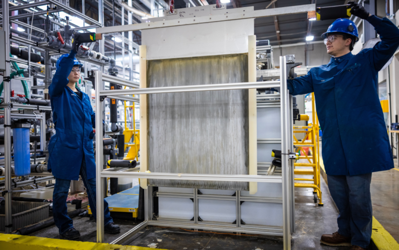
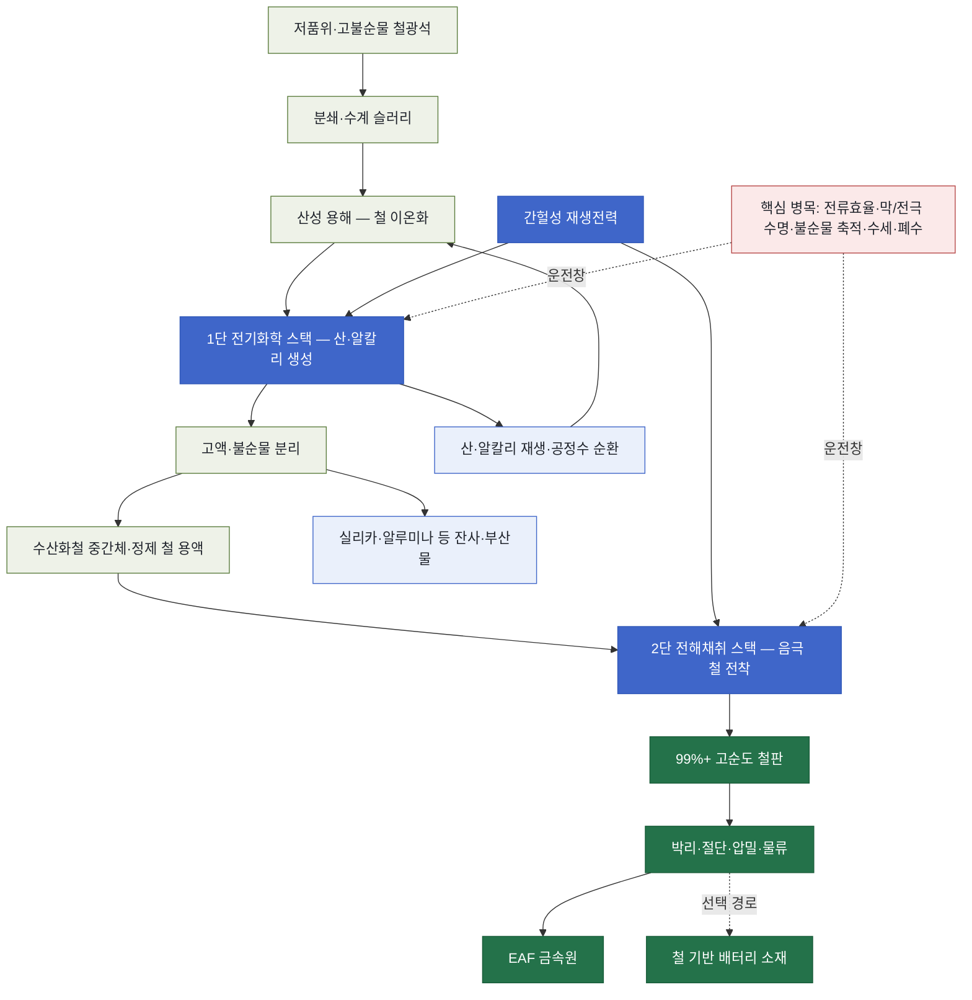

<!-- AUTO-GENERATED BY steel-intelligence. DO NOT EDIT. -->

# 저온 수계 전해제철 (Aqueous Iron Electrolysis)

> 조사 기준일: **2026-07-25** · 공식·1차 자료 중심 · 사실과 AI 분석을 구분해 작성

??? info "관련 기술 바로가기 · 현재 위치: 전해 기반 경로"

    탐색을 위한 편의 분류이며 기술 우열이나 확정된 공정 관계를 뜻하지 않습니다.

    **환원·용융 경로**

    [[technologies/TEC-hydrogen-direct-reduced-iron|수소 직접환원철 (Hydrogen DRI)]] · [[technologies/TEC-hydrogen-based-fine-ore-reduction|무펠릿 미분광 수소환원 (Fluidized-bed Hydrogen Reduction)]] · [[technologies/TEC-electric-smelting-furnace|전기용융로 (Electric Smelting Furnace)]] · [[technologies/TEC-hydrogen-plasma-smelting-reduction|수소 플라즈마 용융환원 (HPSR)]] · [[technologies/TEC-microwave-biomass-ironmaking|마이크로웨이브·바이오매스 환원제철 (BioIron)]]

    **전해 기반 경로**

    [[technologies/TEC-molten-oxide-electrolysis|용융산화물 전기분해 (Molten Oxide Electrolysis)]] · **저온 수계 전해제철 (Aqueous Iron Electrolysis) · 현재**

    **기존 설비·순환 경로**

    [[technologies/TEC-blast-furnace-ccus|고로 CCUS]] · [[technologies/TEC-high-grade-eaf-and-scrap-impurity-removal|고급강 EAF·스크랩 불순물 제거]]

    **통합·운영 기술**

    [[technologies/TEC-low-carbon-ironmaking|저탄소 제철 종합 경로 (Low-carbon Ironmaking)]] · [[technologies/TEC-smart-steelworks|스마트 제철소 (Smart Steelworks)]]

{ .steel-media-image .steel-hero-image .steel-media-compact }

*대표 이미지 — Electra 파일럿 설비에서 대형 전착 철판을 점검하는 연구진 (실제 설비 사진 · 권리 `permitted` · 출처 [[sources/SRC-20260725-D6930918|SRC-20260725-D6930918]] · [원문 페이지](https://www.electra.earth/))*

!!! abstract "한눈에 보기"

    | 항목 | 내용 |
    | --- | --- |
    | **분류 (편집)** | 저온 전기화학·습식제련 기반 철 생산 |
    | **핵심 원리** | 산성 수용액에 철광석을 용해하고 공존 광물을 분리하면서 산을 재생한 뒤, 전기를 가해 금속판 위에 철을 전착하는 저온 전기화학·습식제련 경로 [^src-20260725-d6930918] |
    | **운전 온도** | Electra 파일럿 발표 기준 140°F(약 60°C) [^src-20260725-3d62f9a6] |
    | **제품 순도** | Electra 주장 기준 99% 초과 순도의 철 [^src-20260725-3d62f9a6] |
    | **적용 원료** | 이미 채굴됐으나 고불순물 때문에 상업적으로 활용되지 못한 광석을 포함한 폭넓은 철광석 [^src-20260725-3d62f9a6] |
    | **후단 활용** | 생산 철은 전기로(EAF) 제강 원료 또는 철 기반 배터리 소재로 사용 가능 [^src-20260725-d6930918] |

## 개요

산성 수용액에 철광석을 용해하고 공존 광물을 분리하면서 산을 재생한 뒤, 전기를 가해 금속판 위에 철을 전착하는 저온 전기화학·습식제련 경로 [^src-20260725-d6930918]

이 문서에서 다루는 경로는 고온 용융염 전기분해가 아니라, 광석을 수용액에서 용해·분리한 뒤 철을 전착하는 저온 경로입니다.

- **근거 확인 기업:** 2개
- **직접 연결 근거:** 5건

## 작동 원리

- **전해 셀 구성:** 산·염기 생성 및 원료 분리를 담당하는 첫 번째 전기화학 셀 스택과, 수산화철을 금속 철로 바꾸는 전해채취 셀 스택의 2단 구성 [^src-20260725-133d1c12]

## 공정 구성

**색상 범례 (AI 재구성):** 녹회색=원료·용해·분리 · 청색=전기화학 스택·전력 · 연청색=약품·공정수 순환과 잔사 · 녹색=철 제품·후단 · 적색=확대 운전 병목

!!! note "도식 해석"

    위 흐름도는 Electra와 ARPA-E가 공개한 2단 전기화학 개념을 기능 단위로 재구성한 것입니다. 실제 전해액 조성, 막·전극 재료, 셀 직렬·병렬 배열, 물질수지와 폐수처리 설계는 공개되지 않았습니다. [^src-20260725-133d1c12][^src-20260725-d6930918]

## 주요 기술 특성

### 반응·셀·공정

| 구분 | 공개된 내용 | 근거 성격 |
| --- | --- | --- |
| **전해 셀 구성** | 산·염기 생성 및 원료 분리를 담당하는 첫 번째 전기화학 셀 스택과, 수산화철을 금속 철로 바꾸는 전해채취 셀 스택의 2단 구성 [^src-20260725-133d1c12] | 정부·공공자료 |

### 원료·운전·제품

| 구분 | 공개된 내용 | 근거 성격 |
| --- | --- | --- |
| **운전 온도** | Electra 파일럿 발표 기준 140°F(약 60°C) [^src-20260725-3d62f9a6] | 회사 발표 |
| **적용 원료** | 이미 채굴됐으나 고불순물 때문에 상업적으로 활용되지 못한 광석을 포함한 폭넓은 철광석 [^src-20260725-3d62f9a6] | 회사 발표 |
| **제품 순도** | Electra 주장 기준 99% 초과 순도의 철 [^src-20260725-3d62f9a6] | 회사 발표 |
| **전력 운전 유연성** | 저온 공정 특성을 이용해 간헐성 재생전력의 가용 시간에 맞춰 생산을 동기화할 수 있다는 회사 주장 [^src-20260725-d6930918] | 회사 발표 |
| **후단 활용** | 생산 철은 전기로(EAF) 제강 원료 또는 철 기반 배터리 소재로 사용 가능 [^src-20260725-d6930918] | 회사 발표 |

## 공개 개발 연혁

| 날짜 | 공개 사건 |
| --- | --- |
| 2023-06-14 | ArcelorMittal and John Cockerill develop Volteron low-temperature electrolysis [^src-20260725-a6716adb] |
| 2024-03-27 | Electra Launches Pilot Plant to Advance Commercialization of Sustainable Clean Iron Production [^src-20260725-3d62f9a6] |
| 2026-04-28 | POSCO and Electra partner on low-temperature clean iron [^src-20260725-4c014458] |

## 설비·공정 이미지

{ .steel-media-image .steel-media-compact }

**실제 설비 사진.** Electra Boulder 파일럿의 저온 철 전해채취 셀에서 생산한 철판을 점검하는 연구진

- 출처 [[sources/SRC-20260725-3D62F9A6|SRC-20260725-3D62F9A6]] · 권리 `link_only` · [원문 페이지](https://www.businesswire.com/news/home/20240327121089/en/Electra-Launches-Pilot-Plant-to-Advance-Commercialization-of-Sustainable-Clean-Iron-Production) · 작성·촬영 Electra / Business Wire
- 권리 메모: 공식 보도자료 이미지이나 재사용 권리가 명확하지 않아 원문 링크만 보존

## 기업별 상세 현황

### [[companies/COM-POSCO|POSCO]]

**확인된 현황.** Electra와 저온 전기화학 철 생산 공동개발·투자; 연산 500톤 시범공장의 상업화 기술·경제성 공동 검증 단계 [^src-20260725-4c014458]

**단계 판단: 계획·투자.** 기업의 방향성과 자원 투입 의지는 확인되지만 실제 설비 성능이나 상용 운전이 입증된 단계는 아닙니다.

- **날짜:** 발표 2026-04-28 · 수집 2026-07-25 · 검증 2026-07-25

### [[companies/COM-ArcelorMittal|ArcelorMittal]]

**확인된 현황.** Volteron 저온 직접 전해 공정의 파일럿 철판 생산 확인 후 산업 규모 설비 개발 계획 단계 [^src-20260725-a6716adb]

**단계 판단: 연구·실증.** 기술 가능성을 검증하는 단계입니다. 시험 규모의 성공을 상용 생산성과로 해석하지 않고 규모 확대 계획을 따로 확인해야 합니다.

- **날짜:** 발표 2023-06-14 · 수집 2026-07-25 · 검증 2026-07-25

## 관련 프로젝트

기술의 실제 확대 단계를 확인할 수 있도록 프로젝트 문서와 현재 상태를 직접 연결합니다. 각 프로젝트 문서에는 최근 상태뿐 아니라 확인 가능한 전체 일정 이력이 표시됩니다.

| 프로젝트 | 현재 확인 상태 | 일정·규모 |
| --- | --- | --- |
| **[[projects/PRJ-ELECTRA-CLEAN-IRON-DEMO|Electra 청정철 시범공장]]** | 2026년 가동 목표로 시범공장 건설 중 [^src-20260725-4c014458] | **연간 생산능력** 연간 500톤 (500 tpy) [^src-20260725-4c014458] · **목표 가동 시점** 2026년 [^src-20260725-4c014458] |

## 기술적 쟁점과 미공개 데이터

!!! warning "AI 분석 — 공개 근거와 구분"

    기업별 단계는 인용된 공식 발표 문구를 기준으로 분류한 것으로, 정식 TRL 판정이나 기술 경쟁력 순위가 아닙니다.

- **추가 확인이 필요한 데이터:** 전력원단위·전류효율, 산·알칼리·공정수 회수율, 광종별 철 회수와 불순물 거동, 막·전극 수명, 스택 가동률, 전착 철판 자동 회수, 500 tpy 실제 월간 생산량과 EAF 장입 시험, 다음 규모 투자 결정을 확인해야 합니다.
- 기업 간 비교에는 시험 규모, 실제 투입 원료·에너지 조건, 상용 운전 실적과 제품 단위 배출량을 같은 기준으로 적용해야 합니다.
- 저온이라는 표현은 공정 전체의 에너지 부담이 작다는 뜻이 아닙니다. 광석 분쇄·용해, 산·알칼리 재생, 불순물 분리, 전해채취, 철판 박리·건조·압밀과 공정수 처리를 모두 포함한 kWh/t-Fe와 시약 보충량이 필요합니다.
- 두 개의 전기화학 스택은 역할이 다릅니다. 첫 스택은 산·염기와 원료 정제를 담당하고 두 번째 스택은 금속 철을 전착하므로, 어느 한쪽의 전류효율·막 저항·가동률이 낮아도 전체 생산능력과 원가가 제한됩니다.
- 고불순물 광석 수용 능력은 불순물이 사라진다는 뜻이 아니라 용액·고체 잔사로 이동한다는 뜻입니다. Al·Si·P·Ti·Mg와 미량금속이 용해·침전·막 오염·제품 순도에 미치는 영향과 부산물 판로를 광종별로 확인해야 합니다.
- 철 전착은 수소발생과 경쟁할 수 있으므로 pH, 철 이온 농도, 전류밀도, 온도와 유동이 전류효율·표면 형상·박리성에 함께 영향을 줍니다. 99%+ 순도만으로 산업 생산성이나 낮은 전력원단위를 입증할 수 없습니다.
- 간헐 재생전력 추종은 저온 공정의 잠재 장점이지만 정지·재가동 때 용액 조성, 침전, 막 수화, 전극 표면과 열수지가 안정적으로 복원돼야 합니다. 단순 부하 감축 가능성과 빈번한 사이클 운전 수명을 구분해야 합니다.
- 전착 철판은 고로 용선이나 DRI와 물성·물류가 다릅니다. 두께·취성·표면 수분, 산소·수소·잔류염, 절단·압밀 밀도와 EAF 장입 거동이 후단 수율과 에너지에 미치는 영향을 확인해야 합니다.
- 연산 500 t 시범공장은 상용 제철소보다 여러 자릿수 작습니다. 핵심 확대 지표는 명목 용량보다 셀 면적당 전류, 연속 캠페인 시간, 스택 가용률, 막·전극 교체주기, 제품 회수 자동화와 실제 월간 생산량입니다.

## POSCO 관점 시사점

!!! info "AI 분석 — 전략 검토용"

    다음 내용은 공개 근거를 바탕으로 한 비교 분석이며, POSCO의 공식 결정이나 투자 권고가 아닙니다.

- POSCO와 Electra의 공동검증은 HyREX·전기로와 경쟁시키기보다 원료·전력 조건이 다른 선택지로 비교해야 합니다. 동일 광석 기준 선광·펠릿화 회피 편익과 습식 분쇄·약품·전해·폐수 부담을 하나의 시스템 경계에서 계산할 필요가 있습니다.
- 광양 전기로 투입 시험 전에는 전착 철의 벌크밀도, 수분·염소·황·인·수소, 용해속도, 슬래그량, Fe 수율과 장입 자동화를 검증해야 합니다. 고순도 수치와 자동차강판용 실제 금속원 적합성은 같은 판단이 아닙니다.
- 국내에서의 경제성은 전력가격뿐 아니라 산·알칼리 순환, 용수·폐수, 불순물 잔사 처리와 광석 물류에 민감합니다. 저가 재생전력 시간대 추종이 설비 이용률 저하를 상쇄하는지 시간대별 운전모델로 확인해야 합니다.
- 우선 모니터링 지표는 kWh/t-Fe, 전류효율, 셀 전압·전류밀도, 스택 가용률, 막·전극 수명, 산·알칼리·물 보충량, 광종별 철 회수율, 제품 순도·수분·잔류염, 잔사량, 월간 생산량과 EAF 용해 성과입니다.

## 출처

- [[sources/SRC-20260725-133D1C12|ROSIE Project Descriptions: Electra Low-Temperature Green Ironmaking]] — U.S. Department of Energy ARPA-E, 게시일 미상 · [원문](https://arpa-e.energy.gov/sites/default/files/2025-04/ARPA-E%20Project%20Descriptions_ROSIE_R25.1.pdf)
- [[sources/SRC-20260725-3D62F9A6|Electra Launches Pilot Plant to Advance Commercialization of Sustainable Clean Iron Production]] — Electra / Business Wire, 2024-03-27 · [원문](https://www.businesswire.com/news/home/20240327121089/en/Electra-Launches-Pilot-Plant-to-Advance-Commercialization-of-Sustainable-Clean-Iron-Production)
- [[sources/SRC-20260725-4C014458|POSCO and Electra partner on low-temperature clean iron]] — POSCO Group Newsroom, 2026-04-28 · [원문](https://newsroom.posco.com/kr/%ED%8F%AC%EC%8A%A4%EC%BD%94-%EC%A0%80%ED%83%84%EC%86%8C-%EC%A0%9C%EC%B2%A0-%EA%B8%B0%EC%88%A0-%EB%B3%B4%EC%9C%A0-%E7%BE%8E-%ED%98%81%EC%8B%A0%EA%B8%B0%EC%97%85-%EC%9D%BC%EB%A0%89%ED%8A%B8%EB%9D%BC/)
- [[sources/SRC-20260725-A6716ADB|ArcelorMittal and John Cockerill develop Volteron low-temperature electrolysis]] — ArcelorMittal, 2023-06-14 · [원문](https://corporate.arcelormittal.com/media/news/regulatory-news/arcelormittal-and-john-cockerill-announce-plans-to-develop-world-s-first-industrial-scale-low-temperature-iron-electrolysis-plant)
- [[sources/SRC-20260725-D6930918|Electra Technology: How the low-temperature iron process works]] — Electra, 게시일 미상 · [원문](https://www.electra.earth/our-technology/)

[^src-20260725-133d1c12]: **ROSIE Project Descriptions: Electra Low-Temperature Green Ironmaking** — U.S. Department of Energy ARPA-E, 게시일 미상. [원문](https://arpa-e.energy.gov/sites/default/files/2025-04/ARPA-E%20Project%20Descriptions_ROSIE_R25.1.pdf) · [[sources/SRC-20260725-133D1C12|보관 원문·메타데이터]]
[^src-20260725-3d62f9a6]: **Electra Launches Pilot Plant to Advance Commercialization of Sustainable Clean Iron Production** — Electra / Business Wire, 2024-03-27. [원문](https://www.businesswire.com/news/home/20240327121089/en/Electra-Launches-Pilot-Plant-to-Advance-Commercialization-of-Sustainable-Clean-Iron-Production) · [[sources/SRC-20260725-3D62F9A6|보관 원문·메타데이터]]
[^src-20260725-4c014458]: **POSCO and Electra partner on low-temperature clean iron** — POSCO Group Newsroom, 2026-04-28. [원문](https://newsroom.posco.com/kr/%ED%8F%AC%EC%8A%A4%EC%BD%94-%EC%A0%80%ED%83%84%EC%86%8C-%EC%A0%9C%EC%B2%A0-%EA%B8%B0%EC%88%A0-%EB%B3%B4%EC%9C%A0-%E7%BE%8E-%ED%98%81%EC%8B%A0%EA%B8%B0%EC%97%85-%EC%9D%BC%EB%A0%89%ED%8A%B8%EB%9D%BC/) · [[sources/SRC-20260725-4C014458|보관 원문·메타데이터]]
[^src-20260725-a6716adb]: **ArcelorMittal and John Cockerill develop Volteron low-temperature electrolysis** — ArcelorMittal, 2023-06-14. [원문](https://corporate.arcelormittal.com/media/news/regulatory-news/arcelormittal-and-john-cockerill-announce-plans-to-develop-world-s-first-industrial-scale-low-temperature-iron-electrolysis-plant) · [[sources/SRC-20260725-A6716ADB|보관 원문·메타데이터]]
[^src-20260725-d6930918]: **Electra Technology: How the low-temperature iron process works** — Electra, 게시일 미상. [원문](https://www.electra.earth/our-technology/) · [[sources/SRC-20260725-D6930918|보관 원문·메타데이터]]
